Main Figures and Results
================
Michael Sieler
12 August, 2024

## Experimental Design Schematic

Fig.1 Experimental design showing treatments and husbandry events during
the course of the study. Symbols indicate when an experimental event
occurred at each time point. (1) 260 fish were assigned and acclimated
to one of three water temperature groups (e.g., 28°C, 32°C, or 35°C) and
reared from 0 to 164 days post fertilization (dpf). (2a) At 164 dpf (or
0 days post exposure; DPE), fecal collections were collected from a
random selection of five fish per tank (n = 60). Additionally,
histological and wet mount assessments were conducted on selected fish
to assess presence of infection and infection burden. (1b) Afterwards, a
cohort of fish from each water temperature group were exposed to
Pseudocapillaria tomentosa. (3-6) Subsequent fecal samples were
collected and histopathological assessments were conducted at 14 dpe (n
= 54), (3) 21 dpe (n = 48), (4) 28 dpe (n = 47), and (5) 42 dpe (n =
51).

## Results

### 2) Water temperature shapes gut microbiome structure

Fig. 2 Effects of water temperature on gut microbiomes of parasite
unexposed zebrafish. (A) Simpson’s Index of diversity shows that gut
microbiome diversity significantly differs between fish reared at 28°C
and 35°C water temperatures. (B) Capscale ordination based on the
Bray-Curtis dissimilarity of gut microbiome composition. The analysis
shows that gut microbiome composition significantly differs between fish
reared at different water temperatures. (C) Simpson’s Index of diversity
shows microbial gut diversity increases with time from 0 days post
exposure (dpe) to 42 dpe, irrespective of water temperature. (D)
Capscale ordination of gut microbiome composition based on the
Bray-Curtis dissimilarity constrained on the main effects of water
temperature and time, and their interaction. The analysis shows that
shows that gut microbiome composition differs between fish across time
depending on water temperature. Ribbons and ellipses indicate 95%
confidence interval. Only statistically significant relationships are
shown. A “\*” indicates statistical significance below the “0.05” level.
Black arrows indicate direction of greatest change in the indicated
covariates.

#### 2A)

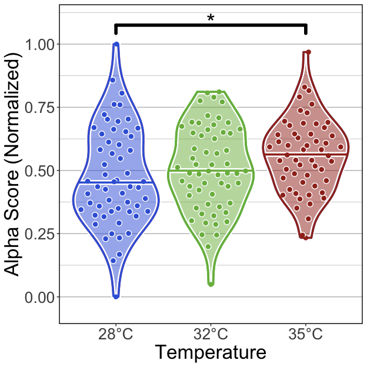<!-- -->

##### Tables

###### (hide)

Press on tabs to display tables. Scroll to see additional rows.

###### GLM

<table class="gt_table" data-quarto-disable-processing="false" data-quarto-bootstrap="false">
  <thead>
    <tr class="gt_heading">
      <td colspan="6" class="gt_heading gt_title gt_font_normal" style>GLM Results</td>
    </tr>
    <tr class="gt_heading">
      <td colspan="6" class="gt_heading gt_subtitle gt_font_normal gt_bottom_border" style>glm(Alpha.Score ~ Temperature); Unexposed fish</td>
    </tr>
    <tr class="gt_col_headings">
      <th class="gt_col_heading gt_columns_bottom_border gt_left" rowspan="1" colspan="1" scope="col" id="term">term</th>
      <th class="gt_col_heading gt_columns_bottom_border gt_right" rowspan="1" colspan="1" scope="col" id="estimate">estimate</th>
      <th class="gt_col_heading gt_columns_bottom_border gt_right" rowspan="1" colspan="1" scope="col" id="std.error">std.error</th>
      <th class="gt_col_heading gt_columns_bottom_border gt_right" rowspan="1" colspan="1" scope="col" id="statistic">statistic</th>
      <th class="gt_col_heading gt_columns_bottom_border gt_right" rowspan="1" colspan="1" scope="col" id="p.value">p.value</th>
      <th class="gt_col_heading gt_columns_bottom_border gt_left" rowspan="1" colspan="1" scope="col" id="p.adj.sig">p.adj.sig</th>
    </tr>
  </thead>
  <tbody class="gt_table_body">
    <tr class="gt_group_heading_row">
      <th colspan="6" class="gt_group_heading" scope="colgroup" id="Shannon">Shannon</th>
    </tr>
    <tr class="gt_row_group_first"><td headers="Shannon  term" class="gt_row gt_left">(Intercept)</td>
<td headers="Shannon  estimate" class="gt_row gt_right">−0.754</td>
<td headers="Shannon  std.error" class="gt_row gt_right">0.091</td>
<td headers="Shannon  statistic" class="gt_row gt_right">−8.309</td>
<td headers="Shannon  p.value" class="gt_row gt_right">&lt;0.001</td>
<td headers="Shannon  p.adj.sig" class="gt_row gt_left">****</td></tr>
    <tr><td headers="Shannon  term" class="gt_row gt_left">Temperature32</td>
<td headers="Shannon  estimate" class="gt_row gt_right">0.051</td>
<td headers="Shannon  std.error" class="gt_row gt_right">0.127</td>
<td headers="Shannon  statistic" class="gt_row gt_right">0.400</td>
<td headers="Shannon  p.value" class="gt_row gt_right">≥0.25</td>
<td headers="Shannon  p.adj.sig" class="gt_row gt_left">ns</td></tr>
    <tr><td headers="Shannon  term" class="gt_row gt_left">Temperature35</td>
<td headers="Shannon  estimate" class="gt_row gt_right">0.054</td>
<td headers="Shannon  std.error" class="gt_row gt_right">0.129</td>
<td headers="Shannon  statistic" class="gt_row gt_right">0.421</td>
<td headers="Shannon  p.value" class="gt_row gt_right">≥0.25</td>
<td headers="Shannon  p.adj.sig" class="gt_row gt_left">ns</td></tr>
    <tr class="gt_group_heading_row">
      <th colspan="6" class="gt_group_heading" scope="colgroup" id="Simpson">Simpson</th>
    </tr>
    <tr class="gt_row_group_first"><td headers="Simpson  term" class="gt_row gt_left">(Intercept)</td>
<td headers="Simpson  estimate" class="gt_row gt_right">−0.101</td>
<td headers="Simpson  std.error" class="gt_row gt_right">0.092</td>
<td headers="Simpson  statistic" class="gt_row gt_right">−1.103</td>
<td headers="Simpson  p.value" class="gt_row gt_right">≥0.25</td>
<td headers="Simpson  p.adj.sig" class="gt_row gt_left">ns</td></tr>
    <tr><td headers="Simpson  term" class="gt_row gt_left">Temperature32</td>
<td headers="Simpson  estimate" class="gt_row gt_right">0.132</td>
<td headers="Simpson  std.error" class="gt_row gt_right">0.128</td>
<td headers="Simpson  statistic" class="gt_row gt_right">1.030</td>
<td headers="Simpson  p.value" class="gt_row gt_right">≥0.25</td>
<td headers="Simpson  p.adj.sig" class="gt_row gt_left">ns</td></tr>
    <tr><td headers="Simpson  term" class="gt_row gt_left">Temperature35</td>
<td headers="Simpson  estimate" class="gt_row gt_right">0.340</td>
<td headers="Simpson  std.error" class="gt_row gt_right">0.131</td>
<td headers="Simpson  statistic" class="gt_row gt_right">2.591</td>
<td headers="Simpson  p.value" class="gt_row gt_right">0.010</td>
<td headers="Simpson  p.adj.sig" class="gt_row gt_left">*</td></tr>
    <tr class="gt_group_heading_row">
      <th colspan="6" class="gt_group_heading" scope="colgroup" id="Richness">Richness</th>
    </tr>
    <tr class="gt_row_group_first"><td headers="Richness  term" class="gt_row gt_left">(Intercept)</td>
<td headers="Richness  estimate" class="gt_row gt_right">−0.231</td>
<td headers="Richness  std.error" class="gt_row gt_right">0.075</td>
<td headers="Richness  statistic" class="gt_row gt_right">−3.079</td>
<td headers="Richness  p.value" class="gt_row gt_right">0.002</td>
<td headers="Richness  p.adj.sig" class="gt_row gt_left">**</td></tr>
    <tr><td headers="Richness  term" class="gt_row gt_left">Temperature32</td>
<td headers="Richness  estimate" class="gt_row gt_right">0.047</td>
<td headers="Richness  std.error" class="gt_row gt_right">0.105</td>
<td headers="Richness  statistic" class="gt_row gt_right">0.446</td>
<td headers="Richness  p.value" class="gt_row gt_right">≥0.25</td>
<td headers="Richness  p.adj.sig" class="gt_row gt_left">ns</td></tr>
    <tr><td headers="Richness  term" class="gt_row gt_left">Temperature35</td>
<td headers="Richness  estimate" class="gt_row gt_right">−0.473</td>
<td headers="Richness  std.error" class="gt_row gt_right">0.110</td>
<td headers="Richness  statistic" class="gt_row gt_right">−4.299</td>
<td headers="Richness  p.value" class="gt_row gt_right">&lt;0.001</td>
<td headers="Richness  p.adj.sig" class="gt_row gt_left">****</td></tr>
  </tbody>
  &#10;  
</table>

###### ANOVA

<table class="gt_table" data-quarto-disable-processing="false" data-quarto-bootstrap="false">
  <thead>
    <tr class="gt_heading">
      <td colspan="5" class="gt_heading gt_title gt_font_normal" style>ANOVA of GLM</td>
    </tr>
    <tr class="gt_heading">
      <td colspan="5" class="gt_heading gt_subtitle gt_font_normal gt_bottom_border" style>ANOVA(GLM(Alpha.Score ~ Temperature), type = 2); Unexposed fish</td>
    </tr>
    <tr class="gt_col_headings">
      <th class="gt_col_heading gt_columns_bottom_border gt_left" rowspan="1" colspan="1" scope="col" id="term">term</th>
      <th class="gt_col_heading gt_columns_bottom_border gt_right" rowspan="1" colspan="1" scope="col" id="statistic">statistic</th>
      <th class="gt_col_heading gt_columns_bottom_border gt_right" rowspan="1" colspan="1" scope="col" id="df">df</th>
      <th class="gt_col_heading gt_columns_bottom_border gt_right" rowspan="1" colspan="1" scope="col" id="p.value">p.value</th>
      <th class="gt_col_heading gt_columns_bottom_border gt_left" rowspan="1" colspan="1" scope="col" id="sig">sig</th>
    </tr>
  </thead>
  <tbody class="gt_table_body">
    <tr class="gt_group_heading_row">
      <th colspan="5" class="gt_group_heading" scope="colgroup" id="Shannon">Shannon</th>
    </tr>
    <tr class="gt_row_group_first"><td headers="Shannon  term" class="gt_row gt_left">Temperature</td>
<td headers="Shannon  statistic" class="gt_row gt_right">0.225</td>
<td headers="Shannon  df" class="gt_row gt_right">2.000</td>
<td headers="Shannon  p.value" class="gt_row gt_right">≥0.25</td>
<td headers="Shannon  sig" class="gt_row gt_left">ns</td></tr>
    <tr class="gt_group_heading_row">
      <th colspan="5" class="gt_group_heading" scope="colgroup" id="Simpson">Simpson</th>
    </tr>
    <tr class="gt_row_group_first"><td headers="Simpson  term" class="gt_row gt_left">Temperature</td>
<td headers="Simpson  statistic" class="gt_row gt_right">6.830</td>
<td headers="Simpson  df" class="gt_row gt_right">2.000</td>
<td headers="Simpson  p.value" class="gt_row gt_right">0.033</td>
<td headers="Simpson  sig" class="gt_row gt_left">*</td></tr>
    <tr class="gt_group_heading_row">
      <th colspan="5" class="gt_group_heading" scope="colgroup" id="Richness">Richness</th>
    </tr>
    <tr class="gt_row_group_first"><td headers="Richness  term" class="gt_row gt_left">Temperature</td>
<td headers="Richness  statistic" class="gt_row gt_right">27.512</td>
<td headers="Richness  df" class="gt_row gt_right">2.000</td>
<td headers="Richness  p.value" class="gt_row gt_right">&lt;0.001</td>
<td headers="Richness  sig" class="gt_row gt_left">****</td></tr>
  </tbody>
  &#10;  
</table>

###### Tukey

<table class="gt_table" data-quarto-disable-processing="false" data-quarto-bootstrap="false">
  <thead>
    <tr class="gt_heading">
      <td colspan="9" class="gt_heading gt_title gt_font_normal" style>Pairwise Tukey's HSD, p.adj: Dunnett</td>
    </tr>
    <tr class="gt_heading">
      <td colspan="9" class="gt_heading gt_subtitle gt_font_normal gt_bottom_border" style>Tukey(Alpha.Score ~ Temperature); Unexposed fish</td>
    </tr>
    <tr class="gt_col_headings">
      <th class="gt_col_heading gt_columns_bottom_border gt_left" rowspan="1" colspan="1" scope="col" id="term">term</th>
      <th class="gt_col_heading gt_columns_bottom_border gt_left" rowspan="1" colspan="1" scope="col" id=".y.">.y.</th>
      <th class="gt_col_heading gt_columns_bottom_border gt_right" rowspan="1" colspan="1" scope="col" id="group1">group1</th>
      <th class="gt_col_heading gt_columns_bottom_border gt_right" rowspan="1" colspan="1" scope="col" id="group2">group2</th>
      <th class="gt_col_heading gt_columns_bottom_border gt_right" rowspan="1" colspan="1" scope="col" id="estimate">estimate</th>
      <th class="gt_col_heading gt_columns_bottom_border gt_right" rowspan="1" colspan="1" scope="col" id="std.error">std.error</th>
      <th class="gt_col_heading gt_columns_bottom_border gt_right" rowspan="1" colspan="1" scope="col" id="statistic">statistic</th>
      <th class="gt_col_heading gt_columns_bottom_border gt_right" rowspan="1" colspan="1" scope="col" id="adj.p.value">adj.p.value</th>
      <th class="gt_col_heading gt_columns_bottom_border gt_left" rowspan="1" colspan="1" scope="col" id="Variable">Variable</th>
    </tr>
  </thead>
  <tbody class="gt_table_body">
    <tr class="gt_group_heading_row">
      <th colspan="9" class="gt_group_heading" scope="colgroup" id="Shannon">Shannon</th>
    </tr>
    <tr class="gt_row_group_first"><td headers="Shannon  term" class="gt_row gt_left">Temperature</td>
<td headers="Shannon  .y." class="gt_row gt_left">Alpha.Score</td>
<td headers="Shannon  group1" class="gt_row gt_right">32</td>
<td headers="Shannon  group2" class="gt_row gt_right">28</td>
<td headers="Shannon  estimate" class="gt_row gt_right">0.051</td>
<td headers="Shannon  std.error" class="gt_row gt_right">0.127</td>
<td headers="Shannon  statistic" class="gt_row gt_right">0.400</td>
<td headers="Shannon  adj.p.value" class="gt_row gt_right">≥0.25</td>
<td headers="Shannon  Variable" class="gt_row gt_left">Temperature</td></tr>
    <tr><td headers="Shannon  term" class="gt_row gt_left">Temperature</td>
<td headers="Shannon  .y." class="gt_row gt_left">Alpha.Score</td>
<td headers="Shannon  group1" class="gt_row gt_right">35</td>
<td headers="Shannon  group2" class="gt_row gt_right">28</td>
<td headers="Shannon  estimate" class="gt_row gt_right">0.054</td>
<td headers="Shannon  std.error" class="gt_row gt_right">0.129</td>
<td headers="Shannon  statistic" class="gt_row gt_right">0.421</td>
<td headers="Shannon  adj.p.value" class="gt_row gt_right">≥0.25</td>
<td headers="Shannon  Variable" class="gt_row gt_left">Temperature</td></tr>
    <tr><td headers="Shannon  term" class="gt_row gt_left">Temperature</td>
<td headers="Shannon  .y." class="gt_row gt_left">Alpha.Score</td>
<td headers="Shannon  group1" class="gt_row gt_right">35</td>
<td headers="Shannon  group2" class="gt_row gt_right">32</td>
<td headers="Shannon  estimate" class="gt_row gt_right">0.004</td>
<td headers="Shannon  std.error" class="gt_row gt_right">0.127</td>
<td headers="Shannon  statistic" class="gt_row gt_right">0.029</td>
<td headers="Shannon  adj.p.value" class="gt_row gt_right">≥0.25</td>
<td headers="Shannon  Variable" class="gt_row gt_left">Temperature</td></tr>
    <tr class="gt_group_heading_row">
      <th colspan="9" class="gt_group_heading" scope="colgroup" id="Simpson">Simpson</th>
    </tr>
    <tr class="gt_row_group_first"><td headers="Simpson  term" class="gt_row gt_left">Temperature</td>
<td headers="Simpson  .y." class="gt_row gt_left">Alpha.Score</td>
<td headers="Simpson  group1" class="gt_row gt_right">32</td>
<td headers="Simpson  group2" class="gt_row gt_right">28</td>
<td headers="Simpson  estimate" class="gt_row gt_right">0.132</td>
<td headers="Simpson  std.error" class="gt_row gt_right">0.128</td>
<td headers="Simpson  statistic" class="gt_row gt_right">1.030</td>
<td headers="Simpson  adj.p.value" class="gt_row gt_right">≥0.25</td>
<td headers="Simpson  Variable" class="gt_row gt_left">Temperature</td></tr>
    <tr><td headers="Simpson  term" class="gt_row gt_left">Temperature</td>
<td headers="Simpson  .y." class="gt_row gt_left">Alpha.Score</td>
<td headers="Simpson  group1" class="gt_row gt_right">35</td>
<td headers="Simpson  group2" class="gt_row gt_right">28</td>
<td headers="Simpson  estimate" class="gt_row gt_right">0.340</td>
<td headers="Simpson  std.error" class="gt_row gt_right">0.131</td>
<td headers="Simpson  statistic" class="gt_row gt_right">2.591</td>
<td headers="Simpson  adj.p.value" class="gt_row gt_right">0.026</td>
<td headers="Simpson  Variable" class="gt_row gt_left">Temperature</td></tr>
    <tr><td headers="Simpson  term" class="gt_row gt_left">Temperature</td>
<td headers="Simpson  .y." class="gt_row gt_left">Alpha.Score</td>
<td headers="Simpson  group1" class="gt_row gt_right">35</td>
<td headers="Simpson  group2" class="gt_row gt_right">32</td>
<td headers="Simpson  estimate" class="gt_row gt_right">0.207</td>
<td headers="Simpson  std.error" class="gt_row gt_right">0.130</td>
<td headers="Simpson  statistic" class="gt_row gt_right">1.596</td>
<td headers="Simpson  adj.p.value" class="gt_row gt_right">0.247</td>
<td headers="Simpson  Variable" class="gt_row gt_left">Temperature</td></tr>
    <tr class="gt_group_heading_row">
      <th colspan="9" class="gt_group_heading" scope="colgroup" id="Richness">Richness</th>
    </tr>
    <tr class="gt_row_group_first"><td headers="Richness  term" class="gt_row gt_left">Temperature</td>
<td headers="Richness  .y." class="gt_row gt_left">Alpha.Score</td>
<td headers="Richness  group1" class="gt_row gt_right">32</td>
<td headers="Richness  group2" class="gt_row gt_right">28</td>
<td headers="Richness  estimate" class="gt_row gt_right">0.047</td>
<td headers="Richness  std.error" class="gt_row gt_right">0.105</td>
<td headers="Richness  statistic" class="gt_row gt_right">0.446</td>
<td headers="Richness  adj.p.value" class="gt_row gt_right">≥0.25</td>
<td headers="Richness  Variable" class="gt_row gt_left">Temperature</td></tr>
    <tr><td headers="Richness  term" class="gt_row gt_left">Temperature</td>
<td headers="Richness  .y." class="gt_row gt_left">Alpha.Score</td>
<td headers="Richness  group1" class="gt_row gt_right">35</td>
<td headers="Richness  group2" class="gt_row gt_right">28</td>
<td headers="Richness  estimate" class="gt_row gt_right">−0.473</td>
<td headers="Richness  std.error" class="gt_row gt_right">0.110</td>
<td headers="Richness  statistic" class="gt_row gt_right">−4.299</td>
<td headers="Richness  adj.p.value" class="gt_row gt_right">&lt;0.001</td>
<td headers="Richness  Variable" class="gt_row gt_left">Temperature</td></tr>
    <tr><td headers="Richness  term" class="gt_row gt_left">Temperature</td>
<td headers="Richness  .y." class="gt_row gt_left">Alpha.Score</td>
<td headers="Richness  group1" class="gt_row gt_right">35</td>
<td headers="Richness  group2" class="gt_row gt_right">32</td>
<td headers="Richness  estimate" class="gt_row gt_right">−0.520</td>
<td headers="Richness  std.error" class="gt_row gt_right">0.109</td>
<td headers="Richness  statistic" class="gt_row gt_right">−4.768</td>
<td headers="Richness  adj.p.value" class="gt_row gt_right">&lt;0.001</td>
<td headers="Richness  Variable" class="gt_row gt_left">Temperature</td></tr>
  </tbody>
  &#10;  
</table>

#### 2B)

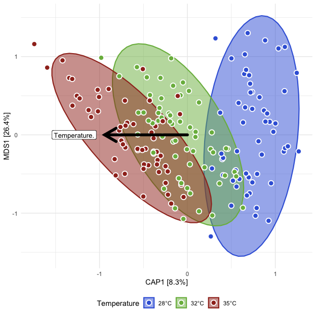<!-- -->

##### Tables

###### (hide)

Press on tabs to display tables. Scroll to see additional rows.

###### Capscale

<table class="gt_table" data-quarto-disable-processing="false" data-quarto-bootstrap="false">
  <thead>
    <tr class="gt_heading">
      <td colspan="7" class="gt_heading gt_title gt_font_normal" style>ADONIS2</td>
    </tr>
    <tr class="gt_heading">
      <td colspan="7" class="gt_heading gt_subtitle gt_font_normal gt_bottom_border" style>adonis2(Beta Distance ~ Temperature); Unexposed fish</td>
    </tr>
    <tr class="gt_col_headings">
      <th class="gt_col_heading gt_columns_bottom_border gt_left" rowspan="1" colspan="1" scope="col" id="term">term</th>
      <th class="gt_col_heading gt_columns_bottom_border gt_right" rowspan="1" colspan="1" scope="col" id="df">df</th>
      <th class="gt_col_heading gt_columns_bottom_border gt_right" rowspan="1" colspan="1" scope="col" id="SumOfSqs">SumOfSqs</th>
      <th class="gt_col_heading gt_columns_bottom_border gt_right" rowspan="1" colspan="1" scope="col" id="R2">R2</th>
      <th class="gt_col_heading gt_columns_bottom_border gt_right" rowspan="1" colspan="1" scope="col" id="statistic">statistic</th>
      <th class="gt_col_heading gt_columns_bottom_border gt_right" rowspan="1" colspan="1" scope="col" id="p.value">p.value</th>
      <th class="gt_col_heading gt_columns_bottom_border gt_right" rowspan="1" colspan="1" scope="col" id="sig">sig</th>
    </tr>
  </thead>
  <tbody class="gt_table_body">
    <tr class="gt_group_heading_row">
      <th colspan="7" class="gt_group_heading" scope="colgroup" id="bray">bray</th>
    </tr>
    <tr class="gt_row_group_first"><td headers="bray  term" class="gt_row gt_left">Temperature</td>
<td headers="bray  df" class="gt_row gt_right">2.000</td>
<td headers="bray  SumOfSqs" class="gt_row gt_right">2.294</td>
<td headers="bray  R2" class="gt_row gt_right">0.133</td>
<td headers="bray  statistic" class="gt_row gt_right">12.900</td>
<td headers="bray  p.value" class="gt_row gt_right">0.001</td>
<td headers="bray  sig" class="gt_row gt_right">***</td></tr>
    <tr><td headers="bray  term" class="gt_row gt_left">Residual</td>
<td headers="bray  df" class="gt_row gt_right">168.000</td>
<td headers="bray  SumOfSqs" class="gt_row gt_right">14.936</td>
<td headers="bray  R2" class="gt_row gt_right">0.867</td>
<td headers="bray  statistic" class="gt_row gt_right">NA</td>
<td headers="bray  p.value" class="gt_row gt_right">NA</td>
<td headers="bray  sig" class="gt_row gt_right">NA</td></tr>
    <tr><td headers="bray  term" class="gt_row gt_left">Total</td>
<td headers="bray  df" class="gt_row gt_right">170.000</td>
<td headers="bray  SumOfSqs" class="gt_row gt_right">17.229</td>
<td headers="bray  R2" class="gt_row gt_right">1.000</td>
<td headers="bray  statistic" class="gt_row gt_right">NA</td>
<td headers="bray  p.value" class="gt_row gt_right">NA</td>
<td headers="bray  sig" class="gt_row gt_right">NA</td></tr>
    <tr class="gt_group_heading_row">
      <th colspan="7" class="gt_group_heading" scope="colgroup" id="canberra">canberra</th>
    </tr>
    <tr class="gt_row_group_first"><td headers="canberra  term" class="gt_row gt_left">Temperature</td>
<td headers="canberra  df" class="gt_row gt_right">2.000</td>
<td headers="canberra  SumOfSqs" class="gt_row gt_right">3.862</td>
<td headers="canberra  R2" class="gt_row gt_right">0.099</td>
<td headers="canberra  statistic" class="gt_row gt_right">9.178</td>
<td headers="canberra  p.value" class="gt_row gt_right">0.001</td>
<td headers="canberra  sig" class="gt_row gt_right">***</td></tr>
    <tr><td headers="canberra  term" class="gt_row gt_left">Residual</td>
<td headers="canberra  df" class="gt_row gt_right">168.000</td>
<td headers="canberra  SumOfSqs" class="gt_row gt_right">35.344</td>
<td headers="canberra  R2" class="gt_row gt_right">0.901</td>
<td headers="canberra  statistic" class="gt_row gt_right">NA</td>
<td headers="canberra  p.value" class="gt_row gt_right">NA</td>
<td headers="canberra  sig" class="gt_row gt_right">NA</td></tr>
    <tr><td headers="canberra  term" class="gt_row gt_left">Total</td>
<td headers="canberra  df" class="gt_row gt_right">170.000</td>
<td headers="canberra  SumOfSqs" class="gt_row gt_right">39.206</td>
<td headers="canberra  R2" class="gt_row gt_right">1.000</td>
<td headers="canberra  statistic" class="gt_row gt_right">NA</td>
<td headers="canberra  p.value" class="gt_row gt_right">NA</td>
<td headers="canberra  sig" class="gt_row gt_right">NA</td></tr>
    <tr class="gt_group_heading_row">
      <th colspan="7" class="gt_group_heading" scope="colgroup" id="gunifrac">gunifrac</th>
    </tr>
    <tr class="gt_row_group_first"><td headers="gunifrac  term" class="gt_row gt_left">Temperature</td>
<td headers="gunifrac  df" class="gt_row gt_right">2.000</td>
<td headers="gunifrac  SumOfSqs" class="gt_row gt_right">1.422</td>
<td headers="gunifrac  R2" class="gt_row gt_right">0.102</td>
<td headers="gunifrac  statistic" class="gt_row gt_right">9.566</td>
<td headers="gunifrac  p.value" class="gt_row gt_right">0.001</td>
<td headers="gunifrac  sig" class="gt_row gt_right">***</td></tr>
    <tr><td headers="gunifrac  term" class="gt_row gt_left">Residual</td>
<td headers="gunifrac  df" class="gt_row gt_right">168.000</td>
<td headers="gunifrac  SumOfSqs" class="gt_row gt_right">12.485</td>
<td headers="gunifrac  R2" class="gt_row gt_right">0.898</td>
<td headers="gunifrac  statistic" class="gt_row gt_right">NA</td>
<td headers="gunifrac  p.value" class="gt_row gt_right">NA</td>
<td headers="gunifrac  sig" class="gt_row gt_right">NA</td></tr>
    <tr><td headers="gunifrac  term" class="gt_row gt_left">Total</td>
<td headers="gunifrac  df" class="gt_row gt_right">170.000</td>
<td headers="gunifrac  SumOfSqs" class="gt_row gt_right">13.907</td>
<td headers="gunifrac  R2" class="gt_row gt_right">1.000</td>
<td headers="gunifrac  statistic" class="gt_row gt_right">NA</td>
<td headers="gunifrac  p.value" class="gt_row gt_right">NA</td>
<td headers="gunifrac  sig" class="gt_row gt_right">NA</td></tr>
  </tbody>
  &#10;  
</table>

###### Dispersion (ANOVA)

<table class="gt_table" data-quarto-disable-processing="false" data-quarto-bootstrap="false">
  <thead>
    <tr class="gt_heading">
      <td colspan="7" class="gt_heading gt_title gt_font_normal" style>ANOVA: Homogeneity of Dispersion</td>
    </tr>
    <tr class="gt_heading">
      <td colspan="7" class="gt_heading gt_subtitle gt_font_normal gt_bottom_border" style>ANOVA(Beta Disperson ~ Temperature); Unexposed fish</td>
    </tr>
    <tr class="gt_col_headings">
      <th class="gt_col_heading gt_columns_bottom_border gt_left" rowspan="1" colspan="1" scope="col" id="term">term</th>
      <th class="gt_col_heading gt_columns_bottom_border gt_right" rowspan="1" colspan="1" scope="col" id="df">df</th>
      <th class="gt_col_heading gt_columns_bottom_border gt_right" rowspan="1" colspan="1" scope="col" id="sumsq">sumsq</th>
      <th class="gt_col_heading gt_columns_bottom_border gt_right" rowspan="1" colspan="1" scope="col" id="meansq">meansq</th>
      <th class="gt_col_heading gt_columns_bottom_border gt_right" rowspan="1" colspan="1" scope="col" id="statistic">statistic</th>
      <th class="gt_col_heading gt_columns_bottom_border gt_right" rowspan="1" colspan="1" scope="col" id="p.value">p.value</th>
      <th class="gt_col_heading gt_columns_bottom_border gt_left" rowspan="1" colspan="1" scope="col" id="sig">sig</th>
    </tr>
  </thead>
  <tbody class="gt_table_body">
    <tr class="gt_group_heading_row">
      <th colspan="7" class="gt_group_heading" scope="colgroup" id="bray">bray</th>
    </tr>
    <tr class="gt_row_group_first"><td headers="bray  term" class="gt_row gt_left">Temperature</td>
<td headers="bray  df" class="gt_row gt_right">2.000</td>
<td headers="bray  sumsq" class="gt_row gt_right">0.008</td>
<td headers="bray  meansq" class="gt_row gt_right">0.004</td>
<td headers="bray  statistic" class="gt_row gt_right">0.386</td>
<td headers="bray  p.value" class="gt_row gt_right">≥0.25</td>
<td headers="bray  sig" class="gt_row gt_left">ns</td></tr>
    <tr><td headers="bray  term" class="gt_row gt_left">Residual</td>
<td headers="bray  df" class="gt_row gt_right">168.000</td>
<td headers="bray  sumsq" class="gt_row gt_right">1.771</td>
<td headers="bray  meansq" class="gt_row gt_right">0.011</td>
<td headers="bray  statistic" class="gt_row gt_right">NA</td>
<td headers="bray  p.value" class="gt_row gt_right">NA</td>
<td headers="bray  sig" class="gt_row gt_left">NA</td></tr>
    <tr class="gt_group_heading_row">
      <th colspan="7" class="gt_group_heading" scope="colgroup" id="canberra">canberra</th>
    </tr>
    <tr class="gt_row_group_first"><td headers="canberra  term" class="gt_row gt_left">Temperature</td>
<td headers="canberra  df" class="gt_row gt_right">2.000</td>
<td headers="canberra  sumsq" class="gt_row gt_right">0.008</td>
<td headers="canberra  meansq" class="gt_row gt_right">0.004</td>
<td headers="canberra  statistic" class="gt_row gt_right">0.873</td>
<td headers="canberra  p.value" class="gt_row gt_right">≥0.25</td>
<td headers="canberra  sig" class="gt_row gt_left">ns</td></tr>
    <tr><td headers="canberra  term" class="gt_row gt_left">Residual</td>
<td headers="canberra  df" class="gt_row gt_right">168.000</td>
<td headers="canberra  sumsq" class="gt_row gt_right">0.759</td>
<td headers="canberra  meansq" class="gt_row gt_right">0.005</td>
<td headers="canberra  statistic" class="gt_row gt_right">NA</td>
<td headers="canberra  p.value" class="gt_row gt_right">NA</td>
<td headers="canberra  sig" class="gt_row gt_left">NA</td></tr>
    <tr class="gt_group_heading_row">
      <th colspan="7" class="gt_group_heading" scope="colgroup" id="gunifrac">gunifrac</th>
    </tr>
    <tr class="gt_row_group_first"><td headers="gunifrac  term" class="gt_row gt_left">Temperature</td>
<td headers="gunifrac  df" class="gt_row gt_right">2.000</td>
<td headers="gunifrac  sumsq" class="gt_row gt_right">0.005</td>
<td headers="gunifrac  meansq" class="gt_row gt_right">0.003</td>
<td headers="gunifrac  statistic" class="gt_row gt_right">0.369</td>
<td headers="gunifrac  p.value" class="gt_row gt_right">≥0.25</td>
<td headers="gunifrac  sig" class="gt_row gt_left">ns</td></tr>
    <tr><td headers="gunifrac  term" class="gt_row gt_left">Residual</td>
<td headers="gunifrac  df" class="gt_row gt_right">168.000</td>
<td headers="gunifrac  sumsq" class="gt_row gt_right">1.143</td>
<td headers="gunifrac  meansq" class="gt_row gt_right">0.007</td>
<td headers="gunifrac  statistic" class="gt_row gt_right">NA</td>
<td headers="gunifrac  p.value" class="gt_row gt_right">NA</td>
<td headers="gunifrac  sig" class="gt_row gt_left">NA</td></tr>
  </tbody>
  &#10;  
</table>

###### Dispersion (Tukey)

<table class="gt_table" data-quarto-disable-processing="false" data-quarto-bootstrap="false">
  <thead>
    <tr class="gt_heading">
      <td colspan="9" class="gt_heading gt_title gt_font_normal" style>Tukey: Homogeneity of Dispersion</td>
    </tr>
    <tr class="gt_heading">
      <td colspan="9" class="gt_heading gt_subtitle gt_font_normal gt_bottom_border" style>Tukey(Beta Disperson ~ Temperature); Unexposed fish</td>
    </tr>
    <tr class="gt_col_headings">
      <th class="gt_col_heading gt_columns_bottom_border gt_left" rowspan="1" colspan="1" scope="col" id=".y.">.y.</th>
      <th class="gt_col_heading gt_columns_bottom_border gt_left" rowspan="1" colspan="1" scope="col" id="term">term</th>
      <th class="gt_col_heading gt_columns_bottom_border gt_right" rowspan="1" colspan="1" scope="col" id="group1">group1</th>
      <th class="gt_col_heading gt_columns_bottom_border gt_right" rowspan="1" colspan="1" scope="col" id="group2">group2</th>
      <th class="gt_col_heading gt_columns_bottom_border gt_right" rowspan="1" colspan="1" scope="col" id="estimate">estimate</th>
      <th class="gt_col_heading gt_columns_bottom_border gt_right" rowspan="1" colspan="1" scope="col" id="conf.low">conf.low</th>
      <th class="gt_col_heading gt_columns_bottom_border gt_right" rowspan="1" colspan="1" scope="col" id="conf.high">conf.high</th>
      <th class="gt_col_heading gt_columns_bottom_border gt_right" rowspan="1" colspan="1" scope="col" id="adj.p.value">adj.p.value</th>
      <th class="gt_col_heading gt_columns_bottom_border gt_left" rowspan="1" colspan="1" scope="col" id="sig">sig</th>
    </tr>
  </thead>
  <tbody class="gt_table_body">
    <tr class="gt_group_heading_row">
      <th colspan="9" class="gt_group_heading" scope="colgroup" id="bray">bray</th>
    </tr>
    <tr class="gt_row_group_first"><td headers="bray  .y." class="gt_row gt_left">Distance</td>
<td headers="bray  term" class="gt_row gt_left">Temperature</td>
<td headers="bray  group1" class="gt_row gt_right">32</td>
<td headers="bray  group2" class="gt_row gt_right">28</td>
<td headers="bray  estimate" class="gt_row gt_right">−0.011</td>
<td headers="bray  conf.low" class="gt_row gt_right">−0.056</td>
<td headers="bray  conf.high" class="gt_row gt_right">0.034</td>
<td headers="bray  adj.p.value" class="gt_row gt_right">≥0.25</td>
<td headers="bray  sig" class="gt_row gt_left">ns</td></tr>
    <tr><td headers="bray  .y." class="gt_row gt_left">Distance</td>
<td headers="bray  term" class="gt_row gt_left">Temperature</td>
<td headers="bray  group1" class="gt_row gt_right">35</td>
<td headers="bray  group2" class="gt_row gt_right">28</td>
<td headers="bray  estimate" class="gt_row gt_right">0.005</td>
<td headers="bray  conf.low" class="gt_row gt_right">−0.041</td>
<td headers="bray  conf.high" class="gt_row gt_right">0.051</td>
<td headers="bray  adj.p.value" class="gt_row gt_right">≥0.25</td>
<td headers="bray  sig" class="gt_row gt_left">ns</td></tr>
    <tr><td headers="bray  .y." class="gt_row gt_left">Distance</td>
<td headers="bray  term" class="gt_row gt_left">Temperature</td>
<td headers="bray  group1" class="gt_row gt_right">35</td>
<td headers="bray  group2" class="gt_row gt_right">32</td>
<td headers="bray  estimate" class="gt_row gt_right">0.016</td>
<td headers="bray  conf.low" class="gt_row gt_right">−0.029</td>
<td headers="bray  conf.high" class="gt_row gt_right">0.062</td>
<td headers="bray  adj.p.value" class="gt_row gt_right">≥0.25</td>
<td headers="bray  sig" class="gt_row gt_left">ns</td></tr>
    <tr class="gt_group_heading_row">
      <th colspan="9" class="gt_group_heading" scope="colgroup" id="canberra">canberra</th>
    </tr>
    <tr class="gt_row_group_first"><td headers="canberra  .y." class="gt_row gt_left">Distance</td>
<td headers="canberra  term" class="gt_row gt_left">Temperature</td>
<td headers="canberra  group1" class="gt_row gt_right">32</td>
<td headers="canberra  group2" class="gt_row gt_right">28</td>
<td headers="canberra  estimate" class="gt_row gt_right">−0.001</td>
<td headers="canberra  conf.low" class="gt_row gt_right">−0.031</td>
<td headers="canberra  conf.high" class="gt_row gt_right">0.028</td>
<td headers="canberra  adj.p.value" class="gt_row gt_right">≥0.25</td>
<td headers="canberra  sig" class="gt_row gt_left">ns</td></tr>
    <tr><td headers="canberra  .y." class="gt_row gt_left">Distance</td>
<td headers="canberra  term" class="gt_row gt_left">Temperature</td>
<td headers="canberra  group1" class="gt_row gt_right">35</td>
<td headers="canberra  group2" class="gt_row gt_right">28</td>
<td headers="canberra  estimate" class="gt_row gt_right">0.014</td>
<td headers="canberra  conf.low" class="gt_row gt_right">−0.016</td>
<td headers="canberra  conf.high" class="gt_row gt_right">0.044</td>
<td headers="canberra  adj.p.value" class="gt_row gt_right">≥0.25</td>
<td headers="canberra  sig" class="gt_row gt_left">ns</td></tr>
    <tr><td headers="canberra  .y." class="gt_row gt_left">Distance</td>
<td headers="canberra  term" class="gt_row gt_left">Temperature</td>
<td headers="canberra  group1" class="gt_row gt_right">35</td>
<td headers="canberra  group2" class="gt_row gt_right">32</td>
<td headers="canberra  estimate" class="gt_row gt_right">0.015</td>
<td headers="canberra  conf.low" class="gt_row gt_right">−0.015</td>
<td headers="canberra  conf.high" class="gt_row gt_right">0.045</td>
<td headers="canberra  adj.p.value" class="gt_row gt_right">≥0.25</td>
<td headers="canberra  sig" class="gt_row gt_left">ns</td></tr>
    <tr class="gt_group_heading_row">
      <th colspan="9" class="gt_group_heading" scope="colgroup" id="gunifrac">gunifrac</th>
    </tr>
    <tr class="gt_row_group_first"><td headers="gunifrac  .y." class="gt_row gt_left">Distance</td>
<td headers="gunifrac  term" class="gt_row gt_left">Temperature</td>
<td headers="gunifrac  group1" class="gt_row gt_right">32</td>
<td headers="gunifrac  group2" class="gt_row gt_right">28</td>
<td headers="gunifrac  estimate" class="gt_row gt_right">−0.013</td>
<td headers="gunifrac  conf.low" class="gt_row gt_right">−0.049</td>
<td headers="gunifrac  conf.high" class="gt_row gt_right">0.023</td>
<td headers="gunifrac  adj.p.value" class="gt_row gt_right">≥0.25</td>
<td headers="gunifrac  sig" class="gt_row gt_left">ns</td></tr>
    <tr><td headers="gunifrac  .y." class="gt_row gt_left">Distance</td>
<td headers="gunifrac  term" class="gt_row gt_left">Temperature</td>
<td headers="gunifrac  group1" class="gt_row gt_right">35</td>
<td headers="gunifrac  group2" class="gt_row gt_right">28</td>
<td headers="gunifrac  estimate" class="gt_row gt_right">−0.004</td>
<td headers="gunifrac  conf.low" class="gt_row gt_right">−0.040</td>
<td headers="gunifrac  conf.high" class="gt_row gt_right">0.033</td>
<td headers="gunifrac  adj.p.value" class="gt_row gt_right">≥0.25</td>
<td headers="gunifrac  sig" class="gt_row gt_left">ns</td></tr>
    <tr><td headers="gunifrac  .y." class="gt_row gt_left">Distance</td>
<td headers="gunifrac  term" class="gt_row gt_left">Temperature</td>
<td headers="gunifrac  group1" class="gt_row gt_right">35</td>
<td headers="gunifrac  group2" class="gt_row gt_right">32</td>
<td headers="gunifrac  estimate" class="gt_row gt_right">0.009</td>
<td headers="gunifrac  conf.low" class="gt_row gt_right">−0.027</td>
<td headers="gunifrac  conf.high" class="gt_row gt_right">0.046</td>
<td headers="gunifrac  adj.p.value" class="gt_row gt_right">≥0.25</td>
<td headers="gunifrac  sig" class="gt_row gt_left">ns</td></tr>
  </tbody>
  &#10;  
</table>

#### 2C)

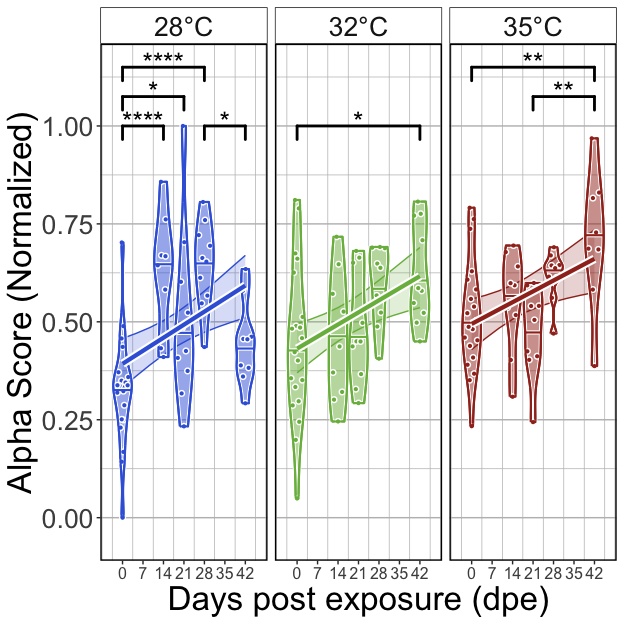<!-- -->

##### Tables

###### (hide)

Press on tabs to display tables. Scroll to see additional rows.

###### GLM

<table class="gt_table" data-quarto-disable-processing="false" data-quarto-bootstrap="false">
  <thead>
    <tr class="gt_heading">
      <td colspan="6" class="gt_heading gt_title gt_font_normal" style>GLM Results</td>
    </tr>
    <tr class="gt_heading">
      <td colspan="6" class="gt_heading gt_subtitle gt_font_normal gt_bottom_border" style>glm(Alpha.Score ~ Temperature*DPE); Unexposed fish</td>
    </tr>
    <tr class="gt_col_headings">
      <th class="gt_col_heading gt_columns_bottom_border gt_left" rowspan="1" colspan="1" scope="col" id="term">term</th>
      <th class="gt_col_heading gt_columns_bottom_border gt_right" rowspan="1" colspan="1" scope="col" id="estimate">estimate</th>
      <th class="gt_col_heading gt_columns_bottom_border gt_right" rowspan="1" colspan="1" scope="col" id="std.error">std.error</th>
      <th class="gt_col_heading gt_columns_bottom_border gt_right" rowspan="1" colspan="1" scope="col" id="statistic">statistic</th>
      <th class="gt_col_heading gt_columns_bottom_border gt_right" rowspan="1" colspan="1" scope="col" id="p.value">p.value</th>
      <th class="gt_col_heading gt_columns_bottom_border gt_left" rowspan="1" colspan="1" scope="col" id="p.adj.sig">p.adj.sig</th>
    </tr>
  </thead>
  <tbody class="gt_table_body">
    <tr class="gt_group_heading_row">
      <th colspan="6" class="gt_group_heading" scope="colgroup" id="Shannon">Shannon</th>
    </tr>
    <tr class="gt_row_group_first"><td headers="Shannon  term" class="gt_row gt_left">(Intercept)</td>
<td headers="Shannon  estimate" class="gt_row gt_right">−1.074</td>
<td headers="Shannon  std.error" class="gt_row gt_right">0.138</td>
<td headers="Shannon  statistic" class="gt_row gt_right">−7.754</td>
<td headers="Shannon  p.value" class="gt_row gt_right">&lt;0.001</td>
<td headers="Shannon  p.adj.sig" class="gt_row gt_left">****</td></tr>
    <tr><td headers="Shannon  term" class="gt_row gt_left">Temperature32</td>
<td headers="Shannon  estimate" class="gt_row gt_right">0.075</td>
<td headers="Shannon  std.error" class="gt_row gt_right">0.193</td>
<td headers="Shannon  statistic" class="gt_row gt_right">0.386</td>
<td headers="Shannon  p.value" class="gt_row gt_right">≥0.25</td>
<td headers="Shannon  p.adj.sig" class="gt_row gt_left">ns</td></tr>
    <tr><td headers="Shannon  term" class="gt_row gt_left">Temperature35</td>
<td headers="Shannon  estimate" class="gt_row gt_right">0.154</td>
<td headers="Shannon  std.error" class="gt_row gt_right">0.193</td>
<td headers="Shannon  statistic" class="gt_row gt_right">0.797</td>
<td headers="Shannon  p.value" class="gt_row gt_right">≥0.25</td>
<td headers="Shannon  p.adj.sig" class="gt_row gt_left">ns</td></tr>
    <tr><td headers="Shannon  term" class="gt_row gt_left">DPE</td>
<td headers="Shannon  estimate" class="gt_row gt_right">0.018</td>
<td headers="Shannon  std.error" class="gt_row gt_right">0.006</td>
<td headers="Shannon  statistic" class="gt_row gt_right">3.086</td>
<td headers="Shannon  p.value" class="gt_row gt_right">0.002</td>
<td headers="Shannon  p.adj.sig" class="gt_row gt_left">**</td></tr>
    <tr><td headers="Shannon  term" class="gt_row gt_left">Temperature32:DPE</td>
<td headers="Shannon  estimate" class="gt_row gt_right">−0.001</td>
<td headers="Shannon  std.error" class="gt_row gt_right">0.008</td>
<td headers="Shannon  statistic" class="gt_row gt_right">−0.170</td>
<td headers="Shannon  p.value" class="gt_row gt_right">≥0.25</td>
<td headers="Shannon  p.adj.sig" class="gt_row gt_left">ns</td></tr>
    <tr><td headers="Shannon  term" class="gt_row gt_left">Temperature35:DPE</td>
<td headers="Shannon  estimate" class="gt_row gt_right">−0.005</td>
<td headers="Shannon  std.error" class="gt_row gt_right">0.008</td>
<td headers="Shannon  statistic" class="gt_row gt_right">−0.585</td>
<td headers="Shannon  p.value" class="gt_row gt_right">≥0.25</td>
<td headers="Shannon  p.adj.sig" class="gt_row gt_left">ns</td></tr>
    <tr class="gt_group_heading_row">
      <th colspan="6" class="gt_group_heading" scope="colgroup" id="Simpson">Simpson</th>
    </tr>
    <tr class="gt_row_group_first"><td headers="Simpson  term" class="gt_row gt_left">(Intercept)</td>
<td headers="Simpson  estimate" class="gt_row gt_right">−0.433</td>
<td headers="Simpson  std.error" class="gt_row gt_right">0.134</td>
<td headers="Simpson  statistic" class="gt_row gt_right">−3.245</td>
<td headers="Simpson  p.value" class="gt_row gt_right">0.001</td>
<td headers="Simpson  p.adj.sig" class="gt_row gt_left">**</td></tr>
    <tr><td headers="Simpson  term" class="gt_row gt_left">Temperature32</td>
<td headers="Simpson  estimate" class="gt_row gt_right">0.157</td>
<td headers="Simpson  std.error" class="gt_row gt_right">0.186</td>
<td headers="Simpson  statistic" class="gt_row gt_right">0.841</td>
<td headers="Simpson  p.value" class="gt_row gt_right">≥0.25</td>
<td headers="Simpson  p.adj.sig" class="gt_row gt_left">ns</td></tr>
    <tr><td headers="Simpson  term" class="gt_row gt_left">Temperature35</td>
<td headers="Simpson  estimate" class="gt_row gt_right">0.408</td>
<td headers="Simpson  std.error" class="gt_row gt_right">0.187</td>
<td headers="Simpson  statistic" class="gt_row gt_right">2.177</td>
<td headers="Simpson  p.value" class="gt_row gt_right">0.031</td>
<td headers="Simpson  p.adj.sig" class="gt_row gt_left">*</td></tr>
    <tr><td headers="Simpson  term" class="gt_row gt_left">DPE</td>
<td headers="Simpson  estimate" class="gt_row gt_right">0.019</td>
<td headers="Simpson  std.error" class="gt_row gt_right">0.006</td>
<td headers="Simpson  statistic" class="gt_row gt_right">3.293</td>
<td headers="Simpson  p.value" class="gt_row gt_right">0.001</td>
<td headers="Simpson  p.adj.sig" class="gt_row gt_left">**</td></tr>
    <tr><td headers="Simpson  term" class="gt_row gt_left">Temperature32:DPE</td>
<td headers="Simpson  estimate" class="gt_row gt_right">−0.001</td>
<td headers="Simpson  std.error" class="gt_row gt_right">0.008</td>
<td headers="Simpson  statistic" class="gt_row gt_right">−0.173</td>
<td headers="Simpson  p.value" class="gt_row gt_right">≥0.25</td>
<td headers="Simpson  p.adj.sig" class="gt_row gt_left">ns</td></tr>
    <tr><td headers="Simpson  term" class="gt_row gt_left">Temperature35:DPE</td>
<td headers="Simpson  estimate" class="gt_row gt_right">−0.003</td>
<td headers="Simpson  std.error" class="gt_row gt_right">0.008</td>
<td headers="Simpson  statistic" class="gt_row gt_right">−0.343</td>
<td headers="Simpson  p.value" class="gt_row gt_right">≥0.25</td>
<td headers="Simpson  p.adj.sig" class="gt_row gt_left">ns</td></tr>
    <tr class="gt_group_heading_row">
      <th colspan="6" class="gt_group_heading" scope="colgroup" id="Richness">Richness</th>
    </tr>
    <tr class="gt_row_group_first"><td headers="Richness  term" class="gt_row gt_left">(Intercept)</td>
<td headers="Richness  estimate" class="gt_row gt_right">−0.651</td>
<td headers="Richness  std.error" class="gt_row gt_right">0.108</td>
<td headers="Richness  statistic" class="gt_row gt_right">−6.017</td>
<td headers="Richness  p.value" class="gt_row gt_right">&lt;0.001</td>
<td headers="Richness  p.adj.sig" class="gt_row gt_left">****</td></tr>
    <tr><td headers="Richness  term" class="gt_row gt_left">Temperature32</td>
<td headers="Richness  estimate" class="gt_row gt_right">0.189</td>
<td headers="Richness  std.error" class="gt_row gt_right">0.150</td>
<td headers="Richness  statistic" class="gt_row gt_right">1.257</td>
<td headers="Richness  p.value" class="gt_row gt_right">0.211</td>
<td headers="Richness  p.adj.sig" class="gt_row gt_left">ns</td></tr>
    <tr><td headers="Richness  term" class="gt_row gt_left">Temperature35</td>
<td headers="Richness  estimate" class="gt_row gt_right">−0.059</td>
<td headers="Richness  std.error" class="gt_row gt_right">0.154</td>
<td headers="Richness  statistic" class="gt_row gt_right">−0.383</td>
<td headers="Richness  p.value" class="gt_row gt_right">≥0.25</td>
<td headers="Richness  p.adj.sig" class="gt_row gt_left">ns</td></tr>
    <tr><td headers="Richness  term" class="gt_row gt_left">DPE</td>
<td headers="Richness  estimate" class="gt_row gt_right">0.024</td>
<td headers="Richness  std.error" class="gt_row gt_right">0.005</td>
<td headers="Richness  statistic" class="gt_row gt_right">5.137</td>
<td headers="Richness  p.value" class="gt_row gt_right">&lt;0.001</td>
<td headers="Richness  p.adj.sig" class="gt_row gt_left">****</td></tr>
    <tr><td headers="Richness  term" class="gt_row gt_left">Temperature32:DPE</td>
<td headers="Richness  estimate" class="gt_row gt_right">−0.008</td>
<td headers="Richness  std.error" class="gt_row gt_right">0.006</td>
<td headers="Richness  statistic" class="gt_row gt_right">−1.251</td>
<td headers="Richness  p.value" class="gt_row gt_right">0.213</td>
<td headers="Richness  p.adj.sig" class="gt_row gt_left">ns</td></tr>
    <tr><td headers="Richness  term" class="gt_row gt_left">Temperature35:DPE</td>
<td headers="Richness  estimate" class="gt_row gt_right">−0.024</td>
<td headers="Richness  std.error" class="gt_row gt_right">0.007</td>
<td headers="Richness  statistic" class="gt_row gt_right">−3.476</td>
<td headers="Richness  p.value" class="gt_row gt_right">&lt;0.001</td>
<td headers="Richness  p.adj.sig" class="gt_row gt_left">***</td></tr>
  </tbody>
  &#10;  
</table>

###### ANOVA

<table class="gt_table" data-quarto-disable-processing="false" data-quarto-bootstrap="false">
  <thead>
    <tr class="gt_heading">
      <td colspan="5" class="gt_heading gt_title gt_font_normal" style>ANOVA of GLM</td>
    </tr>
    <tr class="gt_heading">
      <td colspan="5" class="gt_heading gt_subtitle gt_font_normal gt_bottom_border" style>ANOVA(GLM(Alpha.Score ~ Temperature*Time), type = 2); Unexposed fish</td>
    </tr>
    <tr class="gt_col_headings">
      <th class="gt_col_heading gt_columns_bottom_border gt_left" rowspan="1" colspan="1" scope="col" id="term">term</th>
      <th class="gt_col_heading gt_columns_bottom_border gt_right" rowspan="1" colspan="1" scope="col" id="statistic">statistic</th>
      <th class="gt_col_heading gt_columns_bottom_border gt_right" rowspan="1" colspan="1" scope="col" id="df">df</th>
      <th class="gt_col_heading gt_columns_bottom_border gt_right" rowspan="1" colspan="1" scope="col" id="p.value">p.value</th>
      <th class="gt_col_heading gt_columns_bottom_border gt_left" rowspan="1" colspan="1" scope="col" id="sig">sig</th>
    </tr>
  </thead>
  <tbody class="gt_table_body">
    <tr class="gt_group_heading_row">
      <th colspan="5" class="gt_group_heading" scope="colgroup" id="Shannon">Shannon</th>
    </tr>
    <tr class="gt_row_group_first"><td headers="Shannon  term" class="gt_row gt_left">Temperature</td>
<td headers="Shannon  statistic" class="gt_row gt_right">0.322</td>
<td headers="Shannon  df" class="gt_row gt_right">2.000</td>
<td headers="Shannon  p.value" class="gt_row gt_right">≥0.25</td>
<td headers="Shannon  sig" class="gt_row gt_left">ns</td></tr>
    <tr><td headers="Shannon  term" class="gt_row gt_left">DPE</td>
<td headers="Shannon  statistic" class="gt_row gt_right">22.895</td>
<td headers="Shannon  df" class="gt_row gt_right">1.000</td>
<td headers="Shannon  p.value" class="gt_row gt_right">&lt;0.001</td>
<td headers="Shannon  sig" class="gt_row gt_left">****</td></tr>
    <tr><td headers="Shannon  term" class="gt_row gt_left">Temperature:DPE</td>
<td headers="Shannon  statistic" class="gt_row gt_right">0.363</td>
<td headers="Shannon  df" class="gt_row gt_right">2.000</td>
<td headers="Shannon  p.value" class="gt_row gt_right">≥0.25</td>
<td headers="Shannon  sig" class="gt_row gt_left">ns</td></tr>
    <tr class="gt_group_heading_row">
      <th colspan="5" class="gt_group_heading" scope="colgroup" id="Simpson">Simpson</th>
    </tr>
    <tr class="gt_row_group_first"><td headers="Simpson  term" class="gt_row gt_left">Temperature</td>
<td headers="Simpson  statistic" class="gt_row gt_right">8.551</td>
<td headers="Simpson  df" class="gt_row gt_right">2.000</td>
<td headers="Simpson  p.value" class="gt_row gt_right">0.014</td>
<td headers="Simpson  sig" class="gt_row gt_left">*</td></tr>
    <tr><td headers="Simpson  term" class="gt_row gt_left">DPE</td>
<td headers="Simpson  statistic" class="gt_row gt_right">28.161</td>
<td headers="Simpson  df" class="gt_row gt_right">1.000</td>
<td headers="Simpson  p.value" class="gt_row gt_right">&lt;0.001</td>
<td headers="Simpson  sig" class="gt_row gt_left">****</td></tr>
    <tr><td headers="Simpson  term" class="gt_row gt_left">Temperature:DPE</td>
<td headers="Simpson  statistic" class="gt_row gt_right">0.118</td>
<td headers="Simpson  df" class="gt_row gt_right">2.000</td>
<td headers="Simpson  p.value" class="gt_row gt_right">≥0.25</td>
<td headers="Simpson  sig" class="gt_row gt_left">ns</td></tr>
    <tr class="gt_group_heading_row">
      <th colspan="5" class="gt_group_heading" scope="colgroup" id="Richness">Richness</th>
    </tr>
    <tr class="gt_row_group_first"><td headers="Richness  term" class="gt_row gt_left">Temperature</td>
<td headers="Richness  statistic" class="gt_row gt_right">31.759</td>
<td headers="Richness  df" class="gt_row gt_right">2.000</td>
<td headers="Richness  p.value" class="gt_row gt_right">&lt;0.001</td>
<td headers="Richness  sig" class="gt_row gt_left">****</td></tr>
    <tr><td headers="Richness  term" class="gt_row gt_left">DPE</td>
<td headers="Richness  statistic" class="gt_row gt_right">27.201</td>
<td headers="Richness  df" class="gt_row gt_right">1.000</td>
<td headers="Richness  p.value" class="gt_row gt_right">&lt;0.001</td>
<td headers="Richness  sig" class="gt_row gt_left">****</td></tr>
    <tr><td headers="Richness  term" class="gt_row gt_left">Temperature:DPE</td>
<td headers="Richness  statistic" class="gt_row gt_right">12.460</td>
<td headers="Richness  df" class="gt_row gt_right">2.000</td>
<td headers="Richness  p.value" class="gt_row gt_right">0.002</td>
<td headers="Richness  sig" class="gt_row gt_left">**</td></tr>
  </tbody>
  &#10;  
</table>

###### Tukey

<table class="gt_table" data-quarto-disable-processing="false" data-quarto-bootstrap="false">
  <thead>
    <tr class="gt_heading">
      <td colspan="11" class="gt_heading gt_title gt_font_normal" style>Pairwise Tukey's HSD, p.adj: Dunnett</td>
    </tr>
    <tr class="gt_heading">
      <td colspan="11" class="gt_heading gt_subtitle gt_font_normal gt_bottom_border" style>Tukey(Alpha.Score ~ Temperature*Time); Unexposed fish</td>
    </tr>
    <tr class="gt_col_headings">
      <th class="gt_col_heading gt_columns_bottom_border gt_center" rowspan="1" colspan="1" scope="col" id="Temperature">Temperature</th>
      <th class="gt_col_heading gt_columns_bottom_border gt_left" rowspan="1" colspan="1" scope="col" id=".y.">.y.</th>
      <th class="gt_col_heading gt_columns_bottom_border gt_left" rowspan="1" colspan="1" scope="col" id="term">term</th>
      <th class="gt_col_heading gt_columns_bottom_border gt_right" rowspan="1" colspan="1" scope="col" id="group1">group1</th>
      <th class="gt_col_heading gt_columns_bottom_border gt_right" rowspan="1" colspan="1" scope="col" id="group2">group2</th>
      <th class="gt_col_heading gt_columns_bottom_border gt_right" rowspan="1" colspan="1" scope="col" id="estimate">estimate</th>
      <th class="gt_col_heading gt_columns_bottom_border gt_right" rowspan="1" colspan="1" scope="col" id="std.error">std.error</th>
      <th class="gt_col_heading gt_columns_bottom_border gt_right" rowspan="1" colspan="1" scope="col" id="statistic">statistic</th>
      <th class="gt_col_heading gt_columns_bottom_border gt_right" rowspan="1" colspan="1" scope="col" id="adj.p.value">adj.p.value</th>
      <th class="gt_col_heading gt_columns_bottom_border gt_left" rowspan="1" colspan="1" scope="col" id="Variable">Variable</th>
      <th class="gt_col_heading gt_columns_bottom_border gt_center" rowspan="1" colspan="1" scope="col" id="Group">Group</th>
    </tr>
  </thead>
  <tbody class="gt_table_body">
    <tr class="gt_group_heading_row">
      <th colspan="11" class="gt_group_heading" scope="colgroup" id="Shannon">Shannon</th>
    </tr>
    <tr class="gt_row_group_first"><td headers="Shannon  Temperature" class="gt_row gt_center">28</td>
<td headers="Shannon  .y." class="gt_row gt_left">Alpha.Score</td>
<td headers="Shannon  term" class="gt_row gt_left">DPE</td>
<td headers="Shannon  group1" class="gt_row gt_right">14</td>
<td headers="Shannon  group2" class="gt_row gt_right">0</td>
<td headers="Shannon  estimate" class="gt_row gt_right">1.065</td>
<td headers="Shannon  std.error" class="gt_row gt_right">0.294</td>
<td headers="Shannon  statistic" class="gt_row gt_right">3.625</td>
<td headers="Shannon  adj.p.value" class="gt_row gt_right">0.003</td>
<td headers="Shannon  Variable" class="gt_row gt_left">DPE</td>
<td headers="Shannon  Group" class="gt_row gt_center">28</td></tr>
    <tr><td headers="Shannon  Temperature" class="gt_row gt_center">28</td>
<td headers="Shannon  .y." class="gt_row gt_left">Alpha.Score</td>
<td headers="Shannon  term" class="gt_row gt_left">DPE</td>
<td headers="Shannon  group1" class="gt_row gt_right">21</td>
<td headers="Shannon  group2" class="gt_row gt_right">0</td>
<td headers="Shannon  estimate" class="gt_row gt_right">0.722</td>
<td headers="Shannon  std.error" class="gt_row gt_right">0.281</td>
<td headers="Shannon  statistic" class="gt_row gt_right">2.566</td>
<td headers="Shannon  adj.p.value" class="gt_row gt_right">0.076</td>
<td headers="Shannon  Variable" class="gt_row gt_left">DPE</td>
<td headers="Shannon  Group" class="gt_row gt_center">28</td></tr>
    <tr><td headers="Shannon  Temperature" class="gt_row gt_center">28</td>
<td headers="Shannon  .y." class="gt_row gt_left">Alpha.Score</td>
<td headers="Shannon  term" class="gt_row gt_left">DPE</td>
<td headers="Shannon  group1" class="gt_row gt_right">28</td>
<td headers="Shannon  group2" class="gt_row gt_right">0</td>
<td headers="Shannon  estimate" class="gt_row gt_right">1.187</td>
<td headers="Shannon  std.error" class="gt_row gt_right">0.274</td>
<td headers="Shannon  statistic" class="gt_row gt_right">4.335</td>
<td headers="Shannon  adj.p.value" class="gt_row gt_right">&lt;0.001</td>
<td headers="Shannon  Variable" class="gt_row gt_left">DPE</td>
<td headers="Shannon  Group" class="gt_row gt_center">28</td></tr>
    <tr><td headers="Shannon  Temperature" class="gt_row gt_center">28</td>
<td headers="Shannon  .y." class="gt_row gt_left">Alpha.Score</td>
<td headers="Shannon  term" class="gt_row gt_left">DPE</td>
<td headers="Shannon  group1" class="gt_row gt_right">42</td>
<td headers="Shannon  group2" class="gt_row gt_right">0</td>
<td headers="Shannon  estimate" class="gt_row gt_right">0.548</td>
<td headers="Shannon  std.error" class="gt_row gt_right">0.296</td>
<td headers="Shannon  statistic" class="gt_row gt_right">1.853</td>
<td headers="Shannon  adj.p.value" class="gt_row gt_right">≥0.25</td>
<td headers="Shannon  Variable" class="gt_row gt_left">DPE</td>
<td headers="Shannon  Group" class="gt_row gt_center">28</td></tr>
    <tr><td headers="Shannon  Temperature" class="gt_row gt_center">28</td>
<td headers="Shannon  .y." class="gt_row gt_left">Alpha.Score</td>
<td headers="Shannon  term" class="gt_row gt_left">DPE</td>
<td headers="Shannon  group1" class="gt_row gt_right">21</td>
<td headers="Shannon  group2" class="gt_row gt_right">14</td>
<td headers="Shannon  estimate" class="gt_row gt_right">−0.343</td>
<td headers="Shannon  std.error" class="gt_row gt_right">0.317</td>
<td headers="Shannon  statistic" class="gt_row gt_right">−1.083</td>
<td headers="Shannon  adj.p.value" class="gt_row gt_right">≥0.25</td>
<td headers="Shannon  Variable" class="gt_row gt_left">DPE</td>
<td headers="Shannon  Group" class="gt_row gt_center">28</td></tr>
    <tr><td headers="Shannon  Temperature" class="gt_row gt_center">28</td>
<td headers="Shannon  .y." class="gt_row gt_left">Alpha.Score</td>
<td headers="Shannon  term" class="gt_row gt_left">DPE</td>
<td headers="Shannon  group1" class="gt_row gt_right">28</td>
<td headers="Shannon  group2" class="gt_row gt_right">14</td>
<td headers="Shannon  estimate" class="gt_row gt_right">0.122</td>
<td headers="Shannon  std.error" class="gt_row gt_right">0.310</td>
<td headers="Shannon  statistic" class="gt_row gt_right">0.392</td>
<td headers="Shannon  adj.p.value" class="gt_row gt_right">≥0.25</td>
<td headers="Shannon  Variable" class="gt_row gt_left">DPE</td>
<td headers="Shannon  Group" class="gt_row gt_center">28</td></tr>
    <tr><td headers="Shannon  Temperature" class="gt_row gt_center">28</td>
<td headers="Shannon  .y." class="gt_row gt_left">Alpha.Score</td>
<td headers="Shannon  term" class="gt_row gt_left">DPE</td>
<td headers="Shannon  group1" class="gt_row gt_right">42</td>
<td headers="Shannon  group2" class="gt_row gt_right">14</td>
<td headers="Shannon  estimate" class="gt_row gt_right">−0.517</td>
<td headers="Shannon  std.error" class="gt_row gt_right">0.330</td>
<td headers="Shannon  statistic" class="gt_row gt_right">−1.567</td>
<td headers="Shannon  adj.p.value" class="gt_row gt_right">≥0.25</td>
<td headers="Shannon  Variable" class="gt_row gt_left">DPE</td>
<td headers="Shannon  Group" class="gt_row gt_center">28</td></tr>
    <tr><td headers="Shannon  Temperature" class="gt_row gt_center">28</td>
<td headers="Shannon  .y." class="gt_row gt_left">Alpha.Score</td>
<td headers="Shannon  term" class="gt_row gt_left">DPE</td>
<td headers="Shannon  group1" class="gt_row gt_right">28</td>
<td headers="Shannon  group2" class="gt_row gt_right">21</td>
<td headers="Shannon  estimate" class="gt_row gt_right">0.465</td>
<td headers="Shannon  std.error" class="gt_row gt_right">0.299</td>
<td headers="Shannon  statistic" class="gt_row gt_right">1.558</td>
<td headers="Shannon  adj.p.value" class="gt_row gt_right">≥0.25</td>
<td headers="Shannon  Variable" class="gt_row gt_left">DPE</td>
<td headers="Shannon  Group" class="gt_row gt_center">28</td></tr>
    <tr><td headers="Shannon  Temperature" class="gt_row gt_center">28</td>
<td headers="Shannon  .y." class="gt_row gt_left">Alpha.Score</td>
<td headers="Shannon  term" class="gt_row gt_left">DPE</td>
<td headers="Shannon  group1" class="gt_row gt_right">42</td>
<td headers="Shannon  group2" class="gt_row gt_right">21</td>
<td headers="Shannon  estimate" class="gt_row gt_right">−0.174</td>
<td headers="Shannon  std.error" class="gt_row gt_right">0.319</td>
<td headers="Shannon  statistic" class="gt_row gt_right">−0.545</td>
<td headers="Shannon  adj.p.value" class="gt_row gt_right">≥0.25</td>
<td headers="Shannon  Variable" class="gt_row gt_left">DPE</td>
<td headers="Shannon  Group" class="gt_row gt_center">28</td></tr>
    <tr><td headers="Shannon  Temperature" class="gt_row gt_center">28</td>
<td headers="Shannon  .y." class="gt_row gt_left">Alpha.Score</td>
<td headers="Shannon  term" class="gt_row gt_left">DPE</td>
<td headers="Shannon  group1" class="gt_row gt_right">42</td>
<td headers="Shannon  group2" class="gt_row gt_right">28</td>
<td headers="Shannon  estimate" class="gt_row gt_right">−0.639</td>
<td headers="Shannon  std.error" class="gt_row gt_right">0.312</td>
<td headers="Shannon  statistic" class="gt_row gt_right">−2.045</td>
<td headers="Shannon  adj.p.value" class="gt_row gt_right">0.243</td>
<td headers="Shannon  Variable" class="gt_row gt_left">DPE</td>
<td headers="Shannon  Group" class="gt_row gt_center">28</td></tr>
    <tr><td headers="Shannon  Temperature" class="gt_row gt_center">32</td>
<td headers="Shannon  .y." class="gt_row gt_left">Alpha.Score</td>
<td headers="Shannon  term" class="gt_row gt_left">DPE</td>
<td headers="Shannon  group1" class="gt_row gt_right">14</td>
<td headers="Shannon  group2" class="gt_row gt_right">0</td>
<td headers="Shannon  estimate" class="gt_row gt_right">0.006</td>
<td headers="Shannon  std.error" class="gt_row gt_right">0.250</td>
<td headers="Shannon  statistic" class="gt_row gt_right">0.022</td>
<td headers="Shannon  adj.p.value" class="gt_row gt_right">≥0.25</td>
<td headers="Shannon  Variable" class="gt_row gt_left">DPE</td>
<td headers="Shannon  Group" class="gt_row gt_center">32</td></tr>
    <tr><td headers="Shannon  Temperature" class="gt_row gt_center">32</td>
<td headers="Shannon  .y." class="gt_row gt_left">Alpha.Score</td>
<td headers="Shannon  term" class="gt_row gt_left">DPE</td>
<td headers="Shannon  group1" class="gt_row gt_right">21</td>
<td headers="Shannon  group2" class="gt_row gt_right">0</td>
<td headers="Shannon  estimate" class="gt_row gt_right">0.112</td>
<td headers="Shannon  std.error" class="gt_row gt_right">0.247</td>
<td headers="Shannon  statistic" class="gt_row gt_right">0.452</td>
<td headers="Shannon  adj.p.value" class="gt_row gt_right">≥0.25</td>
<td headers="Shannon  Variable" class="gt_row gt_left">DPE</td>
<td headers="Shannon  Group" class="gt_row gt_center">32</td></tr>
    <tr><td headers="Shannon  Temperature" class="gt_row gt_center">32</td>
<td headers="Shannon  .y." class="gt_row gt_left">Alpha.Score</td>
<td headers="Shannon  term" class="gt_row gt_left">DPE</td>
<td headers="Shannon  group1" class="gt_row gt_right">28</td>
<td headers="Shannon  group2" class="gt_row gt_right">0</td>
<td headers="Shannon  estimate" class="gt_row gt_right">0.420</td>
<td headers="Shannon  std.error" class="gt_row gt_right">0.248</td>
<td headers="Shannon  statistic" class="gt_row gt_right">1.695</td>
<td headers="Shannon  adj.p.value" class="gt_row gt_right">≥0.25</td>
<td headers="Shannon  Variable" class="gt_row gt_left">DPE</td>
<td headers="Shannon  Group" class="gt_row gt_center">32</td></tr>
    <tr><td headers="Shannon  Temperature" class="gt_row gt_center">32</td>
<td headers="Shannon  .y." class="gt_row gt_left">Alpha.Score</td>
<td headers="Shannon  term" class="gt_row gt_left">DPE</td>
<td headers="Shannon  group1" class="gt_row gt_right">42</td>
<td headers="Shannon  group2" class="gt_row gt_right">0</td>
<td headers="Shannon  estimate" class="gt_row gt_right">0.694</td>
<td headers="Shannon  std.error" class="gt_row gt_right">0.236</td>
<td headers="Shannon  statistic" class="gt_row gt_right">2.943</td>
<td headers="Shannon  adj.p.value" class="gt_row gt_right">0.027</td>
<td headers="Shannon  Variable" class="gt_row gt_left">DPE</td>
<td headers="Shannon  Group" class="gt_row gt_center">32</td></tr>
    <tr><td headers="Shannon  Temperature" class="gt_row gt_center">32</td>
<td headers="Shannon  .y." class="gt_row gt_left">Alpha.Score</td>
<td headers="Shannon  term" class="gt_row gt_left">DPE</td>
<td headers="Shannon  group1" class="gt_row gt_right">21</td>
<td headers="Shannon  group2" class="gt_row gt_right">14</td>
<td headers="Shannon  estimate" class="gt_row gt_right">0.106</td>
<td headers="Shannon  std.error" class="gt_row gt_right">0.286</td>
<td headers="Shannon  statistic" class="gt_row gt_right">0.371</td>
<td headers="Shannon  adj.p.value" class="gt_row gt_right">≥0.25</td>
<td headers="Shannon  Variable" class="gt_row gt_left">DPE</td>
<td headers="Shannon  Group" class="gt_row gt_center">32</td></tr>
    <tr><td headers="Shannon  Temperature" class="gt_row gt_center">32</td>
<td headers="Shannon  .y." class="gt_row gt_left">Alpha.Score</td>
<td headers="Shannon  term" class="gt_row gt_left">DPE</td>
<td headers="Shannon  group1" class="gt_row gt_right">28</td>
<td headers="Shannon  group2" class="gt_row gt_right">14</td>
<td headers="Shannon  estimate" class="gt_row gt_right">0.414</td>
<td headers="Shannon  std.error" class="gt_row gt_right">0.287</td>
<td headers="Shannon  statistic" class="gt_row gt_right">1.445</td>
<td headers="Shannon  adj.p.value" class="gt_row gt_right">≥0.25</td>
<td headers="Shannon  Variable" class="gt_row gt_left">DPE</td>
<td headers="Shannon  Group" class="gt_row gt_center">32</td></tr>
    <tr><td headers="Shannon  Temperature" class="gt_row gt_center">32</td>
<td headers="Shannon  .y." class="gt_row gt_left">Alpha.Score</td>
<td headers="Shannon  term" class="gt_row gt_left">DPE</td>
<td headers="Shannon  group1" class="gt_row gt_right">42</td>
<td headers="Shannon  group2" class="gt_row gt_right">14</td>
<td headers="Shannon  estimate" class="gt_row gt_right">0.688</td>
<td headers="Shannon  std.error" class="gt_row gt_right">0.276</td>
<td headers="Shannon  statistic" class="gt_row gt_right">2.490</td>
<td headers="Shannon  adj.p.value" class="gt_row gt_right">0.092</td>
<td headers="Shannon  Variable" class="gt_row gt_left">DPE</td>
<td headers="Shannon  Group" class="gt_row gt_center">32</td></tr>
    <tr><td headers="Shannon  Temperature" class="gt_row gt_center">32</td>
<td headers="Shannon  .y." class="gt_row gt_left">Alpha.Score</td>
<td headers="Shannon  term" class="gt_row gt_left">DPE</td>
<td headers="Shannon  group1" class="gt_row gt_right">28</td>
<td headers="Shannon  group2" class="gt_row gt_right">21</td>
<td headers="Shannon  estimate" class="gt_row gt_right">0.308</td>
<td headers="Shannon  std.error" class="gt_row gt_right">0.283</td>
<td headers="Shannon  statistic" class="gt_row gt_right">1.087</td>
<td headers="Shannon  adj.p.value" class="gt_row gt_right">≥0.25</td>
<td headers="Shannon  Variable" class="gt_row gt_left">DPE</td>
<td headers="Shannon  Group" class="gt_row gt_center">32</td></tr>
    <tr><td headers="Shannon  Temperature" class="gt_row gt_center">32</td>
<td headers="Shannon  .y." class="gt_row gt_left">Alpha.Score</td>
<td headers="Shannon  term" class="gt_row gt_left">DPE</td>
<td headers="Shannon  group1" class="gt_row gt_right">42</td>
<td headers="Shannon  group2" class="gt_row gt_right">21</td>
<td headers="Shannon  estimate" class="gt_row gt_right">0.582</td>
<td headers="Shannon  std.error" class="gt_row gt_right">0.273</td>
<td headers="Shannon  statistic" class="gt_row gt_right">2.131</td>
<td headers="Shannon  adj.p.value" class="gt_row gt_right">0.205</td>
<td headers="Shannon  Variable" class="gt_row gt_left">DPE</td>
<td headers="Shannon  Group" class="gt_row gt_center">32</td></tr>
    <tr><td headers="Shannon  Temperature" class="gt_row gt_center">32</td>
<td headers="Shannon  .y." class="gt_row gt_left">Alpha.Score</td>
<td headers="Shannon  term" class="gt_row gt_left">DPE</td>
<td headers="Shannon  group1" class="gt_row gt_right">42</td>
<td headers="Shannon  group2" class="gt_row gt_right">28</td>
<td headers="Shannon  estimate" class="gt_row gt_right">0.274</td>
<td headers="Shannon  std.error" class="gt_row gt_right">0.274</td>
<td headers="Shannon  statistic" class="gt_row gt_right">1.001</td>
<td headers="Shannon  adj.p.value" class="gt_row gt_right">≥0.25</td>
<td headers="Shannon  Variable" class="gt_row gt_left">DPE</td>
<td headers="Shannon  Group" class="gt_row gt_center">32</td></tr>
    <tr><td headers="Shannon  Temperature" class="gt_row gt_center">35</td>
<td headers="Shannon  .y." class="gt_row gt_left">Alpha.Score</td>
<td headers="Shannon  term" class="gt_row gt_left">DPE</td>
<td headers="Shannon  group1" class="gt_row gt_right">14</td>
<td headers="Shannon  group2" class="gt_row gt_right">0</td>
<td headers="Shannon  estimate" class="gt_row gt_right">−0.006</td>
<td headers="Shannon  std.error" class="gt_row gt_right">0.210</td>
<td headers="Shannon  statistic" class="gt_row gt_right">−0.027</td>
<td headers="Shannon  adj.p.value" class="gt_row gt_right">≥0.25</td>
<td headers="Shannon  Variable" class="gt_row gt_left">DPE</td>
<td headers="Shannon  Group" class="gt_row gt_center">35</td></tr>
    <tr><td headers="Shannon  Temperature" class="gt_row gt_center">35</td>
<td headers="Shannon  .y." class="gt_row gt_left">Alpha.Score</td>
<td headers="Shannon  term" class="gt_row gt_left">DPE</td>
<td headers="Shannon  group1" class="gt_row gt_right">21</td>
<td headers="Shannon  group2" class="gt_row gt_right">0</td>
<td headers="Shannon  estimate" class="gt_row gt_right">−0.249</td>
<td headers="Shannon  std.error" class="gt_row gt_right">0.218</td>
<td headers="Shannon  statistic" class="gt_row gt_right">−1.145</td>
<td headers="Shannon  adj.p.value" class="gt_row gt_right">≥0.25</td>
<td headers="Shannon  Variable" class="gt_row gt_left">DPE</td>
<td headers="Shannon  Group" class="gt_row gt_center">35</td></tr>
    <tr><td headers="Shannon  Temperature" class="gt_row gt_center">35</td>
<td headers="Shannon  .y." class="gt_row gt_left">Alpha.Score</td>
<td headers="Shannon  term" class="gt_row gt_left">DPE</td>
<td headers="Shannon  group1" class="gt_row gt_right">28</td>
<td headers="Shannon  group2" class="gt_row gt_right">0</td>
<td headers="Shannon  estimate" class="gt_row gt_right">0.232</td>
<td headers="Shannon  std.error" class="gt_row gt_right">0.204</td>
<td headers="Shannon  statistic" class="gt_row gt_right">1.138</td>
<td headers="Shannon  adj.p.value" class="gt_row gt_right">≥0.25</td>
<td headers="Shannon  Variable" class="gt_row gt_left">DPE</td>
<td headers="Shannon  Group" class="gt_row gt_center">35</td></tr>
    <tr><td headers="Shannon  Temperature" class="gt_row gt_center">35</td>
<td headers="Shannon  .y." class="gt_row gt_left">Alpha.Score</td>
<td headers="Shannon  term" class="gt_row gt_left">DPE</td>
<td headers="Shannon  group1" class="gt_row gt_right">42</td>
<td headers="Shannon  group2" class="gt_row gt_right">0</td>
<td headers="Shannon  estimate" class="gt_row gt_right">0.661</td>
<td headers="Shannon  std.error" class="gt_row gt_right">0.207</td>
<td headers="Shannon  statistic" class="gt_row gt_right">3.194</td>
<td headers="Shannon  adj.p.value" class="gt_row gt_right">0.012</td>
<td headers="Shannon  Variable" class="gt_row gt_left">DPE</td>
<td headers="Shannon  Group" class="gt_row gt_center">35</td></tr>
    <tr><td headers="Shannon  Temperature" class="gt_row gt_center">35</td>
<td headers="Shannon  .y." class="gt_row gt_left">Alpha.Score</td>
<td headers="Shannon  term" class="gt_row gt_left">DPE</td>
<td headers="Shannon  group1" class="gt_row gt_right">21</td>
<td headers="Shannon  group2" class="gt_row gt_right">14</td>
<td headers="Shannon  estimate" class="gt_row gt_right">−0.243</td>
<td headers="Shannon  std.error" class="gt_row gt_right">0.253</td>
<td headers="Shannon  statistic" class="gt_row gt_right">−0.962</td>
<td headers="Shannon  adj.p.value" class="gt_row gt_right">≥0.25</td>
<td headers="Shannon  Variable" class="gt_row gt_left">DPE</td>
<td headers="Shannon  Group" class="gt_row gt_center">35</td></tr>
    <tr><td headers="Shannon  Temperature" class="gt_row gt_center">35</td>
<td headers="Shannon  .y." class="gt_row gt_left">Alpha.Score</td>
<td headers="Shannon  term" class="gt_row gt_left">DPE</td>
<td headers="Shannon  group1" class="gt_row gt_right">28</td>
<td headers="Shannon  group2" class="gt_row gt_right">14</td>
<td headers="Shannon  estimate" class="gt_row gt_right">0.238</td>
<td headers="Shannon  std.error" class="gt_row gt_right">0.242</td>
<td headers="Shannon  statistic" class="gt_row gt_right">0.985</td>
<td headers="Shannon  adj.p.value" class="gt_row gt_right">≥0.25</td>
<td headers="Shannon  Variable" class="gt_row gt_left">DPE</td>
<td headers="Shannon  Group" class="gt_row gt_center">35</td></tr>
    <tr><td headers="Shannon  Temperature" class="gt_row gt_center">35</td>
<td headers="Shannon  .y." class="gt_row gt_left">Alpha.Score</td>
<td headers="Shannon  term" class="gt_row gt_left">DPE</td>
<td headers="Shannon  group1" class="gt_row gt_right">42</td>
<td headers="Shannon  group2" class="gt_row gt_right">14</td>
<td headers="Shannon  estimate" class="gt_row gt_right">0.667</td>
<td headers="Shannon  std.error" class="gt_row gt_right">0.244</td>
<td headers="Shannon  statistic" class="gt_row gt_right">2.733</td>
<td headers="Shannon  adj.p.value" class="gt_row gt_right">0.049</td>
<td headers="Shannon  Variable" class="gt_row gt_left">DPE</td>
<td headers="Shannon  Group" class="gt_row gt_center">35</td></tr>
    <tr><td headers="Shannon  Temperature" class="gt_row gt_center">35</td>
<td headers="Shannon  .y." class="gt_row gt_left">Alpha.Score</td>
<td headers="Shannon  term" class="gt_row gt_left">DPE</td>
<td headers="Shannon  group1" class="gt_row gt_right">28</td>
<td headers="Shannon  group2" class="gt_row gt_right">21</td>
<td headers="Shannon  estimate" class="gt_row gt_right">0.481</td>
<td headers="Shannon  std.error" class="gt_row gt_right">0.248</td>
<td headers="Shannon  statistic" class="gt_row gt_right">1.938</td>
<td headers="Shannon  adj.p.value" class="gt_row gt_right">≥0.25</td>
<td headers="Shannon  Variable" class="gt_row gt_left">DPE</td>
<td headers="Shannon  Group" class="gt_row gt_center">35</td></tr>
    <tr><td headers="Shannon  Temperature" class="gt_row gt_center">35</td>
<td headers="Shannon  .y." class="gt_row gt_left">Alpha.Score</td>
<td headers="Shannon  term" class="gt_row gt_left">DPE</td>
<td headers="Shannon  group1" class="gt_row gt_right">42</td>
<td headers="Shannon  group2" class="gt_row gt_right">21</td>
<td headers="Shannon  estimate" class="gt_row gt_right">0.910</td>
<td headers="Shannon  std.error" class="gt_row gt_right">0.251</td>
<td headers="Shannon  statistic" class="gt_row gt_right">3.628</td>
<td headers="Shannon  adj.p.value" class="gt_row gt_right">0.003</td>
<td headers="Shannon  Variable" class="gt_row gt_left">DPE</td>
<td headers="Shannon  Group" class="gt_row gt_center">35</td></tr>
    <tr><td headers="Shannon  Temperature" class="gt_row gt_center">35</td>
<td headers="Shannon  .y." class="gt_row gt_left">Alpha.Score</td>
<td headers="Shannon  term" class="gt_row gt_left">DPE</td>
<td headers="Shannon  group1" class="gt_row gt_right">42</td>
<td headers="Shannon  group2" class="gt_row gt_right">28</td>
<td headers="Shannon  estimate" class="gt_row gt_right">0.429</td>
<td headers="Shannon  std.error" class="gt_row gt_right">0.239</td>
<td headers="Shannon  statistic" class="gt_row gt_right">1.792</td>
<td headers="Shannon  adj.p.value" class="gt_row gt_right">≥0.25</td>
<td headers="Shannon  Variable" class="gt_row gt_left">DPE</td>
<td headers="Shannon  Group" class="gt_row gt_center">35</td></tr>
    <tr class="gt_group_heading_row">
      <th colspan="11" class="gt_group_heading" scope="colgroup" id="Simpson">Simpson</th>
    </tr>
    <tr class="gt_row_group_first"><td headers="Simpson  Temperature" class="gt_row gt_center">28</td>
<td headers="Simpson  .y." class="gt_row gt_left">Alpha.Score</td>
<td headers="Simpson  term" class="gt_row gt_left">DPE</td>
<td headers="Simpson  group1" class="gt_row gt_right">14</td>
<td headers="Simpson  group2" class="gt_row gt_right">0</td>
<td headers="Simpson  estimate" class="gt_row gt_right">1.256</td>
<td headers="Simpson  std.error" class="gt_row gt_right">0.273</td>
<td headers="Simpson  statistic" class="gt_row gt_right">4.611</td>
<td headers="Simpson  adj.p.value" class="gt_row gt_right">&lt;0.001</td>
<td headers="Simpson  Variable" class="gt_row gt_left">DPE</td>
<td headers="Simpson  Group" class="gt_row gt_center">28</td></tr>
    <tr><td headers="Simpson  Temperature" class="gt_row gt_center">28</td>
<td headers="Simpson  .y." class="gt_row gt_left">Alpha.Score</td>
<td headers="Simpson  term" class="gt_row gt_left">DPE</td>
<td headers="Simpson  group1" class="gt_row gt_right">21</td>
<td headers="Simpson  group2" class="gt_row gt_right">0</td>
<td headers="Simpson  estimate" class="gt_row gt_right">0.761</td>
<td headers="Simpson  std.error" class="gt_row gt_right">0.247</td>
<td headers="Simpson  statistic" class="gt_row gt_right">3.076</td>
<td headers="Simpson  adj.p.value" class="gt_row gt_right">0.018</td>
<td headers="Simpson  Variable" class="gt_row gt_left">DPE</td>
<td headers="Simpson  Group" class="gt_row gt_center">28</td></tr>
    <tr><td headers="Simpson  Temperature" class="gt_row gt_center">28</td>
<td headers="Simpson  .y." class="gt_row gt_left">Alpha.Score</td>
<td headers="Simpson  term" class="gt_row gt_left">DPE</td>
<td headers="Simpson  group1" class="gt_row gt_right">28</td>
<td headers="Simpson  group2" class="gt_row gt_right">0</td>
<td headers="Simpson  estimate" class="gt_row gt_right">1.334</td>
<td headers="Simpson  std.error" class="gt_row gt_right">0.254</td>
<td headers="Simpson  statistic" class="gt_row gt_right">5.241</td>
<td headers="Simpson  adj.p.value" class="gt_row gt_right">&lt;0.001</td>
<td headers="Simpson  Variable" class="gt_row gt_left">DPE</td>
<td headers="Simpson  Group" class="gt_row gt_center">28</td></tr>
    <tr><td headers="Simpson  Temperature" class="gt_row gt_center">28</td>
<td headers="Simpson  .y." class="gt_row gt_left">Alpha.Score</td>
<td headers="Simpson  term" class="gt_row gt_left">DPE</td>
<td headers="Simpson  group1" class="gt_row gt_right">42</td>
<td headers="Simpson  group2" class="gt_row gt_right">0</td>
<td headers="Simpson  estimate" class="gt_row gt_right">0.514</td>
<td headers="Simpson  std.error" class="gt_row gt_right">0.257</td>
<td headers="Simpson  statistic" class="gt_row gt_right">2.002</td>
<td headers="Simpson  adj.p.value" class="gt_row gt_right">≥0.25</td>
<td headers="Simpson  Variable" class="gt_row gt_left">DPE</td>
<td headers="Simpson  Group" class="gt_row gt_center">28</td></tr>
    <tr><td headers="Simpson  Temperature" class="gt_row gt_center">28</td>
<td headers="Simpson  .y." class="gt_row gt_left">Alpha.Score</td>
<td headers="Simpson  term" class="gt_row gt_left">DPE</td>
<td headers="Simpson  group1" class="gt_row gt_right">21</td>
<td headers="Simpson  group2" class="gt_row gt_right">14</td>
<td headers="Simpson  estimate" class="gt_row gt_right">−0.496</td>
<td headers="Simpson  std.error" class="gt_row gt_right">0.302</td>
<td headers="Simpson  statistic" class="gt_row gt_right">−1.644</td>
<td headers="Simpson  adj.p.value" class="gt_row gt_right">≥0.25</td>
<td headers="Simpson  Variable" class="gt_row gt_left">DPE</td>
<td headers="Simpson  Group" class="gt_row gt_center">28</td></tr>
    <tr><td headers="Simpson  Temperature" class="gt_row gt_center">28</td>
<td headers="Simpson  .y." class="gt_row gt_left">Alpha.Score</td>
<td headers="Simpson  term" class="gt_row gt_left">DPE</td>
<td headers="Simpson  group1" class="gt_row gt_right">28</td>
<td headers="Simpson  group2" class="gt_row gt_right">14</td>
<td headers="Simpson  estimate" class="gt_row gt_right">0.077</td>
<td headers="Simpson  std.error" class="gt_row gt_right">0.308</td>
<td headers="Simpson  statistic" class="gt_row gt_right">0.251</td>
<td headers="Simpson  adj.p.value" class="gt_row gt_right">≥0.25</td>
<td headers="Simpson  Variable" class="gt_row gt_left">DPE</td>
<td headers="Simpson  Group" class="gt_row gt_center">28</td></tr>
    <tr><td headers="Simpson  Temperature" class="gt_row gt_center">28</td>
<td headers="Simpson  .y." class="gt_row gt_left">Alpha.Score</td>
<td headers="Simpson  term" class="gt_row gt_left">DPE</td>
<td headers="Simpson  group1" class="gt_row gt_right">42</td>
<td headers="Simpson  group2" class="gt_row gt_right">14</td>
<td headers="Simpson  estimate" class="gt_row gt_right">−0.742</td>
<td headers="Simpson  std.error" class="gt_row gt_right">0.310</td>
<td headers="Simpson  statistic" class="gt_row gt_right">−2.398</td>
<td headers="Simpson  adj.p.value" class="gt_row gt_right">0.114</td>
<td headers="Simpson  Variable" class="gt_row gt_left">DPE</td>
<td headers="Simpson  Group" class="gt_row gt_center">28</td></tr>
    <tr><td headers="Simpson  Temperature" class="gt_row gt_center">28</td>
<td headers="Simpson  .y." class="gt_row gt_left">Alpha.Score</td>
<td headers="Simpson  term" class="gt_row gt_left">DPE</td>
<td headers="Simpson  group1" class="gt_row gt_right">28</td>
<td headers="Simpson  group2" class="gt_row gt_right">21</td>
<td headers="Simpson  estimate" class="gt_row gt_right">0.573</td>
<td headers="Simpson  std.error" class="gt_row gt_right">0.285</td>
<td headers="Simpson  statistic" class="gt_row gt_right">2.008</td>
<td headers="Simpson  adj.p.value" class="gt_row gt_right">≥0.25</td>
<td headers="Simpson  Variable" class="gt_row gt_left">DPE</td>
<td headers="Simpson  Group" class="gt_row gt_center">28</td></tr>
    <tr><td headers="Simpson  Temperature" class="gt_row gt_center">28</td>
<td headers="Simpson  .y." class="gt_row gt_left">Alpha.Score</td>
<td headers="Simpson  term" class="gt_row gt_left">DPE</td>
<td headers="Simpson  group1" class="gt_row gt_right">42</td>
<td headers="Simpson  group2" class="gt_row gt_right">21</td>
<td headers="Simpson  estimate" class="gt_row gt_right">−0.246</td>
<td headers="Simpson  std.error" class="gt_row gt_right">0.288</td>
<td headers="Simpson  statistic" class="gt_row gt_right">−0.857</td>
<td headers="Simpson  adj.p.value" class="gt_row gt_right">≥0.25</td>
<td headers="Simpson  Variable" class="gt_row gt_left">DPE</td>
<td headers="Simpson  Group" class="gt_row gt_center">28</td></tr>
    <tr><td headers="Simpson  Temperature" class="gt_row gt_center">28</td>
<td headers="Simpson  .y." class="gt_row gt_left">Alpha.Score</td>
<td headers="Simpson  term" class="gt_row gt_left">DPE</td>
<td headers="Simpson  group1" class="gt_row gt_right">42</td>
<td headers="Simpson  group2" class="gt_row gt_right">28</td>
<td headers="Simpson  estimate" class="gt_row gt_right">−0.819</td>
<td headers="Simpson  std.error" class="gt_row gt_right">0.294</td>
<td headers="Simpson  statistic" class="gt_row gt_right">−2.789</td>
<td headers="Simpson  adj.p.value" class="gt_row gt_right">0.042</td>
<td headers="Simpson  Variable" class="gt_row gt_left">DPE</td>
<td headers="Simpson  Group" class="gt_row gt_center">28</td></tr>
    <tr><td headers="Simpson  Temperature" class="gt_row gt_center">32</td>
<td headers="Simpson  .y." class="gt_row gt_left">Alpha.Score</td>
<td headers="Simpson  term" class="gt_row gt_left">DPE</td>
<td headers="Simpson  group1" class="gt_row gt_right">14</td>
<td headers="Simpson  group2" class="gt_row gt_right">0</td>
<td headers="Simpson  estimate" class="gt_row gt_right">0.065</td>
<td headers="Simpson  std.error" class="gt_row gt_right">0.249</td>
<td headers="Simpson  statistic" class="gt_row gt_right">0.261</td>
<td headers="Simpson  adj.p.value" class="gt_row gt_right">≥0.25</td>
<td headers="Simpson  Variable" class="gt_row gt_left">DPE</td>
<td headers="Simpson  Group" class="gt_row gt_center">32</td></tr>
    <tr><td headers="Simpson  Temperature" class="gt_row gt_center">32</td>
<td headers="Simpson  .y." class="gt_row gt_left">Alpha.Score</td>
<td headers="Simpson  term" class="gt_row gt_left">DPE</td>
<td headers="Simpson  group1" class="gt_row gt_right">21</td>
<td headers="Simpson  group2" class="gt_row gt_right">0</td>
<td headers="Simpson  estimate" class="gt_row gt_right">0.142</td>
<td headers="Simpson  std.error" class="gt_row gt_right">0.249</td>
<td headers="Simpson  statistic" class="gt_row gt_right">0.569</td>
<td headers="Simpson  adj.p.value" class="gt_row gt_right">≥0.25</td>
<td headers="Simpson  Variable" class="gt_row gt_left">DPE</td>
<td headers="Simpson  Group" class="gt_row gt_center">32</td></tr>
    <tr><td headers="Simpson  Temperature" class="gt_row gt_center">32</td>
<td headers="Simpson  .y." class="gt_row gt_left">Alpha.Score</td>
<td headers="Simpson  term" class="gt_row gt_left">DPE</td>
<td headers="Simpson  group1" class="gt_row gt_right">28</td>
<td headers="Simpson  group2" class="gt_row gt_right">0</td>
<td headers="Simpson  estimate" class="gt_row gt_right">0.592</td>
<td headers="Simpson  std.error" class="gt_row gt_right">0.261</td>
<td headers="Simpson  statistic" class="gt_row gt_right">2.272</td>
<td headers="Simpson  adj.p.value" class="gt_row gt_right">0.152</td>
<td headers="Simpson  Variable" class="gt_row gt_left">DPE</td>
<td headers="Simpson  Group" class="gt_row gt_center">32</td></tr>
    <tr><td headers="Simpson  Temperature" class="gt_row gt_center">32</td>
<td headers="Simpson  .y." class="gt_row gt_left">Alpha.Score</td>
<td headers="Simpson  term" class="gt_row gt_left">DPE</td>
<td headers="Simpson  group1" class="gt_row gt_right">42</td>
<td headers="Simpson  group2" class="gt_row gt_right">0</td>
<td headers="Simpson  estimate" class="gt_row gt_right">0.724</td>
<td headers="Simpson  std.error" class="gt_row gt_right">0.254</td>
<td headers="Simpson  statistic" class="gt_row gt_right">2.850</td>
<td headers="Simpson  adj.p.value" class="gt_row gt_right">0.035</td>
<td headers="Simpson  Variable" class="gt_row gt_left">DPE</td>
<td headers="Simpson  Group" class="gt_row gt_center">32</td></tr>
    <tr><td headers="Simpson  Temperature" class="gt_row gt_center">32</td>
<td headers="Simpson  .y." class="gt_row gt_left">Alpha.Score</td>
<td headers="Simpson  term" class="gt_row gt_left">DPE</td>
<td headers="Simpson  group1" class="gt_row gt_right">21</td>
<td headers="Simpson  group2" class="gt_row gt_right">14</td>
<td headers="Simpson  estimate" class="gt_row gt_right">0.077</td>
<td headers="Simpson  std.error" class="gt_row gt_right">0.287</td>
<td headers="Simpson  statistic" class="gt_row gt_right">0.267</td>
<td headers="Simpson  adj.p.value" class="gt_row gt_right">≥0.25</td>
<td headers="Simpson  Variable" class="gt_row gt_left">DPE</td>
<td headers="Simpson  Group" class="gt_row gt_center">32</td></tr>
    <tr><td headers="Simpson  Temperature" class="gt_row gt_center">32</td>
<td headers="Simpson  .y." class="gt_row gt_left">Alpha.Score</td>
<td headers="Simpson  term" class="gt_row gt_left">DPE</td>
<td headers="Simpson  group1" class="gt_row gt_right">28</td>
<td headers="Simpson  group2" class="gt_row gt_right">14</td>
<td headers="Simpson  estimate" class="gt_row gt_right">0.527</td>
<td headers="Simpson  std.error" class="gt_row gt_right">0.297</td>
<td headers="Simpson  statistic" class="gt_row gt_right">1.773</td>
<td headers="Simpson  adj.p.value" class="gt_row gt_right">≥0.25</td>
<td headers="Simpson  Variable" class="gt_row gt_left">DPE</td>
<td headers="Simpson  Group" class="gt_row gt_center">32</td></tr>
    <tr><td headers="Simpson  Temperature" class="gt_row gt_center">32</td>
<td headers="Simpson  .y." class="gt_row gt_left">Alpha.Score</td>
<td headers="Simpson  term" class="gt_row gt_left">DPE</td>
<td headers="Simpson  group1" class="gt_row gt_right">42</td>
<td headers="Simpson  group2" class="gt_row gt_right">14</td>
<td headers="Simpson  estimate" class="gt_row gt_right">0.659</td>
<td headers="Simpson  std.error" class="gt_row gt_right">0.292</td>
<td headers="Simpson  statistic" class="gt_row gt_right">2.260</td>
<td headers="Simpson  adj.p.value" class="gt_row gt_right">0.156</td>
<td headers="Simpson  Variable" class="gt_row gt_left">DPE</td>
<td headers="Simpson  Group" class="gt_row gt_center">32</td></tr>
    <tr><td headers="Simpson  Temperature" class="gt_row gt_center">32</td>
<td headers="Simpson  .y." class="gt_row gt_left">Alpha.Score</td>
<td headers="Simpson  term" class="gt_row gt_left">DPE</td>
<td headers="Simpson  group1" class="gt_row gt_right">28</td>
<td headers="Simpson  group2" class="gt_row gt_right">21</td>
<td headers="Simpson  estimate" class="gt_row gt_right">0.451</td>
<td headers="Simpson  std.error" class="gt_row gt_right">0.297</td>
<td headers="Simpson  statistic" class="gt_row gt_right">1.517</td>
<td headers="Simpson  adj.p.value" class="gt_row gt_right">≥0.25</td>
<td headers="Simpson  Variable" class="gt_row gt_left">DPE</td>
<td headers="Simpson  Group" class="gt_row gt_center">32</td></tr>
    <tr><td headers="Simpson  Temperature" class="gt_row gt_center">32</td>
<td headers="Simpson  .y." class="gt_row gt_left">Alpha.Score</td>
<td headers="Simpson  term" class="gt_row gt_left">DPE</td>
<td headers="Simpson  group1" class="gt_row gt_right">42</td>
<td headers="Simpson  group2" class="gt_row gt_right">21</td>
<td headers="Simpson  estimate" class="gt_row gt_right">0.582</td>
<td headers="Simpson  std.error" class="gt_row gt_right">0.291</td>
<td headers="Simpson  statistic" class="gt_row gt_right">1.999</td>
<td headers="Simpson  adj.p.value" class="gt_row gt_right">≥0.25</td>
<td headers="Simpson  Variable" class="gt_row gt_left">DPE</td>
<td headers="Simpson  Group" class="gt_row gt_center">32</td></tr>
    <tr><td headers="Simpson  Temperature" class="gt_row gt_center">32</td>
<td headers="Simpson  .y." class="gt_row gt_left">Alpha.Score</td>
<td headers="Simpson  term" class="gt_row gt_left">DPE</td>
<td headers="Simpson  group1" class="gt_row gt_right">42</td>
<td headers="Simpson  group2" class="gt_row gt_right">28</td>
<td headers="Simpson  estimate" class="gt_row gt_right">0.132</td>
<td headers="Simpson  std.error" class="gt_row gt_right">0.302</td>
<td headers="Simpson  statistic" class="gt_row gt_right">0.436</td>
<td headers="Simpson  adj.p.value" class="gt_row gt_right">≥0.25</td>
<td headers="Simpson  Variable" class="gt_row gt_left">DPE</td>
<td headers="Simpson  Group" class="gt_row gt_center">32</td></tr>
    <tr><td headers="Simpson  Temperature" class="gt_row gt_center">35</td>
<td headers="Simpson  .y." class="gt_row gt_left">Alpha.Score</td>
<td headers="Simpson  term" class="gt_row gt_left">DPE</td>
<td headers="Simpson  group1" class="gt_row gt_right">14</td>
<td headers="Simpson  group2" class="gt_row gt_right">0</td>
<td headers="Simpson  estimate" class="gt_row gt_right">0.149</td>
<td headers="Simpson  std.error" class="gt_row gt_right">0.219</td>
<td headers="Simpson  statistic" class="gt_row gt_right">0.683</td>
<td headers="Simpson  adj.p.value" class="gt_row gt_right">≥0.25</td>
<td headers="Simpson  Variable" class="gt_row gt_left">DPE</td>
<td headers="Simpson  Group" class="gt_row gt_center">35</td></tr>
    <tr><td headers="Simpson  Temperature" class="gt_row gt_center">35</td>
<td headers="Simpson  .y." class="gt_row gt_left">Alpha.Score</td>
<td headers="Simpson  term" class="gt_row gt_left">DPE</td>
<td headers="Simpson  group1" class="gt_row gt_right">21</td>
<td headers="Simpson  group2" class="gt_row gt_right">0</td>
<td headers="Simpson  estimate" class="gt_row gt_right">−0.167</td>
<td headers="Simpson  std.error" class="gt_row gt_right">0.218</td>
<td headers="Simpson  statistic" class="gt_row gt_right">−0.766</td>
<td headers="Simpson  adj.p.value" class="gt_row gt_right">≥0.25</td>
<td headers="Simpson  Variable" class="gt_row gt_left">DPE</td>
<td headers="Simpson  Group" class="gt_row gt_center">35</td></tr>
    <tr><td headers="Simpson  Temperature" class="gt_row gt_center">35</td>
<td headers="Simpson  .y." class="gt_row gt_left">Alpha.Score</td>
<td headers="Simpson  term" class="gt_row gt_left">DPE</td>
<td headers="Simpson  group1" class="gt_row gt_right">28</td>
<td headers="Simpson  group2" class="gt_row gt_right">0</td>
<td headers="Simpson  estimate" class="gt_row gt_right">0.413</td>
<td headers="Simpson  std.error" class="gt_row gt_right">0.222</td>
<td headers="Simpson  statistic" class="gt_row gt_right">1.858</td>
<td headers="Simpson  adj.p.value" class="gt_row gt_right">≥0.25</td>
<td headers="Simpson  Variable" class="gt_row gt_left">DPE</td>
<td headers="Simpson  Group" class="gt_row gt_center">35</td></tr>
    <tr><td headers="Simpson  Temperature" class="gt_row gt_center">35</td>
<td headers="Simpson  .y." class="gt_row gt_left">Alpha.Score</td>
<td headers="Simpson  term" class="gt_row gt_left">DPE</td>
<td headers="Simpson  group1" class="gt_row gt_right">42</td>
<td headers="Simpson  group2" class="gt_row gt_right">0</td>
<td headers="Simpson  estimate" class="gt_row gt_right">0.836</td>
<td headers="Simpson  std.error" class="gt_row gt_right">0.244</td>
<td headers="Simpson  statistic" class="gt_row gt_right">3.431</td>
<td headers="Simpson  adj.p.value" class="gt_row gt_right">0.005</td>
<td headers="Simpson  Variable" class="gt_row gt_left">DPE</td>
<td headers="Simpson  Group" class="gt_row gt_center">35</td></tr>
    <tr><td headers="Simpson  Temperature" class="gt_row gt_center">35</td>
<td headers="Simpson  .y." class="gt_row gt_left">Alpha.Score</td>
<td headers="Simpson  term" class="gt_row gt_left">DPE</td>
<td headers="Simpson  group1" class="gt_row gt_right">21</td>
<td headers="Simpson  group2" class="gt_row gt_right">14</td>
<td headers="Simpson  estimate" class="gt_row gt_right">−0.316</td>
<td headers="Simpson  std.error" class="gt_row gt_right">0.257</td>
<td headers="Simpson  statistic" class="gt_row gt_right">−1.232</td>
<td headers="Simpson  adj.p.value" class="gt_row gt_right">≥0.25</td>
<td headers="Simpson  Variable" class="gt_row gt_left">DPE</td>
<td headers="Simpson  Group" class="gt_row gt_center">35</td></tr>
    <tr><td headers="Simpson  Temperature" class="gt_row gt_center">35</td>
<td headers="Simpson  .y." class="gt_row gt_left">Alpha.Score</td>
<td headers="Simpson  term" class="gt_row gt_left">DPE</td>
<td headers="Simpson  group1" class="gt_row gt_right">28</td>
<td headers="Simpson  group2" class="gt_row gt_right">14</td>
<td headers="Simpson  estimate" class="gt_row gt_right">0.263</td>
<td headers="Simpson  std.error" class="gt_row gt_right">0.260</td>
<td headers="Simpson  statistic" class="gt_row gt_right">1.013</td>
<td headers="Simpson  adj.p.value" class="gt_row gt_right">≥0.25</td>
<td headers="Simpson  Variable" class="gt_row gt_left">DPE</td>
<td headers="Simpson  Group" class="gt_row gt_center">35</td></tr>
    <tr><td headers="Simpson  Temperature" class="gt_row gt_center">35</td>
<td headers="Simpson  .y." class="gt_row gt_left">Alpha.Score</td>
<td headers="Simpson  term" class="gt_row gt_left">DPE</td>
<td headers="Simpson  group1" class="gt_row gt_right">42</td>
<td headers="Simpson  group2" class="gt_row gt_right">14</td>
<td headers="Simpson  estimate" class="gt_row gt_right">0.687</td>
<td headers="Simpson  std.error" class="gt_row gt_right">0.279</td>
<td headers="Simpson  statistic" class="gt_row gt_right">2.465</td>
<td headers="Simpson  adj.p.value" class="gt_row gt_right">0.097</td>
<td headers="Simpson  Variable" class="gt_row gt_left">DPE</td>
<td headers="Simpson  Group" class="gt_row gt_center">35</td></tr>
    <tr><td headers="Simpson  Temperature" class="gt_row gt_center">35</td>
<td headers="Simpson  .y." class="gt_row gt_left">Alpha.Score</td>
<td headers="Simpson  term" class="gt_row gt_left">DPE</td>
<td headers="Simpson  group1" class="gt_row gt_right">28</td>
<td headers="Simpson  group2" class="gt_row gt_right">21</td>
<td headers="Simpson  estimate" class="gt_row gt_right">0.579</td>
<td headers="Simpson  std.error" class="gt_row gt_right">0.260</td>
<td headers="Simpson  statistic" class="gt_row gt_right">2.233</td>
<td headers="Simpson  adj.p.value" class="gt_row gt_right">0.165</td>
<td headers="Simpson  Variable" class="gt_row gt_left">DPE</td>
<td headers="Simpson  Group" class="gt_row gt_center">35</td></tr>
    <tr><td headers="Simpson  Temperature" class="gt_row gt_center">35</td>
<td headers="Simpson  .y." class="gt_row gt_left">Alpha.Score</td>
<td headers="Simpson  term" class="gt_row gt_left">DPE</td>
<td headers="Simpson  group1" class="gt_row gt_right">42</td>
<td headers="Simpson  group2" class="gt_row gt_right">21</td>
<td headers="Simpson  estimate" class="gt_row gt_right">1.003</td>
<td headers="Simpson  std.error" class="gt_row gt_right">0.278</td>
<td headers="Simpson  statistic" class="gt_row gt_right">3.604</td>
<td headers="Simpson  adj.p.value" class="gt_row gt_right">0.003</td>
<td headers="Simpson  Variable" class="gt_row gt_left">DPE</td>
<td headers="Simpson  Group" class="gt_row gt_center">35</td></tr>
    <tr><td headers="Simpson  Temperature" class="gt_row gt_center">35</td>
<td headers="Simpson  .y." class="gt_row gt_left">Alpha.Score</td>
<td headers="Simpson  term" class="gt_row gt_left">DPE</td>
<td headers="Simpson  group1" class="gt_row gt_right">42</td>
<td headers="Simpson  group2" class="gt_row gt_right">28</td>
<td headers="Simpson  estimate" class="gt_row gt_right">0.424</td>
<td headers="Simpson  std.error" class="gt_row gt_right">0.282</td>
<td headers="Simpson  statistic" class="gt_row gt_right">1.506</td>
<td headers="Simpson  adj.p.value" class="gt_row gt_right">≥0.25</td>
<td headers="Simpson  Variable" class="gt_row gt_left">DPE</td>
<td headers="Simpson  Group" class="gt_row gt_center">35</td></tr>
    <tr class="gt_group_heading_row">
      <th colspan="11" class="gt_group_heading" scope="colgroup" id="Richness">Richness</th>
    </tr>
    <tr class="gt_row_group_first"><td headers="Richness  Temperature" class="gt_row gt_center">28</td>
<td headers="Richness  .y." class="gt_row gt_left">Alpha.Score</td>
<td headers="Richness  term" class="gt_row gt_left">DPE</td>
<td headers="Richness  group1" class="gt_row gt_right">14</td>
<td headers="Richness  group2" class="gt_row gt_right">0</td>
<td headers="Richness  estimate" class="gt_row gt_right">0.432</td>
<td headers="Richness  std.error" class="gt_row gt_right">0.236</td>
<td headers="Richness  statistic" class="gt_row gt_right">1.836</td>
<td headers="Richness  adj.p.value" class="gt_row gt_right">≥0.25</td>
<td headers="Richness  Variable" class="gt_row gt_left">DPE</td>
<td headers="Richness  Group" class="gt_row gt_center">28</td></tr>
    <tr><td headers="Richness  Temperature" class="gt_row gt_center">28</td>
<td headers="Richness  .y." class="gt_row gt_left">Alpha.Score</td>
<td headers="Richness  term" class="gt_row gt_left">DPE</td>
<td headers="Richness  group1" class="gt_row gt_right">21</td>
<td headers="Richness  group2" class="gt_row gt_right">0</td>
<td headers="Richness  estimate" class="gt_row gt_right">0.550</td>
<td headers="Richness  std.error" class="gt_row gt_right">0.218</td>
<td headers="Richness  statistic" class="gt_row gt_right">2.526</td>
<td headers="Richness  adj.p.value" class="gt_row gt_right">0.084</td>
<td headers="Richness  Variable" class="gt_row gt_left">DPE</td>
<td headers="Richness  Group" class="gt_row gt_center">28</td></tr>
    <tr><td headers="Richness  Temperature" class="gt_row gt_center">28</td>
<td headers="Richness  .y." class="gt_row gt_left">Alpha.Score</td>
<td headers="Richness  term" class="gt_row gt_left">DPE</td>
<td headers="Richness  group1" class="gt_row gt_right">28</td>
<td headers="Richness  group2" class="gt_row gt_right">0</td>
<td headers="Richness  estimate" class="gt_row gt_right">0.767</td>
<td headers="Richness  std.error" class="gt_row gt_right">0.218</td>
<td headers="Richness  statistic" class="gt_row gt_right">3.525</td>
<td headers="Richness  adj.p.value" class="gt_row gt_right">0.004</td>
<td headers="Richness  Variable" class="gt_row gt_left">DPE</td>
<td headers="Richness  Group" class="gt_row gt_center">28</td></tr>
    <tr><td headers="Richness  Temperature" class="gt_row gt_center">28</td>
<td headers="Richness  .y." class="gt_row gt_left">Alpha.Score</td>
<td headers="Richness  term" class="gt_row gt_left">DPE</td>
<td headers="Richness  group1" class="gt_row gt_right">42</td>
<td headers="Richness  group2" class="gt_row gt_right">0</td>
<td headers="Richness  estimate" class="gt_row gt_right">0.970</td>
<td headers="Richness  std.error" class="gt_row gt_right">0.227</td>
<td headers="Richness  statistic" class="gt_row gt_right">4.278</td>
<td headers="Richness  adj.p.value" class="gt_row gt_right">&lt;0.001</td>
<td headers="Richness  Variable" class="gt_row gt_left">DPE</td>
<td headers="Richness  Group" class="gt_row gt_center">28</td></tr>
    <tr><td headers="Richness  Temperature" class="gt_row gt_center">28</td>
<td headers="Richness  .y." class="gt_row gt_left">Alpha.Score</td>
<td headers="Richness  term" class="gt_row gt_left">DPE</td>
<td headers="Richness  group1" class="gt_row gt_right">21</td>
<td headers="Richness  group2" class="gt_row gt_right">14</td>
<td headers="Richness  estimate" class="gt_row gt_right">0.118</td>
<td headers="Richness  std.error" class="gt_row gt_right">0.263</td>
<td headers="Richness  statistic" class="gt_row gt_right">0.449</td>
<td headers="Richness  adj.p.value" class="gt_row gt_right">≥0.25</td>
<td headers="Richness  Variable" class="gt_row gt_left">DPE</td>
<td headers="Richness  Group" class="gt_row gt_center">28</td></tr>
    <tr><td headers="Richness  Temperature" class="gt_row gt_center">28</td>
<td headers="Richness  .y." class="gt_row gt_left">Alpha.Score</td>
<td headers="Richness  term" class="gt_row gt_left">DPE</td>
<td headers="Richness  group1" class="gt_row gt_right">28</td>
<td headers="Richness  group2" class="gt_row gt_right">14</td>
<td headers="Richness  estimate" class="gt_row gt_right">0.335</td>
<td headers="Richness  std.error" class="gt_row gt_right">0.262</td>
<td headers="Richness  statistic" class="gt_row gt_right">1.275</td>
<td headers="Richness  adj.p.value" class="gt_row gt_right">≥0.25</td>
<td headers="Richness  Variable" class="gt_row gt_left">DPE</td>
<td headers="Richness  Group" class="gt_row gt_center">28</td></tr>
    <tr><td headers="Richness  Temperature" class="gt_row gt_center">28</td>
<td headers="Richness  .y." class="gt_row gt_left">Alpha.Score</td>
<td headers="Richness  term" class="gt_row gt_left">DPE</td>
<td headers="Richness  group1" class="gt_row gt_right">42</td>
<td headers="Richness  group2" class="gt_row gt_right">14</td>
<td headers="Richness  estimate" class="gt_row gt_right">0.537</td>
<td headers="Richness  std.error" class="gt_row gt_right">0.270</td>
<td headers="Richness  statistic" class="gt_row gt_right">1.990</td>
<td headers="Richness  adj.p.value" class="gt_row gt_right">≥0.25</td>
<td headers="Richness  Variable" class="gt_row gt_left">DPE</td>
<td headers="Richness  Group" class="gt_row gt_center">28</td></tr>
    <tr><td headers="Richness  Temperature" class="gt_row gt_center">28</td>
<td headers="Richness  .y." class="gt_row gt_left">Alpha.Score</td>
<td headers="Richness  term" class="gt_row gt_left">DPE</td>
<td headers="Richness  group1" class="gt_row gt_right">28</td>
<td headers="Richness  group2" class="gt_row gt_right">21</td>
<td headers="Richness  estimate" class="gt_row gt_right">0.217</td>
<td headers="Richness  std.error" class="gt_row gt_right">0.247</td>
<td headers="Richness  statistic" class="gt_row gt_right">0.880</td>
<td headers="Richness  adj.p.value" class="gt_row gt_right">≥0.25</td>
<td headers="Richness  Variable" class="gt_row gt_left">DPE</td>
<td headers="Richness  Group" class="gt_row gt_center">28</td></tr>
    <tr><td headers="Richness  Temperature" class="gt_row gt_center">28</td>
<td headers="Richness  .y." class="gt_row gt_left">Alpha.Score</td>
<td headers="Richness  term" class="gt_row gt_left">DPE</td>
<td headers="Richness  group1" class="gt_row gt_right">42</td>
<td headers="Richness  group2" class="gt_row gt_right">21</td>
<td headers="Richness  estimate" class="gt_row gt_right">0.419</td>
<td headers="Richness  std.error" class="gt_row gt_right">0.255</td>
<td headers="Richness  statistic" class="gt_row gt_right">1.647</td>
<td headers="Richness  adj.p.value" class="gt_row gt_right">≥0.25</td>
<td headers="Richness  Variable" class="gt_row gt_left">DPE</td>
<td headers="Richness  Group" class="gt_row gt_center">28</td></tr>
    <tr><td headers="Richness  Temperature" class="gt_row gt_center">28</td>
<td headers="Richness  .y." class="gt_row gt_left">Alpha.Score</td>
<td headers="Richness  term" class="gt_row gt_left">DPE</td>
<td headers="Richness  group1" class="gt_row gt_right">42</td>
<td headers="Richness  group2" class="gt_row gt_right">28</td>
<td headers="Richness  estimate" class="gt_row gt_right">0.203</td>
<td headers="Richness  std.error" class="gt_row gt_right">0.254</td>
<td headers="Richness  statistic" class="gt_row gt_right">0.796</td>
<td headers="Richness  adj.p.value" class="gt_row gt_right">≥0.25</td>
<td headers="Richness  Variable" class="gt_row gt_left">DPE</td>
<td headers="Richness  Group" class="gt_row gt_center">28</td></tr>
    <tr><td headers="Richness  Temperature" class="gt_row gt_center">32</td>
<td headers="Richness  .y." class="gt_row gt_left">Alpha.Score</td>
<td headers="Richness  term" class="gt_row gt_left">DPE</td>
<td headers="Richness  group1" class="gt_row gt_right">14</td>
<td headers="Richness  group2" class="gt_row gt_right">0</td>
<td headers="Richness  estimate" class="gt_row gt_right">−0.170</td>
<td headers="Richness  std.error" class="gt_row gt_right">0.177</td>
<td headers="Richness  statistic" class="gt_row gt_right">−0.965</td>
<td headers="Richness  adj.p.value" class="gt_row gt_right">≥0.25</td>
<td headers="Richness  Variable" class="gt_row gt_left">DPE</td>
<td headers="Richness  Group" class="gt_row gt_center">32</td></tr>
    <tr><td headers="Richness  Temperature" class="gt_row gt_center">32</td>
<td headers="Richness  .y." class="gt_row gt_left">Alpha.Score</td>
<td headers="Richness  term" class="gt_row gt_left">DPE</td>
<td headers="Richness  group1" class="gt_row gt_right">21</td>
<td headers="Richness  group2" class="gt_row gt_right">0</td>
<td headers="Richness  estimate" class="gt_row gt_right">−0.026</td>
<td headers="Richness  std.error" class="gt_row gt_right">0.175</td>
<td headers="Richness  statistic" class="gt_row gt_right">−0.147</td>
<td headers="Richness  adj.p.value" class="gt_row gt_right">≥0.25</td>
<td headers="Richness  Variable" class="gt_row gt_left">DPE</td>
<td headers="Richness  Group" class="gt_row gt_center">32</td></tr>
    <tr><td headers="Richness  Temperature" class="gt_row gt_center">32</td>
<td headers="Richness  .y." class="gt_row gt_left">Alpha.Score</td>
<td headers="Richness  term" class="gt_row gt_left">DPE</td>
<td headers="Richness  group1" class="gt_row gt_right">28</td>
<td headers="Richness  group2" class="gt_row gt_right">0</td>
<td headers="Richness  estimate" class="gt_row gt_right">0.187</td>
<td headers="Richness  std.error" class="gt_row gt_right">0.180</td>
<td headers="Richness  statistic" class="gt_row gt_right">1.041</td>
<td headers="Richness  adj.p.value" class="gt_row gt_right">≥0.25</td>
<td headers="Richness  Variable" class="gt_row gt_left">DPE</td>
<td headers="Richness  Group" class="gt_row gt_center">32</td></tr>
    <tr><td headers="Richness  Temperature" class="gt_row gt_center">32</td>
<td headers="Richness  .y." class="gt_row gt_left">Alpha.Score</td>
<td headers="Richness  term" class="gt_row gt_left">DPE</td>
<td headers="Richness  group1" class="gt_row gt_right">42</td>
<td headers="Richness  group2" class="gt_row gt_right">0</td>
<td headers="Richness  estimate" class="gt_row gt_right">0.769</td>
<td headers="Richness  std.error" class="gt_row gt_right">0.176</td>
<td headers="Richness  statistic" class="gt_row gt_right">4.359</td>
<td headers="Richness  adj.p.value" class="gt_row gt_right">&lt;0.001</td>
<td headers="Richness  Variable" class="gt_row gt_left">DPE</td>
<td headers="Richness  Group" class="gt_row gt_center">32</td></tr>
    <tr><td headers="Richness  Temperature" class="gt_row gt_center">32</td>
<td headers="Richness  .y." class="gt_row gt_left">Alpha.Score</td>
<td headers="Richness  term" class="gt_row gt_left">DPE</td>
<td headers="Richness  group1" class="gt_row gt_right">21</td>
<td headers="Richness  group2" class="gt_row gt_right">14</td>
<td headers="Richness  estimate" class="gt_row gt_right">0.145</td>
<td headers="Richness  std.error" class="gt_row gt_right">0.204</td>
<td headers="Richness  statistic" class="gt_row gt_right">0.711</td>
<td headers="Richness  adj.p.value" class="gt_row gt_right">≥0.25</td>
<td headers="Richness  Variable" class="gt_row gt_left">DPE</td>
<td headers="Richness  Group" class="gt_row gt_center">32</td></tr>
    <tr><td headers="Richness  Temperature" class="gt_row gt_center">32</td>
<td headers="Richness  .y." class="gt_row gt_left">Alpha.Score</td>
<td headers="Richness  term" class="gt_row gt_left">DPE</td>
<td headers="Richness  group1" class="gt_row gt_right">28</td>
<td headers="Richness  group2" class="gt_row gt_right">14</td>
<td headers="Richness  estimate" class="gt_row gt_right">0.358</td>
<td headers="Richness  std.error" class="gt_row gt_right">0.208</td>
<td headers="Richness  statistic" class="gt_row gt_right">1.721</td>
<td headers="Richness  adj.p.value" class="gt_row gt_right">≥0.25</td>
<td headers="Richness  Variable" class="gt_row gt_left">DPE</td>
<td headers="Richness  Group" class="gt_row gt_center">32</td></tr>
    <tr><td headers="Richness  Temperature" class="gt_row gt_center">32</td>
<td headers="Richness  .y." class="gt_row gt_left">Alpha.Score</td>
<td headers="Richness  term" class="gt_row gt_left">DPE</td>
<td headers="Richness  group1" class="gt_row gt_right">42</td>
<td headers="Richness  group2" class="gt_row gt_right">14</td>
<td headers="Richness  estimate" class="gt_row gt_right">0.939</td>
<td headers="Richness  std.error" class="gt_row gt_right">0.205</td>
<td headers="Richness  statistic" class="gt_row gt_right">4.585</td>
<td headers="Richness  adj.p.value" class="gt_row gt_right">&lt;0.001</td>
<td headers="Richness  Variable" class="gt_row gt_left">DPE</td>
<td headers="Richness  Group" class="gt_row gt_center">32</td></tr>
    <tr><td headers="Richness  Temperature" class="gt_row gt_center">32</td>
<td headers="Richness  .y." class="gt_row gt_left">Alpha.Score</td>
<td headers="Richness  term" class="gt_row gt_left">DPE</td>
<td headers="Richness  group1" class="gt_row gt_right">28</td>
<td headers="Richness  group2" class="gt_row gt_right">21</td>
<td headers="Richness  estimate" class="gt_row gt_right">0.213</td>
<td headers="Richness  std.error" class="gt_row gt_right">0.206</td>
<td headers="Richness  statistic" class="gt_row gt_right">1.031</td>
<td headers="Richness  adj.p.value" class="gt_row gt_right">≥0.25</td>
<td headers="Richness  Variable" class="gt_row gt_left">DPE</td>
<td headers="Richness  Group" class="gt_row gt_center">32</td></tr>
    <tr><td headers="Richness  Temperature" class="gt_row gt_center">32</td>
<td headers="Richness  .y." class="gt_row gt_left">Alpha.Score</td>
<td headers="Richness  term" class="gt_row gt_left">DPE</td>
<td headers="Richness  group1" class="gt_row gt_right">42</td>
<td headers="Richness  group2" class="gt_row gt_right">21</td>
<td headers="Richness  estimate" class="gt_row gt_right">0.794</td>
<td headers="Richness  std.error" class="gt_row gt_right">0.203</td>
<td headers="Richness  statistic" class="gt_row gt_right">3.906</td>
<td headers="Richness  adj.p.value" class="gt_row gt_right">&lt;0.001</td>
<td headers="Richness  Variable" class="gt_row gt_left">DPE</td>
<td headers="Richness  Group" class="gt_row gt_center">32</td></tr>
    <tr><td headers="Richness  Temperature" class="gt_row gt_center">32</td>
<td headers="Richness  .y." class="gt_row gt_left">Alpha.Score</td>
<td headers="Richness  term" class="gt_row gt_left">DPE</td>
<td headers="Richness  group1" class="gt_row gt_right">42</td>
<td headers="Richness  group2" class="gt_row gt_right">28</td>
<td headers="Richness  estimate" class="gt_row gt_right">0.581</td>
<td headers="Richness  std.error" class="gt_row gt_right">0.208</td>
<td headers="Richness  statistic" class="gt_row gt_right">2.801</td>
<td headers="Richness  adj.p.value" class="gt_row gt_right">0.040</td>
<td headers="Richness  Variable" class="gt_row gt_left">DPE</td>
<td headers="Richness  Group" class="gt_row gt_center">32</td></tr>
    <tr><td headers="Richness  Temperature" class="gt_row gt_center">35</td>
<td headers="Richness  .y." class="gt_row gt_left">Alpha.Score</td>
<td headers="Richness  term" class="gt_row gt_left">DPE</td>
<td headers="Richness  group1" class="gt_row gt_right">14</td>
<td headers="Richness  group2" class="gt_row gt_right">0</td>
<td headers="Richness  estimate" class="gt_row gt_right">−0.560</td>
<td headers="Richness  std.error" class="gt_row gt_right">0.214</td>
<td headers="Richness  statistic" class="gt_row gt_right">−2.612</td>
<td headers="Richness  adj.p.value" class="gt_row gt_right">0.067</td>
<td headers="Richness  Variable" class="gt_row gt_left">DPE</td>
<td headers="Richness  Group" class="gt_row gt_center">35</td></tr>
    <tr><td headers="Richness  Temperature" class="gt_row gt_center">35</td>
<td headers="Richness  .y." class="gt_row gt_left">Alpha.Score</td>
<td headers="Richness  term" class="gt_row gt_left">DPE</td>
<td headers="Richness  group1" class="gt_row gt_right">21</td>
<td headers="Richness  group2" class="gt_row gt_right">0</td>
<td headers="Richness  estimate" class="gt_row gt_right">−0.551</td>
<td headers="Richness  std.error" class="gt_row gt_right">0.214</td>
<td headers="Richness  statistic" class="gt_row gt_right">−2.578</td>
<td headers="Richness  adj.p.value" class="gt_row gt_right">0.073</td>
<td headers="Richness  Variable" class="gt_row gt_left">DPE</td>
<td headers="Richness  Group" class="gt_row gt_center">35</td></tr>
    <tr><td headers="Richness  Temperature" class="gt_row gt_center">35</td>
<td headers="Richness  .y." class="gt_row gt_left">Alpha.Score</td>
<td headers="Richness  term" class="gt_row gt_left">DPE</td>
<td headers="Richness  group1" class="gt_row gt_right">28</td>
<td headers="Richness  group2" class="gt_row gt_right">0</td>
<td headers="Richness  estimate" class="gt_row gt_right">0.110</td>
<td headers="Richness  std.error" class="gt_row gt_right">0.196</td>
<td headers="Richness  statistic" class="gt_row gt_right">0.561</td>
<td headers="Richness  adj.p.value" class="gt_row gt_right">≥0.25</td>
<td headers="Richness  Variable" class="gt_row gt_left">DPE</td>
<td headers="Richness  Group" class="gt_row gt_center">35</td></tr>
    <tr><td headers="Richness  Temperature" class="gt_row gt_center">35</td>
<td headers="Richness  .y." class="gt_row gt_left">Alpha.Score</td>
<td headers="Richness  term" class="gt_row gt_left">DPE</td>
<td headers="Richness  group1" class="gt_row gt_right">42</td>
<td headers="Richness  group2" class="gt_row gt_right">0</td>
<td headers="Richness  estimate" class="gt_row gt_right">0.007</td>
<td headers="Richness  std.error" class="gt_row gt_right">0.206</td>
<td headers="Richness  statistic" class="gt_row gt_right">0.036</td>
<td headers="Richness  adj.p.value" class="gt_row gt_right">≥0.25</td>
<td headers="Richness  Variable" class="gt_row gt_left">DPE</td>
<td headers="Richness  Group" class="gt_row gt_center">35</td></tr>
    <tr><td headers="Richness  Temperature" class="gt_row gt_center">35</td>
<td headers="Richness  .y." class="gt_row gt_left">Alpha.Score</td>
<td headers="Richness  term" class="gt_row gt_left">DPE</td>
<td headers="Richness  group1" class="gt_row gt_right">21</td>
<td headers="Richness  group2" class="gt_row gt_right">14</td>
<td headers="Richness  estimate" class="gt_row gt_right">0.008</td>
<td headers="Richness  std.error" class="gt_row gt_right">0.259</td>
<td headers="Richness  statistic" class="gt_row gt_right">0.032</td>
<td headers="Richness  adj.p.value" class="gt_row gt_right">≥0.25</td>
<td headers="Richness  Variable" class="gt_row gt_left">DPE</td>
<td headers="Richness  Group" class="gt_row gt_center">35</td></tr>
    <tr><td headers="Richness  Temperature" class="gt_row gt_center">35</td>
<td headers="Richness  .y." class="gt_row gt_left">Alpha.Score</td>
<td headers="Richness  term" class="gt_row gt_left">DPE</td>
<td headers="Richness  group1" class="gt_row gt_right">28</td>
<td headers="Richness  group2" class="gt_row gt_right">14</td>
<td headers="Richness  estimate" class="gt_row gt_right">0.670</td>
<td headers="Richness  std.error" class="gt_row gt_right">0.245</td>
<td headers="Richness  statistic" class="gt_row gt_right">2.733</td>
<td headers="Richness  adj.p.value" class="gt_row gt_right">0.048</td>
<td headers="Richness  Variable" class="gt_row gt_left">DPE</td>
<td headers="Richness  Group" class="gt_row gt_center">35</td></tr>
    <tr><td headers="Richness  Temperature" class="gt_row gt_center">35</td>
<td headers="Richness  .y." class="gt_row gt_left">Alpha.Score</td>
<td headers="Richness  term" class="gt_row gt_left">DPE</td>
<td headers="Richness  group1" class="gt_row gt_right">42</td>
<td headers="Richness  group2" class="gt_row gt_right">14</td>
<td headers="Richness  estimate" class="gt_row gt_right">0.567</td>
<td headers="Richness  std.error" class="gt_row gt_right">0.253</td>
<td headers="Richness  statistic" class="gt_row gt_right">2.240</td>
<td headers="Richness  adj.p.value" class="gt_row gt_right">0.162</td>
<td headers="Richness  Variable" class="gt_row gt_left">DPE</td>
<td headers="Richness  Group" class="gt_row gt_center">35</td></tr>
    <tr><td headers="Richness  Temperature" class="gt_row gt_center">35</td>
<td headers="Richness  .y." class="gt_row gt_left">Alpha.Score</td>
<td headers="Richness  term" class="gt_row gt_left">DPE</td>
<td headers="Richness  group1" class="gt_row gt_right">28</td>
<td headers="Richness  group2" class="gt_row gt_right">21</td>
<td headers="Richness  estimate" class="gt_row gt_right">0.661</td>
<td headers="Richness  std.error" class="gt_row gt_right">0.245</td>
<td headers="Richness  statistic" class="gt_row gt_right">2.702</td>
<td headers="Richness  adj.p.value" class="gt_row gt_right">0.053</td>
<td headers="Richness  Variable" class="gt_row gt_left">DPE</td>
<td headers="Richness  Group" class="gt_row gt_center">35</td></tr>
    <tr><td headers="Richness  Temperature" class="gt_row gt_center">35</td>
<td headers="Richness  .y." class="gt_row gt_left">Alpha.Score</td>
<td headers="Richness  term" class="gt_row gt_left">DPE</td>
<td headers="Richness  group1" class="gt_row gt_right">42</td>
<td headers="Richness  group2" class="gt_row gt_right">21</td>
<td headers="Richness  estimate" class="gt_row gt_right">0.559</td>
<td headers="Richness  std.error" class="gt_row gt_right">0.253</td>
<td headers="Richness  statistic" class="gt_row gt_right">2.210</td>
<td headers="Richness  adj.p.value" class="gt_row gt_right">0.173</td>
<td headers="Richness  Variable" class="gt_row gt_left">DPE</td>
<td headers="Richness  Group" class="gt_row gt_center">35</td></tr>
    <tr><td headers="Richness  Temperature" class="gt_row gt_center">35</td>
<td headers="Richness  .y." class="gt_row gt_left">Alpha.Score</td>
<td headers="Richness  term" class="gt_row gt_left">DPE</td>
<td headers="Richness  group1" class="gt_row gt_right">42</td>
<td headers="Richness  group2" class="gt_row gt_right">28</td>
<td headers="Richness  estimate" class="gt_row gt_right">−0.103</td>
<td headers="Richness  std.error" class="gt_row gt_right">0.238</td>
<td headers="Richness  statistic" class="gt_row gt_right">−0.431</td>
<td headers="Richness  adj.p.value" class="gt_row gt_right">≥0.25</td>
<td headers="Richness  Variable" class="gt_row gt_left">DPE</td>
<td headers="Richness  Group" class="gt_row gt_center">35</td></tr>
  </tbody>
  &#10;  
</table>

#### 2D)

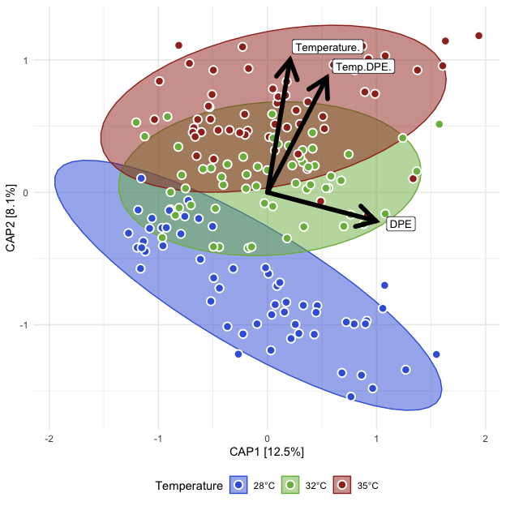<!-- -->

##### Tables

###### (hide)

Press on tabs to display tables. Scroll to see additional rows.

###### Capscale

<table class="gt_table" data-quarto-disable-processing="false" data-quarto-bootstrap="false">
  <thead>
    <tr class="gt_heading">
      <td colspan="7" class="gt_heading gt_title gt_font_normal" style>ADONIS2</td>
    </tr>
    <tr class="gt_heading">
      <td colspan="7" class="gt_heading gt_subtitle gt_font_normal gt_bottom_border" style>adonis2(Beta Distance ~ Temperature*DPE); Unexposed fish</td>
    </tr>
    <tr class="gt_col_headings">
      <th class="gt_col_heading gt_columns_bottom_border gt_left" rowspan="1" colspan="1" scope="col" id="term">term</th>
      <th class="gt_col_heading gt_columns_bottom_border gt_right" rowspan="1" colspan="1" scope="col" id="df">df</th>
      <th class="gt_col_heading gt_columns_bottom_border gt_right" rowspan="1" colspan="1" scope="col" id="SumOfSqs">SumOfSqs</th>
      <th class="gt_col_heading gt_columns_bottom_border gt_right" rowspan="1" colspan="1" scope="col" id="R2">R2</th>
      <th class="gt_col_heading gt_columns_bottom_border gt_right" rowspan="1" colspan="1" scope="col" id="statistic">statistic</th>
      <th class="gt_col_heading gt_columns_bottom_border gt_right" rowspan="1" colspan="1" scope="col" id="p.value">p.value</th>
      <th class="gt_col_heading gt_columns_bottom_border gt_right" rowspan="1" colspan="1" scope="col" id="sig">sig</th>
    </tr>
  </thead>
  <tbody class="gt_table_body">
    <tr class="gt_group_heading_row">
      <th colspan="7" class="gt_group_heading" scope="colgroup" id="bray">bray</th>
    </tr>
    <tr class="gt_row_group_first"><td headers="bray  term" class="gt_row gt_left">Temperature</td>
<td headers="bray  df" class="gt_row gt_right">2.000</td>
<td headers="bray  SumOfSqs" class="gt_row gt_right">2.294</td>
<td headers="bray  R2" class="gt_row gt_right">0.133</td>
<td headers="bray  statistic" class="gt_row gt_right">16.443</td>
<td headers="bray  p.value" class="gt_row gt_right">0.001</td>
<td headers="bray  sig" class="gt_row gt_right">***</td></tr>
    <tr><td headers="bray  term" class="gt_row gt_left">DPE</td>
<td headers="bray  df" class="gt_row gt_right">1.000</td>
<td headers="bray  SumOfSqs" class="gt_row gt_right">2.531</td>
<td headers="bray  R2" class="gt_row gt_right">0.147</td>
<td headers="bray  statistic" class="gt_row gt_right">36.284</td>
<td headers="bray  p.value" class="gt_row gt_right">0.001</td>
<td headers="bray  sig" class="gt_row gt_right">***</td></tr>
    <tr><td headers="bray  term" class="gt_row gt_left">Temperature:DPE</td>
<td headers="bray  df" class="gt_row gt_right">2.000</td>
<td headers="bray  SumOfSqs" class="gt_row gt_right">0.896</td>
<td headers="bray  R2" class="gt_row gt_right">0.052</td>
<td headers="bray  statistic" class="gt_row gt_right">6.425</td>
<td headers="bray  p.value" class="gt_row gt_right">0.001</td>
<td headers="bray  sig" class="gt_row gt_right">***</td></tr>
    <tr><td headers="bray  term" class="gt_row gt_left">Residual</td>
<td headers="bray  df" class="gt_row gt_right">165.000</td>
<td headers="bray  SumOfSqs" class="gt_row gt_right">11.509</td>
<td headers="bray  R2" class="gt_row gt_right">0.668</td>
<td headers="bray  statistic" class="gt_row gt_right">NA</td>
<td headers="bray  p.value" class="gt_row gt_right">NA</td>
<td headers="bray  sig" class="gt_row gt_right">NA</td></tr>
    <tr><td headers="bray  term" class="gt_row gt_left">Total</td>
<td headers="bray  df" class="gt_row gt_right">170.000</td>
<td headers="bray  SumOfSqs" class="gt_row gt_right">17.229</td>
<td headers="bray  R2" class="gt_row gt_right">1.000</td>
<td headers="bray  statistic" class="gt_row gt_right">NA</td>
<td headers="bray  p.value" class="gt_row gt_right">NA</td>
<td headers="bray  sig" class="gt_row gt_right">NA</td></tr>
    <tr class="gt_group_heading_row">
      <th colspan="7" class="gt_group_heading" scope="colgroup" id="canberra">canberra</th>
    </tr>
    <tr class="gt_row_group_first"><td headers="canberra  term" class="gt_row gt_left">Temperature</td>
<td headers="canberra  df" class="gt_row gt_right">2.000</td>
<td headers="canberra  SumOfSqs" class="gt_row gt_right">3.862</td>
<td headers="canberra  R2" class="gt_row gt_right">0.099</td>
<td headers="canberra  statistic" class="gt_row gt_right">10.667</td>
<td headers="canberra  p.value" class="gt_row gt_right">0.001</td>
<td headers="canberra  sig" class="gt_row gt_right">***</td></tr>
    <tr><td headers="canberra  term" class="gt_row gt_left">DPE</td>
<td headers="canberra  df" class="gt_row gt_right">1.000</td>
<td headers="canberra  SumOfSqs" class="gt_row gt_right">3.655</td>
<td headers="canberra  R2" class="gt_row gt_right">0.093</td>
<td headers="canberra  statistic" class="gt_row gt_right">20.192</td>
<td headers="canberra  p.value" class="gt_row gt_right">0.001</td>
<td headers="canberra  sig" class="gt_row gt_right">***</td></tr>
    <tr><td headers="canberra  term" class="gt_row gt_left">Temperature:DPE</td>
<td headers="canberra  df" class="gt_row gt_right">2.000</td>
<td headers="canberra  SumOfSqs" class="gt_row gt_right">1.820</td>
<td headers="canberra  R2" class="gt_row gt_right">0.046</td>
<td headers="canberra  statistic" class="gt_row gt_right">5.026</td>
<td headers="canberra  p.value" class="gt_row gt_right">0.001</td>
<td headers="canberra  sig" class="gt_row gt_right">***</td></tr>
    <tr><td headers="canberra  term" class="gt_row gt_left">Residual</td>
<td headers="canberra  df" class="gt_row gt_right">165.000</td>
<td headers="canberra  SumOfSqs" class="gt_row gt_right">29.869</td>
<td headers="canberra  R2" class="gt_row gt_right">0.762</td>
<td headers="canberra  statistic" class="gt_row gt_right">NA</td>
<td headers="canberra  p.value" class="gt_row gt_right">NA</td>
<td headers="canberra  sig" class="gt_row gt_right">NA</td></tr>
    <tr><td headers="canberra  term" class="gt_row gt_left">Total</td>
<td headers="canberra  df" class="gt_row gt_right">170.000</td>
<td headers="canberra  SumOfSqs" class="gt_row gt_right">39.206</td>
<td headers="canberra  R2" class="gt_row gt_right">1.000</td>
<td headers="canberra  statistic" class="gt_row gt_right">NA</td>
<td headers="canberra  p.value" class="gt_row gt_right">NA</td>
<td headers="canberra  sig" class="gt_row gt_right">NA</td></tr>
    <tr class="gt_group_heading_row">
      <th colspan="7" class="gt_group_heading" scope="colgroup" id="gunifrac">gunifrac</th>
    </tr>
    <tr class="gt_row_group_first"><td headers="gunifrac  term" class="gt_row gt_left">Temperature</td>
<td headers="gunifrac  df" class="gt_row gt_right">2.000</td>
<td headers="gunifrac  SumOfSqs" class="gt_row gt_right">1.422</td>
<td headers="gunifrac  R2" class="gt_row gt_right">0.102</td>
<td headers="gunifrac  statistic" class="gt_row gt_right">11.984</td>
<td headers="gunifrac  p.value" class="gt_row gt_right">0.001</td>
<td headers="gunifrac  sig" class="gt_row gt_right">***</td></tr>
    <tr><td headers="gunifrac  term" class="gt_row gt_left">DPE</td>
<td headers="gunifrac  df" class="gt_row gt_right">1.000</td>
<td headers="gunifrac  SumOfSqs" class="gt_row gt_right">2.123</td>
<td headers="gunifrac  R2" class="gt_row gt_right">0.153</td>
<td headers="gunifrac  statistic" class="gt_row gt_right">35.785</td>
<td headers="gunifrac  p.value" class="gt_row gt_right">0.001</td>
<td headers="gunifrac  sig" class="gt_row gt_right">***</td></tr>
    <tr><td headers="gunifrac  term" class="gt_row gt_left">Temperature:DPE</td>
<td headers="gunifrac  df" class="gt_row gt_right">2.000</td>
<td headers="gunifrac  SumOfSqs" class="gt_row gt_right">0.574</td>
<td headers="gunifrac  R2" class="gt_row gt_right">0.041</td>
<td headers="gunifrac  statistic" class="gt_row gt_right">4.840</td>
<td headers="gunifrac  p.value" class="gt_row gt_right">0.001</td>
<td headers="gunifrac  sig" class="gt_row gt_right">***</td></tr>
    <tr><td headers="gunifrac  term" class="gt_row gt_left">Residual</td>
<td headers="gunifrac  df" class="gt_row gt_right">165.000</td>
<td headers="gunifrac  SumOfSqs" class="gt_row gt_right">9.788</td>
<td headers="gunifrac  R2" class="gt_row gt_right">0.704</td>
<td headers="gunifrac  statistic" class="gt_row gt_right">NA</td>
<td headers="gunifrac  p.value" class="gt_row gt_right">NA</td>
<td headers="gunifrac  sig" class="gt_row gt_right">NA</td></tr>
    <tr><td headers="gunifrac  term" class="gt_row gt_left">Total</td>
<td headers="gunifrac  df" class="gt_row gt_right">170.000</td>
<td headers="gunifrac  SumOfSqs" class="gt_row gt_right">13.907</td>
<td headers="gunifrac  R2" class="gt_row gt_right">1.000</td>
<td headers="gunifrac  statistic" class="gt_row gt_right">NA</td>
<td headers="gunifrac  p.value" class="gt_row gt_right">NA</td>
<td headers="gunifrac  sig" class="gt_row gt_right">NA</td></tr>
  </tbody>
  &#10;  
</table>

###### Dispersion (ANOVA)

<table class="gt_table" data-quarto-disable-processing="false" data-quarto-bootstrap="false">
  <thead>
    <tr class="gt_heading">
      <td colspan="7" class="gt_heading gt_title gt_font_normal" style>ANOVA: Homogeneity of Dispersion</td>
    </tr>
    <tr class="gt_heading">
      <td colspan="7" class="gt_heading gt_subtitle gt_font_normal gt_bottom_border" style>ANOVA(Beta Disperson ~ Temperature); Unexposed fish</td>
    </tr>
    <tr class="gt_col_headings">
      <th class="gt_col_heading gt_columns_bottom_border gt_left" rowspan="1" colspan="1" scope="col" id="term">term</th>
      <th class="gt_col_heading gt_columns_bottom_border gt_right" rowspan="1" colspan="1" scope="col" id="df">df</th>
      <th class="gt_col_heading gt_columns_bottom_border gt_right" rowspan="1" colspan="1" scope="col" id="sumsq">sumsq</th>
      <th class="gt_col_heading gt_columns_bottom_border gt_right" rowspan="1" colspan="1" scope="col" id="meansq">meansq</th>
      <th class="gt_col_heading gt_columns_bottom_border gt_right" rowspan="1" colspan="1" scope="col" id="statistic">statistic</th>
      <th class="gt_col_heading gt_columns_bottom_border gt_right" rowspan="1" colspan="1" scope="col" id="p.value">p.value</th>
      <th class="gt_col_heading gt_columns_bottom_border gt_right" rowspan="1" colspan="1" scope="col" id="sig">sig</th>
    </tr>
  </thead>
  <tbody class="gt_table_body">
    <tr class="gt_group_heading_row">
      <th colspan="7" class="gt_group_heading" scope="colgroup" id="bray">bray</th>
    </tr>
    <tr class="gt_row_group_first"><td headers="bray  term" class="gt_row gt_left">Temp.DPE</td>
<td headers="bray  df" class="gt_row gt_right">14.000</td>
<td headers="bray  sumsq" class="gt_row gt_right">0.290</td>
<td headers="bray  meansq" class="gt_row gt_right">0.021</td>
<td headers="bray  statistic" class="gt_row gt_right">2.348</td>
<td headers="bray  p.value" class="gt_row gt_right">0.006</td>
<td headers="bray  sig" class="gt_row gt_right">**</td></tr>
    <tr><td headers="bray  term" class="gt_row gt_left">Residual</td>
<td headers="bray  df" class="gt_row gt_right">156.000</td>
<td headers="bray  sumsq" class="gt_row gt_right">1.376</td>
<td headers="bray  meansq" class="gt_row gt_right">0.009</td>
<td headers="bray  statistic" class="gt_row gt_right">NA</td>
<td headers="bray  p.value" class="gt_row gt_right">NA</td>
<td headers="bray  sig" class="gt_row gt_right">NA</td></tr>
    <tr class="gt_group_heading_row">
      <th colspan="7" class="gt_group_heading" scope="colgroup" id="canberra">canberra</th>
    </tr>
    <tr class="gt_row_group_first"><td headers="canberra  term" class="gt_row gt_left">Temp.DPE</td>
<td headers="canberra  df" class="gt_row gt_right">14.000</td>
<td headers="canberra  sumsq" class="gt_row gt_right">0.250</td>
<td headers="canberra  meansq" class="gt_row gt_right">0.018</td>
<td headers="canberra  statistic" class="gt_row gt_right">3.344</td>
<td headers="canberra  p.value" class="gt_row gt_right">&lt;0.001</td>
<td headers="canberra  sig" class="gt_row gt_right">***</td></tr>
    <tr><td headers="canberra  term" class="gt_row gt_left">Residual</td>
<td headers="canberra  df" class="gt_row gt_right">156.000</td>
<td headers="canberra  sumsq" class="gt_row gt_right">0.831</td>
<td headers="canberra  meansq" class="gt_row gt_right">0.005</td>
<td headers="canberra  statistic" class="gt_row gt_right">NA</td>
<td headers="canberra  p.value" class="gt_row gt_right">NA</td>
<td headers="canberra  sig" class="gt_row gt_right">NA</td></tr>
    <tr class="gt_group_heading_row">
      <th colspan="7" class="gt_group_heading" scope="colgroup" id="gunifrac">gunifrac</th>
    </tr>
    <tr class="gt_row_group_first"><td headers="gunifrac  term" class="gt_row gt_left">Temp.DPE</td>
<td headers="gunifrac  df" class="gt_row gt_right">14.000</td>
<td headers="gunifrac  sumsq" class="gt_row gt_right">0.249</td>
<td headers="gunifrac  meansq" class="gt_row gt_right">0.018</td>
<td headers="gunifrac  statistic" class="gt_row gt_right">2.986</td>
<td headers="gunifrac  p.value" class="gt_row gt_right">&lt;0.001</td>
<td headers="gunifrac  sig" class="gt_row gt_right">***</td></tr>
    <tr><td headers="gunifrac  term" class="gt_row gt_left">Residual</td>
<td headers="gunifrac  df" class="gt_row gt_right">156.000</td>
<td headers="gunifrac  sumsq" class="gt_row gt_right">0.929</td>
<td headers="gunifrac  meansq" class="gt_row gt_right">0.006</td>
<td headers="gunifrac  statistic" class="gt_row gt_right">NA</td>
<td headers="gunifrac  p.value" class="gt_row gt_right">NA</td>
<td headers="gunifrac  sig" class="gt_row gt_right">NA</td></tr>
  </tbody>
  &#10;  
</table>

###### Dispersion (Tukey)

<table class="gt_table" data-quarto-disable-processing="false" data-quarto-bootstrap="false">
  <thead>
    <tr class="gt_heading">
      <td colspan="9" class="gt_heading gt_title gt_font_normal" style>Tukey: Homogeneity of Dispersion</td>
    </tr>
    <tr class="gt_heading">
      <td colspan="9" class="gt_heading gt_subtitle gt_font_normal gt_bottom_border" style>Tukey(Beta Disperson ~ Temperature*DPE); Unexposed fish</td>
    </tr>
    <tr class="gt_col_headings">
      <th class="gt_col_heading gt_columns_bottom_border gt_left" rowspan="1" colspan="1" scope="col" id=".y.">.y.</th>
      <th class="gt_col_heading gt_columns_bottom_border gt_left" rowspan="1" colspan="1" scope="col" id="term">term</th>
      <th class="gt_col_heading gt_columns_bottom_border gt_left" rowspan="1" colspan="1" scope="col" id="group1">group1</th>
      <th class="gt_col_heading gt_columns_bottom_border gt_left" rowspan="1" colspan="1" scope="col" id="group2">group2</th>
      <th class="gt_col_heading gt_columns_bottom_border gt_right" rowspan="1" colspan="1" scope="col" id="estimate">estimate</th>
      <th class="gt_col_heading gt_columns_bottom_border gt_right" rowspan="1" colspan="1" scope="col" id="conf.low">conf.low</th>
      <th class="gt_col_heading gt_columns_bottom_border gt_right" rowspan="1" colspan="1" scope="col" id="conf.high">conf.high</th>
      <th class="gt_col_heading gt_columns_bottom_border gt_right" rowspan="1" colspan="1" scope="col" id="adj.p.value">adj.p.value</th>
      <th class="gt_col_heading gt_columns_bottom_border gt_left" rowspan="1" colspan="1" scope="col" id="sig">sig</th>
    </tr>
  </thead>
  <tbody class="gt_table_body">
    <tr class="gt_group_heading_row">
      <th colspan="9" class="gt_group_heading" scope="colgroup" id="bray">bray</th>
    </tr>
    <tr class="gt_row_group_first"><td headers="bray  .y." class="gt_row gt_left">Distance</td>
<td headers="bray  term" class="gt_row gt_left">Temp.DPE</td>
<td headers="bray  group1" class="gt_row gt_left">28°C__14DPE</td>
<td headers="bray  group2" class="gt_row gt_left">28°C__0DPE</td>
<td headers="bray  estimate" class="gt_row gt_right">0.024</td>
<td headers="bray  conf.low" class="gt_row gt_right">−0.112</td>
<td headers="bray  conf.high" class="gt_row gt_right">0.159</td>
<td headers="bray  adj.p.value" class="gt_row gt_right">≥0.25</td>
<td headers="bray  sig" class="gt_row gt_left">ns</td></tr>
    <tr><td headers="bray  .y." class="gt_row gt_left">Distance</td>
<td headers="bray  term" class="gt_row gt_left">Temp.DPE</td>
<td headers="bray  group1" class="gt_row gt_left">28°C__21DPE</td>
<td headers="bray  group2" class="gt_row gt_left">28°C__0DPE</td>
<td headers="bray  estimate" class="gt_row gt_right">0.052</td>
<td headers="bray  conf.low" class="gt_row gt_right">−0.074</td>
<td headers="bray  conf.high" class="gt_row gt_right">0.177</td>
<td headers="bray  adj.p.value" class="gt_row gt_right">≥0.25</td>
<td headers="bray  sig" class="gt_row gt_left">ns</td></tr>
    <tr><td headers="bray  .y." class="gt_row gt_left">Distance</td>
<td headers="bray  term" class="gt_row gt_left">Temp.DPE</td>
<td headers="bray  group1" class="gt_row gt_left">28°C__28DPE</td>
<td headers="bray  group2" class="gt_row gt_left">28°C__0DPE</td>
<td headers="bray  estimate" class="gt_row gt_right">0.007</td>
<td headers="bray  conf.low" class="gt_row gt_right">−0.118</td>
<td headers="bray  conf.high" class="gt_row gt_right">0.133</td>
<td headers="bray  adj.p.value" class="gt_row gt_right">≥0.25</td>
<td headers="bray  sig" class="gt_row gt_left">ns</td></tr>
    <tr><td headers="bray  .y." class="gt_row gt_left">Distance</td>
<td headers="bray  term" class="gt_row gt_left">Temp.DPE</td>
<td headers="bray  group1" class="gt_row gt_left">28°C__42DPE</td>
<td headers="bray  group2" class="gt_row gt_left">28°C__0DPE</td>
<td headers="bray  estimate" class="gt_row gt_right">−0.017</td>
<td headers="bray  conf.low" class="gt_row gt_right">−0.147</td>
<td headers="bray  conf.high" class="gt_row gt_right">0.113</td>
<td headers="bray  adj.p.value" class="gt_row gt_right">≥0.25</td>
<td headers="bray  sig" class="gt_row gt_left">ns</td></tr>
    <tr><td headers="bray  .y." class="gt_row gt_left">Distance</td>
<td headers="bray  term" class="gt_row gt_left">Temp.DPE</td>
<td headers="bray  group1" class="gt_row gt_left">32°C__0DPE</td>
<td headers="bray  group2" class="gt_row gt_left">28°C__0DPE</td>
<td headers="bray  estimate" class="gt_row gt_right">0.097</td>
<td headers="bray  conf.low" class="gt_row gt_right">−0.005</td>
<td headers="bray  conf.high" class="gt_row gt_right">0.199</td>
<td headers="bray  adj.p.value" class="gt_row gt_right">0.085</td>
<td headers="bray  sig" class="gt_row gt_left">ns</td></tr>
    <tr><td headers="bray  .y." class="gt_row gt_left">Distance</td>
<td headers="bray  term" class="gt_row gt_left">Temp.DPE</td>
<td headers="bray  group1" class="gt_row gt_left">32°C__14DPE</td>
<td headers="bray  group2" class="gt_row gt_left">28°C__0DPE</td>
<td headers="bray  estimate" class="gt_row gt_right">0.041</td>
<td headers="bray  conf.low" class="gt_row gt_right">−0.085</td>
<td headers="bray  conf.high" class="gt_row gt_right">0.166</td>
<td headers="bray  adj.p.value" class="gt_row gt_right">≥0.25</td>
<td headers="bray  sig" class="gt_row gt_left">ns</td></tr>
    <tr><td headers="bray  .y." class="gt_row gt_left">Distance</td>
<td headers="bray  term" class="gt_row gt_left">Temp.DPE</td>
<td headers="bray  group1" class="gt_row gt_left">32°C__21DPE</td>
<td headers="bray  group2" class="gt_row gt_left">28°C__0DPE</td>
<td headers="bray  estimate" class="gt_row gt_right">−0.018</td>
<td headers="bray  conf.low" class="gt_row gt_right">−0.143</td>
<td headers="bray  conf.high" class="gt_row gt_right">0.108</td>
<td headers="bray  adj.p.value" class="gt_row gt_right">≥0.25</td>
<td headers="bray  sig" class="gt_row gt_left">ns</td></tr>
    <tr><td headers="bray  .y." class="gt_row gt_left">Distance</td>
<td headers="bray  term" class="gt_row gt_left">Temp.DPE</td>
<td headers="bray  group1" class="gt_row gt_left">32°C__28DPE</td>
<td headers="bray  group2" class="gt_row gt_left">28°C__0DPE</td>
<td headers="bray  estimate" class="gt_row gt_right">0.028</td>
<td headers="bray  conf.low" class="gt_row gt_right">−0.102</td>
<td headers="bray  conf.high" class="gt_row gt_right">0.158</td>
<td headers="bray  adj.p.value" class="gt_row gt_right">≥0.25</td>
<td headers="bray  sig" class="gt_row gt_left">ns</td></tr>
    <tr><td headers="bray  .y." class="gt_row gt_left">Distance</td>
<td headers="bray  term" class="gt_row gt_left">Temp.DPE</td>
<td headers="bray  group1" class="gt_row gt_left">32°C__42DPE</td>
<td headers="bray  group2" class="gt_row gt_left">28°C__0DPE</td>
<td headers="bray  estimate" class="gt_row gt_right">0.017</td>
<td headers="bray  conf.low" class="gt_row gt_right">−0.108</td>
<td headers="bray  conf.high" class="gt_row gt_right">0.142</td>
<td headers="bray  adj.p.value" class="gt_row gt_right">≥0.25</td>
<td headers="bray  sig" class="gt_row gt_left">ns</td></tr>
    <tr><td headers="bray  .y." class="gt_row gt_left">Distance</td>
<td headers="bray  term" class="gt_row gt_left">Temp.DPE</td>
<td headers="bray  group1" class="gt_row gt_left">35°C__0DPE</td>
<td headers="bray  group2" class="gt_row gt_left">28°C__0DPE</td>
<td headers="bray  estimate" class="gt_row gt_right">0.044</td>
<td headers="bray  conf.low" class="gt_row gt_right">−0.058</td>
<td headers="bray  conf.high" class="gt_row gt_right">0.146</td>
<td headers="bray  adj.p.value" class="gt_row gt_right">≥0.25</td>
<td headers="bray  sig" class="gt_row gt_left">ns</td></tr>
    <tr><td headers="bray  .y." class="gt_row gt_left">Distance</td>
<td headers="bray  term" class="gt_row gt_left">Temp.DPE</td>
<td headers="bray  group1" class="gt_row gt_left">35°C__14DPE</td>
<td headers="bray  group2" class="gt_row gt_left">28°C__0DPE</td>
<td headers="bray  estimate" class="gt_row gt_right">0.004</td>
<td headers="bray  conf.low" class="gt_row gt_right">−0.126</td>
<td headers="bray  conf.high" class="gt_row gt_right">0.134</td>
<td headers="bray  adj.p.value" class="gt_row gt_right">≥0.25</td>
<td headers="bray  sig" class="gt_row gt_left">ns</td></tr>
    <tr><td headers="bray  .y." class="gt_row gt_left">Distance</td>
<td headers="bray  term" class="gt_row gt_left">Temp.DPE</td>
<td headers="bray  group1" class="gt_row gt_left">35°C__21DPE</td>
<td headers="bray  group2" class="gt_row gt_left">28°C__0DPE</td>
<td headers="bray  estimate" class="gt_row gt_right">−0.004</td>
<td headers="bray  conf.low" class="gt_row gt_right">−0.134</td>
<td headers="bray  conf.high" class="gt_row gt_right">0.126</td>
<td headers="bray  adj.p.value" class="gt_row gt_right">≥0.25</td>
<td headers="bray  sig" class="gt_row gt_left">ns</td></tr>
    <tr><td headers="bray  .y." class="gt_row gt_left">Distance</td>
<td headers="bray  term" class="gt_row gt_left">Temp.DPE</td>
<td headers="bray  group1" class="gt_row gt_left">35°C__28DPE</td>
<td headers="bray  group2" class="gt_row gt_left">28°C__0DPE</td>
<td headers="bray  estimate" class="gt_row gt_right">0.033</td>
<td headers="bray  conf.low" class="gt_row gt_right">−0.097</td>
<td headers="bray  conf.high" class="gt_row gt_right">0.162</td>
<td headers="bray  adj.p.value" class="gt_row gt_right">≥0.25</td>
<td headers="bray  sig" class="gt_row gt_left">ns</td></tr>
    <tr><td headers="bray  .y." class="gt_row gt_left">Distance</td>
<td headers="bray  term" class="gt_row gt_left">Temp.DPE</td>
<td headers="bray  group1" class="gt_row gt_left">35°C__42DPE</td>
<td headers="bray  group2" class="gt_row gt_left">28°C__0DPE</td>
<td headers="bray  estimate" class="gt_row gt_right">0.146</td>
<td headers="bray  conf.low" class="gt_row gt_right">0.011</td>
<td headers="bray  conf.high" class="gt_row gt_right">0.282</td>
<td headers="bray  adj.p.value" class="gt_row gt_right">0.021</td>
<td headers="bray  sig" class="gt_row gt_left">*</td></tr>
    <tr><td headers="bray  .y." class="gt_row gt_left">Distance</td>
<td headers="bray  term" class="gt_row gt_left">Temp.DPE</td>
<td headers="bray  group1" class="gt_row gt_left">28°C__21DPE</td>
<td headers="bray  group2" class="gt_row gt_left">28°C__14DPE</td>
<td headers="bray  estimate" class="gt_row gt_right">0.028</td>
<td headers="bray  conf.low" class="gt_row gt_right">−0.126</td>
<td headers="bray  conf.high" class="gt_row gt_right">0.181</td>
<td headers="bray  adj.p.value" class="gt_row gt_right">≥0.25</td>
<td headers="bray  sig" class="gt_row gt_left">ns</td></tr>
    <tr><td headers="bray  .y." class="gt_row gt_left">Distance</td>
<td headers="bray  term" class="gt_row gt_left">Temp.DPE</td>
<td headers="bray  group1" class="gt_row gt_left">28°C__28DPE</td>
<td headers="bray  group2" class="gt_row gt_left">28°C__14DPE</td>
<td headers="bray  estimate" class="gt_row gt_right">−0.016</td>
<td headers="bray  conf.low" class="gt_row gt_right">−0.170</td>
<td headers="bray  conf.high" class="gt_row gt_right">0.137</td>
<td headers="bray  adj.p.value" class="gt_row gt_right">≥0.25</td>
<td headers="bray  sig" class="gt_row gt_left">ns</td></tr>
    <tr><td headers="bray  .y." class="gt_row gt_left">Distance</td>
<td headers="bray  term" class="gt_row gt_left">Temp.DPE</td>
<td headers="bray  group1" class="gt_row gt_left">28°C__42DPE</td>
<td headers="bray  group2" class="gt_row gt_left">28°C__14DPE</td>
<td headers="bray  estimate" class="gt_row gt_right">−0.040</td>
<td headers="bray  conf.low" class="gt_row gt_right">−0.198</td>
<td headers="bray  conf.high" class="gt_row gt_right">0.117</td>
<td headers="bray  adj.p.value" class="gt_row gt_right">≥0.25</td>
<td headers="bray  sig" class="gt_row gt_left">ns</td></tr>
    <tr><td headers="bray  .y." class="gt_row gt_left">Distance</td>
<td headers="bray  term" class="gt_row gt_left">Temp.DPE</td>
<td headers="bray  group1" class="gt_row gt_left">32°C__0DPE</td>
<td headers="bray  group2" class="gt_row gt_left">28°C__14DPE</td>
<td headers="bray  estimate" class="gt_row gt_right">0.073</td>
<td headers="bray  conf.low" class="gt_row gt_right">−0.062</td>
<td headers="bray  conf.high" class="gt_row gt_right">0.209</td>
<td headers="bray  adj.p.value" class="gt_row gt_right">≥0.25</td>
<td headers="bray  sig" class="gt_row gt_left">ns</td></tr>
    <tr><td headers="bray  .y." class="gt_row gt_left">Distance</td>
<td headers="bray  term" class="gt_row gt_left">Temp.DPE</td>
<td headers="bray  group1" class="gt_row gt_left">32°C__14DPE</td>
<td headers="bray  group2" class="gt_row gt_left">28°C__14DPE</td>
<td headers="bray  estimate" class="gt_row gt_right">0.017</td>
<td headers="bray  conf.low" class="gt_row gt_right">−0.136</td>
<td headers="bray  conf.high" class="gt_row gt_right">0.171</td>
<td headers="bray  adj.p.value" class="gt_row gt_right">≥0.25</td>
<td headers="bray  sig" class="gt_row gt_left">ns</td></tr>
    <tr><td headers="bray  .y." class="gt_row gt_left">Distance</td>
<td headers="bray  term" class="gt_row gt_left">Temp.DPE</td>
<td headers="bray  group1" class="gt_row gt_left">32°C__21DPE</td>
<td headers="bray  group2" class="gt_row gt_left">28°C__14DPE</td>
<td headers="bray  estimate" class="gt_row gt_right">−0.041</td>
<td headers="bray  conf.low" class="gt_row gt_right">−0.195</td>
<td headers="bray  conf.high" class="gt_row gt_right">0.112</td>
<td headers="bray  adj.p.value" class="gt_row gt_right">≥0.25</td>
<td headers="bray  sig" class="gt_row gt_left">ns</td></tr>
    <tr><td headers="bray  .y." class="gt_row gt_left">Distance</td>
<td headers="bray  term" class="gt_row gt_left">Temp.DPE</td>
<td headers="bray  group1" class="gt_row gt_left">32°C__28DPE</td>
<td headers="bray  group2" class="gt_row gt_left">28°C__14DPE</td>
<td headers="bray  estimate" class="gt_row gt_right">0.005</td>
<td headers="bray  conf.low" class="gt_row gt_right">−0.153</td>
<td headers="bray  conf.high" class="gt_row gt_right">0.162</td>
<td headers="bray  adj.p.value" class="gt_row gt_right">≥0.25</td>
<td headers="bray  sig" class="gt_row gt_left">ns</td></tr>
    <tr><td headers="bray  .y." class="gt_row gt_left">Distance</td>
<td headers="bray  term" class="gt_row gt_left">Temp.DPE</td>
<td headers="bray  group1" class="gt_row gt_left">32°C__42DPE</td>
<td headers="bray  group2" class="gt_row gt_left">28°C__14DPE</td>
<td headers="bray  estimate" class="gt_row gt_right">−0.006</td>
<td headers="bray  conf.low" class="gt_row gt_right">−0.160</td>
<td headers="bray  conf.high" class="gt_row gt_right">0.147</td>
<td headers="bray  adj.p.value" class="gt_row gt_right">≥0.25</td>
<td headers="bray  sig" class="gt_row gt_left">ns</td></tr>
    <tr><td headers="bray  .y." class="gt_row gt_left">Distance</td>
<td headers="bray  term" class="gt_row gt_left">Temp.DPE</td>
<td headers="bray  group1" class="gt_row gt_left">35°C__0DPE</td>
<td headers="bray  group2" class="gt_row gt_left">28°C__14DPE</td>
<td headers="bray  estimate" class="gt_row gt_right">0.020</td>
<td headers="bray  conf.low" class="gt_row gt_right">−0.115</td>
<td headers="bray  conf.high" class="gt_row gt_right">0.156</td>
<td headers="bray  adj.p.value" class="gt_row gt_right">≥0.25</td>
<td headers="bray  sig" class="gt_row gt_left">ns</td></tr>
    <tr><td headers="bray  .y." class="gt_row gt_left">Distance</td>
<td headers="bray  term" class="gt_row gt_left">Temp.DPE</td>
<td headers="bray  group1" class="gt_row gt_left">35°C__14DPE</td>
<td headers="bray  group2" class="gt_row gt_left">28°C__14DPE</td>
<td headers="bray  estimate" class="gt_row gt_right">−0.019</td>
<td headers="bray  conf.low" class="gt_row gt_right">−0.176</td>
<td headers="bray  conf.high" class="gt_row gt_right">0.138</td>
<td headers="bray  adj.p.value" class="gt_row gt_right">≥0.25</td>
<td headers="bray  sig" class="gt_row gt_left">ns</td></tr>
    <tr><td headers="bray  .y." class="gt_row gt_left">Distance</td>
<td headers="bray  term" class="gt_row gt_left">Temp.DPE</td>
<td headers="bray  group1" class="gt_row gt_left">35°C__21DPE</td>
<td headers="bray  group2" class="gt_row gt_left">28°C__14DPE</td>
<td headers="bray  estimate" class="gt_row gt_right">−0.028</td>
<td headers="bray  conf.low" class="gt_row gt_right">−0.185</td>
<td headers="bray  conf.high" class="gt_row gt_right">0.129</td>
<td headers="bray  adj.p.value" class="gt_row gt_right">≥0.25</td>
<td headers="bray  sig" class="gt_row gt_left">ns</td></tr>
    <tr><td headers="bray  .y." class="gt_row gt_left">Distance</td>
<td headers="bray  term" class="gt_row gt_left">Temp.DPE</td>
<td headers="bray  group1" class="gt_row gt_left">35°C__28DPE</td>
<td headers="bray  group2" class="gt_row gt_left">28°C__14DPE</td>
<td headers="bray  estimate" class="gt_row gt_right">0.009</td>
<td headers="bray  conf.low" class="gt_row gt_right">−0.148</td>
<td headers="bray  conf.high" class="gt_row gt_right">0.166</td>
<td headers="bray  adj.p.value" class="gt_row gt_right">≥0.25</td>
<td headers="bray  sig" class="gt_row gt_left">ns</td></tr>
    <tr><td headers="bray  .y." class="gt_row gt_left">Distance</td>
<td headers="bray  term" class="gt_row gt_left">Temp.DPE</td>
<td headers="bray  group1" class="gt_row gt_left">35°C__42DPE</td>
<td headers="bray  group2" class="gt_row gt_left">28°C__14DPE</td>
<td headers="bray  estimate" class="gt_row gt_right">0.123</td>
<td headers="bray  conf.low" class="gt_row gt_right">−0.039</td>
<td headers="bray  conf.high" class="gt_row gt_right">0.284</td>
<td headers="bray  adj.p.value" class="gt_row gt_right">≥0.25</td>
<td headers="bray  sig" class="gt_row gt_left">ns</td></tr>
    <tr><td headers="bray  .y." class="gt_row gt_left">Distance</td>
<td headers="bray  term" class="gt_row gt_left">Temp.DPE</td>
<td headers="bray  group1" class="gt_row gt_left">28°C__28DPE</td>
<td headers="bray  group2" class="gt_row gt_left">28°C__21DPE</td>
<td headers="bray  estimate" class="gt_row gt_right">−0.044</td>
<td headers="bray  conf.low" class="gt_row gt_right">−0.189</td>
<td headers="bray  conf.high" class="gt_row gt_right">0.101</td>
<td headers="bray  adj.p.value" class="gt_row gt_right">≥0.25</td>
<td headers="bray  sig" class="gt_row gt_left">ns</td></tr>
    <tr><td headers="bray  .y." class="gt_row gt_left">Distance</td>
<td headers="bray  term" class="gt_row gt_left">Temp.DPE</td>
<td headers="bray  group1" class="gt_row gt_left">28°C__42DPE</td>
<td headers="bray  group2" class="gt_row gt_left">28°C__21DPE</td>
<td headers="bray  estimate" class="gt_row gt_right">−0.068</td>
<td headers="bray  conf.low" class="gt_row gt_right">−0.217</td>
<td headers="bray  conf.high" class="gt_row gt_right">0.081</td>
<td headers="bray  adj.p.value" class="gt_row gt_right">≥0.25</td>
<td headers="bray  sig" class="gt_row gt_left">ns</td></tr>
    <tr><td headers="bray  .y." class="gt_row gt_left">Distance</td>
<td headers="bray  term" class="gt_row gt_left">Temp.DPE</td>
<td headers="bray  group1" class="gt_row gt_left">32°C__0DPE</td>
<td headers="bray  group2" class="gt_row gt_left">28°C__21DPE</td>
<td headers="bray  estimate" class="gt_row gt_right">0.045</td>
<td headers="bray  conf.low" class="gt_row gt_right">−0.080</td>
<td headers="bray  conf.high" class="gt_row gt_right">0.171</td>
<td headers="bray  adj.p.value" class="gt_row gt_right">≥0.25</td>
<td headers="bray  sig" class="gt_row gt_left">ns</td></tr>
    <tr><td headers="bray  .y." class="gt_row gt_left">Distance</td>
<td headers="bray  term" class="gt_row gt_left">Temp.DPE</td>
<td headers="bray  group1" class="gt_row gt_left">32°C__14DPE</td>
<td headers="bray  group2" class="gt_row gt_left">28°C__21DPE</td>
<td headers="bray  estimate" class="gt_row gt_right">−0.011</td>
<td headers="bray  conf.low" class="gt_row gt_right">−0.156</td>
<td headers="bray  conf.high" class="gt_row gt_right">0.134</td>
<td headers="bray  adj.p.value" class="gt_row gt_right">≥0.25</td>
<td headers="bray  sig" class="gt_row gt_left">ns</td></tr>
    <tr><td headers="bray  .y." class="gt_row gt_left">Distance</td>
<td headers="bray  term" class="gt_row gt_left">Temp.DPE</td>
<td headers="bray  group1" class="gt_row gt_left">32°C__21DPE</td>
<td headers="bray  group2" class="gt_row gt_left">28°C__21DPE</td>
<td headers="bray  estimate" class="gt_row gt_right">−0.069</td>
<td headers="bray  conf.low" class="gt_row gt_right">−0.214</td>
<td headers="bray  conf.high" class="gt_row gt_right">0.076</td>
<td headers="bray  adj.p.value" class="gt_row gt_right">≥0.25</td>
<td headers="bray  sig" class="gt_row gt_left">ns</td></tr>
    <tr><td headers="bray  .y." class="gt_row gt_left">Distance</td>
<td headers="bray  term" class="gt_row gt_left">Temp.DPE</td>
<td headers="bray  group1" class="gt_row gt_left">32°C__28DPE</td>
<td headers="bray  group2" class="gt_row gt_left">28°C__21DPE</td>
<td headers="bray  estimate" class="gt_row gt_right">−0.023</td>
<td headers="bray  conf.low" class="gt_row gt_right">−0.172</td>
<td headers="bray  conf.high" class="gt_row gt_right">0.125</td>
<td headers="bray  adj.p.value" class="gt_row gt_right">≥0.25</td>
<td headers="bray  sig" class="gt_row gt_left">ns</td></tr>
    <tr><td headers="bray  .y." class="gt_row gt_left">Distance</td>
<td headers="bray  term" class="gt_row gt_left">Temp.DPE</td>
<td headers="bray  group1" class="gt_row gt_left">32°C__42DPE</td>
<td headers="bray  group2" class="gt_row gt_left">28°C__21DPE</td>
<td headers="bray  estimate" class="gt_row gt_right">−0.034</td>
<td headers="bray  conf.low" class="gt_row gt_right">−0.179</td>
<td headers="bray  conf.high" class="gt_row gt_right">0.110</td>
<td headers="bray  adj.p.value" class="gt_row gt_right">≥0.25</td>
<td headers="bray  sig" class="gt_row gt_left">ns</td></tr>
    <tr><td headers="bray  .y." class="gt_row gt_left">Distance</td>
<td headers="bray  term" class="gt_row gt_left">Temp.DPE</td>
<td headers="bray  group1" class="gt_row gt_left">35°C__0DPE</td>
<td headers="bray  group2" class="gt_row gt_left">28°C__21DPE</td>
<td headers="bray  estimate" class="gt_row gt_right">−0.008</td>
<td headers="bray  conf.low" class="gt_row gt_right">−0.133</td>
<td headers="bray  conf.high" class="gt_row gt_right">0.118</td>
<td headers="bray  adj.p.value" class="gt_row gt_right">≥0.25</td>
<td headers="bray  sig" class="gt_row gt_left">ns</td></tr>
    <tr><td headers="bray  .y." class="gt_row gt_left">Distance</td>
<td headers="bray  term" class="gt_row gt_left">Temp.DPE</td>
<td headers="bray  group1" class="gt_row gt_left">35°C__14DPE</td>
<td headers="bray  group2" class="gt_row gt_left">28°C__21DPE</td>
<td headers="bray  estimate" class="gt_row gt_right">−0.047</td>
<td headers="bray  conf.low" class="gt_row gt_right">−0.196</td>
<td headers="bray  conf.high" class="gt_row gt_right">0.102</td>
<td headers="bray  adj.p.value" class="gt_row gt_right">≥0.25</td>
<td headers="bray  sig" class="gt_row gt_left">ns</td></tr>
    <tr><td headers="bray  .y." class="gt_row gt_left">Distance</td>
<td headers="bray  term" class="gt_row gt_left">Temp.DPE</td>
<td headers="bray  group1" class="gt_row gt_left">35°C__21DPE</td>
<td headers="bray  group2" class="gt_row gt_left">28°C__21DPE</td>
<td headers="bray  estimate" class="gt_row gt_right">−0.056</td>
<td headers="bray  conf.low" class="gt_row gt_right">−0.205</td>
<td headers="bray  conf.high" class="gt_row gt_right">0.093</td>
<td headers="bray  adj.p.value" class="gt_row gt_right">≥0.25</td>
<td headers="bray  sig" class="gt_row gt_left">ns</td></tr>
    <tr><td headers="bray  .y." class="gt_row gt_left">Distance</td>
<td headers="bray  term" class="gt_row gt_left">Temp.DPE</td>
<td headers="bray  group1" class="gt_row gt_left">35°C__28DPE</td>
<td headers="bray  group2" class="gt_row gt_left">28°C__21DPE</td>
<td headers="bray  estimate" class="gt_row gt_right">−0.019</td>
<td headers="bray  conf.low" class="gt_row gt_right">−0.168</td>
<td headers="bray  conf.high" class="gt_row gt_right">0.130</td>
<td headers="bray  adj.p.value" class="gt_row gt_right">≥0.25</td>
<td headers="bray  sig" class="gt_row gt_left">ns</td></tr>
    <tr><td headers="bray  .y." class="gt_row gt_left">Distance</td>
<td headers="bray  term" class="gt_row gt_left">Temp.DPE</td>
<td headers="bray  group1" class="gt_row gt_left">35°C__42DPE</td>
<td headers="bray  group2" class="gt_row gt_left">28°C__21DPE</td>
<td headers="bray  estimate" class="gt_row gt_right">0.095</td>
<td headers="bray  conf.low" class="gt_row gt_right">−0.059</td>
<td headers="bray  conf.high" class="gt_row gt_right">0.248</td>
<td headers="bray  adj.p.value" class="gt_row gt_right">≥0.25</td>
<td headers="bray  sig" class="gt_row gt_left">ns</td></tr>
    <tr><td headers="bray  .y." class="gt_row gt_left">Distance</td>
<td headers="bray  term" class="gt_row gt_left">Temp.DPE</td>
<td headers="bray  group1" class="gt_row gt_left">28°C__42DPE</td>
<td headers="bray  group2" class="gt_row gt_left">28°C__28DPE</td>
<td headers="bray  estimate" class="gt_row gt_right">−0.024</td>
<td headers="bray  conf.low" class="gt_row gt_right">−0.173</td>
<td headers="bray  conf.high" class="gt_row gt_right">0.125</td>
<td headers="bray  adj.p.value" class="gt_row gt_right">≥0.25</td>
<td headers="bray  sig" class="gt_row gt_left">ns</td></tr>
    <tr><td headers="bray  .y." class="gt_row gt_left">Distance</td>
<td headers="bray  term" class="gt_row gt_left">Temp.DPE</td>
<td headers="bray  group1" class="gt_row gt_left">32°C__0DPE</td>
<td headers="bray  group2" class="gt_row gt_left">28°C__28DPE</td>
<td headers="bray  estimate" class="gt_row gt_right">0.089</td>
<td headers="bray  conf.low" class="gt_row gt_right">−0.036</td>
<td headers="bray  conf.high" class="gt_row gt_right">0.215</td>
<td headers="bray  adj.p.value" class="gt_row gt_right">≥0.25</td>
<td headers="bray  sig" class="gt_row gt_left">ns</td></tr>
    <tr><td headers="bray  .y." class="gt_row gt_left">Distance</td>
<td headers="bray  term" class="gt_row gt_left">Temp.DPE</td>
<td headers="bray  group1" class="gt_row gt_left">32°C__14DPE</td>
<td headers="bray  group2" class="gt_row gt_left">28°C__28DPE</td>
<td headers="bray  estimate" class="gt_row gt_right">0.033</td>
<td headers="bray  conf.low" class="gt_row gt_right">−0.111</td>
<td headers="bray  conf.high" class="gt_row gt_right">0.178</td>
<td headers="bray  adj.p.value" class="gt_row gt_right">≥0.25</td>
<td headers="bray  sig" class="gt_row gt_left">ns</td></tr>
    <tr><td headers="bray  .y." class="gt_row gt_left">Distance</td>
<td headers="bray  term" class="gt_row gt_left">Temp.DPE</td>
<td headers="bray  group1" class="gt_row gt_left">32°C__21DPE</td>
<td headers="bray  group2" class="gt_row gt_left">28°C__28DPE</td>
<td headers="bray  estimate" class="gt_row gt_right">−0.025</td>
<td headers="bray  conf.low" class="gt_row gt_right">−0.170</td>
<td headers="bray  conf.high" class="gt_row gt_right">0.120</td>
<td headers="bray  adj.p.value" class="gt_row gt_right">≥0.25</td>
<td headers="bray  sig" class="gt_row gt_left">ns</td></tr>
    <tr><td headers="bray  .y." class="gt_row gt_left">Distance</td>
<td headers="bray  term" class="gt_row gt_left">Temp.DPE</td>
<td headers="bray  group1" class="gt_row gt_left">32°C__28DPE</td>
<td headers="bray  group2" class="gt_row gt_left">28°C__28DPE</td>
<td headers="bray  estimate" class="gt_row gt_right">0.021</td>
<td headers="bray  conf.low" class="gt_row gt_right">−0.128</td>
<td headers="bray  conf.high" class="gt_row gt_right">0.169</td>
<td headers="bray  adj.p.value" class="gt_row gt_right">≥0.25</td>
<td headers="bray  sig" class="gt_row gt_left">ns</td></tr>
    <tr><td headers="bray  .y." class="gt_row gt_left">Distance</td>
<td headers="bray  term" class="gt_row gt_left">Temp.DPE</td>
<td headers="bray  group1" class="gt_row gt_left">32°C__42DPE</td>
<td headers="bray  group2" class="gt_row gt_left">28°C__28DPE</td>
<td headers="bray  estimate" class="gt_row gt_right">0.010</td>
<td headers="bray  conf.low" class="gt_row gt_right">−0.135</td>
<td headers="bray  conf.high" class="gt_row gt_right">0.154</td>
<td headers="bray  adj.p.value" class="gt_row gt_right">≥0.25</td>
<td headers="bray  sig" class="gt_row gt_left">ns</td></tr>
    <tr><td headers="bray  .y." class="gt_row gt_left">Distance</td>
<td headers="bray  term" class="gt_row gt_left">Temp.DPE</td>
<td headers="bray  group1" class="gt_row gt_left">35°C__0DPE</td>
<td headers="bray  group2" class="gt_row gt_left">28°C__28DPE</td>
<td headers="bray  estimate" class="gt_row gt_right">0.036</td>
<td headers="bray  conf.low" class="gt_row gt_right">−0.089</td>
<td headers="bray  conf.high" class="gt_row gt_right">0.162</td>
<td headers="bray  adj.p.value" class="gt_row gt_right">≥0.25</td>
<td headers="bray  sig" class="gt_row gt_left">ns</td></tr>
    <tr><td headers="bray  .y." class="gt_row gt_left">Distance</td>
<td headers="bray  term" class="gt_row gt_left">Temp.DPE</td>
<td headers="bray  group1" class="gt_row gt_left">35°C__14DPE</td>
<td headers="bray  group2" class="gt_row gt_left">28°C__28DPE</td>
<td headers="bray  estimate" class="gt_row gt_right">−0.003</td>
<td headers="bray  conf.low" class="gt_row gt_right">−0.152</td>
<td headers="bray  conf.high" class="gt_row gt_right">0.146</td>
<td headers="bray  adj.p.value" class="gt_row gt_right">≥0.25</td>
<td headers="bray  sig" class="gt_row gt_left">ns</td></tr>
    <tr><td headers="bray  .y." class="gt_row gt_left">Distance</td>
<td headers="bray  term" class="gt_row gt_left">Temp.DPE</td>
<td headers="bray  group1" class="gt_row gt_left">35°C__21DPE</td>
<td headers="bray  group2" class="gt_row gt_left">28°C__28DPE</td>
<td headers="bray  estimate" class="gt_row gt_right">−0.012</td>
<td headers="bray  conf.low" class="gt_row gt_right">−0.161</td>
<td headers="bray  conf.high" class="gt_row gt_right">0.137</td>
<td headers="bray  adj.p.value" class="gt_row gt_right">≥0.25</td>
<td headers="bray  sig" class="gt_row gt_left">ns</td></tr>
    <tr><td headers="bray  .y." class="gt_row gt_left">Distance</td>
<td headers="bray  term" class="gt_row gt_left">Temp.DPE</td>
<td headers="bray  group1" class="gt_row gt_left">35°C__28DPE</td>
<td headers="bray  group2" class="gt_row gt_left">28°C__28DPE</td>
<td headers="bray  estimate" class="gt_row gt_right">0.025</td>
<td headers="bray  conf.low" class="gt_row gt_right">−0.124</td>
<td headers="bray  conf.high" class="gt_row gt_right">0.174</td>
<td headers="bray  adj.p.value" class="gt_row gt_right">≥0.25</td>
<td headers="bray  sig" class="gt_row gt_left">ns</td></tr>
    <tr><td headers="bray  .y." class="gt_row gt_left">Distance</td>
<td headers="bray  term" class="gt_row gt_left">Temp.DPE</td>
<td headers="bray  group1" class="gt_row gt_left">35°C__42DPE</td>
<td headers="bray  group2" class="gt_row gt_left">28°C__28DPE</td>
<td headers="bray  estimate" class="gt_row gt_right">0.139</td>
<td headers="bray  conf.low" class="gt_row gt_right">−0.015</td>
<td headers="bray  conf.high" class="gt_row gt_right">0.292</td>
<td headers="bray  adj.p.value" class="gt_row gt_right">0.125</td>
<td headers="bray  sig" class="gt_row gt_left">ns</td></tr>
    <tr><td headers="bray  .y." class="gt_row gt_left">Distance</td>
<td headers="bray  term" class="gt_row gt_left">Temp.DPE</td>
<td headers="bray  group1" class="gt_row gt_left">32°C__0DPE</td>
<td headers="bray  group2" class="gt_row gt_left">28°C__42DPE</td>
<td headers="bray  estimate" class="gt_row gt_right">0.114</td>
<td headers="bray  conf.low" class="gt_row gt_right">−0.016</td>
<td headers="bray  conf.high" class="gt_row gt_right">0.243</td>
<td headers="bray  adj.p.value" class="gt_row gt_right">0.161</td>
<td headers="bray  sig" class="gt_row gt_left">ns</td></tr>
    <tr><td headers="bray  .y." class="gt_row gt_left">Distance</td>
<td headers="bray  term" class="gt_row gt_left">Temp.DPE</td>
<td headers="bray  group1" class="gt_row gt_left">32°C__14DPE</td>
<td headers="bray  group2" class="gt_row gt_left">28°C__42DPE</td>
<td headers="bray  estimate" class="gt_row gt_right">0.057</td>
<td headers="bray  conf.low" class="gt_row gt_right">−0.091</td>
<td headers="bray  conf.high" class="gt_row gt_right">0.206</td>
<td headers="bray  adj.p.value" class="gt_row gt_right">≥0.25</td>
<td headers="bray  sig" class="gt_row gt_left">ns</td></tr>
    <tr><td headers="bray  .y." class="gt_row gt_left">Distance</td>
<td headers="bray  term" class="gt_row gt_left">Temp.DPE</td>
<td headers="bray  group1" class="gt_row gt_left">32°C__21DPE</td>
<td headers="bray  group2" class="gt_row gt_left">28°C__42DPE</td>
<td headers="bray  estimate" class="gt_row gt_right">−0.001</td>
<td headers="bray  conf.low" class="gt_row gt_right">−0.150</td>
<td headers="bray  conf.high" class="gt_row gt_right">0.148</td>
<td headers="bray  adj.p.value" class="gt_row gt_right">≥0.25</td>
<td headers="bray  sig" class="gt_row gt_left">ns</td></tr>
    <tr><td headers="bray  .y." class="gt_row gt_left">Distance</td>
<td headers="bray  term" class="gt_row gt_left">Temp.DPE</td>
<td headers="bray  group1" class="gt_row gt_left">32°C__28DPE</td>
<td headers="bray  group2" class="gt_row gt_left">28°C__42DPE</td>
<td headers="bray  estimate" class="gt_row gt_right">0.045</td>
<td headers="bray  conf.low" class="gt_row gt_right">−0.108</td>
<td headers="bray  conf.high" class="gt_row gt_right">0.197</td>
<td headers="bray  adj.p.value" class="gt_row gt_right">≥0.25</td>
<td headers="bray  sig" class="gt_row gt_left">ns</td></tr>
    <tr><td headers="bray  .y." class="gt_row gt_left">Distance</td>
<td headers="bray  term" class="gt_row gt_left">Temp.DPE</td>
<td headers="bray  group1" class="gt_row gt_left">32°C__42DPE</td>
<td headers="bray  group2" class="gt_row gt_left">28°C__42DPE</td>
<td headers="bray  estimate" class="gt_row gt_right">0.034</td>
<td headers="bray  conf.low" class="gt_row gt_right">−0.115</td>
<td headers="bray  conf.high" class="gt_row gt_right">0.183</td>
<td headers="bray  adj.p.value" class="gt_row gt_right">≥0.25</td>
<td headers="bray  sig" class="gt_row gt_left">ns</td></tr>
    <tr><td headers="bray  .y." class="gt_row gt_left">Distance</td>
<td headers="bray  term" class="gt_row gt_left">Temp.DPE</td>
<td headers="bray  group1" class="gt_row gt_left">35°C__0DPE</td>
<td headers="bray  group2" class="gt_row gt_left">28°C__42DPE</td>
<td headers="bray  estimate" class="gt_row gt_right">0.061</td>
<td headers="bray  conf.low" class="gt_row gt_right">−0.069</td>
<td headers="bray  conf.high" class="gt_row gt_right">0.191</td>
<td headers="bray  adj.p.value" class="gt_row gt_right">≥0.25</td>
<td headers="bray  sig" class="gt_row gt_left">ns</td></tr>
    <tr><td headers="bray  .y." class="gt_row gt_left">Distance</td>
<td headers="bray  term" class="gt_row gt_left">Temp.DPE</td>
<td headers="bray  group1" class="gt_row gt_left">35°C__14DPE</td>
<td headers="bray  group2" class="gt_row gt_left">28°C__42DPE</td>
<td headers="bray  estimate" class="gt_row gt_right">0.021</td>
<td headers="bray  conf.low" class="gt_row gt_right">−0.131</td>
<td headers="bray  conf.high" class="gt_row gt_right">0.174</td>
<td headers="bray  adj.p.value" class="gt_row gt_right">≥0.25</td>
<td headers="bray  sig" class="gt_row gt_left">ns</td></tr>
    <tr><td headers="bray  .y." class="gt_row gt_left">Distance</td>
<td headers="bray  term" class="gt_row gt_left">Temp.DPE</td>
<td headers="bray  group1" class="gt_row gt_left">35°C__21DPE</td>
<td headers="bray  group2" class="gt_row gt_left">28°C__42DPE</td>
<td headers="bray  estimate" class="gt_row gt_right">0.012</td>
<td headers="bray  conf.low" class="gt_row gt_right">−0.140</td>
<td headers="bray  conf.high" class="gt_row gt_right">0.165</td>
<td headers="bray  adj.p.value" class="gt_row gt_right">≥0.25</td>
<td headers="bray  sig" class="gt_row gt_left">ns</td></tr>
    <tr><td headers="bray  .y." class="gt_row gt_left">Distance</td>
<td headers="bray  term" class="gt_row gt_left">Temp.DPE</td>
<td headers="bray  group1" class="gt_row gt_left">35°C__28DPE</td>
<td headers="bray  group2" class="gt_row gt_left">28°C__42DPE</td>
<td headers="bray  estimate" class="gt_row gt_right">0.049</td>
<td headers="bray  conf.low" class="gt_row gt_right">−0.103</td>
<td headers="bray  conf.high" class="gt_row gt_right">0.202</td>
<td headers="bray  adj.p.value" class="gt_row gt_right">≥0.25</td>
<td headers="bray  sig" class="gt_row gt_left">ns</td></tr>
    <tr><td headers="bray  .y." class="gt_row gt_left">Distance</td>
<td headers="bray  term" class="gt_row gt_left">Temp.DPE</td>
<td headers="bray  group1" class="gt_row gt_left">35°C__42DPE</td>
<td headers="bray  group2" class="gt_row gt_left">28°C__42DPE</td>
<td headers="bray  estimate" class="gt_row gt_right">0.163</td>
<td headers="bray  conf.low" class="gt_row gt_right">0.006</td>
<td headers="bray  conf.high" class="gt_row gt_right">0.320</td>
<td headers="bray  adj.p.value" class="gt_row gt_right">0.034</td>
<td headers="bray  sig" class="gt_row gt_left">*</td></tr>
    <tr><td headers="bray  .y." class="gt_row gt_left">Distance</td>
<td headers="bray  term" class="gt_row gt_left">Temp.DPE</td>
<td headers="bray  group1" class="gt_row gt_left">32°C__14DPE</td>
<td headers="bray  group2" class="gt_row gt_left">32°C__0DPE</td>
<td headers="bray  estimate" class="gt_row gt_right">−0.056</td>
<td headers="bray  conf.low" class="gt_row gt_right">−0.182</td>
<td headers="bray  conf.high" class="gt_row gt_right">0.069</td>
<td headers="bray  adj.p.value" class="gt_row gt_right">≥0.25</td>
<td headers="bray  sig" class="gt_row gt_left">ns</td></tr>
    <tr><td headers="bray  .y." class="gt_row gt_left">Distance</td>
<td headers="bray  term" class="gt_row gt_left">Temp.DPE</td>
<td headers="bray  group1" class="gt_row gt_left">32°C__21DPE</td>
<td headers="bray  group2" class="gt_row gt_left">32°C__0DPE</td>
<td headers="bray  estimate" class="gt_row gt_right">−0.114</td>
<td headers="bray  conf.low" class="gt_row gt_right">−0.240</td>
<td headers="bray  conf.high" class="gt_row gt_right">0.011</td>
<td headers="bray  adj.p.value" class="gt_row gt_right">0.115</td>
<td headers="bray  sig" class="gt_row gt_left">ns</td></tr>
    <tr><td headers="bray  .y." class="gt_row gt_left">Distance</td>
<td headers="bray  term" class="gt_row gt_left">Temp.DPE</td>
<td headers="bray  group1" class="gt_row gt_left">32°C__28DPE</td>
<td headers="bray  group2" class="gt_row gt_left">32°C__0DPE</td>
<td headers="bray  estimate" class="gt_row gt_right">−0.069</td>
<td headers="bray  conf.low" class="gt_row gt_right">−0.199</td>
<td headers="bray  conf.high" class="gt_row gt_right">0.061</td>
<td headers="bray  adj.p.value" class="gt_row gt_right">≥0.25</td>
<td headers="bray  sig" class="gt_row gt_left">ns</td></tr>
    <tr><td headers="bray  .y." class="gt_row gt_left">Distance</td>
<td headers="bray  term" class="gt_row gt_left">Temp.DPE</td>
<td headers="bray  group1" class="gt_row gt_left">32°C__42DPE</td>
<td headers="bray  group2" class="gt_row gt_left">32°C__0DPE</td>
<td headers="bray  estimate" class="gt_row gt_right">−0.080</td>
<td headers="bray  conf.low" class="gt_row gt_right">−0.205</td>
<td headers="bray  conf.high" class="gt_row gt_right">0.046</td>
<td headers="bray  adj.p.value" class="gt_row gt_right">≥0.25</td>
<td headers="bray  sig" class="gt_row gt_left">ns</td></tr>
    <tr><td headers="bray  .y." class="gt_row gt_left">Distance</td>
<td headers="bray  term" class="gt_row gt_left">Temp.DPE</td>
<td headers="bray  group1" class="gt_row gt_left">35°C__0DPE</td>
<td headers="bray  group2" class="gt_row gt_left">32°C__0DPE</td>
<td headers="bray  estimate" class="gt_row gt_right">−0.053</td>
<td headers="bray  conf.low" class="gt_row gt_right">−0.155</td>
<td headers="bray  conf.high" class="gt_row gt_right">0.049</td>
<td headers="bray  adj.p.value" class="gt_row gt_right">≥0.25</td>
<td headers="bray  sig" class="gt_row gt_left">ns</td></tr>
    <tr><td headers="bray  .y." class="gt_row gt_left">Distance</td>
<td headers="bray  term" class="gt_row gt_left">Temp.DPE</td>
<td headers="bray  group1" class="gt_row gt_left">35°C__14DPE</td>
<td headers="bray  group2" class="gt_row gt_left">32°C__0DPE</td>
<td headers="bray  estimate" class="gt_row gt_right">−0.092</td>
<td headers="bray  conf.low" class="gt_row gt_right">−0.222</td>
<td headers="bray  conf.high" class="gt_row gt_right">0.037</td>
<td headers="bray  adj.p.value" class="gt_row gt_right">≥0.25</td>
<td headers="bray  sig" class="gt_row gt_left">ns</td></tr>
    <tr><td headers="bray  .y." class="gt_row gt_left">Distance</td>
<td headers="bray  term" class="gt_row gt_left">Temp.DPE</td>
<td headers="bray  group1" class="gt_row gt_left">35°C__21DPE</td>
<td headers="bray  group2" class="gt_row gt_left">32°C__0DPE</td>
<td headers="bray  estimate" class="gt_row gt_right">−0.101</td>
<td headers="bray  conf.low" class="gt_row gt_right">−0.231</td>
<td headers="bray  conf.high" class="gt_row gt_right">0.029</td>
<td headers="bray  adj.p.value" class="gt_row gt_right">≥0.25</td>
<td headers="bray  sig" class="gt_row gt_left">ns</td></tr>
    <tr><td headers="bray  .y." class="gt_row gt_left">Distance</td>
<td headers="bray  term" class="gt_row gt_left">Temp.DPE</td>
<td headers="bray  group1" class="gt_row gt_left">35°C__28DPE</td>
<td headers="bray  group2" class="gt_row gt_left">32°C__0DPE</td>
<td headers="bray  estimate" class="gt_row gt_right">−0.064</td>
<td headers="bray  conf.low" class="gt_row gt_right">−0.194</td>
<td headers="bray  conf.high" class="gt_row gt_right">0.066</td>
<td headers="bray  adj.p.value" class="gt_row gt_right">≥0.25</td>
<td headers="bray  sig" class="gt_row gt_left">ns</td></tr>
    <tr><td headers="bray  .y." class="gt_row gt_left">Distance</td>
<td headers="bray  term" class="gt_row gt_left">Temp.DPE</td>
<td headers="bray  group1" class="gt_row gt_left">35°C__42DPE</td>
<td headers="bray  group2" class="gt_row gt_left">32°C__0DPE</td>
<td headers="bray  estimate" class="gt_row gt_right">0.049</td>
<td headers="bray  conf.low" class="gt_row gt_right">−0.086</td>
<td headers="bray  conf.high" class="gt_row gt_right">0.185</td>
<td headers="bray  adj.p.value" class="gt_row gt_right">≥0.25</td>
<td headers="bray  sig" class="gt_row gt_left">ns</td></tr>
    <tr><td headers="bray  .y." class="gt_row gt_left">Distance</td>
<td headers="bray  term" class="gt_row gt_left">Temp.DPE</td>
<td headers="bray  group1" class="gt_row gt_left">32°C__21DPE</td>
<td headers="bray  group2" class="gt_row gt_left">32°C__14DPE</td>
<td headers="bray  estimate" class="gt_row gt_right">−0.058</td>
<td headers="bray  conf.low" class="gt_row gt_right">−0.203</td>
<td headers="bray  conf.high" class="gt_row gt_right">0.086</td>
<td headers="bray  adj.p.value" class="gt_row gt_right">≥0.25</td>
<td headers="bray  sig" class="gt_row gt_left">ns</td></tr>
    <tr><td headers="bray  .y." class="gt_row gt_left">Distance</td>
<td headers="bray  term" class="gt_row gt_left">Temp.DPE</td>
<td headers="bray  group1" class="gt_row gt_left">32°C__28DPE</td>
<td headers="bray  group2" class="gt_row gt_left">32°C__14DPE</td>
<td headers="bray  estimate" class="gt_row gt_right">−0.013</td>
<td headers="bray  conf.low" class="gt_row gt_right">−0.161</td>
<td headers="bray  conf.high" class="gt_row gt_right">0.136</td>
<td headers="bray  adj.p.value" class="gt_row gt_right">≥0.25</td>
<td headers="bray  sig" class="gt_row gt_left">ns</td></tr>
    <tr><td headers="bray  .y." class="gt_row gt_left">Distance</td>
<td headers="bray  term" class="gt_row gt_left">Temp.DPE</td>
<td headers="bray  group1" class="gt_row gt_left">32°C__42DPE</td>
<td headers="bray  group2" class="gt_row gt_left">32°C__14DPE</td>
<td headers="bray  estimate" class="gt_row gt_right">−0.024</td>
<td headers="bray  conf.low" class="gt_row gt_right">−0.168</td>
<td headers="bray  conf.high" class="gt_row gt_right">0.121</td>
<td headers="bray  adj.p.value" class="gt_row gt_right">≥0.25</td>
<td headers="bray  sig" class="gt_row gt_left">ns</td></tr>
    <tr><td headers="bray  .y." class="gt_row gt_left">Distance</td>
<td headers="bray  term" class="gt_row gt_left">Temp.DPE</td>
<td headers="bray  group1" class="gt_row gt_left">35°C__0DPE</td>
<td headers="bray  group2" class="gt_row gt_left">32°C__14DPE</td>
<td headers="bray  estimate" class="gt_row gt_right">0.003</td>
<td headers="bray  conf.low" class="gt_row gt_right">−0.122</td>
<td headers="bray  conf.high" class="gt_row gt_right">0.129</td>
<td headers="bray  adj.p.value" class="gt_row gt_right">≥0.25</td>
<td headers="bray  sig" class="gt_row gt_left">ns</td></tr>
    <tr><td headers="bray  .y." class="gt_row gt_left">Distance</td>
<td headers="bray  term" class="gt_row gt_left">Temp.DPE</td>
<td headers="bray  group1" class="gt_row gt_left">35°C__14DPE</td>
<td headers="bray  group2" class="gt_row gt_left">32°C__14DPE</td>
<td headers="bray  estimate" class="gt_row gt_right">−0.036</td>
<td headers="bray  conf.low" class="gt_row gt_right">−0.185</td>
<td headers="bray  conf.high" class="gt_row gt_right">0.112</td>
<td headers="bray  adj.p.value" class="gt_row gt_right">≥0.25</td>
<td headers="bray  sig" class="gt_row gt_left">ns</td></tr>
    <tr><td headers="bray  .y." class="gt_row gt_left">Distance</td>
<td headers="bray  term" class="gt_row gt_left">Temp.DPE</td>
<td headers="bray  group1" class="gt_row gt_left">35°C__21DPE</td>
<td headers="bray  group2" class="gt_row gt_left">32°C__14DPE</td>
<td headers="bray  estimate" class="gt_row gt_right">−0.045</td>
<td headers="bray  conf.low" class="gt_row gt_right">−0.194</td>
<td headers="bray  conf.high" class="gt_row gt_right">0.104</td>
<td headers="bray  adj.p.value" class="gt_row gt_right">≥0.25</td>
<td headers="bray  sig" class="gt_row gt_left">ns</td></tr>
    <tr><td headers="bray  .y." class="gt_row gt_left">Distance</td>
<td headers="bray  term" class="gt_row gt_left">Temp.DPE</td>
<td headers="bray  group1" class="gt_row gt_left">35°C__28DPE</td>
<td headers="bray  group2" class="gt_row gt_left">32°C__14DPE</td>
<td headers="bray  estimate" class="gt_row gt_right">−0.008</td>
<td headers="bray  conf.low" class="gt_row gt_right">−0.157</td>
<td headers="bray  conf.high" class="gt_row gt_right">0.141</td>
<td headers="bray  adj.p.value" class="gt_row gt_right">≥0.25</td>
<td headers="bray  sig" class="gt_row gt_left">ns</td></tr>
    <tr><td headers="bray  .y." class="gt_row gt_left">Distance</td>
<td headers="bray  term" class="gt_row gt_left">Temp.DPE</td>
<td headers="bray  group1" class="gt_row gt_left">35°C__42DPE</td>
<td headers="bray  group2" class="gt_row gt_left">32°C__14DPE</td>
<td headers="bray  estimate" class="gt_row gt_right">0.105</td>
<td headers="bray  conf.low" class="gt_row gt_right">−0.048</td>
<td headers="bray  conf.high" class="gt_row gt_right">0.259</td>
<td headers="bray  adj.p.value" class="gt_row gt_right">≥0.25</td>
<td headers="bray  sig" class="gt_row gt_left">ns</td></tr>
    <tr><td headers="bray  .y." class="gt_row gt_left">Distance</td>
<td headers="bray  term" class="gt_row gt_left">Temp.DPE</td>
<td headers="bray  group1" class="gt_row gt_left">32°C__28DPE</td>
<td headers="bray  group2" class="gt_row gt_left">32°C__21DPE</td>
<td headers="bray  estimate" class="gt_row gt_right">0.046</td>
<td headers="bray  conf.low" class="gt_row gt_right">−0.103</td>
<td headers="bray  conf.high" class="gt_row gt_right">0.194</td>
<td headers="bray  adj.p.value" class="gt_row gt_right">≥0.25</td>
<td headers="bray  sig" class="gt_row gt_left">ns</td></tr>
    <tr><td headers="bray  .y." class="gt_row gt_left">Distance</td>
<td headers="bray  term" class="gt_row gt_left">Temp.DPE</td>
<td headers="bray  group1" class="gt_row gt_left">32°C__42DPE</td>
<td headers="bray  group2" class="gt_row gt_left">32°C__21DPE</td>
<td headers="bray  estimate" class="gt_row gt_right">0.035</td>
<td headers="bray  conf.low" class="gt_row gt_right">−0.110</td>
<td headers="bray  conf.high" class="gt_row gt_right">0.179</td>
<td headers="bray  adj.p.value" class="gt_row gt_right">≥0.25</td>
<td headers="bray  sig" class="gt_row gt_left">ns</td></tr>
    <tr><td headers="bray  .y." class="gt_row gt_left">Distance</td>
<td headers="bray  term" class="gt_row gt_left">Temp.DPE</td>
<td headers="bray  group1" class="gt_row gt_left">35°C__0DPE</td>
<td headers="bray  group2" class="gt_row gt_left">32°C__21DPE</td>
<td headers="bray  estimate" class="gt_row gt_right">0.061</td>
<td headers="bray  conf.low" class="gt_row gt_right">−0.064</td>
<td headers="bray  conf.high" class="gt_row gt_right">0.187</td>
<td headers="bray  adj.p.value" class="gt_row gt_right">≥0.25</td>
<td headers="bray  sig" class="gt_row gt_left">ns</td></tr>
    <tr><td headers="bray  .y." class="gt_row gt_left">Distance</td>
<td headers="bray  term" class="gt_row gt_left">Temp.DPE</td>
<td headers="bray  group1" class="gt_row gt_left">35°C__14DPE</td>
<td headers="bray  group2" class="gt_row gt_left">32°C__21DPE</td>
<td headers="bray  estimate" class="gt_row gt_right">0.022</td>
<td headers="bray  conf.low" class="gt_row gt_right">−0.127</td>
<td headers="bray  conf.high" class="gt_row gt_right">0.171</td>
<td headers="bray  adj.p.value" class="gt_row gt_right">≥0.25</td>
<td headers="bray  sig" class="gt_row gt_left">ns</td></tr>
    <tr><td headers="bray  .y." class="gt_row gt_left">Distance</td>
<td headers="bray  term" class="gt_row gt_left">Temp.DPE</td>
<td headers="bray  group1" class="gt_row gt_left">35°C__21DPE</td>
<td headers="bray  group2" class="gt_row gt_left">32°C__21DPE</td>
<td headers="bray  estimate" class="gt_row gt_right">0.013</td>
<td headers="bray  conf.low" class="gt_row gt_right">−0.136</td>
<td headers="bray  conf.high" class="gt_row gt_right">0.162</td>
<td headers="bray  adj.p.value" class="gt_row gt_right">≥0.25</td>
<td headers="bray  sig" class="gt_row gt_left">ns</td></tr>
    <tr><td headers="bray  .y." class="gt_row gt_left">Distance</td>
<td headers="bray  term" class="gt_row gt_left">Temp.DPE</td>
<td headers="bray  group1" class="gt_row gt_left">35°C__28DPE</td>
<td headers="bray  group2" class="gt_row gt_left">32°C__21DPE</td>
<td headers="bray  estimate" class="gt_row gt_right">0.050</td>
<td headers="bray  conf.low" class="gt_row gt_right">−0.099</td>
<td headers="bray  conf.high" class="gt_row gt_right">0.199</td>
<td headers="bray  adj.p.value" class="gt_row gt_right">≥0.25</td>
<td headers="bray  sig" class="gt_row gt_left">ns</td></tr>
    <tr><td headers="bray  .y." class="gt_row gt_left">Distance</td>
<td headers="bray  term" class="gt_row gt_left">Temp.DPE</td>
<td headers="bray  group1" class="gt_row gt_left">35°C__42DPE</td>
<td headers="bray  group2" class="gt_row gt_left">32°C__21DPE</td>
<td headers="bray  estimate" class="gt_row gt_right">0.164</td>
<td headers="bray  conf.low" class="gt_row gt_right">0.010</td>
<td headers="bray  conf.high" class="gt_row gt_right">0.317</td>
<td headers="bray  adj.p.value" class="gt_row gt_right">0.025</td>
<td headers="bray  sig" class="gt_row gt_left">*</td></tr>
    <tr><td headers="bray  .y." class="gt_row gt_left">Distance</td>
<td headers="bray  term" class="gt_row gt_left">Temp.DPE</td>
<td headers="bray  group1" class="gt_row gt_left">32°C__42DPE</td>
<td headers="bray  group2" class="gt_row gt_left">32°C__28DPE</td>
<td headers="bray  estimate" class="gt_row gt_right">−0.011</td>
<td headers="bray  conf.low" class="gt_row gt_right">−0.160</td>
<td headers="bray  conf.high" class="gt_row gt_right">0.138</td>
<td headers="bray  adj.p.value" class="gt_row gt_right">≥0.25</td>
<td headers="bray  sig" class="gt_row gt_left">ns</td></tr>
    <tr><td headers="bray  .y." class="gt_row gt_left">Distance</td>
<td headers="bray  term" class="gt_row gt_left">Temp.DPE</td>
<td headers="bray  group1" class="gt_row gt_left">35°C__0DPE</td>
<td headers="bray  group2" class="gt_row gt_left">32°C__28DPE</td>
<td headers="bray  estimate" class="gt_row gt_right">0.016</td>
<td headers="bray  conf.low" class="gt_row gt_right">−0.114</td>
<td headers="bray  conf.high" class="gt_row gt_right">0.146</td>
<td headers="bray  adj.p.value" class="gt_row gt_right">≥0.25</td>
<td headers="bray  sig" class="gt_row gt_left">ns</td></tr>
    <tr><td headers="bray  .y." class="gt_row gt_left">Distance</td>
<td headers="bray  term" class="gt_row gt_left">Temp.DPE</td>
<td headers="bray  group1" class="gt_row gt_left">35°C__14DPE</td>
<td headers="bray  group2" class="gt_row gt_left">32°C__28DPE</td>
<td headers="bray  estimate" class="gt_row gt_right">−0.024</td>
<td headers="bray  conf.low" class="gt_row gt_right">−0.176</td>
<td headers="bray  conf.high" class="gt_row gt_right">0.129</td>
<td headers="bray  adj.p.value" class="gt_row gt_right">≥0.25</td>
<td headers="bray  sig" class="gt_row gt_left">ns</td></tr>
    <tr><td headers="bray  .y." class="gt_row gt_left">Distance</td>
<td headers="bray  term" class="gt_row gt_left">Temp.DPE</td>
<td headers="bray  group1" class="gt_row gt_left">35°C__21DPE</td>
<td headers="bray  group2" class="gt_row gt_left">32°C__28DPE</td>
<td headers="bray  estimate" class="gt_row gt_right">−0.033</td>
<td headers="bray  conf.low" class="gt_row gt_right">−0.185</td>
<td headers="bray  conf.high" class="gt_row gt_right">0.120</td>
<td headers="bray  adj.p.value" class="gt_row gt_right">≥0.25</td>
<td headers="bray  sig" class="gt_row gt_left">ns</td></tr>
    <tr><td headers="bray  .y." class="gt_row gt_left">Distance</td>
<td headers="bray  term" class="gt_row gt_left">Temp.DPE</td>
<td headers="bray  group1" class="gt_row gt_left">35°C__28DPE</td>
<td headers="bray  group2" class="gt_row gt_left">32°C__28DPE</td>
<td headers="bray  estimate" class="gt_row gt_right">0.004</td>
<td headers="bray  conf.low" class="gt_row gt_right">−0.148</td>
<td headers="bray  conf.high" class="gt_row gt_right">0.157</td>
<td headers="bray  adj.p.value" class="gt_row gt_right">≥0.25</td>
<td headers="bray  sig" class="gt_row gt_left">ns</td></tr>
    <tr><td headers="bray  .y." class="gt_row gt_left">Distance</td>
<td headers="bray  term" class="gt_row gt_left">Temp.DPE</td>
<td headers="bray  group1" class="gt_row gt_left">35°C__42DPE</td>
<td headers="bray  group2" class="gt_row gt_left">32°C__28DPE</td>
<td headers="bray  estimate" class="gt_row gt_right">0.118</td>
<td headers="bray  conf.low" class="gt_row gt_right">−0.039</td>
<td headers="bray  conf.high" class="gt_row gt_right">0.275</td>
<td headers="bray  adj.p.value" class="gt_row gt_right">≥0.25</td>
<td headers="bray  sig" class="gt_row gt_left">ns</td></tr>
    <tr><td headers="bray  .y." class="gt_row gt_left">Distance</td>
<td headers="bray  term" class="gt_row gt_left">Temp.DPE</td>
<td headers="bray  group1" class="gt_row gt_left">35°C__0DPE</td>
<td headers="bray  group2" class="gt_row gt_left">32°C__42DPE</td>
<td headers="bray  estimate" class="gt_row gt_right">0.027</td>
<td headers="bray  conf.low" class="gt_row gt_right">−0.099</td>
<td headers="bray  conf.high" class="gt_row gt_right">0.152</td>
<td headers="bray  adj.p.value" class="gt_row gt_right">≥0.25</td>
<td headers="bray  sig" class="gt_row gt_left">ns</td></tr>
    <tr><td headers="bray  .y." class="gt_row gt_left">Distance</td>
<td headers="bray  term" class="gt_row gt_left">Temp.DPE</td>
<td headers="bray  group1" class="gt_row gt_left">35°C__14DPE</td>
<td headers="bray  group2" class="gt_row gt_left">32°C__42DPE</td>
<td headers="bray  estimate" class="gt_row gt_right">−0.013</td>
<td headers="bray  conf.low" class="gt_row gt_right">−0.161</td>
<td headers="bray  conf.high" class="gt_row gt_right">0.136</td>
<td headers="bray  adj.p.value" class="gt_row gt_right">≥0.25</td>
<td headers="bray  sig" class="gt_row gt_left">ns</td></tr>
    <tr><td headers="bray  .y." class="gt_row gt_left">Distance</td>
<td headers="bray  term" class="gt_row gt_left">Temp.DPE</td>
<td headers="bray  group1" class="gt_row gt_left">35°C__21DPE</td>
<td headers="bray  group2" class="gt_row gt_left">32°C__42DPE</td>
<td headers="bray  estimate" class="gt_row gt_right">−0.021</td>
<td headers="bray  conf.low" class="gt_row gt_right">−0.170</td>
<td headers="bray  conf.high" class="gt_row gt_right">0.127</td>
<td headers="bray  adj.p.value" class="gt_row gt_right">≥0.25</td>
<td headers="bray  sig" class="gt_row gt_left">ns</td></tr>
    <tr><td headers="bray  .y." class="gt_row gt_left">Distance</td>
<td headers="bray  term" class="gt_row gt_left">Temp.DPE</td>
<td headers="bray  group1" class="gt_row gt_left">35°C__28DPE</td>
<td headers="bray  group2" class="gt_row gt_left">32°C__42DPE</td>
<td headers="bray  estimate" class="gt_row gt_right">0.015</td>
<td headers="bray  conf.low" class="gt_row gt_right">−0.133</td>
<td headers="bray  conf.high" class="gt_row gt_right">0.164</td>
<td headers="bray  adj.p.value" class="gt_row gt_right">≥0.25</td>
<td headers="bray  sig" class="gt_row gt_left">ns</td></tr>
    <tr><td headers="bray  .y." class="gt_row gt_left">Distance</td>
<td headers="bray  term" class="gt_row gt_left">Temp.DPE</td>
<td headers="bray  group1" class="gt_row gt_left">35°C__42DPE</td>
<td headers="bray  group2" class="gt_row gt_left">32°C__42DPE</td>
<td headers="bray  estimate" class="gt_row gt_right">0.129</td>
<td headers="bray  conf.low" class="gt_row gt_right">−0.024</td>
<td headers="bray  conf.high" class="gt_row gt_right">0.283</td>
<td headers="bray  adj.p.value" class="gt_row gt_right">0.209</td>
<td headers="bray  sig" class="gt_row gt_left">ns</td></tr>
    <tr><td headers="bray  .y." class="gt_row gt_left">Distance</td>
<td headers="bray  term" class="gt_row gt_left">Temp.DPE</td>
<td headers="bray  group1" class="gt_row gt_left">35°C__14DPE</td>
<td headers="bray  group2" class="gt_row gt_left">35°C__0DPE</td>
<td headers="bray  estimate" class="gt_row gt_right">−0.039</td>
<td headers="bray  conf.low" class="gt_row gt_right">−0.169</td>
<td headers="bray  conf.high" class="gt_row gt_right">0.090</td>
<td headers="bray  adj.p.value" class="gt_row gt_right">≥0.25</td>
<td headers="bray  sig" class="gt_row gt_left">ns</td></tr>
    <tr><td headers="bray  .y." class="gt_row gt_left">Distance</td>
<td headers="bray  term" class="gt_row gt_left">Temp.DPE</td>
<td headers="bray  group1" class="gt_row gt_left">35°C__21DPE</td>
<td headers="bray  group2" class="gt_row gt_left">35°C__0DPE</td>
<td headers="bray  estimate" class="gt_row gt_right">−0.048</td>
<td headers="bray  conf.low" class="gt_row gt_right">−0.178</td>
<td headers="bray  conf.high" class="gt_row gt_right">0.082</td>
<td headers="bray  adj.p.value" class="gt_row gt_right">≥0.25</td>
<td headers="bray  sig" class="gt_row gt_left">ns</td></tr>
    <tr><td headers="bray  .y." class="gt_row gt_left">Distance</td>
<td headers="bray  term" class="gt_row gt_left">Temp.DPE</td>
<td headers="bray  group1" class="gt_row gt_left">35°C__28DPE</td>
<td headers="bray  group2" class="gt_row gt_left">35°C__0DPE</td>
<td headers="bray  estimate" class="gt_row gt_right">−0.011</td>
<td headers="bray  conf.low" class="gt_row gt_right">−0.141</td>
<td headers="bray  conf.high" class="gt_row gt_right">0.119</td>
<td headers="bray  adj.p.value" class="gt_row gt_right">≥0.25</td>
<td headers="bray  sig" class="gt_row gt_left">ns</td></tr>
    <tr><td headers="bray  .y." class="gt_row gt_left">Distance</td>
<td headers="bray  term" class="gt_row gt_left">Temp.DPE</td>
<td headers="bray  group1" class="gt_row gt_left">35°C__42DPE</td>
<td headers="bray  group2" class="gt_row gt_left">35°C__0DPE</td>
<td headers="bray  estimate" class="gt_row gt_right">0.102</td>
<td headers="bray  conf.low" class="gt_row gt_right">−0.033</td>
<td headers="bray  conf.high" class="gt_row gt_right">0.238</td>
<td headers="bray  adj.p.value" class="gt_row gt_right">≥0.25</td>
<td headers="bray  sig" class="gt_row gt_left">ns</td></tr>
    <tr><td headers="bray  .y." class="gt_row gt_left">Distance</td>
<td headers="bray  term" class="gt_row gt_left">Temp.DPE</td>
<td headers="bray  group1" class="gt_row gt_left">35°C__21DPE</td>
<td headers="bray  group2" class="gt_row gt_left">35°C__14DPE</td>
<td headers="bray  estimate" class="gt_row gt_right">−0.009</td>
<td headers="bray  conf.low" class="gt_row gt_right">−0.161</td>
<td headers="bray  conf.high" class="gt_row gt_right">0.144</td>
<td headers="bray  adj.p.value" class="gt_row gt_right">≥0.25</td>
<td headers="bray  sig" class="gt_row gt_left">ns</td></tr>
    <tr><td headers="bray  .y." class="gt_row gt_left">Distance</td>
<td headers="bray  term" class="gt_row gt_left">Temp.DPE</td>
<td headers="bray  group1" class="gt_row gt_left">35°C__28DPE</td>
<td headers="bray  group2" class="gt_row gt_left">35°C__14DPE</td>
<td headers="bray  estimate" class="gt_row gt_right">0.028</td>
<td headers="bray  conf.low" class="gt_row gt_right">−0.124</td>
<td headers="bray  conf.high" class="gt_row gt_right">0.181</td>
<td headers="bray  adj.p.value" class="gt_row gt_right">≥0.25</td>
<td headers="bray  sig" class="gt_row gt_left">ns</td></tr>
    <tr><td headers="bray  .y." class="gt_row gt_left">Distance</td>
<td headers="bray  term" class="gt_row gt_left">Temp.DPE</td>
<td headers="bray  group1" class="gt_row gt_left">35°C__42DPE</td>
<td headers="bray  group2" class="gt_row gt_left">35°C__14DPE</td>
<td headers="bray  estimate" class="gt_row gt_right">0.142</td>
<td headers="bray  conf.low" class="gt_row gt_right">−0.016</td>
<td headers="bray  conf.high" class="gt_row gt_right">0.299</td>
<td headers="bray  adj.p.value" class="gt_row gt_right">0.127</td>
<td headers="bray  sig" class="gt_row gt_left">ns</td></tr>
    <tr><td headers="bray  .y." class="gt_row gt_left">Distance</td>
<td headers="bray  term" class="gt_row gt_left">Temp.DPE</td>
<td headers="bray  group1" class="gt_row gt_left">35°C__28DPE</td>
<td headers="bray  group2" class="gt_row gt_left">35°C__21DPE</td>
<td headers="bray  estimate" class="gt_row gt_right">0.037</td>
<td headers="bray  conf.low" class="gt_row gt_right">−0.116</td>
<td headers="bray  conf.high" class="gt_row gt_right">0.190</td>
<td headers="bray  adj.p.value" class="gt_row gt_right">≥0.25</td>
<td headers="bray  sig" class="gt_row gt_left">ns</td></tr>
    <tr><td headers="bray  .y." class="gt_row gt_left">Distance</td>
<td headers="bray  term" class="gt_row gt_left">Temp.DPE</td>
<td headers="bray  group1" class="gt_row gt_left">35°C__42DPE</td>
<td headers="bray  group2" class="gt_row gt_left">35°C__21DPE</td>
<td headers="bray  estimate" class="gt_row gt_right">0.151</td>
<td headers="bray  conf.low" class="gt_row gt_right">−0.007</td>
<td headers="bray  conf.high" class="gt_row gt_right">0.308</td>
<td headers="bray  adj.p.value" class="gt_row gt_right">0.076</td>
<td headers="bray  sig" class="gt_row gt_left">ns</td></tr>
    <tr><td headers="bray  .y." class="gt_row gt_left">Distance</td>
<td headers="bray  term" class="gt_row gt_left">Temp.DPE</td>
<td headers="bray  group1" class="gt_row gt_left">35°C__42DPE</td>
<td headers="bray  group2" class="gt_row gt_left">35°C__28DPE</td>
<td headers="bray  estimate" class="gt_row gt_right">0.114</td>
<td headers="bray  conf.low" class="gt_row gt_right">−0.044</td>
<td headers="bray  conf.high" class="gt_row gt_right">0.271</td>
<td headers="bray  adj.p.value" class="gt_row gt_right">≥0.25</td>
<td headers="bray  sig" class="gt_row gt_left">ns</td></tr>
    <tr class="gt_group_heading_row">
      <th colspan="9" class="gt_group_heading" scope="colgroup" id="canberra">canberra</th>
    </tr>
    <tr class="gt_row_group_first"><td headers="canberra  .y." class="gt_row gt_left">Distance</td>
<td headers="canberra  term" class="gt_row gt_left">Temp.DPE</td>
<td headers="canberra  group1" class="gt_row gt_left">28°C__14DPE</td>
<td headers="canberra  group2" class="gt_row gt_left">28°C__0DPE</td>
<td headers="canberra  estimate" class="gt_row gt_right">−0.033</td>
<td headers="canberra  conf.low" class="gt_row gt_right">−0.138</td>
<td headers="canberra  conf.high" class="gt_row gt_right">0.072</td>
<td headers="canberra  adj.p.value" class="gt_row gt_right">≥0.25</td>
<td headers="canberra  sig" class="gt_row gt_left">ns</td></tr>
    <tr><td headers="canberra  .y." class="gt_row gt_left">Distance</td>
<td headers="canberra  term" class="gt_row gt_left">Temp.DPE</td>
<td headers="canberra  group1" class="gt_row gt_left">28°C__21DPE</td>
<td headers="canberra  group2" class="gt_row gt_left">28°C__0DPE</td>
<td headers="canberra  estimate" class="gt_row gt_right">−0.005</td>
<td headers="canberra  conf.low" class="gt_row gt_right">−0.103</td>
<td headers="canberra  conf.high" class="gt_row gt_right">0.092</td>
<td headers="canberra  adj.p.value" class="gt_row gt_right">≥0.25</td>
<td headers="canberra  sig" class="gt_row gt_left">ns</td></tr>
    <tr><td headers="canberra  .y." class="gt_row gt_left">Distance</td>
<td headers="canberra  term" class="gt_row gt_left">Temp.DPE</td>
<td headers="canberra  group1" class="gt_row gt_left">28°C__28DPE</td>
<td headers="canberra  group2" class="gt_row gt_left">28°C__0DPE</td>
<td headers="canberra  estimate" class="gt_row gt_right">−0.074</td>
<td headers="canberra  conf.low" class="gt_row gt_right">−0.171</td>
<td headers="canberra  conf.high" class="gt_row gt_right">0.024</td>
<td headers="canberra  adj.p.value" class="gt_row gt_right">≥0.25</td>
<td headers="canberra  sig" class="gt_row gt_left">ns</td></tr>
    <tr><td headers="canberra  .y." class="gt_row gt_left">Distance</td>
<td headers="canberra  term" class="gt_row gt_left">Temp.DPE</td>
<td headers="canberra  group1" class="gt_row gt_left">28°C__42DPE</td>
<td headers="canberra  group2" class="gt_row gt_left">28°C__0DPE</td>
<td headers="canberra  estimate" class="gt_row gt_right">−0.069</td>
<td headers="canberra  conf.low" class="gt_row gt_right">−0.170</td>
<td headers="canberra  conf.high" class="gt_row gt_right">0.032</td>
<td headers="canberra  adj.p.value" class="gt_row gt_right">≥0.25</td>
<td headers="canberra  sig" class="gt_row gt_left">ns</td></tr>
    <tr><td headers="canberra  .y." class="gt_row gt_left">Distance</td>
<td headers="canberra  term" class="gt_row gt_left">Temp.DPE</td>
<td headers="canberra  group1" class="gt_row gt_left">32°C__0DPE</td>
<td headers="canberra  group2" class="gt_row gt_left">28°C__0DPE</td>
<td headers="canberra  estimate" class="gt_row gt_right">0.035</td>
<td headers="canberra  conf.low" class="gt_row gt_right">−0.045</td>
<td headers="canberra  conf.high" class="gt_row gt_right">0.115</td>
<td headers="canberra  adj.p.value" class="gt_row gt_right">≥0.25</td>
<td headers="canberra  sig" class="gt_row gt_left">ns</td></tr>
    <tr><td headers="canberra  .y." class="gt_row gt_left">Distance</td>
<td headers="canberra  term" class="gt_row gt_left">Temp.DPE</td>
<td headers="canberra  group1" class="gt_row gt_left">32°C__14DPE</td>
<td headers="canberra  group2" class="gt_row gt_left">28°C__0DPE</td>
<td headers="canberra  estimate" class="gt_row gt_right">−0.021</td>
<td headers="canberra  conf.low" class="gt_row gt_right">−0.119</td>
<td headers="canberra  conf.high" class="gt_row gt_right">0.076</td>
<td headers="canberra  adj.p.value" class="gt_row gt_right">≥0.25</td>
<td headers="canberra  sig" class="gt_row gt_left">ns</td></tr>
    <tr><td headers="canberra  .y." class="gt_row gt_left">Distance</td>
<td headers="canberra  term" class="gt_row gt_left">Temp.DPE</td>
<td headers="canberra  group1" class="gt_row gt_left">32°C__21DPE</td>
<td headers="canberra  group2" class="gt_row gt_left">28°C__0DPE</td>
<td headers="canberra  estimate" class="gt_row gt_right">−0.070</td>
<td headers="canberra  conf.low" class="gt_row gt_right">−0.167</td>
<td headers="canberra  conf.high" class="gt_row gt_right">0.028</td>
<td headers="canberra  adj.p.value" class="gt_row gt_right">≥0.25</td>
<td headers="canberra  sig" class="gt_row gt_left">ns</td></tr>
    <tr><td headers="canberra  .y." class="gt_row gt_left">Distance</td>
<td headers="canberra  term" class="gt_row gt_left">Temp.DPE</td>
<td headers="canberra  group1" class="gt_row gt_left">32°C__28DPE</td>
<td headers="canberra  group2" class="gt_row gt_left">28°C__0DPE</td>
<td headers="canberra  estimate" class="gt_row gt_right">−0.056</td>
<td headers="canberra  conf.low" class="gt_row gt_right">−0.157</td>
<td headers="canberra  conf.high" class="gt_row gt_right">0.045</td>
<td headers="canberra  adj.p.value" class="gt_row gt_right">≥0.25</td>
<td headers="canberra  sig" class="gt_row gt_left">ns</td></tr>
    <tr><td headers="canberra  .y." class="gt_row gt_left">Distance</td>
<td headers="canberra  term" class="gt_row gt_left">Temp.DPE</td>
<td headers="canberra  group1" class="gt_row gt_left">32°C__42DPE</td>
<td headers="canberra  group2" class="gt_row gt_left">28°C__0DPE</td>
<td headers="canberra  estimate" class="gt_row gt_right">−0.068</td>
<td headers="canberra  conf.low" class="gt_row gt_right">−0.165</td>
<td headers="canberra  conf.high" class="gt_row gt_right">0.030</td>
<td headers="canberra  adj.p.value" class="gt_row gt_right">≥0.25</td>
<td headers="canberra  sig" class="gt_row gt_left">ns</td></tr>
    <tr><td headers="canberra  .y." class="gt_row gt_left">Distance</td>
<td headers="canberra  term" class="gt_row gt_left">Temp.DPE</td>
<td headers="canberra  group1" class="gt_row gt_left">35°C__0DPE</td>
<td headers="canberra  group2" class="gt_row gt_left">28°C__0DPE</td>
<td headers="canberra  estimate" class="gt_row gt_right">0.008</td>
<td headers="canberra  conf.low" class="gt_row gt_right">−0.071</td>
<td headers="canberra  conf.high" class="gt_row gt_right">0.088</td>
<td headers="canberra  adj.p.value" class="gt_row gt_right">≥0.25</td>
<td headers="canberra  sig" class="gt_row gt_left">ns</td></tr>
    <tr><td headers="canberra  .y." class="gt_row gt_left">Distance</td>
<td headers="canberra  term" class="gt_row gt_left">Temp.DPE</td>
<td headers="canberra  group1" class="gt_row gt_left">35°C__14DPE</td>
<td headers="canberra  group2" class="gt_row gt_left">28°C__0DPE</td>
<td headers="canberra  estimate" class="gt_row gt_right">−0.041</td>
<td headers="canberra  conf.low" class="gt_row gt_right">−0.142</td>
<td headers="canberra  conf.high" class="gt_row gt_right">0.060</td>
<td headers="canberra  adj.p.value" class="gt_row gt_right">≥0.25</td>
<td headers="canberra  sig" class="gt_row gt_left">ns</td></tr>
    <tr><td headers="canberra  .y." class="gt_row gt_left">Distance</td>
<td headers="canberra  term" class="gt_row gt_left">Temp.DPE</td>
<td headers="canberra  group1" class="gt_row gt_left">35°C__21DPE</td>
<td headers="canberra  group2" class="gt_row gt_left">28°C__0DPE</td>
<td headers="canberra  estimate" class="gt_row gt_right">−0.047</td>
<td headers="canberra  conf.low" class="gt_row gt_right">−0.148</td>
<td headers="canberra  conf.high" class="gt_row gt_right">0.054</td>
<td headers="canberra  adj.p.value" class="gt_row gt_right">≥0.25</td>
<td headers="canberra  sig" class="gt_row gt_left">ns</td></tr>
    <tr><td headers="canberra  .y." class="gt_row gt_left">Distance</td>
<td headers="canberra  term" class="gt_row gt_left">Temp.DPE</td>
<td headers="canberra  group1" class="gt_row gt_left">35°C__28DPE</td>
<td headers="canberra  group2" class="gt_row gt_left">28°C__0DPE</td>
<td headers="canberra  estimate" class="gt_row gt_right">−0.052</td>
<td headers="canberra  conf.low" class="gt_row gt_right">−0.153</td>
<td headers="canberra  conf.high" class="gt_row gt_right">0.049</td>
<td headers="canberra  adj.p.value" class="gt_row gt_right">≥0.25</td>
<td headers="canberra  sig" class="gt_row gt_left">ns</td></tr>
    <tr><td headers="canberra  .y." class="gt_row gt_left">Distance</td>
<td headers="canberra  term" class="gt_row gt_left">Temp.DPE</td>
<td headers="canberra  group1" class="gt_row gt_left">35°C__42DPE</td>
<td headers="canberra  group2" class="gt_row gt_left">28°C__0DPE</td>
<td headers="canberra  estimate" class="gt_row gt_right">0.045</td>
<td headers="canberra  conf.low" class="gt_row gt_right">−0.061</td>
<td headers="canberra  conf.high" class="gt_row gt_right">0.150</td>
<td headers="canberra  adj.p.value" class="gt_row gt_right">≥0.25</td>
<td headers="canberra  sig" class="gt_row gt_left">ns</td></tr>
    <tr><td headers="canberra  .y." class="gt_row gt_left">Distance</td>
<td headers="canberra  term" class="gt_row gt_left">Temp.DPE</td>
<td headers="canberra  group1" class="gt_row gt_left">28°C__21DPE</td>
<td headers="canberra  group2" class="gt_row gt_left">28°C__14DPE</td>
<td headers="canberra  estimate" class="gt_row gt_right">0.028</td>
<td headers="canberra  conf.low" class="gt_row gt_right">−0.091</td>
<td headers="canberra  conf.high" class="gt_row gt_right">0.147</td>
<td headers="canberra  adj.p.value" class="gt_row gt_right">≥0.25</td>
<td headers="canberra  sig" class="gt_row gt_left">ns</td></tr>
    <tr><td headers="canberra  .y." class="gt_row gt_left">Distance</td>
<td headers="canberra  term" class="gt_row gt_left">Temp.DPE</td>
<td headers="canberra  group1" class="gt_row gt_left">28°C__28DPE</td>
<td headers="canberra  group2" class="gt_row gt_left">28°C__14DPE</td>
<td headers="canberra  estimate" class="gt_row gt_right">−0.040</td>
<td headers="canberra  conf.low" class="gt_row gt_right">−0.160</td>
<td headers="canberra  conf.high" class="gt_row gt_right">0.079</td>
<td headers="canberra  adj.p.value" class="gt_row gt_right">≥0.25</td>
<td headers="canberra  sig" class="gt_row gt_left">ns</td></tr>
    <tr><td headers="canberra  .y." class="gt_row gt_left">Distance</td>
<td headers="canberra  term" class="gt_row gt_left">Temp.DPE</td>
<td headers="canberra  group1" class="gt_row gt_left">28°C__42DPE</td>
<td headers="canberra  group2" class="gt_row gt_left">28°C__14DPE</td>
<td headers="canberra  estimate" class="gt_row gt_right">−0.035</td>
<td headers="canberra  conf.low" class="gt_row gt_right">−0.158</td>
<td headers="canberra  conf.high" class="gt_row gt_right">0.087</td>
<td headers="canberra  adj.p.value" class="gt_row gt_right">≥0.25</td>
<td headers="canberra  sig" class="gt_row gt_left">ns</td></tr>
    <tr><td headers="canberra  .y." class="gt_row gt_left">Distance</td>
<td headers="canberra  term" class="gt_row gt_left">Temp.DPE</td>
<td headers="canberra  group1" class="gt_row gt_left">32°C__0DPE</td>
<td headers="canberra  group2" class="gt_row gt_left">28°C__14DPE</td>
<td headers="canberra  estimate" class="gt_row gt_right">0.068</td>
<td headers="canberra  conf.low" class="gt_row gt_right">−0.037</td>
<td headers="canberra  conf.high" class="gt_row gt_right">0.174</td>
<td headers="canberra  adj.p.value" class="gt_row gt_right">≥0.25</td>
<td headers="canberra  sig" class="gt_row gt_left">ns</td></tr>
    <tr><td headers="canberra  .y." class="gt_row gt_left">Distance</td>
<td headers="canberra  term" class="gt_row gt_left">Temp.DPE</td>
<td headers="canberra  group1" class="gt_row gt_left">32°C__14DPE</td>
<td headers="canberra  group2" class="gt_row gt_left">28°C__14DPE</td>
<td headers="canberra  estimate" class="gt_row gt_right">0.012</td>
<td headers="canberra  conf.low" class="gt_row gt_right">−0.107</td>
<td headers="canberra  conf.high" class="gt_row gt_right">0.131</td>
<td headers="canberra  adj.p.value" class="gt_row gt_right">≥0.25</td>
<td headers="canberra  sig" class="gt_row gt_left">ns</td></tr>
    <tr><td headers="canberra  .y." class="gt_row gt_left">Distance</td>
<td headers="canberra  term" class="gt_row gt_left">Temp.DPE</td>
<td headers="canberra  group1" class="gt_row gt_left">32°C__21DPE</td>
<td headers="canberra  group2" class="gt_row gt_left">28°C__14DPE</td>
<td headers="canberra  estimate" class="gt_row gt_right">−0.037</td>
<td headers="canberra  conf.low" class="gt_row gt_right">−0.156</td>
<td headers="canberra  conf.high" class="gt_row gt_right">0.083</td>
<td headers="canberra  adj.p.value" class="gt_row gt_right">≥0.25</td>
<td headers="canberra  sig" class="gt_row gt_left">ns</td></tr>
    <tr><td headers="canberra  .y." class="gt_row gt_left">Distance</td>
<td headers="canberra  term" class="gt_row gt_left">Temp.DPE</td>
<td headers="canberra  group1" class="gt_row gt_left">32°C__28DPE</td>
<td headers="canberra  group2" class="gt_row gt_left">28°C__14DPE</td>
<td headers="canberra  estimate" class="gt_row gt_right">−0.023</td>
<td headers="canberra  conf.low" class="gt_row gt_right">−0.145</td>
<td headers="canberra  conf.high" class="gt_row gt_right">0.099</td>
<td headers="canberra  adj.p.value" class="gt_row gt_right">≥0.25</td>
<td headers="canberra  sig" class="gt_row gt_left">ns</td></tr>
    <tr><td headers="canberra  .y." class="gt_row gt_left">Distance</td>
<td headers="canberra  term" class="gt_row gt_left">Temp.DPE</td>
<td headers="canberra  group1" class="gt_row gt_left">32°C__42DPE</td>
<td headers="canberra  group2" class="gt_row gt_left">28°C__14DPE</td>
<td headers="canberra  estimate" class="gt_row gt_right">−0.034</td>
<td headers="canberra  conf.low" class="gt_row gt_right">−0.154</td>
<td headers="canberra  conf.high" class="gt_row gt_right">0.085</td>
<td headers="canberra  adj.p.value" class="gt_row gt_right">≥0.25</td>
<td headers="canberra  sig" class="gt_row gt_left">ns</td></tr>
    <tr><td headers="canberra  .y." class="gt_row gt_left">Distance</td>
<td headers="canberra  term" class="gt_row gt_left">Temp.DPE</td>
<td headers="canberra  group1" class="gt_row gt_left">35°C__0DPE</td>
<td headers="canberra  group2" class="gt_row gt_left">28°C__14DPE</td>
<td headers="canberra  estimate" class="gt_row gt_right">0.042</td>
<td headers="canberra  conf.low" class="gt_row gt_right">−0.064</td>
<td headers="canberra  conf.high" class="gt_row gt_right">0.147</td>
<td headers="canberra  adj.p.value" class="gt_row gt_right">≥0.25</td>
<td headers="canberra  sig" class="gt_row gt_left">ns</td></tr>
    <tr><td headers="canberra  .y." class="gt_row gt_left">Distance</td>
<td headers="canberra  term" class="gt_row gt_left">Temp.DPE</td>
<td headers="canberra  group1" class="gt_row gt_left">35°C__14DPE</td>
<td headers="canberra  group2" class="gt_row gt_left">28°C__14DPE</td>
<td headers="canberra  estimate" class="gt_row gt_right">−0.008</td>
<td headers="canberra  conf.low" class="gt_row gt_right">−0.130</td>
<td headers="canberra  conf.high" class="gt_row gt_right">0.115</td>
<td headers="canberra  adj.p.value" class="gt_row gt_right">≥0.25</td>
<td headers="canberra  sig" class="gt_row gt_left">ns</td></tr>
    <tr><td headers="canberra  .y." class="gt_row gt_left">Distance</td>
<td headers="canberra  term" class="gt_row gt_left">Temp.DPE</td>
<td headers="canberra  group1" class="gt_row gt_left">35°C__21DPE</td>
<td headers="canberra  group2" class="gt_row gt_left">28°C__14DPE</td>
<td headers="canberra  estimate" class="gt_row gt_right">−0.013</td>
<td headers="canberra  conf.low" class="gt_row gt_right">−0.136</td>
<td headers="canberra  conf.high" class="gt_row gt_right">0.109</td>
<td headers="canberra  adj.p.value" class="gt_row gt_right">≥0.25</td>
<td headers="canberra  sig" class="gt_row gt_left">ns</td></tr>
    <tr><td headers="canberra  .y." class="gt_row gt_left">Distance</td>
<td headers="canberra  term" class="gt_row gt_left">Temp.DPE</td>
<td headers="canberra  group1" class="gt_row gt_left">35°C__28DPE</td>
<td headers="canberra  group2" class="gt_row gt_left">28°C__14DPE</td>
<td headers="canberra  estimate" class="gt_row gt_right">−0.019</td>
<td headers="canberra  conf.low" class="gt_row gt_right">−0.141</td>
<td headers="canberra  conf.high" class="gt_row gt_right">0.103</td>
<td headers="canberra  adj.p.value" class="gt_row gt_right">≥0.25</td>
<td headers="canberra  sig" class="gt_row gt_left">ns</td></tr>
    <tr><td headers="canberra  .y." class="gt_row gt_left">Distance</td>
<td headers="canberra  term" class="gt_row gt_left">Temp.DPE</td>
<td headers="canberra  group1" class="gt_row gt_left">35°C__42DPE</td>
<td headers="canberra  group2" class="gt_row gt_left">28°C__14DPE</td>
<td headers="canberra  estimate" class="gt_row gt_right">0.078</td>
<td headers="canberra  conf.low" class="gt_row gt_right">−0.048</td>
<td headers="canberra  conf.high" class="gt_row gt_right">0.204</td>
<td headers="canberra  adj.p.value" class="gt_row gt_right">≥0.25</td>
<td headers="canberra  sig" class="gt_row gt_left">ns</td></tr>
    <tr><td headers="canberra  .y." class="gt_row gt_left">Distance</td>
<td headers="canberra  term" class="gt_row gt_left">Temp.DPE</td>
<td headers="canberra  group1" class="gt_row gt_left">28°C__28DPE</td>
<td headers="canberra  group2" class="gt_row gt_left">28°C__21DPE</td>
<td headers="canberra  estimate" class="gt_row gt_right">−0.068</td>
<td headers="canberra  conf.low" class="gt_row gt_right">−0.181</td>
<td headers="canberra  conf.high" class="gt_row gt_right">0.044</td>
<td headers="canberra  adj.p.value" class="gt_row gt_right">≥0.25</td>
<td headers="canberra  sig" class="gt_row gt_left">ns</td></tr>
    <tr><td headers="canberra  .y." class="gt_row gt_left">Distance</td>
<td headers="canberra  term" class="gt_row gt_left">Temp.DPE</td>
<td headers="canberra  group1" class="gt_row gt_left">28°C__42DPE</td>
<td headers="canberra  group2" class="gt_row gt_left">28°C__21DPE</td>
<td headers="canberra  estimate" class="gt_row gt_right">−0.063</td>
<td headers="canberra  conf.low" class="gt_row gt_right">−0.179</td>
<td headers="canberra  conf.high" class="gt_row gt_right">0.052</td>
<td headers="canberra  adj.p.value" class="gt_row gt_right">≥0.25</td>
<td headers="canberra  sig" class="gt_row gt_left">ns</td></tr>
    <tr><td headers="canberra  .y." class="gt_row gt_left">Distance</td>
<td headers="canberra  term" class="gt_row gt_left">Temp.DPE</td>
<td headers="canberra  group1" class="gt_row gt_left">32°C__0DPE</td>
<td headers="canberra  group2" class="gt_row gt_left">28°C__21DPE</td>
<td headers="canberra  estimate" class="gt_row gt_right">0.040</td>
<td headers="canberra  conf.low" class="gt_row gt_right">−0.057</td>
<td headers="canberra  conf.high" class="gt_row gt_right">0.138</td>
<td headers="canberra  adj.p.value" class="gt_row gt_right">≥0.25</td>
<td headers="canberra  sig" class="gt_row gt_left">ns</td></tr>
    <tr><td headers="canberra  .y." class="gt_row gt_left">Distance</td>
<td headers="canberra  term" class="gt_row gt_left">Temp.DPE</td>
<td headers="canberra  group1" class="gt_row gt_left">32°C__14DPE</td>
<td headers="canberra  group2" class="gt_row gt_left">28°C__21DPE</td>
<td headers="canberra  estimate" class="gt_row gt_right">−0.016</td>
<td headers="canberra  conf.low" class="gt_row gt_right">−0.128</td>
<td headers="canberra  conf.high" class="gt_row gt_right">0.097</td>
<td headers="canberra  adj.p.value" class="gt_row gt_right">≥0.25</td>
<td headers="canberra  sig" class="gt_row gt_left">ns</td></tr>
    <tr><td headers="canberra  .y." class="gt_row gt_left">Distance</td>
<td headers="canberra  term" class="gt_row gt_left">Temp.DPE</td>
<td headers="canberra  group1" class="gt_row gt_left">32°C__21DPE</td>
<td headers="canberra  group2" class="gt_row gt_left">28°C__21DPE</td>
<td headers="canberra  estimate" class="gt_row gt_right">−0.065</td>
<td headers="canberra  conf.low" class="gt_row gt_right">−0.177</td>
<td headers="canberra  conf.high" class="gt_row gt_right">0.048</td>
<td headers="canberra  adj.p.value" class="gt_row gt_right">≥0.25</td>
<td headers="canberra  sig" class="gt_row gt_left">ns</td></tr>
    <tr><td headers="canberra  .y." class="gt_row gt_left">Distance</td>
<td headers="canberra  term" class="gt_row gt_left">Temp.DPE</td>
<td headers="canberra  group1" class="gt_row gt_left">32°C__28DPE</td>
<td headers="canberra  group2" class="gt_row gt_left">28°C__21DPE</td>
<td headers="canberra  estimate" class="gt_row gt_right">−0.051</td>
<td headers="canberra  conf.low" class="gt_row gt_right">−0.167</td>
<td headers="canberra  conf.high" class="gt_row gt_right">0.065</td>
<td headers="canberra  adj.p.value" class="gt_row gt_right">≥0.25</td>
<td headers="canberra  sig" class="gt_row gt_left">ns</td></tr>
    <tr><td headers="canberra  .y." class="gt_row gt_left">Distance</td>
<td headers="canberra  term" class="gt_row gt_left">Temp.DPE</td>
<td headers="canberra  group1" class="gt_row gt_left">32°C__42DPE</td>
<td headers="canberra  group2" class="gt_row gt_left">28°C__21DPE</td>
<td headers="canberra  estimate" class="gt_row gt_right">−0.062</td>
<td headers="canberra  conf.low" class="gt_row gt_right">−0.175</td>
<td headers="canberra  conf.high" class="gt_row gt_right">0.050</td>
<td headers="canberra  adj.p.value" class="gt_row gt_right">≥0.25</td>
<td headers="canberra  sig" class="gt_row gt_left">ns</td></tr>
    <tr><td headers="canberra  .y." class="gt_row gt_left">Distance</td>
<td headers="canberra  term" class="gt_row gt_left">Temp.DPE</td>
<td headers="canberra  group1" class="gt_row gt_left">35°C__0DPE</td>
<td headers="canberra  group2" class="gt_row gt_left">28°C__21DPE</td>
<td headers="canberra  estimate" class="gt_row gt_right">0.014</td>
<td headers="canberra  conf.low" class="gt_row gt_right">−0.084</td>
<td headers="canberra  conf.high" class="gt_row gt_right">0.111</td>
<td headers="canberra  adj.p.value" class="gt_row gt_right">≥0.25</td>
<td headers="canberra  sig" class="gt_row gt_left">ns</td></tr>
    <tr><td headers="canberra  .y." class="gt_row gt_left">Distance</td>
<td headers="canberra  term" class="gt_row gt_left">Temp.DPE</td>
<td headers="canberra  group1" class="gt_row gt_left">35°C__14DPE</td>
<td headers="canberra  group2" class="gt_row gt_left">28°C__21DPE</td>
<td headers="canberra  estimate" class="gt_row gt_right">−0.036</td>
<td headers="canberra  conf.low" class="gt_row gt_right">−0.151</td>
<td headers="canberra  conf.high" class="gt_row gt_right">0.080</td>
<td headers="canberra  adj.p.value" class="gt_row gt_right">≥0.25</td>
<td headers="canberra  sig" class="gt_row gt_left">ns</td></tr>
    <tr><td headers="canberra  .y." class="gt_row gt_left">Distance</td>
<td headers="canberra  term" class="gt_row gt_left">Temp.DPE</td>
<td headers="canberra  group1" class="gt_row gt_left">35°C__21DPE</td>
<td headers="canberra  group2" class="gt_row gt_left">28°C__21DPE</td>
<td headers="canberra  estimate" class="gt_row gt_right">−0.041</td>
<td headers="canberra  conf.low" class="gt_row gt_right">−0.157</td>
<td headers="canberra  conf.high" class="gt_row gt_right">0.074</td>
<td headers="canberra  adj.p.value" class="gt_row gt_right">≥0.25</td>
<td headers="canberra  sig" class="gt_row gt_left">ns</td></tr>
    <tr><td headers="canberra  .y." class="gt_row gt_left">Distance</td>
<td headers="canberra  term" class="gt_row gt_left">Temp.DPE</td>
<td headers="canberra  group1" class="gt_row gt_left">35°C__28DPE</td>
<td headers="canberra  group2" class="gt_row gt_left">28°C__21DPE</td>
<td headers="canberra  estimate" class="gt_row gt_right">−0.047</td>
<td headers="canberra  conf.low" class="gt_row gt_right">−0.162</td>
<td headers="canberra  conf.high" class="gt_row gt_right">0.069</td>
<td headers="canberra  adj.p.value" class="gt_row gt_right">≥0.25</td>
<td headers="canberra  sig" class="gt_row gt_left">ns</td></tr>
    <tr><td headers="canberra  .y." class="gt_row gt_left">Distance</td>
<td headers="canberra  term" class="gt_row gt_left">Temp.DPE</td>
<td headers="canberra  group1" class="gt_row gt_left">35°C__42DPE</td>
<td headers="canberra  group2" class="gt_row gt_left">28°C__21DPE</td>
<td headers="canberra  estimate" class="gt_row gt_right">0.050</td>
<td headers="canberra  conf.low" class="gt_row gt_right">−0.070</td>
<td headers="canberra  conf.high" class="gt_row gt_right">0.169</td>
<td headers="canberra  adj.p.value" class="gt_row gt_right">≥0.25</td>
<td headers="canberra  sig" class="gt_row gt_left">ns</td></tr>
    <tr><td headers="canberra  .y." class="gt_row gt_left">Distance</td>
<td headers="canberra  term" class="gt_row gt_left">Temp.DPE</td>
<td headers="canberra  group1" class="gt_row gt_left">28°C__42DPE</td>
<td headers="canberra  group2" class="gt_row gt_left">28°C__28DPE</td>
<td headers="canberra  estimate" class="gt_row gt_right">0.005</td>
<td headers="canberra  conf.low" class="gt_row gt_right">−0.110</td>
<td headers="canberra  conf.high" class="gt_row gt_right">0.121</td>
<td headers="canberra  adj.p.value" class="gt_row gt_right">≥0.25</td>
<td headers="canberra  sig" class="gt_row gt_left">ns</td></tr>
    <tr><td headers="canberra  .y." class="gt_row gt_left">Distance</td>
<td headers="canberra  term" class="gt_row gt_left">Temp.DPE</td>
<td headers="canberra  group1" class="gt_row gt_left">32°C__0DPE</td>
<td headers="canberra  group2" class="gt_row gt_left">28°C__28DPE</td>
<td headers="canberra  estimate" class="gt_row gt_right">0.109</td>
<td headers="canberra  conf.low" class="gt_row gt_right">0.011</td>
<td headers="canberra  conf.high" class="gt_row gt_right">0.206</td>
<td headers="canberra  adj.p.value" class="gt_row gt_right">0.014</td>
<td headers="canberra  sig" class="gt_row gt_left">*</td></tr>
    <tr><td headers="canberra  .y." class="gt_row gt_left">Distance</td>
<td headers="canberra  term" class="gt_row gt_left">Temp.DPE</td>
<td headers="canberra  group1" class="gt_row gt_left">32°C__14DPE</td>
<td headers="canberra  group2" class="gt_row gt_left">28°C__28DPE</td>
<td headers="canberra  estimate" class="gt_row gt_right">0.052</td>
<td headers="canberra  conf.low" class="gt_row gt_right">−0.060</td>
<td headers="canberra  conf.high" class="gt_row gt_right">0.165</td>
<td headers="canberra  adj.p.value" class="gt_row gt_right">≥0.25</td>
<td headers="canberra  sig" class="gt_row gt_left">ns</td></tr>
    <tr><td headers="canberra  .y." class="gt_row gt_left">Distance</td>
<td headers="canberra  term" class="gt_row gt_left">Temp.DPE</td>
<td headers="canberra  group1" class="gt_row gt_left">32°C__21DPE</td>
<td headers="canberra  group2" class="gt_row gt_left">28°C__28DPE</td>
<td headers="canberra  estimate" class="gt_row gt_right">0.004</td>
<td headers="canberra  conf.low" class="gt_row gt_right">−0.109</td>
<td headers="canberra  conf.high" class="gt_row gt_right">0.116</td>
<td headers="canberra  adj.p.value" class="gt_row gt_right">≥0.25</td>
<td headers="canberra  sig" class="gt_row gt_left">ns</td></tr>
    <tr><td headers="canberra  .y." class="gt_row gt_left">Distance</td>
<td headers="canberra  term" class="gt_row gt_left">Temp.DPE</td>
<td headers="canberra  group1" class="gt_row gt_left">32°C__28DPE</td>
<td headers="canberra  group2" class="gt_row gt_left">28°C__28DPE</td>
<td headers="canberra  estimate" class="gt_row gt_right">0.017</td>
<td headers="canberra  conf.low" class="gt_row gt_right">−0.098</td>
<td headers="canberra  conf.high" class="gt_row gt_right">0.133</td>
<td headers="canberra  adj.p.value" class="gt_row gt_right">≥0.25</td>
<td headers="canberra  sig" class="gt_row gt_left">ns</td></tr>
    <tr><td headers="canberra  .y." class="gt_row gt_left">Distance</td>
<td headers="canberra  term" class="gt_row gt_left">Temp.DPE</td>
<td headers="canberra  group1" class="gt_row gt_left">32°C__42DPE</td>
<td headers="canberra  group2" class="gt_row gt_left">28°C__28DPE</td>
<td headers="canberra  estimate" class="gt_row gt_right">0.006</td>
<td headers="canberra  conf.low" class="gt_row gt_right">−0.106</td>
<td headers="canberra  conf.high" class="gt_row gt_right">0.119</td>
<td headers="canberra  adj.p.value" class="gt_row gt_right">≥0.25</td>
<td headers="canberra  sig" class="gt_row gt_left">ns</td></tr>
    <tr><td headers="canberra  .y." class="gt_row gt_left">Distance</td>
<td headers="canberra  term" class="gt_row gt_left">Temp.DPE</td>
<td headers="canberra  group1" class="gt_row gt_left">35°C__0DPE</td>
<td headers="canberra  group2" class="gt_row gt_left">28°C__28DPE</td>
<td headers="canberra  estimate" class="gt_row gt_right">0.082</td>
<td headers="canberra  conf.low" class="gt_row gt_right">−0.015</td>
<td headers="canberra  conf.high" class="gt_row gt_right">0.180</td>
<td headers="canberra  adj.p.value" class="gt_row gt_right">0.206</td>
<td headers="canberra  sig" class="gt_row gt_left">ns</td></tr>
    <tr><td headers="canberra  .y." class="gt_row gt_left">Distance</td>
<td headers="canberra  term" class="gt_row gt_left">Temp.DPE</td>
<td headers="canberra  group1" class="gt_row gt_left">35°C__14DPE</td>
<td headers="canberra  group2" class="gt_row gt_left">28°C__28DPE</td>
<td headers="canberra  estimate" class="gt_row gt_right">0.033</td>
<td headers="canberra  conf.low" class="gt_row gt_right">−0.083</td>
<td headers="canberra  conf.high" class="gt_row gt_right">0.148</td>
<td headers="canberra  adj.p.value" class="gt_row gt_right">≥0.25</td>
<td headers="canberra  sig" class="gt_row gt_left">ns</td></tr>
    <tr><td headers="canberra  .y." class="gt_row gt_left">Distance</td>
<td headers="canberra  term" class="gt_row gt_left">Temp.DPE</td>
<td headers="canberra  group1" class="gt_row gt_left">35°C__21DPE</td>
<td headers="canberra  group2" class="gt_row gt_left">28°C__28DPE</td>
<td headers="canberra  estimate" class="gt_row gt_right">0.027</td>
<td headers="canberra  conf.low" class="gt_row gt_right">−0.088</td>
<td headers="canberra  conf.high" class="gt_row gt_right">0.143</td>
<td headers="canberra  adj.p.value" class="gt_row gt_right">≥0.25</td>
<td headers="canberra  sig" class="gt_row gt_left">ns</td></tr>
    <tr><td headers="canberra  .y." class="gt_row gt_left">Distance</td>
<td headers="canberra  term" class="gt_row gt_left">Temp.DPE</td>
<td headers="canberra  group1" class="gt_row gt_left">35°C__28DPE</td>
<td headers="canberra  group2" class="gt_row gt_left">28°C__28DPE</td>
<td headers="canberra  estimate" class="gt_row gt_right">0.021</td>
<td headers="canberra  conf.low" class="gt_row gt_right">−0.094</td>
<td headers="canberra  conf.high" class="gt_row gt_right">0.137</td>
<td headers="canberra  adj.p.value" class="gt_row gt_right">≥0.25</td>
<td headers="canberra  sig" class="gt_row gt_left">ns</td></tr>
    <tr><td headers="canberra  .y." class="gt_row gt_left">Distance</td>
<td headers="canberra  term" class="gt_row gt_left">Temp.DPE</td>
<td headers="canberra  group1" class="gt_row gt_left">35°C__42DPE</td>
<td headers="canberra  group2" class="gt_row gt_left">28°C__28DPE</td>
<td headers="canberra  estimate" class="gt_row gt_right">0.118</td>
<td headers="canberra  conf.low" class="gt_row gt_right">−0.001</td>
<td headers="canberra  conf.high" class="gt_row gt_right">0.237</td>
<td headers="canberra  adj.p.value" class="gt_row gt_right">0.055</td>
<td headers="canberra  sig" class="gt_row gt_left">ns</td></tr>
    <tr><td headers="canberra  .y." class="gt_row gt_left">Distance</td>
<td headers="canberra  term" class="gt_row gt_left">Temp.DPE</td>
<td headers="canberra  group1" class="gt_row gt_left">32°C__0DPE</td>
<td headers="canberra  group2" class="gt_row gt_left">28°C__42DPE</td>
<td headers="canberra  estimate" class="gt_row gt_right">0.104</td>
<td headers="canberra  conf.low" class="gt_row gt_right">0.003</td>
<td headers="canberra  conf.high" class="gt_row gt_right">0.205</td>
<td headers="canberra  adj.p.value" class="gt_row gt_right">0.038</td>
<td headers="canberra  sig" class="gt_row gt_left">*</td></tr>
    <tr><td headers="canberra  .y." class="gt_row gt_left">Distance</td>
<td headers="canberra  term" class="gt_row gt_left">Temp.DPE</td>
<td headers="canberra  group1" class="gt_row gt_left">32°C__14DPE</td>
<td headers="canberra  group2" class="gt_row gt_left">28°C__42DPE</td>
<td headers="canberra  estimate" class="gt_row gt_right">0.047</td>
<td headers="canberra  conf.low" class="gt_row gt_right">−0.068</td>
<td headers="canberra  conf.high" class="gt_row gt_right">0.163</td>
<td headers="canberra  adj.p.value" class="gt_row gt_right">≥0.25</td>
<td headers="canberra  sig" class="gt_row gt_left">ns</td></tr>
    <tr><td headers="canberra  .y." class="gt_row gt_left">Distance</td>
<td headers="canberra  term" class="gt_row gt_left">Temp.DPE</td>
<td headers="canberra  group1" class="gt_row gt_left">32°C__21DPE</td>
<td headers="canberra  group2" class="gt_row gt_left">28°C__42DPE</td>
<td headers="canberra  estimate" class="gt_row gt_right">−0.001</td>
<td headers="canberra  conf.low" class="gt_row gt_right">−0.117</td>
<td headers="canberra  conf.high" class="gt_row gt_right">0.114</td>
<td headers="canberra  adj.p.value" class="gt_row gt_right">≥0.25</td>
<td headers="canberra  sig" class="gt_row gt_left">ns</td></tr>
    <tr><td headers="canberra  .y." class="gt_row gt_left">Distance</td>
<td headers="canberra  term" class="gt_row gt_left">Temp.DPE</td>
<td headers="canberra  group1" class="gt_row gt_left">32°C__28DPE</td>
<td headers="canberra  group2" class="gt_row gt_left">28°C__42DPE</td>
<td headers="canberra  estimate" class="gt_row gt_right">0.012</td>
<td headers="canberra  conf.low" class="gt_row gt_right">−0.106</td>
<td headers="canberra  conf.high" class="gt_row gt_right">0.131</td>
<td headers="canberra  adj.p.value" class="gt_row gt_right">≥0.25</td>
<td headers="canberra  sig" class="gt_row gt_left">ns</td></tr>
    <tr><td headers="canberra  .y." class="gt_row gt_left">Distance</td>
<td headers="canberra  term" class="gt_row gt_left">Temp.DPE</td>
<td headers="canberra  group1" class="gt_row gt_left">32°C__42DPE</td>
<td headers="canberra  group2" class="gt_row gt_left">28°C__42DPE</td>
<td headers="canberra  estimate" class="gt_row gt_right">0.001</td>
<td headers="canberra  conf.low" class="gt_row gt_right">−0.115</td>
<td headers="canberra  conf.high" class="gt_row gt_right">0.117</td>
<td headers="canberra  adj.p.value" class="gt_row gt_right">≥0.25</td>
<td headers="canberra  sig" class="gt_row gt_left">ns</td></tr>
    <tr><td headers="canberra  .y." class="gt_row gt_left">Distance</td>
<td headers="canberra  term" class="gt_row gt_left">Temp.DPE</td>
<td headers="canberra  group1" class="gt_row gt_left">35°C__0DPE</td>
<td headers="canberra  group2" class="gt_row gt_left">28°C__42DPE</td>
<td headers="canberra  estimate" class="gt_row gt_right">0.077</td>
<td headers="canberra  conf.low" class="gt_row gt_right">−0.024</td>
<td headers="canberra  conf.high" class="gt_row gt_right">0.178</td>
<td headers="canberra  adj.p.value" class="gt_row gt_right">≥0.25</td>
<td headers="canberra  sig" class="gt_row gt_left">ns</td></tr>
    <tr><td headers="canberra  .y." class="gt_row gt_left">Distance</td>
<td headers="canberra  term" class="gt_row gt_left">Temp.DPE</td>
<td headers="canberra  group1" class="gt_row gt_left">35°C__14DPE</td>
<td headers="canberra  group2" class="gt_row gt_left">28°C__42DPE</td>
<td headers="canberra  estimate" class="gt_row gt_right">0.028</td>
<td headers="canberra  conf.low" class="gt_row gt_right">−0.091</td>
<td headers="canberra  conf.high" class="gt_row gt_right">0.146</td>
<td headers="canberra  adj.p.value" class="gt_row gt_right">≥0.25</td>
<td headers="canberra  sig" class="gt_row gt_left">ns</td></tr>
    <tr><td headers="canberra  .y." class="gt_row gt_left">Distance</td>
<td headers="canberra  term" class="gt_row gt_left">Temp.DPE</td>
<td headers="canberra  group1" class="gt_row gt_left">35°C__21DPE</td>
<td headers="canberra  group2" class="gt_row gt_left">28°C__42DPE</td>
<td headers="canberra  estimate" class="gt_row gt_right">0.022</td>
<td headers="canberra  conf.low" class="gt_row gt_right">−0.097</td>
<td headers="canberra  conf.high" class="gt_row gt_right">0.141</td>
<td headers="canberra  adj.p.value" class="gt_row gt_right">≥0.25</td>
<td headers="canberra  sig" class="gt_row gt_left">ns</td></tr>
    <tr><td headers="canberra  .y." class="gt_row gt_left">Distance</td>
<td headers="canberra  term" class="gt_row gt_left">Temp.DPE</td>
<td headers="canberra  group1" class="gt_row gt_left">35°C__28DPE</td>
<td headers="canberra  group2" class="gt_row gt_left">28°C__42DPE</td>
<td headers="canberra  estimate" class="gt_row gt_right">0.016</td>
<td headers="canberra  conf.low" class="gt_row gt_right">−0.102</td>
<td headers="canberra  conf.high" class="gt_row gt_right">0.135</td>
<td headers="canberra  adj.p.value" class="gt_row gt_right">≥0.25</td>
<td headers="canberra  sig" class="gt_row gt_left">ns</td></tr>
    <tr><td headers="canberra  .y." class="gt_row gt_left">Distance</td>
<td headers="canberra  term" class="gt_row gt_left">Temp.DPE</td>
<td headers="canberra  group1" class="gt_row gt_left">35°C__42DPE</td>
<td headers="canberra  group2" class="gt_row gt_left">28°C__42DPE</td>
<td headers="canberra  estimate" class="gt_row gt_right">0.113</td>
<td headers="canberra  conf.low" class="gt_row gt_right">−0.009</td>
<td headers="canberra  conf.high" class="gt_row gt_right">0.235</td>
<td headers="canberra  adj.p.value" class="gt_row gt_right">0.104</td>
<td headers="canberra  sig" class="gt_row gt_left">ns</td></tr>
    <tr><td headers="canberra  .y." class="gt_row gt_left">Distance</td>
<td headers="canberra  term" class="gt_row gt_left">Temp.DPE</td>
<td headers="canberra  group1" class="gt_row gt_left">32°C__14DPE</td>
<td headers="canberra  group2" class="gt_row gt_left">32°C__0DPE</td>
<td headers="canberra  estimate" class="gt_row gt_right">−0.056</td>
<td headers="canberra  conf.low" class="gt_row gt_right">−0.154</td>
<td headers="canberra  conf.high" class="gt_row gt_right">0.041</td>
<td headers="canberra  adj.p.value" class="gt_row gt_right">≥0.25</td>
<td headers="canberra  sig" class="gt_row gt_left">ns</td></tr>
    <tr><td headers="canberra  .y." class="gt_row gt_left">Distance</td>
<td headers="canberra  term" class="gt_row gt_left">Temp.DPE</td>
<td headers="canberra  group1" class="gt_row gt_left">32°C__21DPE</td>
<td headers="canberra  group2" class="gt_row gt_left">32°C__0DPE</td>
<td headers="canberra  estimate" class="gt_row gt_right">−0.105</td>
<td headers="canberra  conf.low" class="gt_row gt_right">−0.202</td>
<td headers="canberra  conf.high" class="gt_row gt_right">−0.007</td>
<td headers="canberra  adj.p.value" class="gt_row gt_right">0.022</td>
<td headers="canberra  sig" class="gt_row gt_left">*</td></tr>
    <tr><td headers="canberra  .y." class="gt_row gt_left">Distance</td>
<td headers="canberra  term" class="gt_row gt_left">Temp.DPE</td>
<td headers="canberra  group1" class="gt_row gt_left">32°C__28DPE</td>
<td headers="canberra  group2" class="gt_row gt_left">32°C__0DPE</td>
<td headers="canberra  estimate" class="gt_row gt_right">−0.091</td>
<td headers="canberra  conf.low" class="gt_row gt_right">−0.192</td>
<td headers="canberra  conf.high" class="gt_row gt_right">0.010</td>
<td headers="canberra  adj.p.value" class="gt_row gt_right">0.125</td>
<td headers="canberra  sig" class="gt_row gt_left">ns</td></tr>
    <tr><td headers="canberra  .y." class="gt_row gt_left">Distance</td>
<td headers="canberra  term" class="gt_row gt_left">Temp.DPE</td>
<td headers="canberra  group1" class="gt_row gt_left">32°C__42DPE</td>
<td headers="canberra  group2" class="gt_row gt_left">32°C__0DPE</td>
<td headers="canberra  estimate" class="gt_row gt_right">−0.103</td>
<td headers="canberra  conf.low" class="gt_row gt_right">−0.200</td>
<td headers="canberra  conf.high" class="gt_row gt_right">−0.005</td>
<td headers="canberra  adj.p.value" class="gt_row gt_right">0.029</td>
<td headers="canberra  sig" class="gt_row gt_left">*</td></tr>
    <tr><td headers="canberra  .y." class="gt_row gt_left">Distance</td>
<td headers="canberra  term" class="gt_row gt_left">Temp.DPE</td>
<td headers="canberra  group1" class="gt_row gt_left">35°C__0DPE</td>
<td headers="canberra  group2" class="gt_row gt_left">32°C__0DPE</td>
<td headers="canberra  estimate" class="gt_row gt_right">−0.027</td>
<td headers="canberra  conf.low" class="gt_row gt_right">−0.106</td>
<td headers="canberra  conf.high" class="gt_row gt_right">0.053</td>
<td headers="canberra  adj.p.value" class="gt_row gt_right">≥0.25</td>
<td headers="canberra  sig" class="gt_row gt_left">ns</td></tr>
    <tr><td headers="canberra  .y." class="gt_row gt_left">Distance</td>
<td headers="canberra  term" class="gt_row gt_left">Temp.DPE</td>
<td headers="canberra  group1" class="gt_row gt_left">35°C__14DPE</td>
<td headers="canberra  group2" class="gt_row gt_left">32°C__0DPE</td>
<td headers="canberra  estimate" class="gt_row gt_right">−0.076</td>
<td headers="canberra  conf.low" class="gt_row gt_right">−0.177</td>
<td headers="canberra  conf.high" class="gt_row gt_right">0.025</td>
<td headers="canberra  adj.p.value" class="gt_row gt_right">≥0.25</td>
<td headers="canberra  sig" class="gt_row gt_left">ns</td></tr>
    <tr><td headers="canberra  .y." class="gt_row gt_left">Distance</td>
<td headers="canberra  term" class="gt_row gt_left">Temp.DPE</td>
<td headers="canberra  group1" class="gt_row gt_left">35°C__21DPE</td>
<td headers="canberra  group2" class="gt_row gt_left">32°C__0DPE</td>
<td headers="canberra  estimate" class="gt_row gt_right">−0.082</td>
<td headers="canberra  conf.low" class="gt_row gt_right">−0.183</td>
<td headers="canberra  conf.high" class="gt_row gt_right">0.019</td>
<td headers="canberra  adj.p.value" class="gt_row gt_right">≥0.25</td>
<td headers="canberra  sig" class="gt_row gt_left">ns</td></tr>
    <tr><td headers="canberra  .y." class="gt_row gt_left">Distance</td>
<td headers="canberra  term" class="gt_row gt_left">Temp.DPE</td>
<td headers="canberra  group1" class="gt_row gt_left">35°C__28DPE</td>
<td headers="canberra  group2" class="gt_row gt_left">32°C__0DPE</td>
<td headers="canberra  estimate" class="gt_row gt_right">−0.087</td>
<td headers="canberra  conf.low" class="gt_row gt_right">−0.188</td>
<td headers="canberra  conf.high" class="gt_row gt_right">0.014</td>
<td headers="canberra  adj.p.value" class="gt_row gt_right">0.175</td>
<td headers="canberra  sig" class="gt_row gt_left">ns</td></tr>
    <tr><td headers="canberra  .y." class="gt_row gt_left">Distance</td>
<td headers="canberra  term" class="gt_row gt_left">Temp.DPE</td>
<td headers="canberra  group1" class="gt_row gt_left">35°C__42DPE</td>
<td headers="canberra  group2" class="gt_row gt_left">32°C__0DPE</td>
<td headers="canberra  estimate" class="gt_row gt_right">0.009</td>
<td headers="canberra  conf.low" class="gt_row gt_right">−0.096</td>
<td headers="canberra  conf.high" class="gt_row gt_right">0.115</td>
<td headers="canberra  adj.p.value" class="gt_row gt_right">≥0.25</td>
<td headers="canberra  sig" class="gt_row gt_left">ns</td></tr>
    <tr><td headers="canberra  .y." class="gt_row gt_left">Distance</td>
<td headers="canberra  term" class="gt_row gt_left">Temp.DPE</td>
<td headers="canberra  group1" class="gt_row gt_left">32°C__21DPE</td>
<td headers="canberra  group2" class="gt_row gt_left">32°C__14DPE</td>
<td headers="canberra  estimate" class="gt_row gt_right">−0.049</td>
<td headers="canberra  conf.low" class="gt_row gt_right">−0.161</td>
<td headers="canberra  conf.high" class="gt_row gt_right">0.064</td>
<td headers="canberra  adj.p.value" class="gt_row gt_right">≥0.25</td>
<td headers="canberra  sig" class="gt_row gt_left">ns</td></tr>
    <tr><td headers="canberra  .y." class="gt_row gt_left">Distance</td>
<td headers="canberra  term" class="gt_row gt_left">Temp.DPE</td>
<td headers="canberra  group1" class="gt_row gt_left">32°C__28DPE</td>
<td headers="canberra  group2" class="gt_row gt_left">32°C__14DPE</td>
<td headers="canberra  estimate" class="gt_row gt_right">−0.035</td>
<td headers="canberra  conf.low" class="gt_row gt_right">−0.151</td>
<td headers="canberra  conf.high" class="gt_row gt_right">0.081</td>
<td headers="canberra  adj.p.value" class="gt_row gt_right">≥0.25</td>
<td headers="canberra  sig" class="gt_row gt_left">ns</td></tr>
    <tr><td headers="canberra  .y." class="gt_row gt_left">Distance</td>
<td headers="canberra  term" class="gt_row gt_left">Temp.DPE</td>
<td headers="canberra  group1" class="gt_row gt_left">32°C__42DPE</td>
<td headers="canberra  group2" class="gt_row gt_left">32°C__14DPE</td>
<td headers="canberra  estimate" class="gt_row gt_right">−0.046</td>
<td headers="canberra  conf.low" class="gt_row gt_right">−0.159</td>
<td headers="canberra  conf.high" class="gt_row gt_right">0.066</td>
<td headers="canberra  adj.p.value" class="gt_row gt_right">≥0.25</td>
<td headers="canberra  sig" class="gt_row gt_left">ns</td></tr>
    <tr><td headers="canberra  .y." class="gt_row gt_left">Distance</td>
<td headers="canberra  term" class="gt_row gt_left">Temp.DPE</td>
<td headers="canberra  group1" class="gt_row gt_left">35°C__0DPE</td>
<td headers="canberra  group2" class="gt_row gt_left">32°C__14DPE</td>
<td headers="canberra  estimate" class="gt_row gt_right">0.030</td>
<td headers="canberra  conf.low" class="gt_row gt_right">−0.068</td>
<td headers="canberra  conf.high" class="gt_row gt_right">0.127</td>
<td headers="canberra  adj.p.value" class="gt_row gt_right">≥0.25</td>
<td headers="canberra  sig" class="gt_row gt_left">ns</td></tr>
    <tr><td headers="canberra  .y." class="gt_row gt_left">Distance</td>
<td headers="canberra  term" class="gt_row gt_left">Temp.DPE</td>
<td headers="canberra  group1" class="gt_row gt_left">35°C__14DPE</td>
<td headers="canberra  group2" class="gt_row gt_left">32°C__14DPE</td>
<td headers="canberra  estimate" class="gt_row gt_right">−0.020</td>
<td headers="canberra  conf.low" class="gt_row gt_right">−0.135</td>
<td headers="canberra  conf.high" class="gt_row gt_right">0.096</td>
<td headers="canberra  adj.p.value" class="gt_row gt_right">≥0.25</td>
<td headers="canberra  sig" class="gt_row gt_left">ns</td></tr>
    <tr><td headers="canberra  .y." class="gt_row gt_left">Distance</td>
<td headers="canberra  term" class="gt_row gt_left">Temp.DPE</td>
<td headers="canberra  group1" class="gt_row gt_left">35°C__21DPE</td>
<td headers="canberra  group2" class="gt_row gt_left">32°C__14DPE</td>
<td headers="canberra  estimate" class="gt_row gt_right">−0.025</td>
<td headers="canberra  conf.low" class="gt_row gt_right">−0.141</td>
<td headers="canberra  conf.high" class="gt_row gt_right">0.090</td>
<td headers="canberra  adj.p.value" class="gt_row gt_right">≥0.25</td>
<td headers="canberra  sig" class="gt_row gt_left">ns</td></tr>
    <tr><td headers="canberra  .y." class="gt_row gt_left">Distance</td>
<td headers="canberra  term" class="gt_row gt_left">Temp.DPE</td>
<td headers="canberra  group1" class="gt_row gt_left">35°C__28DPE</td>
<td headers="canberra  group2" class="gt_row gt_left">32°C__14DPE</td>
<td headers="canberra  estimate" class="gt_row gt_right">−0.031</td>
<td headers="canberra  conf.low" class="gt_row gt_right">−0.147</td>
<td headers="canberra  conf.high" class="gt_row gt_right">0.085</td>
<td headers="canberra  adj.p.value" class="gt_row gt_right">≥0.25</td>
<td headers="canberra  sig" class="gt_row gt_left">ns</td></tr>
    <tr><td headers="canberra  .y." class="gt_row gt_left">Distance</td>
<td headers="canberra  term" class="gt_row gt_left">Temp.DPE</td>
<td headers="canberra  group1" class="gt_row gt_left">35°C__42DPE</td>
<td headers="canberra  group2" class="gt_row gt_left">32°C__14DPE</td>
<td headers="canberra  estimate" class="gt_row gt_right">0.066</td>
<td headers="canberra  conf.low" class="gt_row gt_right">−0.054</td>
<td headers="canberra  conf.high" class="gt_row gt_right">0.185</td>
<td headers="canberra  adj.p.value" class="gt_row gt_right">≥0.25</td>
<td headers="canberra  sig" class="gt_row gt_left">ns</td></tr>
    <tr><td headers="canberra  .y." class="gt_row gt_left">Distance</td>
<td headers="canberra  term" class="gt_row gt_left">Temp.DPE</td>
<td headers="canberra  group1" class="gt_row gt_left">32°C__28DPE</td>
<td headers="canberra  group2" class="gt_row gt_left">32°C__21DPE</td>
<td headers="canberra  estimate" class="gt_row gt_right">0.014</td>
<td headers="canberra  conf.low" class="gt_row gt_right">−0.102</td>
<td headers="canberra  conf.high" class="gt_row gt_right">0.129</td>
<td headers="canberra  adj.p.value" class="gt_row gt_right">≥0.25</td>
<td headers="canberra  sig" class="gt_row gt_left">ns</td></tr>
    <tr><td headers="canberra  .y." class="gt_row gt_left">Distance</td>
<td headers="canberra  term" class="gt_row gt_left">Temp.DPE</td>
<td headers="canberra  group1" class="gt_row gt_left">32°C__42DPE</td>
<td headers="canberra  group2" class="gt_row gt_left">32°C__21DPE</td>
<td headers="canberra  estimate" class="gt_row gt_right">0.002</td>
<td headers="canberra  conf.low" class="gt_row gt_right">−0.110</td>
<td headers="canberra  conf.high" class="gt_row gt_right">0.115</td>
<td headers="canberra  adj.p.value" class="gt_row gt_right">≥0.25</td>
<td headers="canberra  sig" class="gt_row gt_left">ns</td></tr>
    <tr><td headers="canberra  .y." class="gt_row gt_left">Distance</td>
<td headers="canberra  term" class="gt_row gt_left">Temp.DPE</td>
<td headers="canberra  group1" class="gt_row gt_left">35°C__0DPE</td>
<td headers="canberra  group2" class="gt_row gt_left">32°C__21DPE</td>
<td headers="canberra  estimate" class="gt_row gt_right">0.078</td>
<td headers="canberra  conf.low" class="gt_row gt_right">−0.019</td>
<td headers="canberra  conf.high" class="gt_row gt_right">0.176</td>
<td headers="canberra  adj.p.value" class="gt_row gt_right">≥0.25</td>
<td headers="canberra  sig" class="gt_row gt_left">ns</td></tr>
    <tr><td headers="canberra  .y." class="gt_row gt_left">Distance</td>
<td headers="canberra  term" class="gt_row gt_left">Temp.DPE</td>
<td headers="canberra  group1" class="gt_row gt_left">35°C__14DPE</td>
<td headers="canberra  group2" class="gt_row gt_left">32°C__21DPE</td>
<td headers="canberra  estimate" class="gt_row gt_right">0.029</td>
<td headers="canberra  conf.low" class="gt_row gt_right">−0.087</td>
<td headers="canberra  conf.high" class="gt_row gt_right">0.145</td>
<td headers="canberra  adj.p.value" class="gt_row gt_right">≥0.25</td>
<td headers="canberra  sig" class="gt_row gt_left">ns</td></tr>
    <tr><td headers="canberra  .y." class="gt_row gt_left">Distance</td>
<td headers="canberra  term" class="gt_row gt_left">Temp.DPE</td>
<td headers="canberra  group1" class="gt_row gt_left">35°C__21DPE</td>
<td headers="canberra  group2" class="gt_row gt_left">32°C__21DPE</td>
<td headers="canberra  estimate" class="gt_row gt_right">0.023</td>
<td headers="canberra  conf.low" class="gt_row gt_right">−0.092</td>
<td headers="canberra  conf.high" class="gt_row gt_right">0.139</td>
<td headers="canberra  adj.p.value" class="gt_row gt_right">≥0.25</td>
<td headers="canberra  sig" class="gt_row gt_left">ns</td></tr>
    <tr><td headers="canberra  .y." class="gt_row gt_left">Distance</td>
<td headers="canberra  term" class="gt_row gt_left">Temp.DPE</td>
<td headers="canberra  group1" class="gt_row gt_left">35°C__28DPE</td>
<td headers="canberra  group2" class="gt_row gt_left">32°C__21DPE</td>
<td headers="canberra  estimate" class="gt_row gt_right">0.018</td>
<td headers="canberra  conf.low" class="gt_row gt_right">−0.098</td>
<td headers="canberra  conf.high" class="gt_row gt_right">0.133</td>
<td headers="canberra  adj.p.value" class="gt_row gt_right">≥0.25</td>
<td headers="canberra  sig" class="gt_row gt_left">ns</td></tr>
    <tr><td headers="canberra  .y." class="gt_row gt_left">Distance</td>
<td headers="canberra  term" class="gt_row gt_left">Temp.DPE</td>
<td headers="canberra  group1" class="gt_row gt_left">35°C__42DPE</td>
<td headers="canberra  group2" class="gt_row gt_left">32°C__21DPE</td>
<td headers="canberra  estimate" class="gt_row gt_right">0.114</td>
<td headers="canberra  conf.low" class="gt_row gt_right">−0.005</td>
<td headers="canberra  conf.high" class="gt_row gt_right">0.234</td>
<td headers="canberra  adj.p.value" class="gt_row gt_right">0.076</td>
<td headers="canberra  sig" class="gt_row gt_left">ns</td></tr>
    <tr><td headers="canberra  .y." class="gt_row gt_left">Distance</td>
<td headers="canberra  term" class="gt_row gt_left">Temp.DPE</td>
<td headers="canberra  group1" class="gt_row gt_left">32°C__42DPE</td>
<td headers="canberra  group2" class="gt_row gt_left">32°C__28DPE</td>
<td headers="canberra  estimate" class="gt_row gt_right">−0.011</td>
<td headers="canberra  conf.low" class="gt_row gt_right">−0.127</td>
<td headers="canberra  conf.high" class="gt_row gt_right">0.104</td>
<td headers="canberra  adj.p.value" class="gt_row gt_right">≥0.25</td>
<td headers="canberra  sig" class="gt_row gt_left">ns</td></tr>
    <tr><td headers="canberra  .y." class="gt_row gt_left">Distance</td>
<td headers="canberra  term" class="gt_row gt_left">Temp.DPE</td>
<td headers="canberra  group1" class="gt_row gt_left">35°C__0DPE</td>
<td headers="canberra  group2" class="gt_row gt_left">32°C__28DPE</td>
<td headers="canberra  estimate" class="gt_row gt_right">0.065</td>
<td headers="canberra  conf.low" class="gt_row gt_right">−0.036</td>
<td headers="canberra  conf.high" class="gt_row gt_right">0.166</td>
<td headers="canberra  adj.p.value" class="gt_row gt_right">≥0.25</td>
<td headers="canberra  sig" class="gt_row gt_left">ns</td></tr>
    <tr><td headers="canberra  .y." class="gt_row gt_left">Distance</td>
<td headers="canberra  term" class="gt_row gt_left">Temp.DPE</td>
<td headers="canberra  group1" class="gt_row gt_left">35°C__14DPE</td>
<td headers="canberra  group2" class="gt_row gt_left">32°C__28DPE</td>
<td headers="canberra  estimate" class="gt_row gt_right">0.015</td>
<td headers="canberra  conf.low" class="gt_row gt_right">−0.103</td>
<td headers="canberra  conf.high" class="gt_row gt_right">0.134</td>
<td headers="canberra  adj.p.value" class="gt_row gt_right">≥0.25</td>
<td headers="canberra  sig" class="gt_row gt_left">ns</td></tr>
    <tr><td headers="canberra  .y." class="gt_row gt_left">Distance</td>
<td headers="canberra  term" class="gt_row gt_left">Temp.DPE</td>
<td headers="canberra  group1" class="gt_row gt_left">35°C__21DPE</td>
<td headers="canberra  group2" class="gt_row gt_left">32°C__28DPE</td>
<td headers="canberra  estimate" class="gt_row gt_right">0.010</td>
<td headers="canberra  conf.low" class="gt_row gt_right">−0.109</td>
<td headers="canberra  conf.high" class="gt_row gt_right">0.128</td>
<td headers="canberra  adj.p.value" class="gt_row gt_right">≥0.25</td>
<td headers="canberra  sig" class="gt_row gt_left">ns</td></tr>
    <tr><td headers="canberra  .y." class="gt_row gt_left">Distance</td>
<td headers="canberra  term" class="gt_row gt_left">Temp.DPE</td>
<td headers="canberra  group1" class="gt_row gt_left">35°C__28DPE</td>
<td headers="canberra  group2" class="gt_row gt_left">32°C__28DPE</td>
<td headers="canberra  estimate" class="gt_row gt_right">0.004</td>
<td headers="canberra  conf.low" class="gt_row gt_right">−0.115</td>
<td headers="canberra  conf.high" class="gt_row gt_right">0.123</td>
<td headers="canberra  adj.p.value" class="gt_row gt_right">≥0.25</td>
<td headers="canberra  sig" class="gt_row gt_left">ns</td></tr>
    <tr><td headers="canberra  .y." class="gt_row gt_left">Distance</td>
<td headers="canberra  term" class="gt_row gt_left">Temp.DPE</td>
<td headers="canberra  group1" class="gt_row gt_left">35°C__42DPE</td>
<td headers="canberra  group2" class="gt_row gt_left">32°C__28DPE</td>
<td headers="canberra  estimate" class="gt_row gt_right">0.101</td>
<td headers="canberra  conf.low" class="gt_row gt_right">−0.022</td>
<td headers="canberra  conf.high" class="gt_row gt_right">0.223</td>
<td headers="canberra  adj.p.value" class="gt_row gt_right">0.237</td>
<td headers="canberra  sig" class="gt_row gt_left">ns</td></tr>
    <tr><td headers="canberra  .y." class="gt_row gt_left">Distance</td>
<td headers="canberra  term" class="gt_row gt_left">Temp.DPE</td>
<td headers="canberra  group1" class="gt_row gt_left">35°C__0DPE</td>
<td headers="canberra  group2" class="gt_row gt_left">32°C__42DPE</td>
<td headers="canberra  estimate" class="gt_row gt_right">0.076</td>
<td headers="canberra  conf.low" class="gt_row gt_right">−0.021</td>
<td headers="canberra  conf.high" class="gt_row gt_right">0.173</td>
<td headers="canberra  adj.p.value" class="gt_row gt_right">≥0.25</td>
<td headers="canberra  sig" class="gt_row gt_left">ns</td></tr>
    <tr><td headers="canberra  .y." class="gt_row gt_left">Distance</td>
<td headers="canberra  term" class="gt_row gt_left">Temp.DPE</td>
<td headers="canberra  group1" class="gt_row gt_left">35°C__14DPE</td>
<td headers="canberra  group2" class="gt_row gt_left">32°C__42DPE</td>
<td headers="canberra  estimate" class="gt_row gt_right">0.027</td>
<td headers="canberra  conf.low" class="gt_row gt_right">−0.089</td>
<td headers="canberra  conf.high" class="gt_row gt_right">0.142</td>
<td headers="canberra  adj.p.value" class="gt_row gt_right">≥0.25</td>
<td headers="canberra  sig" class="gt_row gt_left">ns</td></tr>
    <tr><td headers="canberra  .y." class="gt_row gt_left">Distance</td>
<td headers="canberra  term" class="gt_row gt_left">Temp.DPE</td>
<td headers="canberra  group1" class="gt_row gt_left">35°C__21DPE</td>
<td headers="canberra  group2" class="gt_row gt_left">32°C__42DPE</td>
<td headers="canberra  estimate" class="gt_row gt_right">0.021</td>
<td headers="canberra  conf.low" class="gt_row gt_right">−0.095</td>
<td headers="canberra  conf.high" class="gt_row gt_right">0.137</td>
<td headers="canberra  adj.p.value" class="gt_row gt_right">≥0.25</td>
<td headers="canberra  sig" class="gt_row gt_left">ns</td></tr>
    <tr><td headers="canberra  .y." class="gt_row gt_left">Distance</td>
<td headers="canberra  term" class="gt_row gt_left">Temp.DPE</td>
<td headers="canberra  group1" class="gt_row gt_left">35°C__28DPE</td>
<td headers="canberra  group2" class="gt_row gt_left">32°C__42DPE</td>
<td headers="canberra  estimate" class="gt_row gt_right">0.015</td>
<td headers="canberra  conf.low" class="gt_row gt_right">−0.100</td>
<td headers="canberra  conf.high" class="gt_row gt_right">0.131</td>
<td headers="canberra  adj.p.value" class="gt_row gt_right">≥0.25</td>
<td headers="canberra  sig" class="gt_row gt_left">ns</td></tr>
    <tr><td headers="canberra  .y." class="gt_row gt_left">Distance</td>
<td headers="canberra  term" class="gt_row gt_left">Temp.DPE</td>
<td headers="canberra  group1" class="gt_row gt_left">35°C__42DPE</td>
<td headers="canberra  group2" class="gt_row gt_left">32°C__42DPE</td>
<td headers="canberra  estimate" class="gt_row gt_right">0.112</td>
<td headers="canberra  conf.low" class="gt_row gt_right">−0.007</td>
<td headers="canberra  conf.high" class="gt_row gt_right">0.231</td>
<td headers="canberra  adj.p.value" class="gt_row gt_right">0.091</td>
<td headers="canberra  sig" class="gt_row gt_left">ns</td></tr>
    <tr><td headers="canberra  .y." class="gt_row gt_left">Distance</td>
<td headers="canberra  term" class="gt_row gt_left">Temp.DPE</td>
<td headers="canberra  group1" class="gt_row gt_left">35°C__14DPE</td>
<td headers="canberra  group2" class="gt_row gt_left">35°C__0DPE</td>
<td headers="canberra  estimate" class="gt_row gt_right">−0.049</td>
<td headers="canberra  conf.low" class="gt_row gt_right">−0.150</td>
<td headers="canberra  conf.high" class="gt_row gt_right">0.052</td>
<td headers="canberra  adj.p.value" class="gt_row gt_right">≥0.25</td>
<td headers="canberra  sig" class="gt_row gt_left">ns</td></tr>
    <tr><td headers="canberra  .y." class="gt_row gt_left">Distance</td>
<td headers="canberra  term" class="gt_row gt_left">Temp.DPE</td>
<td headers="canberra  group1" class="gt_row gt_left">35°C__21DPE</td>
<td headers="canberra  group2" class="gt_row gt_left">35°C__0DPE</td>
<td headers="canberra  estimate" class="gt_row gt_right">−0.055</td>
<td headers="canberra  conf.low" class="gt_row gt_right">−0.156</td>
<td headers="canberra  conf.high" class="gt_row gt_right">0.046</td>
<td headers="canberra  adj.p.value" class="gt_row gt_right">≥0.25</td>
<td headers="canberra  sig" class="gt_row gt_left">ns</td></tr>
    <tr><td headers="canberra  .y." class="gt_row gt_left">Distance</td>
<td headers="canberra  term" class="gt_row gt_left">Temp.DPE</td>
<td headers="canberra  group1" class="gt_row gt_left">35°C__28DPE</td>
<td headers="canberra  group2" class="gt_row gt_left">35°C__0DPE</td>
<td headers="canberra  estimate" class="gt_row gt_right">−0.061</td>
<td headers="canberra  conf.low" class="gt_row gt_right">−0.162</td>
<td headers="canberra  conf.high" class="gt_row gt_right">0.040</td>
<td headers="canberra  adj.p.value" class="gt_row gt_right">≥0.25</td>
<td headers="canberra  sig" class="gt_row gt_left">ns</td></tr>
    <tr><td headers="canberra  .y." class="gt_row gt_left">Distance</td>
<td headers="canberra  term" class="gt_row gt_left">Temp.DPE</td>
<td headers="canberra  group1" class="gt_row gt_left">35°C__42DPE</td>
<td headers="canberra  group2" class="gt_row gt_left">35°C__0DPE</td>
<td headers="canberra  estimate" class="gt_row gt_right">0.036</td>
<td headers="canberra  conf.low" class="gt_row gt_right">−0.069</td>
<td headers="canberra  conf.high" class="gt_row gt_right">0.141</td>
<td headers="canberra  adj.p.value" class="gt_row gt_right">≥0.25</td>
<td headers="canberra  sig" class="gt_row gt_left">ns</td></tr>
    <tr><td headers="canberra  .y." class="gt_row gt_left">Distance</td>
<td headers="canberra  term" class="gt_row gt_left">Temp.DPE</td>
<td headers="canberra  group1" class="gt_row gt_left">35°C__21DPE</td>
<td headers="canberra  group2" class="gt_row gt_left">35°C__14DPE</td>
<td headers="canberra  estimate" class="gt_row gt_right">−0.006</td>
<td headers="canberra  conf.low" class="gt_row gt_right">−0.124</td>
<td headers="canberra  conf.high" class="gt_row gt_right">0.113</td>
<td headers="canberra  adj.p.value" class="gt_row gt_right">≥0.25</td>
<td headers="canberra  sig" class="gt_row gt_left">ns</td></tr>
    <tr><td headers="canberra  .y." class="gt_row gt_left">Distance</td>
<td headers="canberra  term" class="gt_row gt_left">Temp.DPE</td>
<td headers="canberra  group1" class="gt_row gt_left">35°C__28DPE</td>
<td headers="canberra  group2" class="gt_row gt_left">35°C__14DPE</td>
<td headers="canberra  estimate" class="gt_row gt_right">−0.011</td>
<td headers="canberra  conf.low" class="gt_row gt_right">−0.130</td>
<td headers="canberra  conf.high" class="gt_row gt_right">0.107</td>
<td headers="canberra  adj.p.value" class="gt_row gt_right">≥0.25</td>
<td headers="canberra  sig" class="gt_row gt_left">ns</td></tr>
    <tr><td headers="canberra  .y." class="gt_row gt_left">Distance</td>
<td headers="canberra  term" class="gt_row gt_left">Temp.DPE</td>
<td headers="canberra  group1" class="gt_row gt_left">35°C__42DPE</td>
<td headers="canberra  group2" class="gt_row gt_left">35°C__14DPE</td>
<td headers="canberra  estimate" class="gt_row gt_right">0.085</td>
<td headers="canberra  conf.low" class="gt_row gt_right">−0.037</td>
<td headers="canberra  conf.high" class="gt_row gt_right">0.208</td>
<td headers="canberra  adj.p.value" class="gt_row gt_right">≥0.25</td>
<td headers="canberra  sig" class="gt_row gt_left">ns</td></tr>
    <tr><td headers="canberra  .y." class="gt_row gt_left">Distance</td>
<td headers="canberra  term" class="gt_row gt_left">Temp.DPE</td>
<td headers="canberra  group1" class="gt_row gt_left">35°C__28DPE</td>
<td headers="canberra  group2" class="gt_row gt_left">35°C__21DPE</td>
<td headers="canberra  estimate" class="gt_row gt_right">−0.006</td>
<td headers="canberra  conf.low" class="gt_row gt_right">−0.124</td>
<td headers="canberra  conf.high" class="gt_row gt_right">0.113</td>
<td headers="canberra  adj.p.value" class="gt_row gt_right">≥0.25</td>
<td headers="canberra  sig" class="gt_row gt_left">ns</td></tr>
    <tr><td headers="canberra  .y." class="gt_row gt_left">Distance</td>
<td headers="canberra  term" class="gt_row gt_left">Temp.DPE</td>
<td headers="canberra  group1" class="gt_row gt_left">35°C__42DPE</td>
<td headers="canberra  group2" class="gt_row gt_left">35°C__21DPE</td>
<td headers="canberra  estimate" class="gt_row gt_right">0.091</td>
<td headers="canberra  conf.low" class="gt_row gt_right">−0.031</td>
<td headers="canberra  conf.high" class="gt_row gt_right">0.213</td>
<td headers="canberra  adj.p.value" class="gt_row gt_right">≥0.25</td>
<td headers="canberra  sig" class="gt_row gt_left">ns</td></tr>
    <tr><td headers="canberra  .y." class="gt_row gt_left">Distance</td>
<td headers="canberra  term" class="gt_row gt_left">Temp.DPE</td>
<td headers="canberra  group1" class="gt_row gt_left">35°C__42DPE</td>
<td headers="canberra  group2" class="gt_row gt_left">35°C__28DPE</td>
<td headers="canberra  estimate" class="gt_row gt_right">0.097</td>
<td headers="canberra  conf.low" class="gt_row gt_right">−0.026</td>
<td headers="canberra  conf.high" class="gt_row gt_right">0.219</td>
<td headers="canberra  adj.p.value" class="gt_row gt_right">≥0.25</td>
<td headers="canberra  sig" class="gt_row gt_left">ns</td></tr>
    <tr class="gt_group_heading_row">
      <th colspan="9" class="gt_group_heading" scope="colgroup" id="gunifrac">gunifrac</th>
    </tr>
    <tr class="gt_row_group_first"><td headers="gunifrac  .y." class="gt_row gt_left">Distance</td>
<td headers="gunifrac  term" class="gt_row gt_left">Temp.DPE</td>
<td headers="gunifrac  group1" class="gt_row gt_left">28°C__14DPE</td>
<td headers="gunifrac  group2" class="gt_row gt_left">28°C__0DPE</td>
<td headers="gunifrac  estimate" class="gt_row gt_right">−0.005</td>
<td headers="gunifrac  conf.low" class="gt_row gt_right">−0.116</td>
<td headers="gunifrac  conf.high" class="gt_row gt_right">0.107</td>
<td headers="gunifrac  adj.p.value" class="gt_row gt_right">≥0.25</td>
<td headers="gunifrac  sig" class="gt_row gt_left">ns</td></tr>
    <tr><td headers="gunifrac  .y." class="gt_row gt_left">Distance</td>
<td headers="gunifrac  term" class="gt_row gt_left">Temp.DPE</td>
<td headers="gunifrac  group1" class="gt_row gt_left">28°C__21DPE</td>
<td headers="gunifrac  group2" class="gt_row gt_left">28°C__0DPE</td>
<td headers="gunifrac  estimate" class="gt_row gt_right">0.038</td>
<td headers="gunifrac  conf.low" class="gt_row gt_right">−0.065</td>
<td headers="gunifrac  conf.high" class="gt_row gt_right">0.141</td>
<td headers="gunifrac  adj.p.value" class="gt_row gt_right">≥0.25</td>
<td headers="gunifrac  sig" class="gt_row gt_left">ns</td></tr>
    <tr><td headers="gunifrac  .y." class="gt_row gt_left">Distance</td>
<td headers="gunifrac  term" class="gt_row gt_left">Temp.DPE</td>
<td headers="gunifrac  group1" class="gt_row gt_left">28°C__28DPE</td>
<td headers="gunifrac  group2" class="gt_row gt_left">28°C__0DPE</td>
<td headers="gunifrac  estimate" class="gt_row gt_right">−0.010</td>
<td headers="gunifrac  conf.low" class="gt_row gt_right">−0.113</td>
<td headers="gunifrac  conf.high" class="gt_row gt_right">0.093</td>
<td headers="gunifrac  adj.p.value" class="gt_row gt_right">≥0.25</td>
<td headers="gunifrac  sig" class="gt_row gt_left">ns</td></tr>
    <tr><td headers="gunifrac  .y." class="gt_row gt_left">Distance</td>
<td headers="gunifrac  term" class="gt_row gt_left">Temp.DPE</td>
<td headers="gunifrac  group1" class="gt_row gt_left">28°C__42DPE</td>
<td headers="gunifrac  group2" class="gt_row gt_left">28°C__0DPE</td>
<td headers="gunifrac  estimate" class="gt_row gt_right">−0.033</td>
<td headers="gunifrac  conf.low" class="gt_row gt_right">−0.140</td>
<td headers="gunifrac  conf.high" class="gt_row gt_right">0.073</td>
<td headers="gunifrac  adj.p.value" class="gt_row gt_right">≥0.25</td>
<td headers="gunifrac  sig" class="gt_row gt_left">ns</td></tr>
    <tr><td headers="gunifrac  .y." class="gt_row gt_left">Distance</td>
<td headers="gunifrac  term" class="gt_row gt_left">Temp.DPE</td>
<td headers="gunifrac  group1" class="gt_row gt_left">32°C__0DPE</td>
<td headers="gunifrac  group2" class="gt_row gt_left">28°C__0DPE</td>
<td headers="gunifrac  estimate" class="gt_row gt_right">0.067</td>
<td headers="gunifrac  conf.low" class="gt_row gt_right">−0.017</td>
<td headers="gunifrac  conf.high" class="gt_row gt_right">0.151</td>
<td headers="gunifrac  adj.p.value" class="gt_row gt_right">≥0.25</td>
<td headers="gunifrac  sig" class="gt_row gt_left">ns</td></tr>
    <tr><td headers="gunifrac  .y." class="gt_row gt_left">Distance</td>
<td headers="gunifrac  term" class="gt_row gt_left">Temp.DPE</td>
<td headers="gunifrac  group1" class="gt_row gt_left">32°C__14DPE</td>
<td headers="gunifrac  group2" class="gt_row gt_left">28°C__0DPE</td>
<td headers="gunifrac  estimate" class="gt_row gt_right">0.018</td>
<td headers="gunifrac  conf.low" class="gt_row gt_right">−0.085</td>
<td headers="gunifrac  conf.high" class="gt_row gt_right">0.121</td>
<td headers="gunifrac  adj.p.value" class="gt_row gt_right">≥0.25</td>
<td headers="gunifrac  sig" class="gt_row gt_left">ns</td></tr>
    <tr><td headers="gunifrac  .y." class="gt_row gt_left">Distance</td>
<td headers="gunifrac  term" class="gt_row gt_left">Temp.DPE</td>
<td headers="gunifrac  group1" class="gt_row gt_left">32°C__21DPE</td>
<td headers="gunifrac  group2" class="gt_row gt_left">28°C__0DPE</td>
<td headers="gunifrac  estimate" class="gt_row gt_right">−0.023</td>
<td headers="gunifrac  conf.low" class="gt_row gt_right">−0.126</td>
<td headers="gunifrac  conf.high" class="gt_row gt_right">0.080</td>
<td headers="gunifrac  adj.p.value" class="gt_row gt_right">≥0.25</td>
<td headers="gunifrac  sig" class="gt_row gt_left">ns</td></tr>
    <tr><td headers="gunifrac  .y." class="gt_row gt_left">Distance</td>
<td headers="gunifrac  term" class="gt_row gt_left">Temp.DPE</td>
<td headers="gunifrac  group1" class="gt_row gt_left">32°C__28DPE</td>
<td headers="gunifrac  group2" class="gt_row gt_left">28°C__0DPE</td>
<td headers="gunifrac  estimate" class="gt_row gt_right">−0.014</td>
<td headers="gunifrac  conf.low" class="gt_row gt_right">−0.121</td>
<td headers="gunifrac  conf.high" class="gt_row gt_right">0.093</td>
<td headers="gunifrac  adj.p.value" class="gt_row gt_right">≥0.25</td>
<td headers="gunifrac  sig" class="gt_row gt_left">ns</td></tr>
    <tr><td headers="gunifrac  .y." class="gt_row gt_left">Distance</td>
<td headers="gunifrac  term" class="gt_row gt_left">Temp.DPE</td>
<td headers="gunifrac  group1" class="gt_row gt_left">32°C__42DPE</td>
<td headers="gunifrac  group2" class="gt_row gt_left">28°C__0DPE</td>
<td headers="gunifrac  estimate" class="gt_row gt_right">−0.026</td>
<td headers="gunifrac  conf.low" class="gt_row gt_right">−0.129</td>
<td headers="gunifrac  conf.high" class="gt_row gt_right">0.077</td>
<td headers="gunifrac  adj.p.value" class="gt_row gt_right">≥0.25</td>
<td headers="gunifrac  sig" class="gt_row gt_left">ns</td></tr>
    <tr><td headers="gunifrac  .y." class="gt_row gt_left">Distance</td>
<td headers="gunifrac  term" class="gt_row gt_left">Temp.DPE</td>
<td headers="gunifrac  group1" class="gt_row gt_left">35°C__0DPE</td>
<td headers="gunifrac  group2" class="gt_row gt_left">28°C__0DPE</td>
<td headers="gunifrac  estimate" class="gt_row gt_right">0.029</td>
<td headers="gunifrac  conf.low" class="gt_row gt_right">−0.055</td>
<td headers="gunifrac  conf.high" class="gt_row gt_right">0.113</td>
<td headers="gunifrac  adj.p.value" class="gt_row gt_right">≥0.25</td>
<td headers="gunifrac  sig" class="gt_row gt_left">ns</td></tr>
    <tr><td headers="gunifrac  .y." class="gt_row gt_left">Distance</td>
<td headers="gunifrac  term" class="gt_row gt_left">Temp.DPE</td>
<td headers="gunifrac  group1" class="gt_row gt_left">35°C__14DPE</td>
<td headers="gunifrac  group2" class="gt_row gt_left">28°C__0DPE</td>
<td headers="gunifrac  estimate" class="gt_row gt_right">−0.015</td>
<td headers="gunifrac  conf.low" class="gt_row gt_right">−0.122</td>
<td headers="gunifrac  conf.high" class="gt_row gt_right">0.092</td>
<td headers="gunifrac  adj.p.value" class="gt_row gt_right">≥0.25</td>
<td headers="gunifrac  sig" class="gt_row gt_left">ns</td></tr>
    <tr><td headers="gunifrac  .y." class="gt_row gt_left">Distance</td>
<td headers="gunifrac  term" class="gt_row gt_left">Temp.DPE</td>
<td headers="gunifrac  group1" class="gt_row gt_left">35°C__21DPE</td>
<td headers="gunifrac  group2" class="gt_row gt_left">28°C__0DPE</td>
<td headers="gunifrac  estimate" class="gt_row gt_right">−0.020</td>
<td headers="gunifrac  conf.low" class="gt_row gt_right">−0.127</td>
<td headers="gunifrac  conf.high" class="gt_row gt_right">0.087</td>
<td headers="gunifrac  adj.p.value" class="gt_row gt_right">≥0.25</td>
<td headers="gunifrac  sig" class="gt_row gt_left">ns</td></tr>
    <tr><td headers="gunifrac  .y." class="gt_row gt_left">Distance</td>
<td headers="gunifrac  term" class="gt_row gt_left">Temp.DPE</td>
<td headers="gunifrac  group1" class="gt_row gt_left">35°C__28DPE</td>
<td headers="gunifrac  group2" class="gt_row gt_left">28°C__0DPE</td>
<td headers="gunifrac  estimate" class="gt_row gt_right">−0.065</td>
<td headers="gunifrac  conf.low" class="gt_row gt_right">−0.171</td>
<td headers="gunifrac  conf.high" class="gt_row gt_right">0.042</td>
<td headers="gunifrac  adj.p.value" class="gt_row gt_right">≥0.25</td>
<td headers="gunifrac  sig" class="gt_row gt_left">ns</td></tr>
    <tr><td headers="gunifrac  .y." class="gt_row gt_left">Distance</td>
<td headers="gunifrac  term" class="gt_row gt_left">Temp.DPE</td>
<td headers="gunifrac  group1" class="gt_row gt_left">35°C__42DPE</td>
<td headers="gunifrac  group2" class="gt_row gt_left">28°C__0DPE</td>
<td headers="gunifrac  estimate" class="gt_row gt_right">0.091</td>
<td headers="gunifrac  conf.low" class="gt_row gt_right">−0.020</td>
<td headers="gunifrac  conf.high" class="gt_row gt_right">0.202</td>
<td headers="gunifrac  adj.p.value" class="gt_row gt_right">0.245</td>
<td headers="gunifrac  sig" class="gt_row gt_left">ns</td></tr>
    <tr><td headers="gunifrac  .y." class="gt_row gt_left">Distance</td>
<td headers="gunifrac  term" class="gt_row gt_left">Temp.DPE</td>
<td headers="gunifrac  group1" class="gt_row gt_left">28°C__21DPE</td>
<td headers="gunifrac  group2" class="gt_row gt_left">28°C__14DPE</td>
<td headers="gunifrac  estimate" class="gt_row gt_right">0.042</td>
<td headers="gunifrac  conf.low" class="gt_row gt_right">−0.084</td>
<td headers="gunifrac  conf.high" class="gt_row gt_right">0.168</td>
<td headers="gunifrac  adj.p.value" class="gt_row gt_right">≥0.25</td>
<td headers="gunifrac  sig" class="gt_row gt_left">ns</td></tr>
    <tr><td headers="gunifrac  .y." class="gt_row gt_left">Distance</td>
<td headers="gunifrac  term" class="gt_row gt_left">Temp.DPE</td>
<td headers="gunifrac  group1" class="gt_row gt_left">28°C__28DPE</td>
<td headers="gunifrac  group2" class="gt_row gt_left">28°C__14DPE</td>
<td headers="gunifrac  estimate" class="gt_row gt_right">−0.005</td>
<td headers="gunifrac  conf.low" class="gt_row gt_right">−0.131</td>
<td headers="gunifrac  conf.high" class="gt_row gt_right">0.121</td>
<td headers="gunifrac  adj.p.value" class="gt_row gt_right">≥0.25</td>
<td headers="gunifrac  sig" class="gt_row gt_left">ns</td></tr>
    <tr><td headers="gunifrac  .y." class="gt_row gt_left">Distance</td>
<td headers="gunifrac  term" class="gt_row gt_left">Temp.DPE</td>
<td headers="gunifrac  group1" class="gt_row gt_left">28°C__42DPE</td>
<td headers="gunifrac  group2" class="gt_row gt_left">28°C__14DPE</td>
<td headers="gunifrac  estimate" class="gt_row gt_right">−0.029</td>
<td headers="gunifrac  conf.low" class="gt_row gt_right">−0.158</td>
<td headers="gunifrac  conf.high" class="gt_row gt_right">0.100</td>
<td headers="gunifrac  adj.p.value" class="gt_row gt_right">≥0.25</td>
<td headers="gunifrac  sig" class="gt_row gt_left">ns</td></tr>
    <tr><td headers="gunifrac  .y." class="gt_row gt_left">Distance</td>
<td headers="gunifrac  term" class="gt_row gt_left">Temp.DPE</td>
<td headers="gunifrac  group1" class="gt_row gt_left">32°C__0DPE</td>
<td headers="gunifrac  group2" class="gt_row gt_left">28°C__14DPE</td>
<td headers="gunifrac  estimate" class="gt_row gt_right">0.072</td>
<td headers="gunifrac  conf.low" class="gt_row gt_right">−0.040</td>
<td headers="gunifrac  conf.high" class="gt_row gt_right">0.183</td>
<td headers="gunifrac  adj.p.value" class="gt_row gt_right">≥0.25</td>
<td headers="gunifrac  sig" class="gt_row gt_left">ns</td></tr>
    <tr><td headers="gunifrac  .y." class="gt_row gt_left">Distance</td>
<td headers="gunifrac  term" class="gt_row gt_left">Temp.DPE</td>
<td headers="gunifrac  group1" class="gt_row gt_left">32°C__14DPE</td>
<td headers="gunifrac  group2" class="gt_row gt_left">28°C__14DPE</td>
<td headers="gunifrac  estimate" class="gt_row gt_right">0.022</td>
<td headers="gunifrac  conf.low" class="gt_row gt_right">−0.104</td>
<td headers="gunifrac  conf.high" class="gt_row gt_right">0.148</td>
<td headers="gunifrac  adj.p.value" class="gt_row gt_right">≥0.25</td>
<td headers="gunifrac  sig" class="gt_row gt_left">ns</td></tr>
    <tr><td headers="gunifrac  .y." class="gt_row gt_left">Distance</td>
<td headers="gunifrac  term" class="gt_row gt_left">Temp.DPE</td>
<td headers="gunifrac  group1" class="gt_row gt_left">32°C__21DPE</td>
<td headers="gunifrac  group2" class="gt_row gt_left">28°C__14DPE</td>
<td headers="gunifrac  estimate" class="gt_row gt_right">−0.019</td>
<td headers="gunifrac  conf.low" class="gt_row gt_right">−0.145</td>
<td headers="gunifrac  conf.high" class="gt_row gt_right">0.107</td>
<td headers="gunifrac  adj.p.value" class="gt_row gt_right">≥0.25</td>
<td headers="gunifrac  sig" class="gt_row gt_left">ns</td></tr>
    <tr><td headers="gunifrac  .y." class="gt_row gt_left">Distance</td>
<td headers="gunifrac  term" class="gt_row gt_left">Temp.DPE</td>
<td headers="gunifrac  group1" class="gt_row gt_left">32°C__28DPE</td>
<td headers="gunifrac  group2" class="gt_row gt_left">28°C__14DPE</td>
<td headers="gunifrac  estimate" class="gt_row gt_right">−0.009</td>
<td headers="gunifrac  conf.low" class="gt_row gt_right">−0.138</td>
<td headers="gunifrac  conf.high" class="gt_row gt_right">0.120</td>
<td headers="gunifrac  adj.p.value" class="gt_row gt_right">≥0.25</td>
<td headers="gunifrac  sig" class="gt_row gt_left">ns</td></tr>
    <tr><td headers="gunifrac  .y." class="gt_row gt_left">Distance</td>
<td headers="gunifrac  term" class="gt_row gt_left">Temp.DPE</td>
<td headers="gunifrac  group1" class="gt_row gt_left">32°C__42DPE</td>
<td headers="gunifrac  group2" class="gt_row gt_left">28°C__14DPE</td>
<td headers="gunifrac  estimate" class="gt_row gt_right">−0.021</td>
<td headers="gunifrac  conf.low" class="gt_row gt_right">−0.147</td>
<td headers="gunifrac  conf.high" class="gt_row gt_right">0.105</td>
<td headers="gunifrac  adj.p.value" class="gt_row gt_right">≥0.25</td>
<td headers="gunifrac  sig" class="gt_row gt_left">ns</td></tr>
    <tr><td headers="gunifrac  .y." class="gt_row gt_left">Distance</td>
<td headers="gunifrac  term" class="gt_row gt_left">Temp.DPE</td>
<td headers="gunifrac  group1" class="gt_row gt_left">35°C__0DPE</td>
<td headers="gunifrac  group2" class="gt_row gt_left">28°C__14DPE</td>
<td headers="gunifrac  estimate" class="gt_row gt_right">0.033</td>
<td headers="gunifrac  conf.low" class="gt_row gt_right">−0.078</td>
<td headers="gunifrac  conf.high" class="gt_row gt_right">0.145</td>
<td headers="gunifrac  adj.p.value" class="gt_row gt_right">≥0.25</td>
<td headers="gunifrac  sig" class="gt_row gt_left">ns</td></tr>
    <tr><td headers="gunifrac  .y." class="gt_row gt_left">Distance</td>
<td headers="gunifrac  term" class="gt_row gt_left">Temp.DPE</td>
<td headers="gunifrac  group1" class="gt_row gt_left">35°C__14DPE</td>
<td headers="gunifrac  group2" class="gt_row gt_left">28°C__14DPE</td>
<td headers="gunifrac  estimate" class="gt_row gt_right">−0.010</td>
<td headers="gunifrac  conf.low" class="gt_row gt_right">−0.139</td>
<td headers="gunifrac  conf.high" class="gt_row gt_right">0.119</td>
<td headers="gunifrac  adj.p.value" class="gt_row gt_right">≥0.25</td>
<td headers="gunifrac  sig" class="gt_row gt_left">ns</td></tr>
    <tr><td headers="gunifrac  .y." class="gt_row gt_left">Distance</td>
<td headers="gunifrac  term" class="gt_row gt_left">Temp.DPE</td>
<td headers="gunifrac  group1" class="gt_row gt_left">35°C__21DPE</td>
<td headers="gunifrac  group2" class="gt_row gt_left">28°C__14DPE</td>
<td headers="gunifrac  estimate" class="gt_row gt_right">−0.015</td>
<td headers="gunifrac  conf.low" class="gt_row gt_right">−0.145</td>
<td headers="gunifrac  conf.high" class="gt_row gt_right">0.114</td>
<td headers="gunifrac  adj.p.value" class="gt_row gt_right">≥0.25</td>
<td headers="gunifrac  sig" class="gt_row gt_left">ns</td></tr>
    <tr><td headers="gunifrac  .y." class="gt_row gt_left">Distance</td>
<td headers="gunifrac  term" class="gt_row gt_left">Temp.DPE</td>
<td headers="gunifrac  group1" class="gt_row gt_left">35°C__28DPE</td>
<td headers="gunifrac  group2" class="gt_row gt_left">28°C__14DPE</td>
<td headers="gunifrac  estimate" class="gt_row gt_right">−0.060</td>
<td headers="gunifrac  conf.low" class="gt_row gt_right">−0.189</td>
<td headers="gunifrac  conf.high" class="gt_row gt_right">0.069</td>
<td headers="gunifrac  adj.p.value" class="gt_row gt_right">≥0.25</td>
<td headers="gunifrac  sig" class="gt_row gt_left">ns</td></tr>
    <tr><td headers="gunifrac  .y." class="gt_row gt_left">Distance</td>
<td headers="gunifrac  term" class="gt_row gt_left">Temp.DPE</td>
<td headers="gunifrac  group1" class="gt_row gt_left">35°C__42DPE</td>
<td headers="gunifrac  group2" class="gt_row gt_left">28°C__14DPE</td>
<td headers="gunifrac  estimate" class="gt_row gt_right">0.096</td>
<td headers="gunifrac  conf.low" class="gt_row gt_right">−0.037</td>
<td headers="gunifrac  conf.high" class="gt_row gt_right">0.229</td>
<td headers="gunifrac  adj.p.value" class="gt_row gt_right">≥0.25</td>
<td headers="gunifrac  sig" class="gt_row gt_left">ns</td></tr>
    <tr><td headers="gunifrac  .y." class="gt_row gt_left">Distance</td>
<td headers="gunifrac  term" class="gt_row gt_left">Temp.DPE</td>
<td headers="gunifrac  group1" class="gt_row gt_left">28°C__28DPE</td>
<td headers="gunifrac  group2" class="gt_row gt_left">28°C__21DPE</td>
<td headers="gunifrac  estimate" class="gt_row gt_right">−0.047</td>
<td headers="gunifrac  conf.low" class="gt_row gt_right">−0.166</td>
<td headers="gunifrac  conf.high" class="gt_row gt_right">0.072</td>
<td headers="gunifrac  adj.p.value" class="gt_row gt_right">≥0.25</td>
<td headers="gunifrac  sig" class="gt_row gt_left">ns</td></tr>
    <tr><td headers="gunifrac  .y." class="gt_row gt_left">Distance</td>
<td headers="gunifrac  term" class="gt_row gt_left">Temp.DPE</td>
<td headers="gunifrac  group1" class="gt_row gt_left">28°C__42DPE</td>
<td headers="gunifrac  group2" class="gt_row gt_left">28°C__21DPE</td>
<td headers="gunifrac  estimate" class="gt_row gt_right">−0.071</td>
<td headers="gunifrac  conf.low" class="gt_row gt_right">−0.193</td>
<td headers="gunifrac  conf.high" class="gt_row gt_right">0.051</td>
<td headers="gunifrac  adj.p.value" class="gt_row gt_right">≥0.25</td>
<td headers="gunifrac  sig" class="gt_row gt_left">ns</td></tr>
    <tr><td headers="gunifrac  .y." class="gt_row gt_left">Distance</td>
<td headers="gunifrac  term" class="gt_row gt_left">Temp.DPE</td>
<td headers="gunifrac  group1" class="gt_row gt_left">32°C__0DPE</td>
<td headers="gunifrac  group2" class="gt_row gt_left">28°C__21DPE</td>
<td headers="gunifrac  estimate" class="gt_row gt_right">0.029</td>
<td headers="gunifrac  conf.low" class="gt_row gt_right">−0.074</td>
<td headers="gunifrac  conf.high" class="gt_row gt_right">0.132</td>
<td headers="gunifrac  adj.p.value" class="gt_row gt_right">≥0.25</td>
<td headers="gunifrac  sig" class="gt_row gt_left">ns</td></tr>
    <tr><td headers="gunifrac  .y." class="gt_row gt_left">Distance</td>
<td headers="gunifrac  term" class="gt_row gt_left">Temp.DPE</td>
<td headers="gunifrac  group1" class="gt_row gt_left">32°C__14DPE</td>
<td headers="gunifrac  group2" class="gt_row gt_left">28°C__21DPE</td>
<td headers="gunifrac  estimate" class="gt_row gt_right">−0.020</td>
<td headers="gunifrac  conf.low" class="gt_row gt_right">−0.139</td>
<td headers="gunifrac  conf.high" class="gt_row gt_right">0.099</td>
<td headers="gunifrac  adj.p.value" class="gt_row gt_right">≥0.25</td>
<td headers="gunifrac  sig" class="gt_row gt_left">ns</td></tr>
    <tr><td headers="gunifrac  .y." class="gt_row gt_left">Distance</td>
<td headers="gunifrac  term" class="gt_row gt_left">Temp.DPE</td>
<td headers="gunifrac  group1" class="gt_row gt_left">32°C__21DPE</td>
<td headers="gunifrac  group2" class="gt_row gt_left">28°C__21DPE</td>
<td headers="gunifrac  estimate" class="gt_row gt_right">−0.061</td>
<td headers="gunifrac  conf.low" class="gt_row gt_right">−0.180</td>
<td headers="gunifrac  conf.high" class="gt_row gt_right">0.058</td>
<td headers="gunifrac  adj.p.value" class="gt_row gt_right">≥0.25</td>
<td headers="gunifrac  sig" class="gt_row gt_left">ns</td></tr>
    <tr><td headers="gunifrac  .y." class="gt_row gt_left">Distance</td>
<td headers="gunifrac  term" class="gt_row gt_left">Temp.DPE</td>
<td headers="gunifrac  group1" class="gt_row gt_left">32°C__28DPE</td>
<td headers="gunifrac  group2" class="gt_row gt_left">28°C__21DPE</td>
<td headers="gunifrac  estimate" class="gt_row gt_right">−0.051</td>
<td headers="gunifrac  conf.low" class="gt_row gt_right">−0.174</td>
<td headers="gunifrac  conf.high" class="gt_row gt_right">0.071</td>
<td headers="gunifrac  adj.p.value" class="gt_row gt_right">≥0.25</td>
<td headers="gunifrac  sig" class="gt_row gt_left">ns</td></tr>
    <tr><td headers="gunifrac  .y." class="gt_row gt_left">Distance</td>
<td headers="gunifrac  term" class="gt_row gt_left">Temp.DPE</td>
<td headers="gunifrac  group1" class="gt_row gt_left">32°C__42DPE</td>
<td headers="gunifrac  group2" class="gt_row gt_left">28°C__21DPE</td>
<td headers="gunifrac  estimate" class="gt_row gt_right">−0.063</td>
<td headers="gunifrac  conf.low" class="gt_row gt_right">−0.182</td>
<td headers="gunifrac  conf.high" class="gt_row gt_right">0.056</td>
<td headers="gunifrac  adj.p.value" class="gt_row gt_right">≥0.25</td>
<td headers="gunifrac  sig" class="gt_row gt_left">ns</td></tr>
    <tr><td headers="gunifrac  .y." class="gt_row gt_left">Distance</td>
<td headers="gunifrac  term" class="gt_row gt_left">Temp.DPE</td>
<td headers="gunifrac  group1" class="gt_row gt_left">35°C__0DPE</td>
<td headers="gunifrac  group2" class="gt_row gt_left">28°C__21DPE</td>
<td headers="gunifrac  estimate" class="gt_row gt_right">−0.009</td>
<td headers="gunifrac  conf.low" class="gt_row gt_right">−0.112</td>
<td headers="gunifrac  conf.high" class="gt_row gt_right">0.094</td>
<td headers="gunifrac  adj.p.value" class="gt_row gt_right">≥0.25</td>
<td headers="gunifrac  sig" class="gt_row gt_left">ns</td></tr>
    <tr><td headers="gunifrac  .y." class="gt_row gt_left">Distance</td>
<td headers="gunifrac  term" class="gt_row gt_left">Temp.DPE</td>
<td headers="gunifrac  group1" class="gt_row gt_left">35°C__14DPE</td>
<td headers="gunifrac  group2" class="gt_row gt_left">28°C__21DPE</td>
<td headers="gunifrac  estimate" class="gt_row gt_right">−0.052</td>
<td headers="gunifrac  conf.low" class="gt_row gt_right">−0.175</td>
<td headers="gunifrac  conf.high" class="gt_row gt_right">0.070</td>
<td headers="gunifrac  adj.p.value" class="gt_row gt_right">≥0.25</td>
<td headers="gunifrac  sig" class="gt_row gt_left">ns</td></tr>
    <tr><td headers="gunifrac  .y." class="gt_row gt_left">Distance</td>
<td headers="gunifrac  term" class="gt_row gt_left">Temp.DPE</td>
<td headers="gunifrac  group1" class="gt_row gt_left">35°C__21DPE</td>
<td headers="gunifrac  group2" class="gt_row gt_left">28°C__21DPE</td>
<td headers="gunifrac  estimate" class="gt_row gt_right">−0.058</td>
<td headers="gunifrac  conf.low" class="gt_row gt_right">−0.180</td>
<td headers="gunifrac  conf.high" class="gt_row gt_right">0.065</td>
<td headers="gunifrac  adj.p.value" class="gt_row gt_right">≥0.25</td>
<td headers="gunifrac  sig" class="gt_row gt_left">ns</td></tr>
    <tr><td headers="gunifrac  .y." class="gt_row gt_left">Distance</td>
<td headers="gunifrac  term" class="gt_row gt_left">Temp.DPE</td>
<td headers="gunifrac  group1" class="gt_row gt_left">35°C__28DPE</td>
<td headers="gunifrac  group2" class="gt_row gt_left">28°C__21DPE</td>
<td headers="gunifrac  estimate" class="gt_row gt_right">−0.102</td>
<td headers="gunifrac  conf.low" class="gt_row gt_right">−0.224</td>
<td headers="gunifrac  conf.high" class="gt_row gt_right">0.020</td>
<td headers="gunifrac  adj.p.value" class="gt_row gt_right">0.216</td>
<td headers="gunifrac  sig" class="gt_row gt_left">ns</td></tr>
    <tr><td headers="gunifrac  .y." class="gt_row gt_left">Distance</td>
<td headers="gunifrac  term" class="gt_row gt_left">Temp.DPE</td>
<td headers="gunifrac  group1" class="gt_row gt_left">35°C__42DPE</td>
<td headers="gunifrac  group2" class="gt_row gt_left">28°C__21DPE</td>
<td headers="gunifrac  estimate" class="gt_row gt_right">0.054</td>
<td headers="gunifrac  conf.low" class="gt_row gt_right">−0.073</td>
<td headers="gunifrac  conf.high" class="gt_row gt_right">0.180</td>
<td headers="gunifrac  adj.p.value" class="gt_row gt_right">≥0.25</td>
<td headers="gunifrac  sig" class="gt_row gt_left">ns</td></tr>
    <tr><td headers="gunifrac  .y." class="gt_row gt_left">Distance</td>
<td headers="gunifrac  term" class="gt_row gt_left">Temp.DPE</td>
<td headers="gunifrac  group1" class="gt_row gt_left">28°C__42DPE</td>
<td headers="gunifrac  group2" class="gt_row gt_left">28°C__28DPE</td>
<td headers="gunifrac  estimate" class="gt_row gt_right">−0.024</td>
<td headers="gunifrac  conf.low" class="gt_row gt_right">−0.146</td>
<td headers="gunifrac  conf.high" class="gt_row gt_right">0.098</td>
<td headers="gunifrac  adj.p.value" class="gt_row gt_right">≥0.25</td>
<td headers="gunifrac  sig" class="gt_row gt_left">ns</td></tr>
    <tr><td headers="gunifrac  .y." class="gt_row gt_left">Distance</td>
<td headers="gunifrac  term" class="gt_row gt_left">Temp.DPE</td>
<td headers="gunifrac  group1" class="gt_row gt_left">32°C__0DPE</td>
<td headers="gunifrac  group2" class="gt_row gt_left">28°C__28DPE</td>
<td headers="gunifrac  estimate" class="gt_row gt_right">0.077</td>
<td headers="gunifrac  conf.low" class="gt_row gt_right">−0.026</td>
<td headers="gunifrac  conf.high" class="gt_row gt_right">0.180</td>
<td headers="gunifrac  adj.p.value" class="gt_row gt_right">≥0.25</td>
<td headers="gunifrac  sig" class="gt_row gt_left">ns</td></tr>
    <tr><td headers="gunifrac  .y." class="gt_row gt_left">Distance</td>
<td headers="gunifrac  term" class="gt_row gt_left">Temp.DPE</td>
<td headers="gunifrac  group1" class="gt_row gt_left">32°C__14DPE</td>
<td headers="gunifrac  group2" class="gt_row gt_left">28°C__28DPE</td>
<td headers="gunifrac  estimate" class="gt_row gt_right">0.027</td>
<td headers="gunifrac  conf.low" class="gt_row gt_right">−0.092</td>
<td headers="gunifrac  conf.high" class="gt_row gt_right">0.146</td>
<td headers="gunifrac  adj.p.value" class="gt_row gt_right">≥0.25</td>
<td headers="gunifrac  sig" class="gt_row gt_left">ns</td></tr>
    <tr><td headers="gunifrac  .y." class="gt_row gt_left">Distance</td>
<td headers="gunifrac  term" class="gt_row gt_left">Temp.DPE</td>
<td headers="gunifrac  group1" class="gt_row gt_left">32°C__21DPE</td>
<td headers="gunifrac  group2" class="gt_row gt_left">28°C__28DPE</td>
<td headers="gunifrac  estimate" class="gt_row gt_right">−0.014</td>
<td headers="gunifrac  conf.low" class="gt_row gt_right">−0.133</td>
<td headers="gunifrac  conf.high" class="gt_row gt_right">0.105</td>
<td headers="gunifrac  adj.p.value" class="gt_row gt_right">≥0.25</td>
<td headers="gunifrac  sig" class="gt_row gt_left">ns</td></tr>
    <tr><td headers="gunifrac  .y." class="gt_row gt_left">Distance</td>
<td headers="gunifrac  term" class="gt_row gt_left">Temp.DPE</td>
<td headers="gunifrac  group1" class="gt_row gt_left">32°C__28DPE</td>
<td headers="gunifrac  group2" class="gt_row gt_left">28°C__28DPE</td>
<td headers="gunifrac  estimate" class="gt_row gt_right">−0.004</td>
<td headers="gunifrac  conf.low" class="gt_row gt_right">−0.126</td>
<td headers="gunifrac  conf.high" class="gt_row gt_right">0.118</td>
<td headers="gunifrac  adj.p.value" class="gt_row gt_right">≥0.25</td>
<td headers="gunifrac  sig" class="gt_row gt_left">ns</td></tr>
    <tr><td headers="gunifrac  .y." class="gt_row gt_left">Distance</td>
<td headers="gunifrac  term" class="gt_row gt_left">Temp.DPE</td>
<td headers="gunifrac  group1" class="gt_row gt_left">32°C__42DPE</td>
<td headers="gunifrac  group2" class="gt_row gt_left">28°C__28DPE</td>
<td headers="gunifrac  estimate" class="gt_row gt_right">−0.016</td>
<td headers="gunifrac  conf.low" class="gt_row gt_right">−0.135</td>
<td headers="gunifrac  conf.high" class="gt_row gt_right">0.103</td>
<td headers="gunifrac  adj.p.value" class="gt_row gt_right">≥0.25</td>
<td headers="gunifrac  sig" class="gt_row gt_left">ns</td></tr>
    <tr><td headers="gunifrac  .y." class="gt_row gt_left">Distance</td>
<td headers="gunifrac  term" class="gt_row gt_left">Temp.DPE</td>
<td headers="gunifrac  group1" class="gt_row gt_left">35°C__0DPE</td>
<td headers="gunifrac  group2" class="gt_row gt_left">28°C__28DPE</td>
<td headers="gunifrac  estimate" class="gt_row gt_right">0.038</td>
<td headers="gunifrac  conf.low" class="gt_row gt_right">−0.065</td>
<td headers="gunifrac  conf.high" class="gt_row gt_right">0.142</td>
<td headers="gunifrac  adj.p.value" class="gt_row gt_right">≥0.25</td>
<td headers="gunifrac  sig" class="gt_row gt_left">ns</td></tr>
    <tr><td headers="gunifrac  .y." class="gt_row gt_left">Distance</td>
<td headers="gunifrac  term" class="gt_row gt_left">Temp.DPE</td>
<td headers="gunifrac  group1" class="gt_row gt_left">35°C__14DPE</td>
<td headers="gunifrac  group2" class="gt_row gt_left">28°C__28DPE</td>
<td headers="gunifrac  estimate" class="gt_row gt_right">−0.005</td>
<td headers="gunifrac  conf.low" class="gt_row gt_right">−0.127</td>
<td headers="gunifrac  conf.high" class="gt_row gt_right">0.117</td>
<td headers="gunifrac  adj.p.value" class="gt_row gt_right">≥0.25</td>
<td headers="gunifrac  sig" class="gt_row gt_left">ns</td></tr>
    <tr><td headers="gunifrac  .y." class="gt_row gt_left">Distance</td>
<td headers="gunifrac  term" class="gt_row gt_left">Temp.DPE</td>
<td headers="gunifrac  group1" class="gt_row gt_left">35°C__21DPE</td>
<td headers="gunifrac  group2" class="gt_row gt_left">28°C__28DPE</td>
<td headers="gunifrac  estimate" class="gt_row gt_right">−0.010</td>
<td headers="gunifrac  conf.low" class="gt_row gt_right">−0.132</td>
<td headers="gunifrac  conf.high" class="gt_row gt_right">0.112</td>
<td headers="gunifrac  adj.p.value" class="gt_row gt_right">≥0.25</td>
<td headers="gunifrac  sig" class="gt_row gt_left">ns</td></tr>
    <tr><td headers="gunifrac  .y." class="gt_row gt_left">Distance</td>
<td headers="gunifrac  term" class="gt_row gt_left">Temp.DPE</td>
<td headers="gunifrac  group1" class="gt_row gt_left">35°C__28DPE</td>
<td headers="gunifrac  group2" class="gt_row gt_left">28°C__28DPE</td>
<td headers="gunifrac  estimate" class="gt_row gt_right">−0.055</td>
<td headers="gunifrac  conf.low" class="gt_row gt_right">−0.177</td>
<td headers="gunifrac  conf.high" class="gt_row gt_right">0.067</td>
<td headers="gunifrac  adj.p.value" class="gt_row gt_right">≥0.25</td>
<td headers="gunifrac  sig" class="gt_row gt_left">ns</td></tr>
    <tr><td headers="gunifrac  .y." class="gt_row gt_left">Distance</td>
<td headers="gunifrac  term" class="gt_row gt_left">Temp.DPE</td>
<td headers="gunifrac  group1" class="gt_row gt_left">35°C__42DPE</td>
<td headers="gunifrac  group2" class="gt_row gt_left">28°C__28DPE</td>
<td headers="gunifrac  estimate" class="gt_row gt_right">0.101</td>
<td headers="gunifrac  conf.low" class="gt_row gt_right">−0.025</td>
<td headers="gunifrac  conf.high" class="gt_row gt_right">0.227</td>
<td headers="gunifrac  adj.p.value" class="gt_row gt_right">≥0.25</td>
<td headers="gunifrac  sig" class="gt_row gt_left">ns</td></tr>
    <tr><td headers="gunifrac  .y." class="gt_row gt_left">Distance</td>
<td headers="gunifrac  term" class="gt_row gt_left">Temp.DPE</td>
<td headers="gunifrac  group1" class="gt_row gt_left">32°C__0DPE</td>
<td headers="gunifrac  group2" class="gt_row gt_left">28°C__42DPE</td>
<td headers="gunifrac  estimate" class="gt_row gt_right">0.100</td>
<td headers="gunifrac  conf.low" class="gt_row gt_right">−0.006</td>
<td headers="gunifrac  conf.high" class="gt_row gt_right">0.207</td>
<td headers="gunifrac  adj.p.value" class="gt_row gt_right">0.089</td>
<td headers="gunifrac  sig" class="gt_row gt_left">ns</td></tr>
    <tr><td headers="gunifrac  .y." class="gt_row gt_left">Distance</td>
<td headers="gunifrac  term" class="gt_row gt_left">Temp.DPE</td>
<td headers="gunifrac  group1" class="gt_row gt_left">32°C__14DPE</td>
<td headers="gunifrac  group2" class="gt_row gt_left">28°C__42DPE</td>
<td headers="gunifrac  estimate" class="gt_row gt_right">0.051</td>
<td headers="gunifrac  conf.low" class="gt_row gt_right">−0.071</td>
<td headers="gunifrac  conf.high" class="gt_row gt_right">0.173</td>
<td headers="gunifrac  adj.p.value" class="gt_row gt_right">≥0.25</td>
<td headers="gunifrac  sig" class="gt_row gt_left">ns</td></tr>
    <tr><td headers="gunifrac  .y." class="gt_row gt_left">Distance</td>
<td headers="gunifrac  term" class="gt_row gt_left">Temp.DPE</td>
<td headers="gunifrac  group1" class="gt_row gt_left">32°C__21DPE</td>
<td headers="gunifrac  group2" class="gt_row gt_left">28°C__42DPE</td>
<td headers="gunifrac  estimate" class="gt_row gt_right">0.010</td>
<td headers="gunifrac  conf.low" class="gt_row gt_right">−0.112</td>
<td headers="gunifrac  conf.high" class="gt_row gt_right">0.132</td>
<td headers="gunifrac  adj.p.value" class="gt_row gt_right">≥0.25</td>
<td headers="gunifrac  sig" class="gt_row gt_left">ns</td></tr>
    <tr><td headers="gunifrac  .y." class="gt_row gt_left">Distance</td>
<td headers="gunifrac  term" class="gt_row gt_left">Temp.DPE</td>
<td headers="gunifrac  group1" class="gt_row gt_left">32°C__28DPE</td>
<td headers="gunifrac  group2" class="gt_row gt_left">28°C__42DPE</td>
<td headers="gunifrac  estimate" class="gt_row gt_right">0.020</td>
<td headers="gunifrac  conf.low" class="gt_row gt_right">−0.106</td>
<td headers="gunifrac  conf.high" class="gt_row gt_right">0.145</td>
<td headers="gunifrac  adj.p.value" class="gt_row gt_right">≥0.25</td>
<td headers="gunifrac  sig" class="gt_row gt_left">ns</td></tr>
    <tr><td headers="gunifrac  .y." class="gt_row gt_left">Distance</td>
<td headers="gunifrac  term" class="gt_row gt_left">Temp.DPE</td>
<td headers="gunifrac  group1" class="gt_row gt_left">32°C__42DPE</td>
<td headers="gunifrac  group2" class="gt_row gt_left">28°C__42DPE</td>
<td headers="gunifrac  estimate" class="gt_row gt_right">0.008</td>
<td headers="gunifrac  conf.low" class="gt_row gt_right">−0.114</td>
<td headers="gunifrac  conf.high" class="gt_row gt_right">0.130</td>
<td headers="gunifrac  adj.p.value" class="gt_row gt_right">≥0.25</td>
<td headers="gunifrac  sig" class="gt_row gt_left">ns</td></tr>
    <tr><td headers="gunifrac  .y." class="gt_row gt_left">Distance</td>
<td headers="gunifrac  term" class="gt_row gt_left">Temp.DPE</td>
<td headers="gunifrac  group1" class="gt_row gt_left">35°C__0DPE</td>
<td headers="gunifrac  group2" class="gt_row gt_left">28°C__42DPE</td>
<td headers="gunifrac  estimate" class="gt_row gt_right">0.062</td>
<td headers="gunifrac  conf.low" class="gt_row gt_right">−0.045</td>
<td headers="gunifrac  conf.high" class="gt_row gt_right">0.169</td>
<td headers="gunifrac  adj.p.value" class="gt_row gt_right">≥0.25</td>
<td headers="gunifrac  sig" class="gt_row gt_left">ns</td></tr>
    <tr><td headers="gunifrac  .y." class="gt_row gt_left">Distance</td>
<td headers="gunifrac  term" class="gt_row gt_left">Temp.DPE</td>
<td headers="gunifrac  group1" class="gt_row gt_left">35°C__14DPE</td>
<td headers="gunifrac  group2" class="gt_row gt_left">28°C__42DPE</td>
<td headers="gunifrac  estimate" class="gt_row gt_right">0.019</td>
<td headers="gunifrac  conf.low" class="gt_row gt_right">−0.107</td>
<td headers="gunifrac  conf.high" class="gt_row gt_right">0.144</td>
<td headers="gunifrac  adj.p.value" class="gt_row gt_right">≥0.25</td>
<td headers="gunifrac  sig" class="gt_row gt_left">ns</td></tr>
    <tr><td headers="gunifrac  .y." class="gt_row gt_left">Distance</td>
<td headers="gunifrac  term" class="gt_row gt_left">Temp.DPE</td>
<td headers="gunifrac  group1" class="gt_row gt_left">35°C__21DPE</td>
<td headers="gunifrac  group2" class="gt_row gt_left">28°C__42DPE</td>
<td headers="gunifrac  estimate" class="gt_row gt_right">0.014</td>
<td headers="gunifrac  conf.low" class="gt_row gt_right">−0.112</td>
<td headers="gunifrac  conf.high" class="gt_row gt_right">0.139</td>
<td headers="gunifrac  adj.p.value" class="gt_row gt_right">≥0.25</td>
<td headers="gunifrac  sig" class="gt_row gt_left">ns</td></tr>
    <tr><td headers="gunifrac  .y." class="gt_row gt_left">Distance</td>
<td headers="gunifrac  term" class="gt_row gt_left">Temp.DPE</td>
<td headers="gunifrac  group1" class="gt_row gt_left">35°C__28DPE</td>
<td headers="gunifrac  group2" class="gt_row gt_left">28°C__42DPE</td>
<td headers="gunifrac  estimate" class="gt_row gt_right">−0.031</td>
<td headers="gunifrac  conf.low" class="gt_row gt_right">−0.157</td>
<td headers="gunifrac  conf.high" class="gt_row gt_right">0.094</td>
<td headers="gunifrac  adj.p.value" class="gt_row gt_right">≥0.25</td>
<td headers="gunifrac  sig" class="gt_row gt_left">ns</td></tr>
    <tr><td headers="gunifrac  .y." class="gt_row gt_left">Distance</td>
<td headers="gunifrac  term" class="gt_row gt_left">Temp.DPE</td>
<td headers="gunifrac  group1" class="gt_row gt_left">35°C__42DPE</td>
<td headers="gunifrac  group2" class="gt_row gt_left">28°C__42DPE</td>
<td headers="gunifrac  estimate" class="gt_row gt_right">0.125</td>
<td headers="gunifrac  conf.low" class="gt_row gt_right">−0.005</td>
<td headers="gunifrac  conf.high" class="gt_row gt_right">0.254</td>
<td headers="gunifrac  adj.p.value" class="gt_row gt_right">0.071</td>
<td headers="gunifrac  sig" class="gt_row gt_left">ns</td></tr>
    <tr><td headers="gunifrac  .y." class="gt_row gt_left">Distance</td>
<td headers="gunifrac  term" class="gt_row gt_left">Temp.DPE</td>
<td headers="gunifrac  group1" class="gt_row gt_left">32°C__14DPE</td>
<td headers="gunifrac  group2" class="gt_row gt_left">32°C__0DPE</td>
<td headers="gunifrac  estimate" class="gt_row gt_right">−0.049</td>
<td headers="gunifrac  conf.low" class="gt_row gt_right">−0.152</td>
<td headers="gunifrac  conf.high" class="gt_row gt_right">0.054</td>
<td headers="gunifrac  adj.p.value" class="gt_row gt_right">≥0.25</td>
<td headers="gunifrac  sig" class="gt_row gt_left">ns</td></tr>
    <tr><td headers="gunifrac  .y." class="gt_row gt_left">Distance</td>
<td headers="gunifrac  term" class="gt_row gt_left">Temp.DPE</td>
<td headers="gunifrac  group1" class="gt_row gt_left">32°C__21DPE</td>
<td headers="gunifrac  group2" class="gt_row gt_left">32°C__0DPE</td>
<td headers="gunifrac  estimate" class="gt_row gt_right">−0.090</td>
<td headers="gunifrac  conf.low" class="gt_row gt_right">−0.193</td>
<td headers="gunifrac  conf.high" class="gt_row gt_right">0.013</td>
<td headers="gunifrac  adj.p.value" class="gt_row gt_right">0.155</td>
<td headers="gunifrac  sig" class="gt_row gt_left">ns</td></tr>
    <tr><td headers="gunifrac  .y." class="gt_row gt_left">Distance</td>
<td headers="gunifrac  term" class="gt_row gt_left">Temp.DPE</td>
<td headers="gunifrac  group1" class="gt_row gt_left">32°C__28DPE</td>
<td headers="gunifrac  group2" class="gt_row gt_left">32°C__0DPE</td>
<td headers="gunifrac  estimate" class="gt_row gt_right">−0.081</td>
<td headers="gunifrac  conf.low" class="gt_row gt_right">−0.188</td>
<td headers="gunifrac  conf.high" class="gt_row gt_right">0.026</td>
<td headers="gunifrac  adj.p.value" class="gt_row gt_right">≥0.25</td>
<td headers="gunifrac  sig" class="gt_row gt_left">ns</td></tr>
    <tr><td headers="gunifrac  .y." class="gt_row gt_left">Distance</td>
<td headers="gunifrac  term" class="gt_row gt_left">Temp.DPE</td>
<td headers="gunifrac  group1" class="gt_row gt_left">32°C__42DPE</td>
<td headers="gunifrac  group2" class="gt_row gt_left">32°C__0DPE</td>
<td headers="gunifrac  estimate" class="gt_row gt_right">−0.093</td>
<td headers="gunifrac  conf.low" class="gt_row gt_right">−0.196</td>
<td headers="gunifrac  conf.high" class="gt_row gt_right">0.010</td>
<td headers="gunifrac  adj.p.value" class="gt_row gt_right">0.130</td>
<td headers="gunifrac  sig" class="gt_row gt_left">ns</td></tr>
    <tr><td headers="gunifrac  .y." class="gt_row gt_left">Distance</td>
<td headers="gunifrac  term" class="gt_row gt_left">Temp.DPE</td>
<td headers="gunifrac  group1" class="gt_row gt_left">35°C__0DPE</td>
<td headers="gunifrac  group2" class="gt_row gt_left">32°C__0DPE</td>
<td headers="gunifrac  estimate" class="gt_row gt_right">−0.038</td>
<td headers="gunifrac  conf.low" class="gt_row gt_right">−0.122</td>
<td headers="gunifrac  conf.high" class="gt_row gt_right">0.046</td>
<td headers="gunifrac  adj.p.value" class="gt_row gt_right">≥0.25</td>
<td headers="gunifrac  sig" class="gt_row gt_left">ns</td></tr>
    <tr><td headers="gunifrac  .y." class="gt_row gt_left">Distance</td>
<td headers="gunifrac  term" class="gt_row gt_left">Temp.DPE</td>
<td headers="gunifrac  group1" class="gt_row gt_left">35°C__14DPE</td>
<td headers="gunifrac  group2" class="gt_row gt_left">32°C__0DPE</td>
<td headers="gunifrac  estimate" class="gt_row gt_right">−0.082</td>
<td headers="gunifrac  conf.low" class="gt_row gt_right">−0.189</td>
<td headers="gunifrac  conf.high" class="gt_row gt_right">0.025</td>
<td headers="gunifrac  adj.p.value" class="gt_row gt_right">≥0.25</td>
<td headers="gunifrac  sig" class="gt_row gt_left">ns</td></tr>
    <tr><td headers="gunifrac  .y." class="gt_row gt_left">Distance</td>
<td headers="gunifrac  term" class="gt_row gt_left">Temp.DPE</td>
<td headers="gunifrac  group1" class="gt_row gt_left">35°C__21DPE</td>
<td headers="gunifrac  group2" class="gt_row gt_left">32°C__0DPE</td>
<td headers="gunifrac  estimate" class="gt_row gt_right">−0.087</td>
<td headers="gunifrac  conf.low" class="gt_row gt_right">−0.194</td>
<td headers="gunifrac  conf.high" class="gt_row gt_right">0.020</td>
<td headers="gunifrac  adj.p.value" class="gt_row gt_right">≥0.25</td>
<td headers="gunifrac  sig" class="gt_row gt_left">ns</td></tr>
    <tr><td headers="gunifrac  .y." class="gt_row gt_left">Distance</td>
<td headers="gunifrac  term" class="gt_row gt_left">Temp.DPE</td>
<td headers="gunifrac  group1" class="gt_row gt_left">35°C__28DPE</td>
<td headers="gunifrac  group2" class="gt_row gt_left">32°C__0DPE</td>
<td headers="gunifrac  estimate" class="gt_row gt_right">−0.132</td>
<td headers="gunifrac  conf.low" class="gt_row gt_right">−0.238</td>
<td headers="gunifrac  conf.high" class="gt_row gt_right">−0.025</td>
<td headers="gunifrac  adj.p.value" class="gt_row gt_right">0.003</td>
<td headers="gunifrac  sig" class="gt_row gt_left">**</td></tr>
    <tr><td headers="gunifrac  .y." class="gt_row gt_left">Distance</td>
<td headers="gunifrac  term" class="gt_row gt_left">Temp.DPE</td>
<td headers="gunifrac  group1" class="gt_row gt_left">35°C__42DPE</td>
<td headers="gunifrac  group2" class="gt_row gt_left">32°C__0DPE</td>
<td headers="gunifrac  estimate" class="gt_row gt_right">0.024</td>
<td headers="gunifrac  conf.low" class="gt_row gt_right">−0.087</td>
<td headers="gunifrac  conf.high" class="gt_row gt_right">0.135</td>
<td headers="gunifrac  adj.p.value" class="gt_row gt_right">≥0.25</td>
<td headers="gunifrac  sig" class="gt_row gt_left">ns</td></tr>
    <tr><td headers="gunifrac  .y." class="gt_row gt_left">Distance</td>
<td headers="gunifrac  term" class="gt_row gt_left">Temp.DPE</td>
<td headers="gunifrac  group1" class="gt_row gt_left">32°C__21DPE</td>
<td headers="gunifrac  group2" class="gt_row gt_left">32°C__14DPE</td>
<td headers="gunifrac  estimate" class="gt_row gt_right">−0.041</td>
<td headers="gunifrac  conf.low" class="gt_row gt_right">−0.160</td>
<td headers="gunifrac  conf.high" class="gt_row gt_right">0.078</td>
<td headers="gunifrac  adj.p.value" class="gt_row gt_right">≥0.25</td>
<td headers="gunifrac  sig" class="gt_row gt_left">ns</td></tr>
    <tr><td headers="gunifrac  .y." class="gt_row gt_left">Distance</td>
<td headers="gunifrac  term" class="gt_row gt_left">Temp.DPE</td>
<td headers="gunifrac  group1" class="gt_row gt_left">32°C__28DPE</td>
<td headers="gunifrac  group2" class="gt_row gt_left">32°C__14DPE</td>
<td headers="gunifrac  estimate" class="gt_row gt_right">−0.031</td>
<td headers="gunifrac  conf.low" class="gt_row gt_right">−0.154</td>
<td headers="gunifrac  conf.high" class="gt_row gt_right">0.091</td>
<td headers="gunifrac  adj.p.value" class="gt_row gt_right">≥0.25</td>
<td headers="gunifrac  sig" class="gt_row gt_left">ns</td></tr>
    <tr><td headers="gunifrac  .y." class="gt_row gt_left">Distance</td>
<td headers="gunifrac  term" class="gt_row gt_left">Temp.DPE</td>
<td headers="gunifrac  group1" class="gt_row gt_left">32°C__42DPE</td>
<td headers="gunifrac  group2" class="gt_row gt_left">32°C__14DPE</td>
<td headers="gunifrac  estimate" class="gt_row gt_right">−0.043</td>
<td headers="gunifrac  conf.low" class="gt_row gt_right">−0.162</td>
<td headers="gunifrac  conf.high" class="gt_row gt_right">0.076</td>
<td headers="gunifrac  adj.p.value" class="gt_row gt_right">≥0.25</td>
<td headers="gunifrac  sig" class="gt_row gt_left">ns</td></tr>
    <tr><td headers="gunifrac  .y." class="gt_row gt_left">Distance</td>
<td headers="gunifrac  term" class="gt_row gt_left">Temp.DPE</td>
<td headers="gunifrac  group1" class="gt_row gt_left">35°C__0DPE</td>
<td headers="gunifrac  group2" class="gt_row gt_left">32°C__14DPE</td>
<td headers="gunifrac  estimate" class="gt_row gt_right">0.011</td>
<td headers="gunifrac  conf.low" class="gt_row gt_right">−0.092</td>
<td headers="gunifrac  conf.high" class="gt_row gt_right">0.114</td>
<td headers="gunifrac  adj.p.value" class="gt_row gt_right">≥0.25</td>
<td headers="gunifrac  sig" class="gt_row gt_left">ns</td></tr>
    <tr><td headers="gunifrac  .y." class="gt_row gt_left">Distance</td>
<td headers="gunifrac  term" class="gt_row gt_left">Temp.DPE</td>
<td headers="gunifrac  group1" class="gt_row gt_left">35°C__14DPE</td>
<td headers="gunifrac  group2" class="gt_row gt_left">32°C__14DPE</td>
<td headers="gunifrac  estimate" class="gt_row gt_right">−0.032</td>
<td headers="gunifrac  conf.low" class="gt_row gt_right">−0.155</td>
<td headers="gunifrac  conf.high" class="gt_row gt_right">0.090</td>
<td headers="gunifrac  adj.p.value" class="gt_row gt_right">≥0.25</td>
<td headers="gunifrac  sig" class="gt_row gt_left">ns</td></tr>
    <tr><td headers="gunifrac  .y." class="gt_row gt_left">Distance</td>
<td headers="gunifrac  term" class="gt_row gt_left">Temp.DPE</td>
<td headers="gunifrac  group1" class="gt_row gt_left">35°C__21DPE</td>
<td headers="gunifrac  group2" class="gt_row gt_left">32°C__14DPE</td>
<td headers="gunifrac  estimate" class="gt_row gt_right">−0.037</td>
<td headers="gunifrac  conf.low" class="gt_row gt_right">−0.160</td>
<td headers="gunifrac  conf.high" class="gt_row gt_right">0.085</td>
<td headers="gunifrac  adj.p.value" class="gt_row gt_right">≥0.25</td>
<td headers="gunifrac  sig" class="gt_row gt_left">ns</td></tr>
    <tr><td headers="gunifrac  .y." class="gt_row gt_left">Distance</td>
<td headers="gunifrac  term" class="gt_row gt_left">Temp.DPE</td>
<td headers="gunifrac  group1" class="gt_row gt_left">35°C__28DPE</td>
<td headers="gunifrac  group2" class="gt_row gt_left">32°C__14DPE</td>
<td headers="gunifrac  estimate" class="gt_row gt_right">−0.082</td>
<td headers="gunifrac  conf.low" class="gt_row gt_right">−0.204</td>
<td headers="gunifrac  conf.high" class="gt_row gt_right">0.040</td>
<td headers="gunifrac  adj.p.value" class="gt_row gt_right">≥0.25</td>
<td headers="gunifrac  sig" class="gt_row gt_left">ns</td></tr>
    <tr><td headers="gunifrac  .y." class="gt_row gt_left">Distance</td>
<td headers="gunifrac  term" class="gt_row gt_left">Temp.DPE</td>
<td headers="gunifrac  group1" class="gt_row gt_left">35°C__42DPE</td>
<td headers="gunifrac  group2" class="gt_row gt_left">32°C__14DPE</td>
<td headers="gunifrac  estimate" class="gt_row gt_right">0.074</td>
<td headers="gunifrac  conf.low" class="gt_row gt_right">−0.053</td>
<td headers="gunifrac  conf.high" class="gt_row gt_right">0.200</td>
<td headers="gunifrac  adj.p.value" class="gt_row gt_right">≥0.25</td>
<td headers="gunifrac  sig" class="gt_row gt_left">ns</td></tr>
    <tr><td headers="gunifrac  .y." class="gt_row gt_left">Distance</td>
<td headers="gunifrac  term" class="gt_row gt_left">Temp.DPE</td>
<td headers="gunifrac  group1" class="gt_row gt_left">32°C__28DPE</td>
<td headers="gunifrac  group2" class="gt_row gt_left">32°C__21DPE</td>
<td headers="gunifrac  estimate" class="gt_row gt_right">0.010</td>
<td headers="gunifrac  conf.low" class="gt_row gt_right">−0.113</td>
<td headers="gunifrac  conf.high" class="gt_row gt_right">0.132</td>
<td headers="gunifrac  adj.p.value" class="gt_row gt_right">≥0.25</td>
<td headers="gunifrac  sig" class="gt_row gt_left">ns</td></tr>
    <tr><td headers="gunifrac  .y." class="gt_row gt_left">Distance</td>
<td headers="gunifrac  term" class="gt_row gt_left">Temp.DPE</td>
<td headers="gunifrac  group1" class="gt_row gt_left">32°C__42DPE</td>
<td headers="gunifrac  group2" class="gt_row gt_left">32°C__21DPE</td>
<td headers="gunifrac  estimate" class="gt_row gt_right">−0.002</td>
<td headers="gunifrac  conf.low" class="gt_row gt_right">−0.121</td>
<td headers="gunifrac  conf.high" class="gt_row gt_right">0.117</td>
<td headers="gunifrac  adj.p.value" class="gt_row gt_right">≥0.25</td>
<td headers="gunifrac  sig" class="gt_row gt_left">ns</td></tr>
    <tr><td headers="gunifrac  .y." class="gt_row gt_left">Distance</td>
<td headers="gunifrac  term" class="gt_row gt_left">Temp.DPE</td>
<td headers="gunifrac  group1" class="gt_row gt_left">35°C__0DPE</td>
<td headers="gunifrac  group2" class="gt_row gt_left">32°C__21DPE</td>
<td headers="gunifrac  estimate" class="gt_row gt_right">0.052</td>
<td headers="gunifrac  conf.low" class="gt_row gt_right">−0.051</td>
<td headers="gunifrac  conf.high" class="gt_row gt_right">0.155</td>
<td headers="gunifrac  adj.p.value" class="gt_row gt_right">≥0.25</td>
<td headers="gunifrac  sig" class="gt_row gt_left">ns</td></tr>
    <tr><td headers="gunifrac  .y." class="gt_row gt_left">Distance</td>
<td headers="gunifrac  term" class="gt_row gt_left">Temp.DPE</td>
<td headers="gunifrac  group1" class="gt_row gt_left">35°C__14DPE</td>
<td headers="gunifrac  group2" class="gt_row gt_left">32°C__21DPE</td>
<td headers="gunifrac  estimate" class="gt_row gt_right">0.009</td>
<td headers="gunifrac  conf.low" class="gt_row gt_right">−0.114</td>
<td headers="gunifrac  conf.high" class="gt_row gt_right">0.131</td>
<td headers="gunifrac  adj.p.value" class="gt_row gt_right">≥0.25</td>
<td headers="gunifrac  sig" class="gt_row gt_left">ns</td></tr>
    <tr><td headers="gunifrac  .y." class="gt_row gt_left">Distance</td>
<td headers="gunifrac  term" class="gt_row gt_left">Temp.DPE</td>
<td headers="gunifrac  group1" class="gt_row gt_left">35°C__21DPE</td>
<td headers="gunifrac  group2" class="gt_row gt_left">32°C__21DPE</td>
<td headers="gunifrac  estimate" class="gt_row gt_right">0.004</td>
<td headers="gunifrac  conf.low" class="gt_row gt_right">−0.119</td>
<td headers="gunifrac  conf.high" class="gt_row gt_right">0.126</td>
<td headers="gunifrac  adj.p.value" class="gt_row gt_right">≥0.25</td>
<td headers="gunifrac  sig" class="gt_row gt_left">ns</td></tr>
    <tr><td headers="gunifrac  .y." class="gt_row gt_left">Distance</td>
<td headers="gunifrac  term" class="gt_row gt_left">Temp.DPE</td>
<td headers="gunifrac  group1" class="gt_row gt_left">35°C__28DPE</td>
<td headers="gunifrac  group2" class="gt_row gt_left">32°C__21DPE</td>
<td headers="gunifrac  estimate" class="gt_row gt_right">−0.041</td>
<td headers="gunifrac  conf.low" class="gt_row gt_right">−0.163</td>
<td headers="gunifrac  conf.high" class="gt_row gt_right">0.081</td>
<td headers="gunifrac  adj.p.value" class="gt_row gt_right">≥0.25</td>
<td headers="gunifrac  sig" class="gt_row gt_left">ns</td></tr>
    <tr><td headers="gunifrac  .y." class="gt_row gt_left">Distance</td>
<td headers="gunifrac  term" class="gt_row gt_left">Temp.DPE</td>
<td headers="gunifrac  group1" class="gt_row gt_left">35°C__42DPE</td>
<td headers="gunifrac  group2" class="gt_row gt_left">32°C__21DPE</td>
<td headers="gunifrac  estimate" class="gt_row gt_right">0.115</td>
<td headers="gunifrac  conf.low" class="gt_row gt_right">−0.011</td>
<td headers="gunifrac  conf.high" class="gt_row gt_right">0.241</td>
<td headers="gunifrac  adj.p.value" class="gt_row gt_right">0.119</td>
<td headers="gunifrac  sig" class="gt_row gt_left">ns</td></tr>
    <tr><td headers="gunifrac  .y." class="gt_row gt_left">Distance</td>
<td headers="gunifrac  term" class="gt_row gt_left">Temp.DPE</td>
<td headers="gunifrac  group1" class="gt_row gt_left">32°C__42DPE</td>
<td headers="gunifrac  group2" class="gt_row gt_left">32°C__28DPE</td>
<td headers="gunifrac  estimate" class="gt_row gt_right">−0.012</td>
<td headers="gunifrac  conf.low" class="gt_row gt_right">−0.134</td>
<td headers="gunifrac  conf.high" class="gt_row gt_right">0.110</td>
<td headers="gunifrac  adj.p.value" class="gt_row gt_right">≥0.25</td>
<td headers="gunifrac  sig" class="gt_row gt_left">ns</td></tr>
    <tr><td headers="gunifrac  .y." class="gt_row gt_left">Distance</td>
<td headers="gunifrac  term" class="gt_row gt_left">Temp.DPE</td>
<td headers="gunifrac  group1" class="gt_row gt_left">35°C__0DPE</td>
<td headers="gunifrac  group2" class="gt_row gt_left">32°C__28DPE</td>
<td headers="gunifrac  estimate" class="gt_row gt_right">0.043</td>
<td headers="gunifrac  conf.low" class="gt_row gt_right">−0.064</td>
<td headers="gunifrac  conf.high" class="gt_row gt_right">0.149</td>
<td headers="gunifrac  adj.p.value" class="gt_row gt_right">≥0.25</td>
<td headers="gunifrac  sig" class="gt_row gt_left">ns</td></tr>
    <tr><td headers="gunifrac  .y." class="gt_row gt_left">Distance</td>
<td headers="gunifrac  term" class="gt_row gt_left">Temp.DPE</td>
<td headers="gunifrac  group1" class="gt_row gt_left">35°C__14DPE</td>
<td headers="gunifrac  group2" class="gt_row gt_left">32°C__28DPE</td>
<td headers="gunifrac  estimate" class="gt_row gt_right">−0.001</td>
<td headers="gunifrac  conf.low" class="gt_row gt_right">−0.126</td>
<td headers="gunifrac  conf.high" class="gt_row gt_right">0.124</td>
<td headers="gunifrac  adj.p.value" class="gt_row gt_right">≥0.25</td>
<td headers="gunifrac  sig" class="gt_row gt_left">ns</td></tr>
    <tr><td headers="gunifrac  .y." class="gt_row gt_left">Distance</td>
<td headers="gunifrac  term" class="gt_row gt_left">Temp.DPE</td>
<td headers="gunifrac  group1" class="gt_row gt_left">35°C__21DPE</td>
<td headers="gunifrac  group2" class="gt_row gt_left">32°C__28DPE</td>
<td headers="gunifrac  estimate" class="gt_row gt_right">−0.006</td>
<td headers="gunifrac  conf.low" class="gt_row gt_right">−0.132</td>
<td headers="gunifrac  conf.high" class="gt_row gt_right">0.119</td>
<td headers="gunifrac  adj.p.value" class="gt_row gt_right">≥0.25</td>
<td headers="gunifrac  sig" class="gt_row gt_left">ns</td></tr>
    <tr><td headers="gunifrac  .y." class="gt_row gt_left">Distance</td>
<td headers="gunifrac  term" class="gt_row gt_left">Temp.DPE</td>
<td headers="gunifrac  group1" class="gt_row gt_left">35°C__28DPE</td>
<td headers="gunifrac  group2" class="gt_row gt_left">32°C__28DPE</td>
<td headers="gunifrac  estimate" class="gt_row gt_right">−0.051</td>
<td headers="gunifrac  conf.low" class="gt_row gt_right">−0.176</td>
<td headers="gunifrac  conf.high" class="gt_row gt_right">0.075</td>
<td headers="gunifrac  adj.p.value" class="gt_row gt_right">≥0.25</td>
<td headers="gunifrac  sig" class="gt_row gt_left">ns</td></tr>
    <tr><td headers="gunifrac  .y." class="gt_row gt_left">Distance</td>
<td headers="gunifrac  term" class="gt_row gt_left">Temp.DPE</td>
<td headers="gunifrac  group1" class="gt_row gt_left">35°C__42DPE</td>
<td headers="gunifrac  group2" class="gt_row gt_left">32°C__28DPE</td>
<td headers="gunifrac  estimate" class="gt_row gt_right">0.105</td>
<td headers="gunifrac  conf.low" class="gt_row gt_right">−0.024</td>
<td headers="gunifrac  conf.high" class="gt_row gt_right">0.234</td>
<td headers="gunifrac  adj.p.value" class="gt_row gt_right">≥0.25</td>
<td headers="gunifrac  sig" class="gt_row gt_left">ns</td></tr>
    <tr><td headers="gunifrac  .y." class="gt_row gt_left">Distance</td>
<td headers="gunifrac  term" class="gt_row gt_left">Temp.DPE</td>
<td headers="gunifrac  group1" class="gt_row gt_left">35°C__0DPE</td>
<td headers="gunifrac  group2" class="gt_row gt_left">32°C__42DPE</td>
<td headers="gunifrac  estimate" class="gt_row gt_right">0.054</td>
<td headers="gunifrac  conf.low" class="gt_row gt_right">−0.049</td>
<td headers="gunifrac  conf.high" class="gt_row gt_right">0.157</td>
<td headers="gunifrac  adj.p.value" class="gt_row gt_right">≥0.25</td>
<td headers="gunifrac  sig" class="gt_row gt_left">ns</td></tr>
    <tr><td headers="gunifrac  .y." class="gt_row gt_left">Distance</td>
<td headers="gunifrac  term" class="gt_row gt_left">Temp.DPE</td>
<td headers="gunifrac  group1" class="gt_row gt_left">35°C__14DPE</td>
<td headers="gunifrac  group2" class="gt_row gt_left">32°C__42DPE</td>
<td headers="gunifrac  estimate" class="gt_row gt_right">0.011</td>
<td headers="gunifrac  conf.low" class="gt_row gt_right">−0.111</td>
<td headers="gunifrac  conf.high" class="gt_row gt_right">0.133</td>
<td headers="gunifrac  adj.p.value" class="gt_row gt_right">≥0.25</td>
<td headers="gunifrac  sig" class="gt_row gt_left">ns</td></tr>
    <tr><td headers="gunifrac  .y." class="gt_row gt_left">Distance</td>
<td headers="gunifrac  term" class="gt_row gt_left">Temp.DPE</td>
<td headers="gunifrac  group1" class="gt_row gt_left">35°C__21DPE</td>
<td headers="gunifrac  group2" class="gt_row gt_left">32°C__42DPE</td>
<td headers="gunifrac  estimate" class="gt_row gt_right">0.006</td>
<td headers="gunifrac  conf.low" class="gt_row gt_right">−0.117</td>
<td headers="gunifrac  conf.high" class="gt_row gt_right">0.128</td>
<td headers="gunifrac  adj.p.value" class="gt_row gt_right">≥0.25</td>
<td headers="gunifrac  sig" class="gt_row gt_left">ns</td></tr>
    <tr><td headers="gunifrac  .y." class="gt_row gt_left">Distance</td>
<td headers="gunifrac  term" class="gt_row gt_left">Temp.DPE</td>
<td headers="gunifrac  group1" class="gt_row gt_left">35°C__28DPE</td>
<td headers="gunifrac  group2" class="gt_row gt_left">32°C__42DPE</td>
<td headers="gunifrac  estimate" class="gt_row gt_right">−0.039</td>
<td headers="gunifrac  conf.low" class="gt_row gt_right">−0.161</td>
<td headers="gunifrac  conf.high" class="gt_row gt_right">0.083</td>
<td headers="gunifrac  adj.p.value" class="gt_row gt_right">≥0.25</td>
<td headers="gunifrac  sig" class="gt_row gt_left">ns</td></tr>
    <tr><td headers="gunifrac  .y." class="gt_row gt_left">Distance</td>
<td headers="gunifrac  term" class="gt_row gt_left">Temp.DPE</td>
<td headers="gunifrac  group1" class="gt_row gt_left">35°C__42DPE</td>
<td headers="gunifrac  group2" class="gt_row gt_left">32°C__42DPE</td>
<td headers="gunifrac  estimate" class="gt_row gt_right">0.117</td>
<td headers="gunifrac  conf.low" class="gt_row gt_right">−0.009</td>
<td headers="gunifrac  conf.high" class="gt_row gt_right">0.243</td>
<td headers="gunifrac  adj.p.value" class="gt_row gt_right">0.102</td>
<td headers="gunifrac  sig" class="gt_row gt_left">ns</td></tr>
    <tr><td headers="gunifrac  .y." class="gt_row gt_left">Distance</td>
<td headers="gunifrac  term" class="gt_row gt_left">Temp.DPE</td>
<td headers="gunifrac  group1" class="gt_row gt_left">35°C__14DPE</td>
<td headers="gunifrac  group2" class="gt_row gt_left">35°C__0DPE</td>
<td headers="gunifrac  estimate" class="gt_row gt_right">−0.044</td>
<td headers="gunifrac  conf.low" class="gt_row gt_right">−0.150</td>
<td headers="gunifrac  conf.high" class="gt_row gt_right">0.063</td>
<td headers="gunifrac  adj.p.value" class="gt_row gt_right">≥0.25</td>
<td headers="gunifrac  sig" class="gt_row gt_left">ns</td></tr>
    <tr><td headers="gunifrac  .y." class="gt_row gt_left">Distance</td>
<td headers="gunifrac  term" class="gt_row gt_left">Temp.DPE</td>
<td headers="gunifrac  group1" class="gt_row gt_left">35°C__21DPE</td>
<td headers="gunifrac  group2" class="gt_row gt_left">35°C__0DPE</td>
<td headers="gunifrac  estimate" class="gt_row gt_right">−0.049</td>
<td headers="gunifrac  conf.low" class="gt_row gt_right">−0.155</td>
<td headers="gunifrac  conf.high" class="gt_row gt_right">0.058</td>
<td headers="gunifrac  adj.p.value" class="gt_row gt_right">≥0.25</td>
<td headers="gunifrac  sig" class="gt_row gt_left">ns</td></tr>
    <tr><td headers="gunifrac  .y." class="gt_row gt_left">Distance</td>
<td headers="gunifrac  term" class="gt_row gt_left">Temp.DPE</td>
<td headers="gunifrac  group1" class="gt_row gt_left">35°C__28DPE</td>
<td headers="gunifrac  group2" class="gt_row gt_left">35°C__0DPE</td>
<td headers="gunifrac  estimate" class="gt_row gt_right">−0.093</td>
<td headers="gunifrac  conf.low" class="gt_row gt_right">−0.200</td>
<td headers="gunifrac  conf.high" class="gt_row gt_right">0.013</td>
<td headers="gunifrac  adj.p.value" class="gt_row gt_right">0.160</td>
<td headers="gunifrac  sig" class="gt_row gt_left">ns</td></tr>
    <tr><td headers="gunifrac  .y." class="gt_row gt_left">Distance</td>
<td headers="gunifrac  term" class="gt_row gt_left">Temp.DPE</td>
<td headers="gunifrac  group1" class="gt_row gt_left">35°C__42DPE</td>
<td headers="gunifrac  group2" class="gt_row gt_left">35°C__0DPE</td>
<td headers="gunifrac  estimate" class="gt_row gt_right">0.062</td>
<td headers="gunifrac  conf.low" class="gt_row gt_right">−0.049</td>
<td headers="gunifrac  conf.high" class="gt_row gt_right">0.174</td>
<td headers="gunifrac  adj.p.value" class="gt_row gt_right">≥0.25</td>
<td headers="gunifrac  sig" class="gt_row gt_left">ns</td></tr>
    <tr><td headers="gunifrac  .y." class="gt_row gt_left">Distance</td>
<td headers="gunifrac  term" class="gt_row gt_left">Temp.DPE</td>
<td headers="gunifrac  group1" class="gt_row gt_left">35°C__21DPE</td>
<td headers="gunifrac  group2" class="gt_row gt_left">35°C__14DPE</td>
<td headers="gunifrac  estimate" class="gt_row gt_right">−0.005</td>
<td headers="gunifrac  conf.low" class="gt_row gt_right">−0.130</td>
<td headers="gunifrac  conf.high" class="gt_row gt_right">0.120</td>
<td headers="gunifrac  adj.p.value" class="gt_row gt_right">≥0.25</td>
<td headers="gunifrac  sig" class="gt_row gt_left">ns</td></tr>
    <tr><td headers="gunifrac  .y." class="gt_row gt_left">Distance</td>
<td headers="gunifrac  term" class="gt_row gt_left">Temp.DPE</td>
<td headers="gunifrac  group1" class="gt_row gt_left">35°C__28DPE</td>
<td headers="gunifrac  group2" class="gt_row gt_left">35°C__14DPE</td>
<td headers="gunifrac  estimate" class="gt_row gt_right">−0.050</td>
<td headers="gunifrac  conf.low" class="gt_row gt_right">−0.175</td>
<td headers="gunifrac  conf.high" class="gt_row gt_right">0.076</td>
<td headers="gunifrac  adj.p.value" class="gt_row gt_right">≥0.25</td>
<td headers="gunifrac  sig" class="gt_row gt_left">ns</td></tr>
    <tr><td headers="gunifrac  .y." class="gt_row gt_left">Distance</td>
<td headers="gunifrac  term" class="gt_row gt_left">Temp.DPE</td>
<td headers="gunifrac  group1" class="gt_row gt_left">35°C__42DPE</td>
<td headers="gunifrac  group2" class="gt_row gt_left">35°C__14DPE</td>
<td headers="gunifrac  estimate" class="gt_row gt_right">0.106</td>
<td headers="gunifrac  conf.low" class="gt_row gt_right">−0.023</td>
<td headers="gunifrac  conf.high" class="gt_row gt_right">0.235</td>
<td headers="gunifrac  adj.p.value" class="gt_row gt_right">0.244</td>
<td headers="gunifrac  sig" class="gt_row gt_left">ns</td></tr>
    <tr><td headers="gunifrac  .y." class="gt_row gt_left">Distance</td>
<td headers="gunifrac  term" class="gt_row gt_left">Temp.DPE</td>
<td headers="gunifrac  group1" class="gt_row gt_left">35°C__28DPE</td>
<td headers="gunifrac  group2" class="gt_row gt_left">35°C__21DPE</td>
<td headers="gunifrac  estimate" class="gt_row gt_right">−0.045</td>
<td headers="gunifrac  conf.low" class="gt_row gt_right">−0.170</td>
<td headers="gunifrac  conf.high" class="gt_row gt_right">0.081</td>
<td headers="gunifrac  adj.p.value" class="gt_row gt_right">≥0.25</td>
<td headers="gunifrac  sig" class="gt_row gt_left">ns</td></tr>
    <tr><td headers="gunifrac  .y." class="gt_row gt_left">Distance</td>
<td headers="gunifrac  term" class="gt_row gt_left">Temp.DPE</td>
<td headers="gunifrac  group1" class="gt_row gt_left">35°C__42DPE</td>
<td headers="gunifrac  group2" class="gt_row gt_left">35°C__21DPE</td>
<td headers="gunifrac  estimate" class="gt_row gt_right">0.111</td>
<td headers="gunifrac  conf.low" class="gt_row gt_right">−0.018</td>
<td headers="gunifrac  conf.high" class="gt_row gt_right">0.240</td>
<td headers="gunifrac  adj.p.value" class="gt_row gt_right">0.180</td>
<td headers="gunifrac  sig" class="gt_row gt_left">ns</td></tr>
    <tr><td headers="gunifrac  .y." class="gt_row gt_left">Distance</td>
<td headers="gunifrac  term" class="gt_row gt_left">Temp.DPE</td>
<td headers="gunifrac  group1" class="gt_row gt_left">35°C__42DPE</td>
<td headers="gunifrac  group2" class="gt_row gt_left">35°C__28DPE</td>
<td headers="gunifrac  estimate" class="gt_row gt_right">0.156</td>
<td headers="gunifrac  conf.low" class="gt_row gt_right">0.027</td>
<td headers="gunifrac  conf.high" class="gt_row gt_right">0.285</td>
<td headers="gunifrac  adj.p.value" class="gt_row gt_right">0.005</td>
<td headers="gunifrac  sig" class="gt_row gt_left">**</td></tr>
  </tbody>
  &#10;  
</table>

### 3) Parasitic worm burden differs by water temperature

Fig. 3 Histological sections stained with \### stain in zebrafish
exposed to Pseudocapillaria tomentosa examined at \### days post
exposure. (A) Nematodes in intestinal lumen. Arrow = \###. (B) Infection
outcome analysis of fish exposed to P. tomentosa (n = 89) by
temperature. Fish reared at 28°C and 32°C water temperatures had
significantly different infection burden to fish reared at 35°C water
temperature. Only one fish reared at 35°C was identified as being
positively infected by wet mount.

#### \*3A)

#### 3B)

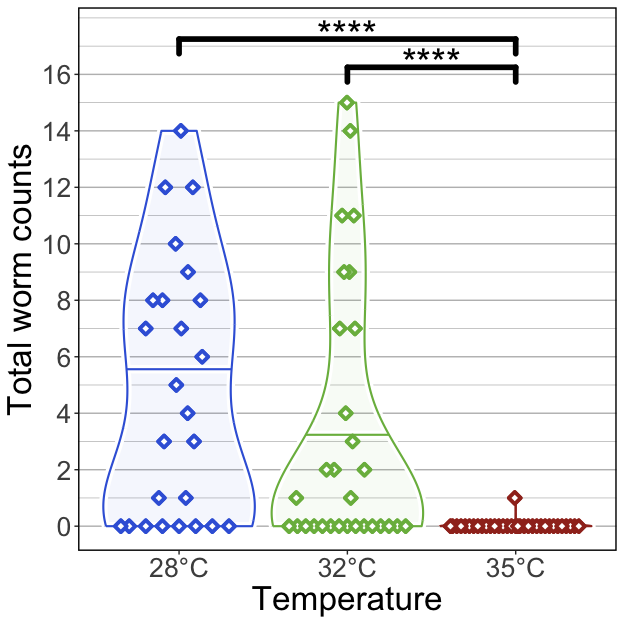<!-- -->

### 4) Water temperature differentially stratifies gut microbiome communities of parasite exposed fish

Fig. 4 Effects of parasite exposure and water temperature on gut
microbiomes of zebrafish. (A) Simpson’s Index of diversity shows that
gut microbiome diversity significantly differs between fish reared at
28°C water temperature to fish reared at 32°C and 35°C water
temperatures. (B) Capscale ordination based on the Bray-Curtis
dissimilarity of gut microbiome composition. The analysis shows that gut
microbiome composition significantly differs between parasite exposed
fish reared at different water temperatures. (C) Simpson’s Index of
diversity shows microbial gut diversity decreases with time from 0 days
post exposure (dpe) to 42 dpe in parasite exposed fish reared at 28°C
water temperature. (D) Capscale ordination of gut microbiome composition
based on the Canberra dissimilarity constrained on the main effects of
water temperature and time, and their interaction. The analysis shows
that shows that gut microbiome composition differs between parasite
exposed fish across time depending on water temperature. Ribbons and
ellipses indicate 95% confidence interval. Only statistically
significant relationships are shown. A “\*” indicates statistical
significance below the “0.05” level. Black arrows indicate direction of
greatest change in the indicated covariates.

#### 4A)

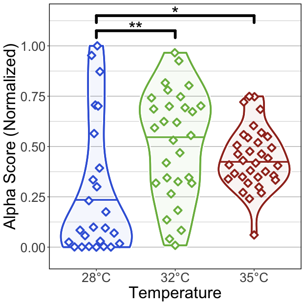<!-- -->

##### Tables

###### (hide)

Press on tabs to display tables. Scroll to see additional rows.

###### GLM

<table class="gt_table" data-quarto-disable-processing="false" data-quarto-bootstrap="false">
  <thead>
    <tr class="gt_heading">
      <td colspan="6" class="gt_heading gt_title gt_font_normal" style>GLM Results</td>
    </tr>
    <tr class="gt_heading">
      <td colspan="6" class="gt_heading gt_subtitle gt_font_normal gt_bottom_border" style>glm(Alpha.Score ~ Temperature); Exposed fish</td>
    </tr>
    <tr class="gt_col_headings">
      <th class="gt_col_heading gt_columns_bottom_border gt_left" rowspan="1" colspan="1" scope="col" id="term">term</th>
      <th class="gt_col_heading gt_columns_bottom_border gt_right" rowspan="1" colspan="1" scope="col" id="estimate">estimate</th>
      <th class="gt_col_heading gt_columns_bottom_border gt_right" rowspan="1" colspan="1" scope="col" id="std.error">std.error</th>
      <th class="gt_col_heading gt_columns_bottom_border gt_right" rowspan="1" colspan="1" scope="col" id="statistic">statistic</th>
      <th class="gt_col_heading gt_columns_bottom_border gt_right" rowspan="1" colspan="1" scope="col" id="p.value">p.value</th>
      <th class="gt_col_heading gt_columns_bottom_border gt_left" rowspan="1" colspan="1" scope="col" id="p.adj.sig">p.adj.sig</th>
    </tr>
  </thead>
  <tbody class="gt_table_body">
    <tr class="gt_group_heading_row">
      <th colspan="6" class="gt_group_heading" scope="colgroup" id="Shannon">Shannon</th>
    </tr>
    <tr class="gt_row_group_first"><td headers="Shannon  term" class="gt_row gt_left">(Intercept)</td>
<td headers="Shannon  estimate" class="gt_row gt_right">−0.936</td>
<td headers="Shannon  std.error" class="gt_row gt_right">0.233</td>
<td headers="Shannon  statistic" class="gt_row gt_right">−4.021</td>
<td headers="Shannon  p.value" class="gt_row gt_right">&lt;0.001</td>
<td headers="Shannon  p.adj.sig" class="gt_row gt_left">***</td></tr>
    <tr><td headers="Shannon  term" class="gt_row gt_left">Temperature32</td>
<td headers="Shannon  estimate" class="gt_row gt_right">0.909</td>
<td headers="Shannon  std.error" class="gt_row gt_right">0.301</td>
<td headers="Shannon  statistic" class="gt_row gt_right">3.017</td>
<td headers="Shannon  p.value" class="gt_row gt_right">0.003</td>
<td headers="Shannon  p.adj.sig" class="gt_row gt_left">**</td></tr>
    <tr><td headers="Shannon  term" class="gt_row gt_left">Temperature35</td>
<td headers="Shannon  estimate" class="gt_row gt_right">0.516</td>
<td headers="Shannon  std.error" class="gt_row gt_right">0.296</td>
<td headers="Shannon  statistic" class="gt_row gt_right">1.741</td>
<td headers="Shannon  p.value" class="gt_row gt_right">0.085</td>
<td headers="Shannon  p.adj.sig" class="gt_row gt_left">ns</td></tr>
    <tr class="gt_group_heading_row">
      <th colspan="6" class="gt_group_heading" scope="colgroup" id="Simpson">Simpson</th>
    </tr>
    <tr class="gt_row_group_first"><td headers="Simpson  term" class="gt_row gt_left">(Intercept)</td>
<td headers="Simpson  estimate" class="gt_row gt_right">−1.002</td>
<td headers="Simpson  std.error" class="gt_row gt_right">0.243</td>
<td headers="Simpson  statistic" class="gt_row gt_right">−4.130</td>
<td headers="Simpson  p.value" class="gt_row gt_right">&lt;0.001</td>
<td headers="Simpson  p.adj.sig" class="gt_row gt_left">****</td></tr>
    <tr><td headers="Simpson  term" class="gt_row gt_left">Temperature32</td>
<td headers="Simpson  estimate" class="gt_row gt_right">1.057</td>
<td headers="Simpson  std.error" class="gt_row gt_right">0.312</td>
<td headers="Simpson  statistic" class="gt_row gt_right">3.384</td>
<td headers="Simpson  p.value" class="gt_row gt_right">0.001</td>
<td headers="Simpson  p.adj.sig" class="gt_row gt_left">**</td></tr>
    <tr><td headers="Simpson  term" class="gt_row gt_left">Temperature35</td>
<td headers="Simpson  estimate" class="gt_row gt_right">0.772</td>
<td headers="Simpson  std.error" class="gt_row gt_right">0.306</td>
<td headers="Simpson  statistic" class="gt_row gt_right">2.525</td>
<td headers="Simpson  p.value" class="gt_row gt_right">0.013</td>
<td headers="Simpson  p.adj.sig" class="gt_row gt_left">*</td></tr>
    <tr class="gt_group_heading_row">
      <th colspan="6" class="gt_group_heading" scope="colgroup" id="Richness">Richness</th>
    </tr>
    <tr class="gt_row_group_first"><td headers="Richness  term" class="gt_row gt_left">(Intercept)</td>
<td headers="Richness  estimate" class="gt_row gt_right">−0.681</td>
<td headers="Richness  std.error" class="gt_row gt_right">0.190</td>
<td headers="Richness  statistic" class="gt_row gt_right">−3.583</td>
<td headers="Richness  p.value" class="gt_row gt_right">&lt;0.001</td>
<td headers="Richness  p.adj.sig" class="gt_row gt_left">***</td></tr>
    <tr><td headers="Richness  term" class="gt_row gt_left">Temperature32</td>
<td headers="Richness  estimate" class="gt_row gt_right">0.703</td>
<td headers="Richness  std.error" class="gt_row gt_right">0.251</td>
<td headers="Richness  statistic" class="gt_row gt_right">2.800</td>
<td headers="Richness  p.value" class="gt_row gt_right">0.006</td>
<td headers="Richness  p.adj.sig" class="gt_row gt_left">**</td></tr>
    <tr><td headers="Richness  term" class="gt_row gt_left">Temperature35</td>
<td headers="Richness  estimate" class="gt_row gt_right">0.242</td>
<td headers="Richness  std.error" class="gt_row gt_right">0.247</td>
<td headers="Richness  statistic" class="gt_row gt_right">0.978</td>
<td headers="Richness  p.value" class="gt_row gt_right">≥0.25</td>
<td headers="Richness  p.adj.sig" class="gt_row gt_left">ns</td></tr>
  </tbody>
  &#10;  
</table>

###### ANOVA

<table class="gt_table" data-quarto-disable-processing="false" data-quarto-bootstrap="false">
  <thead>
    <tr class="gt_heading">
      <td colspan="5" class="gt_heading gt_title gt_font_normal" style>ANOVA of GLM</td>
    </tr>
    <tr class="gt_heading">
      <td colspan="5" class="gt_heading gt_subtitle gt_font_normal gt_bottom_border" style>ANOVA(GLM(Alpha.Score ~ Temperature), type = 2); Exposed fish</td>
    </tr>
    <tr class="gt_col_headings">
      <th class="gt_col_heading gt_columns_bottom_border gt_left" rowspan="1" colspan="1" scope="col" id="term">term</th>
      <th class="gt_col_heading gt_columns_bottom_border gt_right" rowspan="1" colspan="1" scope="col" id="statistic">statistic</th>
      <th class="gt_col_heading gt_columns_bottom_border gt_right" rowspan="1" colspan="1" scope="col" id="df">df</th>
      <th class="gt_col_heading gt_columns_bottom_border gt_right" rowspan="1" colspan="1" scope="col" id="p.value">p.value</th>
      <th class="gt_col_heading gt_columns_bottom_border gt_right" rowspan="1" colspan="1" scope="col" id="sig">sig</th>
    </tr>
  </thead>
  <tbody class="gt_table_body">
    <tr class="gt_group_heading_row">
      <th colspan="5" class="gt_group_heading" scope="colgroup" id="Shannon">Shannon</th>
    </tr>
    <tr class="gt_row_group_first"><td headers="Shannon  term" class="gt_row gt_left">Temperature</td>
<td headers="Shannon  statistic" class="gt_row gt_right">9.440</td>
<td headers="Shannon  df" class="gt_row gt_right">2.000</td>
<td headers="Shannon  p.value" class="gt_row gt_right">0.009</td>
<td headers="Shannon  sig" class="gt_row gt_right">**</td></tr>
    <tr class="gt_group_heading_row">
      <th colspan="5" class="gt_group_heading" scope="colgroup" id="Simpson">Simpson</th>
    </tr>
    <tr class="gt_row_group_first"><td headers="Simpson  term" class="gt_row gt_left">Temperature</td>
<td headers="Simpson  statistic" class="gt_row gt_right">12.497</td>
<td headers="Simpson  df" class="gt_row gt_right">2.000</td>
<td headers="Simpson  p.value" class="gt_row gt_right">0.002</td>
<td headers="Simpson  sig" class="gt_row gt_right">**</td></tr>
    <tr class="gt_group_heading_row">
      <th colspan="5" class="gt_group_heading" scope="colgroup" id="Richness">Richness</th>
    </tr>
    <tr class="gt_row_group_first"><td headers="Richness  term" class="gt_row gt_left">Temperature</td>
<td headers="Richness  statistic" class="gt_row gt_right">8.575</td>
<td headers="Richness  df" class="gt_row gt_right">2.000</td>
<td headers="Richness  p.value" class="gt_row gt_right">0.014</td>
<td headers="Richness  sig" class="gt_row gt_right">*</td></tr>
  </tbody>
  &#10;  
</table>

###### Tukey

<table class="gt_table" data-quarto-disable-processing="false" data-quarto-bootstrap="false">
  <thead>
    <tr class="gt_heading">
      <td colspan="9" class="gt_heading gt_title gt_font_normal" style>Pairwise Tukey's HSD, p.adj: Dunnett</td>
    </tr>
    <tr class="gt_heading">
      <td colspan="9" class="gt_heading gt_subtitle gt_font_normal gt_bottom_border" style>Tukey(Alpha.Score ~ Temperature); Exposed fish</td>
    </tr>
    <tr class="gt_col_headings">
      <th class="gt_col_heading gt_columns_bottom_border gt_left" rowspan="1" colspan="1" scope="col" id="term">term</th>
      <th class="gt_col_heading gt_columns_bottom_border gt_left" rowspan="1" colspan="1" scope="col" id=".y.">.y.</th>
      <th class="gt_col_heading gt_columns_bottom_border gt_right" rowspan="1" colspan="1" scope="col" id="group1">group1</th>
      <th class="gt_col_heading gt_columns_bottom_border gt_right" rowspan="1" colspan="1" scope="col" id="group2">group2</th>
      <th class="gt_col_heading gt_columns_bottom_border gt_right" rowspan="1" colspan="1" scope="col" id="estimate">estimate</th>
      <th class="gt_col_heading gt_columns_bottom_border gt_right" rowspan="1" colspan="1" scope="col" id="std.error">std.error</th>
      <th class="gt_col_heading gt_columns_bottom_border gt_right" rowspan="1" colspan="1" scope="col" id="statistic">statistic</th>
      <th class="gt_col_heading gt_columns_bottom_border gt_right" rowspan="1" colspan="1" scope="col" id="adj.p.value">adj.p.value</th>
      <th class="gt_col_heading gt_columns_bottom_border gt_left" rowspan="1" colspan="1" scope="col" id="Variable">Variable</th>
    </tr>
  </thead>
  <tbody class="gt_table_body">
    <tr class="gt_group_heading_row">
      <th colspan="9" class="gt_group_heading" scope="colgroup" id="Shannon">Shannon</th>
    </tr>
    <tr class="gt_row_group_first"><td headers="Shannon  term" class="gt_row gt_left">Temperature</td>
<td headers="Shannon  .y." class="gt_row gt_left">Alpha.Score</td>
<td headers="Shannon  group1" class="gt_row gt_right">32</td>
<td headers="Shannon  group2" class="gt_row gt_right">28</td>
<td headers="Shannon  estimate" class="gt_row gt_right">0.909</td>
<td headers="Shannon  std.error" class="gt_row gt_right">0.301</td>
<td headers="Shannon  statistic" class="gt_row gt_right">3.017</td>
<td headers="Shannon  adj.p.value" class="gt_row gt_right">0.007</td>
<td headers="Shannon  Variable" class="gt_row gt_left">Temperature</td></tr>
    <tr><td headers="Shannon  term" class="gt_row gt_left">Temperature</td>
<td headers="Shannon  .y." class="gt_row gt_left">Alpha.Score</td>
<td headers="Shannon  group1" class="gt_row gt_right">35</td>
<td headers="Shannon  group2" class="gt_row gt_right">28</td>
<td headers="Shannon  estimate" class="gt_row gt_right">0.516</td>
<td headers="Shannon  std.error" class="gt_row gt_right">0.296</td>
<td headers="Shannon  statistic" class="gt_row gt_right">1.741</td>
<td headers="Shannon  adj.p.value" class="gt_row gt_right">0.190</td>
<td headers="Shannon  Variable" class="gt_row gt_left">Temperature</td></tr>
    <tr><td headers="Shannon  term" class="gt_row gt_left">Temperature</td>
<td headers="Shannon  .y." class="gt_row gt_left">Alpha.Score</td>
<td headers="Shannon  group1" class="gt_row gt_right">35</td>
<td headers="Shannon  group2" class="gt_row gt_right">32</td>
<td headers="Shannon  estimate" class="gt_row gt_right">−0.393</td>
<td headers="Shannon  std.error" class="gt_row gt_right">0.265</td>
<td headers="Shannon  statistic" class="gt_row gt_right">−1.482</td>
<td headers="Shannon  adj.p.value" class="gt_row gt_right">≥0.25</td>
<td headers="Shannon  Variable" class="gt_row gt_left">Temperature</td></tr>
    <tr class="gt_group_heading_row">
      <th colspan="9" class="gt_group_heading" scope="colgroup" id="Simpson">Simpson</th>
    </tr>
    <tr class="gt_row_group_first"><td headers="Simpson  term" class="gt_row gt_left">Temperature</td>
<td headers="Simpson  .y." class="gt_row gt_left">Alpha.Score</td>
<td headers="Simpson  group1" class="gt_row gt_right">32</td>
<td headers="Simpson  group2" class="gt_row gt_right">28</td>
<td headers="Simpson  estimate" class="gt_row gt_right">1.057</td>
<td headers="Simpson  std.error" class="gt_row gt_right">0.312</td>
<td headers="Simpson  statistic" class="gt_row gt_right">3.384</td>
<td headers="Simpson  adj.p.value" class="gt_row gt_right">0.002</td>
<td headers="Simpson  Variable" class="gt_row gt_left">Temperature</td></tr>
    <tr><td headers="Simpson  term" class="gt_row gt_left">Temperature</td>
<td headers="Simpson  .y." class="gt_row gt_left">Alpha.Score</td>
<td headers="Simpson  group1" class="gt_row gt_right">35</td>
<td headers="Simpson  group2" class="gt_row gt_right">28</td>
<td headers="Simpson  estimate" class="gt_row gt_right">0.772</td>
<td headers="Simpson  std.error" class="gt_row gt_right">0.306</td>
<td headers="Simpson  statistic" class="gt_row gt_right">2.525</td>
<td headers="Simpson  adj.p.value" class="gt_row gt_right">0.031</td>
<td headers="Simpson  Variable" class="gt_row gt_left">Temperature</td></tr>
    <tr><td headers="Simpson  term" class="gt_row gt_left">Temperature</td>
<td headers="Simpson  .y." class="gt_row gt_left">Alpha.Score</td>
<td headers="Simpson  group1" class="gt_row gt_right">35</td>
<td headers="Simpson  group2" class="gt_row gt_right">32</td>
<td headers="Simpson  estimate" class="gt_row gt_right">−0.285</td>
<td headers="Simpson  std.error" class="gt_row gt_right">0.270</td>
<td headers="Simpson  statistic" class="gt_row gt_right">−1.054</td>
<td headers="Simpson  adj.p.value" class="gt_row gt_right">≥0.25</td>
<td headers="Simpson  Variable" class="gt_row gt_left">Temperature</td></tr>
    <tr class="gt_group_heading_row">
      <th colspan="9" class="gt_group_heading" scope="colgroup" id="Richness">Richness</th>
    </tr>
    <tr class="gt_row_group_first"><td headers="Richness  term" class="gt_row gt_left">Temperature</td>
<td headers="Richness  .y." class="gt_row gt_left">Alpha.Score</td>
<td headers="Richness  group1" class="gt_row gt_right">32</td>
<td headers="Richness  group2" class="gt_row gt_right">28</td>
<td headers="Richness  estimate" class="gt_row gt_right">0.703</td>
<td headers="Richness  std.error" class="gt_row gt_right">0.251</td>
<td headers="Richness  statistic" class="gt_row gt_right">2.800</td>
<td headers="Richness  adj.p.value" class="gt_row gt_right">0.014</td>
<td headers="Richness  Variable" class="gt_row gt_left">Temperature</td></tr>
    <tr><td headers="Richness  term" class="gt_row gt_left">Temperature</td>
<td headers="Richness  .y." class="gt_row gt_left">Alpha.Score</td>
<td headers="Richness  group1" class="gt_row gt_right">35</td>
<td headers="Richness  group2" class="gt_row gt_right">28</td>
<td headers="Richness  estimate" class="gt_row gt_right">0.242</td>
<td headers="Richness  std.error" class="gt_row gt_right">0.247</td>
<td headers="Richness  statistic" class="gt_row gt_right">0.978</td>
<td headers="Richness  adj.p.value" class="gt_row gt_right">≥0.25</td>
<td headers="Richness  Variable" class="gt_row gt_left">Temperature</td></tr>
    <tr><td headers="Richness  term" class="gt_row gt_left">Temperature</td>
<td headers="Richness  .y." class="gt_row gt_left">Alpha.Score</td>
<td headers="Richness  group1" class="gt_row gt_right">35</td>
<td headers="Richness  group2" class="gt_row gt_right">32</td>
<td headers="Richness  estimate" class="gt_row gt_right">−0.461</td>
<td headers="Richness  std.error" class="gt_row gt_right">0.228</td>
<td headers="Richness  statistic" class="gt_row gt_right">−2.028</td>
<td headers="Richness  adj.p.value" class="gt_row gt_right">0.105</td>
<td headers="Richness  Variable" class="gt_row gt_left">Temperature</td></tr>
  </tbody>
  &#10;  
</table>

#### 4B)

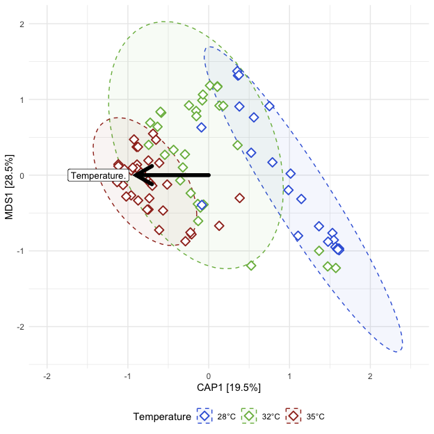<!-- -->

##### Tables

###### (hide)

Press on tabs to display tables. Scroll to see additional rows.

###### Capscale

<table class="gt_table" data-quarto-disable-processing="false" data-quarto-bootstrap="false">
  <thead>
    <tr class="gt_heading">
      <td colspan="7" class="gt_heading gt_title gt_font_normal" style>ADONIS2</td>
    </tr>
    <tr class="gt_heading">
      <td colspan="7" class="gt_heading gt_subtitle gt_font_normal gt_bottom_border" style>adonis2(Beta Distance ~ Temperature); Exposed fish</td>
    </tr>
    <tr class="gt_col_headings">
      <th class="gt_col_heading gt_columns_bottom_border gt_left" rowspan="1" colspan="1" scope="col" id="term">term</th>
      <th class="gt_col_heading gt_columns_bottom_border gt_right" rowspan="1" colspan="1" scope="col" id="df">df</th>
      <th class="gt_col_heading gt_columns_bottom_border gt_right" rowspan="1" colspan="1" scope="col" id="SumOfSqs">SumOfSqs</th>
      <th class="gt_col_heading gt_columns_bottom_border gt_right" rowspan="1" colspan="1" scope="col" id="R2">R2</th>
      <th class="gt_col_heading gt_columns_bottom_border gt_right" rowspan="1" colspan="1" scope="col" id="statistic">statistic</th>
      <th class="gt_col_heading gt_columns_bottom_border gt_right" rowspan="1" colspan="1" scope="col" id="p.value">p.value</th>
      <th class="gt_col_heading gt_columns_bottom_border gt_right" rowspan="1" colspan="1" scope="col" id="sig">sig</th>
    </tr>
  </thead>
  <tbody class="gt_table_body">
    <tr class="gt_group_heading_row">
      <th colspan="7" class="gt_group_heading" scope="colgroup" id="bray">bray</th>
    </tr>
    <tr class="gt_row_group_first"><td headers="bray  term" class="gt_row gt_left">Temperature</td>
<td headers="bray  df" class="gt_row gt_right">2.000</td>
<td headers="bray  SumOfSqs" class="gt_row gt_right">5.218</td>
<td headers="bray  R2" class="gt_row gt_right">0.251</td>
<td headers="bray  statistic" class="gt_row gt_right">14.447</td>
<td headers="bray  p.value" class="gt_row gt_right">0.001</td>
<td headers="bray  sig" class="gt_row gt_right">***</td></tr>
    <tr><td headers="bray  term" class="gt_row gt_left">Residual</td>
<td headers="bray  df" class="gt_row gt_right">86.000</td>
<td headers="bray  SumOfSqs" class="gt_row gt_right">15.530</td>
<td headers="bray  R2" class="gt_row gt_right">0.749</td>
<td headers="bray  statistic" class="gt_row gt_right">NA</td>
<td headers="bray  p.value" class="gt_row gt_right">NA</td>
<td headers="bray  sig" class="gt_row gt_right">NA</td></tr>
    <tr><td headers="bray  term" class="gt_row gt_left">Total</td>
<td headers="bray  df" class="gt_row gt_right">88.000</td>
<td headers="bray  SumOfSqs" class="gt_row gt_right">20.748</td>
<td headers="bray  R2" class="gt_row gt_right">1.000</td>
<td headers="bray  statistic" class="gt_row gt_right">NA</td>
<td headers="bray  p.value" class="gt_row gt_right">NA</td>
<td headers="bray  sig" class="gt_row gt_right">NA</td></tr>
    <tr class="gt_group_heading_row">
      <th colspan="7" class="gt_group_heading" scope="colgroup" id="canberra">canberra</th>
    </tr>
    <tr class="gt_row_group_first"><td headers="canberra  term" class="gt_row gt_left">Temperature</td>
<td headers="canberra  df" class="gt_row gt_right">2.000</td>
<td headers="canberra  SumOfSqs" class="gt_row gt_right">3.573</td>
<td headers="canberra  R2" class="gt_row gt_right">0.117</td>
<td headers="canberra  statistic" class="gt_row gt_right">5.701</td>
<td headers="canberra  p.value" class="gt_row gt_right">0.001</td>
<td headers="canberra  sig" class="gt_row gt_right">***</td></tr>
    <tr><td headers="canberra  term" class="gt_row gt_left">Residual</td>
<td headers="canberra  df" class="gt_row gt_right">86.000</td>
<td headers="canberra  SumOfSqs" class="gt_row gt_right">26.947</td>
<td headers="canberra  R2" class="gt_row gt_right">0.883</td>
<td headers="canberra  statistic" class="gt_row gt_right">NA</td>
<td headers="canberra  p.value" class="gt_row gt_right">NA</td>
<td headers="canberra  sig" class="gt_row gt_right">NA</td></tr>
    <tr><td headers="canberra  term" class="gt_row gt_left">Total</td>
<td headers="canberra  df" class="gt_row gt_right">88.000</td>
<td headers="canberra  SumOfSqs" class="gt_row gt_right">30.520</td>
<td headers="canberra  R2" class="gt_row gt_right">1.000</td>
<td headers="canberra  statistic" class="gt_row gt_right">NA</td>
<td headers="canberra  p.value" class="gt_row gt_right">NA</td>
<td headers="canberra  sig" class="gt_row gt_right">NA</td></tr>
    <tr class="gt_group_heading_row">
      <th colspan="7" class="gt_group_heading" scope="colgroup" id="gunifrac">gunifrac</th>
    </tr>
    <tr class="gt_row_group_first"><td headers="gunifrac  term" class="gt_row gt_left">Temperature</td>
<td headers="gunifrac  df" class="gt_row gt_right">2.000</td>
<td headers="gunifrac  SumOfSqs" class="gt_row gt_right">3.363</td>
<td headers="gunifrac  R2" class="gt_row gt_right">0.212</td>
<td headers="gunifrac  statistic" class="gt_row gt_right">11.590</td>
<td headers="gunifrac  p.value" class="gt_row gt_right">0.001</td>
<td headers="gunifrac  sig" class="gt_row gt_right">***</td></tr>
    <tr><td headers="gunifrac  term" class="gt_row gt_left">Residual</td>
<td headers="gunifrac  df" class="gt_row gt_right">86.000</td>
<td headers="gunifrac  SumOfSqs" class="gt_row gt_right">12.478</td>
<td headers="gunifrac  R2" class="gt_row gt_right">0.788</td>
<td headers="gunifrac  statistic" class="gt_row gt_right">NA</td>
<td headers="gunifrac  p.value" class="gt_row gt_right">NA</td>
<td headers="gunifrac  sig" class="gt_row gt_right">NA</td></tr>
    <tr><td headers="gunifrac  term" class="gt_row gt_left">Total</td>
<td headers="gunifrac  df" class="gt_row gt_right">88.000</td>
<td headers="gunifrac  SumOfSqs" class="gt_row gt_right">15.841</td>
<td headers="gunifrac  R2" class="gt_row gt_right">1.000</td>
<td headers="gunifrac  statistic" class="gt_row gt_right">NA</td>
<td headers="gunifrac  p.value" class="gt_row gt_right">NA</td>
<td headers="gunifrac  sig" class="gt_row gt_right">NA</td></tr>
  </tbody>
  &#10;  
</table>

###### Dispersion (ANOVA)

<table class="gt_table" data-quarto-disable-processing="false" data-quarto-bootstrap="false">
  <thead>
    <tr class="gt_heading">
      <td colspan="7" class="gt_heading gt_title gt_font_normal" style>ANOVA: Homogeneity of Dispersion</td>
    </tr>
    <tr class="gt_heading">
      <td colspan="7" class="gt_heading gt_subtitle gt_font_normal gt_bottom_border" style>ANOVA(Beta Disperson ~ Temperature); Exposed fish</td>
    </tr>
    <tr class="gt_col_headings">
      <th class="gt_col_heading gt_columns_bottom_border gt_left" rowspan="1" colspan="1" scope="col" id="term">term</th>
      <th class="gt_col_heading gt_columns_bottom_border gt_right" rowspan="1" colspan="1" scope="col" id="df">df</th>
      <th class="gt_col_heading gt_columns_bottom_border gt_right" rowspan="1" colspan="1" scope="col" id="sumsq">sumsq</th>
      <th class="gt_col_heading gt_columns_bottom_border gt_right" rowspan="1" colspan="1" scope="col" id="meansq">meansq</th>
      <th class="gt_col_heading gt_columns_bottom_border gt_right" rowspan="1" colspan="1" scope="col" id="statistic">statistic</th>
      <th class="gt_col_heading gt_columns_bottom_border gt_right" rowspan="1" colspan="1" scope="col" id="p.value">p.value</th>
      <th class="gt_col_heading gt_columns_bottom_border gt_right" rowspan="1" colspan="1" scope="col" id="sig">sig</th>
    </tr>
  </thead>
  <tbody class="gt_table_body">
    <tr class="gt_group_heading_row">
      <th colspan="7" class="gt_group_heading" scope="colgroup" id="bray">bray</th>
    </tr>
    <tr class="gt_row_group_first"><td headers="bray  term" class="gt_row gt_left">Temperature</td>
<td headers="bray  df" class="gt_row gt_right">2.000</td>
<td headers="bray  sumsq" class="gt_row gt_right">0.364</td>
<td headers="bray  meansq" class="gt_row gt_right">0.182</td>
<td headers="bray  statistic" class="gt_row gt_right">8.708</td>
<td headers="bray  p.value" class="gt_row gt_right">&lt;0.001</td>
<td headers="bray  sig" class="gt_row gt_right">***</td></tr>
    <tr><td headers="bray  term" class="gt_row gt_left">Residual</td>
<td headers="bray  df" class="gt_row gt_right">86.000</td>
<td headers="bray  sumsq" class="gt_row gt_right">1.796</td>
<td headers="bray  meansq" class="gt_row gt_right">0.021</td>
<td headers="bray  statistic" class="gt_row gt_right">NA</td>
<td headers="bray  p.value" class="gt_row gt_right">NA</td>
<td headers="bray  sig" class="gt_row gt_right">NA</td></tr>
    <tr class="gt_group_heading_row">
      <th colspan="7" class="gt_group_heading" scope="colgroup" id="canberra">canberra</th>
    </tr>
    <tr class="gt_row_group_first"><td headers="canberra  term" class="gt_row gt_left">Temperature</td>
<td headers="canberra  df" class="gt_row gt_right">2.000</td>
<td headers="canberra  sumsq" class="gt_row gt_right">0.314</td>
<td headers="canberra  meansq" class="gt_row gt_right">0.157</td>
<td headers="canberra  statistic" class="gt_row gt_right">17.419</td>
<td headers="canberra  p.value" class="gt_row gt_right">&lt;0.001</td>
<td headers="canberra  sig" class="gt_row gt_right">****</td></tr>
    <tr><td headers="canberra  term" class="gt_row gt_left">Residual</td>
<td headers="canberra  df" class="gt_row gt_right">86.000</td>
<td headers="canberra  sumsq" class="gt_row gt_right">0.774</td>
<td headers="canberra  meansq" class="gt_row gt_right">0.009</td>
<td headers="canberra  statistic" class="gt_row gt_right">NA</td>
<td headers="canberra  p.value" class="gt_row gt_right">NA</td>
<td headers="canberra  sig" class="gt_row gt_right">NA</td></tr>
    <tr class="gt_group_heading_row">
      <th colspan="7" class="gt_group_heading" scope="colgroup" id="gunifrac">gunifrac</th>
    </tr>
    <tr class="gt_row_group_first"><td headers="gunifrac  term" class="gt_row gt_left">Temperature</td>
<td headers="gunifrac  df" class="gt_row gt_right">2.000</td>
<td headers="gunifrac  sumsq" class="gt_row gt_right">0.310</td>
<td headers="gunifrac  meansq" class="gt_row gt_right">0.155</td>
<td headers="gunifrac  statistic" class="gt_row gt_right">13.567</td>
<td headers="gunifrac  p.value" class="gt_row gt_right">&lt;0.001</td>
<td headers="gunifrac  sig" class="gt_row gt_right">****</td></tr>
    <tr><td headers="gunifrac  term" class="gt_row gt_left">Residual</td>
<td headers="gunifrac  df" class="gt_row gt_right">86.000</td>
<td headers="gunifrac  sumsq" class="gt_row gt_right">0.983</td>
<td headers="gunifrac  meansq" class="gt_row gt_right">0.011</td>
<td headers="gunifrac  statistic" class="gt_row gt_right">NA</td>
<td headers="gunifrac  p.value" class="gt_row gt_right">NA</td>
<td headers="gunifrac  sig" class="gt_row gt_right">NA</td></tr>
  </tbody>
  &#10;  
</table>

###### Dispersion (Tukey)

<table class="gt_table" data-quarto-disable-processing="false" data-quarto-bootstrap="false">
  <thead>
    <tr class="gt_heading">
      <td colspan="9" class="gt_heading gt_title gt_font_normal" style>Tukey: Homogeneity of Dispersion</td>
    </tr>
    <tr class="gt_heading">
      <td colspan="9" class="gt_heading gt_subtitle gt_font_normal gt_bottom_border" style>Tukey(Beta Disperson ~ Temperature); Exposed fish</td>
    </tr>
    <tr class="gt_col_headings">
      <th class="gt_col_heading gt_columns_bottom_border gt_left" rowspan="1" colspan="1" scope="col" id=".y.">.y.</th>
      <th class="gt_col_heading gt_columns_bottom_border gt_left" rowspan="1" colspan="1" scope="col" id="term">term</th>
      <th class="gt_col_heading gt_columns_bottom_border gt_right" rowspan="1" colspan="1" scope="col" id="group1">group1</th>
      <th class="gt_col_heading gt_columns_bottom_border gt_right" rowspan="1" colspan="1" scope="col" id="group2">group2</th>
      <th class="gt_col_heading gt_columns_bottom_border gt_right" rowspan="1" colspan="1" scope="col" id="estimate">estimate</th>
      <th class="gt_col_heading gt_columns_bottom_border gt_right" rowspan="1" colspan="1" scope="col" id="conf.low">conf.low</th>
      <th class="gt_col_heading gt_columns_bottom_border gt_right" rowspan="1" colspan="1" scope="col" id="conf.high">conf.high</th>
      <th class="gt_col_heading gt_columns_bottom_border gt_right" rowspan="1" colspan="1" scope="col" id="adj.p.value">adj.p.value</th>
      <th class="gt_col_heading gt_columns_bottom_border gt_left" rowspan="1" colspan="1" scope="col" id="sig">sig</th>
    </tr>
  </thead>
  <tbody class="gt_table_body">
    <tr class="gt_group_heading_row">
      <th colspan="9" class="gt_group_heading" scope="colgroup" id="bray">bray</th>
    </tr>
    <tr class="gt_row_group_first"><td headers="bray  .y." class="gt_row gt_left">Distance</td>
<td headers="bray  term" class="gt_row gt_left">Temperature</td>
<td headers="bray  group1" class="gt_row gt_right">32</td>
<td headers="bray  group2" class="gt_row gt_right">28</td>
<td headers="bray  estimate" class="gt_row gt_right">−0.043</td>
<td headers="bray  conf.low" class="gt_row gt_right">−0.136</td>
<td headers="bray  conf.high" class="gt_row gt_right">0.051</td>
<td headers="bray  adj.p.value" class="gt_row gt_right">≥0.25</td>
<td headers="bray  sig" class="gt_row gt_left">ns</td></tr>
    <tr><td headers="bray  .y." class="gt_row gt_left">Distance</td>
<td headers="bray  term" class="gt_row gt_left">Temperature</td>
<td headers="bray  group1" class="gt_row gt_right">35</td>
<td headers="bray  group2" class="gt_row gt_right">28</td>
<td headers="bray  estimate" class="gt_row gt_right">−0.150</td>
<td headers="bray  conf.low" class="gt_row gt_right">−0.241</td>
<td headers="bray  conf.high" class="gt_row gt_right">−0.059</td>
<td headers="bray  adj.p.value" class="gt_row gt_right">&lt;0.001</td>
<td headers="bray  sig" class="gt_row gt_left">***</td></tr>
    <tr><td headers="bray  .y." class="gt_row gt_left">Distance</td>
<td headers="bray  term" class="gt_row gt_left">Temperature</td>
<td headers="bray  group1" class="gt_row gt_right">35</td>
<td headers="bray  group2" class="gt_row gt_right">32</td>
<td headers="bray  estimate" class="gt_row gt_right">−0.108</td>
<td headers="bray  conf.low" class="gt_row gt_right">−0.194</td>
<td headers="bray  conf.high" class="gt_row gt_right">−0.021</td>
<td headers="bray  adj.p.value" class="gt_row gt_right">0.011</td>
<td headers="bray  sig" class="gt_row gt_left">*</td></tr>
    <tr class="gt_group_heading_row">
      <th colspan="9" class="gt_group_heading" scope="colgroup" id="canberra">canberra</th>
    </tr>
    <tr class="gt_row_group_first"><td headers="canberra  .y." class="gt_row gt_left">Distance</td>
<td headers="canberra  term" class="gt_row gt_left">Temperature</td>
<td headers="canberra  group1" class="gt_row gt_right">32</td>
<td headers="canberra  group2" class="gt_row gt_right">28</td>
<td headers="canberra  estimate" class="gt_row gt_right">−0.110</td>
<td headers="canberra  conf.low" class="gt_row gt_right">−0.171</td>
<td headers="canberra  conf.high" class="gt_row gt_right">−0.049</td>
<td headers="canberra  adj.p.value" class="gt_row gt_right">&lt;0.001</td>
<td headers="canberra  sig" class="gt_row gt_left">***</td></tr>
    <tr><td headers="canberra  .y." class="gt_row gt_left">Distance</td>
<td headers="canberra  term" class="gt_row gt_left">Temperature</td>
<td headers="canberra  group1" class="gt_row gt_right">35</td>
<td headers="canberra  group2" class="gt_row gt_right">28</td>
<td headers="canberra  estimate" class="gt_row gt_right">−0.144</td>
<td headers="canberra  conf.low" class="gt_row gt_right">−0.204</td>
<td headers="canberra  conf.high" class="gt_row gt_right">−0.085</td>
<td headers="canberra  adj.p.value" class="gt_row gt_right">&lt;0.001</td>
<td headers="canberra  sig" class="gt_row gt_left">****</td></tr>
    <tr><td headers="canberra  .y." class="gt_row gt_left">Distance</td>
<td headers="canberra  term" class="gt_row gt_left">Temperature</td>
<td headers="canberra  group1" class="gt_row gt_right">35</td>
<td headers="canberra  group2" class="gt_row gt_right">32</td>
<td headers="canberra  estimate" class="gt_row gt_right">−0.034</td>
<td headers="canberra  conf.low" class="gt_row gt_right">−0.091</td>
<td headers="canberra  conf.high" class="gt_row gt_right">0.022</td>
<td headers="canberra  adj.p.value" class="gt_row gt_right">≥0.25</td>
<td headers="canberra  sig" class="gt_row gt_left">ns</td></tr>
    <tr class="gt_group_heading_row">
      <th colspan="9" class="gt_group_heading" scope="colgroup" id="gunifrac">gunifrac</th>
    </tr>
    <tr class="gt_row_group_first"><td headers="gunifrac  .y." class="gt_row gt_left">Distance</td>
<td headers="gunifrac  term" class="gt_row gt_left">Temperature</td>
<td headers="gunifrac  group1" class="gt_row gt_right">32</td>
<td headers="gunifrac  group2" class="gt_row gt_right">28</td>
<td headers="gunifrac  estimate" class="gt_row gt_right">−0.056</td>
<td headers="gunifrac  conf.low" class="gt_row gt_right">−0.125</td>
<td headers="gunifrac  conf.high" class="gt_row gt_right">0.013</td>
<td headers="gunifrac  adj.p.value" class="gt_row gt_right">0.133</td>
<td headers="gunifrac  sig" class="gt_row gt_left">ns</td></tr>
    <tr><td headers="gunifrac  .y." class="gt_row gt_left">Distance</td>
<td headers="gunifrac  term" class="gt_row gt_left">Temperature</td>
<td headers="gunifrac  group1" class="gt_row gt_right">35</td>
<td headers="gunifrac  group2" class="gt_row gt_right">28</td>
<td headers="gunifrac  estimate" class="gt_row gt_right">−0.143</td>
<td headers="gunifrac  conf.low" class="gt_row gt_right">−0.211</td>
<td headers="gunifrac  conf.high" class="gt_row gt_right">−0.076</td>
<td headers="gunifrac  adj.p.value" class="gt_row gt_right">&lt;0.001</td>
<td headers="gunifrac  sig" class="gt_row gt_left">****</td></tr>
    <tr><td headers="gunifrac  .y." class="gt_row gt_left">Distance</td>
<td headers="gunifrac  term" class="gt_row gt_left">Temperature</td>
<td headers="gunifrac  group1" class="gt_row gt_right">35</td>
<td headers="gunifrac  group2" class="gt_row gt_right">32</td>
<td headers="gunifrac  estimate" class="gt_row gt_right">−0.087</td>
<td headers="gunifrac  conf.low" class="gt_row gt_right">−0.151</td>
<td headers="gunifrac  conf.high" class="gt_row gt_right">−0.023</td>
<td headers="gunifrac  adj.p.value" class="gt_row gt_right">0.005</td>
<td headers="gunifrac  sig" class="gt_row gt_left">**</td></tr>
  </tbody>
  &#10;  
</table>

#### 4C)

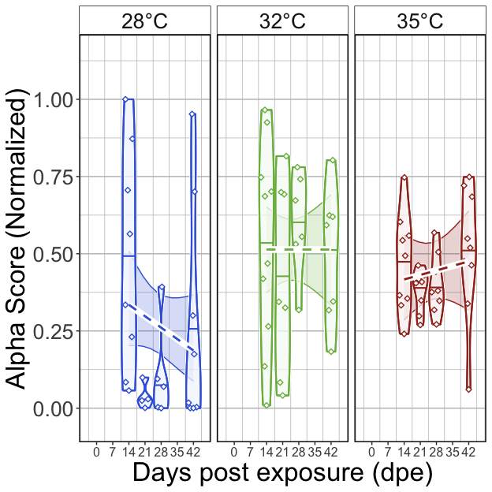<!-- -->

##### Tables

###### (hide)

Press on tabs to display tables. Scroll to see additional rows.

###### GLM

<table class="gt_table" data-quarto-disable-processing="false" data-quarto-bootstrap="false">
  <thead>
    <tr class="gt_heading">
      <td colspan="6" class="gt_heading gt_title gt_font_normal" style>GLM Results</td>
    </tr>
    <tr class="gt_heading">
      <td colspan="6" class="gt_heading gt_subtitle gt_font_normal gt_bottom_border" style>glm(Alpha.Score ~ Temperature*DPE); Exposed fish</td>
    </tr>
    <tr class="gt_col_headings">
      <th class="gt_col_heading gt_columns_bottom_border gt_left" rowspan="1" colspan="1" scope="col" id="term">term</th>
      <th class="gt_col_heading gt_columns_bottom_border gt_right" rowspan="1" colspan="1" scope="col" id="estimate">estimate</th>
      <th class="gt_col_heading gt_columns_bottom_border gt_right" rowspan="1" colspan="1" scope="col" id="std.error">std.error</th>
      <th class="gt_col_heading gt_columns_bottom_border gt_right" rowspan="1" colspan="1" scope="col" id="statistic">statistic</th>
      <th class="gt_col_heading gt_columns_bottom_border gt_right" rowspan="1" colspan="1" scope="col" id="p.value">p.value</th>
      <th class="gt_col_heading gt_columns_bottom_border gt_left" rowspan="1" colspan="1" scope="col" id="p.adj.sig">p.adj.sig</th>
    </tr>
  </thead>
  <tbody class="gt_table_body">
    <tr class="gt_group_heading_row">
      <th colspan="6" class="gt_group_heading" scope="colgroup" id="Shannon">Shannon</th>
    </tr>
    <tr class="gt_row_group_first"><td headers="Shannon  term" class="gt_row gt_left">(Intercept)</td>
<td headers="Shannon  estimate" class="gt_row gt_right">−0.134</td>
<td headers="Shannon  std.error" class="gt_row gt_right">0.594</td>
<td headers="Shannon  statistic" class="gt_row gt_right">−0.226</td>
<td headers="Shannon  p.value" class="gt_row gt_right">≥0.25</td>
<td headers="Shannon  p.adj.sig" class="gt_row gt_left">ns</td></tr>
    <tr><td headers="Shannon  term" class="gt_row gt_left">Temperature32</td>
<td headers="Shannon  estimate" class="gt_row gt_right">0.228</td>
<td headers="Shannon  std.error" class="gt_row gt_right">0.774</td>
<td headers="Shannon  statistic" class="gt_row gt_right">0.295</td>
<td headers="Shannon  p.value" class="gt_row gt_right">≥0.25</td>
<td headers="Shannon  p.adj.sig" class="gt_row gt_left">ns</td></tr>
    <tr><td headers="Shannon  term" class="gt_row gt_left">Temperature35</td>
<td headers="Shannon  estimate" class="gt_row gt_right">−0.428</td>
<td headers="Shannon  std.error" class="gt_row gt_right">0.777</td>
<td headers="Shannon  statistic" class="gt_row gt_right">−0.551</td>
<td headers="Shannon  p.value" class="gt_row gt_right">≥0.25</td>
<td headers="Shannon  p.adj.sig" class="gt_row gt_left">ns</td></tr>
    <tr><td headers="Shannon  term" class="gt_row gt_left">DPE</td>
<td headers="Shannon  estimate" class="gt_row gt_right">−0.031</td>
<td headers="Shannon  std.error" class="gt_row gt_right">0.022</td>
<td headers="Shannon  statistic" class="gt_row gt_right">−1.425</td>
<td headers="Shannon  p.value" class="gt_row gt_right">0.158</td>
<td headers="Shannon  p.adj.sig" class="gt_row gt_left">ns</td></tr>
    <tr><td headers="Shannon  term" class="gt_row gt_left">Temperature32:DPE</td>
<td headers="Shannon  estimate" class="gt_row gt_right">0.026</td>
<td headers="Shannon  std.error" class="gt_row gt_right">0.028</td>
<td headers="Shannon  statistic" class="gt_row gt_right">0.917</td>
<td headers="Shannon  p.value" class="gt_row gt_right">≥0.25</td>
<td headers="Shannon  p.adj.sig" class="gt_row gt_left">ns</td></tr>
    <tr><td headers="Shannon  term" class="gt_row gt_left">Temperature35:DPE</td>
<td headers="Shannon  estimate" class="gt_row gt_right">0.036</td>
<td headers="Shannon  std.error" class="gt_row gt_right">0.028</td>
<td headers="Shannon  statistic" class="gt_row gt_right">1.300</td>
<td headers="Shannon  p.value" class="gt_row gt_right">0.197</td>
<td headers="Shannon  p.adj.sig" class="gt_row gt_left">ns</td></tr>
    <tr class="gt_group_heading_row">
      <th colspan="6" class="gt_group_heading" scope="colgroup" id="Simpson">Simpson</th>
    </tr>
    <tr class="gt_row_group_first"><td headers="Simpson  term" class="gt_row gt_left">(Intercept)</td>
<td headers="Simpson  estimate" class="gt_row gt_right">−0.282</td>
<td headers="Simpson  std.error" class="gt_row gt_right">0.617</td>
<td headers="Simpson  statistic" class="gt_row gt_right">−0.456</td>
<td headers="Simpson  p.value" class="gt_row gt_right">≥0.25</td>
<td headers="Simpson  p.adj.sig" class="gt_row gt_left">ns</td></tr>
    <tr><td headers="Simpson  term" class="gt_row gt_left">Temperature32</td>
<td headers="Simpson  estimate" class="gt_row gt_right">0.336</td>
<td headers="Simpson  std.error" class="gt_row gt_right">0.801</td>
<td headers="Simpson  statistic" class="gt_row gt_right">0.420</td>
<td headers="Simpson  p.value" class="gt_row gt_right">≥0.25</td>
<td headers="Simpson  p.adj.sig" class="gt_row gt_left">ns</td></tr>
    <tr><td headers="Simpson  term" class="gt_row gt_left">Temperature35</td>
<td headers="Simpson  estimate" class="gt_row gt_right">−0.172</td>
<td headers="Simpson  std.error" class="gt_row gt_right">0.799</td>
<td headers="Simpson  statistic" class="gt_row gt_right">−0.215</td>
<td headers="Simpson  p.value" class="gt_row gt_right">≥0.25</td>
<td headers="Simpson  p.adj.sig" class="gt_row gt_left">ns</td></tr>
    <tr><td headers="Simpson  term" class="gt_row gt_left">DPE</td>
<td headers="Simpson  estimate" class="gt_row gt_right">−0.028</td>
<td headers="Simpson  std.error" class="gt_row gt_right">0.022</td>
<td headers="Simpson  statistic" class="gt_row gt_right">−1.234</td>
<td headers="Simpson  p.value" class="gt_row gt_right">0.221</td>
<td headers="Simpson  p.adj.sig" class="gt_row gt_left">ns</td></tr>
    <tr><td headers="Simpson  term" class="gt_row gt_left">Temperature32:DPE</td>
<td headers="Simpson  estimate" class="gt_row gt_right">0.028</td>
<td headers="Simpson  std.error" class="gt_row gt_right">0.029</td>
<td headers="Simpson  statistic" class="gt_row gt_right">0.946</td>
<td headers="Simpson  p.value" class="gt_row gt_right">≥0.25</td>
<td headers="Simpson  p.adj.sig" class="gt_row gt_left">ns</td></tr>
    <tr><td headers="Simpson  term" class="gt_row gt_left">Temperature35:DPE</td>
<td headers="Simpson  estimate" class="gt_row gt_right">0.036</td>
<td headers="Simpson  std.error" class="gt_row gt_right">0.029</td>
<td headers="Simpson  statistic" class="gt_row gt_right">1.261</td>
<td headers="Simpson  p.value" class="gt_row gt_right">0.211</td>
<td headers="Simpson  p.adj.sig" class="gt_row gt_left">ns</td></tr>
    <tr class="gt_group_heading_row">
      <th colspan="6" class="gt_group_heading" scope="colgroup" id="Richness">Richness</th>
    </tr>
    <tr class="gt_row_group_first"><td headers="Richness  term" class="gt_row gt_left">(Intercept)</td>
<td headers="Richness  estimate" class="gt_row gt_right">0.316</td>
<td headers="Richness  std.error" class="gt_row gt_right">0.480</td>
<td headers="Richness  statistic" class="gt_row gt_right">0.657</td>
<td headers="Richness  p.value" class="gt_row gt_right">≥0.25</td>
<td headers="Richness  p.adj.sig" class="gt_row gt_left">ns</td></tr>
    <tr><td headers="Richness  term" class="gt_row gt_left">Temperature32</td>
<td headers="Richness  estimate" class="gt_row gt_right">−0.034</td>
<td headers="Richness  std.error" class="gt_row gt_right">0.636</td>
<td headers="Richness  statistic" class="gt_row gt_right">−0.054</td>
<td headers="Richness  p.value" class="gt_row gt_right">≥0.25</td>
<td headers="Richness  p.adj.sig" class="gt_row gt_left">ns</td></tr>
    <tr><td headers="Richness  term" class="gt_row gt_left">Temperature35</td>
<td headers="Richness  estimate" class="gt_row gt_right">−0.596</td>
<td headers="Richness  std.error" class="gt_row gt_right">0.638</td>
<td headers="Richness  statistic" class="gt_row gt_right">−0.934</td>
<td headers="Richness  p.value" class="gt_row gt_right">≥0.25</td>
<td headers="Richness  p.adj.sig" class="gt_row gt_left">ns</td></tr>
    <tr><td headers="Richness  term" class="gt_row gt_left">DPE</td>
<td headers="Richness  estimate" class="gt_row gt_right">−0.038</td>
<td headers="Richness  std.error" class="gt_row gt_right">0.017</td>
<td headers="Richness  statistic" class="gt_row gt_right">−2.191</td>
<td headers="Richness  p.value" class="gt_row gt_right">0.031</td>
<td headers="Richness  p.adj.sig" class="gt_row gt_left">*</td></tr>
    <tr><td headers="Richness  term" class="gt_row gt_left">Temperature32:DPE</td>
<td headers="Richness  estimate" class="gt_row gt_right">0.028</td>
<td headers="Richness  std.error" class="gt_row gt_right">0.023</td>
<td headers="Richness  statistic" class="gt_row gt_right">1.199</td>
<td headers="Richness  p.value" class="gt_row gt_right">0.234</td>
<td headers="Richness  p.adj.sig" class="gt_row gt_left">ns</td></tr>
    <tr><td headers="Richness  term" class="gt_row gt_left">Temperature35:DPE</td>
<td headers="Richness  estimate" class="gt_row gt_right">0.032</td>
<td headers="Richness  std.error" class="gt_row gt_right">0.023</td>
<td headers="Richness  statistic" class="gt_row gt_right">1.405</td>
<td headers="Richness  p.value" class="gt_row gt_right">0.164</td>
<td headers="Richness  p.adj.sig" class="gt_row gt_left">ns</td></tr>
  </tbody>
  &#10;  
</table>

###### ANOVA

<table class="gt_table" data-quarto-disable-processing="false" data-quarto-bootstrap="false">
  <thead>
    <tr class="gt_heading">
      <td colspan="5" class="gt_heading gt_title gt_font_normal" style>ANOVA of GLM</td>
    </tr>
    <tr class="gt_heading">
      <td colspan="5" class="gt_heading gt_subtitle gt_font_normal gt_bottom_border" style>ANOVA(GLM(Alpha.Score ~ Temperature*Time), type = 2); Exposed fish</td>
    </tr>
    <tr class="gt_col_headings">
      <th class="gt_col_heading gt_columns_bottom_border gt_left" rowspan="1" colspan="1" scope="col" id="term">term</th>
      <th class="gt_col_heading gt_columns_bottom_border gt_right" rowspan="1" colspan="1" scope="col" id="statistic">statistic</th>
      <th class="gt_col_heading gt_columns_bottom_border gt_right" rowspan="1" colspan="1" scope="col" id="df">df</th>
      <th class="gt_col_heading gt_columns_bottom_border gt_right" rowspan="1" colspan="1" scope="col" id="p.value">p.value</th>
      <th class="gt_col_heading gt_columns_bottom_border gt_left" rowspan="1" colspan="1" scope="col" id="sig">sig</th>
    </tr>
  </thead>
  <tbody class="gt_table_body">
    <tr class="gt_group_heading_row">
      <th colspan="5" class="gt_group_heading" scope="colgroup" id="Shannon">Shannon</th>
    </tr>
    <tr class="gt_row_group_first"><td headers="Shannon  term" class="gt_row gt_left">Temperature</td>
<td headers="Shannon  statistic" class="gt_row gt_right">8.789</td>
<td headers="Shannon  df" class="gt_row gt_right">2.000</td>
<td headers="Shannon  p.value" class="gt_row gt_right">0.012</td>
<td headers="Shannon  sig" class="gt_row gt_left">*</td></tr>
    <tr><td headers="Shannon  term" class="gt_row gt_left">DPE</td>
<td headers="Shannon  statistic" class="gt_row gt_right">0.523</td>
<td headers="Shannon  df" class="gt_row gt_right">1.000</td>
<td headers="Shannon  p.value" class="gt_row gt_right">≥0.25</td>
<td headers="Shannon  sig" class="gt_row gt_left">ns</td></tr>
    <tr><td headers="Shannon  term" class="gt_row gt_left">Temperature:DPE</td>
<td headers="Shannon  statistic" class="gt_row gt_right">1.759</td>
<td headers="Shannon  df" class="gt_row gt_right">2.000</td>
<td headers="Shannon  p.value" class="gt_row gt_right">≥0.25</td>
<td headers="Shannon  sig" class="gt_row gt_left">ns</td></tr>
    <tr class="gt_group_heading_row">
      <th colspan="5" class="gt_group_heading" scope="colgroup" id="Simpson">Simpson</th>
    </tr>
    <tr class="gt_row_group_first"><td headers="Simpson  term" class="gt_row gt_left">Temperature</td>
<td headers="Simpson  statistic" class="gt_row gt_right">11.871</td>
<td headers="Simpson  df" class="gt_row gt_right">2.000</td>
<td headers="Simpson  p.value" class="gt_row gt_right">0.003</td>
<td headers="Simpson  sig" class="gt_row gt_left">**</td></tr>
    <tr><td headers="Simpson  term" class="gt_row gt_left">DPE</td>
<td headers="Simpson  statistic" class="gt_row gt_right">0.120</td>
<td headers="Simpson  df" class="gt_row gt_right">1.000</td>
<td headers="Simpson  p.value" class="gt_row gt_right">≥0.25</td>
<td headers="Simpson  sig" class="gt_row gt_left">ns</td></tr>
    <tr><td headers="Simpson  term" class="gt_row gt_left">Temperature:DPE</td>
<td headers="Simpson  statistic" class="gt_row gt_right">1.684</td>
<td headers="Simpson  df" class="gt_row gt_right">2.000</td>
<td headers="Simpson  p.value" class="gt_row gt_right">≥0.25</td>
<td headers="Simpson  sig" class="gt_row gt_left">ns</td></tr>
    <tr class="gt_group_heading_row">
      <th colspan="5" class="gt_group_heading" scope="colgroup" id="Richness">Richness</th>
    </tr>
    <tr class="gt_row_group_first"><td headers="Richness  term" class="gt_row gt_left">Temperature</td>
<td headers="Richness  statistic" class="gt_row gt_right">7.911</td>
<td headers="Richness  df" class="gt_row gt_right">2.000</td>
<td headers="Richness  p.value" class="gt_row gt_right">0.019</td>
<td headers="Richness  sig" class="gt_row gt_left">*</td></tr>
    <tr><td headers="Richness  term" class="gt_row gt_left">DPE</td>
<td headers="Richness  statistic" class="gt_row gt_right">3.435</td>
<td headers="Richness  df" class="gt_row gt_right">1.000</td>
<td headers="Richness  p.value" class="gt_row gt_right">0.064</td>
<td headers="Richness  sig" class="gt_row gt_left">ns</td></tr>
    <tr><td headers="Richness  term" class="gt_row gt_left">Temperature:DPE</td>
<td headers="Richness  statistic" class="gt_row gt_right">2.255</td>
<td headers="Richness  df" class="gt_row gt_right">2.000</td>
<td headers="Richness  p.value" class="gt_row gt_right">≥0.25</td>
<td headers="Richness  sig" class="gt_row gt_left">ns</td></tr>
  </tbody>
  &#10;  
</table>

###### Tukey

<table class="gt_table" data-quarto-disable-processing="false" data-quarto-bootstrap="false">
  <thead>
    <tr class="gt_heading">
      <td colspan="11" class="gt_heading gt_title gt_font_normal" style>Pairwise Tukey's HSD, p.adj: Dunnett</td>
    </tr>
    <tr class="gt_heading">
      <td colspan="11" class="gt_heading gt_subtitle gt_font_normal gt_bottom_border" style>Tukey(Alpha.Score ~ Temperature*Time); Exposed fish</td>
    </tr>
    <tr class="gt_col_headings">
      <th class="gt_col_heading gt_columns_bottom_border gt_center" rowspan="1" colspan="1" scope="col" id="Temperature">Temperature</th>
      <th class="gt_col_heading gt_columns_bottom_border gt_left" rowspan="1" colspan="1" scope="col" id=".y.">.y.</th>
      <th class="gt_col_heading gt_columns_bottom_border gt_left" rowspan="1" colspan="1" scope="col" id="term">term</th>
      <th class="gt_col_heading gt_columns_bottom_border gt_right" rowspan="1" colspan="1" scope="col" id="group1">group1</th>
      <th class="gt_col_heading gt_columns_bottom_border gt_right" rowspan="1" colspan="1" scope="col" id="group2">group2</th>
      <th class="gt_col_heading gt_columns_bottom_border gt_right" rowspan="1" colspan="1" scope="col" id="estimate">estimate</th>
      <th class="gt_col_heading gt_columns_bottom_border gt_right" rowspan="1" colspan="1" scope="col" id="std.error">std.error</th>
      <th class="gt_col_heading gt_columns_bottom_border gt_right" rowspan="1" colspan="1" scope="col" id="statistic">statistic</th>
      <th class="gt_col_heading gt_columns_bottom_border gt_right" rowspan="1" colspan="1" scope="col" id="adj.p.value">adj.p.value</th>
      <th class="gt_col_heading gt_columns_bottom_border gt_left" rowspan="1" colspan="1" scope="col" id="Variable">Variable</th>
      <th class="gt_col_heading gt_columns_bottom_border gt_center" rowspan="1" colspan="1" scope="col" id="Group">Group</th>
    </tr>
  </thead>
  <tbody class="gt_table_body">
    <tr class="gt_group_heading_row">
      <th colspan="11" class="gt_group_heading" scope="colgroup" id="Shannon">Shannon</th>
    </tr>
    <tr class="gt_row_group_first"><td headers="Shannon  Temperature" class="gt_row gt_center">28</td>
<td headers="Shannon  .y." class="gt_row gt_left">Alpha.Score</td>
<td headers="Shannon  term" class="gt_row gt_left">DPE</td>
<td headers="Shannon  group1" class="gt_row gt_right">21</td>
<td headers="Shannon  group2" class="gt_row gt_right">14</td>
<td headers="Shannon  estimate" class="gt_row gt_right">−3.311</td>
<td headers="Shannon  std.error" class="gt_row gt_right">1.822</td>
<td headers="Shannon  statistic" class="gt_row gt_right">−1.817</td>
<td headers="Shannon  adj.p.value" class="gt_row gt_right">0.246</td>
<td headers="Shannon  Variable" class="gt_row gt_left">DPE</td>
<td headers="Shannon  Group" class="gt_row gt_center">28</td></tr>
    <tr><td headers="Shannon  Temperature" class="gt_row gt_center">28</td>
<td headers="Shannon  .y." class="gt_row gt_left">Alpha.Score</td>
<td headers="Shannon  term" class="gt_row gt_left">DPE</td>
<td headers="Shannon  group1" class="gt_row gt_right">28</td>
<td headers="Shannon  group2" class="gt_row gt_right">14</td>
<td headers="Shannon  estimate" class="gt_row gt_right">−2.027</td>
<td headers="Shannon  std.error" class="gt_row gt_right">1.023</td>
<td headers="Shannon  statistic" class="gt_row gt_right">−1.982</td>
<td headers="Shannon  adj.p.value" class="gt_row gt_right">0.178</td>
<td headers="Shannon  Variable" class="gt_row gt_left">DPE</td>
<td headers="Shannon  Group" class="gt_row gt_center">28</td></tr>
    <tr><td headers="Shannon  Temperature" class="gt_row gt_center">28</td>
<td headers="Shannon  .y." class="gt_row gt_left">Alpha.Score</td>
<td headers="Shannon  term" class="gt_row gt_left">DPE</td>
<td headers="Shannon  group1" class="gt_row gt_right">42</td>
<td headers="Shannon  group2" class="gt_row gt_right">14</td>
<td headers="Shannon  estimate" class="gt_row gt_right">−1.024</td>
<td headers="Shannon  std.error" class="gt_row gt_right">0.705</td>
<td headers="Shannon  statistic" class="gt_row gt_right">−1.452</td>
<td headers="Shannon  adj.p.value" class="gt_row gt_right">≥0.25</td>
<td headers="Shannon  Variable" class="gt_row gt_left">DPE</td>
<td headers="Shannon  Group" class="gt_row gt_center">28</td></tr>
    <tr><td headers="Shannon  Temperature" class="gt_row gt_center">28</td>
<td headers="Shannon  .y." class="gt_row gt_left">Alpha.Score</td>
<td headers="Shannon  term" class="gt_row gt_left">DPE</td>
<td headers="Shannon  group1" class="gt_row gt_right">28</td>
<td headers="Shannon  group2" class="gt_row gt_right">21</td>
<td headers="Shannon  estimate" class="gt_row gt_right">1.284</td>
<td headers="Shannon  std.error" class="gt_row gt_right">1.982</td>
<td headers="Shannon  statistic" class="gt_row gt_right">0.648</td>
<td headers="Shannon  adj.p.value" class="gt_row gt_right">≥0.25</td>
<td headers="Shannon  Variable" class="gt_row gt_left">DPE</td>
<td headers="Shannon  Group" class="gt_row gt_center">28</td></tr>
    <tr><td headers="Shannon  Temperature" class="gt_row gt_center">28</td>
<td headers="Shannon  .y." class="gt_row gt_left">Alpha.Score</td>
<td headers="Shannon  term" class="gt_row gt_left">DPE</td>
<td headers="Shannon  group1" class="gt_row gt_right">42</td>
<td headers="Shannon  group2" class="gt_row gt_right">21</td>
<td headers="Shannon  estimate" class="gt_row gt_right">2.287</td>
<td headers="Shannon  std.error" class="gt_row gt_right">1.838</td>
<td headers="Shannon  statistic" class="gt_row gt_right">1.245</td>
<td headers="Shannon  adj.p.value" class="gt_row gt_right">≥0.25</td>
<td headers="Shannon  Variable" class="gt_row gt_left">DPE</td>
<td headers="Shannon  Group" class="gt_row gt_center">28</td></tr>
    <tr><td headers="Shannon  Temperature" class="gt_row gt_center">28</td>
<td headers="Shannon  .y." class="gt_row gt_left">Alpha.Score</td>
<td headers="Shannon  term" class="gt_row gt_left">DPE</td>
<td headers="Shannon  group1" class="gt_row gt_right">42</td>
<td headers="Shannon  group2" class="gt_row gt_right">28</td>
<td headers="Shannon  estimate" class="gt_row gt_right">1.004</td>
<td headers="Shannon  std.error" class="gt_row gt_right">1.050</td>
<td headers="Shannon  statistic" class="gt_row gt_right">0.956</td>
<td headers="Shannon  adj.p.value" class="gt_row gt_right">≥0.25</td>
<td headers="Shannon  Variable" class="gt_row gt_left">DPE</td>
<td headers="Shannon  Group" class="gt_row gt_center">28</td></tr>
    <tr><td headers="Shannon  Temperature" class="gt_row gt_center">32</td>
<td headers="Shannon  .y." class="gt_row gt_left">Alpha.Score</td>
<td headers="Shannon  term" class="gt_row gt_left">DPE</td>
<td headers="Shannon  group1" class="gt_row gt_right">21</td>
<td headers="Shannon  group2" class="gt_row gt_right">14</td>
<td headers="Shannon  estimate" class="gt_row gt_right">−0.536</td>
<td headers="Shannon  std.error" class="gt_row gt_right">0.537</td>
<td headers="Shannon  statistic" class="gt_row gt_right">−0.999</td>
<td headers="Shannon  adj.p.value" class="gt_row gt_right">≥0.25</td>
<td headers="Shannon  Variable" class="gt_row gt_left">DPE</td>
<td headers="Shannon  Group" class="gt_row gt_center">32</td></tr>
    <tr><td headers="Shannon  Temperature" class="gt_row gt_center">32</td>
<td headers="Shannon  .y." class="gt_row gt_left">Alpha.Score</td>
<td headers="Shannon  term" class="gt_row gt_left">DPE</td>
<td headers="Shannon  group1" class="gt_row gt_right">28</td>
<td headers="Shannon  group2" class="gt_row gt_right">14</td>
<td headers="Shannon  estimate" class="gt_row gt_right">0.056</td>
<td headers="Shannon  std.error" class="gt_row gt_right">0.558</td>
<td headers="Shannon  statistic" class="gt_row gt_right">0.099</td>
<td headers="Shannon  adj.p.value" class="gt_row gt_right">≥0.25</td>
<td headers="Shannon  Variable" class="gt_row gt_left">DPE</td>
<td headers="Shannon  Group" class="gt_row gt_center">32</td></tr>
    <tr><td headers="Shannon  Temperature" class="gt_row gt_center">32</td>
<td headers="Shannon  .y." class="gt_row gt_left">Alpha.Score</td>
<td headers="Shannon  term" class="gt_row gt_left">DPE</td>
<td headers="Shannon  group1" class="gt_row gt_right">42</td>
<td headers="Shannon  group2" class="gt_row gt_right">14</td>
<td headers="Shannon  estimate" class="gt_row gt_right">−0.271</td>
<td headers="Shannon  std.error" class="gt_row gt_right">0.532</td>
<td headers="Shannon  statistic" class="gt_row gt_right">−0.509</td>
<td headers="Shannon  adj.p.value" class="gt_row gt_right">≥0.25</td>
<td headers="Shannon  Variable" class="gt_row gt_left">DPE</td>
<td headers="Shannon  Group" class="gt_row gt_center">32</td></tr>
    <tr><td headers="Shannon  Temperature" class="gt_row gt_center">32</td>
<td headers="Shannon  .y." class="gt_row gt_left">Alpha.Score</td>
<td headers="Shannon  term" class="gt_row gt_left">DPE</td>
<td headers="Shannon  group1" class="gt_row gt_right">28</td>
<td headers="Shannon  group2" class="gt_row gt_right">21</td>
<td headers="Shannon  estimate" class="gt_row gt_right">0.592</td>
<td headers="Shannon  std.error" class="gt_row gt_right">0.606</td>
<td headers="Shannon  statistic" class="gt_row gt_right">0.977</td>
<td headers="Shannon  adj.p.value" class="gt_row gt_right">≥0.25</td>
<td headers="Shannon  Variable" class="gt_row gt_left">DPE</td>
<td headers="Shannon  Group" class="gt_row gt_center">32</td></tr>
    <tr><td headers="Shannon  Temperature" class="gt_row gt_center">32</td>
<td headers="Shannon  .y." class="gt_row gt_left">Alpha.Score</td>
<td headers="Shannon  term" class="gt_row gt_left">DPE</td>
<td headers="Shannon  group1" class="gt_row gt_right">42</td>
<td headers="Shannon  group2" class="gt_row gt_right">21</td>
<td headers="Shannon  estimate" class="gt_row gt_right">0.266</td>
<td headers="Shannon  std.error" class="gt_row gt_right">0.581</td>
<td headers="Shannon  statistic" class="gt_row gt_right">0.457</td>
<td headers="Shannon  adj.p.value" class="gt_row gt_right">≥0.25</td>
<td headers="Shannon  Variable" class="gt_row gt_left">DPE</td>
<td headers="Shannon  Group" class="gt_row gt_center">32</td></tr>
    <tr><td headers="Shannon  Temperature" class="gt_row gt_center">32</td>
<td headers="Shannon  .y." class="gt_row gt_left">Alpha.Score</td>
<td headers="Shannon  term" class="gt_row gt_left">DPE</td>
<td headers="Shannon  group1" class="gt_row gt_right">42</td>
<td headers="Shannon  group2" class="gt_row gt_right">28</td>
<td headers="Shannon  estimate" class="gt_row gt_right">−0.326</td>
<td headers="Shannon  std.error" class="gt_row gt_right">0.601</td>
<td headers="Shannon  statistic" class="gt_row gt_right">−0.543</td>
<td headers="Shannon  adj.p.value" class="gt_row gt_right">≥0.25</td>
<td headers="Shannon  Variable" class="gt_row gt_left">DPE</td>
<td headers="Shannon  Group" class="gt_row gt_center">32</td></tr>
    <tr><td headers="Shannon  Temperature" class="gt_row gt_center">35</td>
<td headers="Shannon  .y." class="gt_row gt_left">Alpha.Score</td>
<td headers="Shannon  term" class="gt_row gt_left">DPE</td>
<td headers="Shannon  group1" class="gt_row gt_right">21</td>
<td headers="Shannon  group2" class="gt_row gt_right">14</td>
<td headers="Shannon  estimate" class="gt_row gt_right">−0.246</td>
<td headers="Shannon  std.error" class="gt_row gt_right">0.270</td>
<td headers="Shannon  statistic" class="gt_row gt_right">−0.909</td>
<td headers="Shannon  adj.p.value" class="gt_row gt_right">≥0.25</td>
<td headers="Shannon  Variable" class="gt_row gt_left">DPE</td>
<td headers="Shannon  Group" class="gt_row gt_center">35</td></tr>
    <tr><td headers="Shannon  Temperature" class="gt_row gt_center">35</td>
<td headers="Shannon  .y." class="gt_row gt_left">Alpha.Score</td>
<td headers="Shannon  term" class="gt_row gt_left">DPE</td>
<td headers="Shannon  group1" class="gt_row gt_right">28</td>
<td headers="Shannon  group2" class="gt_row gt_right">14</td>
<td headers="Shannon  estimate" class="gt_row gt_right">−0.292</td>
<td headers="Shannon  std.error" class="gt_row gt_right">0.271</td>
<td headers="Shannon  statistic" class="gt_row gt_right">−1.075</td>
<td headers="Shannon  adj.p.value" class="gt_row gt_right">≥0.25</td>
<td headers="Shannon  Variable" class="gt_row gt_left">DPE</td>
<td headers="Shannon  Group" class="gt_row gt_center">35</td></tr>
    <tr><td headers="Shannon  Temperature" class="gt_row gt_center">35</td>
<td headers="Shannon  .y." class="gt_row gt_left">Alpha.Score</td>
<td headers="Shannon  term" class="gt_row gt_left">DPE</td>
<td headers="Shannon  group1" class="gt_row gt_right">42</td>
<td headers="Shannon  group2" class="gt_row gt_right">14</td>
<td headers="Shannon  estimate" class="gt_row gt_right">0.097</td>
<td headers="Shannon  std.error" class="gt_row gt_right">0.258</td>
<td headers="Shannon  statistic" class="gt_row gt_right">0.377</td>
<td headers="Shannon  adj.p.value" class="gt_row gt_right">≥0.25</td>
<td headers="Shannon  Variable" class="gt_row gt_left">DPE</td>
<td headers="Shannon  Group" class="gt_row gt_center">35</td></tr>
    <tr><td headers="Shannon  Temperature" class="gt_row gt_center">35</td>
<td headers="Shannon  .y." class="gt_row gt_left">Alpha.Score</td>
<td headers="Shannon  term" class="gt_row gt_left">DPE</td>
<td headers="Shannon  group1" class="gt_row gt_right">28</td>
<td headers="Shannon  group2" class="gt_row gt_right">21</td>
<td headers="Shannon  estimate" class="gt_row gt_right">−0.046</td>
<td headers="Shannon  std.error" class="gt_row gt_right">0.283</td>
<td headers="Shannon  statistic" class="gt_row gt_right">−0.162</td>
<td headers="Shannon  adj.p.value" class="gt_row gt_right">≥0.25</td>
<td headers="Shannon  Variable" class="gt_row gt_left">DPE</td>
<td headers="Shannon  Group" class="gt_row gt_center">35</td></tr>
    <tr><td headers="Shannon  Temperature" class="gt_row gt_center">35</td>
<td headers="Shannon  .y." class="gt_row gt_left">Alpha.Score</td>
<td headers="Shannon  term" class="gt_row gt_left">DPE</td>
<td headers="Shannon  group1" class="gt_row gt_right">42</td>
<td headers="Shannon  group2" class="gt_row gt_right">21</td>
<td headers="Shannon  estimate" class="gt_row gt_right">0.343</td>
<td headers="Shannon  std.error" class="gt_row gt_right">0.270</td>
<td headers="Shannon  statistic" class="gt_row gt_right">1.273</td>
<td headers="Shannon  adj.p.value" class="gt_row gt_right">≥0.25</td>
<td headers="Shannon  Variable" class="gt_row gt_left">DPE</td>
<td headers="Shannon  Group" class="gt_row gt_center">35</td></tr>
    <tr><td headers="Shannon  Temperature" class="gt_row gt_center">35</td>
<td headers="Shannon  .y." class="gt_row gt_left">Alpha.Score</td>
<td headers="Shannon  term" class="gt_row gt_left">DPE</td>
<td headers="Shannon  group1" class="gt_row gt_right">42</td>
<td headers="Shannon  group2" class="gt_row gt_right">28</td>
<td headers="Shannon  estimate" class="gt_row gt_right">0.389</td>
<td headers="Shannon  std.error" class="gt_row gt_right">0.271</td>
<td headers="Shannon  statistic" class="gt_row gt_right">1.438</td>
<td headers="Shannon  adj.p.value" class="gt_row gt_right">≥0.25</td>
<td headers="Shannon  Variable" class="gt_row gt_left">DPE</td>
<td headers="Shannon  Group" class="gt_row gt_center">35</td></tr>
    <tr class="gt_group_heading_row">
      <th colspan="11" class="gt_group_heading" scope="colgroup" id="Simpson">Simpson</th>
    </tr>
    <tr class="gt_row_group_first"><td headers="Simpson  Temperature" class="gt_row gt_center">28</td>
<td headers="Simpson  .y." class="gt_row gt_left">Alpha.Score</td>
<td headers="Simpson  term" class="gt_row gt_left">DPE</td>
<td headers="Simpson  group1" class="gt_row gt_right">21</td>
<td headers="Simpson  group2" class="gt_row gt_right">14</td>
<td headers="Simpson  estimate" class="gt_row gt_right">−3.141</td>
<td headers="Simpson  std.error" class="gt_row gt_right">1.820</td>
<td headers="Simpson  statistic" class="gt_row gt_right">−1.725</td>
<td headers="Simpson  adj.p.value" class="gt_row gt_right">≥0.25</td>
<td headers="Simpson  Variable" class="gt_row gt_left">DPE</td>
<td headers="Simpson  Group" class="gt_row gt_center">28</td></tr>
    <tr><td headers="Simpson  Temperature" class="gt_row gt_center">28</td>
<td headers="Simpson  .y." class="gt_row gt_left">Alpha.Score</td>
<td headers="Simpson  term" class="gt_row gt_left">DPE</td>
<td headers="Simpson  group1" class="gt_row gt_right">28</td>
<td headers="Simpson  group2" class="gt_row gt_right">14</td>
<td headers="Simpson  estimate" class="gt_row gt_right">−1.994</td>
<td headers="Simpson  std.error" class="gt_row gt_right">1.072</td>
<td headers="Simpson  statistic" class="gt_row gt_right">−1.861</td>
<td headers="Simpson  adj.p.value" class="gt_row gt_right">0.226</td>
<td headers="Simpson  Variable" class="gt_row gt_left">DPE</td>
<td headers="Simpson  Group" class="gt_row gt_center">28</td></tr>
    <tr><td headers="Simpson  Temperature" class="gt_row gt_center">28</td>
<td headers="Simpson  .y." class="gt_row gt_left">Alpha.Score</td>
<td headers="Simpson  term" class="gt_row gt_left">DPE</td>
<td headers="Simpson  group1" class="gt_row gt_right">42</td>
<td headers="Simpson  group2" class="gt_row gt_right">14</td>
<td headers="Simpson  estimate" class="gt_row gt_right">−0.925</td>
<td headers="Simpson  std.error" class="gt_row gt_right">0.721</td>
<td headers="Simpson  statistic" class="gt_row gt_right">−1.283</td>
<td headers="Simpson  adj.p.value" class="gt_row gt_right">≥0.25</td>
<td headers="Simpson  Variable" class="gt_row gt_left">DPE</td>
<td headers="Simpson  Group" class="gt_row gt_center">28</td></tr>
    <tr><td headers="Simpson  Temperature" class="gt_row gt_center">28</td>
<td headers="Simpson  .y." class="gt_row gt_left">Alpha.Score</td>
<td headers="Simpson  term" class="gt_row gt_left">DPE</td>
<td headers="Simpson  group1" class="gt_row gt_right">28</td>
<td headers="Simpson  group2" class="gt_row gt_right">21</td>
<td headers="Simpson  estimate" class="gt_row gt_right">1.147</td>
<td headers="Simpson  std.error" class="gt_row gt_right">2.001</td>
<td headers="Simpson  statistic" class="gt_row gt_right">0.573</td>
<td headers="Simpson  adj.p.value" class="gt_row gt_right">≥0.25</td>
<td headers="Simpson  Variable" class="gt_row gt_left">DPE</td>
<td headers="Simpson  Group" class="gt_row gt_center">28</td></tr>
    <tr><td headers="Simpson  Temperature" class="gt_row gt_center">28</td>
<td headers="Simpson  .y." class="gt_row gt_left">Alpha.Score</td>
<td headers="Simpson  term" class="gt_row gt_left">DPE</td>
<td headers="Simpson  group1" class="gt_row gt_right">42</td>
<td headers="Simpson  group2" class="gt_row gt_right">21</td>
<td headers="Simpson  estimate" class="gt_row gt_right">2.215</td>
<td headers="Simpson  std.error" class="gt_row gt_right">1.837</td>
<td headers="Simpson  statistic" class="gt_row gt_right">1.206</td>
<td headers="Simpson  adj.p.value" class="gt_row gt_right">≥0.25</td>
<td headers="Simpson  Variable" class="gt_row gt_left">DPE</td>
<td headers="Simpson  Group" class="gt_row gt_center">28</td></tr>
    <tr><td headers="Simpson  Temperature" class="gt_row gt_center">28</td>
<td headers="Simpson  .y." class="gt_row gt_left">Alpha.Score</td>
<td headers="Simpson  term" class="gt_row gt_left">DPE</td>
<td headers="Simpson  group1" class="gt_row gt_right">42</td>
<td headers="Simpson  group2" class="gt_row gt_right">28</td>
<td headers="Simpson  estimate" class="gt_row gt_right">1.069</td>
<td headers="Simpson  std.error" class="gt_row gt_right">1.100</td>
<td headers="Simpson  statistic" class="gt_row gt_right">0.971</td>
<td headers="Simpson  adj.p.value" class="gt_row gt_right">≥0.25</td>
<td headers="Simpson  Variable" class="gt_row gt_left">DPE</td>
<td headers="Simpson  Group" class="gt_row gt_center">28</td></tr>
    <tr><td headers="Simpson  Temperature" class="gt_row gt_center">32</td>
<td headers="Simpson  .y." class="gt_row gt_left">Alpha.Score</td>
<td headers="Simpson  term" class="gt_row gt_left">DPE</td>
<td headers="Simpson  group1" class="gt_row gt_right">21</td>
<td headers="Simpson  group2" class="gt_row gt_right">14</td>
<td headers="Simpson  estimate" class="gt_row gt_right">−0.416</td>
<td headers="Simpson  std.error" class="gt_row gt_right">0.550</td>
<td headers="Simpson  statistic" class="gt_row gt_right">−0.756</td>
<td headers="Simpson  adj.p.value" class="gt_row gt_right">≥0.25</td>
<td headers="Simpson  Variable" class="gt_row gt_left">DPE</td>
<td headers="Simpson  Group" class="gt_row gt_center">32</td></tr>
    <tr><td headers="Simpson  Temperature" class="gt_row gt_center">32</td>
<td headers="Simpson  .y." class="gt_row gt_left">Alpha.Score</td>
<td headers="Simpson  term" class="gt_row gt_left">DPE</td>
<td headers="Simpson  group1" class="gt_row gt_right">28</td>
<td headers="Simpson  group2" class="gt_row gt_right">14</td>
<td headers="Simpson  estimate" class="gt_row gt_right">0.275</td>
<td headers="Simpson  std.error" class="gt_row gt_right">0.580</td>
<td headers="Simpson  statistic" class="gt_row gt_right">0.474</td>
<td headers="Simpson  adj.p.value" class="gt_row gt_right">≥0.25</td>
<td headers="Simpson  Variable" class="gt_row gt_left">DPE</td>
<td headers="Simpson  Group" class="gt_row gt_center">32</td></tr>
    <tr><td headers="Simpson  Temperature" class="gt_row gt_center">32</td>
<td headers="Simpson  .y." class="gt_row gt_left">Alpha.Score</td>
<td headers="Simpson  term" class="gt_row gt_left">DPE</td>
<td headers="Simpson  group1" class="gt_row gt_right">42</td>
<td headers="Simpson  group2" class="gt_row gt_right">14</td>
<td headers="Simpson  estimate" class="gt_row gt_right">−0.138</td>
<td headers="Simpson  std.error" class="gt_row gt_right">0.546</td>
<td headers="Simpson  statistic" class="gt_row gt_right">−0.252</td>
<td headers="Simpson  adj.p.value" class="gt_row gt_right">≥0.25</td>
<td headers="Simpson  Variable" class="gt_row gt_left">DPE</td>
<td headers="Simpson  Group" class="gt_row gt_center">32</td></tr>
    <tr><td headers="Simpson  Temperature" class="gt_row gt_center">32</td>
<td headers="Simpson  .y." class="gt_row gt_left">Alpha.Score</td>
<td headers="Simpson  term" class="gt_row gt_left">DPE</td>
<td headers="Simpson  group1" class="gt_row gt_right">28</td>
<td headers="Simpson  group2" class="gt_row gt_right">21</td>
<td headers="Simpson  estimate" class="gt_row gt_right">0.691</td>
<td headers="Simpson  std.error" class="gt_row gt_right">0.626</td>
<td headers="Simpson  statistic" class="gt_row gt_right">1.103</td>
<td headers="Simpson  adj.p.value" class="gt_row gt_right">≥0.25</td>
<td headers="Simpson  Variable" class="gt_row gt_left">DPE</td>
<td headers="Simpson  Group" class="gt_row gt_center">32</td></tr>
    <tr><td headers="Simpson  Temperature" class="gt_row gt_center">32</td>
<td headers="Simpson  .y." class="gt_row gt_left">Alpha.Score</td>
<td headers="Simpson  term" class="gt_row gt_left">DPE</td>
<td headers="Simpson  group1" class="gt_row gt_right">42</td>
<td headers="Simpson  group2" class="gt_row gt_right">21</td>
<td headers="Simpson  estimate" class="gt_row gt_right">0.278</td>
<td headers="Simpson  std.error" class="gt_row gt_right">0.595</td>
<td headers="Simpson  statistic" class="gt_row gt_right">0.467</td>
<td headers="Simpson  adj.p.value" class="gt_row gt_right">≥0.25</td>
<td headers="Simpson  Variable" class="gt_row gt_left">DPE</td>
<td headers="Simpson  Group" class="gt_row gt_center">32</td></tr>
    <tr><td headers="Simpson  Temperature" class="gt_row gt_center">32</td>
<td headers="Simpson  .y." class="gt_row gt_left">Alpha.Score</td>
<td headers="Simpson  term" class="gt_row gt_left">DPE</td>
<td headers="Simpson  group1" class="gt_row gt_right">42</td>
<td headers="Simpson  group2" class="gt_row gt_right">28</td>
<td headers="Simpson  estimate" class="gt_row gt_right">−0.413</td>
<td headers="Simpson  std.error" class="gt_row gt_right">0.623</td>
<td headers="Simpson  statistic" class="gt_row gt_right">−0.662</td>
<td headers="Simpson  adj.p.value" class="gt_row gt_right">≥0.25</td>
<td headers="Simpson  Variable" class="gt_row gt_left">DPE</td>
<td headers="Simpson  Group" class="gt_row gt_center">32</td></tr>
    <tr><td headers="Simpson  Temperature" class="gt_row gt_center">35</td>
<td headers="Simpson  .y." class="gt_row gt_left">Alpha.Score</td>
<td headers="Simpson  term" class="gt_row gt_left">DPE</td>
<td headers="Simpson  group1" class="gt_row gt_right">21</td>
<td headers="Simpson  group2" class="gt_row gt_right">14</td>
<td headers="Simpson  estimate" class="gt_row gt_right">−0.374</td>
<td headers="Simpson  std.error" class="gt_row gt_right">0.297</td>
<td headers="Simpson  statistic" class="gt_row gt_right">−1.258</td>
<td headers="Simpson  adj.p.value" class="gt_row gt_right">≥0.25</td>
<td headers="Simpson  Variable" class="gt_row gt_left">DPE</td>
<td headers="Simpson  Group" class="gt_row gt_center">35</td></tr>
    <tr><td headers="Simpson  Temperature" class="gt_row gt_center">35</td>
<td headers="Simpson  .y." class="gt_row gt_left">Alpha.Score</td>
<td headers="Simpson  term" class="gt_row gt_left">DPE</td>
<td headers="Simpson  group1" class="gt_row gt_right">28</td>
<td headers="Simpson  group2" class="gt_row gt_right">14</td>
<td headers="Simpson  estimate" class="gt_row gt_right">−0.285</td>
<td headers="Simpson  std.error" class="gt_row gt_right">0.296</td>
<td headers="Simpson  statistic" class="gt_row gt_right">−0.966</td>
<td headers="Simpson  adj.p.value" class="gt_row gt_right">≥0.25</td>
<td headers="Simpson  Variable" class="gt_row gt_left">DPE</td>
<td headers="Simpson  Group" class="gt_row gt_center">35</td></tr>
    <tr><td headers="Simpson  Temperature" class="gt_row gt_center">35</td>
<td headers="Simpson  .y." class="gt_row gt_left">Alpha.Score</td>
<td headers="Simpson  term" class="gt_row gt_left">DPE</td>
<td headers="Simpson  group1" class="gt_row gt_right">42</td>
<td headers="Simpson  group2" class="gt_row gt_right">14</td>
<td headers="Simpson  estimate" class="gt_row gt_right">0.142</td>
<td headers="Simpson  std.error" class="gt_row gt_right">0.284</td>
<td headers="Simpson  statistic" class="gt_row gt_right">0.502</td>
<td headers="Simpson  adj.p.value" class="gt_row gt_right">≥0.25</td>
<td headers="Simpson  Variable" class="gt_row gt_left">DPE</td>
<td headers="Simpson  Group" class="gt_row gt_center">35</td></tr>
    <tr><td headers="Simpson  Temperature" class="gt_row gt_center">35</td>
<td headers="Simpson  .y." class="gt_row gt_left">Alpha.Score</td>
<td headers="Simpson  term" class="gt_row gt_left">DPE</td>
<td headers="Simpson  group1" class="gt_row gt_right">28</td>
<td headers="Simpson  group2" class="gt_row gt_right">21</td>
<td headers="Simpson  estimate" class="gt_row gt_right">0.088</td>
<td headers="Simpson  std.error" class="gt_row gt_right">0.308</td>
<td headers="Simpson  statistic" class="gt_row gt_right">0.287</td>
<td headers="Simpson  adj.p.value" class="gt_row gt_right">≥0.25</td>
<td headers="Simpson  Variable" class="gt_row gt_left">DPE</td>
<td headers="Simpson  Group" class="gt_row gt_center">35</td></tr>
    <tr><td headers="Simpson  Temperature" class="gt_row gt_center">35</td>
<td headers="Simpson  .y." class="gt_row gt_left">Alpha.Score</td>
<td headers="Simpson  term" class="gt_row gt_left">DPE</td>
<td headers="Simpson  group1" class="gt_row gt_right">42</td>
<td headers="Simpson  group2" class="gt_row gt_right">21</td>
<td headers="Simpson  estimate" class="gt_row gt_right">0.516</td>
<td headers="Simpson  std.error" class="gt_row gt_right">0.297</td>
<td headers="Simpson  statistic" class="gt_row gt_right">1.738</td>
<td headers="Simpson  adj.p.value" class="gt_row gt_right">≥0.25</td>
<td headers="Simpson  Variable" class="gt_row gt_left">DPE</td>
<td headers="Simpson  Group" class="gt_row gt_center">35</td></tr>
    <tr><td headers="Simpson  Temperature" class="gt_row gt_center">35</td>
<td headers="Simpson  .y." class="gt_row gt_left">Alpha.Score</td>
<td headers="Simpson  term" class="gt_row gt_left">DPE</td>
<td headers="Simpson  group1" class="gt_row gt_right">42</td>
<td headers="Simpson  group2" class="gt_row gt_right">28</td>
<td headers="Simpson  estimate" class="gt_row gt_right">0.428</td>
<td headers="Simpson  std.error" class="gt_row gt_right">0.295</td>
<td headers="Simpson  statistic" class="gt_row gt_right">1.448</td>
<td headers="Simpson  adj.p.value" class="gt_row gt_right">≥0.25</td>
<td headers="Simpson  Variable" class="gt_row gt_left">DPE</td>
<td headers="Simpson  Group" class="gt_row gt_center">35</td></tr>
    <tr class="gt_group_heading_row">
      <th colspan="11" class="gt_group_heading" scope="colgroup" id="Richness">Richness</th>
    </tr>
    <tr class="gt_row_group_first"><td headers="Richness  Temperature" class="gt_row gt_center">28</td>
<td headers="Richness  .y." class="gt_row gt_left">Alpha.Score</td>
<td headers="Richness  term" class="gt_row gt_left">DPE</td>
<td headers="Richness  group1" class="gt_row gt_right">21</td>
<td headers="Richness  group2" class="gt_row gt_right">14</td>
<td headers="Richness  estimate" class="gt_row gt_right">−2.219</td>
<td headers="Richness  std.error" class="gt_row gt_right">1.016</td>
<td headers="Richness  statistic" class="gt_row gt_right">−2.185</td>
<td headers="Richness  adj.p.value" class="gt_row gt_right">0.123</td>
<td headers="Richness  Variable" class="gt_row gt_left">DPE</td>
<td headers="Richness  Group" class="gt_row gt_center">28</td></tr>
    <tr><td headers="Richness  Temperature" class="gt_row gt_center">28</td>
<td headers="Richness  .y." class="gt_row gt_left">Alpha.Score</td>
<td headers="Richness  term" class="gt_row gt_left">DPE</td>
<td headers="Richness  group1" class="gt_row gt_right">28</td>
<td headers="Richness  group2" class="gt_row gt_right">14</td>
<td headers="Richness  estimate" class="gt_row gt_right">−1.585</td>
<td headers="Richness  std.error" class="gt_row gt_right">0.795</td>
<td headers="Richness  statistic" class="gt_row gt_right">−1.993</td>
<td headers="Richness  adj.p.value" class="gt_row gt_right">0.184</td>
<td headers="Richness  Variable" class="gt_row gt_left">DPE</td>
<td headers="Richness  Group" class="gt_row gt_center">28</td></tr>
    <tr><td headers="Richness  Temperature" class="gt_row gt_center">28</td>
<td headers="Richness  .y." class="gt_row gt_left">Alpha.Score</td>
<td headers="Richness  term" class="gt_row gt_left">DPE</td>
<td headers="Richness  group1" class="gt_row gt_right">42</td>
<td headers="Richness  group2" class="gt_row gt_right">14</td>
<td headers="Richness  estimate" class="gt_row gt_right">−1.239</td>
<td headers="Richness  std.error" class="gt_row gt_right">0.650</td>
<td headers="Richness  statistic" class="gt_row gt_right">−1.907</td>
<td headers="Richness  adj.p.value" class="gt_row gt_right">0.218</td>
<td headers="Richness  Variable" class="gt_row gt_left">DPE</td>
<td headers="Richness  Group" class="gt_row gt_center">28</td></tr>
    <tr><td headers="Richness  Temperature" class="gt_row gt_center">28</td>
<td headers="Richness  .y." class="gt_row gt_left">Alpha.Score</td>
<td headers="Richness  term" class="gt_row gt_left">DPE</td>
<td headers="Richness  group1" class="gt_row gt_right">28</td>
<td headers="Richness  group2" class="gt_row gt_right">21</td>
<td headers="Richness  estimate" class="gt_row gt_right">0.634</td>
<td headers="Richness  std.error" class="gt_row gt_right">1.133</td>
<td headers="Richness  statistic" class="gt_row gt_right">0.560</td>
<td headers="Richness  adj.p.value" class="gt_row gt_right">≥0.25</td>
<td headers="Richness  Variable" class="gt_row gt_left">DPE</td>
<td headers="Richness  Group" class="gt_row gt_center">28</td></tr>
    <tr><td headers="Richness  Temperature" class="gt_row gt_center">28</td>
<td headers="Richness  .y." class="gt_row gt_left">Alpha.Score</td>
<td headers="Richness  term" class="gt_row gt_left">DPE</td>
<td headers="Richness  group1" class="gt_row gt_right">42</td>
<td headers="Richness  group2" class="gt_row gt_right">21</td>
<td headers="Richness  estimate" class="gt_row gt_right">0.980</td>
<td headers="Richness  std.error" class="gt_row gt_right">1.036</td>
<td headers="Richness  statistic" class="gt_row gt_right">0.946</td>
<td headers="Richness  adj.p.value" class="gt_row gt_right">≥0.25</td>
<td headers="Richness  Variable" class="gt_row gt_left">DPE</td>
<td headers="Richness  Group" class="gt_row gt_center">28</td></tr>
    <tr><td headers="Richness  Temperature" class="gt_row gt_center">28</td>
<td headers="Richness  .y." class="gt_row gt_left">Alpha.Score</td>
<td headers="Richness  term" class="gt_row gt_left">DPE</td>
<td headers="Richness  group1" class="gt_row gt_right">42</td>
<td headers="Richness  group2" class="gt_row gt_right">28</td>
<td headers="Richness  estimate" class="gt_row gt_right">0.346</td>
<td headers="Richness  std.error" class="gt_row gt_right">0.821</td>
<td headers="Richness  statistic" class="gt_row gt_right">0.421</td>
<td headers="Richness  adj.p.value" class="gt_row gt_right">≥0.25</td>
<td headers="Richness  Variable" class="gt_row gt_left">DPE</td>
<td headers="Richness  Group" class="gt_row gt_center">28</td></tr>
    <tr><td headers="Richness  Temperature" class="gt_row gt_center">32</td>
<td headers="Richness  .y." class="gt_row gt_left">Alpha.Score</td>
<td headers="Richness  term" class="gt_row gt_left">DPE</td>
<td headers="Richness  group1" class="gt_row gt_right">21</td>
<td headers="Richness  group2" class="gt_row gt_right">14</td>
<td headers="Richness  estimate" class="gt_row gt_right">−0.561</td>
<td headers="Richness  std.error" class="gt_row gt_right">0.412</td>
<td headers="Richness  statistic" class="gt_row gt_right">−1.363</td>
<td headers="Richness  adj.p.value" class="gt_row gt_right">≥0.25</td>
<td headers="Richness  Variable" class="gt_row gt_left">DPE</td>
<td headers="Richness  Group" class="gt_row gt_center">32</td></tr>
    <tr><td headers="Richness  Temperature" class="gt_row gt_center">32</td>
<td headers="Richness  .y." class="gt_row gt_left">Alpha.Score</td>
<td headers="Richness  term" class="gt_row gt_left">DPE</td>
<td headers="Richness  group1" class="gt_row gt_right">28</td>
<td headers="Richness  group2" class="gt_row gt_right">14</td>
<td headers="Richness  estimate" class="gt_row gt_right">−0.470</td>
<td headers="Richness  std.error" class="gt_row gt_right">0.430</td>
<td headers="Richness  statistic" class="gt_row gt_right">−1.091</td>
<td headers="Richness  adj.p.value" class="gt_row gt_right">≥0.25</td>
<td headers="Richness  Variable" class="gt_row gt_left">DPE</td>
<td headers="Richness  Group" class="gt_row gt_center">32</td></tr>
    <tr><td headers="Richness  Temperature" class="gt_row gt_center">32</td>
<td headers="Richness  .y." class="gt_row gt_left">Alpha.Score</td>
<td headers="Richness  term" class="gt_row gt_left">DPE</td>
<td headers="Richness  group1" class="gt_row gt_right">42</td>
<td headers="Richness  group2" class="gt_row gt_right">14</td>
<td headers="Richness  estimate" class="gt_row gt_right">−0.357</td>
<td headers="Richness  std.error" class="gt_row gt_right">0.410</td>
<td headers="Richness  statistic" class="gt_row gt_right">−0.871</td>
<td headers="Richness  adj.p.value" class="gt_row gt_right">≥0.25</td>
<td headers="Richness  Variable" class="gt_row gt_left">DPE</td>
<td headers="Richness  Group" class="gt_row gt_center">32</td></tr>
    <tr><td headers="Richness  Temperature" class="gt_row gt_center">32</td>
<td headers="Richness  .y." class="gt_row gt_left">Alpha.Score</td>
<td headers="Richness  term" class="gt_row gt_left">DPE</td>
<td headers="Richness  group1" class="gt_row gt_right">28</td>
<td headers="Richness  group2" class="gt_row gt_right">21</td>
<td headers="Richness  estimate" class="gt_row gt_right">0.092</td>
<td headers="Richness  std.error" class="gt_row gt_right">0.462</td>
<td headers="Richness  statistic" class="gt_row gt_right">0.199</td>
<td headers="Richness  adj.p.value" class="gt_row gt_right">≥0.25</td>
<td headers="Richness  Variable" class="gt_row gt_left">DPE</td>
<td headers="Richness  Group" class="gt_row gt_center">32</td></tr>
    <tr><td headers="Richness  Temperature" class="gt_row gt_center">32</td>
<td headers="Richness  .y." class="gt_row gt_left">Alpha.Score</td>
<td headers="Richness  term" class="gt_row gt_left">DPE</td>
<td headers="Richness  group1" class="gt_row gt_right">42</td>
<td headers="Richness  group2" class="gt_row gt_right">21</td>
<td headers="Richness  estimate" class="gt_row gt_right">0.204</td>
<td headers="Richness  std.error" class="gt_row gt_right">0.444</td>
<td headers="Richness  statistic" class="gt_row gt_right">0.460</td>
<td headers="Richness  adj.p.value" class="gt_row gt_right">≥0.25</td>
<td headers="Richness  Variable" class="gt_row gt_left">DPE</td>
<td headers="Richness  Group" class="gt_row gt_center">32</td></tr>
    <tr><td headers="Richness  Temperature" class="gt_row gt_center">32</td>
<td headers="Richness  .y." class="gt_row gt_left">Alpha.Score</td>
<td headers="Richness  term" class="gt_row gt_left">DPE</td>
<td headers="Richness  group1" class="gt_row gt_right">42</td>
<td headers="Richness  group2" class="gt_row gt_right">28</td>
<td headers="Richness  estimate" class="gt_row gt_right">0.112</td>
<td headers="Richness  std.error" class="gt_row gt_right">0.461</td>
<td headers="Richness  statistic" class="gt_row gt_right">0.243</td>
<td headers="Richness  adj.p.value" class="gt_row gt_right">≥0.25</td>
<td headers="Richness  Variable" class="gt_row gt_left">DPE</td>
<td headers="Richness  Group" class="gt_row gt_center">32</td></tr>
    <tr><td headers="Richness  Temperature" class="gt_row gt_center">35</td>
<td headers="Richness  .y." class="gt_row gt_left">Alpha.Score</td>
<td headers="Richness  term" class="gt_row gt_left">DPE</td>
<td headers="Richness  group1" class="gt_row gt_right">21</td>
<td headers="Richness  group2" class="gt_row gt_right">14</td>
<td headers="Richness  estimate" class="gt_row gt_right">−0.338</td>
<td headers="Richness  std.error" class="gt_row gt_right">0.242</td>
<td headers="Richness  statistic" class="gt_row gt_right">−1.396</td>
<td headers="Richness  adj.p.value" class="gt_row gt_right">≥0.25</td>
<td headers="Richness  Variable" class="gt_row gt_left">DPE</td>
<td headers="Richness  Group" class="gt_row gt_center">35</td></tr>
    <tr><td headers="Richness  Temperature" class="gt_row gt_center">35</td>
<td headers="Richness  .y." class="gt_row gt_left">Alpha.Score</td>
<td headers="Richness  term" class="gt_row gt_left">DPE</td>
<td headers="Richness  group1" class="gt_row gt_right">28</td>
<td headers="Richness  group2" class="gt_row gt_right">14</td>
<td headers="Richness  estimate" class="gt_row gt_right">−0.329</td>
<td headers="Richness  std.error" class="gt_row gt_right">0.242</td>
<td headers="Richness  statistic" class="gt_row gt_right">−1.361</td>
<td headers="Richness  adj.p.value" class="gt_row gt_right">≥0.25</td>
<td headers="Richness  Variable" class="gt_row gt_left">DPE</td>
<td headers="Richness  Group" class="gt_row gt_center">35</td></tr>
    <tr><td headers="Richness  Temperature" class="gt_row gt_center">35</td>
<td headers="Richness  .y." class="gt_row gt_left">Alpha.Score</td>
<td headers="Richness  term" class="gt_row gt_left">DPE</td>
<td headers="Richness  group1" class="gt_row gt_right">42</td>
<td headers="Richness  group2" class="gt_row gt_right">14</td>
<td headers="Richness  estimate" class="gt_row gt_right">−0.233</td>
<td headers="Richness  std.error" class="gt_row gt_right">0.233</td>
<td headers="Richness  statistic" class="gt_row gt_right">−1.000</td>
<td headers="Richness  adj.p.value" class="gt_row gt_right">≥0.25</td>
<td headers="Richness  Variable" class="gt_row gt_left">DPE</td>
<td headers="Richness  Group" class="gt_row gt_center">35</td></tr>
    <tr><td headers="Richness  Temperature" class="gt_row gt_center">35</td>
<td headers="Richness  .y." class="gt_row gt_left">Alpha.Score</td>
<td headers="Richness  term" class="gt_row gt_left">DPE</td>
<td headers="Richness  group1" class="gt_row gt_right">28</td>
<td headers="Richness  group2" class="gt_row gt_right">21</td>
<td headers="Richness  estimate" class="gt_row gt_right">0.009</td>
<td headers="Richness  std.error" class="gt_row gt_right">0.252</td>
<td headers="Richness  statistic" class="gt_row gt_right">0.035</td>
<td headers="Richness  adj.p.value" class="gt_row gt_right">≥0.25</td>
<td headers="Richness  Variable" class="gt_row gt_left">DPE</td>
<td headers="Richness  Group" class="gt_row gt_center">35</td></tr>
    <tr><td headers="Richness  Temperature" class="gt_row gt_center">35</td>
<td headers="Richness  .y." class="gt_row gt_left">Alpha.Score</td>
<td headers="Richness  term" class="gt_row gt_left">DPE</td>
<td headers="Richness  group1" class="gt_row gt_right">42</td>
<td headers="Richness  group2" class="gt_row gt_right">21</td>
<td headers="Richness  estimate" class="gt_row gt_right">0.105</td>
<td headers="Richness  std.error" class="gt_row gt_right">0.244</td>
<td headers="Richness  statistic" class="gt_row gt_right">0.430</td>
<td headers="Richness  adj.p.value" class="gt_row gt_right">≥0.25</td>
<td headers="Richness  Variable" class="gt_row gt_left">DPE</td>
<td headers="Richness  Group" class="gt_row gt_center">35</td></tr>
    <tr><td headers="Richness  Temperature" class="gt_row gt_center">35</td>
<td headers="Richness  .y." class="gt_row gt_left">Alpha.Score</td>
<td headers="Richness  term" class="gt_row gt_left">DPE</td>
<td headers="Richness  group1" class="gt_row gt_right">42</td>
<td headers="Richness  group2" class="gt_row gt_right">28</td>
<td headers="Richness  estimate" class="gt_row gt_right">0.096</td>
<td headers="Richness  std.error" class="gt_row gt_right">0.244</td>
<td headers="Richness  statistic" class="gt_row gt_right">0.394</td>
<td headers="Richness  adj.p.value" class="gt_row gt_right">≥0.25</td>
<td headers="Richness  Variable" class="gt_row gt_left">DPE</td>
<td headers="Richness  Group" class="gt_row gt_center">35</td></tr>
  </tbody>
  &#10;  
</table>

#### 4D)

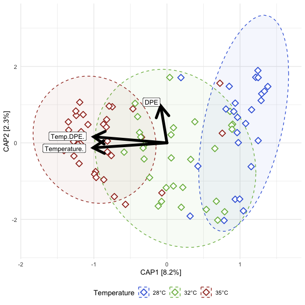<!-- -->

##### Tables

###### (hide)

Press on tabs to display tables. Scroll to see additional rows.

###### Capscale

<table class="gt_table" data-quarto-disable-processing="false" data-quarto-bootstrap="false">
  <thead>
    <tr class="gt_heading">
      <td colspan="7" class="gt_heading gt_title gt_font_normal" style>ADONIS2</td>
    </tr>
    <tr class="gt_heading">
      <td colspan="7" class="gt_heading gt_subtitle gt_font_normal gt_bottom_border" style>adonis2(Beta Distance ~ Temperature*DPE); Exposed fish</td>
    </tr>
    <tr class="gt_col_headings">
      <th class="gt_col_heading gt_columns_bottom_border gt_left" rowspan="1" colspan="1" scope="col" id="term">term</th>
      <th class="gt_col_heading gt_columns_bottom_border gt_right" rowspan="1" colspan="1" scope="col" id="df">df</th>
      <th class="gt_col_heading gt_columns_bottom_border gt_right" rowspan="1" colspan="1" scope="col" id="SumOfSqs">SumOfSqs</th>
      <th class="gt_col_heading gt_columns_bottom_border gt_right" rowspan="1" colspan="1" scope="col" id="R2">R2</th>
      <th class="gt_col_heading gt_columns_bottom_border gt_right" rowspan="1" colspan="1" scope="col" id="statistic">statistic</th>
      <th class="gt_col_heading gt_columns_bottom_border gt_right" rowspan="1" colspan="1" scope="col" id="p.value">p.value</th>
      <th class="gt_col_heading gt_columns_bottom_border gt_left" rowspan="1" colspan="1" scope="col" id="sig">sig</th>
    </tr>
  </thead>
  <tbody class="gt_table_body">
    <tr class="gt_group_heading_row">
      <th colspan="7" class="gt_group_heading" scope="colgroup" id="bray">bray</th>
    </tr>
    <tr class="gt_row_group_first"><td headers="bray  term" class="gt_row gt_left">Temperature</td>
<td headers="bray  df" class="gt_row gt_right">2.000</td>
<td headers="bray  SumOfSqs" class="gt_row gt_right">5.218</td>
<td headers="bray  R2" class="gt_row gt_right">0.251</td>
<td headers="bray  statistic" class="gt_row gt_right">14.843</td>
<td headers="bray  p.value" class="gt_row gt_right">0.001</td>
<td headers="bray  sig" class="gt_row gt_left">***</td></tr>
    <tr><td headers="bray  term" class="gt_row gt_left">DPE</td>
<td headers="bray  df" class="gt_row gt_right">1.000</td>
<td headers="bray  SumOfSqs" class="gt_row gt_right">0.394</td>
<td headers="bray  R2" class="gt_row gt_right">0.019</td>
<td headers="bray  statistic" class="gt_row gt_right">2.241</td>
<td headers="bray  p.value" class="gt_row gt_right">0.040</td>
<td headers="bray  sig" class="gt_row gt_left">*</td></tr>
    <tr><td headers="bray  term" class="gt_row gt_left">Temperature:DPE</td>
<td headers="bray  df" class="gt_row gt_right">2.000</td>
<td headers="bray  SumOfSqs" class="gt_row gt_right">0.548</td>
<td headers="bray  R2" class="gt_row gt_right">0.026</td>
<td headers="bray  statistic" class="gt_row gt_right">1.558</td>
<td headers="bray  p.value" class="gt_row gt_right">0.110</td>
<td headers="bray  sig" class="gt_row gt_left">ns</td></tr>
    <tr><td headers="bray  term" class="gt_row gt_left">Residual</td>
<td headers="bray  df" class="gt_row gt_right">83.000</td>
<td headers="bray  SumOfSqs" class="gt_row gt_right">14.589</td>
<td headers="bray  R2" class="gt_row gt_right">0.703</td>
<td headers="bray  statistic" class="gt_row gt_right">NA</td>
<td headers="bray  p.value" class="gt_row gt_right">NA</td>
<td headers="bray  sig" class="gt_row gt_left">NA</td></tr>
    <tr><td headers="bray  term" class="gt_row gt_left">Total</td>
<td headers="bray  df" class="gt_row gt_right">88.000</td>
<td headers="bray  SumOfSqs" class="gt_row gt_right">20.748</td>
<td headers="bray  R2" class="gt_row gt_right">1.000</td>
<td headers="bray  statistic" class="gt_row gt_right">NA</td>
<td headers="bray  p.value" class="gt_row gt_right">NA</td>
<td headers="bray  sig" class="gt_row gt_left">NA</td></tr>
    <tr class="gt_group_heading_row">
      <th colspan="7" class="gt_group_heading" scope="colgroup" id="canberra">canberra</th>
    </tr>
    <tr class="gt_row_group_first"><td headers="canberra  term" class="gt_row gt_left">Temperature</td>
<td headers="canberra  df" class="gt_row gt_right">2.000</td>
<td headers="canberra  SumOfSqs" class="gt_row gt_right">3.573</td>
<td headers="canberra  R2" class="gt_row gt_right">0.117</td>
<td headers="canberra  statistic" class="gt_row gt_right">5.847</td>
<td headers="canberra  p.value" class="gt_row gt_right">0.001</td>
<td headers="canberra  sig" class="gt_row gt_left">***</td></tr>
    <tr><td headers="canberra  term" class="gt_row gt_left">DPE</td>
<td headers="canberra  df" class="gt_row gt_right">1.000</td>
<td headers="canberra  SumOfSqs" class="gt_row gt_right">0.674</td>
<td headers="canberra  R2" class="gt_row gt_right">0.022</td>
<td headers="canberra  statistic" class="gt_row gt_right">2.207</td>
<td headers="canberra  p.value" class="gt_row gt_right">0.004</td>
<td headers="canberra  sig" class="gt_row gt_left">**</td></tr>
    <tr><td headers="canberra  term" class="gt_row gt_left">Temperature:DPE</td>
<td headers="canberra  df" class="gt_row gt_right">2.000</td>
<td headers="canberra  SumOfSqs" class="gt_row gt_right">0.913</td>
<td headers="canberra  R2" class="gt_row gt_right">0.030</td>
<td headers="canberra  statistic" class="gt_row gt_right">1.494</td>
<td headers="canberra  p.value" class="gt_row gt_right">0.015</td>
<td headers="canberra  sig" class="gt_row gt_left">*</td></tr>
    <tr><td headers="canberra  term" class="gt_row gt_left">Residual</td>
<td headers="canberra  df" class="gt_row gt_right">83.000</td>
<td headers="canberra  SumOfSqs" class="gt_row gt_right">25.360</td>
<td headers="canberra  R2" class="gt_row gt_right">0.831</td>
<td headers="canberra  statistic" class="gt_row gt_right">NA</td>
<td headers="canberra  p.value" class="gt_row gt_right">NA</td>
<td headers="canberra  sig" class="gt_row gt_left">NA</td></tr>
    <tr><td headers="canberra  term" class="gt_row gt_left">Total</td>
<td headers="canberra  df" class="gt_row gt_right">88.000</td>
<td headers="canberra  SumOfSqs" class="gt_row gt_right">30.520</td>
<td headers="canberra  R2" class="gt_row gt_right">1.000</td>
<td headers="canberra  statistic" class="gt_row gt_right">NA</td>
<td headers="canberra  p.value" class="gt_row gt_right">NA</td>
<td headers="canberra  sig" class="gt_row gt_left">NA</td></tr>
    <tr class="gt_group_heading_row">
      <th colspan="7" class="gt_group_heading" scope="colgroup" id="gunifrac">gunifrac</th>
    </tr>
    <tr class="gt_row_group_first"><td headers="gunifrac  term" class="gt_row gt_left">Temperature</td>
<td headers="gunifrac  df" class="gt_row gt_right">2.000</td>
<td headers="gunifrac  SumOfSqs" class="gt_row gt_right">3.363</td>
<td headers="gunifrac  R2" class="gt_row gt_right">0.212</td>
<td headers="gunifrac  statistic" class="gt_row gt_right">11.847</td>
<td headers="gunifrac  p.value" class="gt_row gt_right">0.001</td>
<td headers="gunifrac  sig" class="gt_row gt_left">***</td></tr>
    <tr><td headers="gunifrac  term" class="gt_row gt_left">DPE</td>
<td headers="gunifrac  df" class="gt_row gt_right">1.000</td>
<td headers="gunifrac  SumOfSqs" class="gt_row gt_right">0.261</td>
<td headers="gunifrac  R2" class="gt_row gt_right">0.016</td>
<td headers="gunifrac  statistic" class="gt_row gt_right">1.837</td>
<td headers="gunifrac  p.value" class="gt_row gt_right">0.102</td>
<td headers="gunifrac  sig" class="gt_row gt_left">ns</td></tr>
    <tr><td headers="gunifrac  term" class="gt_row gt_left">Temperature:DPE</td>
<td headers="gunifrac  df" class="gt_row gt_right">2.000</td>
<td headers="gunifrac  SumOfSqs" class="gt_row gt_right">0.436</td>
<td headers="gunifrac  R2" class="gt_row gt_right">0.028</td>
<td headers="gunifrac  statistic" class="gt_row gt_right">1.535</td>
<td headers="gunifrac  p.value" class="gt_row gt_right">0.134</td>
<td headers="gunifrac  sig" class="gt_row gt_left">ns</td></tr>
    <tr><td headers="gunifrac  term" class="gt_row gt_left">Residual</td>
<td headers="gunifrac  df" class="gt_row gt_right">83.000</td>
<td headers="gunifrac  SumOfSqs" class="gt_row gt_right">11.781</td>
<td headers="gunifrac  R2" class="gt_row gt_right">0.744</td>
<td headers="gunifrac  statistic" class="gt_row gt_right">NA</td>
<td headers="gunifrac  p.value" class="gt_row gt_right">NA</td>
<td headers="gunifrac  sig" class="gt_row gt_left">NA</td></tr>
    <tr><td headers="gunifrac  term" class="gt_row gt_left">Total</td>
<td headers="gunifrac  df" class="gt_row gt_right">88.000</td>
<td headers="gunifrac  SumOfSqs" class="gt_row gt_right">15.841</td>
<td headers="gunifrac  R2" class="gt_row gt_right">1.000</td>
<td headers="gunifrac  statistic" class="gt_row gt_right">NA</td>
<td headers="gunifrac  p.value" class="gt_row gt_right">NA</td>
<td headers="gunifrac  sig" class="gt_row gt_left">NA</td></tr>
  </tbody>
  &#10;  
</table>

###### Dispersion (ANOVA)

<table class="gt_table" data-quarto-disable-processing="false" data-quarto-bootstrap="false">
  <thead>
    <tr class="gt_heading">
      <td colspan="7" class="gt_heading gt_title gt_font_normal" style>ANOVA: Homogeneity of Dispersion</td>
    </tr>
    <tr class="gt_heading">
      <td colspan="7" class="gt_heading gt_subtitle gt_font_normal gt_bottom_border" style>ANOVA(Beta Disperson ~ Temperature); Exposed fish</td>
    </tr>
    <tr class="gt_col_headings">
      <th class="gt_col_heading gt_columns_bottom_border gt_left" rowspan="1" colspan="1" scope="col" id="term">term</th>
      <th class="gt_col_heading gt_columns_bottom_border gt_right" rowspan="1" colspan="1" scope="col" id="df">df</th>
      <th class="gt_col_heading gt_columns_bottom_border gt_right" rowspan="1" colspan="1" scope="col" id="sumsq">sumsq</th>
      <th class="gt_col_heading gt_columns_bottom_border gt_right" rowspan="1" colspan="1" scope="col" id="meansq">meansq</th>
      <th class="gt_col_heading gt_columns_bottom_border gt_right" rowspan="1" colspan="1" scope="col" id="statistic">statistic</th>
      <th class="gt_col_heading gt_columns_bottom_border gt_right" rowspan="1" colspan="1" scope="col" id="p.value">p.value</th>
      <th class="gt_col_heading gt_columns_bottom_border gt_right" rowspan="1" colspan="1" scope="col" id="sig">sig</th>
    </tr>
  </thead>
  <tbody class="gt_table_body">
    <tr class="gt_group_heading_row">
      <th colspan="7" class="gt_group_heading" scope="colgroup" id="bray">bray</th>
    </tr>
    <tr class="gt_row_group_first"><td headers="bray  term" class="gt_row gt_left">Temp.DPE</td>
<td headers="bray  df" class="gt_row gt_right">11.000</td>
<td headers="bray  sumsq" class="gt_row gt_right">0.624</td>
<td headers="bray  meansq" class="gt_row gt_right">0.057</td>
<td headers="bray  statistic" class="gt_row gt_right">3.261</td>
<td headers="bray  p.value" class="gt_row gt_right">0.001</td>
<td headers="bray  sig" class="gt_row gt_right">**</td></tr>
    <tr><td headers="bray  term" class="gt_row gt_left">Residual</td>
<td headers="bray  df" class="gt_row gt_right">77.000</td>
<td headers="bray  sumsq" class="gt_row gt_right">1.339</td>
<td headers="bray  meansq" class="gt_row gt_right">0.017</td>
<td headers="bray  statistic" class="gt_row gt_right">NA</td>
<td headers="bray  p.value" class="gt_row gt_right">NA</td>
<td headers="bray  sig" class="gt_row gt_right">NA</td></tr>
    <tr class="gt_group_heading_row">
      <th colspan="7" class="gt_group_heading" scope="colgroup" id="canberra">canberra</th>
    </tr>
    <tr class="gt_row_group_first"><td headers="canberra  term" class="gt_row gt_left">Temp.DPE</td>
<td headers="canberra  df" class="gt_row gt_right">11.000</td>
<td headers="canberra  sumsq" class="gt_row gt_right">0.316</td>
<td headers="canberra  meansq" class="gt_row gt_right">0.029</td>
<td headers="canberra  statistic" class="gt_row gt_right">2.748</td>
<td headers="canberra  p.value" class="gt_row gt_right">0.005</td>
<td headers="canberra  sig" class="gt_row gt_right">**</td></tr>
    <tr><td headers="canberra  term" class="gt_row gt_left">Residual</td>
<td headers="canberra  df" class="gt_row gt_right">77.000</td>
<td headers="canberra  sumsq" class="gt_row gt_right">0.805</td>
<td headers="canberra  meansq" class="gt_row gt_right">0.010</td>
<td headers="canberra  statistic" class="gt_row gt_right">NA</td>
<td headers="canberra  p.value" class="gt_row gt_right">NA</td>
<td headers="canberra  sig" class="gt_row gt_right">NA</td></tr>
    <tr class="gt_group_heading_row">
      <th colspan="7" class="gt_group_heading" scope="colgroup" id="gunifrac">gunifrac</th>
    </tr>
    <tr class="gt_row_group_first"><td headers="gunifrac  term" class="gt_row gt_left">Temp.DPE</td>
<td headers="gunifrac  df" class="gt_row gt_right">11.000</td>
<td headers="gunifrac  sumsq" class="gt_row gt_right">0.420</td>
<td headers="gunifrac  meansq" class="gt_row gt_right">0.038</td>
<td headers="gunifrac  statistic" class="gt_row gt_right">3.232</td>
<td headers="gunifrac  p.value" class="gt_row gt_right">0.001</td>
<td headers="gunifrac  sig" class="gt_row gt_right">**</td></tr>
    <tr><td headers="gunifrac  term" class="gt_row gt_left">Residual</td>
<td headers="gunifrac  df" class="gt_row gt_right">77.000</td>
<td headers="gunifrac  sumsq" class="gt_row gt_right">0.909</td>
<td headers="gunifrac  meansq" class="gt_row gt_right">0.012</td>
<td headers="gunifrac  statistic" class="gt_row gt_right">NA</td>
<td headers="gunifrac  p.value" class="gt_row gt_right">NA</td>
<td headers="gunifrac  sig" class="gt_row gt_right">NA</td></tr>
  </tbody>
  &#10;  
</table>

###### Dispersion (Tukey)

<table class="gt_table" data-quarto-disable-processing="false" data-quarto-bootstrap="false">
  <thead>
    <tr class="gt_heading">
      <td colspan="9" class="gt_heading gt_title gt_font_normal" style>Tukey: Homogeneity of Dispersion</td>
    </tr>
    <tr class="gt_heading">
      <td colspan="9" class="gt_heading gt_subtitle gt_font_normal gt_bottom_border" style>Tukey(Beta Disperson ~ Temperature*DPE); Exposed fish</td>
    </tr>
    <tr class="gt_col_headings">
      <th class="gt_col_heading gt_columns_bottom_border gt_left" rowspan="1" colspan="1" scope="col" id=".y.">.y.</th>
      <th class="gt_col_heading gt_columns_bottom_border gt_left" rowspan="1" colspan="1" scope="col" id="term">term</th>
      <th class="gt_col_heading gt_columns_bottom_border gt_left" rowspan="1" colspan="1" scope="col" id="group1">group1</th>
      <th class="gt_col_heading gt_columns_bottom_border gt_left" rowspan="1" colspan="1" scope="col" id="group2">group2</th>
      <th class="gt_col_heading gt_columns_bottom_border gt_right" rowspan="1" colspan="1" scope="col" id="estimate">estimate</th>
      <th class="gt_col_heading gt_columns_bottom_border gt_right" rowspan="1" colspan="1" scope="col" id="conf.low">conf.low</th>
      <th class="gt_col_heading gt_columns_bottom_border gt_right" rowspan="1" colspan="1" scope="col" id="conf.high">conf.high</th>
      <th class="gt_col_heading gt_columns_bottom_border gt_right" rowspan="1" colspan="1" scope="col" id="adj.p.value">adj.p.value</th>
      <th class="gt_col_heading gt_columns_bottom_border gt_left" rowspan="1" colspan="1" scope="col" id="sig">sig</th>
    </tr>
  </thead>
  <tbody class="gt_table_body">
    <tr class="gt_group_heading_row">
      <th colspan="9" class="gt_group_heading" scope="colgroup" id="bray">bray</th>
    </tr>
    <tr class="gt_row_group_first"><td headers="bray  .y." class="gt_row gt_left">Distance</td>
<td headers="bray  term" class="gt_row gt_left">Temp.DPE</td>
<td headers="bray  group1" class="gt_row gt_left">28°C__21DPE</td>
<td headers="bray  group2" class="gt_row gt_left">28°C__14DPE</td>
<td headers="bray  estimate" class="gt_row gt_right">−0.213</td>
<td headers="bray  conf.low" class="gt_row gt_right">−0.485</td>
<td headers="bray  conf.high" class="gt_row gt_right">0.059</td>
<td headers="bray  adj.p.value" class="gt_row gt_right">≥0.25</td>
<td headers="bray  sig" class="gt_row gt_left">ns</td></tr>
    <tr><td headers="bray  .y." class="gt_row gt_left">Distance</td>
<td headers="bray  term" class="gt_row gt_left">Temp.DPE</td>
<td headers="bray  group1" class="gt_row gt_left">28°C__28DPE</td>
<td headers="bray  group2" class="gt_row gt_left">28°C__14DPE</td>
<td headers="bray  estimate" class="gt_row gt_right">−0.258</td>
<td headers="bray  conf.low" class="gt_row gt_right">−0.512</td>
<td headers="bray  conf.high" class="gt_row gt_right">−0.005</td>
<td headers="bray  adj.p.value" class="gt_row gt_right">0.042</td>
<td headers="bray  sig" class="gt_row gt_left">*</td></tr>
    <tr><td headers="bray  .y." class="gt_row gt_left">Distance</td>
<td headers="bray  term" class="gt_row gt_left">Temp.DPE</td>
<td headers="bray  group1" class="gt_row gt_left">28°C__42DPE</td>
<td headers="bray  group2" class="gt_row gt_left">28°C__14DPE</td>
<td headers="bray  estimate" class="gt_row gt_right">−0.063</td>
<td headers="bray  conf.low" class="gt_row gt_right">−0.285</td>
<td headers="bray  conf.high" class="gt_row gt_right">0.160</td>
<td headers="bray  adj.p.value" class="gt_row gt_right">≥0.25</td>
<td headers="bray  sig" class="gt_row gt_left">ns</td></tr>
    <tr><td headers="bray  .y." class="gt_row gt_left">Distance</td>
<td headers="bray  term" class="gt_row gt_left">Temp.DPE</td>
<td headers="bray  group1" class="gt_row gt_left">32°C__14DPE</td>
<td headers="bray  group2" class="gt_row gt_left">28°C__14DPE</td>
<td headers="bray  estimate" class="gt_row gt_right">−0.059</td>
<td headers="bray  conf.low" class="gt_row gt_right">−0.270</td>
<td headers="bray  conf.high" class="gt_row gt_right">0.152</td>
<td headers="bray  adj.p.value" class="gt_row gt_right">≥0.25</td>
<td headers="bray  sig" class="gt_row gt_left">ns</td></tr>
    <tr><td headers="bray  .y." class="gt_row gt_left">Distance</td>
<td headers="bray  term" class="gt_row gt_left">Temp.DPE</td>
<td headers="bray  group1" class="gt_row gt_left">32°C__21DPE</td>
<td headers="bray  group2" class="gt_row gt_left">28°C__14DPE</td>
<td headers="bray  estimate" class="gt_row gt_right">−0.089</td>
<td headers="bray  conf.low" class="gt_row gt_right">−0.319</td>
<td headers="bray  conf.high" class="gt_row gt_right">0.141</td>
<td headers="bray  adj.p.value" class="gt_row gt_right">≥0.25</td>
<td headers="bray  sig" class="gt_row gt_left">ns</td></tr>
    <tr><td headers="bray  .y." class="gt_row gt_left">Distance</td>
<td headers="bray  term" class="gt_row gt_left">Temp.DPE</td>
<td headers="bray  group1" class="gt_row gt_left">32°C__28DPE</td>
<td headers="bray  group2" class="gt_row gt_left">28°C__14DPE</td>
<td headers="bray  estimate" class="gt_row gt_right">−0.123</td>
<td headers="bray  conf.low" class="gt_row gt_right">−0.363</td>
<td headers="bray  conf.high" class="gt_row gt_right">0.117</td>
<td headers="bray  adj.p.value" class="gt_row gt_right">≥0.25</td>
<td headers="bray  sig" class="gt_row gt_left">ns</td></tr>
    <tr><td headers="bray  .y." class="gt_row gt_left">Distance</td>
<td headers="bray  term" class="gt_row gt_left">Temp.DPE</td>
<td headers="bray  group1" class="gt_row gt_left">32°C__42DPE</td>
<td headers="bray  group2" class="gt_row gt_left">28°C__14DPE</td>
<td headers="bray  estimate" class="gt_row gt_right">−0.142</td>
<td headers="bray  conf.low" class="gt_row gt_right">−0.372</td>
<td headers="bray  conf.high" class="gt_row gt_right">0.088</td>
<td headers="bray  adj.p.value" class="gt_row gt_right">≥0.25</td>
<td headers="bray  sig" class="gt_row gt_left">ns</td></tr>
    <tr><td headers="bray  .y." class="gt_row gt_left">Distance</td>
<td headers="bray  term" class="gt_row gt_left">Temp.DPE</td>
<td headers="bray  group1" class="gt_row gt_left">35°C__14DPE</td>
<td headers="bray  group2" class="gt_row gt_left">28°C__14DPE</td>
<td headers="bray  estimate" class="gt_row gt_right">−0.202</td>
<td headers="bray  conf.low" class="gt_row gt_right">−0.418</td>
<td headers="bray  conf.high" class="gt_row gt_right">0.014</td>
<td headers="bray  adj.p.value" class="gt_row gt_right">0.090</td>
<td headers="bray  sig" class="gt_row gt_left">ns</td></tr>
    <tr><td headers="bray  .y." class="gt_row gt_left">Distance</td>
<td headers="bray  term" class="gt_row gt_left">Temp.DPE</td>
<td headers="bray  group1" class="gt_row gt_left">35°C__21DPE</td>
<td headers="bray  group2" class="gt_row gt_left">28°C__14DPE</td>
<td headers="bray  estimate" class="gt_row gt_right">−0.170</td>
<td headers="bray  conf.low" class="gt_row gt_right">−0.393</td>
<td headers="bray  conf.high" class="gt_row gt_right">0.052</td>
<td headers="bray  adj.p.value" class="gt_row gt_right">≥0.25</td>
<td headers="bray  sig" class="gt_row gt_left">ns</td></tr>
    <tr><td headers="bray  .y." class="gt_row gt_left">Distance</td>
<td headers="bray  term" class="gt_row gt_left">Temp.DPE</td>
<td headers="bray  group1" class="gt_row gt_left">35°C__28DPE</td>
<td headers="bray  group2" class="gt_row gt_left">28°C__14DPE</td>
<td headers="bray  estimate" class="gt_row gt_right">−0.289</td>
<td headers="bray  conf.low" class="gt_row gt_right">−0.511</td>
<td headers="bray  conf.high" class="gt_row gt_right">−0.067</td>
<td headers="bray  adj.p.value" class="gt_row gt_right">0.002</td>
<td headers="bray  sig" class="gt_row gt_left">**</td></tr>
    <tr><td headers="bray  .y." class="gt_row gt_left">Distance</td>
<td headers="bray  term" class="gt_row gt_left">Temp.DPE</td>
<td headers="bray  group1" class="gt_row gt_left">35°C__42DPE</td>
<td headers="bray  group2" class="gt_row gt_left">28°C__14DPE</td>
<td headers="bray  estimate" class="gt_row gt_right">−0.192</td>
<td headers="bray  conf.low" class="gt_row gt_right">−0.408</td>
<td headers="bray  conf.high" class="gt_row gt_right">0.024</td>
<td headers="bray  adj.p.value" class="gt_row gt_right">0.130</td>
<td headers="bray  sig" class="gt_row gt_left">ns</td></tr>
    <tr><td headers="bray  .y." class="gt_row gt_left">Distance</td>
<td headers="bray  term" class="gt_row gt_left">Temp.DPE</td>
<td headers="bray  group1" class="gt_row gt_left">28°C__28DPE</td>
<td headers="bray  group2" class="gt_row gt_left">28°C__21DPE</td>
<td headers="bray  estimate" class="gt_row gt_right">−0.046</td>
<td headers="bray  conf.low" class="gt_row gt_right">−0.344</td>
<td headers="bray  conf.high" class="gt_row gt_right">0.253</td>
<td headers="bray  adj.p.value" class="gt_row gt_right">≥0.25</td>
<td headers="bray  sig" class="gt_row gt_left">ns</td></tr>
    <tr><td headers="bray  .y." class="gt_row gt_left">Distance</td>
<td headers="bray  term" class="gt_row gt_left">Temp.DPE</td>
<td headers="bray  group1" class="gt_row gt_left">28°C__42DPE</td>
<td headers="bray  group2" class="gt_row gt_left">28°C__21DPE</td>
<td headers="bray  estimate" class="gt_row gt_right">0.150</td>
<td headers="bray  conf.low" class="gt_row gt_right">−0.122</td>
<td headers="bray  conf.high" class="gt_row gt_right">0.422</td>
<td headers="bray  adj.p.value" class="gt_row gt_right">≥0.25</td>
<td headers="bray  sig" class="gt_row gt_left">ns</td></tr>
    <tr><td headers="bray  .y." class="gt_row gt_left">Distance</td>
<td headers="bray  term" class="gt_row gt_left">Temp.DPE</td>
<td headers="bray  group1" class="gt_row gt_left">32°C__14DPE</td>
<td headers="bray  group2" class="gt_row gt_left">28°C__21DPE</td>
<td headers="bray  estimate" class="gt_row gt_right">0.153</td>
<td headers="bray  conf.low" class="gt_row gt_right">−0.110</td>
<td headers="bray  conf.high" class="gt_row gt_right">0.416</td>
<td headers="bray  adj.p.value" class="gt_row gt_right">≥0.25</td>
<td headers="bray  sig" class="gt_row gt_left">ns</td></tr>
    <tr><td headers="bray  .y." class="gt_row gt_left">Distance</td>
<td headers="bray  term" class="gt_row gt_left">Temp.DPE</td>
<td headers="bray  group1" class="gt_row gt_left">32°C__21DPE</td>
<td headers="bray  group2" class="gt_row gt_left">28°C__21DPE</td>
<td headers="bray  estimate" class="gt_row gt_right">0.124</td>
<td headers="bray  conf.low" class="gt_row gt_right">−0.154</td>
<td headers="bray  conf.high" class="gt_row gt_right">0.403</td>
<td headers="bray  adj.p.value" class="gt_row gt_right">≥0.25</td>
<td headers="bray  sig" class="gt_row gt_left">ns</td></tr>
    <tr><td headers="bray  .y." class="gt_row gt_left">Distance</td>
<td headers="bray  term" class="gt_row gt_left">Temp.DPE</td>
<td headers="bray  group1" class="gt_row gt_left">32°C__28DPE</td>
<td headers="bray  group2" class="gt_row gt_left">28°C__21DPE</td>
<td headers="bray  estimate" class="gt_row gt_right">0.090</td>
<td headers="bray  conf.low" class="gt_row gt_right">−0.197</td>
<td headers="bray  conf.high" class="gt_row gt_right">0.377</td>
<td headers="bray  adj.p.value" class="gt_row gt_right">≥0.25</td>
<td headers="bray  sig" class="gt_row gt_left">ns</td></tr>
    <tr><td headers="bray  .y." class="gt_row gt_left">Distance</td>
<td headers="bray  term" class="gt_row gt_left">Temp.DPE</td>
<td headers="bray  group1" class="gt_row gt_left">32°C__42DPE</td>
<td headers="bray  group2" class="gt_row gt_left">28°C__21DPE</td>
<td headers="bray  estimate" class="gt_row gt_right">0.071</td>
<td headers="bray  conf.low" class="gt_row gt_right">−0.208</td>
<td headers="bray  conf.high" class="gt_row gt_right">0.350</td>
<td headers="bray  adj.p.value" class="gt_row gt_right">≥0.25</td>
<td headers="bray  sig" class="gt_row gt_left">ns</td></tr>
    <tr><td headers="bray  .y." class="gt_row gt_left">Distance</td>
<td headers="bray  term" class="gt_row gt_left">Temp.DPE</td>
<td headers="bray  group1" class="gt_row gt_left">35°C__14DPE</td>
<td headers="bray  group2" class="gt_row gt_left">28°C__21DPE</td>
<td headers="bray  estimate" class="gt_row gt_right">0.011</td>
<td headers="bray  conf.low" class="gt_row gt_right">−0.256</td>
<td headers="bray  conf.high" class="gt_row gt_right">0.278</td>
<td headers="bray  adj.p.value" class="gt_row gt_right">≥0.25</td>
<td headers="bray  sig" class="gt_row gt_left">ns</td></tr>
    <tr><td headers="bray  .y." class="gt_row gt_left">Distance</td>
<td headers="bray  term" class="gt_row gt_left">Temp.DPE</td>
<td headers="bray  group1" class="gt_row gt_left">35°C__21DPE</td>
<td headers="bray  group2" class="gt_row gt_left">28°C__21DPE</td>
<td headers="bray  estimate" class="gt_row gt_right">0.042</td>
<td headers="bray  conf.low" class="gt_row gt_right">−0.230</td>
<td headers="bray  conf.high" class="gt_row gt_right">0.315</td>
<td headers="bray  adj.p.value" class="gt_row gt_right">≥0.25</td>
<td headers="bray  sig" class="gt_row gt_left">ns</td></tr>
    <tr><td headers="bray  .y." class="gt_row gt_left">Distance</td>
<td headers="bray  term" class="gt_row gt_left">Temp.DPE</td>
<td headers="bray  group1" class="gt_row gt_left">35°C__28DPE</td>
<td headers="bray  group2" class="gt_row gt_left">28°C__21DPE</td>
<td headers="bray  estimate" class="gt_row gt_right">−0.077</td>
<td headers="bray  conf.low" class="gt_row gt_right">−0.349</td>
<td headers="bray  conf.high" class="gt_row gt_right">0.196</td>
<td headers="bray  adj.p.value" class="gt_row gt_right">≥0.25</td>
<td headers="bray  sig" class="gt_row gt_left">ns</td></tr>
    <tr><td headers="bray  .y." class="gt_row gt_left">Distance</td>
<td headers="bray  term" class="gt_row gt_left">Temp.DPE</td>
<td headers="bray  group1" class="gt_row gt_left">35°C__42DPE</td>
<td headers="bray  group2" class="gt_row gt_left">28°C__21DPE</td>
<td headers="bray  estimate" class="gt_row gt_right">0.021</td>
<td headers="bray  conf.low" class="gt_row gt_right">−0.246</td>
<td headers="bray  conf.high" class="gt_row gt_right">0.288</td>
<td headers="bray  adj.p.value" class="gt_row gt_right">≥0.25</td>
<td headers="bray  sig" class="gt_row gt_left">ns</td></tr>
    <tr><td headers="bray  .y." class="gt_row gt_left">Distance</td>
<td headers="bray  term" class="gt_row gt_left">Temp.DPE</td>
<td headers="bray  group1" class="gt_row gt_left">28°C__42DPE</td>
<td headers="bray  group2" class="gt_row gt_left">28°C__28DPE</td>
<td headers="bray  estimate" class="gt_row gt_right">0.196</td>
<td headers="bray  conf.low" class="gt_row gt_right">−0.058</td>
<td headers="bray  conf.high" class="gt_row gt_right">0.449</td>
<td headers="bray  adj.p.value" class="gt_row gt_right">≥0.25</td>
<td headers="bray  sig" class="gt_row gt_left">ns</td></tr>
    <tr><td headers="bray  .y." class="gt_row gt_left">Distance</td>
<td headers="bray  term" class="gt_row gt_left">Temp.DPE</td>
<td headers="bray  group1" class="gt_row gt_left">32°C__14DPE</td>
<td headers="bray  group2" class="gt_row gt_left">28°C__28DPE</td>
<td headers="bray  estimate" class="gt_row gt_right">0.199</td>
<td headers="bray  conf.low" class="gt_row gt_right">−0.044</td>
<td headers="bray  conf.high" class="gt_row gt_right">0.443</td>
<td headers="bray  adj.p.value" class="gt_row gt_right">0.220</td>
<td headers="bray  sig" class="gt_row gt_left">ns</td></tr>
    <tr><td headers="bray  .y." class="gt_row gt_left">Distance</td>
<td headers="bray  term" class="gt_row gt_left">Temp.DPE</td>
<td headers="bray  group1" class="gt_row gt_left">32°C__21DPE</td>
<td headers="bray  group2" class="gt_row gt_left">28°C__28DPE</td>
<td headers="bray  estimate" class="gt_row gt_right">0.170</td>
<td headers="bray  conf.low" class="gt_row gt_right">−0.091</td>
<td headers="bray  conf.high" class="gt_row gt_right">0.430</td>
<td headers="bray  adj.p.value" class="gt_row gt_right">≥0.25</td>
<td headers="bray  sig" class="gt_row gt_left">ns</td></tr>
    <tr><td headers="bray  .y." class="gt_row gt_left">Distance</td>
<td headers="bray  term" class="gt_row gt_left">Temp.DPE</td>
<td headers="bray  group1" class="gt_row gt_left">32°C__28DPE</td>
<td headers="bray  group2" class="gt_row gt_left">28°C__28DPE</td>
<td headers="bray  estimate" class="gt_row gt_right">0.136</td>
<td headers="bray  conf.low" class="gt_row gt_right">−0.133</td>
<td headers="bray  conf.high" class="gt_row gt_right">0.405</td>
<td headers="bray  adj.p.value" class="gt_row gt_right">≥0.25</td>
<td headers="bray  sig" class="gt_row gt_left">ns</td></tr>
    <tr><td headers="bray  .y." class="gt_row gt_left">Distance</td>
<td headers="bray  term" class="gt_row gt_left">Temp.DPE</td>
<td headers="bray  group1" class="gt_row gt_left">32°C__42DPE</td>
<td headers="bray  group2" class="gt_row gt_left">28°C__28DPE</td>
<td headers="bray  estimate" class="gt_row gt_right">0.117</td>
<td headers="bray  conf.low" class="gt_row gt_right">−0.144</td>
<td headers="bray  conf.high" class="gt_row gt_right">0.377</td>
<td headers="bray  adj.p.value" class="gt_row gt_right">≥0.25</td>
<td headers="bray  sig" class="gt_row gt_left">ns</td></tr>
    <tr><td headers="bray  .y." class="gt_row gt_left">Distance</td>
<td headers="bray  term" class="gt_row gt_left">Temp.DPE</td>
<td headers="bray  group1" class="gt_row gt_left">35°C__14DPE</td>
<td headers="bray  group2" class="gt_row gt_left">28°C__28DPE</td>
<td headers="bray  estimate" class="gt_row gt_right">0.057</td>
<td headers="bray  conf.low" class="gt_row gt_right">−0.191</td>
<td headers="bray  conf.high" class="gt_row gt_right">0.305</td>
<td headers="bray  adj.p.value" class="gt_row gt_right">≥0.25</td>
<td headers="bray  sig" class="gt_row gt_left">ns</td></tr>
    <tr><td headers="bray  .y." class="gt_row gt_left">Distance</td>
<td headers="bray  term" class="gt_row gt_left">Temp.DPE</td>
<td headers="bray  group1" class="gt_row gt_left">35°C__21DPE</td>
<td headers="bray  group2" class="gt_row gt_left">28°C__28DPE</td>
<td headers="bray  estimate" class="gt_row gt_right">0.088</td>
<td headers="bray  conf.low" class="gt_row gt_right">−0.165</td>
<td headers="bray  conf.high" class="gt_row gt_right">0.341</td>
<td headers="bray  adj.p.value" class="gt_row gt_right">≥0.25</td>
<td headers="bray  sig" class="gt_row gt_left">ns</td></tr>
    <tr><td headers="bray  .y." class="gt_row gt_left">Distance</td>
<td headers="bray  term" class="gt_row gt_left">Temp.DPE</td>
<td headers="bray  group1" class="gt_row gt_left">35°C__28DPE</td>
<td headers="bray  group2" class="gt_row gt_left">28°C__28DPE</td>
<td headers="bray  estimate" class="gt_row gt_right">−0.031</td>
<td headers="bray  conf.low" class="gt_row gt_right">−0.284</td>
<td headers="bray  conf.high" class="gt_row gt_right">0.222</td>
<td headers="bray  adj.p.value" class="gt_row gt_right">≥0.25</td>
<td headers="bray  sig" class="gt_row gt_left">ns</td></tr>
    <tr><td headers="bray  .y." class="gt_row gt_left">Distance</td>
<td headers="bray  term" class="gt_row gt_left">Temp.DPE</td>
<td headers="bray  group1" class="gt_row gt_left">35°C__42DPE</td>
<td headers="bray  group2" class="gt_row gt_left">28°C__28DPE</td>
<td headers="bray  estimate" class="gt_row gt_right">0.066</td>
<td headers="bray  conf.low" class="gt_row gt_right">−0.182</td>
<td headers="bray  conf.high" class="gt_row gt_right">0.314</td>
<td headers="bray  adj.p.value" class="gt_row gt_right">≥0.25</td>
<td headers="bray  sig" class="gt_row gt_left">ns</td></tr>
    <tr><td headers="bray  .y." class="gt_row gt_left">Distance</td>
<td headers="bray  term" class="gt_row gt_left">Temp.DPE</td>
<td headers="bray  group1" class="gt_row gt_left">32°C__14DPE</td>
<td headers="bray  group2" class="gt_row gt_left">28°C__42DPE</td>
<td headers="bray  estimate" class="gt_row gt_right">0.003</td>
<td headers="bray  conf.low" class="gt_row gt_right">−0.207</td>
<td headers="bray  conf.high" class="gt_row gt_right">0.214</td>
<td headers="bray  adj.p.value" class="gt_row gt_right">≥0.25</td>
<td headers="bray  sig" class="gt_row gt_left">ns</td></tr>
    <tr><td headers="bray  .y." class="gt_row gt_left">Distance</td>
<td headers="bray  term" class="gt_row gt_left">Temp.DPE</td>
<td headers="bray  group1" class="gt_row gt_left">32°C__21DPE</td>
<td headers="bray  group2" class="gt_row gt_left">28°C__42DPE</td>
<td headers="bray  estimate" class="gt_row gt_right">−0.026</td>
<td headers="bray  conf.low" class="gt_row gt_right">−0.256</td>
<td headers="bray  conf.high" class="gt_row gt_right">0.204</td>
<td headers="bray  adj.p.value" class="gt_row gt_right">≥0.25</td>
<td headers="bray  sig" class="gt_row gt_left">ns</td></tr>
    <tr><td headers="bray  .y." class="gt_row gt_left">Distance</td>
<td headers="bray  term" class="gt_row gt_left">Temp.DPE</td>
<td headers="bray  group1" class="gt_row gt_left">32°C__28DPE</td>
<td headers="bray  group2" class="gt_row gt_left">28°C__42DPE</td>
<td headers="bray  estimate" class="gt_row gt_right">−0.060</td>
<td headers="bray  conf.low" class="gt_row gt_right">−0.300</td>
<td headers="bray  conf.high" class="gt_row gt_right">0.180</td>
<td headers="bray  adj.p.value" class="gt_row gt_right">≥0.25</td>
<td headers="bray  sig" class="gt_row gt_left">ns</td></tr>
    <tr><td headers="bray  .y." class="gt_row gt_left">Distance</td>
<td headers="bray  term" class="gt_row gt_left">Temp.DPE</td>
<td headers="bray  group1" class="gt_row gt_left">32°C__42DPE</td>
<td headers="bray  group2" class="gt_row gt_left">28°C__42DPE</td>
<td headers="bray  estimate" class="gt_row gt_right">−0.079</td>
<td headers="bray  conf.low" class="gt_row gt_right">−0.309</td>
<td headers="bray  conf.high" class="gt_row gt_right">0.151</td>
<td headers="bray  adj.p.value" class="gt_row gt_right">≥0.25</td>
<td headers="bray  sig" class="gt_row gt_left">ns</td></tr>
    <tr><td headers="bray  .y." class="gt_row gt_left">Distance</td>
<td headers="bray  term" class="gt_row gt_left">Temp.DPE</td>
<td headers="bray  group1" class="gt_row gt_left">35°C__14DPE</td>
<td headers="bray  group2" class="gt_row gt_left">28°C__42DPE</td>
<td headers="bray  estimate" class="gt_row gt_right">−0.139</td>
<td headers="bray  conf.low" class="gt_row gt_right">−0.355</td>
<td headers="bray  conf.high" class="gt_row gt_right">0.077</td>
<td headers="bray  adj.p.value" class="gt_row gt_right">≥0.25</td>
<td headers="bray  sig" class="gt_row gt_left">ns</td></tr>
    <tr><td headers="bray  .y." class="gt_row gt_left">Distance</td>
<td headers="bray  term" class="gt_row gt_left">Temp.DPE</td>
<td headers="bray  group1" class="gt_row gt_left">35°C__21DPE</td>
<td headers="bray  group2" class="gt_row gt_left">28°C__42DPE</td>
<td headers="bray  estimate" class="gt_row gt_right">−0.108</td>
<td headers="bray  conf.low" class="gt_row gt_right">−0.330</td>
<td headers="bray  conf.high" class="gt_row gt_right">0.115</td>
<td headers="bray  adj.p.value" class="gt_row gt_right">≥0.25</td>
<td headers="bray  sig" class="gt_row gt_left">ns</td></tr>
    <tr><td headers="bray  .y." class="gt_row gt_left">Distance</td>
<td headers="bray  term" class="gt_row gt_left">Temp.DPE</td>
<td headers="bray  group1" class="gt_row gt_left">35°C__28DPE</td>
<td headers="bray  group2" class="gt_row gt_left">28°C__42DPE</td>
<td headers="bray  estimate" class="gt_row gt_right">−0.227</td>
<td headers="bray  conf.low" class="gt_row gt_right">−0.449</td>
<td headers="bray  conf.high" class="gt_row gt_right">−0.004</td>
<td headers="bray  adj.p.value" class="gt_row gt_right">0.042</td>
<td headers="bray  sig" class="gt_row gt_left">*</td></tr>
    <tr><td headers="bray  .y." class="gt_row gt_left">Distance</td>
<td headers="bray  term" class="gt_row gt_left">Temp.DPE</td>
<td headers="bray  group1" class="gt_row gt_left">35°C__42DPE</td>
<td headers="bray  group2" class="gt_row gt_left">28°C__42DPE</td>
<td headers="bray  estimate" class="gt_row gt_right">−0.129</td>
<td headers="bray  conf.low" class="gt_row gt_right">−0.345</td>
<td headers="bray  conf.high" class="gt_row gt_right">0.087</td>
<td headers="bray  adj.p.value" class="gt_row gt_right">≥0.25</td>
<td headers="bray  sig" class="gt_row gt_left">ns</td></tr>
    <tr><td headers="bray  .y." class="gt_row gt_left">Distance</td>
<td headers="bray  term" class="gt_row gt_left">Temp.DPE</td>
<td headers="bray  group1" class="gt_row gt_left">32°C__21DPE</td>
<td headers="bray  group2" class="gt_row gt_left">32°C__14DPE</td>
<td headers="bray  estimate" class="gt_row gt_right">−0.029</td>
<td headers="bray  conf.low" class="gt_row gt_right">−0.248</td>
<td headers="bray  conf.high" class="gt_row gt_right">0.190</td>
<td headers="bray  adj.p.value" class="gt_row gt_right">≥0.25</td>
<td headers="bray  sig" class="gt_row gt_left">ns</td></tr>
    <tr><td headers="bray  .y." class="gt_row gt_left">Distance</td>
<td headers="bray  term" class="gt_row gt_left">Temp.DPE</td>
<td headers="bray  group1" class="gt_row gt_left">32°C__28DPE</td>
<td headers="bray  group2" class="gt_row gt_left">32°C__14DPE</td>
<td headers="bray  estimate" class="gt_row gt_right">−0.063</td>
<td headers="bray  conf.low" class="gt_row gt_right">−0.293</td>
<td headers="bray  conf.high" class="gt_row gt_right">0.166</td>
<td headers="bray  adj.p.value" class="gt_row gt_right">≥0.25</td>
<td headers="bray  sig" class="gt_row gt_left">ns</td></tr>
    <tr><td headers="bray  .y." class="gt_row gt_left">Distance</td>
<td headers="bray  term" class="gt_row gt_left">Temp.DPE</td>
<td headers="bray  group1" class="gt_row gt_left">32°C__42DPE</td>
<td headers="bray  group2" class="gt_row gt_left">32°C__14DPE</td>
<td headers="bray  estimate" class="gt_row gt_right">−0.082</td>
<td headers="bray  conf.low" class="gt_row gt_right">−0.301</td>
<td headers="bray  conf.high" class="gt_row gt_right">0.137</td>
<td headers="bray  adj.p.value" class="gt_row gt_right">≥0.25</td>
<td headers="bray  sig" class="gt_row gt_left">ns</td></tr>
    <tr><td headers="bray  .y." class="gt_row gt_left">Distance</td>
<td headers="bray  term" class="gt_row gt_left">Temp.DPE</td>
<td headers="bray  group1" class="gt_row gt_left">35°C__14DPE</td>
<td headers="bray  group2" class="gt_row gt_left">32°C__14DPE</td>
<td headers="bray  estimate" class="gt_row gt_right">−0.142</td>
<td headers="bray  conf.low" class="gt_row gt_right">−0.347</td>
<td headers="bray  conf.high" class="gt_row gt_right">0.062</td>
<td headers="bray  adj.p.value" class="gt_row gt_right">≥0.25</td>
<td headers="bray  sig" class="gt_row gt_left">ns</td></tr>
    <tr><td headers="bray  .y." class="gt_row gt_left">Distance</td>
<td headers="bray  term" class="gt_row gt_left">Temp.DPE</td>
<td headers="bray  group1" class="gt_row gt_left">35°C__21DPE</td>
<td headers="bray  group2" class="gt_row gt_left">32°C__14DPE</td>
<td headers="bray  estimate" class="gt_row gt_right">−0.111</td>
<td headers="bray  conf.low" class="gt_row gt_right">−0.322</td>
<td headers="bray  conf.high" class="gt_row gt_right">0.100</td>
<td headers="bray  adj.p.value" class="gt_row gt_right">≥0.25</td>
<td headers="bray  sig" class="gt_row gt_left">ns</td></tr>
    <tr><td headers="bray  .y." class="gt_row gt_left">Distance</td>
<td headers="bray  term" class="gt_row gt_left">Temp.DPE</td>
<td headers="bray  group1" class="gt_row gt_left">35°C__28DPE</td>
<td headers="bray  group2" class="gt_row gt_left">32°C__14DPE</td>
<td headers="bray  estimate" class="gt_row gt_right">−0.230</td>
<td headers="bray  conf.low" class="gt_row gt_right">−0.441</td>
<td headers="bray  conf.high" class="gt_row gt_right">−0.019</td>
<td headers="bray  adj.p.value" class="gt_row gt_right">0.021</td>
<td headers="bray  sig" class="gt_row gt_left">*</td></tr>
    <tr><td headers="bray  .y." class="gt_row gt_left">Distance</td>
<td headers="bray  term" class="gt_row gt_left">Temp.DPE</td>
<td headers="bray  group1" class="gt_row gt_left">35°C__42DPE</td>
<td headers="bray  group2" class="gt_row gt_left">32°C__14DPE</td>
<td headers="bray  estimate" class="gt_row gt_right">−0.133</td>
<td headers="bray  conf.low" class="gt_row gt_right">−0.337</td>
<td headers="bray  conf.high" class="gt_row gt_right">0.072</td>
<td headers="bray  adj.p.value" class="gt_row gt_right">≥0.25</td>
<td headers="bray  sig" class="gt_row gt_left">ns</td></tr>
    <tr><td headers="bray  .y." class="gt_row gt_left">Distance</td>
<td headers="bray  term" class="gt_row gt_left">Temp.DPE</td>
<td headers="bray  group1" class="gt_row gt_left">32°C__28DPE</td>
<td headers="bray  group2" class="gt_row gt_left">32°C__21DPE</td>
<td headers="bray  estimate" class="gt_row gt_right">−0.034</td>
<td headers="bray  conf.low" class="gt_row gt_right">−0.281</td>
<td headers="bray  conf.high" class="gt_row gt_right">0.213</td>
<td headers="bray  adj.p.value" class="gt_row gt_right">≥0.25</td>
<td headers="bray  sig" class="gt_row gt_left">ns</td></tr>
    <tr><td headers="bray  .y." class="gt_row gt_left">Distance</td>
<td headers="bray  term" class="gt_row gt_left">Temp.DPE</td>
<td headers="bray  group1" class="gt_row gt_left">32°C__42DPE</td>
<td headers="bray  group2" class="gt_row gt_left">32°C__21DPE</td>
<td headers="bray  estimate" class="gt_row gt_right">−0.053</td>
<td headers="bray  conf.low" class="gt_row gt_right">−0.291</td>
<td headers="bray  conf.high" class="gt_row gt_right">0.185</td>
<td headers="bray  adj.p.value" class="gt_row gt_right">≥0.25</td>
<td headers="bray  sig" class="gt_row gt_left">ns</td></tr>
    <tr><td headers="bray  .y." class="gt_row gt_left">Distance</td>
<td headers="bray  term" class="gt_row gt_left">Temp.DPE</td>
<td headers="bray  group1" class="gt_row gt_left">35°C__14DPE</td>
<td headers="bray  group2" class="gt_row gt_left">32°C__21DPE</td>
<td headers="bray  estimate" class="gt_row gt_right">−0.113</td>
<td headers="bray  conf.low" class="gt_row gt_right">−0.337</td>
<td headers="bray  conf.high" class="gt_row gt_right">0.111</td>
<td headers="bray  adj.p.value" class="gt_row gt_right">≥0.25</td>
<td headers="bray  sig" class="gt_row gt_left">ns</td></tr>
    <tr><td headers="bray  .y." class="gt_row gt_left">Distance</td>
<td headers="bray  term" class="gt_row gt_left">Temp.DPE</td>
<td headers="bray  group1" class="gt_row gt_left">35°C__21DPE</td>
<td headers="bray  group2" class="gt_row gt_left">32°C__21DPE</td>
<td headers="bray  estimate" class="gt_row gt_right">−0.082</td>
<td headers="bray  conf.low" class="gt_row gt_right">−0.312</td>
<td headers="bray  conf.high" class="gt_row gt_right">0.148</td>
<td headers="bray  adj.p.value" class="gt_row gt_right">≥0.25</td>
<td headers="bray  sig" class="gt_row gt_left">ns</td></tr>
    <tr><td headers="bray  .y." class="gt_row gt_left">Distance</td>
<td headers="bray  term" class="gt_row gt_left">Temp.DPE</td>
<td headers="bray  group1" class="gt_row gt_left">35°C__28DPE</td>
<td headers="bray  group2" class="gt_row gt_left">32°C__21DPE</td>
<td headers="bray  estimate" class="gt_row gt_right">−0.201</td>
<td headers="bray  conf.low" class="gt_row gt_right">−0.431</td>
<td headers="bray  conf.high" class="gt_row gt_right">0.029</td>
<td headers="bray  adj.p.value" class="gt_row gt_right">0.148</td>
<td headers="bray  sig" class="gt_row gt_left">ns</td></tr>
    <tr><td headers="bray  .y." class="gt_row gt_left">Distance</td>
<td headers="bray  term" class="gt_row gt_left">Temp.DPE</td>
<td headers="bray  group1" class="gt_row gt_left">35°C__42DPE</td>
<td headers="bray  group2" class="gt_row gt_left">32°C__21DPE</td>
<td headers="bray  estimate" class="gt_row gt_right">−0.103</td>
<td headers="bray  conf.low" class="gt_row gt_right">−0.327</td>
<td headers="bray  conf.high" class="gt_row gt_right">0.121</td>
<td headers="bray  adj.p.value" class="gt_row gt_right">≥0.25</td>
<td headers="bray  sig" class="gt_row gt_left">ns</td></tr>
    <tr><td headers="bray  .y." class="gt_row gt_left">Distance</td>
<td headers="bray  term" class="gt_row gt_left">Temp.DPE</td>
<td headers="bray  group1" class="gt_row gt_left">32°C__42DPE</td>
<td headers="bray  group2" class="gt_row gt_left">32°C__28DPE</td>
<td headers="bray  estimate" class="gt_row gt_right">−0.019</td>
<td headers="bray  conf.low" class="gt_row gt_right">−0.266</td>
<td headers="bray  conf.high" class="gt_row gt_right">0.228</td>
<td headers="bray  adj.p.value" class="gt_row gt_right">≥0.25</td>
<td headers="bray  sig" class="gt_row gt_left">ns</td></tr>
    <tr><td headers="bray  .y." class="gt_row gt_left">Distance</td>
<td headers="bray  term" class="gt_row gt_left">Temp.DPE</td>
<td headers="bray  group1" class="gt_row gt_left">35°C__14DPE</td>
<td headers="bray  group2" class="gt_row gt_left">32°C__28DPE</td>
<td headers="bray  estimate" class="gt_row gt_right">−0.079</td>
<td headers="bray  conf.low" class="gt_row gt_right">−0.313</td>
<td headers="bray  conf.high" class="gt_row gt_right">0.155</td>
<td headers="bray  adj.p.value" class="gt_row gt_right">≥0.25</td>
<td headers="bray  sig" class="gt_row gt_left">ns</td></tr>
    <tr><td headers="bray  .y." class="gt_row gt_left">Distance</td>
<td headers="bray  term" class="gt_row gt_left">Temp.DPE</td>
<td headers="bray  group1" class="gt_row gt_left">35°C__21DPE</td>
<td headers="bray  group2" class="gt_row gt_left">32°C__28DPE</td>
<td headers="bray  estimate" class="gt_row gt_right">−0.048</td>
<td headers="bray  conf.low" class="gt_row gt_right">−0.288</td>
<td headers="bray  conf.high" class="gt_row gt_right">0.192</td>
<td headers="bray  adj.p.value" class="gt_row gt_right">≥0.25</td>
<td headers="bray  sig" class="gt_row gt_left">ns</td></tr>
    <tr><td headers="bray  .y." class="gt_row gt_left">Distance</td>
<td headers="bray  term" class="gt_row gt_left">Temp.DPE</td>
<td headers="bray  group1" class="gt_row gt_left">35°C__28DPE</td>
<td headers="bray  group2" class="gt_row gt_left">32°C__28DPE</td>
<td headers="bray  estimate" class="gt_row gt_right">−0.167</td>
<td headers="bray  conf.low" class="gt_row gt_right">−0.407</td>
<td headers="bray  conf.high" class="gt_row gt_right">0.073</td>
<td headers="bray  adj.p.value" class="gt_row gt_right">≥0.25</td>
<td headers="bray  sig" class="gt_row gt_left">ns</td></tr>
    <tr><td headers="bray  .y." class="gt_row gt_left">Distance</td>
<td headers="bray  term" class="gt_row gt_left">Temp.DPE</td>
<td headers="bray  group1" class="gt_row gt_left">35°C__42DPE</td>
<td headers="bray  group2" class="gt_row gt_left">32°C__28DPE</td>
<td headers="bray  estimate" class="gt_row gt_right">−0.069</td>
<td headers="bray  conf.low" class="gt_row gt_right">−0.304</td>
<td headers="bray  conf.high" class="gt_row gt_right">0.165</td>
<td headers="bray  adj.p.value" class="gt_row gt_right">≥0.25</td>
<td headers="bray  sig" class="gt_row gt_left">ns</td></tr>
    <tr><td headers="bray  .y." class="gt_row gt_left">Distance</td>
<td headers="bray  term" class="gt_row gt_left">Temp.DPE</td>
<td headers="bray  group1" class="gt_row gt_left">35°C__14DPE</td>
<td headers="bray  group2" class="gt_row gt_left">32°C__42DPE</td>
<td headers="bray  estimate" class="gt_row gt_right">−0.060</td>
<td headers="bray  conf.low" class="gt_row gt_right">−0.284</td>
<td headers="bray  conf.high" class="gt_row gt_right">0.164</td>
<td headers="bray  adj.p.value" class="gt_row gt_right">≥0.25</td>
<td headers="bray  sig" class="gt_row gt_left">ns</td></tr>
    <tr><td headers="bray  .y." class="gt_row gt_left">Distance</td>
<td headers="bray  term" class="gt_row gt_left">Temp.DPE</td>
<td headers="bray  group1" class="gt_row gt_left">35°C__21DPE</td>
<td headers="bray  group2" class="gt_row gt_left">32°C__42DPE</td>
<td headers="bray  estimate" class="gt_row gt_right">−0.029</td>
<td headers="bray  conf.low" class="gt_row gt_right">−0.259</td>
<td headers="bray  conf.high" class="gt_row gt_right">0.201</td>
<td headers="bray  adj.p.value" class="gt_row gt_right">≥0.25</td>
<td headers="bray  sig" class="gt_row gt_left">ns</td></tr>
    <tr><td headers="bray  .y." class="gt_row gt_left">Distance</td>
<td headers="bray  term" class="gt_row gt_left">Temp.DPE</td>
<td headers="bray  group1" class="gt_row gt_left">35°C__28DPE</td>
<td headers="bray  group2" class="gt_row gt_left">32°C__42DPE</td>
<td headers="bray  estimate" class="gt_row gt_right">−0.148</td>
<td headers="bray  conf.low" class="gt_row gt_right">−0.378</td>
<td headers="bray  conf.high" class="gt_row gt_right">0.082</td>
<td headers="bray  adj.p.value" class="gt_row gt_right">≥0.25</td>
<td headers="bray  sig" class="gt_row gt_left">ns</td></tr>
    <tr><td headers="bray  .y." class="gt_row gt_left">Distance</td>
<td headers="bray  term" class="gt_row gt_left">Temp.DPE</td>
<td headers="bray  group1" class="gt_row gt_left">35°C__42DPE</td>
<td headers="bray  group2" class="gt_row gt_left">32°C__42DPE</td>
<td headers="bray  estimate" class="gt_row gt_right">−0.050</td>
<td headers="bray  conf.low" class="gt_row gt_right">−0.274</td>
<td headers="bray  conf.high" class="gt_row gt_right">0.174</td>
<td headers="bray  adj.p.value" class="gt_row gt_right">≥0.25</td>
<td headers="bray  sig" class="gt_row gt_left">ns</td></tr>
    <tr><td headers="bray  .y." class="gt_row gt_left">Distance</td>
<td headers="bray  term" class="gt_row gt_left">Temp.DPE</td>
<td headers="bray  group1" class="gt_row gt_left">35°C__21DPE</td>
<td headers="bray  group2" class="gt_row gt_left">35°C__14DPE</td>
<td headers="bray  estimate" class="gt_row gt_right">0.031</td>
<td headers="bray  conf.low" class="gt_row gt_right">−0.185</td>
<td headers="bray  conf.high" class="gt_row gt_right">0.247</td>
<td headers="bray  adj.p.value" class="gt_row gt_right">≥0.25</td>
<td headers="bray  sig" class="gt_row gt_left">ns</td></tr>
    <tr><td headers="bray  .y." class="gt_row gt_left">Distance</td>
<td headers="bray  term" class="gt_row gt_left">Temp.DPE</td>
<td headers="bray  group1" class="gt_row gt_left">35°C__28DPE</td>
<td headers="bray  group2" class="gt_row gt_left">35°C__14DPE</td>
<td headers="bray  estimate" class="gt_row gt_right">−0.088</td>
<td headers="bray  conf.low" class="gt_row gt_right">−0.304</td>
<td headers="bray  conf.high" class="gt_row gt_right">0.128</td>
<td headers="bray  adj.p.value" class="gt_row gt_right">≥0.25</td>
<td headers="bray  sig" class="gt_row gt_left">ns</td></tr>
    <tr><td headers="bray  .y." class="gt_row gt_left">Distance</td>
<td headers="bray  term" class="gt_row gt_left">Temp.DPE</td>
<td headers="bray  group1" class="gt_row gt_left">35°C__42DPE</td>
<td headers="bray  group2" class="gt_row gt_left">35°C__14DPE</td>
<td headers="bray  estimate" class="gt_row gt_right">0.010</td>
<td headers="bray  conf.low" class="gt_row gt_right">−0.200</td>
<td headers="bray  conf.high" class="gt_row gt_right">0.219</td>
<td headers="bray  adj.p.value" class="gt_row gt_right">≥0.25</td>
<td headers="bray  sig" class="gt_row gt_left">ns</td></tr>
    <tr><td headers="bray  .y." class="gt_row gt_left">Distance</td>
<td headers="bray  term" class="gt_row gt_left">Temp.DPE</td>
<td headers="bray  group1" class="gt_row gt_left">35°C__28DPE</td>
<td headers="bray  group2" class="gt_row gt_left">35°C__21DPE</td>
<td headers="bray  estimate" class="gt_row gt_right">−0.119</td>
<td headers="bray  conf.low" class="gt_row gt_right">−0.341</td>
<td headers="bray  conf.high" class="gt_row gt_right">0.103</td>
<td headers="bray  adj.p.value" class="gt_row gt_right">≥0.25</td>
<td headers="bray  sig" class="gt_row gt_left">ns</td></tr>
    <tr><td headers="bray  .y." class="gt_row gt_left">Distance</td>
<td headers="bray  term" class="gt_row gt_left">Temp.DPE</td>
<td headers="bray  group1" class="gt_row gt_left">35°C__42DPE</td>
<td headers="bray  group2" class="gt_row gt_left">35°C__21DPE</td>
<td headers="bray  estimate" class="gt_row gt_right">−0.022</td>
<td headers="bray  conf.low" class="gt_row gt_right">−0.238</td>
<td headers="bray  conf.high" class="gt_row gt_right">0.194</td>
<td headers="bray  adj.p.value" class="gt_row gt_right">≥0.25</td>
<td headers="bray  sig" class="gt_row gt_left">ns</td></tr>
    <tr><td headers="bray  .y." class="gt_row gt_left">Distance</td>
<td headers="bray  term" class="gt_row gt_left">Temp.DPE</td>
<td headers="bray  group1" class="gt_row gt_left">35°C__42DPE</td>
<td headers="bray  group2" class="gt_row gt_left">35°C__28DPE</td>
<td headers="bray  estimate" class="gt_row gt_right">0.097</td>
<td headers="bray  conf.low" class="gt_row gt_right">−0.119</td>
<td headers="bray  conf.high" class="gt_row gt_right">0.313</td>
<td headers="bray  adj.p.value" class="gt_row gt_right">≥0.25</td>
<td headers="bray  sig" class="gt_row gt_left">ns</td></tr>
    <tr class="gt_group_heading_row">
      <th colspan="9" class="gt_group_heading" scope="colgroup" id="canberra">canberra</th>
    </tr>
    <tr class="gt_row_group_first"><td headers="canberra  .y." class="gt_row gt_left">Distance</td>
<td headers="canberra  term" class="gt_row gt_left">Temp.DPE</td>
<td headers="canberra  group1" class="gt_row gt_left">28°C__21DPE</td>
<td headers="canberra  group2" class="gt_row gt_left">28°C__14DPE</td>
<td headers="canberra  estimate" class="gt_row gt_right">−0.004</td>
<td headers="canberra  conf.low" class="gt_row gt_right">−0.215</td>
<td headers="canberra  conf.high" class="gt_row gt_right">0.207</td>
<td headers="canberra  adj.p.value" class="gt_row gt_right">≥0.25</td>
<td headers="canberra  sig" class="gt_row gt_left">ns</td></tr>
    <tr><td headers="canberra  .y." class="gt_row gt_left">Distance</td>
<td headers="canberra  term" class="gt_row gt_left">Temp.DPE</td>
<td headers="canberra  group1" class="gt_row gt_left">28°C__28DPE</td>
<td headers="canberra  group2" class="gt_row gt_left">28°C__14DPE</td>
<td headers="canberra  estimate" class="gt_row gt_right">0.040</td>
<td headers="canberra  conf.low" class="gt_row gt_right">−0.156</td>
<td headers="canberra  conf.high" class="gt_row gt_right">0.237</td>
<td headers="canberra  adj.p.value" class="gt_row gt_right">≥0.25</td>
<td headers="canberra  sig" class="gt_row gt_left">ns</td></tr>
    <tr><td headers="canberra  .y." class="gt_row gt_left">Distance</td>
<td headers="canberra  term" class="gt_row gt_left">Temp.DPE</td>
<td headers="canberra  group1" class="gt_row gt_left">28°C__42DPE</td>
<td headers="canberra  group2" class="gt_row gt_left">28°C__14DPE</td>
<td headers="canberra  estimate" class="gt_row gt_right">0.059</td>
<td headers="canberra  conf.low" class="gt_row gt_right">−0.113</td>
<td headers="canberra  conf.high" class="gt_row gt_right">0.232</td>
<td headers="canberra  adj.p.value" class="gt_row gt_right">≥0.25</td>
<td headers="canberra  sig" class="gt_row gt_left">ns</td></tr>
    <tr><td headers="canberra  .y." class="gt_row gt_left">Distance</td>
<td headers="canberra  term" class="gt_row gt_left">Temp.DPE</td>
<td headers="canberra  group1" class="gt_row gt_left">32°C__14DPE</td>
<td headers="canberra  group2" class="gt_row gt_left">28°C__14DPE</td>
<td headers="canberra  estimate" class="gt_row gt_right">−0.043</td>
<td headers="canberra  conf.low" class="gt_row gt_right">−0.206</td>
<td headers="canberra  conf.high" class="gt_row gt_right">0.121</td>
<td headers="canberra  adj.p.value" class="gt_row gt_right">≥0.25</td>
<td headers="canberra  sig" class="gt_row gt_left">ns</td></tr>
    <tr><td headers="canberra  .y." class="gt_row gt_left">Distance</td>
<td headers="canberra  term" class="gt_row gt_left">Temp.DPE</td>
<td headers="canberra  group1" class="gt_row gt_left">32°C__21DPE</td>
<td headers="canberra  group2" class="gt_row gt_left">28°C__14DPE</td>
<td headers="canberra  estimate" class="gt_row gt_right">−0.044</td>
<td headers="canberra  conf.low" class="gt_row gt_right">−0.223</td>
<td headers="canberra  conf.high" class="gt_row gt_right">0.134</td>
<td headers="canberra  adj.p.value" class="gt_row gt_right">≥0.25</td>
<td headers="canberra  sig" class="gt_row gt_left">ns</td></tr>
    <tr><td headers="canberra  .y." class="gt_row gt_left">Distance</td>
<td headers="canberra  term" class="gt_row gt_left">Temp.DPE</td>
<td headers="canberra  group1" class="gt_row gt_left">32°C__28DPE</td>
<td headers="canberra  group2" class="gt_row gt_left">28°C__14DPE</td>
<td headers="canberra  estimate" class="gt_row gt_right">−0.102</td>
<td headers="canberra  conf.low" class="gt_row gt_right">−0.288</td>
<td headers="canberra  conf.high" class="gt_row gt_right">0.084</td>
<td headers="canberra  adj.p.value" class="gt_row gt_right">≥0.25</td>
<td headers="canberra  sig" class="gt_row gt_left">ns</td></tr>
    <tr><td headers="canberra  .y." class="gt_row gt_left">Distance</td>
<td headers="canberra  term" class="gt_row gt_left">Temp.DPE</td>
<td headers="canberra  group1" class="gt_row gt_left">32°C__42DPE</td>
<td headers="canberra  group2" class="gt_row gt_left">28°C__14DPE</td>
<td headers="canberra  estimate" class="gt_row gt_right">−0.084</td>
<td headers="canberra  conf.low" class="gt_row gt_right">−0.262</td>
<td headers="canberra  conf.high" class="gt_row gt_right">0.095</td>
<td headers="canberra  adj.p.value" class="gt_row gt_right">≥0.25</td>
<td headers="canberra  sig" class="gt_row gt_left">ns</td></tr>
    <tr><td headers="canberra  .y." class="gt_row gt_left">Distance</td>
<td headers="canberra  term" class="gt_row gt_left">Temp.DPE</td>
<td headers="canberra  group1" class="gt_row gt_left">35°C__14DPE</td>
<td headers="canberra  group2" class="gt_row gt_left">28°C__14DPE</td>
<td headers="canberra  estimate" class="gt_row gt_right">−0.097</td>
<td headers="canberra  conf.low" class="gt_row gt_right">−0.265</td>
<td headers="canberra  conf.high" class="gt_row gt_right">0.070</td>
<td headers="canberra  adj.p.value" class="gt_row gt_right">≥0.25</td>
<td headers="canberra  sig" class="gt_row gt_left">ns</td></tr>
    <tr><td headers="canberra  .y." class="gt_row gt_left">Distance</td>
<td headers="canberra  term" class="gt_row gt_left">Temp.DPE</td>
<td headers="canberra  group1" class="gt_row gt_left">35°C__21DPE</td>
<td headers="canberra  group2" class="gt_row gt_left">28°C__14DPE</td>
<td headers="canberra  estimate" class="gt_row gt_right">−0.097</td>
<td headers="canberra  conf.low" class="gt_row gt_right">−0.269</td>
<td headers="canberra  conf.high" class="gt_row gt_right">0.075</td>
<td headers="canberra  adj.p.value" class="gt_row gt_right">≥0.25</td>
<td headers="canberra  sig" class="gt_row gt_left">ns</td></tr>
    <tr><td headers="canberra  .y." class="gt_row gt_left">Distance</td>
<td headers="canberra  term" class="gt_row gt_left">Temp.DPE</td>
<td headers="canberra  group1" class="gt_row gt_left">35°C__28DPE</td>
<td headers="canberra  group2" class="gt_row gt_left">28°C__14DPE</td>
<td headers="canberra  estimate" class="gt_row gt_right">−0.142</td>
<td headers="canberra  conf.low" class="gt_row gt_right">−0.314</td>
<td headers="canberra  conf.high" class="gt_row gt_right">0.031</td>
<td headers="canberra  adj.p.value" class="gt_row gt_right">0.215</td>
<td headers="canberra  sig" class="gt_row gt_left">ns</td></tr>
    <tr><td headers="canberra  .y." class="gt_row gt_left">Distance</td>
<td headers="canberra  term" class="gt_row gt_left">Temp.DPE</td>
<td headers="canberra  group1" class="gt_row gt_left">35°C__42DPE</td>
<td headers="canberra  group2" class="gt_row gt_left">28°C__14DPE</td>
<td headers="canberra  estimate" class="gt_row gt_right">−0.103</td>
<td headers="canberra  conf.low" class="gt_row gt_right">−0.271</td>
<td headers="canberra  conf.high" class="gt_row gt_right">0.064</td>
<td headers="canberra  adj.p.value" class="gt_row gt_right">≥0.25</td>
<td headers="canberra  sig" class="gt_row gt_left">ns</td></tr>
    <tr><td headers="canberra  .y." class="gt_row gt_left">Distance</td>
<td headers="canberra  term" class="gt_row gt_left">Temp.DPE</td>
<td headers="canberra  group1" class="gt_row gt_left">28°C__28DPE</td>
<td headers="canberra  group2" class="gt_row gt_left">28°C__21DPE</td>
<td headers="canberra  estimate" class="gt_row gt_right">0.044</td>
<td headers="canberra  conf.low" class="gt_row gt_right">−0.187</td>
<td headers="canberra  conf.high" class="gt_row gt_right">0.276</td>
<td headers="canberra  adj.p.value" class="gt_row gt_right">≥0.25</td>
<td headers="canberra  sig" class="gt_row gt_left">ns</td></tr>
    <tr><td headers="canberra  .y." class="gt_row gt_left">Distance</td>
<td headers="canberra  term" class="gt_row gt_left">Temp.DPE</td>
<td headers="canberra  group1" class="gt_row gt_left">28°C__42DPE</td>
<td headers="canberra  group2" class="gt_row gt_left">28°C__21DPE</td>
<td headers="canberra  estimate" class="gt_row gt_right">0.064</td>
<td headers="canberra  conf.low" class="gt_row gt_right">−0.148</td>
<td headers="canberra  conf.high" class="gt_row gt_right">0.275</td>
<td headers="canberra  adj.p.value" class="gt_row gt_right">≥0.25</td>
<td headers="canberra  sig" class="gt_row gt_left">ns</td></tr>
    <tr><td headers="canberra  .y." class="gt_row gt_left">Distance</td>
<td headers="canberra  term" class="gt_row gt_left">Temp.DPE</td>
<td headers="canberra  group1" class="gt_row gt_left">32°C__14DPE</td>
<td headers="canberra  group2" class="gt_row gt_left">28°C__21DPE</td>
<td headers="canberra  estimate" class="gt_row gt_right">−0.039</td>
<td headers="canberra  conf.low" class="gt_row gt_right">−0.243</td>
<td headers="canberra  conf.high" class="gt_row gt_right">0.165</td>
<td headers="canberra  adj.p.value" class="gt_row gt_right">≥0.25</td>
<td headers="canberra  sig" class="gt_row gt_left">ns</td></tr>
    <tr><td headers="canberra  .y." class="gt_row gt_left">Distance</td>
<td headers="canberra  term" class="gt_row gt_left">Temp.DPE</td>
<td headers="canberra  group1" class="gt_row gt_left">32°C__21DPE</td>
<td headers="canberra  group2" class="gt_row gt_left">28°C__21DPE</td>
<td headers="canberra  estimate" class="gt_row gt_right">−0.040</td>
<td headers="canberra  conf.low" class="gt_row gt_right">−0.256</td>
<td headers="canberra  conf.high" class="gt_row gt_right">0.176</td>
<td headers="canberra  adj.p.value" class="gt_row gt_right">≥0.25</td>
<td headers="canberra  sig" class="gt_row gt_left">ns</td></tr>
    <tr><td headers="canberra  .y." class="gt_row gt_left">Distance</td>
<td headers="canberra  term" class="gt_row gt_left">Temp.DPE</td>
<td headers="canberra  group1" class="gt_row gt_left">32°C__28DPE</td>
<td headers="canberra  group2" class="gt_row gt_left">28°C__21DPE</td>
<td headers="canberra  estimate" class="gt_row gt_right">−0.097</td>
<td headers="canberra  conf.low" class="gt_row gt_right">−0.320</td>
<td headers="canberra  conf.high" class="gt_row gt_right">0.125</td>
<td headers="canberra  adj.p.value" class="gt_row gt_right">≥0.25</td>
<td headers="canberra  sig" class="gt_row gt_left">ns</td></tr>
    <tr><td headers="canberra  .y." class="gt_row gt_left">Distance</td>
<td headers="canberra  term" class="gt_row gt_left">Temp.DPE</td>
<td headers="canberra  group1" class="gt_row gt_left">32°C__42DPE</td>
<td headers="canberra  group2" class="gt_row gt_left">28°C__21DPE</td>
<td headers="canberra  estimate" class="gt_row gt_right">−0.079</td>
<td headers="canberra  conf.low" class="gt_row gt_right">−0.295</td>
<td headers="canberra  conf.high" class="gt_row gt_right">0.137</td>
<td headers="canberra  adj.p.value" class="gt_row gt_right">≥0.25</td>
<td headers="canberra  sig" class="gt_row gt_left">ns</td></tr>
    <tr><td headers="canberra  .y." class="gt_row gt_left">Distance</td>
<td headers="canberra  term" class="gt_row gt_left">Temp.DPE</td>
<td headers="canberra  group1" class="gt_row gt_left">35°C__14DPE</td>
<td headers="canberra  group2" class="gt_row gt_left">28°C__21DPE</td>
<td headers="canberra  estimate" class="gt_row gt_right">−0.093</td>
<td headers="canberra  conf.low" class="gt_row gt_right">−0.300</td>
<td headers="canberra  conf.high" class="gt_row gt_right">0.114</td>
<td headers="canberra  adj.p.value" class="gt_row gt_right">≥0.25</td>
<td headers="canberra  sig" class="gt_row gt_left">ns</td></tr>
    <tr><td headers="canberra  .y." class="gt_row gt_left">Distance</td>
<td headers="canberra  term" class="gt_row gt_left">Temp.DPE</td>
<td headers="canberra  group1" class="gt_row gt_left">35°C__21DPE</td>
<td headers="canberra  group2" class="gt_row gt_left">28°C__21DPE</td>
<td headers="canberra  estimate" class="gt_row gt_right">−0.093</td>
<td headers="canberra  conf.low" class="gt_row gt_right">−0.304</td>
<td headers="canberra  conf.high" class="gt_row gt_right">0.118</td>
<td headers="canberra  adj.p.value" class="gt_row gt_right">≥0.25</td>
<td headers="canberra  sig" class="gt_row gt_left">ns</td></tr>
    <tr><td headers="canberra  .y." class="gt_row gt_left">Distance</td>
<td headers="canberra  term" class="gt_row gt_left">Temp.DPE</td>
<td headers="canberra  group1" class="gt_row gt_left">35°C__28DPE</td>
<td headers="canberra  group2" class="gt_row gt_left">28°C__21DPE</td>
<td headers="canberra  estimate" class="gt_row gt_right">−0.137</td>
<td headers="canberra  conf.low" class="gt_row gt_right">−0.348</td>
<td headers="canberra  conf.high" class="gt_row gt_right">0.074</td>
<td headers="canberra  adj.p.value" class="gt_row gt_right">≥0.25</td>
<td headers="canberra  sig" class="gt_row gt_left">ns</td></tr>
    <tr><td headers="canberra  .y." class="gt_row gt_left">Distance</td>
<td headers="canberra  term" class="gt_row gt_left">Temp.DPE</td>
<td headers="canberra  group1" class="gt_row gt_left">35°C__42DPE</td>
<td headers="canberra  group2" class="gt_row gt_left">28°C__21DPE</td>
<td headers="canberra  estimate" class="gt_row gt_right">−0.099</td>
<td headers="canberra  conf.low" class="gt_row gt_right">−0.306</td>
<td headers="canberra  conf.high" class="gt_row gt_right">0.108</td>
<td headers="canberra  adj.p.value" class="gt_row gt_right">≥0.25</td>
<td headers="canberra  sig" class="gt_row gt_left">ns</td></tr>
    <tr><td headers="canberra  .y." class="gt_row gt_left">Distance</td>
<td headers="canberra  term" class="gt_row gt_left">Temp.DPE</td>
<td headers="canberra  group1" class="gt_row gt_left">28°C__42DPE</td>
<td headers="canberra  group2" class="gt_row gt_left">28°C__28DPE</td>
<td headers="canberra  estimate" class="gt_row gt_right">0.019</td>
<td headers="canberra  conf.low" class="gt_row gt_right">−0.177</td>
<td headers="canberra  conf.high" class="gt_row gt_right">0.216</td>
<td headers="canberra  adj.p.value" class="gt_row gt_right">≥0.25</td>
<td headers="canberra  sig" class="gt_row gt_left">ns</td></tr>
    <tr><td headers="canberra  .y." class="gt_row gt_left">Distance</td>
<td headers="canberra  term" class="gt_row gt_left">Temp.DPE</td>
<td headers="canberra  group1" class="gt_row gt_left">32°C__14DPE</td>
<td headers="canberra  group2" class="gt_row gt_left">28°C__28DPE</td>
<td headers="canberra  estimate" class="gt_row gt_right">−0.083</td>
<td headers="canberra  conf.low" class="gt_row gt_right">−0.272</td>
<td headers="canberra  conf.high" class="gt_row gt_right">0.106</td>
<td headers="canberra  adj.p.value" class="gt_row gt_right">≥0.25</td>
<td headers="canberra  sig" class="gt_row gt_left">ns</td></tr>
    <tr><td headers="canberra  .y." class="gt_row gt_left">Distance</td>
<td headers="canberra  term" class="gt_row gt_left">Temp.DPE</td>
<td headers="canberra  group1" class="gt_row gt_left">32°C__21DPE</td>
<td headers="canberra  group2" class="gt_row gt_left">28°C__28DPE</td>
<td headers="canberra  estimate" class="gt_row gt_right">−0.085</td>
<td headers="canberra  conf.low" class="gt_row gt_right">−0.286</td>
<td headers="canberra  conf.high" class="gt_row gt_right">0.117</td>
<td headers="canberra  adj.p.value" class="gt_row gt_right">≥0.25</td>
<td headers="canberra  sig" class="gt_row gt_left">ns</td></tr>
    <tr><td headers="canberra  .y." class="gt_row gt_left">Distance</td>
<td headers="canberra  term" class="gt_row gt_left">Temp.DPE</td>
<td headers="canberra  group1" class="gt_row gt_left">32°C__28DPE</td>
<td headers="canberra  group2" class="gt_row gt_left">28°C__28DPE</td>
<td headers="canberra  estimate" class="gt_row gt_right">−0.142</td>
<td headers="canberra  conf.low" class="gt_row gt_right">−0.351</td>
<td headers="canberra  conf.high" class="gt_row gt_right">0.067</td>
<td headers="canberra  adj.p.value" class="gt_row gt_right">≥0.25</td>
<td headers="canberra  sig" class="gt_row gt_left">ns</td></tr>
    <tr><td headers="canberra  .y." class="gt_row gt_left">Distance</td>
<td headers="canberra  term" class="gt_row gt_left">Temp.DPE</td>
<td headers="canberra  group1" class="gt_row gt_left">32°C__42DPE</td>
<td headers="canberra  group2" class="gt_row gt_left">28°C__28DPE</td>
<td headers="canberra  estimate" class="gt_row gt_right">−0.124</td>
<td headers="canberra  conf.low" class="gt_row gt_right">−0.326</td>
<td headers="canberra  conf.high" class="gt_row gt_right">0.078</td>
<td headers="canberra  adj.p.value" class="gt_row gt_right">≥0.25</td>
<td headers="canberra  sig" class="gt_row gt_left">ns</td></tr>
    <tr><td headers="canberra  .y." class="gt_row gt_left">Distance</td>
<td headers="canberra  term" class="gt_row gt_left">Temp.DPE</td>
<td headers="canberra  group1" class="gt_row gt_left">35°C__14DPE</td>
<td headers="canberra  group2" class="gt_row gt_left">28°C__28DPE</td>
<td headers="canberra  estimate" class="gt_row gt_right">−0.137</td>
<td headers="canberra  conf.low" class="gt_row gt_right">−0.329</td>
<td headers="canberra  conf.high" class="gt_row gt_right">0.055</td>
<td headers="canberra  adj.p.value" class="gt_row gt_right">≥0.25</td>
<td headers="canberra  sig" class="gt_row gt_left">ns</td></tr>
    <tr><td headers="canberra  .y." class="gt_row gt_left">Distance</td>
<td headers="canberra  term" class="gt_row gt_left">Temp.DPE</td>
<td headers="canberra  group1" class="gt_row gt_left">35°C__21DPE</td>
<td headers="canberra  group2" class="gt_row gt_left">28°C__28DPE</td>
<td headers="canberra  estimate" class="gt_row gt_right">−0.137</td>
<td headers="canberra  conf.low" class="gt_row gt_right">−0.334</td>
<td headers="canberra  conf.high" class="gt_row gt_right">0.059</td>
<td headers="canberra  adj.p.value" class="gt_row gt_right">≥0.25</td>
<td headers="canberra  sig" class="gt_row gt_left">ns</td></tr>
    <tr><td headers="canberra  .y." class="gt_row gt_left">Distance</td>
<td headers="canberra  term" class="gt_row gt_left">Temp.DPE</td>
<td headers="canberra  group1" class="gt_row gt_left">35°C__28DPE</td>
<td headers="canberra  group2" class="gt_row gt_left">28°C__28DPE</td>
<td headers="canberra  estimate" class="gt_row gt_right">−0.182</td>
<td headers="canberra  conf.low" class="gt_row gt_right">−0.378</td>
<td headers="canberra  conf.high" class="gt_row gt_right">0.015</td>
<td headers="canberra  adj.p.value" class="gt_row gt_right">0.097</td>
<td headers="canberra  sig" class="gt_row gt_left">ns</td></tr>
    <tr><td headers="canberra  .y." class="gt_row gt_left">Distance</td>
<td headers="canberra  term" class="gt_row gt_left">Temp.DPE</td>
<td headers="canberra  group1" class="gt_row gt_left">35°C__42DPE</td>
<td headers="canberra  group2" class="gt_row gt_left">28°C__28DPE</td>
<td headers="canberra  estimate" class="gt_row gt_right">−0.144</td>
<td headers="canberra  conf.low" class="gt_row gt_right">−0.336</td>
<td headers="canberra  conf.high" class="gt_row gt_right">0.049</td>
<td headers="canberra  adj.p.value" class="gt_row gt_right">≥0.25</td>
<td headers="canberra  sig" class="gt_row gt_left">ns</td></tr>
    <tr><td headers="canberra  .y." class="gt_row gt_left">Distance</td>
<td headers="canberra  term" class="gt_row gt_left">Temp.DPE</td>
<td headers="canberra  group1" class="gt_row gt_left">32°C__14DPE</td>
<td headers="canberra  group2" class="gt_row gt_left">28°C__42DPE</td>
<td headers="canberra  estimate" class="gt_row gt_right">−0.102</td>
<td headers="canberra  conf.low" class="gt_row gt_right">−0.266</td>
<td headers="canberra  conf.high" class="gt_row gt_right">0.061</td>
<td headers="canberra  adj.p.value" class="gt_row gt_right">≥0.25</td>
<td headers="canberra  sig" class="gt_row gt_left">ns</td></tr>
    <tr><td headers="canberra  .y." class="gt_row gt_left">Distance</td>
<td headers="canberra  term" class="gt_row gt_left">Temp.DPE</td>
<td headers="canberra  group1" class="gt_row gt_left">32°C__21DPE</td>
<td headers="canberra  group2" class="gt_row gt_left">28°C__42DPE</td>
<td headers="canberra  estimate" class="gt_row gt_right">−0.104</td>
<td headers="canberra  conf.low" class="gt_row gt_right">−0.282</td>
<td headers="canberra  conf.high" class="gt_row gt_right">0.075</td>
<td headers="canberra  adj.p.value" class="gt_row gt_right">≥0.25</td>
<td headers="canberra  sig" class="gt_row gt_left">ns</td></tr>
    <tr><td headers="canberra  .y." class="gt_row gt_left">Distance</td>
<td headers="canberra  term" class="gt_row gt_left">Temp.DPE</td>
<td headers="canberra  group1" class="gt_row gt_left">32°C__28DPE</td>
<td headers="canberra  group2" class="gt_row gt_left">28°C__42DPE</td>
<td headers="canberra  estimate" class="gt_row gt_right">−0.161</td>
<td headers="canberra  conf.low" class="gt_row gt_right">−0.347</td>
<td headers="canberra  conf.high" class="gt_row gt_right">0.025</td>
<td headers="canberra  adj.p.value" class="gt_row gt_right">0.157</td>
<td headers="canberra  sig" class="gt_row gt_left">ns</td></tr>
    <tr><td headers="canberra  .y." class="gt_row gt_left">Distance</td>
<td headers="canberra  term" class="gt_row gt_left">Temp.DPE</td>
<td headers="canberra  group1" class="gt_row gt_left">32°C__42DPE</td>
<td headers="canberra  group2" class="gt_row gt_left">28°C__42DPE</td>
<td headers="canberra  estimate" class="gt_row gt_right">−0.143</td>
<td headers="canberra  conf.low" class="gt_row gt_right">−0.321</td>
<td headers="canberra  conf.high" class="gt_row gt_right">0.036</td>
<td headers="canberra  adj.p.value" class="gt_row gt_right">0.247</td>
<td headers="canberra  sig" class="gt_row gt_left">ns</td></tr>
    <tr><td headers="canberra  .y." class="gt_row gt_left">Distance</td>
<td headers="canberra  term" class="gt_row gt_left">Temp.DPE</td>
<td headers="canberra  group1" class="gt_row gt_left">35°C__14DPE</td>
<td headers="canberra  group2" class="gt_row gt_left">28°C__42DPE</td>
<td headers="canberra  estimate" class="gt_row gt_right">−0.156</td>
<td headers="canberra  conf.low" class="gt_row gt_right">−0.324</td>
<td headers="canberra  conf.high" class="gt_row gt_right">0.011</td>
<td headers="canberra  adj.p.value" class="gt_row gt_right">0.091</td>
<td headers="canberra  sig" class="gt_row gt_left">ns</td></tr>
    <tr><td headers="canberra  .y." class="gt_row gt_left">Distance</td>
<td headers="canberra  term" class="gt_row gt_left">Temp.DPE</td>
<td headers="canberra  group1" class="gt_row gt_left">35°C__21DPE</td>
<td headers="canberra  group2" class="gt_row gt_left">28°C__42DPE</td>
<td headers="canberra  estimate" class="gt_row gt_right">−0.156</td>
<td headers="canberra  conf.low" class="gt_row gt_right">−0.329</td>
<td headers="canberra  conf.high" class="gt_row gt_right">0.016</td>
<td headers="canberra  adj.p.value" class="gt_row gt_right">0.112</td>
<td headers="canberra  sig" class="gt_row gt_left">ns</td></tr>
    <tr><td headers="canberra  .y." class="gt_row gt_left">Distance</td>
<td headers="canberra  term" class="gt_row gt_left">Temp.DPE</td>
<td headers="canberra  group1" class="gt_row gt_left">35°C__28DPE</td>
<td headers="canberra  group2" class="gt_row gt_left">28°C__42DPE</td>
<td headers="canberra  estimate" class="gt_row gt_right">−0.201</td>
<td headers="canberra  conf.low" class="gt_row gt_right">−0.373</td>
<td headers="canberra  conf.high" class="gt_row gt_right">−0.028</td>
<td headers="canberra  adj.p.value" class="gt_row gt_right">0.010</td>
<td headers="canberra  sig" class="gt_row gt_left">**</td></tr>
    <tr><td headers="canberra  .y." class="gt_row gt_left">Distance</td>
<td headers="canberra  term" class="gt_row gt_left">Temp.DPE</td>
<td headers="canberra  group1" class="gt_row gt_left">35°C__42DPE</td>
<td headers="canberra  group2" class="gt_row gt_left">28°C__42DPE</td>
<td headers="canberra  estimate" class="gt_row gt_right">−0.163</td>
<td headers="canberra  conf.low" class="gt_row gt_right">−0.330</td>
<td headers="canberra  conf.high" class="gt_row gt_right">0.005</td>
<td headers="canberra  adj.p.value" class="gt_row gt_right">0.065</td>
<td headers="canberra  sig" class="gt_row gt_left">ns</td></tr>
    <tr><td headers="canberra  .y." class="gt_row gt_left">Distance</td>
<td headers="canberra  term" class="gt_row gt_left">Temp.DPE</td>
<td headers="canberra  group1" class="gt_row gt_left">32°C__21DPE</td>
<td headers="canberra  group2" class="gt_row gt_left">32°C__14DPE</td>
<td headers="canberra  estimate" class="gt_row gt_right">−0.001</td>
<td headers="canberra  conf.low" class="gt_row gt_right">−0.171</td>
<td headers="canberra  conf.high" class="gt_row gt_right">0.168</td>
<td headers="canberra  adj.p.value" class="gt_row gt_right">≥0.25</td>
<td headers="canberra  sig" class="gt_row gt_left">ns</td></tr>
    <tr><td headers="canberra  .y." class="gt_row gt_left">Distance</td>
<td headers="canberra  term" class="gt_row gt_left">Temp.DPE</td>
<td headers="canberra  group1" class="gt_row gt_left">32°C__28DPE</td>
<td headers="canberra  group2" class="gt_row gt_left">32°C__14DPE</td>
<td headers="canberra  estimate" class="gt_row gt_right">−0.059</td>
<td headers="canberra  conf.low" class="gt_row gt_right">−0.237</td>
<td headers="canberra  conf.high" class="gt_row gt_right">0.119</td>
<td headers="canberra  adj.p.value" class="gt_row gt_right">≥0.25</td>
<td headers="canberra  sig" class="gt_row gt_left">ns</td></tr>
    <tr><td headers="canberra  .y." class="gt_row gt_left">Distance</td>
<td headers="canberra  term" class="gt_row gt_left">Temp.DPE</td>
<td headers="canberra  group1" class="gt_row gt_left">32°C__42DPE</td>
<td headers="canberra  group2" class="gt_row gt_left">32°C__14DPE</td>
<td headers="canberra  estimate" class="gt_row gt_right">−0.041</td>
<td headers="canberra  conf.low" class="gt_row gt_right">−0.211</td>
<td headers="canberra  conf.high" class="gt_row gt_right">0.129</td>
<td headers="canberra  adj.p.value" class="gt_row gt_right">≥0.25</td>
<td headers="canberra  sig" class="gt_row gt_left">ns</td></tr>
    <tr><td headers="canberra  .y." class="gt_row gt_left">Distance</td>
<td headers="canberra  term" class="gt_row gt_left">Temp.DPE</td>
<td headers="canberra  group1" class="gt_row gt_left">35°C__14DPE</td>
<td headers="canberra  group2" class="gt_row gt_left">32°C__14DPE</td>
<td headers="canberra  estimate" class="gt_row gt_right">−0.054</td>
<td headers="canberra  conf.low" class="gt_row gt_right">−0.212</td>
<td headers="canberra  conf.high" class="gt_row gt_right">0.104</td>
<td headers="canberra  adj.p.value" class="gt_row gt_right">≥0.25</td>
<td headers="canberra  sig" class="gt_row gt_left">ns</td></tr>
    <tr><td headers="canberra  .y." class="gt_row gt_left">Distance</td>
<td headers="canberra  term" class="gt_row gt_left">Temp.DPE</td>
<td headers="canberra  group1" class="gt_row gt_left">35°C__21DPE</td>
<td headers="canberra  group2" class="gt_row gt_left">32°C__14DPE</td>
<td headers="canberra  estimate" class="gt_row gt_right">−0.054</td>
<td headers="canberra  conf.low" class="gt_row gt_right">−0.218</td>
<td headers="canberra  conf.high" class="gt_row gt_right">0.109</td>
<td headers="canberra  adj.p.value" class="gt_row gt_right">≥0.25</td>
<td headers="canberra  sig" class="gt_row gt_left">ns</td></tr>
    <tr><td headers="canberra  .y." class="gt_row gt_left">Distance</td>
<td headers="canberra  term" class="gt_row gt_left">Temp.DPE</td>
<td headers="canberra  group1" class="gt_row gt_left">35°C__28DPE</td>
<td headers="canberra  group2" class="gt_row gt_left">32°C__14DPE</td>
<td headers="canberra  estimate" class="gt_row gt_right">−0.099</td>
<td headers="canberra  conf.low" class="gt_row gt_right">−0.262</td>
<td headers="canberra  conf.high" class="gt_row gt_right">0.065</td>
<td headers="canberra  adj.p.value" class="gt_row gt_right">≥0.25</td>
<td headers="canberra  sig" class="gt_row gt_left">ns</td></tr>
    <tr><td headers="canberra  .y." class="gt_row gt_left">Distance</td>
<td headers="canberra  term" class="gt_row gt_left">Temp.DPE</td>
<td headers="canberra  group1" class="gt_row gt_left">35°C__42DPE</td>
<td headers="canberra  group2" class="gt_row gt_left">32°C__14DPE</td>
<td headers="canberra  estimate" class="gt_row gt_right">−0.060</td>
<td headers="canberra  conf.low" class="gt_row gt_right">−0.219</td>
<td headers="canberra  conf.high" class="gt_row gt_right">0.098</td>
<td headers="canberra  adj.p.value" class="gt_row gt_right">≥0.25</td>
<td headers="canberra  sig" class="gt_row gt_left">ns</td></tr>
    <tr><td headers="canberra  .y." class="gt_row gt_left">Distance</td>
<td headers="canberra  term" class="gt_row gt_left">Temp.DPE</td>
<td headers="canberra  group1" class="gt_row gt_left">32°C__28DPE</td>
<td headers="canberra  group2" class="gt_row gt_left">32°C__21DPE</td>
<td headers="canberra  estimate" class="gt_row gt_right">−0.057</td>
<td headers="canberra  conf.low" class="gt_row gt_right">−0.249</td>
<td headers="canberra  conf.high" class="gt_row gt_right">0.134</td>
<td headers="canberra  adj.p.value" class="gt_row gt_right">≥0.25</td>
<td headers="canberra  sig" class="gt_row gt_left">ns</td></tr>
    <tr><td headers="canberra  .y." class="gt_row gt_left">Distance</td>
<td headers="canberra  term" class="gt_row gt_left">Temp.DPE</td>
<td headers="canberra  group1" class="gt_row gt_left">32°C__42DPE</td>
<td headers="canberra  group2" class="gt_row gt_left">32°C__21DPE</td>
<td headers="canberra  estimate" class="gt_row gt_right">−0.039</td>
<td headers="canberra  conf.low" class="gt_row gt_right">−0.224</td>
<td headers="canberra  conf.high" class="gt_row gt_right">0.145</td>
<td headers="canberra  adj.p.value" class="gt_row gt_right">≥0.25</td>
<td headers="canberra  sig" class="gt_row gt_left">ns</td></tr>
    <tr><td headers="canberra  .y." class="gt_row gt_left">Distance</td>
<td headers="canberra  term" class="gt_row gt_left">Temp.DPE</td>
<td headers="canberra  group1" class="gt_row gt_left">35°C__14DPE</td>
<td headers="canberra  group2" class="gt_row gt_left">32°C__21DPE</td>
<td headers="canberra  estimate" class="gt_row gt_right">−0.053</td>
<td headers="canberra  conf.low" class="gt_row gt_right">−0.226</td>
<td headers="canberra  conf.high" class="gt_row gt_right">0.121</td>
<td headers="canberra  adj.p.value" class="gt_row gt_right">≥0.25</td>
<td headers="canberra  sig" class="gt_row gt_left">ns</td></tr>
    <tr><td headers="canberra  .y." class="gt_row gt_left">Distance</td>
<td headers="canberra  term" class="gt_row gt_left">Temp.DPE</td>
<td headers="canberra  group1" class="gt_row gt_left">35°C__21DPE</td>
<td headers="canberra  group2" class="gt_row gt_left">32°C__21DPE</td>
<td headers="canberra  estimate" class="gt_row gt_right">−0.053</td>
<td headers="canberra  conf.low" class="gt_row gt_right">−0.231</td>
<td headers="canberra  conf.high" class="gt_row gt_right">0.126</td>
<td headers="canberra  adj.p.value" class="gt_row gt_right">≥0.25</td>
<td headers="canberra  sig" class="gt_row gt_left">ns</td></tr>
    <tr><td headers="canberra  .y." class="gt_row gt_left">Distance</td>
<td headers="canberra  term" class="gt_row gt_left">Temp.DPE</td>
<td headers="canberra  group1" class="gt_row gt_left">35°C__28DPE</td>
<td headers="canberra  group2" class="gt_row gt_left">32°C__21DPE</td>
<td headers="canberra  estimate" class="gt_row gt_right">−0.097</td>
<td headers="canberra  conf.low" class="gt_row gt_right">−0.276</td>
<td headers="canberra  conf.high" class="gt_row gt_right">0.081</td>
<td headers="canberra  adj.p.value" class="gt_row gt_right">≥0.25</td>
<td headers="canberra  sig" class="gt_row gt_left">ns</td></tr>
    <tr><td headers="canberra  .y." class="gt_row gt_left">Distance</td>
<td headers="canberra  term" class="gt_row gt_left">Temp.DPE</td>
<td headers="canberra  group1" class="gt_row gt_left">35°C__42DPE</td>
<td headers="canberra  group2" class="gt_row gt_left">32°C__21DPE</td>
<td headers="canberra  estimate" class="gt_row gt_right">−0.059</td>
<td headers="canberra  conf.low" class="gt_row gt_right">−0.233</td>
<td headers="canberra  conf.high" class="gt_row gt_right">0.115</td>
<td headers="canberra  adj.p.value" class="gt_row gt_right">≥0.25</td>
<td headers="canberra  sig" class="gt_row gt_left">ns</td></tr>
    <tr><td headers="canberra  .y." class="gt_row gt_left">Distance</td>
<td headers="canberra  term" class="gt_row gt_left">Temp.DPE</td>
<td headers="canberra  group1" class="gt_row gt_left">32°C__42DPE</td>
<td headers="canberra  group2" class="gt_row gt_left">32°C__28DPE</td>
<td headers="canberra  estimate" class="gt_row gt_right">0.018</td>
<td headers="canberra  conf.low" class="gt_row gt_right">−0.174</td>
<td headers="canberra  conf.high" class="gt_row gt_right">0.210</td>
<td headers="canberra  adj.p.value" class="gt_row gt_right">≥0.25</td>
<td headers="canberra  sig" class="gt_row gt_left">ns</td></tr>
    <tr><td headers="canberra  .y." class="gt_row gt_left">Distance</td>
<td headers="canberra  term" class="gt_row gt_left">Temp.DPE</td>
<td headers="canberra  group1" class="gt_row gt_left">35°C__14DPE</td>
<td headers="canberra  group2" class="gt_row gt_left">32°C__28DPE</td>
<td headers="canberra  estimate" class="gt_row gt_right">0.005</td>
<td headers="canberra  conf.low" class="gt_row gt_right">−0.177</td>
<td headers="canberra  conf.high" class="gt_row gt_right">0.186</td>
<td headers="canberra  adj.p.value" class="gt_row gt_right">≥0.25</td>
<td headers="canberra  sig" class="gt_row gt_left">ns</td></tr>
    <tr><td headers="canberra  .y." class="gt_row gt_left">Distance</td>
<td headers="canberra  term" class="gt_row gt_left">Temp.DPE</td>
<td headers="canberra  group1" class="gt_row gt_left">35°C__21DPE</td>
<td headers="canberra  group2" class="gt_row gt_left">32°C__28DPE</td>
<td headers="canberra  estimate" class="gt_row gt_right">0.005</td>
<td headers="canberra  conf.low" class="gt_row gt_right">−0.182</td>
<td headers="canberra  conf.high" class="gt_row gt_right">0.191</td>
<td headers="canberra  adj.p.value" class="gt_row gt_right">≥0.25</td>
<td headers="canberra  sig" class="gt_row gt_left">ns</td></tr>
    <tr><td headers="canberra  .y." class="gt_row gt_left">Distance</td>
<td headers="canberra  term" class="gt_row gt_left">Temp.DPE</td>
<td headers="canberra  group1" class="gt_row gt_left">35°C__28DPE</td>
<td headers="canberra  group2" class="gt_row gt_left">32°C__28DPE</td>
<td headers="canberra  estimate" class="gt_row gt_right">−0.040</td>
<td headers="canberra  conf.low" class="gt_row gt_right">−0.226</td>
<td headers="canberra  conf.high" class="gt_row gt_right">0.146</td>
<td headers="canberra  adj.p.value" class="gt_row gt_right">≥0.25</td>
<td headers="canberra  sig" class="gt_row gt_left">ns</td></tr>
    <tr><td headers="canberra  .y." class="gt_row gt_left">Distance</td>
<td headers="canberra  term" class="gt_row gt_left">Temp.DPE</td>
<td headers="canberra  group1" class="gt_row gt_left">35°C__42DPE</td>
<td headers="canberra  group2" class="gt_row gt_left">32°C__28DPE</td>
<td headers="canberra  estimate" class="gt_row gt_right">−0.002</td>
<td headers="canberra  conf.low" class="gt_row gt_right">−0.183</td>
<td headers="canberra  conf.high" class="gt_row gt_right">0.180</td>
<td headers="canberra  adj.p.value" class="gt_row gt_right">≥0.25</td>
<td headers="canberra  sig" class="gt_row gt_left">ns</td></tr>
    <tr><td headers="canberra  .y." class="gt_row gt_left">Distance</td>
<td headers="canberra  term" class="gt_row gt_left">Temp.DPE</td>
<td headers="canberra  group1" class="gt_row gt_left">35°C__14DPE</td>
<td headers="canberra  group2" class="gt_row gt_left">32°C__42DPE</td>
<td headers="canberra  estimate" class="gt_row gt_right">−0.013</td>
<td headers="canberra  conf.low" class="gt_row gt_right">−0.187</td>
<td headers="canberra  conf.high" class="gt_row gt_right">0.160</td>
<td headers="canberra  adj.p.value" class="gt_row gt_right">≥0.25</td>
<td headers="canberra  sig" class="gt_row gt_left">ns</td></tr>
    <tr><td headers="canberra  .y." class="gt_row gt_left">Distance</td>
<td headers="canberra  term" class="gt_row gt_left">Temp.DPE</td>
<td headers="canberra  group1" class="gt_row gt_left">35°C__21DPE</td>
<td headers="canberra  group2" class="gt_row gt_left">32°C__42DPE</td>
<td headers="canberra  estimate" class="gt_row gt_right">−0.014</td>
<td headers="canberra  conf.low" class="gt_row gt_right">−0.192</td>
<td headers="canberra  conf.high" class="gt_row gt_right">0.165</td>
<td headers="canberra  adj.p.value" class="gt_row gt_right">≥0.25</td>
<td headers="canberra  sig" class="gt_row gt_left">ns</td></tr>
    <tr><td headers="canberra  .y." class="gt_row gt_left">Distance</td>
<td headers="canberra  term" class="gt_row gt_left">Temp.DPE</td>
<td headers="canberra  group1" class="gt_row gt_left">35°C__28DPE</td>
<td headers="canberra  group2" class="gt_row gt_left">32°C__42DPE</td>
<td headers="canberra  estimate" class="gt_row gt_right">−0.058</td>
<td headers="canberra  conf.low" class="gt_row gt_right">−0.236</td>
<td headers="canberra  conf.high" class="gt_row gt_right">0.120</td>
<td headers="canberra  adj.p.value" class="gt_row gt_right">≥0.25</td>
<td headers="canberra  sig" class="gt_row gt_left">ns</td></tr>
    <tr><td headers="canberra  .y." class="gt_row gt_left">Distance</td>
<td headers="canberra  term" class="gt_row gt_left">Temp.DPE</td>
<td headers="canberra  group1" class="gt_row gt_left">35°C__42DPE</td>
<td headers="canberra  group2" class="gt_row gt_left">32°C__42DPE</td>
<td headers="canberra  estimate" class="gt_row gt_right">−0.020</td>
<td headers="canberra  conf.low" class="gt_row gt_right">−0.194</td>
<td headers="canberra  conf.high" class="gt_row gt_right">0.154</td>
<td headers="canberra  adj.p.value" class="gt_row gt_right">≥0.25</td>
<td headers="canberra  sig" class="gt_row gt_left">ns</td></tr>
    <tr><td headers="canberra  .y." class="gt_row gt_left">Distance</td>
<td headers="canberra  term" class="gt_row gt_left">Temp.DPE</td>
<td headers="canberra  group1" class="gt_row gt_left">35°C__21DPE</td>
<td headers="canberra  group2" class="gt_row gt_left">35°C__14DPE</td>
<td headers="canberra  estimate" class="gt_row gt_right">0.000</td>
<td headers="canberra  conf.low" class="gt_row gt_right">−0.168</td>
<td headers="canberra  conf.high" class="gt_row gt_right">0.167</td>
<td headers="canberra  adj.p.value" class="gt_row gt_right">≥0.25</td>
<td headers="canberra  sig" class="gt_row gt_left">ns</td></tr>
    <tr><td headers="canberra  .y." class="gt_row gt_left">Distance</td>
<td headers="canberra  term" class="gt_row gt_left">Temp.DPE</td>
<td headers="canberra  group1" class="gt_row gt_left">35°C__28DPE</td>
<td headers="canberra  group2" class="gt_row gt_left">35°C__14DPE</td>
<td headers="canberra  estimate" class="gt_row gt_right">−0.044</td>
<td headers="canberra  conf.low" class="gt_row gt_right">−0.212</td>
<td headers="canberra  conf.high" class="gt_row gt_right">0.123</td>
<td headers="canberra  adj.p.value" class="gt_row gt_right">≥0.25</td>
<td headers="canberra  sig" class="gt_row gt_left">ns</td></tr>
    <tr><td headers="canberra  .y." class="gt_row gt_left">Distance</td>
<td headers="canberra  term" class="gt_row gt_left">Temp.DPE</td>
<td headers="canberra  group1" class="gt_row gt_left">35°C__42DPE</td>
<td headers="canberra  group2" class="gt_row gt_left">35°C__14DPE</td>
<td headers="canberra  estimate" class="gt_row gt_right">−0.006</td>
<td headers="canberra  conf.low" class="gt_row gt_right">−0.169</td>
<td headers="canberra  conf.high" class="gt_row gt_right">0.156</td>
<td headers="canberra  adj.p.value" class="gt_row gt_right">≥0.25</td>
<td headers="canberra  sig" class="gt_row gt_left">ns</td></tr>
    <tr><td headers="canberra  .y." class="gt_row gt_left">Distance</td>
<td headers="canberra  term" class="gt_row gt_left">Temp.DPE</td>
<td headers="canberra  group1" class="gt_row gt_left">35°C__28DPE</td>
<td headers="canberra  group2" class="gt_row gt_left">35°C__21DPE</td>
<td headers="canberra  estimate" class="gt_row gt_right">−0.044</td>
<td headers="canberra  conf.low" class="gt_row gt_right">−0.217</td>
<td headers="canberra  conf.high" class="gt_row gt_right">0.128</td>
<td headers="canberra  adj.p.value" class="gt_row gt_right">≥0.25</td>
<td headers="canberra  sig" class="gt_row gt_left">ns</td></tr>
    <tr><td headers="canberra  .y." class="gt_row gt_left">Distance</td>
<td headers="canberra  term" class="gt_row gt_left">Temp.DPE</td>
<td headers="canberra  group1" class="gt_row gt_left">35°C__42DPE</td>
<td headers="canberra  group2" class="gt_row gt_left">35°C__21DPE</td>
<td headers="canberra  estimate" class="gt_row gt_right">−0.006</td>
<td headers="canberra  conf.low" class="gt_row gt_right">−0.174</td>
<td headers="canberra  conf.high" class="gt_row gt_right">0.161</td>
<td headers="canberra  adj.p.value" class="gt_row gt_right">≥0.25</td>
<td headers="canberra  sig" class="gt_row gt_left">ns</td></tr>
    <tr><td headers="canberra  .y." class="gt_row gt_left">Distance</td>
<td headers="canberra  term" class="gt_row gt_left">Temp.DPE</td>
<td headers="canberra  group1" class="gt_row gt_left">35°C__42DPE</td>
<td headers="canberra  group2" class="gt_row gt_left">35°C__28DPE</td>
<td headers="canberra  estimate" class="gt_row gt_right">0.038</td>
<td headers="canberra  conf.low" class="gt_row gt_right">−0.129</td>
<td headers="canberra  conf.high" class="gt_row gt_right">0.206</td>
<td headers="canberra  adj.p.value" class="gt_row gt_right">≥0.25</td>
<td headers="canberra  sig" class="gt_row gt_left">ns</td></tr>
    <tr class="gt_group_heading_row">
      <th colspan="9" class="gt_group_heading" scope="colgroup" id="gunifrac">gunifrac</th>
    </tr>
    <tr class="gt_row_group_first"><td headers="gunifrac  .y." class="gt_row gt_left">Distance</td>
<td headers="gunifrac  term" class="gt_row gt_left">Temp.DPE</td>
<td headers="gunifrac  group1" class="gt_row gt_left">28°C__21DPE</td>
<td headers="gunifrac  group2" class="gt_row gt_left">28°C__14DPE</td>
<td headers="gunifrac  estimate" class="gt_row gt_right">−0.191</td>
<td headers="gunifrac  conf.low" class="gt_row gt_right">−0.415</td>
<td headers="gunifrac  conf.high" class="gt_row gt_right">0.033</td>
<td headers="gunifrac  adj.p.value" class="gt_row gt_right">0.173</td>
<td headers="gunifrac  sig" class="gt_row gt_left">ns</td></tr>
    <tr><td headers="gunifrac  .y." class="gt_row gt_left">Distance</td>
<td headers="gunifrac  term" class="gt_row gt_left">Temp.DPE</td>
<td headers="gunifrac  group1" class="gt_row gt_left">28°C__28DPE</td>
<td headers="gunifrac  group2" class="gt_row gt_left">28°C__14DPE</td>
<td headers="gunifrac  estimate" class="gt_row gt_right">−0.061</td>
<td headers="gunifrac  conf.low" class="gt_row gt_right">−0.270</td>
<td headers="gunifrac  conf.high" class="gt_row gt_right">0.147</td>
<td headers="gunifrac  adj.p.value" class="gt_row gt_right">≥0.25</td>
<td headers="gunifrac  sig" class="gt_row gt_left">ns</td></tr>
    <tr><td headers="gunifrac  .y." class="gt_row gt_left">Distance</td>
<td headers="gunifrac  term" class="gt_row gt_left">Temp.DPE</td>
<td headers="gunifrac  group1" class="gt_row gt_left">28°C__42DPE</td>
<td headers="gunifrac  group2" class="gt_row gt_left">28°C__14DPE</td>
<td headers="gunifrac  estimate" class="gt_row gt_right">0.018</td>
<td headers="gunifrac  conf.low" class="gt_row gt_right">−0.165</td>
<td headers="gunifrac  conf.high" class="gt_row gt_right">0.201</td>
<td headers="gunifrac  adj.p.value" class="gt_row gt_right">≥0.25</td>
<td headers="gunifrac  sig" class="gt_row gt_left">ns</td></tr>
    <tr><td headers="gunifrac  .y." class="gt_row gt_left">Distance</td>
<td headers="gunifrac  term" class="gt_row gt_left">Temp.DPE</td>
<td headers="gunifrac  group1" class="gt_row gt_left">32°C__14DPE</td>
<td headers="gunifrac  group2" class="gt_row gt_left">28°C__14DPE</td>
<td headers="gunifrac  estimate" class="gt_row gt_right">−0.024</td>
<td headers="gunifrac  conf.low" class="gt_row gt_right">−0.197</td>
<td headers="gunifrac  conf.high" class="gt_row gt_right">0.150</td>
<td headers="gunifrac  adj.p.value" class="gt_row gt_right">≥0.25</td>
<td headers="gunifrac  sig" class="gt_row gt_left">ns</td></tr>
    <tr><td headers="gunifrac  .y." class="gt_row gt_left">Distance</td>
<td headers="gunifrac  term" class="gt_row gt_left">Temp.DPE</td>
<td headers="gunifrac  group1" class="gt_row gt_left">32°C__21DPE</td>
<td headers="gunifrac  group2" class="gt_row gt_left">28°C__14DPE</td>
<td headers="gunifrac  estimate" class="gt_row gt_right">−0.027</td>
<td headers="gunifrac  conf.low" class="gt_row gt_right">−0.216</td>
<td headers="gunifrac  conf.high" class="gt_row gt_right">0.163</td>
<td headers="gunifrac  adj.p.value" class="gt_row gt_right">≥0.25</td>
<td headers="gunifrac  sig" class="gt_row gt_left">ns</td></tr>
    <tr><td headers="gunifrac  .y." class="gt_row gt_left">Distance</td>
<td headers="gunifrac  term" class="gt_row gt_left">Temp.DPE</td>
<td headers="gunifrac  group1" class="gt_row gt_left">32°C__28DPE</td>
<td headers="gunifrac  group2" class="gt_row gt_left">28°C__14DPE</td>
<td headers="gunifrac  estimate" class="gt_row gt_right">−0.100</td>
<td headers="gunifrac  conf.low" class="gt_row gt_right">−0.298</td>
<td headers="gunifrac  conf.high" class="gt_row gt_right">0.098</td>
<td headers="gunifrac  adj.p.value" class="gt_row gt_right">≥0.25</td>
<td headers="gunifrac  sig" class="gt_row gt_left">ns</td></tr>
    <tr><td headers="gunifrac  .y." class="gt_row gt_left">Distance</td>
<td headers="gunifrac  term" class="gt_row gt_left">Temp.DPE</td>
<td headers="gunifrac  group1" class="gt_row gt_left">32°C__42DPE</td>
<td headers="gunifrac  group2" class="gt_row gt_left">28°C__14DPE</td>
<td headers="gunifrac  estimate" class="gt_row gt_right">−0.069</td>
<td headers="gunifrac  conf.low" class="gt_row gt_right">−0.259</td>
<td headers="gunifrac  conf.high" class="gt_row gt_right">0.120</td>
<td headers="gunifrac  adj.p.value" class="gt_row gt_right">≥0.25</td>
<td headers="gunifrac  sig" class="gt_row gt_left">ns</td></tr>
    <tr><td headers="gunifrac  .y." class="gt_row gt_left">Distance</td>
<td headers="gunifrac  term" class="gt_row gt_left">Temp.DPE</td>
<td headers="gunifrac  group1" class="gt_row gt_left">35°C__14DPE</td>
<td headers="gunifrac  group2" class="gt_row gt_left">28°C__14DPE</td>
<td headers="gunifrac  estimate" class="gt_row gt_right">−0.131</td>
<td headers="gunifrac  conf.low" class="gt_row gt_right">−0.309</td>
<td headers="gunifrac  conf.high" class="gt_row gt_right">0.047</td>
<td headers="gunifrac  adj.p.value" class="gt_row gt_right">≥0.25</td>
<td headers="gunifrac  sig" class="gt_row gt_left">ns</td></tr>
    <tr><td headers="gunifrac  .y." class="gt_row gt_left">Distance</td>
<td headers="gunifrac  term" class="gt_row gt_left">Temp.DPE</td>
<td headers="gunifrac  group1" class="gt_row gt_left">35°C__21DPE</td>
<td headers="gunifrac  group2" class="gt_row gt_left">28°C__14DPE</td>
<td headers="gunifrac  estimate" class="gt_row gt_right">−0.137</td>
<td headers="gunifrac  conf.low" class="gt_row gt_right">−0.320</td>
<td headers="gunifrac  conf.high" class="gt_row gt_right">0.046</td>
<td headers="gunifrac  adj.p.value" class="gt_row gt_right">≥0.25</td>
<td headers="gunifrac  sig" class="gt_row gt_left">ns</td></tr>
    <tr><td headers="gunifrac  .y." class="gt_row gt_left">Distance</td>
<td headers="gunifrac  term" class="gt_row gt_left">Temp.DPE</td>
<td headers="gunifrac  group1" class="gt_row gt_left">35°C__28DPE</td>
<td headers="gunifrac  group2" class="gt_row gt_left">28°C__14DPE</td>
<td headers="gunifrac  estimate" class="gt_row gt_right">−0.198</td>
<td headers="gunifrac  conf.low" class="gt_row gt_right">−0.382</td>
<td headers="gunifrac  conf.high" class="gt_row gt_right">−0.015</td>
<td headers="gunifrac  adj.p.value" class="gt_row gt_right">0.022</td>
<td headers="gunifrac  sig" class="gt_row gt_left">*</td></tr>
    <tr><td headers="gunifrac  .y." class="gt_row gt_left">Distance</td>
<td headers="gunifrac  term" class="gt_row gt_left">Temp.DPE</td>
<td headers="gunifrac  group1" class="gt_row gt_left">35°C__42DPE</td>
<td headers="gunifrac  group2" class="gt_row gt_left">28°C__14DPE</td>
<td headers="gunifrac  estimate" class="gt_row gt_right">−0.134</td>
<td headers="gunifrac  conf.low" class="gt_row gt_right">−0.312</td>
<td headers="gunifrac  conf.high" class="gt_row gt_right">0.044</td>
<td headers="gunifrac  adj.p.value" class="gt_row gt_right">≥0.25</td>
<td headers="gunifrac  sig" class="gt_row gt_left">ns</td></tr>
    <tr><td headers="gunifrac  .y." class="gt_row gt_left">Distance</td>
<td headers="gunifrac  term" class="gt_row gt_left">Temp.DPE</td>
<td headers="gunifrac  group1" class="gt_row gt_left">28°C__28DPE</td>
<td headers="gunifrac  group2" class="gt_row gt_left">28°C__21DPE</td>
<td headers="gunifrac  estimate" class="gt_row gt_right">0.130</td>
<td headers="gunifrac  conf.low" class="gt_row gt_right">−0.116</td>
<td headers="gunifrac  conf.high" class="gt_row gt_right">0.375</td>
<td headers="gunifrac  adj.p.value" class="gt_row gt_right">≥0.25</td>
<td headers="gunifrac  sig" class="gt_row gt_left">ns</td></tr>
    <tr><td headers="gunifrac  .y." class="gt_row gt_left">Distance</td>
<td headers="gunifrac  term" class="gt_row gt_left">Temp.DPE</td>
<td headers="gunifrac  group1" class="gt_row gt_left">28°C__42DPE</td>
<td headers="gunifrac  group2" class="gt_row gt_left">28°C__21DPE</td>
<td headers="gunifrac  estimate" class="gt_row gt_right">0.209</td>
<td headers="gunifrac  conf.low" class="gt_row gt_right">−0.015</td>
<td headers="gunifrac  conf.high" class="gt_row gt_right">0.433</td>
<td headers="gunifrac  adj.p.value" class="gt_row gt_right">0.092</td>
<td headers="gunifrac  sig" class="gt_row gt_left">ns</td></tr>
    <tr><td headers="gunifrac  .y." class="gt_row gt_left">Distance</td>
<td headers="gunifrac  term" class="gt_row gt_left">Temp.DPE</td>
<td headers="gunifrac  group1" class="gt_row gt_left">32°C__14DPE</td>
<td headers="gunifrac  group2" class="gt_row gt_left">28°C__21DPE</td>
<td headers="gunifrac  estimate" class="gt_row gt_right">0.167</td>
<td headers="gunifrac  conf.low" class="gt_row gt_right">−0.049</td>
<td headers="gunifrac  conf.high" class="gt_row gt_right">0.384</td>
<td headers="gunifrac  adj.p.value" class="gt_row gt_right">≥0.25</td>
<td headers="gunifrac  sig" class="gt_row gt_left">ns</td></tr>
    <tr><td headers="gunifrac  .y." class="gt_row gt_left">Distance</td>
<td headers="gunifrac  term" class="gt_row gt_left">Temp.DPE</td>
<td headers="gunifrac  group1" class="gt_row gt_left">32°C__21DPE</td>
<td headers="gunifrac  group2" class="gt_row gt_left">28°C__21DPE</td>
<td headers="gunifrac  estimate" class="gt_row gt_right">0.164</td>
<td headers="gunifrac  conf.low" class="gt_row gt_right">−0.065</td>
<td headers="gunifrac  conf.high" class="gt_row gt_right">0.394</td>
<td headers="gunifrac  adj.p.value" class="gt_row gt_right">≥0.25</td>
<td headers="gunifrac  sig" class="gt_row gt_left">ns</td></tr>
    <tr><td headers="gunifrac  .y." class="gt_row gt_left">Distance</td>
<td headers="gunifrac  term" class="gt_row gt_left">Temp.DPE</td>
<td headers="gunifrac  group1" class="gt_row gt_left">32°C__28DPE</td>
<td headers="gunifrac  group2" class="gt_row gt_left">28°C__21DPE</td>
<td headers="gunifrac  estimate" class="gt_row gt_right">0.091</td>
<td headers="gunifrac  conf.low" class="gt_row gt_right">−0.146</td>
<td headers="gunifrac  conf.high" class="gt_row gt_right">0.327</td>
<td headers="gunifrac  adj.p.value" class="gt_row gt_right">≥0.25</td>
<td headers="gunifrac  sig" class="gt_row gt_left">ns</td></tr>
    <tr><td headers="gunifrac  .y." class="gt_row gt_left">Distance</td>
<td headers="gunifrac  term" class="gt_row gt_left">Temp.DPE</td>
<td headers="gunifrac  group1" class="gt_row gt_left">32°C__42DPE</td>
<td headers="gunifrac  group2" class="gt_row gt_left">28°C__21DPE</td>
<td headers="gunifrac  estimate" class="gt_row gt_right">0.122</td>
<td headers="gunifrac  conf.low" class="gt_row gt_right">−0.108</td>
<td headers="gunifrac  conf.high" class="gt_row gt_right">0.351</td>
<td headers="gunifrac  adj.p.value" class="gt_row gt_right">≥0.25</td>
<td headers="gunifrac  sig" class="gt_row gt_left">ns</td></tr>
    <tr><td headers="gunifrac  .y." class="gt_row gt_left">Distance</td>
<td headers="gunifrac  term" class="gt_row gt_left">Temp.DPE</td>
<td headers="gunifrac  group1" class="gt_row gt_left">35°C__14DPE</td>
<td headers="gunifrac  group2" class="gt_row gt_left">28°C__21DPE</td>
<td headers="gunifrac  estimate" class="gt_row gt_right">0.060</td>
<td headers="gunifrac  conf.low" class="gt_row gt_right">−0.161</td>
<td headers="gunifrac  conf.high" class="gt_row gt_right">0.280</td>
<td headers="gunifrac  adj.p.value" class="gt_row gt_right">≥0.25</td>
<td headers="gunifrac  sig" class="gt_row gt_left">ns</td></tr>
    <tr><td headers="gunifrac  .y." class="gt_row gt_left">Distance</td>
<td headers="gunifrac  term" class="gt_row gt_left">Temp.DPE</td>
<td headers="gunifrac  group1" class="gt_row gt_left">35°C__21DPE</td>
<td headers="gunifrac  group2" class="gt_row gt_left">28°C__21DPE</td>
<td headers="gunifrac  estimate" class="gt_row gt_right">0.054</td>
<td headers="gunifrac  conf.low" class="gt_row gt_right">−0.170</td>
<td headers="gunifrac  conf.high" class="gt_row gt_right">0.278</td>
<td headers="gunifrac  adj.p.value" class="gt_row gt_right">≥0.25</td>
<td headers="gunifrac  sig" class="gt_row gt_left">ns</td></tr>
    <tr><td headers="gunifrac  .y." class="gt_row gt_left">Distance</td>
<td headers="gunifrac  term" class="gt_row gt_left">Temp.DPE</td>
<td headers="gunifrac  group1" class="gt_row gt_left">35°C__28DPE</td>
<td headers="gunifrac  group2" class="gt_row gt_left">28°C__21DPE</td>
<td headers="gunifrac  estimate" class="gt_row gt_right">−0.007</td>
<td headers="gunifrac  conf.low" class="gt_row gt_right">−0.232</td>
<td headers="gunifrac  conf.high" class="gt_row gt_right">0.217</td>
<td headers="gunifrac  adj.p.value" class="gt_row gt_right">≥0.25</td>
<td headers="gunifrac  sig" class="gt_row gt_left">ns</td></tr>
    <tr><td headers="gunifrac  .y." class="gt_row gt_left">Distance</td>
<td headers="gunifrac  term" class="gt_row gt_left">Temp.DPE</td>
<td headers="gunifrac  group1" class="gt_row gt_left">35°C__42DPE</td>
<td headers="gunifrac  group2" class="gt_row gt_left">28°C__21DPE</td>
<td headers="gunifrac  estimate" class="gt_row gt_right">0.057</td>
<td headers="gunifrac  conf.low" class="gt_row gt_right">−0.163</td>
<td headers="gunifrac  conf.high" class="gt_row gt_right">0.277</td>
<td headers="gunifrac  adj.p.value" class="gt_row gt_right">≥0.25</td>
<td headers="gunifrac  sig" class="gt_row gt_left">ns</td></tr>
    <tr><td headers="gunifrac  .y." class="gt_row gt_left">Distance</td>
<td headers="gunifrac  term" class="gt_row gt_left">Temp.DPE</td>
<td headers="gunifrac  group1" class="gt_row gt_left">28°C__42DPE</td>
<td headers="gunifrac  group2" class="gt_row gt_left">28°C__28DPE</td>
<td headers="gunifrac  estimate" class="gt_row gt_right">0.079</td>
<td headers="gunifrac  conf.low" class="gt_row gt_right">−0.130</td>
<td headers="gunifrac  conf.high" class="gt_row gt_right">0.288</td>
<td headers="gunifrac  adj.p.value" class="gt_row gt_right">≥0.25</td>
<td headers="gunifrac  sig" class="gt_row gt_left">ns</td></tr>
    <tr><td headers="gunifrac  .y." class="gt_row gt_left">Distance</td>
<td headers="gunifrac  term" class="gt_row gt_left">Temp.DPE</td>
<td headers="gunifrac  group1" class="gt_row gt_left">32°C__14DPE</td>
<td headers="gunifrac  group2" class="gt_row gt_left">28°C__28DPE</td>
<td headers="gunifrac  estimate" class="gt_row gt_right">0.038</td>
<td headers="gunifrac  conf.low" class="gt_row gt_right">−0.163</td>
<td headers="gunifrac  conf.high" class="gt_row gt_right">0.238</td>
<td headers="gunifrac  adj.p.value" class="gt_row gt_right">≥0.25</td>
<td headers="gunifrac  sig" class="gt_row gt_left">ns</td></tr>
    <tr><td headers="gunifrac  .y." class="gt_row gt_left">Distance</td>
<td headers="gunifrac  term" class="gt_row gt_left">Temp.DPE</td>
<td headers="gunifrac  group1" class="gt_row gt_left">32°C__21DPE</td>
<td headers="gunifrac  group2" class="gt_row gt_left">28°C__28DPE</td>
<td headers="gunifrac  estimate" class="gt_row gt_right">0.035</td>
<td headers="gunifrac  conf.low" class="gt_row gt_right">−0.180</td>
<td headers="gunifrac  conf.high" class="gt_row gt_right">0.249</td>
<td headers="gunifrac  adj.p.value" class="gt_row gt_right">≥0.25</td>
<td headers="gunifrac  sig" class="gt_row gt_left">ns</td></tr>
    <tr><td headers="gunifrac  .y." class="gt_row gt_left">Distance</td>
<td headers="gunifrac  term" class="gt_row gt_left">Temp.DPE</td>
<td headers="gunifrac  group1" class="gt_row gt_left">32°C__28DPE</td>
<td headers="gunifrac  group2" class="gt_row gt_left">28°C__28DPE</td>
<td headers="gunifrac  estimate" class="gt_row gt_right">−0.039</td>
<td headers="gunifrac  conf.low" class="gt_row gt_right">−0.260</td>
<td headers="gunifrac  conf.high" class="gt_row gt_right">0.183</td>
<td headers="gunifrac  adj.p.value" class="gt_row gt_right">≥0.25</td>
<td headers="gunifrac  sig" class="gt_row gt_left">ns</td></tr>
    <tr><td headers="gunifrac  .y." class="gt_row gt_left">Distance</td>
<td headers="gunifrac  term" class="gt_row gt_left">Temp.DPE</td>
<td headers="gunifrac  group1" class="gt_row gt_left">32°C__42DPE</td>
<td headers="gunifrac  group2" class="gt_row gt_left">28°C__28DPE</td>
<td headers="gunifrac  estimate" class="gt_row gt_right">−0.008</td>
<td headers="gunifrac  conf.low" class="gt_row gt_right">−0.222</td>
<td headers="gunifrac  conf.high" class="gt_row gt_right">0.206</td>
<td headers="gunifrac  adj.p.value" class="gt_row gt_right">≥0.25</td>
<td headers="gunifrac  sig" class="gt_row gt_left">ns</td></tr>
    <tr><td headers="gunifrac  .y." class="gt_row gt_left">Distance</td>
<td headers="gunifrac  term" class="gt_row gt_left">Temp.DPE</td>
<td headers="gunifrac  group1" class="gt_row gt_left">35°C__14DPE</td>
<td headers="gunifrac  group2" class="gt_row gt_left">28°C__28DPE</td>
<td headers="gunifrac  estimate" class="gt_row gt_right">−0.070</td>
<td headers="gunifrac  conf.low" class="gt_row gt_right">−0.274</td>
<td headers="gunifrac  conf.high" class="gt_row gt_right">0.134</td>
<td headers="gunifrac  adj.p.value" class="gt_row gt_right">≥0.25</td>
<td headers="gunifrac  sig" class="gt_row gt_left">ns</td></tr>
    <tr><td headers="gunifrac  .y." class="gt_row gt_left">Distance</td>
<td headers="gunifrac  term" class="gt_row gt_left">Temp.DPE</td>
<td headers="gunifrac  group1" class="gt_row gt_left">35°C__21DPE</td>
<td headers="gunifrac  group2" class="gt_row gt_left">28°C__28DPE</td>
<td headers="gunifrac  estimate" class="gt_row gt_right">−0.075</td>
<td headers="gunifrac  conf.low" class="gt_row gt_right">−0.284</td>
<td headers="gunifrac  conf.high" class="gt_row gt_right">0.133</td>
<td headers="gunifrac  adj.p.value" class="gt_row gt_right">≥0.25</td>
<td headers="gunifrac  sig" class="gt_row gt_left">ns</td></tr>
    <tr><td headers="gunifrac  .y." class="gt_row gt_left">Distance</td>
<td headers="gunifrac  term" class="gt_row gt_left">Temp.DPE</td>
<td headers="gunifrac  group1" class="gt_row gt_left">35°C__28DPE</td>
<td headers="gunifrac  group2" class="gt_row gt_left">28°C__28DPE</td>
<td headers="gunifrac  estimate" class="gt_row gt_right">−0.137</td>
<td headers="gunifrac  conf.low" class="gt_row gt_right">−0.346</td>
<td headers="gunifrac  conf.high" class="gt_row gt_right">0.072</td>
<td headers="gunifrac  adj.p.value" class="gt_row gt_right">≥0.25</td>
<td headers="gunifrac  sig" class="gt_row gt_left">ns</td></tr>
    <tr><td headers="gunifrac  .y." class="gt_row gt_left">Distance</td>
<td headers="gunifrac  term" class="gt_row gt_left">Temp.DPE</td>
<td headers="gunifrac  group1" class="gt_row gt_left">35°C__42DPE</td>
<td headers="gunifrac  group2" class="gt_row gt_left">28°C__28DPE</td>
<td headers="gunifrac  estimate" class="gt_row gt_right">−0.072</td>
<td headers="gunifrac  conf.low" class="gt_row gt_right">−0.277</td>
<td headers="gunifrac  conf.high" class="gt_row gt_right">0.132</td>
<td headers="gunifrac  adj.p.value" class="gt_row gt_right">≥0.25</td>
<td headers="gunifrac  sig" class="gt_row gt_left">ns</td></tr>
    <tr><td headers="gunifrac  .y." class="gt_row gt_left">Distance</td>
<td headers="gunifrac  term" class="gt_row gt_left">Temp.DPE</td>
<td headers="gunifrac  group1" class="gt_row gt_left">32°C__14DPE</td>
<td headers="gunifrac  group2" class="gt_row gt_left">28°C__42DPE</td>
<td headers="gunifrac  estimate" class="gt_row gt_right">−0.041</td>
<td headers="gunifrac  conf.low" class="gt_row gt_right">−0.215</td>
<td headers="gunifrac  conf.high" class="gt_row gt_right">0.132</td>
<td headers="gunifrac  adj.p.value" class="gt_row gt_right">≥0.25</td>
<td headers="gunifrac  sig" class="gt_row gt_left">ns</td></tr>
    <tr><td headers="gunifrac  .y." class="gt_row gt_left">Distance</td>
<td headers="gunifrac  term" class="gt_row gt_left">Temp.DPE</td>
<td headers="gunifrac  group1" class="gt_row gt_left">32°C__21DPE</td>
<td headers="gunifrac  group2" class="gt_row gt_left">28°C__42DPE</td>
<td headers="gunifrac  estimate" class="gt_row gt_right">−0.045</td>
<td headers="gunifrac  conf.low" class="gt_row gt_right">−0.234</td>
<td headers="gunifrac  conf.high" class="gt_row gt_right">0.145</td>
<td headers="gunifrac  adj.p.value" class="gt_row gt_right">≥0.25</td>
<td headers="gunifrac  sig" class="gt_row gt_left">ns</td></tr>
    <tr><td headers="gunifrac  .y." class="gt_row gt_left">Distance</td>
<td headers="gunifrac  term" class="gt_row gt_left">Temp.DPE</td>
<td headers="gunifrac  group1" class="gt_row gt_left">32°C__28DPE</td>
<td headers="gunifrac  group2" class="gt_row gt_left">28°C__42DPE</td>
<td headers="gunifrac  estimate" class="gt_row gt_right">−0.118</td>
<td headers="gunifrac  conf.low" class="gt_row gt_right">−0.316</td>
<td headers="gunifrac  conf.high" class="gt_row gt_right">0.080</td>
<td headers="gunifrac  adj.p.value" class="gt_row gt_right">≥0.25</td>
<td headers="gunifrac  sig" class="gt_row gt_left">ns</td></tr>
    <tr><td headers="gunifrac  .y." class="gt_row gt_left">Distance</td>
<td headers="gunifrac  term" class="gt_row gt_left">Temp.DPE</td>
<td headers="gunifrac  group1" class="gt_row gt_left">32°C__42DPE</td>
<td headers="gunifrac  group2" class="gt_row gt_left">28°C__42DPE</td>
<td headers="gunifrac  estimate" class="gt_row gt_right">−0.087</td>
<td headers="gunifrac  conf.low" class="gt_row gt_right">−0.277</td>
<td headers="gunifrac  conf.high" class="gt_row gt_right">0.102</td>
<td headers="gunifrac  adj.p.value" class="gt_row gt_right">≥0.25</td>
<td headers="gunifrac  sig" class="gt_row gt_left">ns</td></tr>
    <tr><td headers="gunifrac  .y." class="gt_row gt_left">Distance</td>
<td headers="gunifrac  term" class="gt_row gt_left">Temp.DPE</td>
<td headers="gunifrac  group1" class="gt_row gt_left">35°C__14DPE</td>
<td headers="gunifrac  group2" class="gt_row gt_left">28°C__42DPE</td>
<td headers="gunifrac  estimate" class="gt_row gt_right">−0.149</td>
<td headers="gunifrac  conf.low" class="gt_row gt_right">−0.327</td>
<td headers="gunifrac  conf.high" class="gt_row gt_right">0.029</td>
<td headers="gunifrac  adj.p.value" class="gt_row gt_right">0.190</td>
<td headers="gunifrac  sig" class="gt_row gt_left">ns</td></tr>
    <tr><td headers="gunifrac  .y." class="gt_row gt_left">Distance</td>
<td headers="gunifrac  term" class="gt_row gt_left">Temp.DPE</td>
<td headers="gunifrac  group1" class="gt_row gt_left">35°C__21DPE</td>
<td headers="gunifrac  group2" class="gt_row gt_left">28°C__42DPE</td>
<td headers="gunifrac  estimate" class="gt_row gt_right">−0.155</td>
<td headers="gunifrac  conf.low" class="gt_row gt_right">−0.338</td>
<td headers="gunifrac  conf.high" class="gt_row gt_right">0.029</td>
<td headers="gunifrac  adj.p.value" class="gt_row gt_right">0.182</td>
<td headers="gunifrac  sig" class="gt_row gt_left">ns</td></tr>
    <tr><td headers="gunifrac  .y." class="gt_row gt_left">Distance</td>
<td headers="gunifrac  term" class="gt_row gt_left">Temp.DPE</td>
<td headers="gunifrac  group1" class="gt_row gt_left">35°C__28DPE</td>
<td headers="gunifrac  group2" class="gt_row gt_left">28°C__42DPE</td>
<td headers="gunifrac  estimate" class="gt_row gt_right">−0.216</td>
<td headers="gunifrac  conf.low" class="gt_row gt_right">−0.399</td>
<td headers="gunifrac  conf.high" class="gt_row gt_right">−0.033</td>
<td headers="gunifrac  adj.p.value" class="gt_row gt_right">0.008</td>
<td headers="gunifrac  sig" class="gt_row gt_left">**</td></tr>
    <tr><td headers="gunifrac  .y." class="gt_row gt_left">Distance</td>
<td headers="gunifrac  term" class="gt_row gt_left">Temp.DPE</td>
<td headers="gunifrac  group1" class="gt_row gt_left">35°C__42DPE</td>
<td headers="gunifrac  group2" class="gt_row gt_left">28°C__42DPE</td>
<td headers="gunifrac  estimate" class="gt_row gt_right">−0.151</td>
<td headers="gunifrac  conf.low" class="gt_row gt_right">−0.329</td>
<td headers="gunifrac  conf.high" class="gt_row gt_right">0.026</td>
<td headers="gunifrac  adj.p.value" class="gt_row gt_right">0.173</td>
<td headers="gunifrac  sig" class="gt_row gt_left">ns</td></tr>
    <tr><td headers="gunifrac  .y." class="gt_row gt_left">Distance</td>
<td headers="gunifrac  term" class="gt_row gt_left">Temp.DPE</td>
<td headers="gunifrac  group1" class="gt_row gt_left">32°C__21DPE</td>
<td headers="gunifrac  group2" class="gt_row gt_left">32°C__14DPE</td>
<td headers="gunifrac  estimate" class="gt_row gt_right">−0.003</td>
<td headers="gunifrac  conf.low" class="gt_row gt_right">−0.184</td>
<td headers="gunifrac  conf.high" class="gt_row gt_right">0.177</td>
<td headers="gunifrac  adj.p.value" class="gt_row gt_right">≥0.25</td>
<td headers="gunifrac  sig" class="gt_row gt_left">ns</td></tr>
    <tr><td headers="gunifrac  .y." class="gt_row gt_left">Distance</td>
<td headers="gunifrac  term" class="gt_row gt_left">Temp.DPE</td>
<td headers="gunifrac  group1" class="gt_row gt_left">32°C__28DPE</td>
<td headers="gunifrac  group2" class="gt_row gt_left">32°C__14DPE</td>
<td headers="gunifrac  estimate" class="gt_row gt_right">−0.076</td>
<td headers="gunifrac  conf.low" class="gt_row gt_right">−0.266</td>
<td headers="gunifrac  conf.high" class="gt_row gt_right">0.113</td>
<td headers="gunifrac  adj.p.value" class="gt_row gt_right">≥0.25</td>
<td headers="gunifrac  sig" class="gt_row gt_left">ns</td></tr>
    <tr><td headers="gunifrac  .y." class="gt_row gt_left">Distance</td>
<td headers="gunifrac  term" class="gt_row gt_left">Temp.DPE</td>
<td headers="gunifrac  group1" class="gt_row gt_left">32°C__42DPE</td>
<td headers="gunifrac  group2" class="gt_row gt_left">32°C__14DPE</td>
<td headers="gunifrac  estimate" class="gt_row gt_right">−0.046</td>
<td headers="gunifrac  conf.low" class="gt_row gt_right">−0.226</td>
<td headers="gunifrac  conf.high" class="gt_row gt_right">0.135</td>
<td headers="gunifrac  adj.p.value" class="gt_row gt_right">≥0.25</td>
<td headers="gunifrac  sig" class="gt_row gt_left">ns</td></tr>
    <tr><td headers="gunifrac  .y." class="gt_row gt_left">Distance</td>
<td headers="gunifrac  term" class="gt_row gt_left">Temp.DPE</td>
<td headers="gunifrac  group1" class="gt_row gt_left">35°C__14DPE</td>
<td headers="gunifrac  group2" class="gt_row gt_left">32°C__14DPE</td>
<td headers="gunifrac  estimate" class="gt_row gt_right">−0.108</td>
<td headers="gunifrac  conf.low" class="gt_row gt_right">−0.276</td>
<td headers="gunifrac  conf.high" class="gt_row gt_right">0.060</td>
<td headers="gunifrac  adj.p.value" class="gt_row gt_right">≥0.25</td>
<td headers="gunifrac  sig" class="gt_row gt_left">ns</td></tr>
    <tr><td headers="gunifrac  .y." class="gt_row gt_left">Distance</td>
<td headers="gunifrac  term" class="gt_row gt_left">Temp.DPE</td>
<td headers="gunifrac  group1" class="gt_row gt_left">35°C__21DPE</td>
<td headers="gunifrac  group2" class="gt_row gt_left">32°C__14DPE</td>
<td headers="gunifrac  estimate" class="gt_row gt_right">−0.113</td>
<td headers="gunifrac  conf.low" class="gt_row gt_right">−0.287</td>
<td headers="gunifrac  conf.high" class="gt_row gt_right">0.061</td>
<td headers="gunifrac  adj.p.value" class="gt_row gt_right">≥0.25</td>
<td headers="gunifrac  sig" class="gt_row gt_left">ns</td></tr>
    <tr><td headers="gunifrac  .y." class="gt_row gt_left">Distance</td>
<td headers="gunifrac  term" class="gt_row gt_left">Temp.DPE</td>
<td headers="gunifrac  group1" class="gt_row gt_left">35°C__28DPE</td>
<td headers="gunifrac  group2" class="gt_row gt_left">32°C__14DPE</td>
<td headers="gunifrac  estimate" class="gt_row gt_right">−0.175</td>
<td headers="gunifrac  conf.low" class="gt_row gt_right">−0.348</td>
<td headers="gunifrac  conf.high" class="gt_row gt_right">−0.001</td>
<td headers="gunifrac  adj.p.value" class="gt_row gt_right">0.047</td>
<td headers="gunifrac  sig" class="gt_row gt_left">*</td></tr>
    <tr><td headers="gunifrac  .y." class="gt_row gt_left">Distance</td>
<td headers="gunifrac  term" class="gt_row gt_left">Temp.DPE</td>
<td headers="gunifrac  group1" class="gt_row gt_left">35°C__42DPE</td>
<td headers="gunifrac  group2" class="gt_row gt_left">32°C__14DPE</td>
<td headers="gunifrac  estimate" class="gt_row gt_right">−0.110</td>
<td headers="gunifrac  conf.low" class="gt_row gt_right">−0.278</td>
<td headers="gunifrac  conf.high" class="gt_row gt_right">0.058</td>
<td headers="gunifrac  adj.p.value" class="gt_row gt_right">≥0.25</td>
<td headers="gunifrac  sig" class="gt_row gt_left">ns</td></tr>
    <tr><td headers="gunifrac  .y." class="gt_row gt_left">Distance</td>
<td headers="gunifrac  term" class="gt_row gt_left">Temp.DPE</td>
<td headers="gunifrac  group1" class="gt_row gt_left">32°C__28DPE</td>
<td headers="gunifrac  group2" class="gt_row gt_left">32°C__21DPE</td>
<td headers="gunifrac  estimate" class="gt_row gt_right">−0.073</td>
<td headers="gunifrac  conf.low" class="gt_row gt_right">−0.277</td>
<td headers="gunifrac  conf.high" class="gt_row gt_right">0.130</td>
<td headers="gunifrac  adj.p.value" class="gt_row gt_right">≥0.25</td>
<td headers="gunifrac  sig" class="gt_row gt_left">ns</td></tr>
    <tr><td headers="gunifrac  .y." class="gt_row gt_left">Distance</td>
<td headers="gunifrac  term" class="gt_row gt_left">Temp.DPE</td>
<td headers="gunifrac  group1" class="gt_row gt_left">32°C__42DPE</td>
<td headers="gunifrac  group2" class="gt_row gt_left">32°C__21DPE</td>
<td headers="gunifrac  estimate" class="gt_row gt_right">−0.043</td>
<td headers="gunifrac  conf.low" class="gt_row gt_right">−0.238</td>
<td headers="gunifrac  conf.high" class="gt_row gt_right">0.153</td>
<td headers="gunifrac  adj.p.value" class="gt_row gt_right">≥0.25</td>
<td headers="gunifrac  sig" class="gt_row gt_left">ns</td></tr>
    <tr><td headers="gunifrac  .y." class="gt_row gt_left">Distance</td>
<td headers="gunifrac  term" class="gt_row gt_left">Temp.DPE</td>
<td headers="gunifrac  group1" class="gt_row gt_left">35°C__14DPE</td>
<td headers="gunifrac  group2" class="gt_row gt_left">32°C__21DPE</td>
<td headers="gunifrac  estimate" class="gt_row gt_right">−0.105</td>
<td headers="gunifrac  conf.low" class="gt_row gt_right">−0.289</td>
<td headers="gunifrac  conf.high" class="gt_row gt_right">0.080</td>
<td headers="gunifrac  adj.p.value" class="gt_row gt_right">≥0.25</td>
<td headers="gunifrac  sig" class="gt_row gt_left">ns</td></tr>
    <tr><td headers="gunifrac  .y." class="gt_row gt_left">Distance</td>
<td headers="gunifrac  term" class="gt_row gt_left">Temp.DPE</td>
<td headers="gunifrac  group1" class="gt_row gt_left">35°C__21DPE</td>
<td headers="gunifrac  group2" class="gt_row gt_left">32°C__21DPE</td>
<td headers="gunifrac  estimate" class="gt_row gt_right">−0.110</td>
<td headers="gunifrac  conf.low" class="gt_row gt_right">−0.300</td>
<td headers="gunifrac  conf.high" class="gt_row gt_right">0.079</td>
<td headers="gunifrac  adj.p.value" class="gt_row gt_right">≥0.25</td>
<td headers="gunifrac  sig" class="gt_row gt_left">ns</td></tr>
    <tr><td headers="gunifrac  .y." class="gt_row gt_left">Distance</td>
<td headers="gunifrac  term" class="gt_row gt_left">Temp.DPE</td>
<td headers="gunifrac  group1" class="gt_row gt_left">35°C__28DPE</td>
<td headers="gunifrac  group2" class="gt_row gt_left">32°C__21DPE</td>
<td headers="gunifrac  estimate" class="gt_row gt_right">−0.172</td>
<td headers="gunifrac  conf.low" class="gt_row gt_right">−0.361</td>
<td headers="gunifrac  conf.high" class="gt_row gt_right">0.018</td>
<td headers="gunifrac  adj.p.value" class="gt_row gt_right">0.113</td>
<td headers="gunifrac  sig" class="gt_row gt_left">ns</td></tr>
    <tr><td headers="gunifrac  .y." class="gt_row gt_left">Distance</td>
<td headers="gunifrac  term" class="gt_row gt_left">Temp.DPE</td>
<td headers="gunifrac  group1" class="gt_row gt_left">35°C__42DPE</td>
<td headers="gunifrac  group2" class="gt_row gt_left">32°C__21DPE</td>
<td headers="gunifrac  estimate" class="gt_row gt_right">−0.107</td>
<td headers="gunifrac  conf.low" class="gt_row gt_right">−0.292</td>
<td headers="gunifrac  conf.high" class="gt_row gt_right">0.078</td>
<td headers="gunifrac  adj.p.value" class="gt_row gt_right">≥0.25</td>
<td headers="gunifrac  sig" class="gt_row gt_left">ns</td></tr>
    <tr><td headers="gunifrac  .y." class="gt_row gt_left">Distance</td>
<td headers="gunifrac  term" class="gt_row gt_left">Temp.DPE</td>
<td headers="gunifrac  group1" class="gt_row gt_left">32°C__42DPE</td>
<td headers="gunifrac  group2" class="gt_row gt_left">32°C__28DPE</td>
<td headers="gunifrac  estimate" class="gt_row gt_right">0.031</td>
<td headers="gunifrac  conf.low" class="gt_row gt_right">−0.173</td>
<td headers="gunifrac  conf.high" class="gt_row gt_right">0.234</td>
<td headers="gunifrac  adj.p.value" class="gt_row gt_right">≥0.25</td>
<td headers="gunifrac  sig" class="gt_row gt_left">ns</td></tr>
    <tr><td headers="gunifrac  .y." class="gt_row gt_left">Distance</td>
<td headers="gunifrac  term" class="gt_row gt_left">Temp.DPE</td>
<td headers="gunifrac  group1" class="gt_row gt_left">35°C__14DPE</td>
<td headers="gunifrac  group2" class="gt_row gt_left">32°C__28DPE</td>
<td headers="gunifrac  estimate" class="gt_row gt_right">−0.031</td>
<td headers="gunifrac  conf.low" class="gt_row gt_right">−0.224</td>
<td headers="gunifrac  conf.high" class="gt_row gt_right">0.162</td>
<td headers="gunifrac  adj.p.value" class="gt_row gt_right">≥0.25</td>
<td headers="gunifrac  sig" class="gt_row gt_left">ns</td></tr>
    <tr><td headers="gunifrac  .y." class="gt_row gt_left">Distance</td>
<td headers="gunifrac  term" class="gt_row gt_left">Temp.DPE</td>
<td headers="gunifrac  group1" class="gt_row gt_left">35°C__21DPE</td>
<td headers="gunifrac  group2" class="gt_row gt_left">32°C__28DPE</td>
<td headers="gunifrac  estimate" class="gt_row gt_right">−0.037</td>
<td headers="gunifrac  conf.low" class="gt_row gt_right">−0.234</td>
<td headers="gunifrac  conf.high" class="gt_row gt_right">0.161</td>
<td headers="gunifrac  adj.p.value" class="gt_row gt_right">≥0.25</td>
<td headers="gunifrac  sig" class="gt_row gt_left">ns</td></tr>
    <tr><td headers="gunifrac  .y." class="gt_row gt_left">Distance</td>
<td headers="gunifrac  term" class="gt_row gt_left">Temp.DPE</td>
<td headers="gunifrac  group1" class="gt_row gt_left">35°C__28DPE</td>
<td headers="gunifrac  group2" class="gt_row gt_left">32°C__28DPE</td>
<td headers="gunifrac  estimate" class="gt_row gt_right">−0.098</td>
<td headers="gunifrac  conf.low" class="gt_row gt_right">−0.296</td>
<td headers="gunifrac  conf.high" class="gt_row gt_right">0.099</td>
<td headers="gunifrac  adj.p.value" class="gt_row gt_right">≥0.25</td>
<td headers="gunifrac  sig" class="gt_row gt_left">ns</td></tr>
    <tr><td headers="gunifrac  .y." class="gt_row gt_left">Distance</td>
<td headers="gunifrac  term" class="gt_row gt_left">Temp.DPE</td>
<td headers="gunifrac  group1" class="gt_row gt_left">35°C__42DPE</td>
<td headers="gunifrac  group2" class="gt_row gt_left">32°C__28DPE</td>
<td headers="gunifrac  estimate" class="gt_row gt_right">−0.034</td>
<td headers="gunifrac  conf.low" class="gt_row gt_right">−0.227</td>
<td headers="gunifrac  conf.high" class="gt_row gt_right">0.159</td>
<td headers="gunifrac  adj.p.value" class="gt_row gt_right">≥0.25</td>
<td headers="gunifrac  sig" class="gt_row gt_left">ns</td></tr>
    <tr><td headers="gunifrac  .y." class="gt_row gt_left">Distance</td>
<td headers="gunifrac  term" class="gt_row gt_left">Temp.DPE</td>
<td headers="gunifrac  group1" class="gt_row gt_left">35°C__14DPE</td>
<td headers="gunifrac  group2" class="gt_row gt_left">32°C__42DPE</td>
<td headers="gunifrac  estimate" class="gt_row gt_right">−0.062</td>
<td headers="gunifrac  conf.low" class="gt_row gt_right">−0.247</td>
<td headers="gunifrac  conf.high" class="gt_row gt_right">0.122</td>
<td headers="gunifrac  adj.p.value" class="gt_row gt_right">≥0.25</td>
<td headers="gunifrac  sig" class="gt_row gt_left">ns</td></tr>
    <tr><td headers="gunifrac  .y." class="gt_row gt_left">Distance</td>
<td headers="gunifrac  term" class="gt_row gt_left">Temp.DPE</td>
<td headers="gunifrac  group1" class="gt_row gt_left">35°C__21DPE</td>
<td headers="gunifrac  group2" class="gt_row gt_left">32°C__42DPE</td>
<td headers="gunifrac  estimate" class="gt_row gt_right">−0.067</td>
<td headers="gunifrac  conf.low" class="gt_row gt_right">−0.257</td>
<td headers="gunifrac  conf.high" class="gt_row gt_right">0.122</td>
<td headers="gunifrac  adj.p.value" class="gt_row gt_right">≥0.25</td>
<td headers="gunifrac  sig" class="gt_row gt_left">ns</td></tr>
    <tr><td headers="gunifrac  .y." class="gt_row gt_left">Distance</td>
<td headers="gunifrac  term" class="gt_row gt_left">Temp.DPE</td>
<td headers="gunifrac  group1" class="gt_row gt_left">35°C__28DPE</td>
<td headers="gunifrac  group2" class="gt_row gt_left">32°C__42DPE</td>
<td headers="gunifrac  estimate" class="gt_row gt_right">−0.129</td>
<td headers="gunifrac  conf.low" class="gt_row gt_right">−0.319</td>
<td headers="gunifrac  conf.high" class="gt_row gt_right">0.060</td>
<td headers="gunifrac  adj.p.value" class="gt_row gt_right">≥0.25</td>
<td headers="gunifrac  sig" class="gt_row gt_left">ns</td></tr>
    <tr><td headers="gunifrac  .y." class="gt_row gt_left">Distance</td>
<td headers="gunifrac  term" class="gt_row gt_left">Temp.DPE</td>
<td headers="gunifrac  group1" class="gt_row gt_left">35°C__42DPE</td>
<td headers="gunifrac  group2" class="gt_row gt_left">32°C__42DPE</td>
<td headers="gunifrac  estimate" class="gt_row gt_right">−0.064</td>
<td headers="gunifrac  conf.low" class="gt_row gt_right">−0.249</td>
<td headers="gunifrac  conf.high" class="gt_row gt_right">0.120</td>
<td headers="gunifrac  adj.p.value" class="gt_row gt_right">≥0.25</td>
<td headers="gunifrac  sig" class="gt_row gt_left">ns</td></tr>
    <tr><td headers="gunifrac  .y." class="gt_row gt_left">Distance</td>
<td headers="gunifrac  term" class="gt_row gt_left">Temp.DPE</td>
<td headers="gunifrac  group1" class="gt_row gt_left">35°C__21DPE</td>
<td headers="gunifrac  group2" class="gt_row gt_left">35°C__14DPE</td>
<td headers="gunifrac  estimate" class="gt_row gt_right">−0.005</td>
<td headers="gunifrac  conf.low" class="gt_row gt_right">−0.183</td>
<td headers="gunifrac  conf.high" class="gt_row gt_right">0.173</td>
<td headers="gunifrac  adj.p.value" class="gt_row gt_right">≥0.25</td>
<td headers="gunifrac  sig" class="gt_row gt_left">ns</td></tr>
    <tr><td headers="gunifrac  .y." class="gt_row gt_left">Distance</td>
<td headers="gunifrac  term" class="gt_row gt_left">Temp.DPE</td>
<td headers="gunifrac  group1" class="gt_row gt_left">35°C__28DPE</td>
<td headers="gunifrac  group2" class="gt_row gt_left">35°C__14DPE</td>
<td headers="gunifrac  estimate" class="gt_row gt_right">−0.067</td>
<td headers="gunifrac  conf.low" class="gt_row gt_right">−0.245</td>
<td headers="gunifrac  conf.high" class="gt_row gt_right">0.111</td>
<td headers="gunifrac  adj.p.value" class="gt_row gt_right">≥0.25</td>
<td headers="gunifrac  sig" class="gt_row gt_left">ns</td></tr>
    <tr><td headers="gunifrac  .y." class="gt_row gt_left">Distance</td>
<td headers="gunifrac  term" class="gt_row gt_left">Temp.DPE</td>
<td headers="gunifrac  group1" class="gt_row gt_left">35°C__42DPE</td>
<td headers="gunifrac  group2" class="gt_row gt_left">35°C__14DPE</td>
<td headers="gunifrac  estimate" class="gt_row gt_right">−0.002</td>
<td headers="gunifrac  conf.low" class="gt_row gt_right">−0.175</td>
<td headers="gunifrac  conf.high" class="gt_row gt_right">0.170</td>
<td headers="gunifrac  adj.p.value" class="gt_row gt_right">≥0.25</td>
<td headers="gunifrac  sig" class="gt_row gt_left">ns</td></tr>
    <tr><td headers="gunifrac  .y." class="gt_row gt_left">Distance</td>
<td headers="gunifrac  term" class="gt_row gt_left">Temp.DPE</td>
<td headers="gunifrac  group1" class="gt_row gt_left">35°C__28DPE</td>
<td headers="gunifrac  group2" class="gt_row gt_left">35°C__21DPE</td>
<td headers="gunifrac  estimate" class="gt_row gt_right">−0.062</td>
<td headers="gunifrac  conf.low" class="gt_row gt_right">−0.245</td>
<td headers="gunifrac  conf.high" class="gt_row gt_right">0.121</td>
<td headers="gunifrac  adj.p.value" class="gt_row gt_right">≥0.25</td>
<td headers="gunifrac  sig" class="gt_row gt_left">ns</td></tr>
    <tr><td headers="gunifrac  .y." class="gt_row gt_left">Distance</td>
<td headers="gunifrac  term" class="gt_row gt_left">Temp.DPE</td>
<td headers="gunifrac  group1" class="gt_row gt_left">35°C__42DPE</td>
<td headers="gunifrac  group2" class="gt_row gt_left">35°C__21DPE</td>
<td headers="gunifrac  estimate" class="gt_row gt_right">0.003</td>
<td headers="gunifrac  conf.low" class="gt_row gt_right">−0.175</td>
<td headers="gunifrac  conf.high" class="gt_row gt_right">0.181</td>
<td headers="gunifrac  adj.p.value" class="gt_row gt_right">≥0.25</td>
<td headers="gunifrac  sig" class="gt_row gt_left">ns</td></tr>
    <tr><td headers="gunifrac  .y." class="gt_row gt_left">Distance</td>
<td headers="gunifrac  term" class="gt_row gt_left">Temp.DPE</td>
<td headers="gunifrac  group1" class="gt_row gt_left">35°C__42DPE</td>
<td headers="gunifrac  group2" class="gt_row gt_left">35°C__28DPE</td>
<td headers="gunifrac  estimate" class="gt_row gt_right">0.065</td>
<td headers="gunifrac  conf.low" class="gt_row gt_right">−0.113</td>
<td headers="gunifrac  conf.high" class="gt_row gt_right">0.243</td>
<td headers="gunifrac  adj.p.value" class="gt_row gt_right">≥0.25</td>
<td headers="gunifrac  sig" class="gt_row gt_left">ns</td></tr>
  </tbody>
  &#10;  
</table>

### 5) Water temperature influences gut microbiome’s sensitivity to parasite exposure

Fig. 5 Water temperature influences gut microbiome response to
Pseudocapillaria tomentosa. (A) Simpson’s Index for diversity of
parasite unexposed and pre-exposed fish at 0 days post exposure (dpe).
Prior to parasite exposure gut microbial alpha-diversity does not
significantly differ between fish reared at the same water temperature.
(B) Simpson’s Index for diversity of parasite unexposed and exposed
fish. Gut microbial alpha-diversity significantly differs between
parasite exposed fish reared at 28°C and 32°C water temperature relative
to unexposed control fish, but gut microbial alpha-diversity does not
differ between parasite unexposed and exposed fish reared at 35°C water
temperature. Capscale ordinations based on the Bray-Curtis dissimilarity
of gut microbiome composition constrained on the main and interaction
effects of temperature and parasite exposure (treatment) (C) of
pre-exposed samples at 0 dpe, and (D) post-exposed samples after 0 dpe.
The analysis shows that gut microbiome composition of fish significantly
differs between water temperature and parasite exposure in pre- and
post-exposed fish. However, the interaction effect between temperature
and parasite exposure is not significant in pre-exposed fish, but is
significant in post-exposed fish. Ribbons and ellipses indicate 95%
confidence interval. Ribbons and ellipses indicate 95% confidence
interval. Only statistically significant relationships are shown. A “\*”
indicates statistical significance below the “0.05” level. Black arrows
indicate statistically significant covariates and direction of greatest
change in the indicated covariates.

#### 5A)

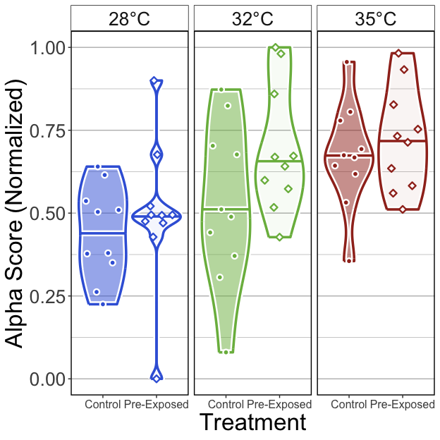<!-- -->

##### Tables

###### (hide)

Press on tabs to display tables. Scroll to see additional rows.

###### GLM

<table class="gt_table" data-quarto-disable-processing="false" data-quarto-bootstrap="false">
  <thead>
    <tr class="gt_heading">
      <td colspan="6" class="gt_heading gt_title gt_font_normal" style>GLM Results</td>
    </tr>
    <tr class="gt_heading">
      <td colspan="6" class="gt_heading gt_subtitle gt_font_normal gt_bottom_border" style>glm(Alpha.Score ~ Temperature*Treatment); Pre-Exposed fish</td>
    </tr>
    <tr class="gt_col_headings">
      <th class="gt_col_heading gt_columns_bottom_border gt_left" rowspan="1" colspan="1" scope="col" id="term">term</th>
      <th class="gt_col_heading gt_columns_bottom_border gt_right" rowspan="1" colspan="1" scope="col" id="estimate">estimate</th>
      <th class="gt_col_heading gt_columns_bottom_border gt_right" rowspan="1" colspan="1" scope="col" id="std.error">std.error</th>
      <th class="gt_col_heading gt_columns_bottom_border gt_right" rowspan="1" colspan="1" scope="col" id="statistic">statistic</th>
      <th class="gt_col_heading gt_columns_bottom_border gt_right" rowspan="1" colspan="1" scope="col" id="p.value">p.value</th>
      <th class="gt_col_heading gt_columns_bottom_border gt_left" rowspan="1" colspan="1" scope="col" id="p.adj.sig">p.adj.sig</th>
    </tr>
  </thead>
  <tbody class="gt_table_body">
    <tr class="gt_group_heading_row">
      <th colspan="6" class="gt_group_heading" scope="colgroup" id="Shannon">Shannon</th>
    </tr>
    <tr class="gt_row_group_first"><td headers="Shannon  term" class="gt_row gt_left">(Intercept)</td>
<td headers="Shannon  estimate" class="gt_row gt_right">−0.218</td>
<td headers="Shannon  std.error" class="gt_row gt_right">0.269</td>
<td headers="Shannon  statistic" class="gt_row gt_right">−0.811</td>
<td headers="Shannon  p.value" class="gt_row gt_right">≥0.25</td>
<td headers="Shannon  p.adj.sig" class="gt_row gt_left">ns</td></tr>
    <tr><td headers="Shannon  term" class="gt_row gt_left">Temperature32</td>
<td headers="Shannon  estimate" class="gt_row gt_right">0.345</td>
<td headers="Shannon  std.error" class="gt_row gt_right">0.379</td>
<td headers="Shannon  statistic" class="gt_row gt_right">0.910</td>
<td headers="Shannon  p.value" class="gt_row gt_right">≥0.25</td>
<td headers="Shannon  p.adj.sig" class="gt_row gt_left">ns</td></tr>
    <tr><td headers="Shannon  term" class="gt_row gt_left">Temperature35</td>
<td headers="Shannon  estimate" class="gt_row gt_right">0.693</td>
<td headers="Shannon  std.error" class="gt_row gt_right">0.384</td>
<td headers="Shannon  statistic" class="gt_row gt_right">1.803</td>
<td headers="Shannon  p.value" class="gt_row gt_right">0.077</td>
<td headers="Shannon  p.adj.sig" class="gt_row gt_left">ns</td></tr>
    <tr><td headers="Shannon  term" class="gt_row gt_left">TreatmentExposed</td>
<td headers="Shannon  estimate" class="gt_row gt_right">0.274</td>
<td headers="Shannon  std.error" class="gt_row gt_right">0.379</td>
<td headers="Shannon  statistic" class="gt_row gt_right">0.723</td>
<td headers="Shannon  p.value" class="gt_row gt_right">≥0.25</td>
<td headers="Shannon  p.adj.sig" class="gt_row gt_left">ns</td></tr>
    <tr><td headers="Shannon  term" class="gt_row gt_left">Temperature32:TreatmentExposed</td>
<td headers="Shannon  estimate" class="gt_row gt_right">0.311</td>
<td headers="Shannon  std.error" class="gt_row gt_right">0.544</td>
<td headers="Shannon  statistic" class="gt_row gt_right">0.572</td>
<td headers="Shannon  p.value" class="gt_row gt_right">≥0.25</td>
<td headers="Shannon  p.adj.sig" class="gt_row gt_left">ns</td></tr>
    <tr><td headers="Shannon  term" class="gt_row gt_left">Temperature35:TreatmentExposed</td>
<td headers="Shannon  estimate" class="gt_row gt_right">0.041</td>
<td headers="Shannon  std.error" class="gt_row gt_right">0.550</td>
<td headers="Shannon  statistic" class="gt_row gt_right">0.075</td>
<td headers="Shannon  p.value" class="gt_row gt_right">≥0.25</td>
<td headers="Shannon  p.adj.sig" class="gt_row gt_left">ns</td></tr>
    <tr class="gt_group_heading_row">
      <th colspan="6" class="gt_group_heading" scope="colgroup" id="Simpson">Simpson</th>
    </tr>
    <tr class="gt_row_group_first"><td headers="Simpson  term" class="gt_row gt_left">(Intercept)</td>
<td headers="Simpson  estimate" class="gt_row gt_right">−0.241</td>
<td headers="Simpson  std.error" class="gt_row gt_right">0.252</td>
<td headers="Simpson  statistic" class="gt_row gt_right">−0.958</td>
<td headers="Simpson  p.value" class="gt_row gt_right">≥0.25</td>
<td headers="Simpson  p.adj.sig" class="gt_row gt_left">ns</td></tr>
    <tr><td headers="Simpson  term" class="gt_row gt_left">Temperature32</td>
<td headers="Simpson  estimate" class="gt_row gt_right">0.352</td>
<td headers="Simpson  std.error" class="gt_row gt_right">0.355</td>
<td headers="Simpson  statistic" class="gt_row gt_right">0.990</td>
<td headers="Simpson  p.value" class="gt_row gt_right">≥0.25</td>
<td headers="Simpson  p.adj.sig" class="gt_row gt_left">ns</td></tr>
    <tr><td headers="Simpson  term" class="gt_row gt_left">Temperature35</td>
<td headers="Simpson  estimate" class="gt_row gt_right">0.961</td>
<td headers="Simpson  std.error" class="gt_row gt_right">0.367</td>
<td headers="Simpson  statistic" class="gt_row gt_right">2.619</td>
<td headers="Simpson  p.value" class="gt_row gt_right">0.011</td>
<td headers="Simpson  p.adj.sig" class="gt_row gt_left">*</td></tr>
    <tr><td headers="Simpson  term" class="gt_row gt_left">TreatmentExposed</td>
<td headers="Simpson  estimate" class="gt_row gt_right">0.223</td>
<td headers="Simpson  std.error" class="gt_row gt_right">0.355</td>
<td headers="Simpson  statistic" class="gt_row gt_right">0.627</td>
<td headers="Simpson  p.value" class="gt_row gt_right">≥0.25</td>
<td headers="Simpson  p.adj.sig" class="gt_row gt_left">ns</td></tr>
    <tr><td headers="Simpson  term" class="gt_row gt_left">Temperature32:TreatmentExposed</td>
<td headers="Simpson  estimate" class="gt_row gt_right">0.486</td>
<td headers="Simpson  std.error" class="gt_row gt_right">0.513</td>
<td headers="Simpson  statistic" class="gt_row gt_right">0.948</td>
<td headers="Simpson  p.value" class="gt_row gt_right">≥0.25</td>
<td headers="Simpson  p.adj.sig" class="gt_row gt_left">ns</td></tr>
    <tr><td headers="Simpson  term" class="gt_row gt_left">Temperature35:TreatmentExposed</td>
<td headers="Simpson  estimate" class="gt_row gt_right">0.017</td>
<td headers="Simpson  std.error" class="gt_row gt_right">0.525</td>
<td headers="Simpson  statistic" class="gt_row gt_right">0.033</td>
<td headers="Simpson  p.value" class="gt_row gt_right">≥0.25</td>
<td headers="Simpson  p.adj.sig" class="gt_row gt_left">ns</td></tr>
    <tr class="gt_group_heading_row">
      <th colspan="6" class="gt_group_heading" scope="colgroup" id="Richness">Richness</th>
    </tr>
    <tr class="gt_row_group_first"><td headers="Richness  term" class="gt_row gt_left">(Intercept)</td>
<td headers="Richness  estimate" class="gt_row gt_right">−0.145</td>
<td headers="Richness  std.error" class="gt_row gt_right">0.270</td>
<td headers="Richness  statistic" class="gt_row gt_right">−0.538</td>
<td headers="Richness  p.value" class="gt_row gt_right">≥0.25</td>
<td headers="Richness  p.adj.sig" class="gt_row gt_left">ns</td></tr>
    <tr><td headers="Richness  term" class="gt_row gt_left">Temperature32</td>
<td headers="Richness  estimate" class="gt_row gt_right">0.550</td>
<td headers="Richness  std.error" class="gt_row gt_right">0.385</td>
<td headers="Richness  statistic" class="gt_row gt_right">1.430</td>
<td headers="Richness  p.value" class="gt_row gt_right">0.158</td>
<td headers="Richness  p.adj.sig" class="gt_row gt_left">ns</td></tr>
    <tr><td headers="Richness  term" class="gt_row gt_left">Temperature35</td>
<td headers="Richness  estimate" class="gt_row gt_right">0.043</td>
<td headers="Richness  std.error" class="gt_row gt_right">0.381</td>
<td headers="Richness  statistic" class="gt_row gt_right">0.112</td>
<td headers="Richness  p.value" class="gt_row gt_right">≥0.25</td>
<td headers="Richness  p.adj.sig" class="gt_row gt_left">ns</td></tr>
    <tr><td headers="Richness  term" class="gt_row gt_left">TreatmentExposed</td>
<td headers="Richness  estimate" class="gt_row gt_right">0.402</td>
<td headers="Richness  std.error" class="gt_row gt_right">0.382</td>
<td headers="Richness  statistic" class="gt_row gt_right">1.050</td>
<td headers="Richness  p.value" class="gt_row gt_right">≥0.25</td>
<td headers="Richness  p.adj.sig" class="gt_row gt_left">ns</td></tr>
    <tr><td headers="Richness  term" class="gt_row gt_left">Temperature32:TreatmentExposed</td>
<td headers="Richness  estimate" class="gt_row gt_right">0.020</td>
<td headers="Richness  std.error" class="gt_row gt_right">0.554</td>
<td headers="Richness  statistic" class="gt_row gt_right">0.036</td>
<td headers="Richness  p.value" class="gt_row gt_right">≥0.25</td>
<td headers="Richness  p.adj.sig" class="gt_row gt_left">ns</td></tr>
    <tr><td headers="Richness  term" class="gt_row gt_left">Temperature35:TreatmentExposed</td>
<td headers="Richness  estimate" class="gt_row gt_right">0.287</td>
<td headers="Richness  std.error" class="gt_row gt_right">0.545</td>
<td headers="Richness  statistic" class="gt_row gt_right">0.526</td>
<td headers="Richness  p.value" class="gt_row gt_right">≥0.25</td>
<td headers="Richness  p.adj.sig" class="gt_row gt_left">ns</td></tr>
  </tbody>
  &#10;  
</table>

###### ANOVA

<table class="gt_table" data-quarto-disable-processing="false" data-quarto-bootstrap="false">
  <thead>
    <tr class="gt_heading">
      <td colspan="5" class="gt_heading gt_title gt_font_normal" style>ANOVA of GLM</td>
    </tr>
    <tr class="gt_heading">
      <td colspan="5" class="gt_heading gt_subtitle gt_font_normal gt_bottom_border" style>ANOVA(GLM(Alpha.Score ~ Temperature*Treatment), type = 2); Pre-Exposed fish</td>
    </tr>
    <tr class="gt_col_headings">
      <th class="gt_col_heading gt_columns_bottom_border gt_left" rowspan="1" colspan="1" scope="col" id="term">term</th>
      <th class="gt_col_heading gt_columns_bottom_border gt_right" rowspan="1" colspan="1" scope="col" id="statistic">statistic</th>
      <th class="gt_col_heading gt_columns_bottom_border gt_right" rowspan="1" colspan="1" scope="col" id="df">df</th>
      <th class="gt_col_heading gt_columns_bottom_border gt_right" rowspan="1" colspan="1" scope="col" id="p.value">p.value</th>
      <th class="gt_col_heading gt_columns_bottom_border gt_left" rowspan="1" colspan="1" scope="col" id="sig">sig</th>
    </tr>
  </thead>
  <tbody class="gt_table_body">
    <tr class="gt_group_heading_row">
      <th colspan="5" class="gt_group_heading" scope="colgroup" id="Shannon">Shannon</th>
    </tr>
    <tr class="gt_row_group_first"><td headers="Shannon  term" class="gt_row gt_left">Temperature</td>
<td headers="Shannon  statistic" class="gt_row gt_right">7.264</td>
<td headers="Shannon  df" class="gt_row gt_right">2.000</td>
<td headers="Shannon  p.value" class="gt_row gt_right">0.026</td>
<td headers="Shannon  sig" class="gt_row gt_left">*</td></tr>
    <tr><td headers="Shannon  term" class="gt_row gt_left">Treatment</td>
<td headers="Shannon  statistic" class="gt_row gt_right">3.044</td>
<td headers="Shannon  df" class="gt_row gt_right">1.000</td>
<td headers="Shannon  p.value" class="gt_row gt_right">0.081</td>
<td headers="Shannon  sig" class="gt_row gt_left">ns</td></tr>
    <tr><td headers="Shannon  term" class="gt_row gt_left">Temperature:Treatment</td>
<td headers="Shannon  statistic" class="gt_row gt_right">0.380</td>
<td headers="Shannon  df" class="gt_row gt_right">2.000</td>
<td headers="Shannon  p.value" class="gt_row gt_right">≥0.25</td>
<td headers="Shannon  sig" class="gt_row gt_left">ns</td></tr>
    <tr class="gt_group_heading_row">
      <th colspan="5" class="gt_group_heading" scope="colgroup" id="Simpson">Simpson</th>
    </tr>
    <tr class="gt_row_group_first"><td headers="Simpson  term" class="gt_row gt_left">Temperature</td>
<td headers="Simpson  statistic" class="gt_row gt_right">14.462</td>
<td headers="Simpson  df" class="gt_row gt_right">2.000</td>
<td headers="Simpson  p.value" class="gt_row gt_right">&lt;0.001</td>
<td headers="Simpson  sig" class="gt_row gt_left">***</td></tr>
    <tr><td headers="Simpson  term" class="gt_row gt_left">Treatment</td>
<td headers="Simpson  statistic" class="gt_row gt_right">3.406</td>
<td headers="Simpson  df" class="gt_row gt_right">1.000</td>
<td headers="Simpson  p.value" class="gt_row gt_right">0.065</td>
<td headers="Simpson  sig" class="gt_row gt_left">ns</td></tr>
    <tr><td headers="Simpson  term" class="gt_row gt_left">Temperature:Treatment</td>
<td headers="Simpson  statistic" class="gt_row gt_right">1.122</td>
<td headers="Simpson  df" class="gt_row gt_right">2.000</td>
<td headers="Simpson  p.value" class="gt_row gt_right">≥0.25</td>
<td headers="Simpson  sig" class="gt_row gt_left">ns</td></tr>
    <tr class="gt_group_heading_row">
      <th colspan="5" class="gt_group_heading" scope="colgroup" id="Richness">Richness</th>
    </tr>
    <tr class="gt_row_group_first"><td headers="Richness  term" class="gt_row gt_left">Temperature</td>
<td headers="Richness  statistic" class="gt_row gt_right">4.311</td>
<td headers="Richness  df" class="gt_row gt_right">2.000</td>
<td headers="Richness  p.value" class="gt_row gt_right">0.116</td>
<td headers="Richness  sig" class="gt_row gt_left">ns</td></tr>
    <tr><td headers="Richness  term" class="gt_row gt_left">Treatment</td>
<td headers="Richness  statistic" class="gt_row gt_right">5.067</td>
<td headers="Richness  df" class="gt_row gt_right">1.000</td>
<td headers="Richness  p.value" class="gt_row gt_right">0.024</td>
<td headers="Richness  sig" class="gt_row gt_left">*</td></tr>
    <tr><td headers="Richness  term" class="gt_row gt_left">Temperature:Treatment</td>
<td headers="Richness  statistic" class="gt_row gt_right">0.340</td>
<td headers="Richness  df" class="gt_row gt_right">2.000</td>
<td headers="Richness  p.value" class="gt_row gt_right">≥0.25</td>
<td headers="Richness  sig" class="gt_row gt_left">ns</td></tr>
  </tbody>
  &#10;  
</table>

###### Tukey

<table class="gt_table" data-quarto-disable-processing="false" data-quarto-bootstrap="false">
  <thead>
    <tr class="gt_heading">
      <td colspan="11" class="gt_heading gt_title gt_font_normal" style>Pairwise Tukey's HSD, p.adj: Dunnett</td>
    </tr>
    <tr class="gt_heading">
      <td colspan="11" class="gt_heading gt_subtitle gt_font_normal gt_bottom_border" style>Tukey(Alpha.Score ~ Temperature*Treatment); Pre-Exposed fish</td>
    </tr>
    <tr class="gt_col_headings">
      <th class="gt_col_heading gt_columns_bottom_border gt_center" rowspan="1" colspan="1" scope="col" id="Temperature">Temperature</th>
      <th class="gt_col_heading gt_columns_bottom_border gt_left" rowspan="1" colspan="1" scope="col" id=".y.">.y.</th>
      <th class="gt_col_heading gt_columns_bottom_border gt_left" rowspan="1" colspan="1" scope="col" id="term">term</th>
      <th class="gt_col_heading gt_columns_bottom_border gt_left" rowspan="1" colspan="1" scope="col" id="group1">group1</th>
      <th class="gt_col_heading gt_columns_bottom_border gt_left" rowspan="1" colspan="1" scope="col" id="group2">group2</th>
      <th class="gt_col_heading gt_columns_bottom_border gt_right" rowspan="1" colspan="1" scope="col" id="estimate">estimate</th>
      <th class="gt_col_heading gt_columns_bottom_border gt_right" rowspan="1" colspan="1" scope="col" id="std.error">std.error</th>
      <th class="gt_col_heading gt_columns_bottom_border gt_right" rowspan="1" colspan="1" scope="col" id="statistic">statistic</th>
      <th class="gt_col_heading gt_columns_bottom_border gt_right" rowspan="1" colspan="1" scope="col" id="adj.p.value">adj.p.value</th>
      <th class="gt_col_heading gt_columns_bottom_border gt_left" rowspan="1" colspan="1" scope="col" id="Variable">Variable</th>
      <th class="gt_col_heading gt_columns_bottom_border gt_center" rowspan="1" colspan="1" scope="col" id="Group">Group</th>
    </tr>
  </thead>
  <tbody class="gt_table_body">
    <tr class="gt_group_heading_row">
      <th colspan="11" class="gt_group_heading" scope="colgroup" id="Shannon">Shannon</th>
    </tr>
    <tr class="gt_row_group_first"><td headers="Shannon  Temperature" class="gt_row gt_center">28</td>
<td headers="Shannon  .y." class="gt_row gt_left">Alpha.Score</td>
<td headers="Shannon  term" class="gt_row gt_left">Treatment</td>
<td headers="Shannon  group1" class="gt_row gt_left">Exposed</td>
<td headers="Shannon  group2" class="gt_row gt_left">Control</td>
<td headers="Shannon  estimate" class="gt_row gt_right">0.274</td>
<td headers="Shannon  std.error" class="gt_row gt_right">0.364</td>
<td headers="Shannon  statistic" class="gt_row gt_right">0.753</td>
<td headers="Shannon  adj.p.value" class="gt_row gt_right">≥0.25</td>
<td headers="Shannon  Variable" class="gt_row gt_left">Treatment</td>
<td headers="Shannon  Group" class="gt_row gt_center">28</td></tr>
    <tr><td headers="Shannon  Temperature" class="gt_row gt_center">32</td>
<td headers="Shannon  .y." class="gt_row gt_left">Alpha.Score</td>
<td headers="Shannon  term" class="gt_row gt_left">Treatment</td>
<td headers="Shannon  group1" class="gt_row gt_left">Exposed</td>
<td headers="Shannon  group2" class="gt_row gt_left">Control</td>
<td headers="Shannon  estimate" class="gt_row gt_right">0.585</td>
<td headers="Shannon  std.error" class="gt_row gt_right">0.451</td>
<td headers="Shannon  statistic" class="gt_row gt_right">1.298</td>
<td headers="Shannon  adj.p.value" class="gt_row gt_right">0.194</td>
<td headers="Shannon  Variable" class="gt_row gt_left">Treatment</td>
<td headers="Shannon  Group" class="gt_row gt_center">32</td></tr>
    <tr><td headers="Shannon  Temperature" class="gt_row gt_center">35</td>
<td headers="Shannon  .y." class="gt_row gt_left">Alpha.Score</td>
<td headers="Shannon  term" class="gt_row gt_left">Treatment</td>
<td headers="Shannon  group1" class="gt_row gt_left">Exposed</td>
<td headers="Shannon  group2" class="gt_row gt_left">Control</td>
<td headers="Shannon  estimate" class="gt_row gt_right">0.315</td>
<td headers="Shannon  std.error" class="gt_row gt_right">0.344</td>
<td headers="Shannon  statistic" class="gt_row gt_right">0.917</td>
<td headers="Shannon  adj.p.value" class="gt_row gt_right">≥0.25</td>
<td headers="Shannon  Variable" class="gt_row gt_left">Treatment</td>
<td headers="Shannon  Group" class="gt_row gt_center">35</td></tr>
    <tr class="gt_group_heading_row">
      <th colspan="11" class="gt_group_heading" scope="colgroup" id="Simpson">Simpson</th>
    </tr>
    <tr class="gt_row_group_first"><td headers="Simpson  Temperature" class="gt_row gt_center">28</td>
<td headers="Simpson  .y." class="gt_row gt_left">Alpha.Score</td>
<td headers="Simpson  term" class="gt_row gt_left">Treatment</td>
<td headers="Simpson  group1" class="gt_row gt_left">Exposed</td>
<td headers="Simpson  group2" class="gt_row gt_left">Control</td>
<td headers="Simpson  estimate" class="gt_row gt_right">0.223</td>
<td headers="Simpson  std.error" class="gt_row gt_right">0.337</td>
<td headers="Simpson  statistic" class="gt_row gt_right">0.662</td>
<td headers="Simpson  adj.p.value" class="gt_row gt_right">≥0.25</td>
<td headers="Simpson  Variable" class="gt_row gt_left">Treatment</td>
<td headers="Simpson  Group" class="gt_row gt_center">28</td></tr>
    <tr><td headers="Simpson  Temperature" class="gt_row gt_center">32</td>
<td headers="Simpson  .y." class="gt_row gt_left">Alpha.Score</td>
<td headers="Simpson  term" class="gt_row gt_left">Treatment</td>
<td headers="Simpson  group1" class="gt_row gt_left">Exposed</td>
<td headers="Simpson  group2" class="gt_row gt_left">Control</td>
<td headers="Simpson  estimate" class="gt_row gt_right">0.709</td>
<td headers="Simpson  std.error" class="gt_row gt_right">0.426</td>
<td headers="Simpson  statistic" class="gt_row gt_right">1.663</td>
<td headers="Simpson  adj.p.value" class="gt_row gt_right">0.096</td>
<td headers="Simpson  Variable" class="gt_row gt_left">Treatment</td>
<td headers="Simpson  Group" class="gt_row gt_center">32</td></tr>
    <tr><td headers="Simpson  Temperature" class="gt_row gt_center">35</td>
<td headers="Simpson  .y." class="gt_row gt_left">Alpha.Score</td>
<td headers="Simpson  term" class="gt_row gt_left">Treatment</td>
<td headers="Simpson  group1" class="gt_row gt_left">Exposed</td>
<td headers="Simpson  group2" class="gt_row gt_left">Control</td>
<td headers="Simpson  estimate" class="gt_row gt_right">0.240</td>
<td headers="Simpson  std.error" class="gt_row gt_right">0.339</td>
<td headers="Simpson  statistic" class="gt_row gt_right">0.708</td>
<td headers="Simpson  adj.p.value" class="gt_row gt_right">≥0.25</td>
<td headers="Simpson  Variable" class="gt_row gt_left">Treatment</td>
<td headers="Simpson  Group" class="gt_row gt_center">35</td></tr>
    <tr class="gt_group_heading_row">
      <th colspan="11" class="gt_group_heading" scope="colgroup" id="Richness">Richness</th>
    </tr>
    <tr class="gt_row_group_first"><td headers="Richness  Temperature" class="gt_row gt_center">28</td>
<td headers="Richness  .y." class="gt_row gt_left">Alpha.Score</td>
<td headers="Richness  term" class="gt_row gt_left">Treatment</td>
<td headers="Richness  group1" class="gt_row gt_left">Exposed</td>
<td headers="Richness  group2" class="gt_row gt_left">Control</td>
<td headers="Richness  estimate" class="gt_row gt_right">0.402</td>
<td headers="Richness  std.error" class="gt_row gt_right">0.361</td>
<td headers="Richness  statistic" class="gt_row gt_right">1.112</td>
<td headers="Richness  adj.p.value" class="gt_row gt_right">≥0.25</td>
<td headers="Richness  Variable" class="gt_row gt_left">Treatment</td>
<td headers="Richness  Group" class="gt_row gt_center">28</td></tr>
    <tr><td headers="Richness  Temperature" class="gt_row gt_center">32</td>
<td headers="Richness  .y." class="gt_row gt_left">Alpha.Score</td>
<td headers="Richness  term" class="gt_row gt_left">Treatment</td>
<td headers="Richness  group1" class="gt_row gt_left">Exposed</td>
<td headers="Richness  group2" class="gt_row gt_left">Control</td>
<td headers="Richness  estimate" class="gt_row gt_right">0.422</td>
<td headers="Richness  std.error" class="gt_row gt_right">0.411</td>
<td headers="Richness  statistic" class="gt_row gt_right">1.027</td>
<td headers="Richness  adj.p.value" class="gt_row gt_right">≥0.25</td>
<td headers="Richness  Variable" class="gt_row gt_left">Treatment</td>
<td headers="Richness  Group" class="gt_row gt_center">32</td></tr>
    <tr><td headers="Richness  Temperature" class="gt_row gt_center">35</td>
<td headers="Richness  .y." class="gt_row gt_left">Alpha.Score</td>
<td headers="Richness  term" class="gt_row gt_left">Treatment</td>
<td headers="Richness  group1" class="gt_row gt_left">Exposed</td>
<td headers="Richness  group2" class="gt_row gt_left">Control</td>
<td headers="Richness  estimate" class="gt_row gt_right">0.689</td>
<td headers="Richness  std.error" class="gt_row gt_right">0.400</td>
<td headers="Richness  statistic" class="gt_row gt_right">1.721</td>
<td headers="Richness  adj.p.value" class="gt_row gt_right">0.085</td>
<td headers="Richness  Variable" class="gt_row gt_left">Treatment</td>
<td headers="Richness  Group" class="gt_row gt_center">35</td></tr>
  </tbody>
  &#10;  
</table>

#### 5B)

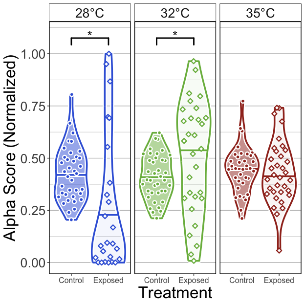<!-- -->

##### Tables

###### (hide)

Press on tabs to display tables. Scroll to see additional rows.

###### GLM

<table class="gt_table" data-quarto-disable-processing="false" data-quarto-bootstrap="false">
  <thead>
    <tr class="gt_heading">
      <td colspan="6" class="gt_heading gt_title gt_font_normal" style>GLM Results</td>
    </tr>
    <tr class="gt_heading">
      <td colspan="6" class="gt_heading gt_subtitle gt_font_normal gt_bottom_border" style>glm(Alpha.Score ~ Temperature*Treatment); Post-Exposed fish</td>
    </tr>
    <tr class="gt_col_headings">
      <th class="gt_col_heading gt_columns_bottom_border gt_left" rowspan="1" colspan="1" scope="col" id="term">term</th>
      <th class="gt_col_heading gt_columns_bottom_border gt_right" rowspan="1" colspan="1" scope="col" id="estimate">estimate</th>
      <th class="gt_col_heading gt_columns_bottom_border gt_right" rowspan="1" colspan="1" scope="col" id="std.error">std.error</th>
      <th class="gt_col_heading gt_columns_bottom_border gt_right" rowspan="1" colspan="1" scope="col" id="statistic">statistic</th>
      <th class="gt_col_heading gt_columns_bottom_border gt_right" rowspan="1" colspan="1" scope="col" id="p.value">p.value</th>
      <th class="gt_col_heading gt_columns_bottom_border gt_left" rowspan="1" colspan="1" scope="col" id="p.adj.sig">p.adj.sig</th>
    </tr>
  </thead>
  <tbody class="gt_table_body">
    <tr class="gt_group_heading_row">
      <th colspan="6" class="gt_group_heading" scope="colgroup" id="Shannon">Shannon</th>
    </tr>
    <tr class="gt_row_group_first"><td headers="Shannon  term" class="gt_row gt_left">(Intercept)</td>
<td headers="Shannon  estimate" class="gt_row gt_right">−0.441</td>
<td headers="Shannon  std.error" class="gt_row gt_right">0.126</td>
<td headers="Shannon  statistic" class="gt_row gt_right">−3.499</td>
<td headers="Shannon  p.value" class="gt_row gt_right">&lt;0.001</td>
<td headers="Shannon  p.adj.sig" class="gt_row gt_left">***</td></tr>
    <tr><td headers="Shannon  term" class="gt_row gt_left">Temperature32</td>
<td headers="Shannon  estimate" class="gt_row gt_right">−0.064</td>
<td headers="Shannon  std.error" class="gt_row gt_right">0.177</td>
<td headers="Shannon  statistic" class="gt_row gt_right">−0.364</td>
<td headers="Shannon  p.value" class="gt_row gt_right">≥0.25</td>
<td headers="Shannon  p.adj.sig" class="gt_row gt_left">ns</td></tr>
    <tr><td headers="Shannon  term" class="gt_row gt_left">Temperature35</td>
<td headers="Shannon  estimate" class="gt_row gt_right">−0.087</td>
<td headers="Shannon  std.error" class="gt_row gt_right">0.182</td>
<td headers="Shannon  statistic" class="gt_row gt_right">−0.476</td>
<td headers="Shannon  p.value" class="gt_row gt_right">≥0.25</td>
<td headers="Shannon  p.adj.sig" class="gt_row gt_left">ns</td></tr>
    <tr><td headers="Shannon  term" class="gt_row gt_left">TreatmentExposed</td>
<td headers="Shannon  estimate" class="gt_row gt_right">−0.539</td>
<td headers="Shannon  std.error" class="gt_row gt_right">0.210</td>
<td headers="Shannon  statistic" class="gt_row gt_right">−2.562</td>
<td headers="Shannon  p.value" class="gt_row gt_right">0.011</td>
<td headers="Shannon  p.adj.sig" class="gt_row gt_left">*</td></tr>
    <tr><td headers="Shannon  term" class="gt_row gt_left">Temperature32:TreatmentExposed</td>
<td headers="Shannon  estimate" class="gt_row gt_right">0.953</td>
<td headers="Shannon  std.error" class="gt_row gt_right">0.280</td>
<td headers="Shannon  statistic" class="gt_row gt_right">3.405</td>
<td headers="Shannon  p.value" class="gt_row gt_right">&lt;0.001</td>
<td headers="Shannon  p.adj.sig" class="gt_row gt_left">***</td></tr>
    <tr><td headers="Shannon  term" class="gt_row gt_left">Temperature35:TreatmentExposed</td>
<td headers="Shannon  estimate" class="gt_row gt_right">0.561</td>
<td headers="Shannon  std.error" class="gt_row gt_right">0.281</td>
<td headers="Shannon  statistic" class="gt_row gt_right">1.996</td>
<td headers="Shannon  p.value" class="gt_row gt_right">0.047</td>
<td headers="Shannon  p.adj.sig" class="gt_row gt_left">*</td></tr>
    <tr class="gt_group_heading_row">
      <th colspan="6" class="gt_group_heading" scope="colgroup" id="Simpson">Simpson</th>
    </tr>
    <tr class="gt_row_group_first"><td headers="Simpson  term" class="gt_row gt_left">(Intercept)</td>
<td headers="Simpson  estimate" class="gt_row gt_right">−0.299</td>
<td headers="Simpson  std.error" class="gt_row gt_right">0.133</td>
<td headers="Simpson  statistic" class="gt_row gt_right">−2.252</td>
<td headers="Simpson  p.value" class="gt_row gt_right">0.025</td>
<td headers="Simpson  p.adj.sig" class="gt_row gt_left">*</td></tr>
    <tr><td headers="Simpson  term" class="gt_row gt_left">Temperature32</td>
<td headers="Simpson  estimate" class="gt_row gt_right">−0.059</td>
<td headers="Simpson  std.error" class="gt_row gt_right">0.186</td>
<td headers="Simpson  statistic" class="gt_row gt_right">−0.319</td>
<td headers="Simpson  p.value" class="gt_row gt_right">≥0.25</td>
<td headers="Simpson  p.adj.sig" class="gt_row gt_left">ns</td></tr>
    <tr><td headers="Simpson  term" class="gt_row gt_left">Temperature35</td>
<td headers="Simpson  estimate" class="gt_row gt_right">0.080</td>
<td headers="Simpson  std.error" class="gt_row gt_right">0.190</td>
<td headers="Simpson  statistic" class="gt_row gt_right">0.419</td>
<td headers="Simpson  p.value" class="gt_row gt_right">≥0.25</td>
<td headers="Simpson  p.adj.sig" class="gt_row gt_left">ns</td></tr>
    <tr><td headers="Simpson  term" class="gt_row gt_left">TreatmentExposed</td>
<td headers="Simpson  estimate" class="gt_row gt_right">−0.724</td>
<td headers="Simpson  std.error" class="gt_row gt_right">0.225</td>
<td headers="Simpson  statistic" class="gt_row gt_right">−3.223</td>
<td headers="Simpson  p.value" class="gt_row gt_right">0.001</td>
<td headers="Simpson  p.adj.sig" class="gt_row gt_left">**</td></tr>
    <tr><td headers="Simpson  term" class="gt_row gt_left">Temperature32:TreatmentExposed</td>
<td headers="Simpson  estimate" class="gt_row gt_right">1.106</td>
<td headers="Simpson  std.error" class="gt_row gt_right">0.298</td>
<td headers="Simpson  statistic" class="gt_row gt_right">3.715</td>
<td headers="Simpson  p.value" class="gt_row gt_right">&lt;0.001</td>
<td headers="Simpson  p.adj.sig" class="gt_row gt_left">***</td></tr>
    <tr><td headers="Simpson  term" class="gt_row gt_left">Temperature35:TreatmentExposed</td>
<td headers="Simpson  estimate" class="gt_row gt_right">0.673</td>
<td headers="Simpson  std.error" class="gt_row gt_right">0.297</td>
<td headers="Simpson  statistic" class="gt_row gt_right">2.270</td>
<td headers="Simpson  p.value" class="gt_row gt_right">0.024</td>
<td headers="Simpson  p.adj.sig" class="gt_row gt_left">*</td></tr>
    <tr class="gt_group_heading_row">
      <th colspan="6" class="gt_group_heading" scope="colgroup" id="Richness">Richness</th>
    </tr>
    <tr class="gt_row_group_first"><td headers="Richness  term" class="gt_row gt_left">(Intercept)</td>
<td headers="Richness  estimate" class="gt_row gt_right">−0.206</td>
<td headers="Richness  std.error" class="gt_row gt_right">0.101</td>
<td headers="Richness  statistic" class="gt_row gt_right">−2.040</td>
<td headers="Richness  p.value" class="gt_row gt_right">0.043</td>
<td headers="Richness  p.adj.sig" class="gt_row gt_left">*</td></tr>
    <tr><td headers="Richness  term" class="gt_row gt_left">Temperature32</td>
<td headers="Richness  estimate" class="gt_row gt_right">−0.048</td>
<td headers="Richness  std.error" class="gt_row gt_right">0.141</td>
<td headers="Richness  statistic" class="gt_row gt_right">−0.343</td>
<td headers="Richness  p.value" class="gt_row gt_right">≥0.25</td>
<td headers="Richness  p.adj.sig" class="gt_row gt_left">ns</td></tr>
    <tr><td headers="Richness  term" class="gt_row gt_left">Temperature35</td>
<td headers="Richness  estimate" class="gt_row gt_right">−0.317</td>
<td headers="Richness  std.error" class="gt_row gt_right">0.147</td>
<td headers="Richness  statistic" class="gt_row gt_right">−2.164</td>
<td headers="Richness  p.value" class="gt_row gt_right">0.032</td>
<td headers="Richness  p.adj.sig" class="gt_row gt_left">*</td></tr>
    <tr><td headers="Richness  term" class="gt_row gt_left">TreatmentExposed</td>
<td headers="Richness  estimate" class="gt_row gt_right">−0.228</td>
<td headers="Richness  std.error" class="gt_row gt_right">0.160</td>
<td headers="Richness  statistic" class="gt_row gt_right">−1.421</td>
<td headers="Richness  p.value" class="gt_row gt_right">0.157</td>
<td headers="Richness  p.adj.sig" class="gt_row gt_left">ns</td></tr>
    <tr><td headers="Richness  term" class="gt_row gt_left">Temperature32:TreatmentExposed</td>
<td headers="Richness  estimate" class="gt_row gt_right">0.829</td>
<td headers="Richness  std.error" class="gt_row gt_right">0.219</td>
<td headers="Richness  statistic" class="gt_row gt_right">3.776</td>
<td headers="Richness  p.value" class="gt_row gt_right">&lt;0.001</td>
<td headers="Richness  p.adj.sig" class="gt_row gt_left">***</td></tr>
    <tr><td headers="Richness  term" class="gt_row gt_left">Temperature35:TreatmentExposed</td>
<td headers="Richness  estimate" class="gt_row gt_right">0.691</td>
<td headers="Richness  std.error" class="gt_row gt_right">0.219</td>
<td headers="Richness  statistic" class="gt_row gt_right">3.155</td>
<td headers="Richness  p.value" class="gt_row gt_right">0.002</td>
<td headers="Richness  p.adj.sig" class="gt_row gt_left">**</td></tr>
  </tbody>
  &#10;  
</table>

###### ANOVA

<table class="gt_table" data-quarto-disable-processing="false" data-quarto-bootstrap="false">
  <thead>
    <tr class="gt_heading">
      <td colspan="5" class="gt_heading gt_title gt_font_normal" style>ANOVA of GLM</td>
    </tr>
    <tr class="gt_heading">
      <td colspan="5" class="gt_heading gt_subtitle gt_font_normal gt_bottom_border" style>ANOVA(GLM(Alpha.Score ~ Temperature*Treatment), type = 2); Post-Exposed fish</td>
    </tr>
    <tr class="gt_col_headings">
      <th class="gt_col_heading gt_columns_bottom_border gt_left" rowspan="1" colspan="1" scope="col" id="term">term</th>
      <th class="gt_col_heading gt_columns_bottom_border gt_right" rowspan="1" colspan="1" scope="col" id="statistic">statistic</th>
      <th class="gt_col_heading gt_columns_bottom_border gt_right" rowspan="1" colspan="1" scope="col" id="df">df</th>
      <th class="gt_col_heading gt_columns_bottom_border gt_right" rowspan="1" colspan="1" scope="col" id="p.value">p.value</th>
      <th class="gt_col_heading gt_columns_bottom_border gt_left" rowspan="1" colspan="1" scope="col" id="sig">sig</th>
    </tr>
  </thead>
  <tbody class="gt_table_body">
    <tr class="gt_group_heading_row">
      <th colspan="5" class="gt_group_heading" scope="colgroup" id="Shannon">Shannon</th>
    </tr>
    <tr class="gt_row_group_first"><td headers="Shannon  term" class="gt_row gt_left">Temperature</td>
<td headers="Shannon  statistic" class="gt_row gt_right">5.908</td>
<td headers="Shannon  df" class="gt_row gt_right">2.000</td>
<td headers="Shannon  p.value" class="gt_row gt_right">0.052</td>
<td headers="Shannon  sig" class="gt_row gt_left">ns</td></tr>
    <tr><td headers="Shannon  term" class="gt_row gt_left">Treatment</td>
<td headers="Shannon  statistic" class="gt_row gt_right">0.001</td>
<td headers="Shannon  df" class="gt_row gt_right">1.000</td>
<td headers="Shannon  p.value" class="gt_row gt_right">≥0.25</td>
<td headers="Shannon  sig" class="gt_row gt_left">ns</td></tr>
    <tr><td headers="Shannon  term" class="gt_row gt_left">Temperature:Treatment</td>
<td headers="Shannon  statistic" class="gt_row gt_right">11.784</td>
<td headers="Shannon  df" class="gt_row gt_right">2.000</td>
<td headers="Shannon  p.value" class="gt_row gt_right">0.003</td>
<td headers="Shannon  sig" class="gt_row gt_left">**</td></tr>
    <tr class="gt_group_heading_row">
      <th colspan="5" class="gt_group_heading" scope="colgroup" id="Simpson">Simpson</th>
    </tr>
    <tr class="gt_row_group_first"><td headers="Simpson  term" class="gt_row gt_left">Temperature</td>
<td headers="Simpson  statistic" class="gt_row gt_right">8.400</td>
<td headers="Simpson  df" class="gt_row gt_right">2.000</td>
<td headers="Simpson  p.value" class="gt_row gt_right">0.015</td>
<td headers="Simpson  sig" class="gt_row gt_left">*</td></tr>
    <tr><td headers="Simpson  term" class="gt_row gt_left">Treatment</td>
<td headers="Simpson  statistic" class="gt_row gt_right">0.547</td>
<td headers="Simpson  df" class="gt_row gt_right">1.000</td>
<td headers="Simpson  p.value" class="gt_row gt_right">≥0.25</td>
<td headers="Simpson  sig" class="gt_row gt_left">ns</td></tr>
    <tr><td headers="Simpson  term" class="gt_row gt_left">Temperature:Treatment</td>
<td headers="Simpson  statistic" class="gt_row gt_right">14.128</td>
<td headers="Simpson  df" class="gt_row gt_right">2.000</td>
<td headers="Simpson  p.value" class="gt_row gt_right">&lt;0.001</td>
<td headers="Simpson  sig" class="gt_row gt_left">***</td></tr>
    <tr class="gt_group_heading_row">
      <th colspan="5" class="gt_group_heading" scope="colgroup" id="Richness">Richness</th>
    </tr>
    <tr class="gt_row_group_first"><td headers="Richness  term" class="gt_row gt_left">Temperature</td>
<td headers="Richness  statistic" class="gt_row gt_right">11.325</td>
<td headers="Richness  df" class="gt_row gt_right">2.000</td>
<td headers="Richness  p.value" class="gt_row gt_right">0.003</td>
<td headers="Richness  sig" class="gt_row gt_left">**</td></tr>
    <tr><td headers="Richness  term" class="gt_row gt_left">Treatment</td>
<td headers="Richness  statistic" class="gt_row gt_right">11.824</td>
<td headers="Richness  df" class="gt_row gt_right">1.000</td>
<td headers="Richness  p.value" class="gt_row gt_right">&lt;0.001</td>
<td headers="Richness  sig" class="gt_row gt_left">***</td></tr>
    <tr><td headers="Richness  term" class="gt_row gt_left">Temperature:Treatment</td>
<td headers="Richness  statistic" class="gt_row gt_right">16.178</td>
<td headers="Richness  df" class="gt_row gt_right">2.000</td>
<td headers="Richness  p.value" class="gt_row gt_right">&lt;0.001</td>
<td headers="Richness  sig" class="gt_row gt_left">***</td></tr>
  </tbody>
  &#10;  
</table>

###### Tukey

<table class="gt_table" data-quarto-disable-processing="false" data-quarto-bootstrap="false">
  <thead>
    <tr class="gt_heading">
      <td colspan="11" class="gt_heading gt_title gt_font_normal" style>Pairwise Tukey's HSD, p.adj: Dunnett</td>
    </tr>
    <tr class="gt_heading">
      <td colspan="11" class="gt_heading gt_subtitle gt_font_normal gt_bottom_border" style>Tukey(Alpha.Score ~ Temperature*Treatment); Post-Exposed fish</td>
    </tr>
    <tr class="gt_col_headings">
      <th class="gt_col_heading gt_columns_bottom_border gt_center" rowspan="1" colspan="1" scope="col" id="Temperature">Temperature</th>
      <th class="gt_col_heading gt_columns_bottom_border gt_left" rowspan="1" colspan="1" scope="col" id=".y.">.y.</th>
      <th class="gt_col_heading gt_columns_bottom_border gt_left" rowspan="1" colspan="1" scope="col" id="term">term</th>
      <th class="gt_col_heading gt_columns_bottom_border gt_left" rowspan="1" colspan="1" scope="col" id="group1">group1</th>
      <th class="gt_col_heading gt_columns_bottom_border gt_left" rowspan="1" colspan="1" scope="col" id="group2">group2</th>
      <th class="gt_col_heading gt_columns_bottom_border gt_right" rowspan="1" colspan="1" scope="col" id="estimate">estimate</th>
      <th class="gt_col_heading gt_columns_bottom_border gt_right" rowspan="1" colspan="1" scope="col" id="std.error">std.error</th>
      <th class="gt_col_heading gt_columns_bottom_border gt_right" rowspan="1" colspan="1" scope="col" id="statistic">statistic</th>
      <th class="gt_col_heading gt_columns_bottom_border gt_right" rowspan="1" colspan="1" scope="col" id="adj.p.value">adj.p.value</th>
      <th class="gt_col_heading gt_columns_bottom_border gt_left" rowspan="1" colspan="1" scope="col" id="Variable">Variable</th>
      <th class="gt_col_heading gt_columns_bottom_border gt_center" rowspan="1" colspan="1" scope="col" id="Group">Group</th>
    </tr>
  </thead>
  <tbody class="gt_table_body">
    <tr class="gt_group_heading_row">
      <th colspan="11" class="gt_group_heading" scope="colgroup" id="Shannon">Shannon</th>
    </tr>
    <tr class="gt_row_group_first"><td headers="Shannon  Temperature" class="gt_row gt_center">28</td>
<td headers="Shannon  .y." class="gt_row gt_left">Alpha.Score</td>
<td headers="Shannon  term" class="gt_row gt_left">Treatment</td>
<td headers="Shannon  group1" class="gt_row gt_left">Exposed</td>
<td headers="Shannon  group2" class="gt_row gt_left">Control</td>
<td headers="Shannon  estimate" class="gt_row gt_right">−0.539</td>
<td headers="Shannon  std.error" class="gt_row gt_right">0.280</td>
<td headers="Shannon  statistic" class="gt_row gt_right">−1.924</td>
<td headers="Shannon  adj.p.value" class="gt_row gt_right">0.054</td>
<td headers="Shannon  Variable" class="gt_row gt_left">Treatment</td>
<td headers="Shannon  Group" class="gt_row gt_center">28</td></tr>
    <tr><td headers="Shannon  Temperature" class="gt_row gt_center">32</td>
<td headers="Shannon  .y." class="gt_row gt_left">Alpha.Score</td>
<td headers="Shannon  term" class="gt_row gt_left">Treatment</td>
<td headers="Shannon  group1" class="gt_row gt_left">Exposed</td>
<td headers="Shannon  group2" class="gt_row gt_left">Control</td>
<td headers="Shannon  estimate" class="gt_row gt_right">0.414</td>
<td headers="Shannon  std.error" class="gt_row gt_right">0.180</td>
<td headers="Shannon  statistic" class="gt_row gt_right">2.298</td>
<td headers="Shannon  adj.p.value" class="gt_row gt_right">0.022</td>
<td headers="Shannon  Variable" class="gt_row gt_left">Treatment</td>
<td headers="Shannon  Group" class="gt_row gt_center">32</td></tr>
    <tr><td headers="Shannon  Temperature" class="gt_row gt_center">35</td>
<td headers="Shannon  .y." class="gt_row gt_left">Alpha.Score</td>
<td headers="Shannon  term" class="gt_row gt_left">Treatment</td>
<td headers="Shannon  group1" class="gt_row gt_left">Exposed</td>
<td headers="Shannon  group2" class="gt_row gt_left">Control</td>
<td headers="Shannon  estimate" class="gt_row gt_right">0.022</td>
<td headers="Shannon  std.error" class="gt_row gt_right">0.111</td>
<td headers="Shannon  statistic" class="gt_row gt_right">0.200</td>
<td headers="Shannon  adj.p.value" class="gt_row gt_right">≥0.25</td>
<td headers="Shannon  Variable" class="gt_row gt_left">Treatment</td>
<td headers="Shannon  Group" class="gt_row gt_center">35</td></tr>
    <tr class="gt_group_heading_row">
      <th colspan="11" class="gt_group_heading" scope="colgroup" id="Simpson">Simpson</th>
    </tr>
    <tr class="gt_row_group_first"><td headers="Simpson  Temperature" class="gt_row gt_center">28</td>
<td headers="Simpson  .y." class="gt_row gt_left">Alpha.Score</td>
<td headers="Simpson  term" class="gt_row gt_left">Treatment</td>
<td headers="Simpson  group1" class="gt_row gt_left">Exposed</td>
<td headers="Simpson  group2" class="gt_row gt_left">Control</td>
<td headers="Simpson  estimate" class="gt_row gt_right">−0.724</td>
<td headers="Simpson  std.error" class="gt_row gt_right">0.290</td>
<td headers="Simpson  statistic" class="gt_row gt_right">−2.492</td>
<td headers="Simpson  adj.p.value" class="gt_row gt_right">0.013</td>
<td headers="Simpson  Variable" class="gt_row gt_left">Treatment</td>
<td headers="Simpson  Group" class="gt_row gt_center">28</td></tr>
    <tr><td headers="Simpson  Temperature" class="gt_row gt_center">32</td>
<td headers="Simpson  .y." class="gt_row gt_left">Alpha.Score</td>
<td headers="Simpson  term" class="gt_row gt_left">Treatment</td>
<td headers="Simpson  group1" class="gt_row gt_left">Exposed</td>
<td headers="Simpson  group2" class="gt_row gt_left">Control</td>
<td headers="Simpson  estimate" class="gt_row gt_right">0.382</td>
<td headers="Simpson  std.error" class="gt_row gt_right">0.190</td>
<td headers="Simpson  statistic" class="gt_row gt_right">2.013</td>
<td headers="Simpson  adj.p.value" class="gt_row gt_right">0.044</td>
<td headers="Simpson  Variable" class="gt_row gt_left">Treatment</td>
<td headers="Simpson  Group" class="gt_row gt_center">32</td></tr>
    <tr><td headers="Simpson  Temperature" class="gt_row gt_center">35</td>
<td headers="Simpson  .y." class="gt_row gt_left">Alpha.Score</td>
<td headers="Simpson  term" class="gt_row gt_left">Treatment</td>
<td headers="Simpson  group1" class="gt_row gt_left">Exposed</td>
<td headers="Simpson  group2" class="gt_row gt_left">Control</td>
<td headers="Simpson  estimate" class="gt_row gt_right">−0.051</td>
<td headers="Simpson  std.error" class="gt_row gt_right">0.130</td>
<td headers="Simpson  statistic" class="gt_row gt_right">−0.387</td>
<td headers="Simpson  adj.p.value" class="gt_row gt_right">≥0.25</td>
<td headers="Simpson  Variable" class="gt_row gt_left">Treatment</td>
<td headers="Simpson  Group" class="gt_row gt_center">35</td></tr>
    <tr class="gt_group_heading_row">
      <th colspan="11" class="gt_group_heading" scope="colgroup" id="Richness">Richness</th>
    </tr>
    <tr class="gt_row_group_first"><td headers="Richness  Temperature" class="gt_row gt_center">28</td>
<td headers="Richness  .y." class="gt_row gt_left">Alpha.Score</td>
<td headers="Richness  term" class="gt_row gt_left">Treatment</td>
<td headers="Richness  group1" class="gt_row gt_left">Exposed</td>
<td headers="Richness  group2" class="gt_row gt_left">Control</td>
<td headers="Richness  estimate" class="gt_row gt_right">−0.228</td>
<td headers="Richness  std.error" class="gt_row gt_right">0.223</td>
<td headers="Richness  statistic" class="gt_row gt_right">−1.021</td>
<td headers="Richness  adj.p.value" class="gt_row gt_right">≥0.25</td>
<td headers="Richness  Variable" class="gt_row gt_left">Treatment</td>
<td headers="Richness  Group" class="gt_row gt_center">28</td></tr>
    <tr><td headers="Richness  Temperature" class="gt_row gt_center">32</td>
<td headers="Richness  .y." class="gt_row gt_left">Alpha.Score</td>
<td headers="Richness  term" class="gt_row gt_left">Treatment</td>
<td headers="Richness  group1" class="gt_row gt_left">Exposed</td>
<td headers="Richness  group2" class="gt_row gt_left">Control</td>
<td headers="Richness  estimate" class="gt_row gt_right">0.601</td>
<td headers="Richness  std.error" class="gt_row gt_right">0.132</td>
<td headers="Richness  statistic" class="gt_row gt_right">4.546</td>
<td headers="Richness  adj.p.value" class="gt_row gt_right">&lt;0.001</td>
<td headers="Richness  Variable" class="gt_row gt_left">Treatment</td>
<td headers="Richness  Group" class="gt_row gt_center">32</td></tr>
    <tr><td headers="Richness  Temperature" class="gt_row gt_center">35</td>
<td headers="Richness  .y." class="gt_row gt_left">Alpha.Score</td>
<td headers="Richness  term" class="gt_row gt_left">Treatment</td>
<td headers="Richness  group1" class="gt_row gt_left">Exposed</td>
<td headers="Richness  group2" class="gt_row gt_left">Control</td>
<td headers="Richness  estimate" class="gt_row gt_right">0.463</td>
<td headers="Richness  std.error" class="gt_row gt_right">0.092</td>
<td headers="Richness  statistic" class="gt_row gt_right">5.021</td>
<td headers="Richness  adj.p.value" class="gt_row gt_right">&lt;0.001</td>
<td headers="Richness  Variable" class="gt_row gt_left">Treatment</td>
<td headers="Richness  Group" class="gt_row gt_center">35</td></tr>
  </tbody>
  &#10;  
</table>

#### 5C)

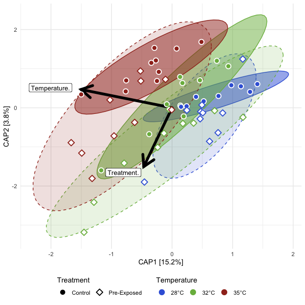<!-- -->

##### Tables

###### (hide)

Press on tabs to display tables. Scroll to see additional rows.

###### Capscale

<table class="gt_table" data-quarto-disable-processing="false" data-quarto-bootstrap="false">
  <thead>
    <tr class="gt_heading">
      <td colspan="7" class="gt_heading gt_title gt_font_normal" style>ADONIS2</td>
    </tr>
    <tr class="gt_heading">
      <td colspan="7" class="gt_heading gt_subtitle gt_font_normal gt_bottom_border" style>adonis2(Beta Distance ~ Temperature*Treatment); Pre-Exposed fish</td>
    </tr>
    <tr class="gt_col_headings">
      <th class="gt_col_heading gt_columns_bottom_border gt_left" rowspan="1" colspan="1" scope="col" id="term">term</th>
      <th class="gt_col_heading gt_columns_bottom_border gt_right" rowspan="1" colspan="1" scope="col" id="df">df</th>
      <th class="gt_col_heading gt_columns_bottom_border gt_right" rowspan="1" colspan="1" scope="col" id="SumOfSqs">SumOfSqs</th>
      <th class="gt_col_heading gt_columns_bottom_border gt_right" rowspan="1" colspan="1" scope="col" id="R2">R2</th>
      <th class="gt_col_heading gt_columns_bottom_border gt_right" rowspan="1" colspan="1" scope="col" id="statistic">statistic</th>
      <th class="gt_col_heading gt_columns_bottom_border gt_right" rowspan="1" colspan="1" scope="col" id="p.value">p.value</th>
      <th class="gt_col_heading gt_columns_bottom_border gt_left" rowspan="1" colspan="1" scope="col" id="sig">sig</th>
    </tr>
  </thead>
  <tbody class="gt_table_body">
    <tr class="gt_group_heading_row">
      <th colspan="7" class="gt_group_heading" scope="colgroup" id="bray">bray</th>
    </tr>
    <tr class="gt_row_group_first"><td headers="bray  term" class="gt_row gt_left">Temperature</td>
<td headers="bray  df" class="gt_row gt_right">2.000</td>
<td headers="bray  SumOfSqs" class="gt_row gt_right">0.871</td>
<td headers="bray  R2" class="gt_row gt_right">0.188</td>
<td headers="bray  statistic" class="gt_row gt_right">7.178</td>
<td headers="bray  p.value" class="gt_row gt_right">0.001</td>
<td headers="bray  sig" class="gt_row gt_left">***</td></tr>
    <tr><td headers="bray  term" class="gt_row gt_left">Treatment</td>
<td headers="bray  df" class="gt_row gt_right">1.000</td>
<td headers="bray  SumOfSqs" class="gt_row gt_right">0.244</td>
<td headers="bray  R2" class="gt_row gt_right">0.053</td>
<td headers="bray  statistic" class="gt_row gt_right">4.025</td>
<td headers="bray  p.value" class="gt_row gt_right">0.010</td>
<td headers="bray  sig" class="gt_row gt_left">**</td></tr>
    <tr><td headers="bray  term" class="gt_row gt_left">Temperature:Treatment</td>
<td headers="bray  df" class="gt_row gt_right">2.000</td>
<td headers="bray  SumOfSqs" class="gt_row gt_right">0.245</td>
<td headers="bray  R2" class="gt_row gt_right">0.053</td>
<td headers="bray  statistic" class="gt_row gt_right">2.019</td>
<td headers="bray  p.value" class="gt_row gt_right">0.053</td>
<td headers="bray  sig" class="gt_row gt_left">ns</td></tr>
    <tr><td headers="bray  term" class="gt_row gt_left">Residual</td>
<td headers="bray  df" class="gt_row gt_right">54.000</td>
<td headers="bray  SumOfSqs" class="gt_row gt_right">3.275</td>
<td headers="bray  R2" class="gt_row gt_right">0.707</td>
<td headers="bray  statistic" class="gt_row gt_right">NA</td>
<td headers="bray  p.value" class="gt_row gt_right">NA</td>
<td headers="bray  sig" class="gt_row gt_left">NA</td></tr>
    <tr><td headers="bray  term" class="gt_row gt_left">Total</td>
<td headers="bray  df" class="gt_row gt_right">59.000</td>
<td headers="bray  SumOfSqs" class="gt_row gt_right">4.635</td>
<td headers="bray  R2" class="gt_row gt_right">1.000</td>
<td headers="bray  statistic" class="gt_row gt_right">NA</td>
<td headers="bray  p.value" class="gt_row gt_right">NA</td>
<td headers="bray  sig" class="gt_row gt_left">NA</td></tr>
    <tr class="gt_group_heading_row">
      <th colspan="7" class="gt_group_heading" scope="colgroup" id="canberra">canberra</th>
    </tr>
    <tr class="gt_row_group_first"><td headers="canberra  term" class="gt_row gt_left">Temperature</td>
<td headers="canberra  df" class="gt_row gt_right">2.000</td>
<td headers="canberra  SumOfSqs" class="gt_row gt_right">1.652</td>
<td headers="canberra  R2" class="gt_row gt_right">0.132</td>
<td headers="canberra  statistic" class="gt_row gt_right">4.615</td>
<td headers="canberra  p.value" class="gt_row gt_right">0.001</td>
<td headers="canberra  sig" class="gt_row gt_left">***</td></tr>
    <tr><td headers="canberra  term" class="gt_row gt_left">Treatment</td>
<td headers="canberra  df" class="gt_row gt_right">1.000</td>
<td headers="canberra  SumOfSqs" class="gt_row gt_right">0.533</td>
<td headers="canberra  R2" class="gt_row gt_right">0.043</td>
<td headers="canberra  statistic" class="gt_row gt_right">2.979</td>
<td headers="canberra  p.value" class="gt_row gt_right">0.001</td>
<td headers="canberra  sig" class="gt_row gt_left">***</td></tr>
    <tr><td headers="canberra  term" class="gt_row gt_left">Temperature:Treatment</td>
<td headers="canberra  df" class="gt_row gt_right">2.000</td>
<td headers="canberra  SumOfSqs" class="gt_row gt_right">0.667</td>
<td headers="canberra  R2" class="gt_row gt_right">0.053</td>
<td headers="canberra  statistic" class="gt_row gt_right">1.864</td>
<td headers="canberra  p.value" class="gt_row gt_right">0.001</td>
<td headers="canberra  sig" class="gt_row gt_left">***</td></tr>
    <tr><td headers="canberra  term" class="gt_row gt_left">Residual</td>
<td headers="canberra  df" class="gt_row gt_right">54.000</td>
<td headers="canberra  SumOfSqs" class="gt_row gt_right">9.665</td>
<td headers="canberra  R2" class="gt_row gt_right">0.772</td>
<td headers="canberra  statistic" class="gt_row gt_right">NA</td>
<td headers="canberra  p.value" class="gt_row gt_right">NA</td>
<td headers="canberra  sig" class="gt_row gt_left">NA</td></tr>
    <tr><td headers="canberra  term" class="gt_row gt_left">Total</td>
<td headers="canberra  df" class="gt_row gt_right">59.000</td>
<td headers="canberra  SumOfSqs" class="gt_row gt_right">12.517</td>
<td headers="canberra  R2" class="gt_row gt_right">1.000</td>
<td headers="canberra  statistic" class="gt_row gt_right">NA</td>
<td headers="canberra  p.value" class="gt_row gt_right">NA</td>
<td headers="canberra  sig" class="gt_row gt_left">NA</td></tr>
    <tr class="gt_group_heading_row">
      <th colspan="7" class="gt_group_heading" scope="colgroup" id="gunifrac">gunifrac</th>
    </tr>
    <tr class="gt_row_group_first"><td headers="gunifrac  term" class="gt_row gt_left">Temperature</td>
<td headers="gunifrac  df" class="gt_row gt_right">2.000</td>
<td headers="gunifrac  SumOfSqs" class="gt_row gt_right">0.647</td>
<td headers="gunifrac  R2" class="gt_row gt_right">0.153</td>
<td headers="gunifrac  statistic" class="gt_row gt_right">5.604</td>
<td headers="gunifrac  p.value" class="gt_row gt_right">0.001</td>
<td headers="gunifrac  sig" class="gt_row gt_left">***</td></tr>
    <tr><td headers="gunifrac  term" class="gt_row gt_left">Treatment</td>
<td headers="gunifrac  df" class="gt_row gt_right">1.000</td>
<td headers="gunifrac  SumOfSqs" class="gt_row gt_right">0.288</td>
<td headers="gunifrac  R2" class="gt_row gt_right">0.068</td>
<td headers="gunifrac  statistic" class="gt_row gt_right">4.987</td>
<td headers="gunifrac  p.value" class="gt_row gt_right">0.003</td>
<td headers="gunifrac  sig" class="gt_row gt_left">**</td></tr>
    <tr><td headers="gunifrac  term" class="gt_row gt_left">Temperature:Treatment</td>
<td headers="gunifrac  df" class="gt_row gt_right">2.000</td>
<td headers="gunifrac  SumOfSqs" class="gt_row gt_right">0.177</td>
<td headers="gunifrac  R2" class="gt_row gt_right">0.042</td>
<td headers="gunifrac  statistic" class="gt_row gt_right">1.537</td>
<td headers="gunifrac  p.value" class="gt_row gt_right">0.109</td>
<td headers="gunifrac  sig" class="gt_row gt_left">ns</td></tr>
    <tr><td headers="gunifrac  term" class="gt_row gt_left">Residual</td>
<td headers="gunifrac  df" class="gt_row gt_right">54.000</td>
<td headers="gunifrac  SumOfSqs" class="gt_row gt_right">3.117</td>
<td headers="gunifrac  R2" class="gt_row gt_right">0.737</td>
<td headers="gunifrac  statistic" class="gt_row gt_right">NA</td>
<td headers="gunifrac  p.value" class="gt_row gt_right">NA</td>
<td headers="gunifrac  sig" class="gt_row gt_left">NA</td></tr>
    <tr><td headers="gunifrac  term" class="gt_row gt_left">Total</td>
<td headers="gunifrac  df" class="gt_row gt_right">59.000</td>
<td headers="gunifrac  SumOfSqs" class="gt_row gt_right">4.229</td>
<td headers="gunifrac  R2" class="gt_row gt_right">1.000</td>
<td headers="gunifrac  statistic" class="gt_row gt_right">NA</td>
<td headers="gunifrac  p.value" class="gt_row gt_right">NA</td>
<td headers="gunifrac  sig" class="gt_row gt_left">NA</td></tr>
  </tbody>
  &#10;  
</table>

###### Dispersion (ANOVA)

<table class="gt_table" data-quarto-disable-processing="false" data-quarto-bootstrap="false">
  <thead>
    <tr class="gt_heading">
      <td colspan="7" class="gt_heading gt_title gt_font_normal" style>ANOVA: Homogeneity of Dispersion</td>
    </tr>
    <tr class="gt_heading">
      <td colspan="7" class="gt_heading gt_subtitle gt_font_normal gt_bottom_border" style>ANOVA(Beta Disperson ~ Temperature); Pre-Exposed fish</td>
    </tr>
    <tr class="gt_col_headings">
      <th class="gt_col_heading gt_columns_bottom_border gt_left" rowspan="1" colspan="1" scope="col" id="term">term</th>
      <th class="gt_col_heading gt_columns_bottom_border gt_right" rowspan="1" colspan="1" scope="col" id="df">df</th>
      <th class="gt_col_heading gt_columns_bottom_border gt_right" rowspan="1" colspan="1" scope="col" id="sumsq">sumsq</th>
      <th class="gt_col_heading gt_columns_bottom_border gt_right" rowspan="1" colspan="1" scope="col" id="meansq">meansq</th>
      <th class="gt_col_heading gt_columns_bottom_border gt_right" rowspan="1" colspan="1" scope="col" id="statistic">statistic</th>
      <th class="gt_col_heading gt_columns_bottom_border gt_right" rowspan="1" colspan="1" scope="col" id="p.value">p.value</th>
      <th class="gt_col_heading gt_columns_bottom_border gt_left" rowspan="1" colspan="1" scope="col" id="sig">sig</th>
    </tr>
  </thead>
  <tbody class="gt_table_body">
    <tr class="gt_group_heading_row">
      <th colspan="7" class="gt_group_heading" scope="colgroup" id="bray">bray</th>
    </tr>
    <tr class="gt_row_group_first"><td headers="bray  term" class="gt_row gt_left">Temp.Treat</td>
<td headers="bray  df" class="gt_row gt_right">5.000</td>
<td headers="bray  sumsq" class="gt_row gt_right">0.103</td>
<td headers="bray  meansq" class="gt_row gt_right">0.021</td>
<td headers="bray  statistic" class="gt_row gt_right">2.738</td>
<td headers="bray  p.value" class="gt_row gt_right">0.028</td>
<td headers="bray  sig" class="gt_row gt_left">*</td></tr>
    <tr><td headers="bray  term" class="gt_row gt_left">Residual</td>
<td headers="bray  df" class="gt_row gt_right">54.000</td>
<td headers="bray  sumsq" class="gt_row gt_right">0.405</td>
<td headers="bray  meansq" class="gt_row gt_right">0.007</td>
<td headers="bray  statistic" class="gt_row gt_right">NA</td>
<td headers="bray  p.value" class="gt_row gt_right">NA</td>
<td headers="bray  sig" class="gt_row gt_left">NA</td></tr>
    <tr class="gt_group_heading_row">
      <th colspan="7" class="gt_group_heading" scope="colgroup" id="canberra">canberra</th>
    </tr>
    <tr class="gt_row_group_first"><td headers="canberra  term" class="gt_row gt_left">Temp.Treat</td>
<td headers="canberra  df" class="gt_row gt_right">5.000</td>
<td headers="canberra  sumsq" class="gt_row gt_right">0.014</td>
<td headers="canberra  meansq" class="gt_row gt_right">0.003</td>
<td headers="canberra  statistic" class="gt_row gt_right">0.453</td>
<td headers="canberra  p.value" class="gt_row gt_right">≥0.25</td>
<td headers="canberra  sig" class="gt_row gt_left">ns</td></tr>
    <tr><td headers="canberra  term" class="gt_row gt_left">Residual</td>
<td headers="canberra  df" class="gt_row gt_right">54.000</td>
<td headers="canberra  sumsq" class="gt_row gt_right">0.329</td>
<td headers="canberra  meansq" class="gt_row gt_right">0.006</td>
<td headers="canberra  statistic" class="gt_row gt_right">NA</td>
<td headers="canberra  p.value" class="gt_row gt_right">NA</td>
<td headers="canberra  sig" class="gt_row gt_left">NA</td></tr>
    <tr class="gt_group_heading_row">
      <th colspan="7" class="gt_group_heading" scope="colgroup" id="gunifrac">gunifrac</th>
    </tr>
    <tr class="gt_row_group_first"><td headers="gunifrac  term" class="gt_row gt_left">Temp.Treat</td>
<td headers="gunifrac  df" class="gt_row gt_right">5.000</td>
<td headers="gunifrac  sumsq" class="gt_row gt_right">0.054</td>
<td headers="gunifrac  meansq" class="gt_row gt_right">0.011</td>
<td headers="gunifrac  statistic" class="gt_row gt_right">1.564</td>
<td headers="gunifrac  p.value" class="gt_row gt_right">0.186</td>
<td headers="gunifrac  sig" class="gt_row gt_left">ns</td></tr>
    <tr><td headers="gunifrac  term" class="gt_row gt_left">Residual</td>
<td headers="gunifrac  df" class="gt_row gt_right">54.000</td>
<td headers="gunifrac  sumsq" class="gt_row gt_right">0.369</td>
<td headers="gunifrac  meansq" class="gt_row gt_right">0.007</td>
<td headers="gunifrac  statistic" class="gt_row gt_right">NA</td>
<td headers="gunifrac  p.value" class="gt_row gt_right">NA</td>
<td headers="gunifrac  sig" class="gt_row gt_left">NA</td></tr>
  </tbody>
  &#10;  
</table>

###### Dispersion (Tukey)

<table class="gt_table" data-quarto-disable-processing="false" data-quarto-bootstrap="false">
  <thead>
    <tr class="gt_heading">
      <td colspan="9" class="gt_heading gt_title gt_font_normal" style>Tukey: Homogeneity of Dispersion</td>
    </tr>
    <tr class="gt_heading">
      <td colspan="9" class="gt_heading gt_subtitle gt_font_normal gt_bottom_border" style>Tukey(Beta Disperson ~ Temperature*Treatment); Pre-Exposed fish</td>
    </tr>
    <tr class="gt_col_headings">
      <th class="gt_col_heading gt_columns_bottom_border gt_left" rowspan="1" colspan="1" scope="col" id=".y.">.y.</th>
      <th class="gt_col_heading gt_columns_bottom_border gt_left" rowspan="1" colspan="1" scope="col" id="term">term</th>
      <th class="gt_col_heading gt_columns_bottom_border gt_left" rowspan="1" colspan="1" scope="col" id="group1">group1</th>
      <th class="gt_col_heading gt_columns_bottom_border gt_left" rowspan="1" colspan="1" scope="col" id="group2">group2</th>
      <th class="gt_col_heading gt_columns_bottom_border gt_right" rowspan="1" colspan="1" scope="col" id="estimate">estimate</th>
      <th class="gt_col_heading gt_columns_bottom_border gt_right" rowspan="1" colspan="1" scope="col" id="conf.low">conf.low</th>
      <th class="gt_col_heading gt_columns_bottom_border gt_right" rowspan="1" colspan="1" scope="col" id="conf.high">conf.high</th>
      <th class="gt_col_heading gt_columns_bottom_border gt_right" rowspan="1" colspan="1" scope="col" id="adj.p.value">adj.p.value</th>
      <th class="gt_col_heading gt_columns_bottom_border gt_left" rowspan="1" colspan="1" scope="col" id="sig">sig</th>
    </tr>
  </thead>
  <tbody class="gt_table_body">
    <tr class="gt_group_heading_row">
      <th colspan="9" class="gt_group_heading" scope="colgroup" id="bray">bray</th>
    </tr>
    <tr class="gt_row_group_first"><td headers="bray  .y." class="gt_row gt_left">Distance</td>
<td headers="bray  term" class="gt_row gt_left">Temp.Treat</td>
<td headers="bray  group1" class="gt_row gt_left">28°C__Exposed</td>
<td headers="bray  group2" class="gt_row gt_left">28°C__Control</td>
<td headers="bray  estimate" class="gt_row gt_right">0.027</td>
<td headers="bray  conf.low" class="gt_row gt_right">−0.088</td>
<td headers="bray  conf.high" class="gt_row gt_right">0.141</td>
<td headers="bray  adj.p.value" class="gt_row gt_right">≥0.25</td>
<td headers="bray  sig" class="gt_row gt_left">ns</td></tr>
    <tr><td headers="bray  .y." class="gt_row gt_left">Distance</td>
<td headers="bray  term" class="gt_row gt_left">Temp.Treat</td>
<td headers="bray  group1" class="gt_row gt_left">32°C__Control</td>
<td headers="bray  group2" class="gt_row gt_left">28°C__Control</td>
<td headers="bray  estimate" class="gt_row gt_right">0.095</td>
<td headers="bray  conf.low" class="gt_row gt_right">−0.019</td>
<td headers="bray  conf.high" class="gt_row gt_right">0.210</td>
<td headers="bray  adj.p.value" class="gt_row gt_right">0.153</td>
<td headers="bray  sig" class="gt_row gt_left">ns</td></tr>
    <tr><td headers="bray  .y." class="gt_row gt_left">Distance</td>
<td headers="bray  term" class="gt_row gt_left">Temp.Treat</td>
<td headers="bray  group1" class="gt_row gt_left">32°C__Exposed</td>
<td headers="bray  group2" class="gt_row gt_left">28°C__Control</td>
<td headers="bray  estimate" class="gt_row gt_right">0.110</td>
<td headers="bray  conf.low" class="gt_row gt_right">−0.004</td>
<td headers="bray  conf.high" class="gt_row gt_right">0.225</td>
<td headers="bray  adj.p.value" class="gt_row gt_right">0.065</td>
<td headers="bray  sig" class="gt_row gt_left">ns</td></tr>
    <tr><td headers="bray  .y." class="gt_row gt_left">Distance</td>
<td headers="bray  term" class="gt_row gt_left">Temp.Treat</td>
<td headers="bray  group1" class="gt_row gt_left">35°C__Control</td>
<td headers="bray  group2" class="gt_row gt_left">28°C__Control</td>
<td headers="bray  estimate" class="gt_row gt_right">0.015</td>
<td headers="bray  conf.low" class="gt_row gt_right">−0.099</td>
<td headers="bray  conf.high" class="gt_row gt_right">0.130</td>
<td headers="bray  adj.p.value" class="gt_row gt_right">≥0.25</td>
<td headers="bray  sig" class="gt_row gt_left">ns</td></tr>
    <tr><td headers="bray  .y." class="gt_row gt_left">Distance</td>
<td headers="bray  term" class="gt_row gt_left">Temp.Treat</td>
<td headers="bray  group1" class="gt_row gt_left">35°C__Exposed</td>
<td headers="bray  group2" class="gt_row gt_left">28°C__Control</td>
<td headers="bray  estimate" class="gt_row gt_right">0.069</td>
<td headers="bray  conf.low" class="gt_row gt_right">−0.045</td>
<td headers="bray  conf.high" class="gt_row gt_right">0.183</td>
<td headers="bray  adj.p.value" class="gt_row gt_right">≥0.25</td>
<td headers="bray  sig" class="gt_row gt_left">ns</td></tr>
    <tr><td headers="bray  .y." class="gt_row gt_left">Distance</td>
<td headers="bray  term" class="gt_row gt_left">Temp.Treat</td>
<td headers="bray  group1" class="gt_row gt_left">32°C__Control</td>
<td headers="bray  group2" class="gt_row gt_left">28°C__Exposed</td>
<td headers="bray  estimate" class="gt_row gt_right">0.069</td>
<td headers="bray  conf.low" class="gt_row gt_right">−0.046</td>
<td headers="bray  conf.high" class="gt_row gt_right">0.183</td>
<td headers="bray  adj.p.value" class="gt_row gt_right">≥0.25</td>
<td headers="bray  sig" class="gt_row gt_left">ns</td></tr>
    <tr><td headers="bray  .y." class="gt_row gt_left">Distance</td>
<td headers="bray  term" class="gt_row gt_left">Temp.Treat</td>
<td headers="bray  group1" class="gt_row gt_left">32°C__Exposed</td>
<td headers="bray  group2" class="gt_row gt_left">28°C__Exposed</td>
<td headers="bray  estimate" class="gt_row gt_right">0.084</td>
<td headers="bray  conf.low" class="gt_row gt_right">−0.031</td>
<td headers="bray  conf.high" class="gt_row gt_right">0.198</td>
<td headers="bray  adj.p.value" class="gt_row gt_right">≥0.25</td>
<td headers="bray  sig" class="gt_row gt_left">ns</td></tr>
    <tr><td headers="bray  .y." class="gt_row gt_left">Distance</td>
<td headers="bray  term" class="gt_row gt_left">Temp.Treat</td>
<td headers="bray  group1" class="gt_row gt_left">35°C__Control</td>
<td headers="bray  group2" class="gt_row gt_left">28°C__Exposed</td>
<td headers="bray  estimate" class="gt_row gt_right">−0.011</td>
<td headers="bray  conf.low" class="gt_row gt_right">−0.126</td>
<td headers="bray  conf.high" class="gt_row gt_right">0.103</td>
<td headers="bray  adj.p.value" class="gt_row gt_right">≥0.25</td>
<td headers="bray  sig" class="gt_row gt_left">ns</td></tr>
    <tr><td headers="bray  .y." class="gt_row gt_left">Distance</td>
<td headers="bray  term" class="gt_row gt_left">Temp.Treat</td>
<td headers="bray  group1" class="gt_row gt_left">35°C__Exposed</td>
<td headers="bray  group2" class="gt_row gt_left">28°C__Exposed</td>
<td headers="bray  estimate" class="gt_row gt_right">0.042</td>
<td headers="bray  conf.low" class="gt_row gt_right">−0.072</td>
<td headers="bray  conf.high" class="gt_row gt_right">0.157</td>
<td headers="bray  adj.p.value" class="gt_row gt_right">≥0.25</td>
<td headers="bray  sig" class="gt_row gt_left">ns</td></tr>
    <tr><td headers="bray  .y." class="gt_row gt_left">Distance</td>
<td headers="bray  term" class="gt_row gt_left">Temp.Treat</td>
<td headers="bray  group1" class="gt_row gt_left">32°C__Exposed</td>
<td headers="bray  group2" class="gt_row gt_left">32°C__Control</td>
<td headers="bray  estimate" class="gt_row gt_right">0.015</td>
<td headers="bray  conf.low" class="gt_row gt_right">−0.100</td>
<td headers="bray  conf.high" class="gt_row gt_right">0.129</td>
<td headers="bray  adj.p.value" class="gt_row gt_right">≥0.25</td>
<td headers="bray  sig" class="gt_row gt_left">ns</td></tr>
    <tr><td headers="bray  .y." class="gt_row gt_left">Distance</td>
<td headers="bray  term" class="gt_row gt_left">Temp.Treat</td>
<td headers="bray  group1" class="gt_row gt_left">35°C__Control</td>
<td headers="bray  group2" class="gt_row gt_left">32°C__Control</td>
<td headers="bray  estimate" class="gt_row gt_right">−0.080</td>
<td headers="bray  conf.low" class="gt_row gt_right">−0.195</td>
<td headers="bray  conf.high" class="gt_row gt_right">0.034</td>
<td headers="bray  adj.p.value" class="gt_row gt_right">≥0.25</td>
<td headers="bray  sig" class="gt_row gt_left">ns</td></tr>
    <tr><td headers="bray  .y." class="gt_row gt_left">Distance</td>
<td headers="bray  term" class="gt_row gt_left">Temp.Treat</td>
<td headers="bray  group1" class="gt_row gt_left">35°C__Exposed</td>
<td headers="bray  group2" class="gt_row gt_left">32°C__Control</td>
<td headers="bray  estimate" class="gt_row gt_right">−0.026</td>
<td headers="bray  conf.low" class="gt_row gt_right">−0.141</td>
<td headers="bray  conf.high" class="gt_row gt_right">0.088</td>
<td headers="bray  adj.p.value" class="gt_row gt_right">≥0.25</td>
<td headers="bray  sig" class="gt_row gt_left">ns</td></tr>
    <tr><td headers="bray  .y." class="gt_row gt_left">Distance</td>
<td headers="bray  term" class="gt_row gt_left">Temp.Treat</td>
<td headers="bray  group1" class="gt_row gt_left">35°C__Control</td>
<td headers="bray  group2" class="gt_row gt_left">32°C__Exposed</td>
<td headers="bray  estimate" class="gt_row gt_right">−0.095</td>
<td headers="bray  conf.low" class="gt_row gt_right">−0.209</td>
<td headers="bray  conf.high" class="gt_row gt_right">0.019</td>
<td headers="bray  adj.p.value" class="gt_row gt_right">0.156</td>
<td headers="bray  sig" class="gt_row gt_left">ns</td></tr>
    <tr><td headers="bray  .y." class="gt_row gt_left">Distance</td>
<td headers="bray  term" class="gt_row gt_left">Temp.Treat</td>
<td headers="bray  group1" class="gt_row gt_left">35°C__Exposed</td>
<td headers="bray  group2" class="gt_row gt_left">32°C__Exposed</td>
<td headers="bray  estimate" class="gt_row gt_right">−0.041</td>
<td headers="bray  conf.low" class="gt_row gt_right">−0.156</td>
<td headers="bray  conf.high" class="gt_row gt_right">0.073</td>
<td headers="bray  adj.p.value" class="gt_row gt_right">≥0.25</td>
<td headers="bray  sig" class="gt_row gt_left">ns</td></tr>
    <tr><td headers="bray  .y." class="gt_row gt_left">Distance</td>
<td headers="bray  term" class="gt_row gt_left">Temp.Treat</td>
<td headers="bray  group1" class="gt_row gt_left">35°C__Exposed</td>
<td headers="bray  group2" class="gt_row gt_left">35°C__Control</td>
<td headers="bray  estimate" class="gt_row gt_right">0.054</td>
<td headers="bray  conf.low" class="gt_row gt_right">−0.061</td>
<td headers="bray  conf.high" class="gt_row gt_right">0.168</td>
<td headers="bray  adj.p.value" class="gt_row gt_right">≥0.25</td>
<td headers="bray  sig" class="gt_row gt_left">ns</td></tr>
    <tr class="gt_group_heading_row">
      <th colspan="9" class="gt_group_heading" scope="colgroup" id="canberra">canberra</th>
    </tr>
    <tr class="gt_row_group_first"><td headers="canberra  .y." class="gt_row gt_left">Distance</td>
<td headers="canberra  term" class="gt_row gt_left">Temp.Treat</td>
<td headers="canberra  group1" class="gt_row gt_left">28°C__Exposed</td>
<td headers="canberra  group2" class="gt_row gt_left">28°C__Control</td>
<td headers="canberra  estimate" class="gt_row gt_right">0.011</td>
<td headers="canberra  conf.low" class="gt_row gt_right">−0.092</td>
<td headers="canberra  conf.high" class="gt_row gt_right">0.114</td>
<td headers="canberra  adj.p.value" class="gt_row gt_right">≥0.25</td>
<td headers="canberra  sig" class="gt_row gt_left">ns</td></tr>
    <tr><td headers="canberra  .y." class="gt_row gt_left">Distance</td>
<td headers="canberra  term" class="gt_row gt_left">Temp.Treat</td>
<td headers="canberra  group1" class="gt_row gt_left">32°C__Control</td>
<td headers="canberra  group2" class="gt_row gt_left">28°C__Control</td>
<td headers="canberra  estimate" class="gt_row gt_right">0.035</td>
<td headers="canberra  conf.low" class="gt_row gt_right">−0.068</td>
<td headers="canberra  conf.high" class="gt_row gt_right">0.138</td>
<td headers="canberra  adj.p.value" class="gt_row gt_right">≥0.25</td>
<td headers="canberra  sig" class="gt_row gt_left">ns</td></tr>
    <tr><td headers="canberra  .y." class="gt_row gt_left">Distance</td>
<td headers="canberra  term" class="gt_row gt_left">Temp.Treat</td>
<td headers="canberra  group1" class="gt_row gt_left">32°C__Exposed</td>
<td headers="canberra  group2" class="gt_row gt_left">28°C__Control</td>
<td headers="canberra  estimate" class="gt_row gt_right">0.044</td>
<td headers="canberra  conf.low" class="gt_row gt_right">−0.059</td>
<td headers="canberra  conf.high" class="gt_row gt_right">0.147</td>
<td headers="canberra  adj.p.value" class="gt_row gt_right">≥0.25</td>
<td headers="canberra  sig" class="gt_row gt_left">ns</td></tr>
    <tr><td headers="canberra  .y." class="gt_row gt_left">Distance</td>
<td headers="canberra  term" class="gt_row gt_left">Temp.Treat</td>
<td headers="canberra  group1" class="gt_row gt_left">35°C__Control</td>
<td headers="canberra  group2" class="gt_row gt_left">28°C__Control</td>
<td headers="canberra  estimate" class="gt_row gt_right">0.010</td>
<td headers="canberra  conf.low" class="gt_row gt_right">−0.094</td>
<td headers="canberra  conf.high" class="gt_row gt_right">0.113</td>
<td headers="canberra  adj.p.value" class="gt_row gt_right">≥0.25</td>
<td headers="canberra  sig" class="gt_row gt_left">ns</td></tr>
    <tr><td headers="canberra  .y." class="gt_row gt_left">Distance</td>
<td headers="canberra  term" class="gt_row gt_left">Temp.Treat</td>
<td headers="canberra  group1" class="gt_row gt_left">35°C__Exposed</td>
<td headers="canberra  group2" class="gt_row gt_left">28°C__Control</td>
<td headers="canberra  estimate" class="gt_row gt_right">0.016</td>
<td headers="canberra  conf.low" class="gt_row gt_right">−0.087</td>
<td headers="canberra  conf.high" class="gt_row gt_right">0.119</td>
<td headers="canberra  adj.p.value" class="gt_row gt_right">≥0.25</td>
<td headers="canberra  sig" class="gt_row gt_left">ns</td></tr>
    <tr><td headers="canberra  .y." class="gt_row gt_left">Distance</td>
<td headers="canberra  term" class="gt_row gt_left">Temp.Treat</td>
<td headers="canberra  group1" class="gt_row gt_left">32°C__Control</td>
<td headers="canberra  group2" class="gt_row gt_left">28°C__Exposed</td>
<td headers="canberra  estimate" class="gt_row gt_right">0.024</td>
<td headers="canberra  conf.low" class="gt_row gt_right">−0.079</td>
<td headers="canberra  conf.high" class="gt_row gt_right">0.127</td>
<td headers="canberra  adj.p.value" class="gt_row gt_right">≥0.25</td>
<td headers="canberra  sig" class="gt_row gt_left">ns</td></tr>
    <tr><td headers="canberra  .y." class="gt_row gt_left">Distance</td>
<td headers="canberra  term" class="gt_row gt_left">Temp.Treat</td>
<td headers="canberra  group1" class="gt_row gt_left">32°C__Exposed</td>
<td headers="canberra  group2" class="gt_row gt_left">28°C__Exposed</td>
<td headers="canberra  estimate" class="gt_row gt_right">0.033</td>
<td headers="canberra  conf.low" class="gt_row gt_right">−0.070</td>
<td headers="canberra  conf.high" class="gt_row gt_right">0.136</td>
<td headers="canberra  adj.p.value" class="gt_row gt_right">≥0.25</td>
<td headers="canberra  sig" class="gt_row gt_left">ns</td></tr>
    <tr><td headers="canberra  .y." class="gt_row gt_left">Distance</td>
<td headers="canberra  term" class="gt_row gt_left">Temp.Treat</td>
<td headers="canberra  group1" class="gt_row gt_left">35°C__Control</td>
<td headers="canberra  group2" class="gt_row gt_left">28°C__Exposed</td>
<td headers="canberra  estimate" class="gt_row gt_right">−0.001</td>
<td headers="canberra  conf.low" class="gt_row gt_right">−0.104</td>
<td headers="canberra  conf.high" class="gt_row gt_right">0.102</td>
<td headers="canberra  adj.p.value" class="gt_row gt_right">≥0.25</td>
<td headers="canberra  sig" class="gt_row gt_left">ns</td></tr>
    <tr><td headers="canberra  .y." class="gt_row gt_left">Distance</td>
<td headers="canberra  term" class="gt_row gt_left">Temp.Treat</td>
<td headers="canberra  group1" class="gt_row gt_left">35°C__Exposed</td>
<td headers="canberra  group2" class="gt_row gt_left">28°C__Exposed</td>
<td headers="canberra  estimate" class="gt_row gt_right">0.005</td>
<td headers="canberra  conf.low" class="gt_row gt_right">−0.098</td>
<td headers="canberra  conf.high" class="gt_row gt_right">0.108</td>
<td headers="canberra  adj.p.value" class="gt_row gt_right">≥0.25</td>
<td headers="canberra  sig" class="gt_row gt_left">ns</td></tr>
    <tr><td headers="canberra  .y." class="gt_row gt_left">Distance</td>
<td headers="canberra  term" class="gt_row gt_left">Temp.Treat</td>
<td headers="canberra  group1" class="gt_row gt_left">32°C__Exposed</td>
<td headers="canberra  group2" class="gt_row gt_left">32°C__Control</td>
<td headers="canberra  estimate" class="gt_row gt_right">0.009</td>
<td headers="canberra  conf.low" class="gt_row gt_right">−0.094</td>
<td headers="canberra  conf.high" class="gt_row gt_right">0.112</td>
<td headers="canberra  adj.p.value" class="gt_row gt_right">≥0.25</td>
<td headers="canberra  sig" class="gt_row gt_left">ns</td></tr>
    <tr><td headers="canberra  .y." class="gt_row gt_left">Distance</td>
<td headers="canberra  term" class="gt_row gt_left">Temp.Treat</td>
<td headers="canberra  group1" class="gt_row gt_left">35°C__Control</td>
<td headers="canberra  group2" class="gt_row gt_left">32°C__Control</td>
<td headers="canberra  estimate" class="gt_row gt_right">−0.025</td>
<td headers="canberra  conf.low" class="gt_row gt_right">−0.128</td>
<td headers="canberra  conf.high" class="gt_row gt_right">0.078</td>
<td headers="canberra  adj.p.value" class="gt_row gt_right">≥0.25</td>
<td headers="canberra  sig" class="gt_row gt_left">ns</td></tr>
    <tr><td headers="canberra  .y." class="gt_row gt_left">Distance</td>
<td headers="canberra  term" class="gt_row gt_left">Temp.Treat</td>
<td headers="canberra  group1" class="gt_row gt_left">35°C__Exposed</td>
<td headers="canberra  group2" class="gt_row gt_left">32°C__Control</td>
<td headers="canberra  estimate" class="gt_row gt_right">−0.019</td>
<td headers="canberra  conf.low" class="gt_row gt_right">−0.122</td>
<td headers="canberra  conf.high" class="gt_row gt_right">0.084</td>
<td headers="canberra  adj.p.value" class="gt_row gt_right">≥0.25</td>
<td headers="canberra  sig" class="gt_row gt_left">ns</td></tr>
    <tr><td headers="canberra  .y." class="gt_row gt_left">Distance</td>
<td headers="canberra  term" class="gt_row gt_left">Temp.Treat</td>
<td headers="canberra  group1" class="gt_row gt_left">35°C__Control</td>
<td headers="canberra  group2" class="gt_row gt_left">32°C__Exposed</td>
<td headers="canberra  estimate" class="gt_row gt_right">−0.034</td>
<td headers="canberra  conf.low" class="gt_row gt_right">−0.137</td>
<td headers="canberra  conf.high" class="gt_row gt_right">0.069</td>
<td headers="canberra  adj.p.value" class="gt_row gt_right">≥0.25</td>
<td headers="canberra  sig" class="gt_row gt_left">ns</td></tr>
    <tr><td headers="canberra  .y." class="gt_row gt_left">Distance</td>
<td headers="canberra  term" class="gt_row gt_left">Temp.Treat</td>
<td headers="canberra  group1" class="gt_row gt_left">35°C__Exposed</td>
<td headers="canberra  group2" class="gt_row gt_left">32°C__Exposed</td>
<td headers="canberra  estimate" class="gt_row gt_right">−0.028</td>
<td headers="canberra  conf.low" class="gt_row gt_right">−0.131</td>
<td headers="canberra  conf.high" class="gt_row gt_right">0.075</td>
<td headers="canberra  adj.p.value" class="gt_row gt_right">≥0.25</td>
<td headers="canberra  sig" class="gt_row gt_left">ns</td></tr>
    <tr><td headers="canberra  .y." class="gt_row gt_left">Distance</td>
<td headers="canberra  term" class="gt_row gt_left">Temp.Treat</td>
<td headers="canberra  group1" class="gt_row gt_left">35°C__Exposed</td>
<td headers="canberra  group2" class="gt_row gt_left">35°C__Control</td>
<td headers="canberra  estimate" class="gt_row gt_right">0.006</td>
<td headers="canberra  conf.low" class="gt_row gt_right">−0.097</td>
<td headers="canberra  conf.high" class="gt_row gt_right">0.109</td>
<td headers="canberra  adj.p.value" class="gt_row gt_right">≥0.25</td>
<td headers="canberra  sig" class="gt_row gt_left">ns</td></tr>
    <tr class="gt_group_heading_row">
      <th colspan="9" class="gt_group_heading" scope="colgroup" id="gunifrac">gunifrac</th>
    </tr>
    <tr class="gt_row_group_first"><td headers="gunifrac  .y." class="gt_row gt_left">Distance</td>
<td headers="gunifrac  term" class="gt_row gt_left">Temp.Treat</td>
<td headers="gunifrac  group1" class="gt_row gt_left">28°C__Exposed</td>
<td headers="gunifrac  group2" class="gt_row gt_left">28°C__Control</td>
<td headers="gunifrac  estimate" class="gt_row gt_right">0.003</td>
<td headers="gunifrac  conf.low" class="gt_row gt_right">−0.106</td>
<td headers="gunifrac  conf.high" class="gt_row gt_right">0.112</td>
<td headers="gunifrac  adj.p.value" class="gt_row gt_right">≥0.25</td>
<td headers="gunifrac  sig" class="gt_row gt_left">ns</td></tr>
    <tr><td headers="gunifrac  .y." class="gt_row gt_left">Distance</td>
<td headers="gunifrac  term" class="gt_row gt_left">Temp.Treat</td>
<td headers="gunifrac  group1" class="gt_row gt_left">32°C__Control</td>
<td headers="gunifrac  group2" class="gt_row gt_left">28°C__Control</td>
<td headers="gunifrac  estimate" class="gt_row gt_right">0.051</td>
<td headers="gunifrac  conf.low" class="gt_row gt_right">−0.058</td>
<td headers="gunifrac  conf.high" class="gt_row gt_right">0.160</td>
<td headers="gunifrac  adj.p.value" class="gt_row gt_right">≥0.25</td>
<td headers="gunifrac  sig" class="gt_row gt_left">ns</td></tr>
    <tr><td headers="gunifrac  .y." class="gt_row gt_left">Distance</td>
<td headers="gunifrac  term" class="gt_row gt_left">Temp.Treat</td>
<td headers="gunifrac  group1" class="gt_row gt_left">32°C__Exposed</td>
<td headers="gunifrac  group2" class="gt_row gt_left">28°C__Control</td>
<td headers="gunifrac  estimate" class="gt_row gt_right">0.078</td>
<td headers="gunifrac  conf.low" class="gt_row gt_right">−0.032</td>
<td headers="gunifrac  conf.high" class="gt_row gt_right">0.187</td>
<td headers="gunifrac  adj.p.value" class="gt_row gt_right">≥0.25</td>
<td headers="gunifrac  sig" class="gt_row gt_left">ns</td></tr>
    <tr><td headers="gunifrac  .y." class="gt_row gt_left">Distance</td>
<td headers="gunifrac  term" class="gt_row gt_left">Temp.Treat</td>
<td headers="gunifrac  group1" class="gt_row gt_left">35°C__Control</td>
<td headers="gunifrac  group2" class="gt_row gt_left">28°C__Control</td>
<td headers="gunifrac  estimate" class="gt_row gt_right">0.000</td>
<td headers="gunifrac  conf.low" class="gt_row gt_right">−0.109</td>
<td headers="gunifrac  conf.high" class="gt_row gt_right">0.110</td>
<td headers="gunifrac  adj.p.value" class="gt_row gt_right">≥0.25</td>
<td headers="gunifrac  sig" class="gt_row gt_left">ns</td></tr>
    <tr><td headers="gunifrac  .y." class="gt_row gt_left">Distance</td>
<td headers="gunifrac  term" class="gt_row gt_left">Temp.Treat</td>
<td headers="gunifrac  group1" class="gt_row gt_left">35°C__Exposed</td>
<td headers="gunifrac  group2" class="gt_row gt_left">28°C__Control</td>
<td headers="gunifrac  estimate" class="gt_row gt_right">0.042</td>
<td headers="gunifrac  conf.low" class="gt_row gt_right">−0.067</td>
<td headers="gunifrac  conf.high" class="gt_row gt_right">0.151</td>
<td headers="gunifrac  adj.p.value" class="gt_row gt_right">≥0.25</td>
<td headers="gunifrac  sig" class="gt_row gt_left">ns</td></tr>
    <tr><td headers="gunifrac  .y." class="gt_row gt_left">Distance</td>
<td headers="gunifrac  term" class="gt_row gt_left">Temp.Treat</td>
<td headers="gunifrac  group1" class="gt_row gt_left">32°C__Control</td>
<td headers="gunifrac  group2" class="gt_row gt_left">28°C__Exposed</td>
<td headers="gunifrac  estimate" class="gt_row gt_right">0.048</td>
<td headers="gunifrac  conf.low" class="gt_row gt_right">−0.061</td>
<td headers="gunifrac  conf.high" class="gt_row gt_right">0.158</td>
<td headers="gunifrac  adj.p.value" class="gt_row gt_right">≥0.25</td>
<td headers="gunifrac  sig" class="gt_row gt_left">ns</td></tr>
    <tr><td headers="gunifrac  .y." class="gt_row gt_left">Distance</td>
<td headers="gunifrac  term" class="gt_row gt_left">Temp.Treat</td>
<td headers="gunifrac  group1" class="gt_row gt_left">32°C__Exposed</td>
<td headers="gunifrac  group2" class="gt_row gt_left">28°C__Exposed</td>
<td headers="gunifrac  estimate" class="gt_row gt_right">0.075</td>
<td headers="gunifrac  conf.low" class="gt_row gt_right">−0.035</td>
<td headers="gunifrac  conf.high" class="gt_row gt_right">0.184</td>
<td headers="gunifrac  adj.p.value" class="gt_row gt_right">≥0.25</td>
<td headers="gunifrac  sig" class="gt_row gt_left">ns</td></tr>
    <tr><td headers="gunifrac  .y." class="gt_row gt_left">Distance</td>
<td headers="gunifrac  term" class="gt_row gt_left">Temp.Treat</td>
<td headers="gunifrac  group1" class="gt_row gt_left">35°C__Control</td>
<td headers="gunifrac  group2" class="gt_row gt_left">28°C__Exposed</td>
<td headers="gunifrac  estimate" class="gt_row gt_right">−0.002</td>
<td headers="gunifrac  conf.low" class="gt_row gt_right">−0.112</td>
<td headers="gunifrac  conf.high" class="gt_row gt_right">0.107</td>
<td headers="gunifrac  adj.p.value" class="gt_row gt_right">≥0.25</td>
<td headers="gunifrac  sig" class="gt_row gt_left">ns</td></tr>
    <tr><td headers="gunifrac  .y." class="gt_row gt_left">Distance</td>
<td headers="gunifrac  term" class="gt_row gt_left">Temp.Treat</td>
<td headers="gunifrac  group1" class="gt_row gt_left">35°C__Exposed</td>
<td headers="gunifrac  group2" class="gt_row gt_left">28°C__Exposed</td>
<td headers="gunifrac  estimate" class="gt_row gt_right">0.039</td>
<td headers="gunifrac  conf.low" class="gt_row gt_right">−0.070</td>
<td headers="gunifrac  conf.high" class="gt_row gt_right">0.148</td>
<td headers="gunifrac  adj.p.value" class="gt_row gt_right">≥0.25</td>
<td headers="gunifrac  sig" class="gt_row gt_left">ns</td></tr>
    <tr><td headers="gunifrac  .y." class="gt_row gt_left">Distance</td>
<td headers="gunifrac  term" class="gt_row gt_left">Temp.Treat</td>
<td headers="gunifrac  group1" class="gt_row gt_left">32°C__Exposed</td>
<td headers="gunifrac  group2" class="gt_row gt_left">32°C__Control</td>
<td headers="gunifrac  estimate" class="gt_row gt_right">0.026</td>
<td headers="gunifrac  conf.low" class="gt_row gt_right">−0.083</td>
<td headers="gunifrac  conf.high" class="gt_row gt_right">0.136</td>
<td headers="gunifrac  adj.p.value" class="gt_row gt_right">≥0.25</td>
<td headers="gunifrac  sig" class="gt_row gt_left">ns</td></tr>
    <tr><td headers="gunifrac  .y." class="gt_row gt_left">Distance</td>
<td headers="gunifrac  term" class="gt_row gt_left">Temp.Treat</td>
<td headers="gunifrac  group1" class="gt_row gt_left">35°C__Control</td>
<td headers="gunifrac  group2" class="gt_row gt_left">32°C__Control</td>
<td headers="gunifrac  estimate" class="gt_row gt_right">−0.051</td>
<td headers="gunifrac  conf.low" class="gt_row gt_right">−0.160</td>
<td headers="gunifrac  conf.high" class="gt_row gt_right">0.059</td>
<td headers="gunifrac  adj.p.value" class="gt_row gt_right">≥0.25</td>
<td headers="gunifrac  sig" class="gt_row gt_left">ns</td></tr>
    <tr><td headers="gunifrac  .y." class="gt_row gt_left">Distance</td>
<td headers="gunifrac  term" class="gt_row gt_left">Temp.Treat</td>
<td headers="gunifrac  group1" class="gt_row gt_left">35°C__Exposed</td>
<td headers="gunifrac  group2" class="gt_row gt_left">32°C__Control</td>
<td headers="gunifrac  estimate" class="gt_row gt_right">−0.009</td>
<td headers="gunifrac  conf.low" class="gt_row gt_right">−0.118</td>
<td headers="gunifrac  conf.high" class="gt_row gt_right">0.100</td>
<td headers="gunifrac  adj.p.value" class="gt_row gt_right">≥0.25</td>
<td headers="gunifrac  sig" class="gt_row gt_left">ns</td></tr>
    <tr><td headers="gunifrac  .y." class="gt_row gt_left">Distance</td>
<td headers="gunifrac  term" class="gt_row gt_left">Temp.Treat</td>
<td headers="gunifrac  group1" class="gt_row gt_left">35°C__Control</td>
<td headers="gunifrac  group2" class="gt_row gt_left">32°C__Exposed</td>
<td headers="gunifrac  estimate" class="gt_row gt_right">−0.077</td>
<td headers="gunifrac  conf.low" class="gt_row gt_right">−0.186</td>
<td headers="gunifrac  conf.high" class="gt_row gt_right">0.032</td>
<td headers="gunifrac  adj.p.value" class="gt_row gt_right">≥0.25</td>
<td headers="gunifrac  sig" class="gt_row gt_left">ns</td></tr>
    <tr><td headers="gunifrac  .y." class="gt_row gt_left">Distance</td>
<td headers="gunifrac  term" class="gt_row gt_left">Temp.Treat</td>
<td headers="gunifrac  group1" class="gt_row gt_left">35°C__Exposed</td>
<td headers="gunifrac  group2" class="gt_row gt_left">32°C__Exposed</td>
<td headers="gunifrac  estimate" class="gt_row gt_right">−0.036</td>
<td headers="gunifrac  conf.low" class="gt_row gt_right">−0.145</td>
<td headers="gunifrac  conf.high" class="gt_row gt_right">0.074</td>
<td headers="gunifrac  adj.p.value" class="gt_row gt_right">≥0.25</td>
<td headers="gunifrac  sig" class="gt_row gt_left">ns</td></tr>
    <tr><td headers="gunifrac  .y." class="gt_row gt_left">Distance</td>
<td headers="gunifrac  term" class="gt_row gt_left">Temp.Treat</td>
<td headers="gunifrac  group1" class="gt_row gt_left">35°C__Exposed</td>
<td headers="gunifrac  group2" class="gt_row gt_left">35°C__Control</td>
<td headers="gunifrac  estimate" class="gt_row gt_right">0.041</td>
<td headers="gunifrac  conf.low" class="gt_row gt_right">−0.068</td>
<td headers="gunifrac  conf.high" class="gt_row gt_right">0.151</td>
<td headers="gunifrac  adj.p.value" class="gt_row gt_right">≥0.25</td>
<td headers="gunifrac  sig" class="gt_row gt_left">ns</td></tr>
  </tbody>
  &#10;  
</table>

#### 5D)

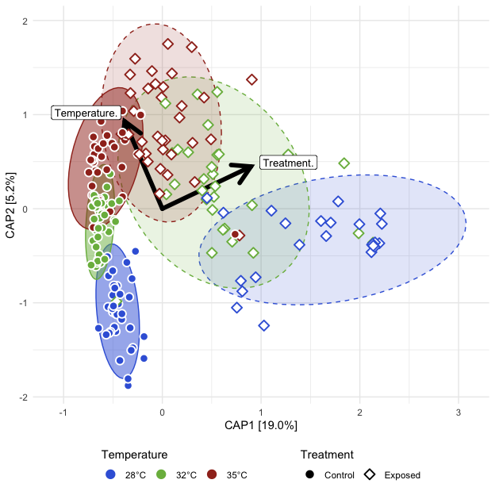<!-- -->

##### Tables

###### (hide)

Press on tabs to display tables. Scroll to see additional rows.

###### Capscale

<table class="gt_table" data-quarto-disable-processing="false" data-quarto-bootstrap="false">
  <thead>
    <tr class="gt_heading">
      <td colspan="7" class="gt_heading gt_title gt_font_normal" style>ADONIS2</td>
    </tr>
    <tr class="gt_heading">
      <td colspan="7" class="gt_heading gt_subtitle gt_font_normal gt_bottom_border" style>adonis2(Beta Distance ~ Temperature*Treatment); Post-Exposed fish</td>
    </tr>
    <tr class="gt_col_headings">
      <th class="gt_col_heading gt_columns_bottom_border gt_left" rowspan="1" colspan="1" scope="col" id="term">term</th>
      <th class="gt_col_heading gt_columns_bottom_border gt_right" rowspan="1" colspan="1" scope="col" id="df">df</th>
      <th class="gt_col_heading gt_columns_bottom_border gt_right" rowspan="1" colspan="1" scope="col" id="SumOfSqs">SumOfSqs</th>
      <th class="gt_col_heading gt_columns_bottom_border gt_right" rowspan="1" colspan="1" scope="col" id="R2">R2</th>
      <th class="gt_col_heading gt_columns_bottom_border gt_right" rowspan="1" colspan="1" scope="col" id="statistic">statistic</th>
      <th class="gt_col_heading gt_columns_bottom_border gt_right" rowspan="1" colspan="1" scope="col" id="p.value">p.value</th>
      <th class="gt_col_heading gt_columns_bottom_border gt_right" rowspan="1" colspan="1" scope="col" id="sig">sig</th>
    </tr>
  </thead>
  <tbody class="gt_table_body">
    <tr class="gt_group_heading_row">
      <th colspan="7" class="gt_group_heading" scope="colgroup" id="bray">bray</th>
    </tr>
    <tr class="gt_row_group_first"><td headers="bray  term" class="gt_row gt_left">Temperature</td>
<td headers="bray  df" class="gt_row gt_right">2.000</td>
<td headers="bray  SumOfSqs" class="gt_row gt_right">4.123</td>
<td headers="bray  R2" class="gt_row gt_right">0.108</td>
<td headers="bray  statistic" class="gt_row gt_right">17.035</td>
<td headers="bray  p.value" class="gt_row gt_right">0.001</td>
<td headers="bray  sig" class="gt_row gt_right">***</td></tr>
    <tr><td headers="bray  term" class="gt_row gt_left">Treatment</td>
<td headers="bray  df" class="gt_row gt_right">1.000</td>
<td headers="bray  SumOfSqs" class="gt_row gt_right">7.411</td>
<td headers="bray  R2" class="gt_row gt_right">0.194</td>
<td headers="bray  statistic" class="gt_row gt_right">61.235</td>
<td headers="bray  p.value" class="gt_row gt_right">0.001</td>
<td headers="bray  sig" class="gt_row gt_right">***</td></tr>
    <tr><td headers="bray  term" class="gt_row gt_left">Temperature:Treatment</td>
<td headers="bray  df" class="gt_row gt_right">2.000</td>
<td headers="bray  SumOfSqs" class="gt_row gt_right">3.168</td>
<td headers="bray  R2" class="gt_row gt_right">0.083</td>
<td headers="bray  statistic" class="gt_row gt_right">13.088</td>
<td headers="bray  p.value" class="gt_row gt_right">0.001</td>
<td headers="bray  sig" class="gt_row gt_right">***</td></tr>
    <tr><td headers="bray  term" class="gt_row gt_left">Residual</td>
<td headers="bray  df" class="gt_row gt_right">194.000</td>
<td headers="bray  SumOfSqs" class="gt_row gt_right">23.478</td>
<td headers="bray  R2" class="gt_row gt_right">0.615</td>
<td headers="bray  statistic" class="gt_row gt_right">NA</td>
<td headers="bray  p.value" class="gt_row gt_right">NA</td>
<td headers="bray  sig" class="gt_row gt_right">NA</td></tr>
    <tr><td headers="bray  term" class="gt_row gt_left">Total</td>
<td headers="bray  df" class="gt_row gt_right">199.000</td>
<td headers="bray  SumOfSqs" class="gt_row gt_right">38.179</td>
<td headers="bray  R2" class="gt_row gt_right">1.000</td>
<td headers="bray  statistic" class="gt_row gt_right">NA</td>
<td headers="bray  p.value" class="gt_row gt_right">NA</td>
<td headers="bray  sig" class="gt_row gt_right">NA</td></tr>
    <tr class="gt_group_heading_row">
      <th colspan="7" class="gt_group_heading" scope="colgroup" id="canberra">canberra</th>
    </tr>
    <tr class="gt_row_group_first"><td headers="canberra  term" class="gt_row gt_left">Temperature</td>
<td headers="canberra  df" class="gt_row gt_right">2.000</td>
<td headers="canberra  SumOfSqs" class="gt_row gt_right">4.561</td>
<td headers="canberra  R2" class="gt_row gt_right">0.074</td>
<td headers="canberra  statistic" class="gt_row gt_right">9.502</td>
<td headers="canberra  p.value" class="gt_row gt_right">0.001</td>
<td headers="canberra  sig" class="gt_row gt_right">***</td></tr>
    <tr><td headers="canberra  term" class="gt_row gt_left">Treatment</td>
<td headers="canberra  df" class="gt_row gt_right">1.000</td>
<td headers="canberra  SumOfSqs" class="gt_row gt_right">7.402</td>
<td headers="canberra  R2" class="gt_row gt_right">0.120</td>
<td headers="canberra  statistic" class="gt_row gt_right">30.840</td>
<td headers="canberra  p.value" class="gt_row gt_right">0.001</td>
<td headers="canberra  sig" class="gt_row gt_right">***</td></tr>
    <tr><td headers="canberra  term" class="gt_row gt_left">Temperature:Treatment</td>
<td headers="canberra  df" class="gt_row gt_right">2.000</td>
<td headers="canberra  SumOfSqs" class="gt_row gt_right">3.014</td>
<td headers="canberra  R2" class="gt_row gt_right">0.049</td>
<td headers="canberra  statistic" class="gt_row gt_right">6.279</td>
<td headers="canberra  p.value" class="gt_row gt_right">0.001</td>
<td headers="canberra  sig" class="gt_row gt_right">***</td></tr>
    <tr><td headers="canberra  term" class="gt_row gt_left">Residual</td>
<td headers="canberra  df" class="gt_row gt_right">194.000</td>
<td headers="canberra  SumOfSqs" class="gt_row gt_right">46.561</td>
<td headers="canberra  R2" class="gt_row gt_right">0.757</td>
<td headers="canberra  statistic" class="gt_row gt_right">NA</td>
<td headers="canberra  p.value" class="gt_row gt_right">NA</td>
<td headers="canberra  sig" class="gt_row gt_right">NA</td></tr>
    <tr><td headers="canberra  term" class="gt_row gt_left">Total</td>
<td headers="canberra  df" class="gt_row gt_right">199.000</td>
<td headers="canberra  SumOfSqs" class="gt_row gt_right">61.538</td>
<td headers="canberra  R2" class="gt_row gt_right">1.000</td>
<td headers="canberra  statistic" class="gt_row gt_right">NA</td>
<td headers="canberra  p.value" class="gt_row gt_right">NA</td>
<td headers="canberra  sig" class="gt_row gt_right">NA</td></tr>
    <tr class="gt_group_heading_row">
      <th colspan="7" class="gt_group_heading" scope="colgroup" id="gunifrac">gunifrac</th>
    </tr>
    <tr class="gt_row_group_first"><td headers="gunifrac  term" class="gt_row gt_left">Temperature</td>
<td headers="gunifrac  df" class="gt_row gt_right">2.000</td>
<td headers="gunifrac  SumOfSqs" class="gt_row gt_right">2.273</td>
<td headers="gunifrac  R2" class="gt_row gt_right">0.082</td>
<td headers="gunifrac  statistic" class="gt_row gt_right">11.945</td>
<td headers="gunifrac  p.value" class="gt_row gt_right">0.001</td>
<td headers="gunifrac  sig" class="gt_row gt_right">***</td></tr>
    <tr><td headers="gunifrac  term" class="gt_row gt_left">Treatment</td>
<td headers="gunifrac  df" class="gt_row gt_right">1.000</td>
<td headers="gunifrac  SumOfSqs" class="gt_row gt_right">4.718</td>
<td headers="gunifrac  R2" class="gt_row gt_right">0.170</td>
<td headers="gunifrac  statistic" class="gt_row gt_right">49.577</td>
<td headers="gunifrac  p.value" class="gt_row gt_right">0.001</td>
<td headers="gunifrac  sig" class="gt_row gt_right">***</td></tr>
    <tr><td headers="gunifrac  term" class="gt_row gt_left">Temperature:Treatment</td>
<td headers="gunifrac  df" class="gt_row gt_right">2.000</td>
<td headers="gunifrac  SumOfSqs" class="gt_row gt_right">2.273</td>
<td headers="gunifrac  R2" class="gt_row gt_right">0.082</td>
<td headers="gunifrac  statistic" class="gt_row gt_right">11.944</td>
<td headers="gunifrac  p.value" class="gt_row gt_right">0.001</td>
<td headers="gunifrac  sig" class="gt_row gt_right">***</td></tr>
    <tr><td headers="gunifrac  term" class="gt_row gt_left">Residual</td>
<td headers="gunifrac  df" class="gt_row gt_right">194.000</td>
<td headers="gunifrac  SumOfSqs" class="gt_row gt_right">18.460</td>
<td headers="gunifrac  R2" class="gt_row gt_right">0.666</td>
<td headers="gunifrac  statistic" class="gt_row gt_right">NA</td>
<td headers="gunifrac  p.value" class="gt_row gt_right">NA</td>
<td headers="gunifrac  sig" class="gt_row gt_right">NA</td></tr>
    <tr><td headers="gunifrac  term" class="gt_row gt_left">Total</td>
<td headers="gunifrac  df" class="gt_row gt_right">199.000</td>
<td headers="gunifrac  SumOfSqs" class="gt_row gt_right">27.724</td>
<td headers="gunifrac  R2" class="gt_row gt_right">1.000</td>
<td headers="gunifrac  statistic" class="gt_row gt_right">NA</td>
<td headers="gunifrac  p.value" class="gt_row gt_right">NA</td>
<td headers="gunifrac  sig" class="gt_row gt_right">NA</td></tr>
  </tbody>
  &#10;  
</table>

###### Dispersion (ANOVA)

<table class="gt_table" data-quarto-disable-processing="false" data-quarto-bootstrap="false">
  <thead>
    <tr class="gt_heading">
      <td colspan="7" class="gt_heading gt_title gt_font_normal" style>ANOVA: Homogeneity of Dispersion</td>
    </tr>
    <tr class="gt_heading">
      <td colspan="7" class="gt_heading gt_subtitle gt_font_normal gt_bottom_border" style>ANOVA(Beta Disperson ~ Temperature); Post-Exposed fish</td>
    </tr>
    <tr class="gt_col_headings">
      <th class="gt_col_heading gt_columns_bottom_border gt_left" rowspan="1" colspan="1" scope="col" id="term">term</th>
      <th class="gt_col_heading gt_columns_bottom_border gt_right" rowspan="1" colspan="1" scope="col" id="df">df</th>
      <th class="gt_col_heading gt_columns_bottom_border gt_right" rowspan="1" colspan="1" scope="col" id="sumsq">sumsq</th>
      <th class="gt_col_heading gt_columns_bottom_border gt_right" rowspan="1" colspan="1" scope="col" id="meansq">meansq</th>
      <th class="gt_col_heading gt_columns_bottom_border gt_right" rowspan="1" colspan="1" scope="col" id="statistic">statistic</th>
      <th class="gt_col_heading gt_columns_bottom_border gt_right" rowspan="1" colspan="1" scope="col" id="p.value">p.value</th>
      <th class="gt_col_heading gt_columns_bottom_border gt_right" rowspan="1" colspan="1" scope="col" id="sig">sig</th>
    </tr>
  </thead>
  <tbody class="gt_table_body">
    <tr class="gt_group_heading_row">
      <th colspan="7" class="gt_group_heading" scope="colgroup" id="bray">bray</th>
    </tr>
    <tr class="gt_row_group_first"><td headers="bray  term" class="gt_row gt_left">Temp.Treat</td>
<td headers="bray  df" class="gt_row gt_right">5.000</td>
<td headers="bray  sumsq" class="gt_row gt_right">1.344</td>
<td headers="bray  meansq" class="gt_row gt_right">0.269</td>
<td headers="bray  statistic" class="gt_row gt_right">17.882</td>
<td headers="bray  p.value" class="gt_row gt_right">&lt;0.001</td>
<td headers="bray  sig" class="gt_row gt_right">****</td></tr>
    <tr><td headers="bray  term" class="gt_row gt_left">Residual</td>
<td headers="bray  df" class="gt_row gt_right">194.000</td>
<td headers="bray  sumsq" class="gt_row gt_right">2.917</td>
<td headers="bray  meansq" class="gt_row gt_right">0.015</td>
<td headers="bray  statistic" class="gt_row gt_right">NA</td>
<td headers="bray  p.value" class="gt_row gt_right">NA</td>
<td headers="bray  sig" class="gt_row gt_right">NA</td></tr>
    <tr class="gt_group_heading_row">
      <th colspan="7" class="gt_group_heading" scope="colgroup" id="canberra">canberra</th>
    </tr>
    <tr class="gt_row_group_first"><td headers="canberra  term" class="gt_row gt_left">Temp.Treat</td>
<td headers="canberra  df" class="gt_row gt_right">5.000</td>
<td headers="canberra  sumsq" class="gt_row gt_right">1.094</td>
<td headers="canberra  meansq" class="gt_row gt_right">0.219</td>
<td headers="canberra  statistic" class="gt_row gt_right">31.758</td>
<td headers="canberra  p.value" class="gt_row gt_right">&lt;0.001</td>
<td headers="canberra  sig" class="gt_row gt_right">****</td></tr>
    <tr><td headers="canberra  term" class="gt_row gt_left">Residual</td>
<td headers="canberra  df" class="gt_row gt_right">194.000</td>
<td headers="canberra  sumsq" class="gt_row gt_right">1.337</td>
<td headers="canberra  meansq" class="gt_row gt_right">0.007</td>
<td headers="canberra  statistic" class="gt_row gt_right">NA</td>
<td headers="canberra  p.value" class="gt_row gt_right">NA</td>
<td headers="canberra  sig" class="gt_row gt_right">NA</td></tr>
    <tr class="gt_group_heading_row">
      <th colspan="7" class="gt_group_heading" scope="colgroup" id="gunifrac">gunifrac</th>
    </tr>
    <tr class="gt_row_group_first"><td headers="gunifrac  term" class="gt_row gt_left">Temp.Treat</td>
<td headers="gunifrac  df" class="gt_row gt_right">5.000</td>
<td headers="gunifrac  sumsq" class="gt_row gt_right">1.225</td>
<td headers="gunifrac  meansq" class="gt_row gt_right">0.245</td>
<td headers="gunifrac  statistic" class="gt_row gt_right">29.264</td>
<td headers="gunifrac  p.value" class="gt_row gt_right">&lt;0.001</td>
<td headers="gunifrac  sig" class="gt_row gt_right">****</td></tr>
    <tr><td headers="gunifrac  term" class="gt_row gt_left">Residual</td>
<td headers="gunifrac  df" class="gt_row gt_right">194.000</td>
<td headers="gunifrac  sumsq" class="gt_row gt_right">1.624</td>
<td headers="gunifrac  meansq" class="gt_row gt_right">0.008</td>
<td headers="gunifrac  statistic" class="gt_row gt_right">NA</td>
<td headers="gunifrac  p.value" class="gt_row gt_right">NA</td>
<td headers="gunifrac  sig" class="gt_row gt_right">NA</td></tr>
  </tbody>
  &#10;  
</table>

###### Dispersion (Tukey)

<table class="gt_table" data-quarto-disable-processing="false" data-quarto-bootstrap="false">
  <thead>
    <tr class="gt_heading">
      <td colspan="9" class="gt_heading gt_title gt_font_normal" style>Tukey: Homogeneity of Dispersion</td>
    </tr>
    <tr class="gt_heading">
      <td colspan="9" class="gt_heading gt_subtitle gt_font_normal gt_bottom_border" style>Tukey(Beta Disperson ~ Temperature*Treatment); Post-Exposed fish</td>
    </tr>
    <tr class="gt_col_headings">
      <th class="gt_col_heading gt_columns_bottom_border gt_left" rowspan="1" colspan="1" scope="col" id=".y.">.y.</th>
      <th class="gt_col_heading gt_columns_bottom_border gt_left" rowspan="1" colspan="1" scope="col" id="term">term</th>
      <th class="gt_col_heading gt_columns_bottom_border gt_left" rowspan="1" colspan="1" scope="col" id="group1">group1</th>
      <th class="gt_col_heading gt_columns_bottom_border gt_left" rowspan="1" colspan="1" scope="col" id="group2">group2</th>
      <th class="gt_col_heading gt_columns_bottom_border gt_right" rowspan="1" colspan="1" scope="col" id="estimate">estimate</th>
      <th class="gt_col_heading gt_columns_bottom_border gt_right" rowspan="1" colspan="1" scope="col" id="conf.low">conf.low</th>
      <th class="gt_col_heading gt_columns_bottom_border gt_right" rowspan="1" colspan="1" scope="col" id="conf.high">conf.high</th>
      <th class="gt_col_heading gt_columns_bottom_border gt_right" rowspan="1" colspan="1" scope="col" id="adj.p.value">adj.p.value</th>
      <th class="gt_col_heading gt_columns_bottom_border gt_left" rowspan="1" colspan="1" scope="col" id="sig">sig</th>
    </tr>
  </thead>
  <tbody class="gt_table_body">
    <tr class="gt_group_heading_row">
      <th colspan="9" class="gt_group_heading" scope="colgroup" id="bray">bray</th>
    </tr>
    <tr class="gt_row_group_first"><td headers="bray  .y." class="gt_row gt_left">Distance</td>
<td headers="bray  term" class="gt_row gt_left">Temp.Treat</td>
<td headers="bray  group1" class="gt_row gt_left">28°C__Exposed</td>
<td headers="bray  group2" class="gt_row gt_left">28°C__Control</td>
<td headers="bray  estimate" class="gt_row gt_right">0.211</td>
<td headers="bray  conf.low" class="gt_row gt_right">0.119</td>
<td headers="bray  conf.high" class="gt_row gt_right">0.302</td>
<td headers="bray  adj.p.value" class="gt_row gt_right">&lt;0.001</td>
<td headers="bray  sig" class="gt_row gt_left">****</td></tr>
    <tr><td headers="bray  .y." class="gt_row gt_left">Distance</td>
<td headers="bray  term" class="gt_row gt_left">Temp.Treat</td>
<td headers="bray  group1" class="gt_row gt_left">32°C__Control</td>
<td headers="bray  group2" class="gt_row gt_left">28°C__Control</td>
<td headers="bray  estimate" class="gt_row gt_right">−0.015</td>
<td headers="bray  conf.low" class="gt_row gt_right">−0.096</td>
<td headers="bray  conf.high" class="gt_row gt_right">0.066</td>
<td headers="bray  adj.p.value" class="gt_row gt_right">≥0.25</td>
<td headers="bray  sig" class="gt_row gt_left">ns</td></tr>
    <tr><td headers="bray  .y." class="gt_row gt_left">Distance</td>
<td headers="bray  term" class="gt_row gt_left">Temp.Treat</td>
<td headers="bray  group1" class="gt_row gt_left">32°C__Exposed</td>
<td headers="bray  group2" class="gt_row gt_left">28°C__Control</td>
<td headers="bray  estimate" class="gt_row gt_right">0.168</td>
<td headers="bray  conf.low" class="gt_row gt_right">0.081</td>
<td headers="bray  conf.high" class="gt_row gt_right">0.255</td>
<td headers="bray  adj.p.value" class="gt_row gt_right">&lt;0.001</td>
<td headers="bray  sig" class="gt_row gt_left">****</td></tr>
    <tr><td headers="bray  .y." class="gt_row gt_left">Distance</td>
<td headers="bray  term" class="gt_row gt_left">Temp.Treat</td>
<td headers="bray  group1" class="gt_row gt_left">35°C__Control</td>
<td headers="bray  group2" class="gt_row gt_left">28°C__Control</td>
<td headers="bray  estimate" class="gt_row gt_right">0.013</td>
<td headers="bray  conf.low" class="gt_row gt_right">−0.070</td>
<td headers="bray  conf.high" class="gt_row gt_right">0.096</td>
<td headers="bray  adj.p.value" class="gt_row gt_right">≥0.25</td>
<td headers="bray  sig" class="gt_row gt_left">ns</td></tr>
    <tr><td headers="bray  .y." class="gt_row gt_left">Distance</td>
<td headers="bray  term" class="gt_row gt_left">Temp.Treat</td>
<td headers="bray  group1" class="gt_row gt_left">35°C__Exposed</td>
<td headers="bray  group2" class="gt_row gt_left">28°C__Control</td>
<td headers="bray  estimate" class="gt_row gt_right">0.060</td>
<td headers="bray  conf.low" class="gt_row gt_right">−0.024</td>
<td headers="bray  conf.high" class="gt_row gt_right">0.144</td>
<td headers="bray  adj.p.value" class="gt_row gt_right">≥0.25</td>
<td headers="bray  sig" class="gt_row gt_left">ns</td></tr>
    <tr><td headers="bray  .y." class="gt_row gt_left">Distance</td>
<td headers="bray  term" class="gt_row gt_left">Temp.Treat</td>
<td headers="bray  group1" class="gt_row gt_left">32°C__Control</td>
<td headers="bray  group2" class="gt_row gt_left">28°C__Exposed</td>
<td headers="bray  estimate" class="gt_row gt_right">−0.225</td>
<td headers="bray  conf.low" class="gt_row gt_right">−0.316</td>
<td headers="bray  conf.high" class="gt_row gt_right">−0.135</td>
<td headers="bray  adj.p.value" class="gt_row gt_right">&lt;0.001</td>
<td headers="bray  sig" class="gt_row gt_left">****</td></tr>
    <tr><td headers="bray  .y." class="gt_row gt_left">Distance</td>
<td headers="bray  term" class="gt_row gt_left">Temp.Treat</td>
<td headers="bray  group1" class="gt_row gt_left">32°C__Exposed</td>
<td headers="bray  group2" class="gt_row gt_left">28°C__Exposed</td>
<td headers="bray  estimate" class="gt_row gt_right">−0.043</td>
<td headers="bray  conf.low" class="gt_row gt_right">−0.138</td>
<td headers="bray  conf.high" class="gt_row gt_right">0.053</td>
<td headers="bray  adj.p.value" class="gt_row gt_right">≥0.25</td>
<td headers="bray  sig" class="gt_row gt_left">ns</td></tr>
    <tr><td headers="bray  .y." class="gt_row gt_left">Distance</td>
<td headers="bray  term" class="gt_row gt_left">Temp.Treat</td>
<td headers="bray  group1" class="gt_row gt_left">35°C__Control</td>
<td headers="bray  group2" class="gt_row gt_left">28°C__Exposed</td>
<td headers="bray  estimate" class="gt_row gt_right">−0.197</td>
<td headers="bray  conf.low" class="gt_row gt_right">−0.290</td>
<td headers="bray  conf.high" class="gt_row gt_right">−0.105</td>
<td headers="bray  adj.p.value" class="gt_row gt_right">&lt;0.001</td>
<td headers="bray  sig" class="gt_row gt_left">****</td></tr>
    <tr><td headers="bray  .y." class="gt_row gt_left">Distance</td>
<td headers="bray  term" class="gt_row gt_left">Temp.Treat</td>
<td headers="bray  group1" class="gt_row gt_left">35°C__Exposed</td>
<td headers="bray  group2" class="gt_row gt_left">28°C__Exposed</td>
<td headers="bray  estimate" class="gt_row gt_right">−0.150</td>
<td headers="bray  conf.low" class="gt_row gt_right">−0.243</td>
<td headers="bray  conf.high" class="gt_row gt_right">−0.057</td>
<td headers="bray  adj.p.value" class="gt_row gt_right">&lt;0.001</td>
<td headers="bray  sig" class="gt_row gt_left">****</td></tr>
    <tr><td headers="bray  .y." class="gt_row gt_left">Distance</td>
<td headers="bray  term" class="gt_row gt_left">Temp.Treat</td>
<td headers="bray  group1" class="gt_row gt_left">32°C__Exposed</td>
<td headers="bray  group2" class="gt_row gt_left">32°C__Control</td>
<td headers="bray  estimate" class="gt_row gt_right">0.183</td>
<td headers="bray  conf.low" class="gt_row gt_right">0.097</td>
<td headers="bray  conf.high" class="gt_row gt_right">0.268</td>
<td headers="bray  adj.p.value" class="gt_row gt_right">&lt;0.001</td>
<td headers="bray  sig" class="gt_row gt_left">****</td></tr>
    <tr><td headers="bray  .y." class="gt_row gt_left">Distance</td>
<td headers="bray  term" class="gt_row gt_left">Temp.Treat</td>
<td headers="bray  group1" class="gt_row gt_left">35°C__Control</td>
<td headers="bray  group2" class="gt_row gt_left">32°C__Control</td>
<td headers="bray  estimate" class="gt_row gt_right">0.028</td>
<td headers="bray  conf.low" class="gt_row gt_right">−0.054</td>
<td headers="bray  conf.high" class="gt_row gt_right">0.110</td>
<td headers="bray  adj.p.value" class="gt_row gt_right">≥0.25</td>
<td headers="bray  sig" class="gt_row gt_left">ns</td></tr>
    <tr><td headers="bray  .y." class="gt_row gt_left">Distance</td>
<td headers="bray  term" class="gt_row gt_left">Temp.Treat</td>
<td headers="bray  group1" class="gt_row gt_left">35°C__Exposed</td>
<td headers="bray  group2" class="gt_row gt_left">32°C__Control</td>
<td headers="bray  estimate" class="gt_row gt_right">0.075</td>
<td headers="bray  conf.low" class="gt_row gt_right">−0.008</td>
<td headers="bray  conf.high" class="gt_row gt_right">0.158</td>
<td headers="bray  adj.p.value" class="gt_row gt_right">0.100</td>
<td headers="bray  sig" class="gt_row gt_left">ns</td></tr>
    <tr><td headers="bray  .y." class="gt_row gt_left">Distance</td>
<td headers="bray  term" class="gt_row gt_left">Temp.Treat</td>
<td headers="bray  group1" class="gt_row gt_left">35°C__Control</td>
<td headers="bray  group2" class="gt_row gt_left">32°C__Exposed</td>
<td headers="bray  estimate" class="gt_row gt_right">−0.155</td>
<td headers="bray  conf.low" class="gt_row gt_right">−0.243</td>
<td headers="bray  conf.high" class="gt_row gt_right">−0.067</td>
<td headers="bray  adj.p.value" class="gt_row gt_right">&lt;0.001</td>
<td headers="bray  sig" class="gt_row gt_left">****</td></tr>
    <tr><td headers="bray  .y." class="gt_row gt_left">Distance</td>
<td headers="bray  term" class="gt_row gt_left">Temp.Treat</td>
<td headers="bray  group1" class="gt_row gt_left">35°C__Exposed</td>
<td headers="bray  group2" class="gt_row gt_left">32°C__Exposed</td>
<td headers="bray  estimate" class="gt_row gt_right">−0.108</td>
<td headers="bray  conf.low" class="gt_row gt_right">−0.196</td>
<td headers="bray  conf.high" class="gt_row gt_right">−0.019</td>
<td headers="bray  adj.p.value" class="gt_row gt_right">0.007</td>
<td headers="bray  sig" class="gt_row gt_left">**</td></tr>
    <tr><td headers="bray  .y." class="gt_row gt_left">Distance</td>
<td headers="bray  term" class="gt_row gt_left">Temp.Treat</td>
<td headers="bray  group1" class="gt_row gt_left">35°C__Exposed</td>
<td headers="bray  group2" class="gt_row gt_left">35°C__Control</td>
<td headers="bray  estimate" class="gt_row gt_right">0.047</td>
<td headers="bray  conf.low" class="gt_row gt_right">−0.038</td>
<td headers="bray  conf.high" class="gt_row gt_right">0.132</td>
<td headers="bray  adj.p.value" class="gt_row gt_right">≥0.25</td>
<td headers="bray  sig" class="gt_row gt_left">ns</td></tr>
    <tr class="gt_group_heading_row">
      <th colspan="9" class="gt_group_heading" scope="colgroup" id="canberra">canberra</th>
    </tr>
    <tr class="gt_row_group_first"><td headers="canberra  .y." class="gt_row gt_left">Distance</td>
<td headers="canberra  term" class="gt_row gt_left">Temp.Treat</td>
<td headers="canberra  group1" class="gt_row gt_left">28°C__Exposed</td>
<td headers="canberra  group2" class="gt_row gt_left">28°C__Control</td>
<td headers="canberra  estimate" class="gt_row gt_right">0.217</td>
<td headers="canberra  conf.low" class="gt_row gt_right">0.155</td>
<td headers="canberra  conf.high" class="gt_row gt_right">0.279</td>
<td headers="canberra  adj.p.value" class="gt_row gt_right">&lt;0.001</td>
<td headers="canberra  sig" class="gt_row gt_left">****</td></tr>
    <tr><td headers="canberra  .y." class="gt_row gt_left">Distance</td>
<td headers="canberra  term" class="gt_row gt_left">Temp.Treat</td>
<td headers="canberra  group1" class="gt_row gt_left">32°C__Control</td>
<td headers="canberra  group2" class="gt_row gt_left">28°C__Control</td>
<td headers="canberra  estimate" class="gt_row gt_right">−0.011</td>
<td headers="canberra  conf.low" class="gt_row gt_right">−0.066</td>
<td headers="canberra  conf.high" class="gt_row gt_right">0.044</td>
<td headers="canberra  adj.p.value" class="gt_row gt_right">≥0.25</td>
<td headers="canberra  sig" class="gt_row gt_left">ns</td></tr>
    <tr><td headers="canberra  .y." class="gt_row gt_left">Distance</td>
<td headers="canberra  term" class="gt_row gt_left">Temp.Treat</td>
<td headers="canberra  group1" class="gt_row gt_left">32°C__Exposed</td>
<td headers="canberra  group2" class="gt_row gt_left">28°C__Control</td>
<td headers="canberra  estimate" class="gt_row gt_right">0.107</td>
<td headers="canberra  conf.low" class="gt_row gt_right">0.048</td>
<td headers="canberra  conf.high" class="gt_row gt_right">0.166</td>
<td headers="canberra  adj.p.value" class="gt_row gt_right">&lt;0.001</td>
<td headers="canberra  sig" class="gt_row gt_left">****</td></tr>
    <tr><td headers="canberra  .y." class="gt_row gt_left">Distance</td>
<td headers="canberra  term" class="gt_row gt_left">Temp.Treat</td>
<td headers="canberra  group1" class="gt_row gt_left">35°C__Control</td>
<td headers="canberra  group2" class="gt_row gt_left">28°C__Control</td>
<td headers="canberra  estimate" class="gt_row gt_right">0.013</td>
<td headers="canberra  conf.low" class="gt_row gt_right">−0.044</td>
<td headers="canberra  conf.high" class="gt_row gt_right">0.069</td>
<td headers="canberra  adj.p.value" class="gt_row gt_right">≥0.25</td>
<td headers="canberra  sig" class="gt_row gt_left">ns</td></tr>
    <tr><td headers="canberra  .y." class="gt_row gt_left">Distance</td>
<td headers="canberra  term" class="gt_row gt_left">Temp.Treat</td>
<td headers="canberra  group1" class="gt_row gt_left">35°C__Exposed</td>
<td headers="canberra  group2" class="gt_row gt_left">28°C__Control</td>
<td headers="canberra  estimate" class="gt_row gt_right">0.073</td>
<td headers="canberra  conf.low" class="gt_row gt_right">0.016</td>
<td headers="canberra  conf.high" class="gt_row gt_right">0.130</td>
<td headers="canberra  adj.p.value" class="gt_row gt_right">0.004</td>
<td headers="canberra  sig" class="gt_row gt_left">**</td></tr>
    <tr><td headers="canberra  .y." class="gt_row gt_left">Distance</td>
<td headers="canberra  term" class="gt_row gt_left">Temp.Treat</td>
<td headers="canberra  group1" class="gt_row gt_left">32°C__Control</td>
<td headers="canberra  group2" class="gt_row gt_left">28°C__Exposed</td>
<td headers="canberra  estimate" class="gt_row gt_right">−0.228</td>
<td headers="canberra  conf.low" class="gt_row gt_right">−0.289</td>
<td headers="canberra  conf.high" class="gt_row gt_right">−0.167</td>
<td headers="canberra  adj.p.value" class="gt_row gt_right">&lt;0.001</td>
<td headers="canberra  sig" class="gt_row gt_left">****</td></tr>
    <tr><td headers="canberra  .y." class="gt_row gt_left">Distance</td>
<td headers="canberra  term" class="gt_row gt_left">Temp.Treat</td>
<td headers="canberra  group1" class="gt_row gt_left">32°C__Exposed</td>
<td headers="canberra  group2" class="gt_row gt_left">28°C__Exposed</td>
<td headers="canberra  estimate" class="gt_row gt_right">−0.110</td>
<td headers="canberra  conf.low" class="gt_row gt_right">−0.175</td>
<td headers="canberra  conf.high" class="gt_row gt_right">−0.045</td>
<td headers="canberra  adj.p.value" class="gt_row gt_right">&lt;0.001</td>
<td headers="canberra  sig" class="gt_row gt_left">****</td></tr>
    <tr><td headers="canberra  .y." class="gt_row gt_left">Distance</td>
<td headers="canberra  term" class="gt_row gt_left">Temp.Treat</td>
<td headers="canberra  group1" class="gt_row gt_left">35°C__Control</td>
<td headers="canberra  group2" class="gt_row gt_left">28°C__Exposed</td>
<td headers="canberra  estimate" class="gt_row gt_right">−0.204</td>
<td headers="canberra  conf.low" class="gt_row gt_right">−0.267</td>
<td headers="canberra  conf.high" class="gt_row gt_right">−0.142</td>
<td headers="canberra  adj.p.value" class="gt_row gt_right">&lt;0.001</td>
<td headers="canberra  sig" class="gt_row gt_left">****</td></tr>
    <tr><td headers="canberra  .y." class="gt_row gt_left">Distance</td>
<td headers="canberra  term" class="gt_row gt_left">Temp.Treat</td>
<td headers="canberra  group1" class="gt_row gt_left">35°C__Exposed</td>
<td headers="canberra  group2" class="gt_row gt_left">28°C__Exposed</td>
<td headers="canberra  estimate" class="gt_row gt_right">−0.144</td>
<td headers="canberra  conf.low" class="gt_row gt_right">−0.207</td>
<td headers="canberra  conf.high" class="gt_row gt_right">−0.081</td>
<td headers="canberra  adj.p.value" class="gt_row gt_right">&lt;0.001</td>
<td headers="canberra  sig" class="gt_row gt_left">****</td></tr>
    <tr><td headers="canberra  .y." class="gt_row gt_left">Distance</td>
<td headers="canberra  term" class="gt_row gt_left">Temp.Treat</td>
<td headers="canberra  group1" class="gt_row gt_left">32°C__Exposed</td>
<td headers="canberra  group2" class="gt_row gt_left">32°C__Control</td>
<td headers="canberra  estimate" class="gt_row gt_right">0.118</td>
<td headers="canberra  conf.low" class="gt_row gt_right">0.060</td>
<td headers="canberra  conf.high" class="gt_row gt_right">0.176</td>
<td headers="canberra  adj.p.value" class="gt_row gt_right">&lt;0.001</td>
<td headers="canberra  sig" class="gt_row gt_left">****</td></tr>
    <tr><td headers="canberra  .y." class="gt_row gt_left">Distance</td>
<td headers="canberra  term" class="gt_row gt_left">Temp.Treat</td>
<td headers="canberra  group1" class="gt_row gt_left">35°C__Control</td>
<td headers="canberra  group2" class="gt_row gt_left">32°C__Control</td>
<td headers="canberra  estimate" class="gt_row gt_right">0.024</td>
<td headers="canberra  conf.low" class="gt_row gt_right">−0.032</td>
<td headers="canberra  conf.high" class="gt_row gt_right">0.080</td>
<td headers="canberra  adj.p.value" class="gt_row gt_right">≥0.25</td>
<td headers="canberra  sig" class="gt_row gt_left">ns</td></tr>
    <tr><td headers="canberra  .y." class="gt_row gt_left">Distance</td>
<td headers="canberra  term" class="gt_row gt_left">Temp.Treat</td>
<td headers="canberra  group1" class="gt_row gt_left">35°C__Exposed</td>
<td headers="canberra  group2" class="gt_row gt_left">32°C__Control</td>
<td headers="canberra  estimate" class="gt_row gt_right">0.084</td>
<td headers="canberra  conf.low" class="gt_row gt_right">0.028</td>
<td headers="canberra  conf.high" class="gt_row gt_right">0.140</td>
<td headers="canberra  adj.p.value" class="gt_row gt_right">&lt;0.001</td>
<td headers="canberra  sig" class="gt_row gt_left">***</td></tr>
    <tr><td headers="canberra  .y." class="gt_row gt_left">Distance</td>
<td headers="canberra  term" class="gt_row gt_left">Temp.Treat</td>
<td headers="canberra  group1" class="gt_row gt_left">35°C__Control</td>
<td headers="canberra  group2" class="gt_row gt_left">32°C__Exposed</td>
<td headers="canberra  estimate" class="gt_row gt_right">−0.094</td>
<td headers="canberra  conf.low" class="gt_row gt_right">−0.154</td>
<td headers="canberra  conf.high" class="gt_row gt_right">−0.035</td>
<td headers="canberra  adj.p.value" class="gt_row gt_right">&lt;0.001</td>
<td headers="canberra  sig" class="gt_row gt_left">***</td></tr>
    <tr><td headers="canberra  .y." class="gt_row gt_left">Distance</td>
<td headers="canberra  term" class="gt_row gt_left">Temp.Treat</td>
<td headers="canberra  group1" class="gt_row gt_left">35°C__Exposed</td>
<td headers="canberra  group2" class="gt_row gt_left">32°C__Exposed</td>
<td headers="canberra  estimate" class="gt_row gt_right">−0.034</td>
<td headers="canberra  conf.low" class="gt_row gt_right">−0.094</td>
<td headers="canberra  conf.high" class="gt_row gt_right">0.026</td>
<td headers="canberra  adj.p.value" class="gt_row gt_right">≥0.25</td>
<td headers="canberra  sig" class="gt_row gt_left">ns</td></tr>
    <tr><td headers="canberra  .y." class="gt_row gt_left">Distance</td>
<td headers="canberra  term" class="gt_row gt_left">Temp.Treat</td>
<td headers="canberra  group1" class="gt_row gt_left">35°C__Exposed</td>
<td headers="canberra  group2" class="gt_row gt_left">35°C__Control</td>
<td headers="canberra  estimate" class="gt_row gt_right">0.060</td>
<td headers="canberra  conf.low" class="gt_row gt_right">0.003</td>
<td headers="canberra  conf.high" class="gt_row gt_right">0.118</td>
<td headers="canberra  adj.p.value" class="gt_row gt_right">0.035</td>
<td headers="canberra  sig" class="gt_row gt_left">*</td></tr>
    <tr class="gt_group_heading_row">
      <th colspan="9" class="gt_group_heading" scope="colgroup" id="gunifrac">gunifrac</th>
    </tr>
    <tr class="gt_row_group_first"><td headers="gunifrac  .y." class="gt_row gt_left">Distance</td>
<td headers="gunifrac  term" class="gt_row gt_left">Temp.Treat</td>
<td headers="gunifrac  group1" class="gt_row gt_left">28°C__Exposed</td>
<td headers="gunifrac  group2" class="gt_row gt_left">28°C__Control</td>
<td headers="gunifrac  estimate" class="gt_row gt_right">0.197</td>
<td headers="gunifrac  conf.low" class="gt_row gt_right">0.129</td>
<td headers="gunifrac  conf.high" class="gt_row gt_right">0.266</td>
<td headers="gunifrac  adj.p.value" class="gt_row gt_right">&lt;0.001</td>
<td headers="gunifrac  sig" class="gt_row gt_left">****</td></tr>
    <tr><td headers="gunifrac  .y." class="gt_row gt_left">Distance</td>
<td headers="gunifrac  term" class="gt_row gt_left">Temp.Treat</td>
<td headers="gunifrac  group1" class="gt_row gt_left">32°C__Control</td>
<td headers="gunifrac  group2" class="gt_row gt_left">28°C__Control</td>
<td headers="gunifrac  estimate" class="gt_row gt_right">−0.023</td>
<td headers="gunifrac  conf.low" class="gt_row gt_right">−0.083</td>
<td headers="gunifrac  conf.high" class="gt_row gt_right">0.037</td>
<td headers="gunifrac  adj.p.value" class="gt_row gt_right">≥0.25</td>
<td headers="gunifrac  sig" class="gt_row gt_left">ns</td></tr>
    <tr><td headers="gunifrac  .y." class="gt_row gt_left">Distance</td>
<td headers="gunifrac  term" class="gt_row gt_left">Temp.Treat</td>
<td headers="gunifrac  group1" class="gt_row gt_left">32°C__Exposed</td>
<td headers="gunifrac  group2" class="gt_row gt_left">28°C__Control</td>
<td headers="gunifrac  estimate" class="gt_row gt_right">0.141</td>
<td headers="gunifrac  conf.low" class="gt_row gt_right">0.077</td>
<td headers="gunifrac  conf.high" class="gt_row gt_right">0.206</td>
<td headers="gunifrac  adj.p.value" class="gt_row gt_right">&lt;0.001</td>
<td headers="gunifrac  sig" class="gt_row gt_left">****</td></tr>
    <tr><td headers="gunifrac  .y." class="gt_row gt_left">Distance</td>
<td headers="gunifrac  term" class="gt_row gt_left">Temp.Treat</td>
<td headers="gunifrac  group1" class="gt_row gt_left">35°C__Control</td>
<td headers="gunifrac  group2" class="gt_row gt_left">28°C__Control</td>
<td headers="gunifrac  estimate" class="gt_row gt_right">−0.011</td>
<td headers="gunifrac  conf.low" class="gt_row gt_right">−0.073</td>
<td headers="gunifrac  conf.high" class="gt_row gt_right">0.051</td>
<td headers="gunifrac  adj.p.value" class="gt_row gt_right">≥0.25</td>
<td headers="gunifrac  sig" class="gt_row gt_left">ns</td></tr>
    <tr><td headers="gunifrac  .y." class="gt_row gt_left">Distance</td>
<td headers="gunifrac  term" class="gt_row gt_left">Temp.Treat</td>
<td headers="gunifrac  group1" class="gt_row gt_left">35°C__Exposed</td>
<td headers="gunifrac  group2" class="gt_row gt_left">28°C__Control</td>
<td headers="gunifrac  estimate" class="gt_row gt_right">0.054</td>
<td headers="gunifrac  conf.low" class="gt_row gt_right">−0.009</td>
<td headers="gunifrac  conf.high" class="gt_row gt_right">0.117</td>
<td headers="gunifrac  adj.p.value" class="gt_row gt_right">0.134</td>
<td headers="gunifrac  sig" class="gt_row gt_left">ns</td></tr>
    <tr><td headers="gunifrac  .y." class="gt_row gt_left">Distance</td>
<td headers="gunifrac  term" class="gt_row gt_left">Temp.Treat</td>
<td headers="gunifrac  group1" class="gt_row gt_left">32°C__Control</td>
<td headers="gunifrac  group2" class="gt_row gt_left">28°C__Exposed</td>
<td headers="gunifrac  estimate" class="gt_row gt_right">−0.220</td>
<td headers="gunifrac  conf.low" class="gt_row gt_right">−0.288</td>
<td headers="gunifrac  conf.high" class="gt_row gt_right">−0.153</td>
<td headers="gunifrac  adj.p.value" class="gt_row gt_right">&lt;0.001</td>
<td headers="gunifrac  sig" class="gt_row gt_left">****</td></tr>
    <tr><td headers="gunifrac  .y." class="gt_row gt_left">Distance</td>
<td headers="gunifrac  term" class="gt_row gt_left">Temp.Treat</td>
<td headers="gunifrac  group1" class="gt_row gt_left">32°C__Exposed</td>
<td headers="gunifrac  group2" class="gt_row gt_left">28°C__Exposed</td>
<td headers="gunifrac  estimate" class="gt_row gt_right">−0.056</td>
<td headers="gunifrac  conf.low" class="gt_row gt_right">−0.128</td>
<td headers="gunifrac  conf.high" class="gt_row gt_right">0.015</td>
<td headers="gunifrac  adj.p.value" class="gt_row gt_right">0.211</td>
<td headers="gunifrac  sig" class="gt_row gt_left">ns</td></tr>
    <tr><td headers="gunifrac  .y." class="gt_row gt_left">Distance</td>
<td headers="gunifrac  term" class="gt_row gt_left">Temp.Treat</td>
<td headers="gunifrac  group1" class="gt_row gt_left">35°C__Control</td>
<td headers="gunifrac  group2" class="gt_row gt_left">28°C__Exposed</td>
<td headers="gunifrac  estimate" class="gt_row gt_right">−0.209</td>
<td headers="gunifrac  conf.low" class="gt_row gt_right">−0.278</td>
<td headers="gunifrac  conf.high" class="gt_row gt_right">−0.140</td>
<td headers="gunifrac  adj.p.value" class="gt_row gt_right">&lt;0.001</td>
<td headers="gunifrac  sig" class="gt_row gt_left">****</td></tr>
    <tr><td headers="gunifrac  .y." class="gt_row gt_left">Distance</td>
<td headers="gunifrac  term" class="gt_row gt_left">Temp.Treat</td>
<td headers="gunifrac  group1" class="gt_row gt_left">35°C__Exposed</td>
<td headers="gunifrac  group2" class="gt_row gt_left">28°C__Exposed</td>
<td headers="gunifrac  estimate" class="gt_row gt_right">−0.143</td>
<td headers="gunifrac  conf.low" class="gt_row gt_right">−0.213</td>
<td headers="gunifrac  conf.high" class="gt_row gt_right">−0.074</td>
<td headers="gunifrac  adj.p.value" class="gt_row gt_right">&lt;0.001</td>
<td headers="gunifrac  sig" class="gt_row gt_left">****</td></tr>
    <tr><td headers="gunifrac  .y." class="gt_row gt_left">Distance</td>
<td headers="gunifrac  term" class="gt_row gt_left">Temp.Treat</td>
<td headers="gunifrac  group1" class="gt_row gt_left">32°C__Exposed</td>
<td headers="gunifrac  group2" class="gt_row gt_left">32°C__Control</td>
<td headers="gunifrac  estimate" class="gt_row gt_right">0.164</td>
<td headers="gunifrac  conf.low" class="gt_row gt_right">0.100</td>
<td headers="gunifrac  conf.high" class="gt_row gt_right">0.228</td>
<td headers="gunifrac  adj.p.value" class="gt_row gt_right">&lt;0.001</td>
<td headers="gunifrac  sig" class="gt_row gt_left">****</td></tr>
    <tr><td headers="gunifrac  .y." class="gt_row gt_left">Distance</td>
<td headers="gunifrac  term" class="gt_row gt_left">Temp.Treat</td>
<td headers="gunifrac  group1" class="gt_row gt_left">35°C__Control</td>
<td headers="gunifrac  group2" class="gt_row gt_left">32°C__Control</td>
<td headers="gunifrac  estimate" class="gt_row gt_right">0.012</td>
<td headers="gunifrac  conf.low" class="gt_row gt_right">−0.050</td>
<td headers="gunifrac  conf.high" class="gt_row gt_right">0.073</td>
<td headers="gunifrac  adj.p.value" class="gt_row gt_right">≥0.25</td>
<td headers="gunifrac  sig" class="gt_row gt_left">ns</td></tr>
    <tr><td headers="gunifrac  .y." class="gt_row gt_left">Distance</td>
<td headers="gunifrac  term" class="gt_row gt_left">Temp.Treat</td>
<td headers="gunifrac  group1" class="gt_row gt_left">35°C__Exposed</td>
<td headers="gunifrac  group2" class="gt_row gt_left">32°C__Control</td>
<td headers="gunifrac  estimate" class="gt_row gt_right">0.077</td>
<td headers="gunifrac  conf.low" class="gt_row gt_right">0.015</td>
<td headers="gunifrac  conf.high" class="gt_row gt_right">0.139</td>
<td headers="gunifrac  adj.p.value" class="gt_row gt_right">0.006</td>
<td headers="gunifrac  sig" class="gt_row gt_left">**</td></tr>
    <tr><td headers="gunifrac  .y." class="gt_row gt_left">Distance</td>
<td headers="gunifrac  term" class="gt_row gt_left">Temp.Treat</td>
<td headers="gunifrac  group1" class="gt_row gt_left">35°C__Control</td>
<td headers="gunifrac  group2" class="gt_row gt_left">32°C__Exposed</td>
<td headers="gunifrac  estimate" class="gt_row gt_right">−0.152</td>
<td headers="gunifrac  conf.low" class="gt_row gt_right">−0.218</td>
<td headers="gunifrac  conf.high" class="gt_row gt_right">−0.087</td>
<td headers="gunifrac  adj.p.value" class="gt_row gt_right">&lt;0.001</td>
<td headers="gunifrac  sig" class="gt_row gt_left">****</td></tr>
    <tr><td headers="gunifrac  .y." class="gt_row gt_left">Distance</td>
<td headers="gunifrac  term" class="gt_row gt_left">Temp.Treat</td>
<td headers="gunifrac  group1" class="gt_row gt_left">35°C__Exposed</td>
<td headers="gunifrac  group2" class="gt_row gt_left">32°C__Exposed</td>
<td headers="gunifrac  estimate" class="gt_row gt_right">−0.087</td>
<td headers="gunifrac  conf.low" class="gt_row gt_right">−0.153</td>
<td headers="gunifrac  conf.high" class="gt_row gt_right">−0.021</td>
<td headers="gunifrac  adj.p.value" class="gt_row gt_right">0.003</td>
<td headers="gunifrac  sig" class="gt_row gt_left">**</td></tr>
    <tr><td headers="gunifrac  .y." class="gt_row gt_left">Distance</td>
<td headers="gunifrac  term" class="gt_row gt_left">Temp.Treat</td>
<td headers="gunifrac  group1" class="gt_row gt_left">35°C__Exposed</td>
<td headers="gunifrac  group2" class="gt_row gt_left">35°C__Control</td>
<td headers="gunifrac  estimate" class="gt_row gt_right">0.065</td>
<td headers="gunifrac  conf.low" class="gt_row gt_right">0.002</td>
<td headers="gunifrac  conf.high" class="gt_row gt_right">0.129</td>
<td headers="gunifrac  adj.p.value" class="gt_row gt_right">0.039</td>
<td headers="gunifrac  sig" class="gt_row gt_left">*</td></tr>
  </tbody>
  &#10;  
</table>

### 6) Water temperature moderates the impact of infection burden on fish gut microbiomes

Fig. 6 Exposure to Pseudocapillaria tomentosa differentially impacts gut
microbiome depending on water temperature. (A) Simpson’s Index for
diversity of parasite exposed fish. Gut microbial alpha-diversity does
not significantly differ between fish reared at the same water
temperature with presence or absence of infection. (B) Capscale
ordination based on the Canberra dissimilarity of gut microbiome
composition of parasite exposed fish. The analysis shows that gut
microbiome composition significantly differs between positively infected
fish reared at different water temperatures. (C) Total worm count is
positively correlated with lowest or highest alpha diversity scores in
fish with detectable parasites. Points are colored by temperature and
filled by cluster (High = purple, Low = orange, Other = white), and
samples with a worm count equal to 0 are transparent. (D) Capscale
ordination based on the Bray-Curtis dissimilarity of gut microbiome
composition of water temperature and worm counts. Points are colored by
temperature and filled by cluster (High = purple, Low = orange, Other =
white), and samples with a worm count equal to 0 are transparent. The
analysis shows that gut microbiome composition significantly differs
between water temperature and total worm count, and samples labeled as
“High” or “Low” form distinct clusters. Ribbons and ellipses indicate
95% confidence interval. Only statistically significant relationships
are shown. A “\*” indicates statistical significance below the “0.05”
level. Black arrows indicate statistically significant covariates and
direction of greatest change in the indicated covariates.

#### 6A)

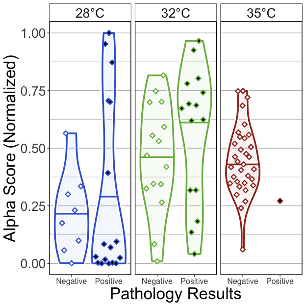<!-- -->

##### Tables

###### (hide)

Press on tabs to display tables. Scroll to see additional rows.

###### GLM

<table class="gt_table" data-quarto-disable-processing="false" data-quarto-bootstrap="false">
  <thead>
    <tr class="gt_heading">
      <td colspan="6" class="gt_heading gt_title gt_font_normal" style>GLM Results</td>
    </tr>
    <tr class="gt_heading">
      <td colspan="6" class="gt_heading gt_subtitle gt_font_normal gt_bottom_border" style>glm(Alpha.Score ~ Temperature*Pathology.Results); Exposed fish</td>
    </tr>
    <tr class="gt_col_headings">
      <th class="gt_col_heading gt_columns_bottom_border gt_left" rowspan="1" colspan="1" scope="col" id="term">term</th>
      <th class="gt_col_heading gt_columns_bottom_border gt_right" rowspan="1" colspan="1" scope="col" id="estimate">estimate</th>
      <th class="gt_col_heading gt_columns_bottom_border gt_right" rowspan="1" colspan="1" scope="col" id="std.error">std.error</th>
      <th class="gt_col_heading gt_columns_bottom_border gt_right" rowspan="1" colspan="1" scope="col" id="statistic">statistic</th>
      <th class="gt_col_heading gt_columns_bottom_border gt_right" rowspan="1" colspan="1" scope="col" id="p.value">p.value</th>
      <th class="gt_col_heading gt_columns_bottom_border gt_left" rowspan="1" colspan="1" scope="col" id="p.adj.sig">p.adj.sig</th>
    </tr>
  </thead>
  <tbody class="gt_table_body">
    <tr class="gt_group_heading_row">
      <th colspan="6" class="gt_group_heading" scope="colgroup" id="Shannon">Shannon</th>
    </tr>
    <tr class="gt_row_group_first"><td headers="Shannon  term" class="gt_row gt_left">(Intercept)</td>
<td headers="Shannon  estimate" class="gt_row gt_right">−1.090</td>
<td headers="Shannon  std.error" class="gt_row gt_right">0.429</td>
<td headers="Shannon  statistic" class="gt_row gt_right">−2.544</td>
<td headers="Shannon  p.value" class="gt_row gt_right">0.013</td>
<td headers="Shannon  p.adj.sig" class="gt_row gt_left">*</td></tr>
    <tr><td headers="Shannon  term" class="gt_row gt_left">Temperature32</td>
<td headers="Shannon  estimate" class="gt_row gt_right">0.889</td>
<td headers="Shannon  std.error" class="gt_row gt_right">0.508</td>
<td headers="Shannon  statistic" class="gt_row gt_right">1.749</td>
<td headers="Shannon  p.value" class="gt_row gt_right">0.084</td>
<td headers="Shannon  p.adj.sig" class="gt_row gt_left">ns</td></tr>
    <tr><td headers="Shannon  term" class="gt_row gt_left">Temperature35</td>
<td headers="Shannon  estimate" class="gt_row gt_right">0.693</td>
<td headers="Shannon  std.error" class="gt_row gt_right">0.468</td>
<td headers="Shannon  statistic" class="gt_row gt_right">1.482</td>
<td headers="Shannon  p.value" class="gt_row gt_right">0.142</td>
<td headers="Shannon  p.adj.sig" class="gt_row gt_left">ns</td></tr>
    <tr><td headers="Shannon  term" class="gt_row gt_left">Pathology.Resultspositive</td>
<td headers="Shannon  estimate" class="gt_row gt_right">0.223</td>
<td headers="Shannon  std.error" class="gt_row gt_right">0.512</td>
<td headers="Shannon  statistic" class="gt_row gt_right">0.436</td>
<td headers="Shannon  p.value" class="gt_row gt_right">≥0.25</td>
<td headers="Shannon  p.adj.sig" class="gt_row gt_left">ns</td></tr>
    <tr><td headers="Shannon  term" class="gt_row gt_left">Temperature32:Pathology.Resultspositive</td>
<td headers="Shannon  estimate" class="gt_row gt_right">0.125</td>
<td headers="Shannon  std.error" class="gt_row gt_right">0.641</td>
<td headers="Shannon  statistic" class="gt_row gt_right">0.195</td>
<td headers="Shannon  p.value" class="gt_row gt_right">≥0.25</td>
<td headers="Shannon  p.adj.sig" class="gt_row gt_left">ns</td></tr>
    <tr><td headers="Shannon  term" class="gt_row gt_left">Temperature35:Pathology.Resultspositive</td>
<td headers="Shannon  estimate" class="gt_row gt_right">−1.122</td>
<td headers="Shannon  std.error" class="gt_row gt_right">1.392</td>
<td headers="Shannon  statistic" class="gt_row gt_right">−0.806</td>
<td headers="Shannon  p.value" class="gt_row gt_right">≥0.25</td>
<td headers="Shannon  p.adj.sig" class="gt_row gt_left">ns</td></tr>
    <tr class="gt_group_heading_row">
      <th colspan="6" class="gt_group_heading" scope="colgroup" id="Simpson">Simpson</th>
    </tr>
    <tr class="gt_row_group_first"><td headers="Simpson  term" class="gt_row gt_left">(Intercept)</td>
<td headers="Simpson  estimate" class="gt_row gt_right">−1.265</td>
<td headers="Simpson  std.error" class="gt_row gt_right">0.458</td>
<td headers="Simpson  statistic" class="gt_row gt_right">−2.760</td>
<td headers="Simpson  p.value" class="gt_row gt_right">0.007</td>
<td headers="Simpson  p.adj.sig" class="gt_row gt_left">**</td></tr>
    <tr><td headers="Simpson  term" class="gt_row gt_left">Temperature32</td>
<td headers="Simpson  estimate" class="gt_row gt_right">1.105</td>
<td headers="Simpson  std.error" class="gt_row gt_right">0.536</td>
<td headers="Simpson  statistic" class="gt_row gt_right">2.061</td>
<td headers="Simpson  p.value" class="gt_row gt_right">0.042</td>
<td headers="Simpson  p.adj.sig" class="gt_row gt_left">*</td></tr>
    <tr><td headers="Simpson  term" class="gt_row gt_left">Temperature35</td>
<td headers="Simpson  estimate" class="gt_row gt_right">1.055</td>
<td headers="Simpson  std.error" class="gt_row gt_right">0.495</td>
<td headers="Simpson  statistic" class="gt_row gt_right">2.130</td>
<td headers="Simpson  p.value" class="gt_row gt_right">0.036</td>
<td headers="Simpson  p.adj.sig" class="gt_row gt_left">*</td></tr>
    <tr><td headers="Simpson  term" class="gt_row gt_left">Pathology.Resultspositive</td>
<td headers="Simpson  estimate" class="gt_row gt_right">0.375</td>
<td headers="Simpson  std.error" class="gt_row gt_right">0.541</td>
<td headers="Simpson  statistic" class="gt_row gt_right">0.694</td>
<td headers="Simpson  p.value" class="gt_row gt_right">≥0.25</td>
<td headers="Simpson  p.adj.sig" class="gt_row gt_left">ns</td></tr>
    <tr><td headers="Simpson  term" class="gt_row gt_left">Temperature32:Pathology.Resultspositive</td>
<td headers="Simpson  estimate" class="gt_row gt_right">0.054</td>
<td headers="Simpson  std.error" class="gt_row gt_right">0.669</td>
<td headers="Simpson  statistic" class="gt_row gt_right">0.081</td>
<td headers="Simpson  p.value" class="gt_row gt_right">≥0.25</td>
<td headers="Simpson  p.adj.sig" class="gt_row gt_left">ns</td></tr>
    <tr><td headers="Simpson  term" class="gt_row gt_left">Temperature35:Pathology.Resultspositive</td>
<td headers="Simpson  estimate" class="gt_row gt_right">−1.154</td>
<td headers="Simpson  std.error" class="gt_row gt_right">1.337</td>
<td headers="Simpson  statistic" class="gt_row gt_right">−0.863</td>
<td headers="Simpson  p.value" class="gt_row gt_right">≥0.25</td>
<td headers="Simpson  p.adj.sig" class="gt_row gt_left">ns</td></tr>
    <tr class="gt_group_heading_row">
      <th colspan="6" class="gt_group_heading" scope="colgroup" id="Richness">Richness</th>
    </tr>
    <tr class="gt_row_group_first"><td headers="Richness  term" class="gt_row gt_left">(Intercept)</td>
<td headers="Richness  estimate" class="gt_row gt_right">−0.421</td>
<td headers="Richness  std.error" class="gt_row gt_right">0.329</td>
<td headers="Richness  statistic" class="gt_row gt_right">−1.279</td>
<td headers="Richness  p.value" class="gt_row gt_right">0.204</td>
<td headers="Richness  p.adj.sig" class="gt_row gt_left">ns</td></tr>
    <tr><td headers="Richness  term" class="gt_row gt_left">Temperature32</td>
<td headers="Richness  estimate" class="gt_row gt_right">0.483</td>
<td headers="Richness  std.error" class="gt_row gt_right">0.405</td>
<td headers="Richness  statistic" class="gt_row gt_right">1.194</td>
<td headers="Richness  p.value" class="gt_row gt_right">0.236</td>
<td headers="Richness  p.adj.sig" class="gt_row gt_left">ns</td></tr>
    <tr><td headers="Richness  term" class="gt_row gt_left">Temperature35</td>
<td headers="Richness  estimate" class="gt_row gt_right">−0.002</td>
<td headers="Richness  std.error" class="gt_row gt_right">0.367</td>
<td headers="Richness  statistic" class="gt_row gt_right">−0.005</td>
<td headers="Richness  p.value" class="gt_row gt_right">≥0.25</td>
<td headers="Richness  p.adj.sig" class="gt_row gt_left">ns</td></tr>
    <tr><td headers="Richness  term" class="gt_row gt_left">Pathology.Resultspositive</td>
<td headers="Richness  estimate" class="gt_row gt_right">−0.390</td>
<td headers="Richness  std.error" class="gt_row gt_right">0.407</td>
<td headers="Richness  statistic" class="gt_row gt_right">−0.957</td>
<td headers="Richness  p.value" class="gt_row gt_right">≥0.25</td>
<td headers="Richness  p.adj.sig" class="gt_row gt_left">ns</td></tr>
    <tr><td headers="Richness  term" class="gt_row gt_left">Temperature32:Pathology.Resultspositive</td>
<td headers="Richness  estimate" class="gt_row gt_right">0.310</td>
<td headers="Richness  std.error" class="gt_row gt_right">0.526</td>
<td headers="Richness  statistic" class="gt_row gt_right">0.589</td>
<td headers="Richness  p.value" class="gt_row gt_right">≥0.25</td>
<td headers="Richness  p.adj.sig" class="gt_row gt_left">ns</td></tr>
    <tr><td headers="Richness  term" class="gt_row gt_left">Temperature35:Pathology.Resultspositive</td>
<td headers="Richness  estimate" class="gt_row gt_right">−0.221</td>
<td headers="Richness  std.error" class="gt_row gt_right">1.125</td>
<td headers="Richness  statistic" class="gt_row gt_right">−0.197</td>
<td headers="Richness  p.value" class="gt_row gt_right">≥0.25</td>
<td headers="Richness  p.adj.sig" class="gt_row gt_left">ns</td></tr>
  </tbody>
  &#10;  
</table>

###### ANOVA

<table class="gt_table" data-quarto-disable-processing="false" data-quarto-bootstrap="false">
  <thead>
    <tr class="gt_heading">
      <td colspan="5" class="gt_heading gt_title gt_font_normal" style>ANOVA of GLM</td>
    </tr>
    <tr class="gt_heading">
      <td colspan="5" class="gt_heading gt_subtitle gt_font_normal gt_bottom_border" style>ANOVA(GLM(Alpha.Score ~ Temperature*Time), type = 2); Exposed fish</td>
    </tr>
    <tr class="gt_col_headings">
      <th class="gt_col_heading gt_columns_bottom_border gt_left" rowspan="1" colspan="1" scope="col" id="term">term</th>
      <th class="gt_col_heading gt_columns_bottom_border gt_right" rowspan="1" colspan="1" scope="col" id="statistic">statistic</th>
      <th class="gt_col_heading gt_columns_bottom_border gt_right" rowspan="1" colspan="1" scope="col" id="df">df</th>
      <th class="gt_col_heading gt_columns_bottom_border gt_right" rowspan="1" colspan="1" scope="col" id="p.value">p.value</th>
      <th class="gt_col_heading gt_columns_bottom_border gt_left" rowspan="1" colspan="1" scope="col" id="sig">sig</th>
    </tr>
  </thead>
  <tbody class="gt_table_body">
    <tr class="gt_group_heading_row">
      <th colspan="5" class="gt_group_heading" scope="colgroup" id="Shannon">Shannon</th>
    </tr>
    <tr class="gt_row_group_first"><td headers="Shannon  term" class="gt_row gt_left">Temperature</td>
<td headers="Shannon  statistic" class="gt_row gt_right">9.895</td>
<td headers="Shannon  df" class="gt_row gt_right">2.000</td>
<td headers="Shannon  p.value" class="gt_row gt_right">0.007</td>
<td headers="Shannon  sig" class="gt_row gt_left">**</td></tr>
    <tr><td headers="Shannon  term" class="gt_row gt_left">Pathology.Results</td>
<td headers="Shannon  statistic" class="gt_row gt_right">0.569</td>
<td headers="Shannon  df" class="gt_row gt_right">1.000</td>
<td headers="Shannon  p.value" class="gt_row gt_right">≥0.25</td>
<td headers="Shannon  sig" class="gt_row gt_left">ns</td></tr>
    <tr><td headers="Shannon  term" class="gt_row gt_left">Temperature:Pathology.Results</td>
<td headers="Shannon  statistic" class="gt_row gt_right">0.997</td>
<td headers="Shannon  df" class="gt_row gt_right">2.000</td>
<td headers="Shannon  p.value" class="gt_row gt_right">≥0.25</td>
<td headers="Shannon  sig" class="gt_row gt_left">ns</td></tr>
    <tr class="gt_group_heading_row">
      <th colspan="5" class="gt_group_heading" scope="colgroup" id="Simpson">Simpson</th>
    </tr>
    <tr class="gt_row_group_first"><td headers="Simpson  term" class="gt_row gt_left">Temperature</td>
<td headers="Simpson  statistic" class="gt_row gt_right">13.663</td>
<td headers="Simpson  df" class="gt_row gt_right">2.000</td>
<td headers="Simpson  p.value" class="gt_row gt_right">0.001</td>
<td headers="Simpson  sig" class="gt_row gt_left">**</td></tr>
    <tr><td headers="Simpson  term" class="gt_row gt_left">Pathology.Results</td>
<td headers="Simpson  statistic" class="gt_row gt_right">1.134</td>
<td headers="Simpson  df" class="gt_row gt_right">1.000</td>
<td headers="Simpson  p.value" class="gt_row gt_right">≥0.25</td>
<td headers="Simpson  sig" class="gt_row gt_left">ns</td></tr>
    <tr><td headers="Simpson  term" class="gt_row gt_left">Temperature:Pathology.Results</td>
<td headers="Simpson  statistic" class="gt_row gt_right">0.999</td>
<td headers="Simpson  df" class="gt_row gt_right">2.000</td>
<td headers="Simpson  p.value" class="gt_row gt_right">≥0.25</td>
<td headers="Simpson  sig" class="gt_row gt_left">ns</td></tr>
    <tr class="gt_group_heading_row">
      <th colspan="5" class="gt_group_heading" scope="colgroup" id="Richness">Richness</th>
    </tr>
    <tr class="gt_row_group_first"><td headers="Richness  term" class="gt_row gt_left">Temperature</td>
<td headers="Richness  statistic" class="gt_row gt_right">8.625</td>
<td headers="Richness  df" class="gt_row gt_right">2.000</td>
<td headers="Richness  p.value" class="gt_row gt_right">0.013</td>
<td headers="Richness  sig" class="gt_row gt_left">*</td></tr>
    <tr><td headers="Richness  term" class="gt_row gt_left">Pathology.Results</td>
<td headers="Richness  statistic" class="gt_row gt_right">0.840</td>
<td headers="Richness  df" class="gt_row gt_right">1.000</td>
<td headers="Richness  p.value" class="gt_row gt_right">≥0.25</td>
<td headers="Richness  sig" class="gt_row gt_left">ns</td></tr>
    <tr><td headers="Richness  term" class="gt_row gt_left">Temperature:Pathology.Results</td>
<td headers="Richness  statistic" class="gt_row gt_right">0.495</td>
<td headers="Richness  df" class="gt_row gt_right">2.000</td>
<td headers="Richness  p.value" class="gt_row gt_right">≥0.25</td>
<td headers="Richness  sig" class="gt_row gt_left">ns</td></tr>
  </tbody>
  &#10;  
</table>

###### Tukey

<table class="gt_table" data-quarto-disable-processing="false" data-quarto-bootstrap="false">
  <thead>
    <tr class="gt_heading">
      <td colspan="11" class="gt_heading gt_title gt_font_normal" style>Pairwise Tukey's HSD, p.adj: Dunnett</td>
    </tr>
    <tr class="gt_heading">
      <td colspan="11" class="gt_heading gt_subtitle gt_font_normal gt_bottom_border" style>Tukey(Alpha.Score ~ Temperature*Time); Exposed fish</td>
    </tr>
    <tr class="gt_col_headings">
      <th class="gt_col_heading gt_columns_bottom_border gt_center" rowspan="1" colspan="1" scope="col" id="Temperature">Temperature</th>
      <th class="gt_col_heading gt_columns_bottom_border gt_left" rowspan="1" colspan="1" scope="col" id=".y.">.y.</th>
      <th class="gt_col_heading gt_columns_bottom_border gt_left" rowspan="1" colspan="1" scope="col" id="term">term</th>
      <th class="gt_col_heading gt_columns_bottom_border gt_left" rowspan="1" colspan="1" scope="col" id="group1">group1</th>
      <th class="gt_col_heading gt_columns_bottom_border gt_left" rowspan="1" colspan="1" scope="col" id="group2">group2</th>
      <th class="gt_col_heading gt_columns_bottom_border gt_right" rowspan="1" colspan="1" scope="col" id="estimate">estimate</th>
      <th class="gt_col_heading gt_columns_bottom_border gt_right" rowspan="1" colspan="1" scope="col" id="std.error">std.error</th>
      <th class="gt_col_heading gt_columns_bottom_border gt_right" rowspan="1" colspan="1" scope="col" id="statistic">statistic</th>
      <th class="gt_col_heading gt_columns_bottom_border gt_right" rowspan="1" colspan="1" scope="col" id="adj.p.value">adj.p.value</th>
      <th class="gt_col_heading gt_columns_bottom_border gt_left" rowspan="1" colspan="1" scope="col" id="Variable">Variable</th>
      <th class="gt_col_heading gt_columns_bottom_border gt_center" rowspan="1" colspan="1" scope="col" id="Group">Group</th>
    </tr>
  </thead>
  <tbody class="gt_table_body">
    <tr class="gt_group_heading_row">
      <th colspan="11" class="gt_group_heading" scope="colgroup" id="Shannon">Shannon</th>
    </tr>
    <tr class="gt_row_group_first"><td headers="Shannon  Temperature" class="gt_row gt_center">28</td>
<td headers="Shannon  .y." class="gt_row gt_left">Alpha.Score</td>
<td headers="Shannon  term" class="gt_row gt_left">Pathology.Results</td>
<td headers="Shannon  group1" class="gt_row gt_left">positive</td>
<td headers="Shannon  group2" class="gt_row gt_left">negative</td>
<td headers="Shannon  estimate" class="gt_row gt_right">0.223</td>
<td headers="Shannon  std.error" class="gt_row gt_right">0.732</td>
<td headers="Shannon  statistic" class="gt_row gt_right">0.305</td>
<td headers="Shannon  adj.p.value" class="gt_row gt_right">≥0.25</td>
<td headers="Shannon  Variable" class="gt_row gt_left">Pathology.Results</td>
<td headers="Shannon  Group" class="gt_row gt_center">28</td></tr>
    <tr><td headers="Shannon  Temperature" class="gt_row gt_center">32</td>
<td headers="Shannon  .y." class="gt_row gt_left">Alpha.Score</td>
<td headers="Shannon  term" class="gt_row gt_left">Pathology.Results</td>
<td headers="Shannon  group1" class="gt_row gt_left">positive</td>
<td headers="Shannon  group2" class="gt_row gt_left">negative</td>
<td headers="Shannon  estimate" class="gt_row gt_right">0.348</td>
<td headers="Shannon  std.error" class="gt_row gt_right">0.383</td>
<td headers="Shannon  statistic" class="gt_row gt_right">0.908</td>
<td headers="Shannon  adj.p.value" class="gt_row gt_right">≥0.25</td>
<td headers="Shannon  Variable" class="gt_row gt_left">Pathology.Results</td>
<td headers="Shannon  Group" class="gt_row gt_center">32</td></tr>
    <tr><td headers="Shannon  Temperature" class="gt_row gt_center">35</td>
<td headers="Shannon  .y." class="gt_row gt_left">Alpha.Score</td>
<td headers="Shannon  term" class="gt_row gt_left">Pathology.Results</td>
<td headers="Shannon  group1" class="gt_row gt_left">positive</td>
<td headers="Shannon  group2" class="gt_row gt_left">negative</td>
<td headers="Shannon  estimate" class="gt_row gt_right">−0.899</td>
<td headers="Shannon  std.error" class="gt_row gt_right">0.659</td>
<td headers="Shannon  statistic" class="gt_row gt_right">−1.365</td>
<td headers="Shannon  adj.p.value" class="gt_row gt_right">0.172</td>
<td headers="Shannon  Variable" class="gt_row gt_left">Pathology.Results</td>
<td headers="Shannon  Group" class="gt_row gt_center">35</td></tr>
    <tr class="gt_group_heading_row">
      <th colspan="11" class="gt_group_heading" scope="colgroup" id="Simpson">Simpson</th>
    </tr>
    <tr class="gt_row_group_first"><td headers="Simpson  Temperature" class="gt_row gt_center">28</td>
<td headers="Simpson  .y." class="gt_row gt_left">Alpha.Score</td>
<td headers="Simpson  term" class="gt_row gt_left">Pathology.Results</td>
<td headers="Simpson  group1" class="gt_row gt_left">positive</td>
<td headers="Simpson  group2" class="gt_row gt_left">negative</td>
<td headers="Simpson  estimate" class="gt_row gt_right">0.375</td>
<td headers="Simpson  std.error" class="gt_row gt_right">0.754</td>
<td headers="Simpson  statistic" class="gt_row gt_right">0.497</td>
<td headers="Simpson  adj.p.value" class="gt_row gt_right">≥0.25</td>
<td headers="Simpson  Variable" class="gt_row gt_left">Pathology.Results</td>
<td headers="Simpson  Group" class="gt_row gt_center">28</td></tr>
    <tr><td headers="Simpson  Temperature" class="gt_row gt_center">32</td>
<td headers="Simpson  .y." class="gt_row gt_left">Alpha.Score</td>
<td headers="Simpson  term" class="gt_row gt_left">Pathology.Results</td>
<td headers="Simpson  group1" class="gt_row gt_left">positive</td>
<td headers="Simpson  group2" class="gt_row gt_left">negative</td>
<td headers="Simpson  estimate" class="gt_row gt_right">0.429</td>
<td headers="Simpson  std.error" class="gt_row gt_right">0.394</td>
<td headers="Simpson  statistic" class="gt_row gt_right">1.089</td>
<td headers="Simpson  adj.p.value" class="gt_row gt_right">≥0.25</td>
<td headers="Simpson  Variable" class="gt_row gt_left">Pathology.Results</td>
<td headers="Simpson  Group" class="gt_row gt_center">32</td></tr>
    <tr><td headers="Simpson  Temperature" class="gt_row gt_center">35</td>
<td headers="Simpson  .y." class="gt_row gt_left">Alpha.Score</td>
<td headers="Simpson  term" class="gt_row gt_left">Pathology.Results</td>
<td headers="Simpson  group1" class="gt_row gt_left">positive</td>
<td headers="Simpson  group2" class="gt_row gt_left">negative</td>
<td headers="Simpson  estimate" class="gt_row gt_right">−0.779</td>
<td headers="Simpson  std.error" class="gt_row gt_right">0.692</td>
<td headers="Simpson  statistic" class="gt_row gt_right">−1.125</td>
<td headers="Simpson  adj.p.value" class="gt_row gt_right">≥0.25</td>
<td headers="Simpson  Variable" class="gt_row gt_left">Pathology.Results</td>
<td headers="Simpson  Group" class="gt_row gt_center">35</td></tr>
    <tr class="gt_group_heading_row">
      <th colspan="11" class="gt_group_heading" scope="colgroup" id="Richness">Richness</th>
    </tr>
    <tr class="gt_row_group_first"><td headers="Richness  Temperature" class="gt_row gt_center">28</td>
<td headers="Richness  .y." class="gt_row gt_left">Alpha.Score</td>
<td headers="Richness  term" class="gt_row gt_left">Pathology.Results</td>
<td headers="Richness  group1" class="gt_row gt_left">positive</td>
<td headers="Richness  group2" class="gt_row gt_left">negative</td>
<td headers="Richness  estimate" class="gt_row gt_right">−0.390</td>
<td headers="Richness  std.error" class="gt_row gt_right">0.608</td>
<td headers="Richness  statistic" class="gt_row gt_right">−0.641</td>
<td headers="Richness  adj.p.value" class="gt_row gt_right">≥0.25</td>
<td headers="Richness  Variable" class="gt_row gt_left">Pathology.Results</td>
<td headers="Richness  Group" class="gt_row gt_center">28</td></tr>
    <tr><td headers="Richness  Temperature" class="gt_row gt_center">32</td>
<td headers="Richness  .y." class="gt_row gt_left">Alpha.Score</td>
<td headers="Richness  term" class="gt_row gt_left">Pathology.Results</td>
<td headers="Richness  group1" class="gt_row gt_left">positive</td>
<td headers="Richness  group2" class="gt_row gt_left">negative</td>
<td headers="Richness  estimate" class="gt_row gt_right">−0.080</td>
<td headers="Richness  std.error" class="gt_row gt_right">0.301</td>
<td headers="Richness  statistic" class="gt_row gt_right">−0.267</td>
<td headers="Richness  adj.p.value" class="gt_row gt_right">≥0.25</td>
<td headers="Richness  Variable" class="gt_row gt_left">Pathology.Results</td>
<td headers="Richness  Group" class="gt_row gt_center">32</td></tr>
    <tr><td headers="Richness  Temperature" class="gt_row gt_center">35</td>
<td headers="Richness  .y." class="gt_row gt_left">Alpha.Score</td>
<td headers="Richness  term" class="gt_row gt_left">Pathology.Results</td>
<td headers="Richness  group1" class="gt_row gt_left">positive</td>
<td headers="Richness  group2" class="gt_row gt_left">negative</td>
<td headers="Richness  estimate" class="gt_row gt_right">−0.611</td>
<td headers="Richness  std.error" class="gt_row gt_right">0.552</td>
<td headers="Richness  statistic" class="gt_row gt_right">−1.107</td>
<td headers="Richness  adj.p.value" class="gt_row gt_right">≥0.25</td>
<td headers="Richness  Variable" class="gt_row gt_left">Pathology.Results</td>
<td headers="Richness  Group" class="gt_row gt_center">35</td></tr>
  </tbody>
  &#10;  
</table>

#### 6B)

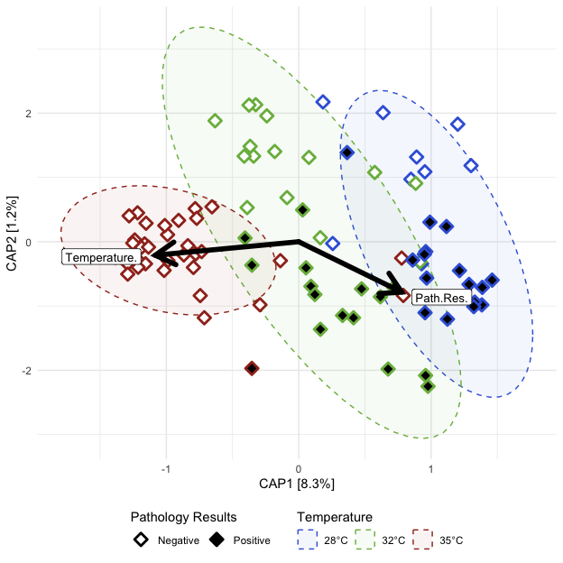<!-- -->

##### Tables

###### (hide)

Press on tabs to display tables. Scroll to see additional rows.

###### Capscale

<table class="gt_table" data-quarto-disable-processing="false" data-quarto-bootstrap="false">
  <thead>
    <tr class="gt_heading">
      <td colspan="7" class="gt_heading gt_title gt_font_normal" style>ADONIS2</td>
    </tr>
    <tr class="gt_heading">
      <td colspan="7" class="gt_heading gt_subtitle gt_font_normal gt_bottom_border" style>adonis2(Beta Distance ~ Temperature*Pathology.Results); Exposed fish</td>
    </tr>
    <tr class="gt_col_headings">
      <th class="gt_col_heading gt_columns_bottom_border gt_left" rowspan="1" colspan="1" scope="col" id="term">term</th>
      <th class="gt_col_heading gt_columns_bottom_border gt_right" rowspan="1" colspan="1" scope="col" id="df">df</th>
      <th class="gt_col_heading gt_columns_bottom_border gt_right" rowspan="1" colspan="1" scope="col" id="SumOfSqs">SumOfSqs</th>
      <th class="gt_col_heading gt_columns_bottom_border gt_right" rowspan="1" colspan="1" scope="col" id="R2">R2</th>
      <th class="gt_col_heading gt_columns_bottom_border gt_right" rowspan="1" colspan="1" scope="col" id="statistic">statistic</th>
      <th class="gt_col_heading gt_columns_bottom_border gt_right" rowspan="1" colspan="1" scope="col" id="p.value">p.value</th>
      <th class="gt_col_heading gt_columns_bottom_border gt_left" rowspan="1" colspan="1" scope="col" id="sig">sig</th>
    </tr>
  </thead>
  <tbody class="gt_table_body">
    <tr class="gt_group_heading_row">
      <th colspan="7" class="gt_group_heading" scope="colgroup" id="bray">bray</th>
    </tr>
    <tr class="gt_row_group_first"><td headers="bray  term" class="gt_row gt_left">Temperature</td>
<td headers="bray  df" class="gt_row gt_right">2.000</td>
<td headers="bray  SumOfSqs" class="gt_row gt_right">5.218</td>
<td headers="bray  R2" class="gt_row gt_right">0.251</td>
<td headers="bray  statistic" class="gt_row gt_right">14.569</td>
<td headers="bray  p.value" class="gt_row gt_right">0.001</td>
<td headers="bray  sig" class="gt_row gt_left">***</td></tr>
    <tr><td headers="bray  term" class="gt_row gt_left">Pathology.Results</td>
<td headers="bray  df" class="gt_row gt_right">1.000</td>
<td headers="bray  SumOfSqs" class="gt_row gt_right">0.263</td>
<td headers="bray  R2" class="gt_row gt_right">0.013</td>
<td headers="bray  statistic" class="gt_row gt_right">1.471</td>
<td headers="bray  p.value" class="gt_row gt_right">0.185</td>
<td headers="bray  sig" class="gt_row gt_left">ns</td></tr>
    <tr><td headers="bray  term" class="gt_row gt_left">Temperature:Pathology.Results</td>
<td headers="bray  df" class="gt_row gt_right">2.000</td>
<td headers="bray  SumOfSqs" class="gt_row gt_right">0.404</td>
<td headers="bray  R2" class="gt_row gt_right">0.019</td>
<td headers="bray  statistic" class="gt_row gt_right">1.127</td>
<td headers="bray  p.value" class="gt_row gt_right">≥0.25</td>
<td headers="bray  sig" class="gt_row gt_left">ns</td></tr>
    <tr><td headers="bray  term" class="gt_row gt_left">Residual</td>
<td headers="bray  df" class="gt_row gt_right">83.000</td>
<td headers="bray  SumOfSqs" class="gt_row gt_right">14.863</td>
<td headers="bray  R2" class="gt_row gt_right">0.716</td>
<td headers="bray  statistic" class="gt_row gt_right">NA</td>
<td headers="bray  p.value" class="gt_row gt_right">NA</td>
<td headers="bray  sig" class="gt_row gt_left">NA</td></tr>
    <tr><td headers="bray  term" class="gt_row gt_left">Total</td>
<td headers="bray  df" class="gt_row gt_right">88.000</td>
<td headers="bray  SumOfSqs" class="gt_row gt_right">20.748</td>
<td headers="bray  R2" class="gt_row gt_right">1.000</td>
<td headers="bray  statistic" class="gt_row gt_right">NA</td>
<td headers="bray  p.value" class="gt_row gt_right">NA</td>
<td headers="bray  sig" class="gt_row gt_left">NA</td></tr>
    <tr class="gt_group_heading_row">
      <th colspan="7" class="gt_group_heading" scope="colgroup" id="canberra">canberra</th>
    </tr>
    <tr class="gt_row_group_first"><td headers="canberra  term" class="gt_row gt_left">Temperature</td>
<td headers="canberra  df" class="gt_row gt_right">2.000</td>
<td headers="canberra  SumOfSqs" class="gt_row gt_right">3.573</td>
<td headers="canberra  R2" class="gt_row gt_right">0.117</td>
<td headers="canberra  statistic" class="gt_row gt_right">5.751</td>
<td headers="canberra  p.value" class="gt_row gt_right">0.001</td>
<td headers="canberra  sig" class="gt_row gt_left">***</td></tr>
    <tr><td headers="canberra  term" class="gt_row gt_left">Pathology.Results</td>
<td headers="canberra  df" class="gt_row gt_right">1.000</td>
<td headers="canberra  SumOfSqs" class="gt_row gt_right">0.488</td>
<td headers="canberra  R2" class="gt_row gt_right">0.016</td>
<td headers="canberra  statistic" class="gt_row gt_right">1.570</td>
<td headers="canberra  p.value" class="gt_row gt_right">0.031</td>
<td headers="canberra  sig" class="gt_row gt_left">*</td></tr>
    <tr><td headers="canberra  term" class="gt_row gt_left">Temperature:Pathology.Results</td>
<td headers="canberra  df" class="gt_row gt_right">2.000</td>
<td headers="canberra  SumOfSqs" class="gt_row gt_right">0.679</td>
<td headers="canberra  R2" class="gt_row gt_right">0.022</td>
<td headers="canberra  statistic" class="gt_row gt_right">1.093</td>
<td headers="canberra  p.value" class="gt_row gt_right">≥0.25</td>
<td headers="canberra  sig" class="gt_row gt_left">ns</td></tr>
    <tr><td headers="canberra  term" class="gt_row gt_left">Residual</td>
<td headers="canberra  df" class="gt_row gt_right">83.000</td>
<td headers="canberra  SumOfSqs" class="gt_row gt_right">25.781</td>
<td headers="canberra  R2" class="gt_row gt_right">0.845</td>
<td headers="canberra  statistic" class="gt_row gt_right">NA</td>
<td headers="canberra  p.value" class="gt_row gt_right">NA</td>
<td headers="canberra  sig" class="gt_row gt_left">NA</td></tr>
    <tr><td headers="canberra  term" class="gt_row gt_left">Total</td>
<td headers="canberra  df" class="gt_row gt_right">88.000</td>
<td headers="canberra  SumOfSqs" class="gt_row gt_right">30.520</td>
<td headers="canberra  R2" class="gt_row gt_right">1.000</td>
<td headers="canberra  statistic" class="gt_row gt_right">NA</td>
<td headers="canberra  p.value" class="gt_row gt_right">NA</td>
<td headers="canberra  sig" class="gt_row gt_left">NA</td></tr>
    <tr class="gt_group_heading_row">
      <th colspan="7" class="gt_group_heading" scope="colgroup" id="gunifrac">gunifrac</th>
    </tr>
    <tr class="gt_row_group_first"><td headers="gunifrac  term" class="gt_row gt_left">Temperature</td>
<td headers="gunifrac  df" class="gt_row gt_right">2.000</td>
<td headers="gunifrac  SumOfSqs" class="gt_row gt_right">3.363</td>
<td headers="gunifrac  R2" class="gt_row gt_right">0.212</td>
<td headers="gunifrac  statistic" class="gt_row gt_right">11.651</td>
<td headers="gunifrac  p.value" class="gt_row gt_right">0.001</td>
<td headers="gunifrac  sig" class="gt_row gt_left">***</td></tr>
    <tr><td headers="gunifrac  term" class="gt_row gt_left">Pathology.Results</td>
<td headers="gunifrac  df" class="gt_row gt_right">1.000</td>
<td headers="gunifrac  SumOfSqs" class="gt_row gt_right">0.234</td>
<td headers="gunifrac  R2" class="gt_row gt_right">0.015</td>
<td headers="gunifrac  statistic" class="gt_row gt_right">1.622</td>
<td headers="gunifrac  p.value" class="gt_row gt_right">0.149</td>
<td headers="gunifrac  sig" class="gt_row gt_left">ns</td></tr>
    <tr><td headers="gunifrac  term" class="gt_row gt_left">Temperature:Pathology.Results</td>
<td headers="gunifrac  df" class="gt_row gt_right">2.000</td>
<td headers="gunifrac  SumOfSqs" class="gt_row gt_right">0.264</td>
<td headers="gunifrac  R2" class="gt_row gt_right">0.017</td>
<td headers="gunifrac  statistic" class="gt_row gt_right">0.915</td>
<td headers="gunifrac  p.value" class="gt_row gt_right">≥0.25</td>
<td headers="gunifrac  sig" class="gt_row gt_left">ns</td></tr>
    <tr><td headers="gunifrac  term" class="gt_row gt_left">Residual</td>
<td headers="gunifrac  df" class="gt_row gt_right">83.000</td>
<td headers="gunifrac  SumOfSqs" class="gt_row gt_right">11.980</td>
<td headers="gunifrac  R2" class="gt_row gt_right">0.756</td>
<td headers="gunifrac  statistic" class="gt_row gt_right">NA</td>
<td headers="gunifrac  p.value" class="gt_row gt_right">NA</td>
<td headers="gunifrac  sig" class="gt_row gt_left">NA</td></tr>
    <tr><td headers="gunifrac  term" class="gt_row gt_left">Total</td>
<td headers="gunifrac  df" class="gt_row gt_right">88.000</td>
<td headers="gunifrac  SumOfSqs" class="gt_row gt_right">15.841</td>
<td headers="gunifrac  R2" class="gt_row gt_right">1.000</td>
<td headers="gunifrac  statistic" class="gt_row gt_right">NA</td>
<td headers="gunifrac  p.value" class="gt_row gt_right">NA</td>
<td headers="gunifrac  sig" class="gt_row gt_left">NA</td></tr>
  </tbody>
  &#10;  
</table>

###### Dispersion (ANOVA)

<table class="gt_table" data-quarto-disable-processing="false" data-quarto-bootstrap="false">
  <thead>
    <tr class="gt_heading">
      <td colspan="7" class="gt_heading gt_title gt_font_normal" style>ANOVA: Homogeneity of Dispersion</td>
    </tr>
    <tr class="gt_heading">
      <td colspan="7" class="gt_heading gt_subtitle gt_font_normal gt_bottom_border" style>ANOVA(Beta Disperson ~ Temperature*Pathology.Results); Exposed fish</td>
    </tr>
    <tr class="gt_col_headings">
      <th class="gt_col_heading gt_columns_bottom_border gt_left" rowspan="1" colspan="1" scope="col" id="term">term</th>
      <th class="gt_col_heading gt_columns_bottom_border gt_right" rowspan="1" colspan="1" scope="col" id="df">df</th>
      <th class="gt_col_heading gt_columns_bottom_border gt_right" rowspan="1" colspan="1" scope="col" id="sumsq">sumsq</th>
      <th class="gt_col_heading gt_columns_bottom_border gt_right" rowspan="1" colspan="1" scope="col" id="meansq">meansq</th>
      <th class="gt_col_heading gt_columns_bottom_border gt_right" rowspan="1" colspan="1" scope="col" id="statistic">statistic</th>
      <th class="gt_col_heading gt_columns_bottom_border gt_right" rowspan="1" colspan="1" scope="col" id="p.value">p.value</th>
      <th class="gt_col_heading gt_columns_bottom_border gt_right" rowspan="1" colspan="1" scope="col" id="sig">sig</th>
    </tr>
  </thead>
  <tbody class="gt_table_body">
    <tr class="gt_group_heading_row">
      <th colspan="7" class="gt_group_heading" scope="colgroup" id="bray">bray</th>
    </tr>
    <tr class="gt_row_group_first"><td headers="bray  term" class="gt_row gt_left">Temp.Path</td>
<td headers="bray  df" class="gt_row gt_right">5.000</td>
<td headers="bray  sumsq" class="gt_row gt_right">0.520</td>
<td headers="bray  meansq" class="gt_row gt_right">0.104</td>
<td headers="bray  statistic" class="gt_row gt_right">4.652</td>
<td headers="bray  p.value" class="gt_row gt_right">&lt;0.001</td>
<td headers="bray  sig" class="gt_row gt_right">***</td></tr>
    <tr><td headers="bray  term" class="gt_row gt_left">Residual</td>
<td headers="bray  df" class="gt_row gt_right">83.000</td>
<td headers="bray  sumsq" class="gt_row gt_right">1.855</td>
<td headers="bray  meansq" class="gt_row gt_right">0.022</td>
<td headers="bray  statistic" class="gt_row gt_right">NA</td>
<td headers="bray  p.value" class="gt_row gt_right">NA</td>
<td headers="bray  sig" class="gt_row gt_right">NA</td></tr>
    <tr class="gt_group_heading_row">
      <th colspan="7" class="gt_group_heading" scope="colgroup" id="canberra">canberra</th>
    </tr>
    <tr class="gt_row_group_first"><td headers="canberra  term" class="gt_row gt_left">Temp.Path</td>
<td headers="canberra  df" class="gt_row gt_right">5.000</td>
<td headers="canberra  sumsq" class="gt_row gt_right">0.625</td>
<td headers="canberra  meansq" class="gt_row gt_right">0.125</td>
<td headers="canberra  statistic" class="gt_row gt_right">13.830</td>
<td headers="canberra  p.value" class="gt_row gt_right">&lt;0.001</td>
<td headers="canberra  sig" class="gt_row gt_right">****</td></tr>
    <tr><td headers="canberra  term" class="gt_row gt_left">Residual</td>
<td headers="canberra  df" class="gt_row gt_right">83.000</td>
<td headers="canberra  sumsq" class="gt_row gt_right">0.750</td>
<td headers="canberra  meansq" class="gt_row gt_right">0.009</td>
<td headers="canberra  statistic" class="gt_row gt_right">NA</td>
<td headers="canberra  p.value" class="gt_row gt_right">NA</td>
<td headers="canberra  sig" class="gt_row gt_right">NA</td></tr>
    <tr class="gt_group_heading_row">
      <th colspan="7" class="gt_group_heading" scope="colgroup" id="gunifrac">gunifrac</th>
    </tr>
    <tr class="gt_row_group_first"><td headers="gunifrac  term" class="gt_row gt_left">Temp.Path</td>
<td headers="gunifrac  df" class="gt_row gt_right">5.000</td>
<td headers="gunifrac  sumsq" class="gt_row gt_right">0.436</td>
<td headers="gunifrac  meansq" class="gt_row gt_right">0.087</td>
<td headers="gunifrac  statistic" class="gt_row gt_right">6.954</td>
<td headers="gunifrac  p.value" class="gt_row gt_right">&lt;0.001</td>
<td headers="gunifrac  sig" class="gt_row gt_right">****</td></tr>
    <tr><td headers="gunifrac  term" class="gt_row gt_left">Residual</td>
<td headers="gunifrac  df" class="gt_row gt_right">83.000</td>
<td headers="gunifrac  sumsq" class="gt_row gt_right">1.040</td>
<td headers="gunifrac  meansq" class="gt_row gt_right">0.013</td>
<td headers="gunifrac  statistic" class="gt_row gt_right">NA</td>
<td headers="gunifrac  p.value" class="gt_row gt_right">NA</td>
<td headers="gunifrac  sig" class="gt_row gt_right">NA</td></tr>
  </tbody>
  &#10;  
</table>

###### Dispersion (Tukey)

<table class="gt_table" data-quarto-disable-processing="false" data-quarto-bootstrap="false">
  <thead>
    <tr class="gt_heading">
      <td colspan="9" class="gt_heading gt_title gt_font_normal" style>Tukey: Homogeneity of Dispersion</td>
    </tr>
    <tr class="gt_heading">
      <td colspan="9" class="gt_heading gt_subtitle gt_font_normal gt_bottom_border" style>Tukey(Beta Disperson ~ Temperature*Pathology.Results); Exposed fish</td>
    </tr>
    <tr class="gt_col_headings">
      <th class="gt_col_heading gt_columns_bottom_border gt_left" rowspan="1" colspan="1" scope="col" id=".y.">.y.</th>
      <th class="gt_col_heading gt_columns_bottom_border gt_left" rowspan="1" colspan="1" scope="col" id="term">term</th>
      <th class="gt_col_heading gt_columns_bottom_border gt_left" rowspan="1" colspan="1" scope="col" id="group1">group1</th>
      <th class="gt_col_heading gt_columns_bottom_border gt_left" rowspan="1" colspan="1" scope="col" id="group2">group2</th>
      <th class="gt_col_heading gt_columns_bottom_border gt_right" rowspan="1" colspan="1" scope="col" id="estimate">estimate</th>
      <th class="gt_col_heading gt_columns_bottom_border gt_right" rowspan="1" colspan="1" scope="col" id="conf.low">conf.low</th>
      <th class="gt_col_heading gt_columns_bottom_border gt_right" rowspan="1" colspan="1" scope="col" id="conf.high">conf.high</th>
      <th class="gt_col_heading gt_columns_bottom_border gt_right" rowspan="1" colspan="1" scope="col" id="adj.p.value">adj.p.value</th>
      <th class="gt_col_heading gt_columns_bottom_border gt_left" rowspan="1" colspan="1" scope="col" id="sig">sig</th>
    </tr>
  </thead>
  <tbody class="gt_table_body">
    <tr class="gt_group_heading_row">
      <th colspan="9" class="gt_group_heading" scope="colgroup" id="bray">bray</th>
    </tr>
    <tr class="gt_row_group_first"><td headers="bray  .y." class="gt_row gt_left">Distance</td>
<td headers="bray  term" class="gt_row gt_left">Temp.Path</td>
<td headers="bray  group1" class="gt_row gt_left">28°C__pos</td>
<td headers="bray  group2" class="gt_row gt_left">28°C__neg</td>
<td headers="bray  estimate" class="gt_row gt_right">0.022</td>
<td headers="bray  conf.low" class="gt_row gt_right">−0.165</td>
<td headers="bray  conf.high" class="gt_row gt_right">0.209</td>
<td headers="bray  adj.p.value" class="gt_row gt_right">≥0.25</td>
<td headers="bray  sig" class="gt_row gt_left">ns</td></tr>
    <tr><td headers="bray  .y." class="gt_row gt_left">Distance</td>
<td headers="bray  term" class="gt_row gt_left">Temp.Path</td>
<td headers="bray  group1" class="gt_row gt_left">32°C__neg</td>
<td headers="bray  group2" class="gt_row gt_left">28°C__neg</td>
<td headers="bray  estimate" class="gt_row gt_right">−0.086</td>
<td headers="bray  conf.low" class="gt_row gt_right">−0.277</td>
<td headers="bray  conf.high" class="gt_row gt_right">0.105</td>
<td headers="bray  adj.p.value" class="gt_row gt_right">≥0.25</td>
<td headers="bray  sig" class="gt_row gt_left">ns</td></tr>
    <tr><td headers="bray  .y." class="gt_row gt_left">Distance</td>
<td headers="bray  term" class="gt_row gt_left">Temp.Path</td>
<td headers="bray  group1" class="gt_row gt_left">32°C__pos</td>
<td headers="bray  group2" class="gt_row gt_left">28°C__neg</td>
<td headers="bray  estimate" class="gt_row gt_right">0.015</td>
<td headers="bray  conf.low" class="gt_row gt_right">−0.176</td>
<td headers="bray  conf.high" class="gt_row gt_right">0.206</td>
<td headers="bray  adj.p.value" class="gt_row gt_right">≥0.25</td>
<td headers="bray  sig" class="gt_row gt_left">ns</td></tr>
    <tr><td headers="bray  .y." class="gt_row gt_left">Distance</td>
<td headers="bray  term" class="gt_row gt_left">Temp.Path</td>
<td headers="bray  group1" class="gt_row gt_left">35°C__neg</td>
<td headers="bray  group2" class="gt_row gt_left">28°C__neg</td>
<td headers="bray  estimate" class="gt_row gt_right">−0.126</td>
<td headers="bray  conf.low" class="gt_row gt_right">−0.298</td>
<td headers="bray  conf.high" class="gt_row gt_right">0.046</td>
<td headers="bray  adj.p.value" class="gt_row gt_right">≥0.25</td>
<td headers="bray  sig" class="gt_row gt_left">ns</td></tr>
    <tr><td headers="bray  .y." class="gt_row gt_left">Distance</td>
<td headers="bray  term" class="gt_row gt_left">Temp.Path</td>
<td headers="bray  group1" class="gt_row gt_left">35°C__pos</td>
<td headers="bray  group2" class="gt_row gt_left">28°C__neg</td>
<td headers="bray  estimate" class="gt_row gt_right">−0.434</td>
<td headers="bray  conf.low" class="gt_row gt_right">−0.896</td>
<td headers="bray  conf.high" class="gt_row gt_right">0.029</td>
<td headers="bray  adj.p.value" class="gt_row gt_right">0.079</td>
<td headers="bray  sig" class="gt_row gt_left">ns</td></tr>
    <tr><td headers="bray  .y." class="gt_row gt_left">Distance</td>
<td headers="bray  term" class="gt_row gt_left">Temp.Path</td>
<td headers="bray  group1" class="gt_row gt_left">32°C__neg</td>
<td headers="bray  group2" class="gt_row gt_left">28°C__pos</td>
<td headers="bray  estimate" class="gt_row gt_right">−0.108</td>
<td headers="bray  conf.low" class="gt_row gt_right">−0.263</td>
<td headers="bray  conf.high" class="gt_row gt_right">0.046</td>
<td headers="bray  adj.p.value" class="gt_row gt_right">≥0.25</td>
<td headers="bray  sig" class="gt_row gt_left">ns</td></tr>
    <tr><td headers="bray  .y." class="gt_row gt_left">Distance</td>
<td headers="bray  term" class="gt_row gt_left">Temp.Path</td>
<td headers="bray  group1" class="gt_row gt_left">32°C__pos</td>
<td headers="bray  group2" class="gt_row gt_left">28°C__pos</td>
<td headers="bray  estimate" class="gt_row gt_right">−0.007</td>
<td headers="bray  conf.low" class="gt_row gt_right">−0.161</td>
<td headers="bray  conf.high" class="gt_row gt_right">0.148</td>
<td headers="bray  adj.p.value" class="gt_row gt_right">≥0.25</td>
<td headers="bray  sig" class="gt_row gt_left">ns</td></tr>
    <tr><td headers="bray  .y." class="gt_row gt_left">Distance</td>
<td headers="bray  term" class="gt_row gt_left">Temp.Path</td>
<td headers="bray  group1" class="gt_row gt_left">35°C__neg</td>
<td headers="bray  group2" class="gt_row gt_left">28°C__pos</td>
<td headers="bray  estimate" class="gt_row gt_right">−0.148</td>
<td headers="bray  conf.low" class="gt_row gt_right">−0.278</td>
<td headers="bray  conf.high" class="gt_row gt_right">−0.017</td>
<td headers="bray  adj.p.value" class="gt_row gt_right">0.017</td>
<td headers="bray  sig" class="gt_row gt_left">*</td></tr>
    <tr><td headers="bray  .y." class="gt_row gt_left">Distance</td>
<td headers="bray  term" class="gt_row gt_left">Temp.Path</td>
<td headers="bray  group1" class="gt_row gt_left">35°C__pos</td>
<td headers="bray  group2" class="gt_row gt_left">28°C__pos</td>
<td headers="bray  estimate" class="gt_row gt_right">−0.456</td>
<td headers="bray  conf.low" class="gt_row gt_right">−0.905</td>
<td headers="bray  conf.high" class="gt_row gt_right">−0.007</td>
<td headers="bray  adj.p.value" class="gt_row gt_right">0.044</td>
<td headers="bray  sig" class="gt_row gt_left">*</td></tr>
    <tr><td headers="bray  .y." class="gt_row gt_left">Distance</td>
<td headers="bray  term" class="gt_row gt_left">Temp.Path</td>
<td headers="bray  group1" class="gt_row gt_left">32°C__pos</td>
<td headers="bray  group2" class="gt_row gt_left">32°C__neg</td>
<td headers="bray  estimate" class="gt_row gt_right">0.101</td>
<td headers="bray  conf.low" class="gt_row gt_right">−0.058</td>
<td headers="bray  conf.high" class="gt_row gt_right">0.261</td>
<td headers="bray  adj.p.value" class="gt_row gt_right">≥0.25</td>
<td headers="bray  sig" class="gt_row gt_left">ns</td></tr>
    <tr><td headers="bray  .y." class="gt_row gt_left">Distance</td>
<td headers="bray  term" class="gt_row gt_left">Temp.Path</td>
<td headers="bray  group1" class="gt_row gt_left">35°C__neg</td>
<td headers="bray  group2" class="gt_row gt_left">32°C__neg</td>
<td headers="bray  estimate" class="gt_row gt_right">−0.039</td>
<td headers="bray  conf.low" class="gt_row gt_right">−0.175</td>
<td headers="bray  conf.high" class="gt_row gt_right">0.096</td>
<td headers="bray  adj.p.value" class="gt_row gt_right">≥0.25</td>
<td headers="bray  sig" class="gt_row gt_left">ns</td></tr>
    <tr><td headers="bray  .y." class="gt_row gt_left">Distance</td>
<td headers="bray  term" class="gt_row gt_left">Temp.Path</td>
<td headers="bray  group1" class="gt_row gt_left">35°C__pos</td>
<td headers="bray  group2" class="gt_row gt_left">32°C__neg</td>
<td headers="bray  estimate" class="gt_row gt_right">−0.348</td>
<td headers="bray  conf.low" class="gt_row gt_right">−0.798</td>
<td headers="bray  conf.high" class="gt_row gt_right">0.103</td>
<td headers="bray  adj.p.value" class="gt_row gt_right">0.226</td>
<td headers="bray  sig" class="gt_row gt_left">ns</td></tr>
    <tr><td headers="bray  .y." class="gt_row gt_left">Distance</td>
<td headers="bray  term" class="gt_row gt_left">Temp.Path</td>
<td headers="bray  group1" class="gt_row gt_left">35°C__neg</td>
<td headers="bray  group2" class="gt_row gt_left">32°C__pos</td>
<td headers="bray  estimate" class="gt_row gt_right">−0.141</td>
<td headers="bray  conf.low" class="gt_row gt_right">−0.277</td>
<td headers="bray  conf.high" class="gt_row gt_right">−0.005</td>
<td headers="bray  adj.p.value" class="gt_row gt_right">0.038</td>
<td headers="bray  sig" class="gt_row gt_left">*</td></tr>
    <tr><td headers="bray  .y." class="gt_row gt_left">Distance</td>
<td headers="bray  term" class="gt_row gt_left">Temp.Path</td>
<td headers="bray  group1" class="gt_row gt_left">35°C__pos</td>
<td headers="bray  group2" class="gt_row gt_left">32°C__pos</td>
<td headers="bray  estimate" class="gt_row gt_right">−0.449</td>
<td headers="bray  conf.low" class="gt_row gt_right">−0.899</td>
<td headers="bray  conf.high" class="gt_row gt_right">0.001</td>
<td headers="bray  adj.p.value" class="gt_row gt_right">0.051</td>
<td headers="bray  sig" class="gt_row gt_left">ns</td></tr>
    <tr><td headers="bray  .y." class="gt_row gt_left">Distance</td>
<td headers="bray  term" class="gt_row gt_left">Temp.Path</td>
<td headers="bray  group1" class="gt_row gt_left">35°C__pos</td>
<td headers="bray  group2" class="gt_row gt_left">35°C__neg</td>
<td headers="bray  estimate" class="gt_row gt_right">−0.308</td>
<td headers="bray  conf.low" class="gt_row gt_right">−0.751</td>
<td headers="bray  conf.high" class="gt_row gt_right">0.135</td>
<td headers="bray  adj.p.value" class="gt_row gt_right">≥0.25</td>
<td headers="bray  sig" class="gt_row gt_left">ns</td></tr>
    <tr class="gt_group_heading_row">
      <th colspan="9" class="gt_group_heading" scope="colgroup" id="canberra">canberra</th>
    </tr>
    <tr class="gt_row_group_first"><td headers="canberra  .y." class="gt_row gt_left">Distance</td>
<td headers="canberra  term" class="gt_row gt_left">Temp.Path</td>
<td headers="canberra  group1" class="gt_row gt_left">28°C__pos</td>
<td headers="canberra  group2" class="gt_row gt_left">28°C__neg</td>
<td headers="canberra  estimate" class="gt_row gt_right">0.045</td>
<td headers="canberra  conf.low" class="gt_row gt_right">−0.074</td>
<td headers="canberra  conf.high" class="gt_row gt_right">0.164</td>
<td headers="canberra  adj.p.value" class="gt_row gt_right">≥0.25</td>
<td headers="canberra  sig" class="gt_row gt_left">ns</td></tr>
    <tr><td headers="canberra  .y." class="gt_row gt_left">Distance</td>
<td headers="canberra  term" class="gt_row gt_left">Temp.Path</td>
<td headers="canberra  group1" class="gt_row gt_left">32°C__neg</td>
<td headers="canberra  group2" class="gt_row gt_left">28°C__neg</td>
<td headers="canberra  estimate" class="gt_row gt_right">−0.123</td>
<td headers="canberra  conf.low" class="gt_row gt_right">−0.244</td>
<td headers="canberra  conf.high" class="gt_row gt_right">−0.002</td>
<td headers="canberra  adj.p.value" class="gt_row gt_right">0.045</td>
<td headers="canberra  sig" class="gt_row gt_left">*</td></tr>
    <tr><td headers="canberra  .y." class="gt_row gt_left">Distance</td>
<td headers="canberra  term" class="gt_row gt_left">Temp.Path</td>
<td headers="canberra  group1" class="gt_row gt_left">32°C__pos</td>
<td headers="canberra  group2" class="gt_row gt_left">28°C__neg</td>
<td headers="canberra  estimate" class="gt_row gt_right">−0.042</td>
<td headers="canberra  conf.low" class="gt_row gt_right">−0.164</td>
<td headers="canberra  conf.high" class="gt_row gt_right">0.079</td>
<td headers="canberra  adj.p.value" class="gt_row gt_right">≥0.25</td>
<td headers="canberra  sig" class="gt_row gt_left">ns</td></tr>
    <tr><td headers="canberra  .y." class="gt_row gt_left">Distance</td>
<td headers="canberra  term" class="gt_row gt_left">Temp.Path</td>
<td headers="canberra  group1" class="gt_row gt_left">35°C__neg</td>
<td headers="canberra  group2" class="gt_row gt_left">28°C__neg</td>
<td headers="canberra  estimate" class="gt_row gt_right">−0.105</td>
<td headers="canberra  conf.low" class="gt_row gt_right">−0.214</td>
<td headers="canberra  conf.high" class="gt_row gt_right">0.005</td>
<td headers="canberra  adj.p.value" class="gt_row gt_right">0.068</td>
<td headers="canberra  sig" class="gt_row gt_left">ns</td></tr>
    <tr><td headers="canberra  .y." class="gt_row gt_left">Distance</td>
<td headers="canberra  term" class="gt_row gt_left">Temp.Path</td>
<td headers="canberra  group1" class="gt_row gt_left">35°C__pos</td>
<td headers="canberra  group2" class="gt_row gt_left">28°C__neg</td>
<td headers="canberra  estimate" class="gt_row gt_right">−0.588</td>
<td headers="canberra  conf.low" class="gt_row gt_right">−0.883</td>
<td headers="canberra  conf.high" class="gt_row gt_right">−0.294</td>
<td headers="canberra  adj.p.value" class="gt_row gt_right">&lt;0.001</td>
<td headers="canberra  sig" class="gt_row gt_left">****</td></tr>
    <tr><td headers="canberra  .y." class="gt_row gt_left">Distance</td>
<td headers="canberra  term" class="gt_row gt_left">Temp.Path</td>
<td headers="canberra  group1" class="gt_row gt_left">32°C__neg</td>
<td headers="canberra  group2" class="gt_row gt_left">28°C__pos</td>
<td headers="canberra  estimate" class="gt_row gt_right">−0.168</td>
<td headers="canberra  conf.low" class="gt_row gt_right">−0.267</td>
<td headers="canberra  conf.high" class="gt_row gt_right">−0.070</td>
<td headers="canberra  adj.p.value" class="gt_row gt_right">&lt;0.001</td>
<td headers="canberra  sig" class="gt_row gt_left">****</td></tr>
    <tr><td headers="canberra  .y." class="gt_row gt_left">Distance</td>
<td headers="canberra  term" class="gt_row gt_left">Temp.Path</td>
<td headers="canberra  group1" class="gt_row gt_left">32°C__pos</td>
<td headers="canberra  group2" class="gt_row gt_left">28°C__pos</td>
<td headers="canberra  estimate" class="gt_row gt_right">−0.088</td>
<td headers="canberra  conf.low" class="gt_row gt_right">−0.186</td>
<td headers="canberra  conf.high" class="gt_row gt_right">0.010</td>
<td headers="canberra  adj.p.value" class="gt_row gt_right">0.107</td>
<td headers="canberra  sig" class="gt_row gt_left">ns</td></tr>
    <tr><td headers="canberra  .y." class="gt_row gt_left">Distance</td>
<td headers="canberra  term" class="gt_row gt_left">Temp.Path</td>
<td headers="canberra  group1" class="gt_row gt_left">35°C__neg</td>
<td headers="canberra  group2" class="gt_row gt_left">28°C__pos</td>
<td headers="canberra  estimate" class="gt_row gt_right">−0.150</td>
<td headers="canberra  conf.low" class="gt_row gt_right">−0.233</td>
<td headers="canberra  conf.high" class="gt_row gt_right">−0.067</td>
<td headers="canberra  adj.p.value" class="gt_row gt_right">&lt;0.001</td>
<td headers="canberra  sig" class="gt_row gt_left">****</td></tr>
    <tr><td headers="canberra  .y." class="gt_row gt_left">Distance</td>
<td headers="canberra  term" class="gt_row gt_left">Temp.Path</td>
<td headers="canberra  group1" class="gt_row gt_left">35°C__pos</td>
<td headers="canberra  group2" class="gt_row gt_left">28°C__pos</td>
<td headers="canberra  estimate" class="gt_row gt_right">−0.634</td>
<td headers="canberra  conf.low" class="gt_row gt_right">−0.919</td>
<td headers="canberra  conf.high" class="gt_row gt_right">−0.348</td>
<td headers="canberra  adj.p.value" class="gt_row gt_right">&lt;0.001</td>
<td headers="canberra  sig" class="gt_row gt_left">****</td></tr>
    <tr><td headers="canberra  .y." class="gt_row gt_left">Distance</td>
<td headers="canberra  term" class="gt_row gt_left">Temp.Path</td>
<td headers="canberra  group1" class="gt_row gt_left">32°C__pos</td>
<td headers="canberra  group2" class="gt_row gt_left">32°C__neg</td>
<td headers="canberra  estimate" class="gt_row gt_right">0.080</td>
<td headers="canberra  conf.low" class="gt_row gt_right">−0.021</td>
<td headers="canberra  conf.high" class="gt_row gt_right">0.182</td>
<td headers="canberra  adj.p.value" class="gt_row gt_right">0.199</td>
<td headers="canberra  sig" class="gt_row gt_left">ns</td></tr>
    <tr><td headers="canberra  .y." class="gt_row gt_left">Distance</td>
<td headers="canberra  term" class="gt_row gt_left">Temp.Path</td>
<td headers="canberra  group1" class="gt_row gt_left">35°C__neg</td>
<td headers="canberra  group2" class="gt_row gt_left">32°C__neg</td>
<td headers="canberra  estimate" class="gt_row gt_right">0.018</td>
<td headers="canberra  conf.low" class="gt_row gt_right">−0.068</td>
<td headers="canberra  conf.high" class="gt_row gt_right">0.105</td>
<td headers="canberra  adj.p.value" class="gt_row gt_right">≥0.25</td>
<td headers="canberra  sig" class="gt_row gt_left">ns</td></tr>
    <tr><td headers="canberra  .y." class="gt_row gt_left">Distance</td>
<td headers="canberra  term" class="gt_row gt_left">Temp.Path</td>
<td headers="canberra  group1" class="gt_row gt_left">35°C__pos</td>
<td headers="canberra  group2" class="gt_row gt_left">32°C__neg</td>
<td headers="canberra  estimate" class="gt_row gt_right">−0.465</td>
<td headers="canberra  conf.low" class="gt_row gt_right">−0.752</td>
<td headers="canberra  conf.high" class="gt_row gt_right">−0.179</td>
<td headers="canberra  adj.p.value" class="gt_row gt_right">&lt;0.001</td>
<td headers="canberra  sig" class="gt_row gt_left">***</td></tr>
    <tr><td headers="canberra  .y." class="gt_row gt_left">Distance</td>
<td headers="canberra  term" class="gt_row gt_left">Temp.Path</td>
<td headers="canberra  group1" class="gt_row gt_left">35°C__neg</td>
<td headers="canberra  group2" class="gt_row gt_left">32°C__pos</td>
<td headers="canberra  estimate" class="gt_row gt_right">−0.062</td>
<td headers="canberra  conf.low" class="gt_row gt_right">−0.149</td>
<td headers="canberra  conf.high" class="gt_row gt_right">0.024</td>
<td headers="canberra  adj.p.value" class="gt_row gt_right">≥0.25</td>
<td headers="canberra  sig" class="gt_row gt_left">ns</td></tr>
    <tr><td headers="canberra  .y." class="gt_row gt_left">Distance</td>
<td headers="canberra  term" class="gt_row gt_left">Temp.Path</td>
<td headers="canberra  group1" class="gt_row gt_left">35°C__pos</td>
<td headers="canberra  group2" class="gt_row gt_left">32°C__pos</td>
<td headers="canberra  estimate" class="gt_row gt_right">−0.546</td>
<td headers="canberra  conf.low" class="gt_row gt_right">−0.832</td>
<td headers="canberra  conf.high" class="gt_row gt_right">−0.259</td>
<td headers="canberra  adj.p.value" class="gt_row gt_right">&lt;0.001</td>
<td headers="canberra  sig" class="gt_row gt_left">****</td></tr>
    <tr><td headers="canberra  .y." class="gt_row gt_left">Distance</td>
<td headers="canberra  term" class="gt_row gt_left">Temp.Path</td>
<td headers="canberra  group1" class="gt_row gt_left">35°C__pos</td>
<td headers="canberra  group2" class="gt_row gt_left">35°C__neg</td>
<td headers="canberra  estimate" class="gt_row gt_right">−0.484</td>
<td headers="canberra  conf.low" class="gt_row gt_right">−0.765</td>
<td headers="canberra  conf.high" class="gt_row gt_right">−0.202</td>
<td headers="canberra  adj.p.value" class="gt_row gt_right">&lt;0.001</td>
<td headers="canberra  sig" class="gt_row gt_left">****</td></tr>
    <tr class="gt_group_heading_row">
      <th colspan="9" class="gt_group_heading" scope="colgroup" id="gunifrac">gunifrac</th>
    </tr>
    <tr class="gt_row_group_first"><td headers="gunifrac  .y." class="gt_row gt_left">Distance</td>
<td headers="gunifrac  term" class="gt_row gt_left">Temp.Path</td>
<td headers="gunifrac  group1" class="gt_row gt_left">28°C__pos</td>
<td headers="gunifrac  group2" class="gt_row gt_left">28°C__neg</td>
<td headers="gunifrac  estimate" class="gt_row gt_right">0.011</td>
<td headers="gunifrac  conf.low" class="gt_row gt_right">−0.129</td>
<td headers="gunifrac  conf.high" class="gt_row gt_right">0.151</td>
<td headers="gunifrac  adj.p.value" class="gt_row gt_right">≥0.25</td>
<td headers="gunifrac  sig" class="gt_row gt_left">ns</td></tr>
    <tr><td headers="gunifrac  .y." class="gt_row gt_left">Distance</td>
<td headers="gunifrac  term" class="gt_row gt_left">Temp.Path</td>
<td headers="gunifrac  group1" class="gt_row gt_left">32°C__neg</td>
<td headers="gunifrac  group2" class="gt_row gt_left">28°C__neg</td>
<td headers="gunifrac  estimate" class="gt_row gt_right">−0.091</td>
<td headers="gunifrac  conf.low" class="gt_row gt_right">−0.234</td>
<td headers="gunifrac  conf.high" class="gt_row gt_right">0.052</td>
<td headers="gunifrac  adj.p.value" class="gt_row gt_right">≥0.25</td>
<td headers="gunifrac  sig" class="gt_row gt_left">ns</td></tr>
    <tr><td headers="gunifrac  .y." class="gt_row gt_left">Distance</td>
<td headers="gunifrac  term" class="gt_row gt_left">Temp.Path</td>
<td headers="gunifrac  group1" class="gt_row gt_left">32°C__pos</td>
<td headers="gunifrac  group2" class="gt_row gt_left">28°C__neg</td>
<td headers="gunifrac  estimate" class="gt_row gt_right">−0.014</td>
<td headers="gunifrac  conf.low" class="gt_row gt_right">−0.157</td>
<td headers="gunifrac  conf.high" class="gt_row gt_right">0.129</td>
<td headers="gunifrac  adj.p.value" class="gt_row gt_right">≥0.25</td>
<td headers="gunifrac  sig" class="gt_row gt_left">ns</td></tr>
    <tr><td headers="gunifrac  .y." class="gt_row gt_left">Distance</td>
<td headers="gunifrac  term" class="gt_row gt_left">Temp.Path</td>
<td headers="gunifrac  group1" class="gt_row gt_left">35°C__neg</td>
<td headers="gunifrac  group2" class="gt_row gt_left">28°C__neg</td>
<td headers="gunifrac  estimate" class="gt_row gt_right">−0.129</td>
<td headers="gunifrac  conf.low" class="gt_row gt_right">−0.258</td>
<td headers="gunifrac  conf.high" class="gt_row gt_right">0.000</td>
<td headers="gunifrac  adj.p.value" class="gt_row gt_right">0.049</td>
<td headers="gunifrac  sig" class="gt_row gt_left">*</td></tr>
    <tr><td headers="gunifrac  .y." class="gt_row gt_left">Distance</td>
<td headers="gunifrac  term" class="gt_row gt_left">Temp.Path</td>
<td headers="gunifrac  group1" class="gt_row gt_left">35°C__pos</td>
<td headers="gunifrac  group2" class="gt_row gt_left">28°C__neg</td>
<td headers="gunifrac  estimate" class="gt_row gt_right">−0.411</td>
<td headers="gunifrac  conf.low" class="gt_row gt_right">−0.758</td>
<td headers="gunifrac  conf.high" class="gt_row gt_right">−0.065</td>
<td headers="gunifrac  adj.p.value" class="gt_row gt_right">0.011</td>
<td headers="gunifrac  sig" class="gt_row gt_left">*</td></tr>
    <tr><td headers="gunifrac  .y." class="gt_row gt_left">Distance</td>
<td headers="gunifrac  term" class="gt_row gt_left">Temp.Path</td>
<td headers="gunifrac  group1" class="gt_row gt_left">32°C__neg</td>
<td headers="gunifrac  group2" class="gt_row gt_left">28°C__pos</td>
<td headers="gunifrac  estimate" class="gt_row gt_right">−0.102</td>
<td headers="gunifrac  conf.low" class="gt_row gt_right">−0.218</td>
<td headers="gunifrac  conf.high" class="gt_row gt_right">0.014</td>
<td headers="gunifrac  adj.p.value" class="gt_row gt_right">0.115</td>
<td headers="gunifrac  sig" class="gt_row gt_left">ns</td></tr>
    <tr><td headers="gunifrac  .y." class="gt_row gt_left">Distance</td>
<td headers="gunifrac  term" class="gt_row gt_left">Temp.Path</td>
<td headers="gunifrac  group1" class="gt_row gt_left">32°C__pos</td>
<td headers="gunifrac  group2" class="gt_row gt_left">28°C__pos</td>
<td headers="gunifrac  estimate" class="gt_row gt_right">−0.025</td>
<td headers="gunifrac  conf.low" class="gt_row gt_right">−0.141</td>
<td headers="gunifrac  conf.high" class="gt_row gt_right">0.091</td>
<td headers="gunifrac  adj.p.value" class="gt_row gt_right">≥0.25</td>
<td headers="gunifrac  sig" class="gt_row gt_left">ns</td></tr>
    <tr><td headers="gunifrac  .y." class="gt_row gt_left">Distance</td>
<td headers="gunifrac  term" class="gt_row gt_left">Temp.Path</td>
<td headers="gunifrac  group1" class="gt_row gt_left">35°C__neg</td>
<td headers="gunifrac  group2" class="gt_row gt_left">28°C__pos</td>
<td headers="gunifrac  estimate" class="gt_row gt_right">−0.140</td>
<td headers="gunifrac  conf.low" class="gt_row gt_right">−0.238</td>
<td headers="gunifrac  conf.high" class="gt_row gt_right">−0.043</td>
<td headers="gunifrac  adj.p.value" class="gt_row gt_right">&lt;0.001</td>
<td headers="gunifrac  sig" class="gt_row gt_left">***</td></tr>
    <tr><td headers="gunifrac  .y." class="gt_row gt_left">Distance</td>
<td headers="gunifrac  term" class="gt_row gt_left">Temp.Path</td>
<td headers="gunifrac  group1" class="gt_row gt_left">35°C__pos</td>
<td headers="gunifrac  group2" class="gt_row gt_left">28°C__pos</td>
<td headers="gunifrac  estimate" class="gt_row gt_right">−0.423</td>
<td headers="gunifrac  conf.low" class="gt_row gt_right">−0.759</td>
<td headers="gunifrac  conf.high" class="gt_row gt_right">−0.087</td>
<td headers="gunifrac  adj.p.value" class="gt_row gt_right">0.006</td>
<td headers="gunifrac  sig" class="gt_row gt_left">**</td></tr>
    <tr><td headers="gunifrac  .y." class="gt_row gt_left">Distance</td>
<td headers="gunifrac  term" class="gt_row gt_left">Temp.Path</td>
<td headers="gunifrac  group1" class="gt_row gt_left">32°C__pos</td>
<td headers="gunifrac  group2" class="gt_row gt_left">32°C__neg</td>
<td headers="gunifrac  estimate" class="gt_row gt_right">0.077</td>
<td headers="gunifrac  conf.low" class="gt_row gt_right">−0.042</td>
<td headers="gunifrac  conf.high" class="gt_row gt_right">0.196</td>
<td headers="gunifrac  adj.p.value" class="gt_row gt_right">≥0.25</td>
<td headers="gunifrac  sig" class="gt_row gt_left">ns</td></tr>
    <tr><td headers="gunifrac  .y." class="gt_row gt_left">Distance</td>
<td headers="gunifrac  term" class="gt_row gt_left">Temp.Path</td>
<td headers="gunifrac  group1" class="gt_row gt_left">35°C__neg</td>
<td headers="gunifrac  group2" class="gt_row gt_left">32°C__neg</td>
<td headers="gunifrac  estimate" class="gt_row gt_right">−0.038</td>
<td headers="gunifrac  conf.low" class="gt_row gt_right">−0.140</td>
<td headers="gunifrac  conf.high" class="gt_row gt_right">0.064</td>
<td headers="gunifrac  adj.p.value" class="gt_row gt_right">≥0.25</td>
<td headers="gunifrac  sig" class="gt_row gt_left">ns</td></tr>
    <tr><td headers="gunifrac  .y." class="gt_row gt_left">Distance</td>
<td headers="gunifrac  term" class="gt_row gt_left">Temp.Path</td>
<td headers="gunifrac  group1" class="gt_row gt_left">35°C__pos</td>
<td headers="gunifrac  group2" class="gt_row gt_left">32°C__neg</td>
<td headers="gunifrac  estimate" class="gt_row gt_right">−0.321</td>
<td headers="gunifrac  conf.low" class="gt_row gt_right">−0.658</td>
<td headers="gunifrac  conf.high" class="gt_row gt_right">0.017</td>
<td headers="gunifrac  adj.p.value" class="gt_row gt_right">0.072</td>
<td headers="gunifrac  sig" class="gt_row gt_left">ns</td></tr>
    <tr><td headers="gunifrac  .y." class="gt_row gt_left">Distance</td>
<td headers="gunifrac  term" class="gt_row gt_left">Temp.Path</td>
<td headers="gunifrac  group1" class="gt_row gt_left">35°C__neg</td>
<td headers="gunifrac  group2" class="gt_row gt_left">32°C__pos</td>
<td headers="gunifrac  estimate" class="gt_row gt_right">−0.115</td>
<td headers="gunifrac  conf.low" class="gt_row gt_right">−0.217</td>
<td headers="gunifrac  conf.high" class="gt_row gt_right">−0.013</td>
<td headers="gunifrac  adj.p.value" class="gt_row gt_right">0.017</td>
<td headers="gunifrac  sig" class="gt_row gt_left">*</td></tr>
    <tr><td headers="gunifrac  .y." class="gt_row gt_left">Distance</td>
<td headers="gunifrac  term" class="gt_row gt_left">Temp.Path</td>
<td headers="gunifrac  group1" class="gt_row gt_left">35°C__pos</td>
<td headers="gunifrac  group2" class="gt_row gt_left">32°C__pos</td>
<td headers="gunifrac  estimate" class="gt_row gt_right">−0.398</td>
<td headers="gunifrac  conf.low" class="gt_row gt_right">−0.735</td>
<td headers="gunifrac  conf.high" class="gt_row gt_right">−0.060</td>
<td headers="gunifrac  adj.p.value" class="gt_row gt_right">0.011</td>
<td headers="gunifrac  sig" class="gt_row gt_left">*</td></tr>
    <tr><td headers="gunifrac  .y." class="gt_row gt_left">Distance</td>
<td headers="gunifrac  term" class="gt_row gt_left">Temp.Path</td>
<td headers="gunifrac  group1" class="gt_row gt_left">35°C__pos</td>
<td headers="gunifrac  group2" class="gt_row gt_left">35°C__neg</td>
<td headers="gunifrac  estimate" class="gt_row gt_right">−0.283</td>
<td headers="gunifrac  conf.low" class="gt_row gt_right">−0.614</td>
<td headers="gunifrac  conf.high" class="gt_row gt_right">0.049</td>
<td headers="gunifrac  adj.p.value" class="gt_row gt_right">0.140</td>
<td headers="gunifrac  sig" class="gt_row gt_left">ns</td></tr>
  </tbody>
  &#10;  
</table>

#### 6C)

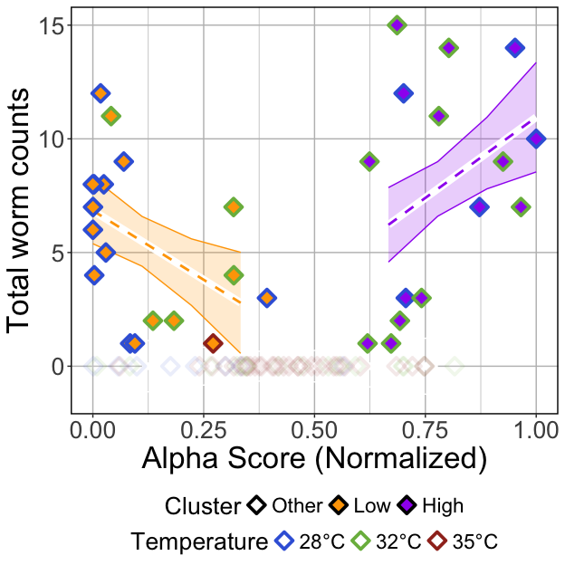<!-- -->

##### Tables

###### (hide)

Press on tabs to display tables. Scroll to see additional rows.

###### GLM

<table class="gt_table" data-quarto-disable-processing="false" data-quarto-bootstrap="false">
  <thead>
    <tr class="gt_heading">
      <td colspan="6" class="gt_heading gt_title gt_font_normal" style>GLM Results</td>
    </tr>
    <tr class="gt_heading">
      <td colspan="6" class="gt_heading gt_subtitle gt_font_normal gt_bottom_border" style>glm(Total.Worm.Count ~ Alpha.Score*Cluster); Exposed fish</td>
    </tr>
    <tr class="gt_col_headings">
      <th class="gt_col_heading gt_columns_bottom_border gt_left" rowspan="1" colspan="1" scope="col" id="term">term</th>
      <th class="gt_col_heading gt_columns_bottom_border gt_right" rowspan="1" colspan="1" scope="col" id="estimate">estimate</th>
      <th class="gt_col_heading gt_columns_bottom_border gt_right" rowspan="1" colspan="1" scope="col" id="std.error">std.error</th>
      <th class="gt_col_heading gt_columns_bottom_border gt_right" rowspan="1" colspan="1" scope="col" id="statistic">statistic</th>
      <th class="gt_col_heading gt_columns_bottom_border gt_right" rowspan="1" colspan="1" scope="col" id="p.value">p.value</th>
      <th class="gt_col_heading gt_columns_bottom_border gt_left" rowspan="1" colspan="1" scope="col" id="p.adj.sig">p.adj.sig</th>
    </tr>
  </thead>
  <tbody class="gt_table_body">
    <tr class="gt_group_heading_row">
      <th colspan="6" class="gt_group_heading" scope="colgroup" id="Shannon">Shannon</th>
    </tr>
    <tr class="gt_row_group_first"><td headers="Shannon  term" class="gt_row gt_left">(Intercept)</td>
<td headers="Shannon  estimate" class="gt_row gt_right">0.000</td>
<td headers="Shannon  std.error" class="gt_row gt_right">0.778</td>
<td headers="Shannon  statistic" class="gt_row gt_right">0.000</td>
<td headers="Shannon  p.value" class="gt_row gt_right">≥0.25</td>
<td headers="Shannon  p.adj.sig" class="gt_row gt_left">ns</td></tr>
    <tr><td headers="Shannon  term" class="gt_row gt_left">Alpha.Score</td>
<td headers="Shannon  estimate" class="gt_row gt_right">0.000</td>
<td headers="Shannon  std.error" class="gt_row gt_right">1.808</td>
<td headers="Shannon  statistic" class="gt_row gt_right">0.000</td>
<td headers="Shannon  p.value" class="gt_row gt_right">≥0.25</td>
<td headers="Shannon  p.adj.sig" class="gt_row gt_left">ns</td></tr>
    <tr><td headers="Shannon  term" class="gt_row gt_left">ClusterLow</td>
<td headers="Shannon  estimate" class="gt_row gt_right">6.524</td>
<td headers="Shannon  std.error" class="gt_row gt_right">1.067</td>
<td headers="Shannon  statistic" class="gt_row gt_right">6.115</td>
<td headers="Shannon  p.value" class="gt_row gt_right">&lt;0.001</td>
<td headers="Shannon  p.adj.sig" class="gt_row gt_left">****</td></tr>
    <tr><td headers="Shannon  term" class="gt_row gt_left">ClusterHigh</td>
<td headers="Shannon  estimate" class="gt_row gt_right">−2.610</td>
<td headers="Shannon  std.error" class="gt_row gt_right">3.512</td>
<td headers="Shannon  statistic" class="gt_row gt_right">−0.743</td>
<td headers="Shannon  p.value" class="gt_row gt_right">≥0.25</td>
<td headers="Shannon  p.adj.sig" class="gt_row gt_left">ns</td></tr>
    <tr><td headers="Shannon  term" class="gt_row gt_left">Alpha.Score:ClusterLow</td>
<td headers="Shannon  estimate" class="gt_row gt_right">−10.090</td>
<td headers="Shannon  std.error" class="gt_row gt_right">4.999</td>
<td headers="Shannon  statistic" class="gt_row gt_right">−2.018</td>
<td headers="Shannon  p.value" class="gt_row gt_right">0.047</td>
<td headers="Shannon  p.adj.sig" class="gt_row gt_left">*</td></tr>
    <tr><td headers="Shannon  term" class="gt_row gt_left">Alpha.Score:ClusterHigh</td>
<td headers="Shannon  estimate" class="gt_row gt_right">13.706</td>
<td headers="Shannon  std.error" class="gt_row gt_right">4.766</td>
<td headers="Shannon  statistic" class="gt_row gt_right">2.876</td>
<td headers="Shannon  p.value" class="gt_row gt_right">0.005</td>
<td headers="Shannon  p.adj.sig" class="gt_row gt_left">**</td></tr>
    <tr class="gt_group_heading_row">
      <th colspan="6" class="gt_group_heading" scope="colgroup" id="Simpson">Simpson</th>
    </tr>
    <tr class="gt_row_group_first"><td headers="Simpson  term" class="gt_row gt_left">(Intercept)</td>
<td headers="Simpson  estimate" class="gt_row gt_right">0.000</td>
<td headers="Simpson  std.error" class="gt_row gt_right">0.741</td>
<td headers="Simpson  statistic" class="gt_row gt_right">0.000</td>
<td headers="Simpson  p.value" class="gt_row gt_right">≥0.25</td>
<td headers="Simpson  p.adj.sig" class="gt_row gt_left">ns</td></tr>
    <tr><td headers="Simpson  term" class="gt_row gt_left">Alpha.Score</td>
<td headers="Simpson  estimate" class="gt_row gt_right">0.000</td>
<td headers="Simpson  std.error" class="gt_row gt_right">1.605</td>
<td headers="Simpson  statistic" class="gt_row gt_right">0.000</td>
<td headers="Simpson  p.value" class="gt_row gt_right">≥0.25</td>
<td headers="Simpson  p.adj.sig" class="gt_row gt_left">ns</td></tr>
    <tr><td headers="Simpson  term" class="gt_row gt_left">ClusterLow</td>
<td headers="Simpson  estimate" class="gt_row gt_right">6.842</td>
<td headers="Simpson  std.error" class="gt_row gt_right">1.041</td>
<td headers="Simpson  statistic" class="gt_row gt_right">6.573</td>
<td headers="Simpson  p.value" class="gt_row gt_right">&lt;0.001</td>
<td headers="Simpson  p.adj.sig" class="gt_row gt_left">****</td></tr>
    <tr><td headers="Simpson  term" class="gt_row gt_left">ClusterHigh</td>
<td headers="Simpson  estimate" class="gt_row gt_right">−3.247</td>
<td headers="Simpson  std.error" class="gt_row gt_right">3.900</td>
<td headers="Simpson  statistic" class="gt_row gt_right">−0.833</td>
<td headers="Simpson  p.value" class="gt_row gt_right">≥0.25</td>
<td headers="Simpson  p.adj.sig" class="gt_row gt_left">ns</td></tr>
    <tr><td headers="Simpson  term" class="gt_row gt_left">Alpha.Score:ClusterLow</td>
<td headers="Simpson  estimate" class="gt_row gt_right">−12.165</td>
<td headers="Simpson  std.error" class="gt_row gt_right">4.647</td>
<td headers="Simpson  statistic" class="gt_row gt_right">−2.618</td>
<td headers="Simpson  p.value" class="gt_row gt_right">0.011</td>
<td headers="Simpson  p.adj.sig" class="gt_row gt_left">*</td></tr>
    <tr><td headers="Simpson  term" class="gt_row gt_left">Alpha.Score:ClusterHigh</td>
<td headers="Simpson  estimate" class="gt_row gt_right">14.198</td>
<td headers="Simpson  std.error" class="gt_row gt_right">5.090</td>
<td headers="Simpson  statistic" class="gt_row gt_right">2.789</td>
<td headers="Simpson  p.value" class="gt_row gt_right">0.007</td>
<td headers="Simpson  p.adj.sig" class="gt_row gt_left">**</td></tr>
    <tr class="gt_group_heading_row">
      <th colspan="6" class="gt_group_heading" scope="colgroup" id="Richness">Richness</th>
    </tr>
    <tr class="gt_row_group_first"><td headers="Richness  term" class="gt_row gt_left">(Intercept)</td>
<td headers="Richness  estimate" class="gt_row gt_right">0.000</td>
<td headers="Richness  std.error" class="gt_row gt_right">0.914</td>
<td headers="Richness  statistic" class="gt_row gt_right">0.000</td>
<td headers="Richness  p.value" class="gt_row gt_right">≥0.25</td>
<td headers="Richness  p.adj.sig" class="gt_row gt_left">ns</td></tr>
    <tr><td headers="Richness  term" class="gt_row gt_left">Alpha.Score</td>
<td headers="Richness  estimate" class="gt_row gt_right">0.000</td>
<td headers="Richness  std.error" class="gt_row gt_right">1.983</td>
<td headers="Richness  statistic" class="gt_row gt_right">0.000</td>
<td headers="Richness  p.value" class="gt_row gt_right">≥0.25</td>
<td headers="Richness  p.adj.sig" class="gt_row gt_left">ns</td></tr>
    <tr><td headers="Richness  term" class="gt_row gt_left">ClusterLow</td>
<td headers="Richness  estimate" class="gt_row gt_right">6.105</td>
<td headers="Richness  std.error" class="gt_row gt_right">1.294</td>
<td headers="Richness  statistic" class="gt_row gt_right">4.717</td>
<td headers="Richness  p.value" class="gt_row gt_right">&lt;0.001</td>
<td headers="Richness  p.adj.sig" class="gt_row gt_left">****</td></tr>
    <tr><td headers="Richness  term" class="gt_row gt_left">ClusterHigh</td>
<td headers="Richness  estimate" class="gt_row gt_right">7.362</td>
<td headers="Richness  std.error" class="gt_row gt_right">2.644</td>
<td headers="Richness  statistic" class="gt_row gt_right">2.784</td>
<td headers="Richness  p.value" class="gt_row gt_right">0.007</td>
<td headers="Richness  p.adj.sig" class="gt_row gt_left">**</td></tr>
    <tr><td headers="Richness  term" class="gt_row gt_left">Alpha.Score:ClusterLow</td>
<td headers="Richness  estimate" class="gt_row gt_right">−3.491</td>
<td headers="Richness  std.error" class="gt_row gt_right">4.463</td>
<td headers="Richness  statistic" class="gt_row gt_right">−0.782</td>
<td headers="Richness  p.value" class="gt_row gt_right">≥0.25</td>
<td headers="Richness  p.adj.sig" class="gt_row gt_left">ns</td></tr>
    <tr><td headers="Richness  term" class="gt_row gt_left">Alpha.Score:ClusterHigh</td>
<td headers="Richness  estimate" class="gt_row gt_right">0.772</td>
<td headers="Richness  std.error" class="gt_row gt_right">4.163</td>
<td headers="Richness  statistic" class="gt_row gt_right">0.185</td>
<td headers="Richness  p.value" class="gt_row gt_right">≥0.25</td>
<td headers="Richness  p.adj.sig" class="gt_row gt_left">ns</td></tr>
  </tbody>
  &#10;  
</table>

###### ANOVA

<table class="gt_table" data-quarto-disable-processing="false" data-quarto-bootstrap="false">
  <thead>
    <tr class="gt_heading">
      <td colspan="5" class="gt_heading gt_title gt_font_normal" style>ANOVA of GLM</td>
    </tr>
    <tr class="gt_heading">
      <td colspan="5" class="gt_heading gt_subtitle gt_font_normal gt_bottom_border" style>ANOVA(GLM(Total.Worm.Count ~ Alpha.Score*Cluster), type = 2); Exposed fish</td>
    </tr>
    <tr class="gt_col_headings">
      <th class="gt_col_heading gt_columns_bottom_border gt_left" rowspan="1" colspan="1" scope="col" id="term">term</th>
      <th class="gt_col_heading gt_columns_bottom_border gt_right" rowspan="1" colspan="1" scope="col" id="statistic">statistic</th>
      <th class="gt_col_heading gt_columns_bottom_border gt_right" rowspan="1" colspan="1" scope="col" id="df">df</th>
      <th class="gt_col_heading gt_columns_bottom_border gt_right" rowspan="1" colspan="1" scope="col" id="p.value">p.value</th>
      <th class="gt_col_heading gt_columns_bottom_border gt_left" rowspan="1" colspan="1" scope="col" id="sig">sig</th>
    </tr>
  </thead>
  <tbody class="gt_table_body">
    <tr class="gt_group_heading_row">
      <th colspan="5" class="gt_group_heading" scope="colgroup" id="Shannon">Shannon</th>
    </tr>
    <tr class="gt_row_group_first"><td headers="Shannon  term" class="gt_row gt_left">Alpha.Score</td>
<td headers="Shannon  statistic" class="gt_row gt_right">0.143</td>
<td headers="Shannon  df" class="gt_row gt_right">1.000</td>
<td headers="Shannon  p.value" class="gt_row gt_right">≥0.25</td>
<td headers="Shannon  sig" class="gt_row gt_left">ns</td></tr>
    <tr><td headers="Shannon  term" class="gt_row gt_left">Cluster</td>
<td headers="Shannon  statistic" class="gt_row gt_right">162.212</td>
<td headers="Shannon  df" class="gt_row gt_right">2.000</td>
<td headers="Shannon  p.value" class="gt_row gt_right">&lt;0.001</td>
<td headers="Shannon  sig" class="gt_row gt_left">****</td></tr>
    <tr><td headers="Shannon  term" class="gt_row gt_left">Alpha.Score:Cluster</td>
<td headers="Shannon  statistic" class="gt_row gt_right">14.204</td>
<td headers="Shannon  df" class="gt_row gt_right">2.000</td>
<td headers="Shannon  p.value" class="gt_row gt_right">&lt;0.001</td>
<td headers="Shannon  sig" class="gt_row gt_left">***</td></tr>
    <tr class="gt_group_heading_row">
      <th colspan="5" class="gt_group_heading" scope="colgroup" id="Simpson">Simpson</th>
    </tr>
    <tr class="gt_row_group_first"><td headers="Simpson  term" class="gt_row gt_left">Alpha.Score</td>
<td headers="Simpson  statistic" class="gt_row gt_right">0.002</td>
<td headers="Simpson  df" class="gt_row gt_right">1.000</td>
<td headers="Simpson  p.value" class="gt_row gt_right">≥0.25</td>
<td headers="Simpson  sig" class="gt_row gt_left">ns</td></tr>
    <tr><td headers="Simpson  term" class="gt_row gt_left">Cluster</td>
<td headers="Simpson  statistic" class="gt_row gt_right">168.513</td>
<td headers="Simpson  df" class="gt_row gt_right">2.000</td>
<td headers="Simpson  p.value" class="gt_row gt_right">&lt;0.001</td>
<td headers="Simpson  sig" class="gt_row gt_left">****</td></tr>
    <tr><td headers="Simpson  term" class="gt_row gt_left">Alpha.Score:Cluster</td>
<td headers="Simpson  statistic" class="gt_row gt_right">16.419</td>
<td headers="Simpson  df" class="gt_row gt_right">2.000</td>
<td headers="Simpson  p.value" class="gt_row gt_right">&lt;0.001</td>
<td headers="Simpson  sig" class="gt_row gt_left">***</td></tr>
    <tr class="gt_group_heading_row">
      <th colspan="5" class="gt_group_heading" scope="colgroup" id="Richness">Richness</th>
    </tr>
    <tr class="gt_row_group_first"><td headers="Richness  term" class="gt_row gt_left">Alpha.Score</td>
<td headers="Richness  statistic" class="gt_row gt_right">0.066</td>
<td headers="Richness  df" class="gt_row gt_right">1.000</td>
<td headers="Richness  p.value" class="gt_row gt_right">≥0.25</td>
<td headers="Richness  sig" class="gt_row gt_left">ns</td></tr>
    <tr><td headers="Richness  term" class="gt_row gt_left">Cluster</td>
<td headers="Richness  statistic" class="gt_row gt_right">145.539</td>
<td headers="Richness  df" class="gt_row gt_right">2.000</td>
<td headers="Richness  p.value" class="gt_row gt_right">&lt;0.001</td>
<td headers="Richness  sig" class="gt_row gt_left">****</td></tr>
    <tr><td headers="Richness  term" class="gt_row gt_left">Alpha.Score:Cluster</td>
<td headers="Richness  statistic" class="gt_row gt_right">0.741</td>
<td headers="Richness  df" class="gt_row gt_right">2.000</td>
<td headers="Richness  p.value" class="gt_row gt_right">≥0.25</td>
<td headers="Richness  sig" class="gt_row gt_left">ns</td></tr>
  </tbody>
  &#10;  
</table>

###### Tukey

<table class="gt_table" data-quarto-disable-processing="false" data-quarto-bootstrap="false">
  <thead>
    <tr class="gt_heading">
      <td colspan="11" class="gt_heading gt_title gt_font_normal" style>Pairwise Tukey's HSD, p.adj: Dunnett</td>
    </tr>
    <tr class="gt_heading">
      <td colspan="11" class="gt_heading gt_subtitle gt_font_normal gt_bottom_border" style>Tukey(Total.Worm.Count ~ Alpha.Score*Cluster); Exposed fish</td>
    </tr>
    <tr class="gt_col_headings">
      <th class="gt_col_heading gt_columns_bottom_border gt_center" rowspan="1" colspan="1" scope="col" id="Temperature">Temperature</th>
      <th class="gt_col_heading gt_columns_bottom_border gt_left" rowspan="1" colspan="1" scope="col" id=".y.">.y.</th>
      <th class="gt_col_heading gt_columns_bottom_border gt_left" rowspan="1" colspan="1" scope="col" id="term">term</th>
      <th class="gt_col_heading gt_columns_bottom_border gt_left" rowspan="1" colspan="1" scope="col" id="group1">group1</th>
      <th class="gt_col_heading gt_columns_bottom_border gt_left" rowspan="1" colspan="1" scope="col" id="group2">group2</th>
      <th class="gt_col_heading gt_columns_bottom_border gt_right" rowspan="1" colspan="1" scope="col" id="estimate">estimate</th>
      <th class="gt_col_heading gt_columns_bottom_border gt_right" rowspan="1" colspan="1" scope="col" id="std.error">std.error</th>
      <th class="gt_col_heading gt_columns_bottom_border gt_right" rowspan="1" colspan="1" scope="col" id="statistic">statistic</th>
      <th class="gt_col_heading gt_columns_bottom_border gt_right" rowspan="1" colspan="1" scope="col" id="adj.p.value">adj.p.value</th>
      <th class="gt_col_heading gt_columns_bottom_border gt_left" rowspan="1" colspan="1" scope="col" id="Variable">Variable</th>
      <th class="gt_col_heading gt_columns_bottom_border gt_center" rowspan="1" colspan="1" scope="col" id="Group">Group</th>
    </tr>
  </thead>
  <tbody class="gt_table_body">
    <tr class="gt_group_heading_row">
      <th colspan="11" class="gt_group_heading" scope="colgroup" id="Shannon">Shannon</th>
    </tr>
    <tr class="gt_row_group_first"><td headers="Shannon  Temperature" class="gt_row gt_center">28</td>
<td headers="Shannon  .y." class="gt_row gt_left">Alpha.Score</td>
<td headers="Shannon  term" class="gt_row gt_left">Cluster</td>
<td headers="Shannon  group1" class="gt_row gt_left">Low</td>
<td headers="Shannon  group2" class="gt_row gt_left">Other</td>
<td headers="Shannon  estimate" class="gt_row gt_right">−1.594</td>
<td headers="Shannon  std.error" class="gt_row gt_right">0.642</td>
<td headers="Shannon  statistic" class="gt_row gt_right">−2.483</td>
<td headers="Shannon  adj.p.value" class="gt_row gt_right">0.034</td>
<td headers="Shannon  Variable" class="gt_row gt_left">Cluster</td>
<td headers="Shannon  Group" class="gt_row gt_center">28</td></tr>
    <tr><td headers="Shannon  Temperature" class="gt_row gt_center">28</td>
<td headers="Shannon  .y." class="gt_row gt_left">Alpha.Score</td>
<td headers="Shannon  term" class="gt_row gt_left">Cluster</td>
<td headers="Shannon  group1" class="gt_row gt_left">High</td>
<td headers="Shannon  group2" class="gt_row gt_left">Other</td>
<td headers="Shannon  estimate" class="gt_row gt_right">2.844</td>
<td headers="Shannon  std.error" class="gt_row gt_right">0.672</td>
<td headers="Shannon  statistic" class="gt_row gt_right">4.233</td>
<td headers="Shannon  adj.p.value" class="gt_row gt_right">&lt;0.001</td>
<td headers="Shannon  Variable" class="gt_row gt_left">Cluster</td>
<td headers="Shannon  Group" class="gt_row gt_center">28</td></tr>
    <tr><td headers="Shannon  Temperature" class="gt_row gt_center">28</td>
<td headers="Shannon  .y." class="gt_row gt_left">Alpha.Score</td>
<td headers="Shannon  term" class="gt_row gt_left">Cluster</td>
<td headers="Shannon  group1" class="gt_row gt_left">High</td>
<td headers="Shannon  group2" class="gt_row gt_left">Low</td>
<td headers="Shannon  estimate" class="gt_row gt_right">4.438</td>
<td headers="Shannon  std.error" class="gt_row gt_right">0.773</td>
<td headers="Shannon  statistic" class="gt_row gt_right">5.741</td>
<td headers="Shannon  adj.p.value" class="gt_row gt_right">&lt;0.001</td>
<td headers="Shannon  Variable" class="gt_row gt_left">Cluster</td>
<td headers="Shannon  Group" class="gt_row gt_center">28</td></tr>
    <tr><td headers="Shannon  Temperature" class="gt_row gt_center">32</td>
<td headers="Shannon  .y." class="gt_row gt_left">Alpha.Score</td>
<td headers="Shannon  term" class="gt_row gt_left">Cluster</td>
<td headers="Shannon  group1" class="gt_row gt_left">Low</td>
<td headers="Shannon  group2" class="gt_row gt_left">Other</td>
<td headers="Shannon  estimate" class="gt_row gt_right">−1.391</td>
<td headers="Shannon  std.error" class="gt_row gt_right">0.495</td>
<td headers="Shannon  statistic" class="gt_row gt_right">−2.808</td>
<td headers="Shannon  adj.p.value" class="gt_row gt_right">0.013</td>
<td headers="Shannon  Variable" class="gt_row gt_left">Cluster</td>
<td headers="Shannon  Group" class="gt_row gt_center">32</td></tr>
    <tr><td headers="Shannon  Temperature" class="gt_row gt_center">32</td>
<td headers="Shannon  .y." class="gt_row gt_left">Alpha.Score</td>
<td headers="Shannon  term" class="gt_row gt_left">Cluster</td>
<td headers="Shannon  group1" class="gt_row gt_left">High</td>
<td headers="Shannon  group2" class="gt_row gt_left">Other</td>
<td headers="Shannon  estimate" class="gt_row gt_right">1.147</td>
<td headers="Shannon  std.error" class="gt_row gt_right">0.333</td>
<td headers="Shannon  statistic" class="gt_row gt_right">3.443</td>
<td headers="Shannon  adj.p.value" class="gt_row gt_right">0.002</td>
<td headers="Shannon  Variable" class="gt_row gt_left">Cluster</td>
<td headers="Shannon  Group" class="gt_row gt_center">32</td></tr>
    <tr><td headers="Shannon  Temperature" class="gt_row gt_center">32</td>
<td headers="Shannon  .y." class="gt_row gt_left">Alpha.Score</td>
<td headers="Shannon  term" class="gt_row gt_left">Cluster</td>
<td headers="Shannon  group1" class="gt_row gt_left">High</td>
<td headers="Shannon  group2" class="gt_row gt_left">Low</td>
<td headers="Shannon  estimate" class="gt_row gt_right">2.538</td>
<td headers="Shannon  std.error" class="gt_row gt_right">0.528</td>
<td headers="Shannon  statistic" class="gt_row gt_right">4.811</td>
<td headers="Shannon  adj.p.value" class="gt_row gt_right">&lt;0.001</td>
<td headers="Shannon  Variable" class="gt_row gt_left">Cluster</td>
<td headers="Shannon  Group" class="gt_row gt_center">32</td></tr>
    <tr><td headers="Shannon  Temperature" class="gt_row gt_center">35</td>
<td headers="Shannon  .y." class="gt_row gt_left">Alpha.Score</td>
<td headers="Shannon  term" class="gt_row gt_left">Cluster</td>
<td headers="Shannon  group1" class="gt_row gt_left">Low</td>
<td headers="Shannon  group2" class="gt_row gt_left">Other</td>
<td headers="Shannon  estimate" class="gt_row gt_right">−0.899</td>
<td headers="Shannon  std.error" class="gt_row gt_right">0.659</td>
<td headers="Shannon  statistic" class="gt_row gt_right">−1.365</td>
<td headers="Shannon  adj.p.value" class="gt_row gt_right">0.172</td>
<td headers="Shannon  Variable" class="gt_row gt_left">Cluster</td>
<td headers="Shannon  Group" class="gt_row gt_center">35</td></tr>
    <tr class="gt_group_heading_row">
      <th colspan="11" class="gt_group_heading" scope="colgroup" id="Simpson">Simpson</th>
    </tr>
    <tr class="gt_row_group_first"><td headers="Simpson  Temperature" class="gt_row gt_center">28</td>
<td headers="Simpson  .y." class="gt_row gt_left">Alpha.Score</td>
<td headers="Simpson  term" class="gt_row gt_left">Cluster</td>
<td headers="Simpson  group1" class="gt_row gt_left">Low</td>
<td headers="Simpson  group2" class="gt_row gt_left">Other</td>
<td headers="Simpson  estimate" class="gt_row gt_right">−1.487</td>
<td headers="Simpson  std.error" class="gt_row gt_right">0.656</td>
<td headers="Simpson  statistic" class="gt_row gt_right">−2.266</td>
<td headers="Simpson  adj.p.value" class="gt_row gt_right">0.060</td>
<td headers="Simpson  Variable" class="gt_row gt_left">Cluster</td>
<td headers="Simpson  Group" class="gt_row gt_center">28</td></tr>
    <tr><td headers="Simpson  Temperature" class="gt_row gt_center">28</td>
<td headers="Simpson  .y." class="gt_row gt_left">Alpha.Score</td>
<td headers="Simpson  term" class="gt_row gt_left">Cluster</td>
<td headers="Simpson  group1" class="gt_row gt_left">High</td>
<td headers="Simpson  group2" class="gt_row gt_left">Other</td>
<td headers="Simpson  estimate" class="gt_row gt_right">2.970</td>
<td headers="Simpson  std.error" class="gt_row gt_right">0.665</td>
<td headers="Simpson  statistic" class="gt_row gt_right">4.466</td>
<td headers="Simpson  adj.p.value" class="gt_row gt_right">&lt;0.001</td>
<td headers="Simpson  Variable" class="gt_row gt_left">Cluster</td>
<td headers="Simpson  Group" class="gt_row gt_center">28</td></tr>
    <tr><td headers="Simpson  Temperature" class="gt_row gt_center">28</td>
<td headers="Simpson  .y." class="gt_row gt_left">Alpha.Score</td>
<td headers="Simpson  term" class="gt_row gt_left">Cluster</td>
<td headers="Simpson  group1" class="gt_row gt_left">High</td>
<td headers="Simpson  group2" class="gt_row gt_left">Low</td>
<td headers="Simpson  estimate" class="gt_row gt_right">4.457</td>
<td headers="Simpson  std.error" class="gt_row gt_right">0.767</td>
<td headers="Simpson  statistic" class="gt_row gt_right">5.810</td>
<td headers="Simpson  adj.p.value" class="gt_row gt_right">&lt;0.001</td>
<td headers="Simpson  Variable" class="gt_row gt_left">Cluster</td>
<td headers="Simpson  Group" class="gt_row gt_center">28</td></tr>
    <tr><td headers="Simpson  Temperature" class="gt_row gt_center">32</td>
<td headers="Simpson  .y." class="gt_row gt_left">Alpha.Score</td>
<td headers="Simpson  term" class="gt_row gt_left">Cluster</td>
<td headers="Simpson  group1" class="gt_row gt_left">Low</td>
<td headers="Simpson  group2" class="gt_row gt_left">Other</td>
<td headers="Simpson  estimate" class="gt_row gt_right">−1.233</td>
<td headers="Simpson  std.error" class="gt_row gt_right">0.487</td>
<td headers="Simpson  statistic" class="gt_row gt_right">−2.531</td>
<td headers="Simpson  adj.p.value" class="gt_row gt_right">0.029</td>
<td headers="Simpson  Variable" class="gt_row gt_left">Cluster</td>
<td headers="Simpson  Group" class="gt_row gt_center">32</td></tr>
    <tr><td headers="Simpson  Temperature" class="gt_row gt_center">32</td>
<td headers="Simpson  .y." class="gt_row gt_left">Alpha.Score</td>
<td headers="Simpson  term" class="gt_row gt_left">Cluster</td>
<td headers="Simpson  group1" class="gt_row gt_left">High</td>
<td headers="Simpson  group2" class="gt_row gt_left">Other</td>
<td headers="Simpson  estimate" class="gt_row gt_right">1.264</td>
<td headers="Simpson  std.error" class="gt_row gt_right">0.354</td>
<td headers="Simpson  statistic" class="gt_row gt_right">3.573</td>
<td headers="Simpson  adj.p.value" class="gt_row gt_right">&lt;0.001</td>
<td headers="Simpson  Variable" class="gt_row gt_left">Cluster</td>
<td headers="Simpson  Group" class="gt_row gt_center">32</td></tr>
    <tr><td headers="Simpson  Temperature" class="gt_row gt_center">32</td>
<td headers="Simpson  .y." class="gt_row gt_left">Alpha.Score</td>
<td headers="Simpson  term" class="gt_row gt_left">Cluster</td>
<td headers="Simpson  group1" class="gt_row gt_left">High</td>
<td headers="Simpson  group2" class="gt_row gt_left">Low</td>
<td headers="Simpson  estimate" class="gt_row gt_right">2.497</td>
<td headers="Simpson  std.error" class="gt_row gt_right">0.528</td>
<td headers="Simpson  statistic" class="gt_row gt_right">4.729</td>
<td headers="Simpson  adj.p.value" class="gt_row gt_right">&lt;0.001</td>
<td headers="Simpson  Variable" class="gt_row gt_left">Cluster</td>
<td headers="Simpson  Group" class="gt_row gt_center">32</td></tr>
    <tr><td headers="Simpson  Temperature" class="gt_row gt_center">35</td>
<td headers="Simpson  .y." class="gt_row gt_left">Alpha.Score</td>
<td headers="Simpson  term" class="gt_row gt_left">Cluster</td>
<td headers="Simpson  group1" class="gt_row gt_left">Low</td>
<td headers="Simpson  group2" class="gt_row gt_left">Other</td>
<td headers="Simpson  estimate" class="gt_row gt_right">−0.779</td>
<td headers="Simpson  std.error" class="gt_row gt_right">0.692</td>
<td headers="Simpson  statistic" class="gt_row gt_right">−1.125</td>
<td headers="Simpson  adj.p.value" class="gt_row gt_right">≥0.25</td>
<td headers="Simpson  Variable" class="gt_row gt_left">Cluster</td>
<td headers="Simpson  Group" class="gt_row gt_center">35</td></tr>
    <tr class="gt_group_heading_row">
      <th colspan="11" class="gt_group_heading" scope="colgroup" id="Richness">Richness</th>
    </tr>
    <tr class="gt_row_group_first"><td headers="Richness  Temperature" class="gt_row gt_center">28</td>
<td headers="Richness  .y." class="gt_row gt_left">Alpha.Score</td>
<td headers="Richness  term" class="gt_row gt_left">Cluster</td>
<td headers="Richness  group1" class="gt_row gt_left">Low</td>
<td headers="Richness  group2" class="gt_row gt_left">Other</td>
<td headers="Richness  estimate" class="gt_row gt_right">−1.430</td>
<td headers="Richness  std.error" class="gt_row gt_right">0.589</td>
<td headers="Richness  statistic" class="gt_row gt_right">−2.429</td>
<td headers="Richness  adj.p.value" class="gt_row gt_right">0.040</td>
<td headers="Richness  Variable" class="gt_row gt_left">Cluster</td>
<td headers="Richness  Group" class="gt_row gt_center">28</td></tr>
    <tr><td headers="Richness  Temperature" class="gt_row gt_center">28</td>
<td headers="Richness  .y." class="gt_row gt_left">Alpha.Score</td>
<td headers="Richness  term" class="gt_row gt_left">Cluster</td>
<td headers="Richness  group1" class="gt_row gt_left">High</td>
<td headers="Richness  group2" class="gt_row gt_left">Other</td>
<td headers="Richness  estimate" class="gt_row gt_right">1.367</td>
<td headers="Richness  std.error" class="gt_row gt_right">0.653</td>
<td headers="Richness  statistic" class="gt_row gt_right">2.095</td>
<td headers="Richness  adj.p.value" class="gt_row gt_right">0.090</td>
<td headers="Richness  Variable" class="gt_row gt_left">Cluster</td>
<td headers="Richness  Group" class="gt_row gt_center">28</td></tr>
    <tr><td headers="Richness  Temperature" class="gt_row gt_center">28</td>
<td headers="Richness  .y." class="gt_row gt_left">Alpha.Score</td>
<td headers="Richness  term" class="gt_row gt_left">Cluster</td>
<td headers="Richness  group1" class="gt_row gt_left">High</td>
<td headers="Richness  group2" class="gt_row gt_left">Low</td>
<td headers="Richness  estimate" class="gt_row gt_right">2.797</td>
<td headers="Richness  std.error" class="gt_row gt_right">0.692</td>
<td headers="Richness  statistic" class="gt_row gt_right">4.043</td>
<td headers="Richness  adj.p.value" class="gt_row gt_right">&lt;0.001</td>
<td headers="Richness  Variable" class="gt_row gt_left">Cluster</td>
<td headers="Richness  Group" class="gt_row gt_center">28</td></tr>
    <tr><td headers="Richness  Temperature" class="gt_row gt_center">32</td>
<td headers="Richness  .y." class="gt_row gt_left">Alpha.Score</td>
<td headers="Richness  term" class="gt_row gt_left">Cluster</td>
<td headers="Richness  group1" class="gt_row gt_left">Low</td>
<td headers="Richness  group2" class="gt_row gt_left">Other</td>
<td headers="Richness  estimate" class="gt_row gt_right">−1.183</td>
<td headers="Richness  std.error" class="gt_row gt_right">0.387</td>
<td headers="Richness  statistic" class="gt_row gt_right">−3.052</td>
<td headers="Richness  adj.p.value" class="gt_row gt_right">0.006</td>
<td headers="Richness  Variable" class="gt_row gt_left">Cluster</td>
<td headers="Richness  Group" class="gt_row gt_center">32</td></tr>
    <tr><td headers="Richness  Temperature" class="gt_row gt_center">32</td>
<td headers="Richness  .y." class="gt_row gt_left">Alpha.Score</td>
<td headers="Richness  term" class="gt_row gt_left">Cluster</td>
<td headers="Richness  group1" class="gt_row gt_left">High</td>
<td headers="Richness  group2" class="gt_row gt_left">Other</td>
<td headers="Richness  estimate" class="gt_row gt_right">0.429</td>
<td headers="Richness  std.error" class="gt_row gt_right">0.278</td>
<td headers="Richness  statistic" class="gt_row gt_right">1.543</td>
<td headers="Richness  adj.p.value" class="gt_row gt_right">≥0.25</td>
<td headers="Richness  Variable" class="gt_row gt_left">Cluster</td>
<td headers="Richness  Group" class="gt_row gt_center">32</td></tr>
    <tr><td headers="Richness  Temperature" class="gt_row gt_center">32</td>
<td headers="Richness  .y." class="gt_row gt_left">Alpha.Score</td>
<td headers="Richness  term" class="gt_row gt_left">Cluster</td>
<td headers="Richness  group1" class="gt_row gt_left">High</td>
<td headers="Richness  group2" class="gt_row gt_left">Low</td>
<td headers="Richness  estimate" class="gt_row gt_right">1.611</td>
<td headers="Richness  std.error" class="gt_row gt_right">0.410</td>
<td headers="Richness  statistic" class="gt_row gt_right">3.934</td>
<td headers="Richness  adj.p.value" class="gt_row gt_right">&lt;0.001</td>
<td headers="Richness  Variable" class="gt_row gt_left">Cluster</td>
<td headers="Richness  Group" class="gt_row gt_center">32</td></tr>
    <tr><td headers="Richness  Temperature" class="gt_row gt_center">35</td>
<td headers="Richness  .y." class="gt_row gt_left">Alpha.Score</td>
<td headers="Richness  term" class="gt_row gt_left">Cluster</td>
<td headers="Richness  group1" class="gt_row gt_left">Low</td>
<td headers="Richness  group2" class="gt_row gt_left">Other</td>
<td headers="Richness  estimate" class="gt_row gt_right">−0.611</td>
<td headers="Richness  std.error" class="gt_row gt_right">0.552</td>
<td headers="Richness  statistic" class="gt_row gt_right">−1.107</td>
<td headers="Richness  adj.p.value" class="gt_row gt_right">≥0.25</td>
<td headers="Richness  Variable" class="gt_row gt_left">Cluster</td>
<td headers="Richness  Group" class="gt_row gt_center">35</td></tr>
  </tbody>
  &#10;  
</table>

#### 6D)

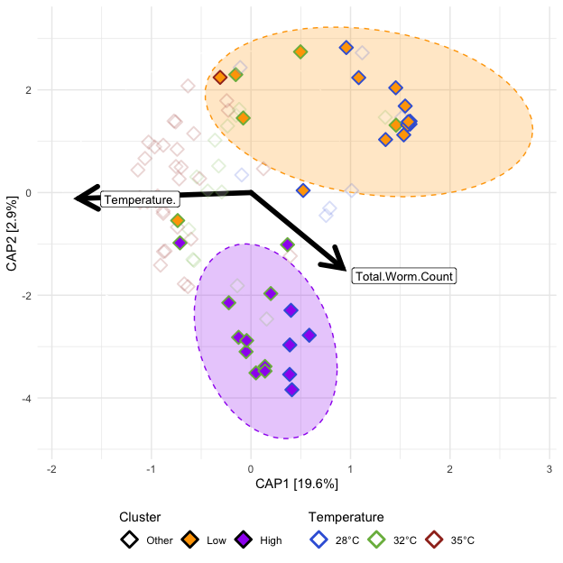<!-- -->

##### Tables

###### (hide)

Press on tabs to display tables. Scroll to see additional rows.

###### Capscale

###### Dispersion (ANOVA)

###### Dispersion (Tukey)

### 7) Gut microbial abundance is significantly associated with environmental conditions and stressors

#### 7A)

Fig. 7 A heatmap of model coefficient values of the top 50 statistically
significant abundant gut microbial taxa identified by MaAsLin2. The
color of each cell represents the coefficient value and direction (red
is positive, blue is negative). A “+” or “-” indicates a statistically
significant association was observed between taxon abundance and a
covariate. Gray colored cells indicate a significant effect was not
observed.

<table class="gt_table" data-quarto-disable-processing="false" data-quarto-bootstrap="false">
  <thead>
    <tr class="gt_col_headings">
      <th class="gt_col_heading gt_columns_bottom_border gt_left" rowspan="1" colspan="1" style="text-align: center; font-weight: bold; border-left-width: 1px; border-left-style: solid; border-left-color: black; border-right-width: 1px; border-right-style: solid; border-right-color: black; border-top-width: 1px; border-top-style: solid; border-top-color: black; border-bottom-width: 1px; border-bottom-style: solid; border-bottom-color: black;" scope="col" id="Taxon">Taxon</th>
      <th class="gt_col_heading gt_columns_bottom_border gt_right" rowspan="1" colspan="1" style="text-align: center; font-weight: bold; border-left-width: 1px; border-left-style: solid; border-left-color: black; border-right-width: 1px; border-right-style: solid; border-right-color: black; border-top-width: 1px; border-top-style: solid; border-top-color: black; border-bottom-width: 1px; border-bottom-style: solid; border-bottom-color: black;" scope="col" id="Temp: 32°C">Temp: 32°C</th>
      <th class="gt_col_heading gt_columns_bottom_border gt_right" rowspan="1" colspan="1" style="text-align: center; font-weight: bold; border-left-width: 1px; border-left-style: solid; border-left-color: black; border-right-width: 1px; border-right-style: solid; border-right-color: black; border-top-width: 1px; border-top-style: solid; border-top-color: black; border-bottom-width: 1px; border-bottom-style: solid; border-bottom-color: black;" scope="col" id="Temp: 35°C">Temp: 35°C</th>
      <th class="gt_col_heading gt_columns_bottom_border gt_right" rowspan="1" colspan="1" style="text-align: center; font-weight: bold; border-left-width: 1px; border-left-style: solid; border-left-color: black; border-right-width: 1px; border-right-style: solid; border-right-color: black; border-top-width: 1px; border-top-style: solid; border-top-color: black; border-bottom-width: 1px; border-bottom-style: solid; border-bottom-color: black;" scope="col" id="Time (DPE)">Time (DPE)</th>
      <th class="gt_col_heading gt_columns_bottom_border gt_right" rowspan="1" colspan="1" style="text-align: center; font-weight: bold; border-left-width: 1px; border-left-style: solid; border-left-color: black; border-right-width: 1px; border-right-style: solid; border-right-color: black; border-top-width: 1px; border-top-style: solid; border-top-color: black; border-bottom-width: 1px; border-bottom-style: solid; border-bottom-color: black;" scope="col" id="Cluster: Low">Cluster: Low</th>
      <th class="gt_col_heading gt_columns_bottom_border gt_right" rowspan="1" colspan="1" style="text-align: center; font-weight: bold; border-left-width: 1px; border-left-style: solid; border-left-color: black; border-right-width: 1px; border-right-style: solid; border-right-color: black; border-top-width: 1px; border-top-style: solid; border-top-color: black; border-bottom-width: 1px; border-bottom-style: solid; border-bottom-color: black;" scope="col" id="Parasite exposed">Parasite exposed</th>
      <th class="gt_col_heading gt_columns_bottom_border gt_right" rowspan="1" colspan="1" style="text-align: center; font-weight: bold; border-left-width: 1px; border-left-style: solid; border-left-color: black; border-right-width: 1px; border-right-style: solid; border-right-color: black; border-top-width: 1px; border-top-style: solid; border-top-color: black; border-bottom-width: 1px; border-bottom-style: solid; border-bottom-color: black;" scope="col" id="Infection present">Infection present</th>
      <th class="gt_col_heading gt_columns_bottom_border gt_right" rowspan="1" colspan="1" style="text-align: center; font-weight: bold; border-left-width: 1px; border-left-style: solid; border-left-color: black; border-right-width: 1px; border-right-style: solid; border-right-color: black; border-top-width: 1px; border-top-style: solid; border-top-color: black; border-bottom-width: 1px; border-bottom-style: solid; border-bottom-color: black;" scope="col" id="Infection burden">Infection burden</th>
    </tr>
  </thead>
  <tbody class="gt_table_body">
    <tr class="gt_group_heading_row">
      <th colspan="8" class="gt_group_heading" style="font-weight: bold;" scope="colgroup" id="Actinobacteriota">Actinobacteriota</th>
    </tr>
    <tr class="gt_row_group_first"><td headers="Actinobacteriota  Taxon" class="gt_row gt_left" style="white-space: nowrap; border-left-width: 1px; border-left-style: solid; border-left-color: grey;">IMCC26207</td>
<td headers="Actinobacteriota  Temp: 32°C" class="gt_row gt_right" style="background-color: #FFC8B5; color: #000000; font-size: medium; text-align: center; font-weight: bold; border-left-width: 1px; border-left-style: solid; border-left-color: grey;">+</td>
<td headers="Actinobacteriota  Temp: 35°C" class="gt_row gt_right" style="background-color: #F2F2F2; color: #000000; font-size: medium; text-align: center; font-weight: normal; border-left-width: 1px; border-left-style: solid; border-left-color: grey;"> </td>
<td headers="Actinobacteriota  Time (DPE)" class="gt_row gt_right" style="background-color: #FFEEE8; color: #000000; font-size: medium; text-align: center; font-weight: bold; border-left-width: 1px; border-left-style: solid; border-left-color: grey;">-</td>
<td headers="Actinobacteriota  Cluster: Low" class="gt_row gt_right" style="background-color: #DFC8FF; color: #000000; font-size: medium; text-align: center; font-weight: bold; border-left-width: 1px; border-left-style: solid; border-left-color: grey;">-</td>
<td headers="Actinobacteriota  Parasite exposed" class="gt_row gt_right" style="background-color: #D2B5FF; color: #000000; font-size: medium; text-align: center; font-weight: bold; border-left-width: 1px; border-left-style: solid; border-left-color: grey;">-</td>
<td headers="Actinobacteriota  Infection present" class="gt_row gt_right" style="background-color: #F2F2F2; color: #000000; font-size: medium; text-align: center; font-weight: normal; border-left-width: 1px; border-left-style: solid; border-left-color: grey;"> </td>
<td headers="Actinobacteriota  Infection burden" class="gt_row gt_right" style="background-color: #F2F2F2; color: #000000; font-size: medium; text-align: center; font-weight: normal; border-left-width: 1px; border-left-style: solid; border-left-color: grey;"> </td></tr>
    <tr><td headers="Actinobacteriota  Taxon" class="gt_row gt_left" style="white-space: nowrap; border-left-width: 1px; border-left-style: solid; border-left-color: grey;">Nocardiaceae Genus</td>
<td headers="Actinobacteriota  Temp: 32°C" class="gt_row gt_right" style="background-color: #FFC0AB; color: #000000; font-size: medium; text-align: center; font-weight: bold; border-left-width: 1px; border-left-style: solid; border-left-color: grey;">+</td>
<td headers="Actinobacteriota  Temp: 35°C" class="gt_row gt_right" style="background-color: #FF7755; color: #000000; font-size: medium; text-align: center; font-weight: bold; border-left-width: 1px; border-left-style: solid; border-left-color: grey;">+</td>
<td headers="Actinobacteriota  Time (DPE)" class="gt_row gt_right" style="background-color: #FFEAE3; color: #000000; font-size: medium; text-align: center; font-weight: bold; border-left-width: 1px; border-left-style: solid; border-left-color: grey;">+</td>
<td headers="Actinobacteriota  Cluster: Low" class="gt_row gt_right" style="background-color: #F2F2F2; color: #000000; font-size: medium; text-align: center; font-weight: normal; border-left-width: 1px; border-left-style: solid; border-left-color: grey;"> </td>
<td headers="Actinobacteriota  Parasite exposed" class="gt_row gt_right" style="background-color: #F2F2F2; color: #000000; font-size: medium; text-align: center; font-weight: normal; border-left-width: 1px; border-left-style: solid; border-left-color: grey;"> </td>
<td headers="Actinobacteriota  Infection present" class="gt_row gt_right" style="background-color: #F2F2F2; color: #000000; font-size: medium; text-align: center; font-weight: normal; border-left-width: 1px; border-left-style: solid; border-left-color: grey;"> </td>
<td headers="Actinobacteriota  Infection burden" class="gt_row gt_right" style="background-color: #F2F2F2; color: #000000; font-size: medium; text-align: center; font-weight: normal; border-left-width: 1px; border-left-style: solid; border-left-color: grey;"> </td></tr>
    <tr><td headers="Actinobacteriota  Taxon" class="gt_row gt_left" style="white-space: nowrap; border-left-width: 1px; border-left-style: solid; border-left-color: grey;">PeM15 Genus</td>
<td headers="Actinobacteriota  Temp: 32°C" class="gt_row gt_right" style="background-color: #FFD6C8; color: #000000; font-size: medium; text-align: center; font-weight: bold; border-left-width: 1px; border-left-style: solid; border-left-color: grey;">+</td>
<td headers="Actinobacteriota  Temp: 35°C" class="gt_row gt_right" style="background-color: #F2F2F2; color: #000000; font-size: medium; text-align: center; font-weight: normal; border-left-width: 1px; border-left-style: solid; border-left-color: grey;"> </td>
<td headers="Actinobacteriota  Time (DPE)" class="gt_row gt_right" style="background-color: #FFEFE9; color: #000000; font-size: medium; text-align: center; font-weight: bold; border-left-width: 1px; border-left-style: solid; border-left-color: grey;">-</td>
<td headers="Actinobacteriota  Cluster: Low" class="gt_row gt_right" style="background-color: #CCADFF; color: #000000; font-size: medium; text-align: center; font-weight: bold; border-left-width: 1px; border-left-style: solid; border-left-color: grey;">-</td>
<td headers="Actinobacteriota  Parasite exposed" class="gt_row gt_right" style="background-color: #C19EFF; color: #000000; font-size: medium; text-align: center; font-weight: bold; border-left-width: 1px; border-left-style: solid; border-left-color: grey;">-</td>
<td headers="Actinobacteriota  Infection present" class="gt_row gt_right" style="background-color: #F2F2F2; color: #000000; font-size: medium; text-align: center; font-weight: normal; border-left-width: 1px; border-left-style: solid; border-left-color: grey;"> </td>
<td headers="Actinobacteriota  Infection burden" class="gt_row gt_right" style="background-color: #F2F2F2; color: #000000; font-size: medium; text-align: center; font-weight: normal; border-left-width: 1px; border-left-style: solid; border-left-color: grey;"> </td></tr>
    <tr class="gt_group_heading_row">
      <th colspan="8" class="gt_group_heading" style="font-weight: bold;" scope="colgroup" id="Bacteroidota">Bacteroidota</th>
    </tr>
    <tr class="gt_row_group_first"><td headers="Bacteroidota  Taxon" class="gt_row gt_left" style="white-space: nowrap; border-left-width: 1px; border-left-style: solid; border-left-color: grey;">Barnesiellaceae Genus</td>
<td headers="Bacteroidota  Temp: 32°C" class="gt_row gt_right" style="background-color: #F2F2F2; color: #000000; font-size: medium; text-align: center; font-weight: normal; border-left-width: 1px; border-left-style: solid; border-left-color: grey;"> </td>
<td headers="Bacteroidota  Temp: 35°C" class="gt_row gt_right" style="background-color: #F2F2F2; color: #000000; font-size: medium; text-align: center; font-weight: normal; border-left-width: 1px; border-left-style: solid; border-left-color: grey;"> </td>
<td headers="Bacteroidota  Time (DPE)" class="gt_row gt_right" style="background-color: #FFF2EE; color: #000000; font-size: medium; text-align: center; font-weight: bold; border-left-width: 1px; border-left-style: solid; border-left-color: grey;">-</td>
<td headers="Bacteroidota  Cluster: Low" class="gt_row gt_right" style="background-color: #F2F2F2; color: #000000; font-size: medium; text-align: center; font-weight: normal; border-left-width: 1px; border-left-style: solid; border-left-color: grey;"> </td>
<td headers="Bacteroidota  Parasite exposed" class="gt_row gt_right" style="background-color: #D5BAFF; color: #000000; font-size: medium; text-align: center; font-weight: bold; border-left-width: 1px; border-left-style: solid; border-left-color: grey;">-</td>
<td headers="Bacteroidota  Infection present" class="gt_row gt_right" style="background-color: #F2F2F2; color: #000000; font-size: medium; text-align: center; font-weight: normal; border-left-width: 1px; border-left-style: solid; border-left-color: grey;"> </td>
<td headers="Bacteroidota  Infection burden" class="gt_row gt_right" style="background-color: #F2F2F2; color: #000000; font-size: medium; text-align: center; font-weight: normal; border-left-width: 1px; border-left-style: solid; border-left-color: grey;"> </td></tr>
    <tr><td headers="Bacteroidota  Taxon" class="gt_row gt_left" style="white-space: nowrap; border-left-width: 1px; border-left-style: solid; border-left-color: grey;">Cloacibacterium</td>
<td headers="Bacteroidota  Temp: 32°C" class="gt_row gt_right" style="background-color: #F2F2F2; color: #000000; font-size: medium; text-align: center; font-weight: normal; border-left-width: 1px; border-left-style: solid; border-left-color: grey;"> </td>
<td headers="Bacteroidota  Temp: 35°C" class="gt_row gt_right" style="background-color: #FFD4C5; color: #000000; font-size: medium; text-align: center; font-weight: bold; border-left-width: 1px; border-left-style: solid; border-left-color: grey;">+</td>
<td headers="Bacteroidota  Time (DPE)" class="gt_row gt_right" style="background-color: #FFF0EA; color: #000000; font-size: medium; text-align: center; font-weight: bold; border-left-width: 1px; border-left-style: solid; border-left-color: grey;">-</td>
<td headers="Bacteroidota  Cluster: Low" class="gt_row gt_right" style="background-color: #F2F2F2; color: #000000; font-size: medium; text-align: center; font-weight: normal; border-left-width: 1px; border-left-style: solid; border-left-color: grey;"> </td>
<td headers="Bacteroidota  Parasite exposed" class="gt_row gt_right" style="background-color: #F2F2F2; color: #000000; font-size: medium; text-align: center; font-weight: normal; border-left-width: 1px; border-left-style: solid; border-left-color: grey;"> </td>
<td headers="Bacteroidota  Infection present" class="gt_row gt_right" style="background-color: #F2F2F2; color: #000000; font-size: medium; text-align: center; font-weight: normal; border-left-width: 1px; border-left-style: solid; border-left-color: grey;"> </td>
<td headers="Bacteroidota  Infection burden" class="gt_row gt_right" style="background-color: #F2F2F2; color: #000000; font-size: medium; text-align: center; font-weight: normal; border-left-width: 1px; border-left-style: solid; border-left-color: grey;"> </td></tr>
    <tr><td headers="Bacteroidota  Taxon" class="gt_row gt_left" style="white-space: nowrap; border-left-width: 1px; border-left-style: solid; border-left-color: grey;">Flavobacterium</td>
<td headers="Bacteroidota  Temp: 32°C" class="gt_row gt_right" style="background-color: #B189FF; color: #000000; font-size: medium; text-align: center; font-weight: bold; border-left-width: 1px; border-left-style: solid; border-left-color: grey;">-</td>
<td headers="Bacteroidota  Temp: 35°C" class="gt_row gt_right" style="background-color: #9669FF; color: #000000; font-size: medium; text-align: center; font-weight: bold; border-left-width: 1px; border-left-style: solid; border-left-color: grey;">-</td>
<td headers="Bacteroidota  Time (DPE)" class="gt_row gt_right" style="background-color: #FFEEE8; color: #000000; font-size: medium; text-align: center; font-weight: bold; border-left-width: 1px; border-left-style: solid; border-left-color: grey;">-</td>
<td headers="Bacteroidota  Cluster: Low" class="gt_row gt_right" style="background-color: #BB96FF; color: #000000; font-size: medium; text-align: center; font-weight: bold; border-left-width: 1px; border-left-style: solid; border-left-color: grey;">-</td>
<td headers="Bacteroidota  Parasite exposed" class="gt_row gt_right" style="background-color: #FFDACD; color: #000000; font-size: medium; text-align: center; font-weight: bold; border-left-width: 1px; border-left-style: solid; border-left-color: grey;">+</td>
<td headers="Bacteroidota  Infection present" class="gt_row gt_right" style="background-color: #F2F2F2; color: #000000; font-size: medium; text-align: center; font-weight: normal; border-left-width: 1px; border-left-style: solid; border-left-color: grey;"> </td>
<td headers="Bacteroidota  Infection burden" class="gt_row gt_right" style="background-color: #F2F2F2; color: #000000; font-size: medium; text-align: center; font-weight: normal; border-left-width: 1px; border-left-style: solid; border-left-color: grey;"> </td></tr>
    <tr><td headers="Bacteroidota  Taxon" class="gt_row gt_left" style="white-space: nowrap; border-left-width: 1px; border-left-style: solid; border-left-color: grey;">Fluviicola</td>
<td headers="Bacteroidota  Temp: 32°C" class="gt_row gt_right" style="background-color: #F2F2F2; color: #000000; font-size: medium; text-align: center; font-weight: normal; border-left-width: 1px; border-left-style: solid; border-left-color: grey;"> </td>
<td headers="Bacteroidota  Temp: 35°C" class="gt_row gt_right" style="background-color: #CCACFF; color: #000000; font-size: medium; text-align: center; font-weight: bold; border-left-width: 1px; border-left-style: solid; border-left-color: grey;">-</td>
<td headers="Bacteroidota  Time (DPE)" class="gt_row gt_right" style="background-color: #FFEFE8; color: #000000; font-size: medium; text-align: center; font-weight: bold; border-left-width: 1px; border-left-style: solid; border-left-color: grey;">-</td>
<td headers="Bacteroidota  Cluster: Low" class="gt_row gt_right" style="background-color: #F2F2F2; color: #000000; font-size: medium; text-align: center; font-weight: normal; border-left-width: 1px; border-left-style: solid; border-left-color: grey;"> </td>
<td headers="Bacteroidota  Parasite exposed" class="gt_row gt_right" style="background-color: #EBDDFF; color: #000000; font-size: medium; text-align: center; font-weight: bold; border-left-width: 1px; border-left-style: solid; border-left-color: grey;">-</td>
<td headers="Bacteroidota  Infection present" class="gt_row gt_right" style="background-color: #D3B6FF; color: #000000; font-size: medium; text-align: center; font-weight: bold; border-left-width: 1px; border-left-style: solid; border-left-color: grey;">-</td>
<td headers="Bacteroidota  Infection burden" class="gt_row gt_right" style="background-color: #F2F2F2; color: #000000; font-size: medium; text-align: center; font-weight: normal; border-left-width: 1px; border-left-style: solid; border-left-color: grey;"> </td></tr>
    <tr><td headers="Bacteroidota  Taxon" class="gt_row gt_left" style="white-space: nowrap; border-left-width: 1px; border-left-style: solid; border-left-color: grey;">Microscillaceae Genus</td>
<td headers="Bacteroidota  Temp: 32°C" class="gt_row gt_right" style="background-color: #FFA488; color: #000000; font-size: medium; text-align: center; font-weight: bold; border-left-width: 1px; border-left-style: solid; border-left-color: grey;">+</td>
<td headers="Bacteroidota  Temp: 35°C" class="gt_row gt_right" style="background-color: #FFCAB8; color: #000000; font-size: medium; text-align: center; font-weight: bold; border-left-width: 1px; border-left-style: solid; border-left-color: grey;">+</td>
<td headers="Bacteroidota  Time (DPE)" class="gt_row gt_right" style="background-color: #FFE9E2; color: #000000; font-size: medium; text-align: center; font-weight: bold; border-left-width: 1px; border-left-style: solid; border-left-color: grey;">+</td>
<td headers="Bacteroidota  Cluster: Low" class="gt_row gt_right" style="background-color: #5A32FF; color: #000000; font-size: medium; text-align: center; font-weight: bold; border-left-width: 1px; border-left-style: solid; border-left-color: grey;">-</td>
<td headers="Bacteroidota  Parasite exposed" class="gt_row gt_right" style="background-color: #F2F2F2; color: #000000; font-size: medium; text-align: center; font-weight: normal; border-left-width: 1px; border-left-style: solid; border-left-color: grey;"> </td>
<td headers="Bacteroidota  Infection present" class="gt_row gt_right" style="background-color: #F2F2F2; color: #000000; font-size: medium; text-align: center; font-weight: normal; border-left-width: 1px; border-left-style: solid; border-left-color: grey;"> </td>
<td headers="Bacteroidota  Infection burden" class="gt_row gt_right" style="background-color: #F2F2F2; color: #000000; font-size: medium; text-align: center; font-weight: normal; border-left-width: 1px; border-left-style: solid; border-left-color: grey;"> </td></tr>
    <tr><td headers="Bacteroidota  Taxon" class="gt_row gt_left" style="white-space: nowrap; border-left-width: 1px; border-left-style: solid; border-left-color: grey;">Terrimonas</td>
<td headers="Bacteroidota  Temp: 32°C" class="gt_row gt_right" style="background-color: #F2F2F2; color: #000000; font-size: medium; text-align: center; font-weight: normal; border-left-width: 1px; border-left-style: solid; border-left-color: grey;"> </td>
<td headers="Bacteroidota  Temp: 35°C" class="gt_row gt_right" style="background-color: #F2F2F2; color: #000000; font-size: medium; text-align: center; font-weight: normal; border-left-width: 1px; border-left-style: solid; border-left-color: grey;"> </td>
<td headers="Bacteroidota  Time (DPE)" class="gt_row gt_right" style="background-color: #F2F2F2; color: #000000; font-size: medium; text-align: center; font-weight: normal; border-left-width: 1px; border-left-style: solid; border-left-color: grey;"> </td>
<td headers="Bacteroidota  Cluster: Low" class="gt_row gt_right" style="background-color: #EDE0FF; color: #000000; font-size: medium; text-align: center; font-weight: bold; border-left-width: 1px; border-left-style: solid; border-left-color: grey;">-</td>
<td headers="Bacteroidota  Parasite exposed" class="gt_row gt_right" style="background-color: #F2F2F2; color: #000000; font-size: medium; text-align: center; font-weight: normal; border-left-width: 1px; border-left-style: solid; border-left-color: grey;"> </td>
<td headers="Bacteroidota  Infection present" class="gt_row gt_right" style="background-color: #FFCBB9; color: #000000; font-size: medium; text-align: center; font-weight: bold; border-left-width: 1px; border-left-style: solid; border-left-color: grey;">+</td>
<td headers="Bacteroidota  Infection burden" class="gt_row gt_right" style="background-color: #FFECE4; color: #000000; font-size: medium; text-align: center; font-weight: bold; border-left-width: 1px; border-left-style: solid; border-left-color: grey;">+</td></tr>
    <tr><td headers="Bacteroidota  Taxon" class="gt_row gt_left" style="white-space: nowrap; border-left-width: 1px; border-left-style: solid; border-left-color: grey;">env OPS 17 Genus</td>
<td headers="Bacteroidota  Temp: 32°C" class="gt_row gt_right" style="background-color: #F2F2F2; color: #000000; font-size: medium; text-align: center; font-weight: normal; border-left-width: 1px; border-left-style: solid; border-left-color: grey;"> </td>
<td headers="Bacteroidota  Temp: 35°C" class="gt_row gt_right" style="background-color: #A378FF; color: #000000; font-size: medium; text-align: center; font-weight: bold; border-left-width: 1px; border-left-style: solid; border-left-color: grey;">-</td>
<td headers="Bacteroidota  Time (DPE)" class="gt_row gt_right" style="background-color: #F2F2F2; color: #000000; font-size: medium; text-align: center; font-weight: normal; border-left-width: 1px; border-left-style: solid; border-left-color: grey;"> </td>
<td headers="Bacteroidota  Cluster: Low" class="gt_row gt_right" style="background-color: #A77DFF; color: #000000; font-size: medium; text-align: center; font-weight: bold; border-left-width: 1px; border-left-style: solid; border-left-color: grey;">-</td>
<td headers="Bacteroidota  Parasite exposed" class="gt_row gt_right" style="background-color: #F5EDFF; color: #000000; font-size: medium; text-align: center; font-weight: bold; border-left-width: 1px; border-left-style: solid; border-left-color: grey;">-</td>
<td headers="Bacteroidota  Infection present" class="gt_row gt_right" style="background-color: #F2F2F2; color: #000000; font-size: medium; text-align: center; font-weight: normal; border-left-width: 1px; border-left-style: solid; border-left-color: grey;"> </td>
<td headers="Bacteroidota  Infection burden" class="gt_row gt_right" style="background-color: #F2F2F2; color: #000000; font-size: medium; text-align: center; font-weight: normal; border-left-width: 1px; border-left-style: solid; border-left-color: grey;"> </td></tr>
    <tr class="gt_group_heading_row">
      <th colspan="8" class="gt_group_heading" style="font-weight: bold;" scope="colgroup" id="Chloroflexi">Chloroflexi</th>
    </tr>
    <tr class="gt_row_group_first"><td headers="Chloroflexi  Taxon" class="gt_row gt_left" style="white-space: nowrap; border-left-width: 1px; border-left-style: solid; border-left-color: grey;">JG30 KF CM45 Genus</td>
<td headers="Chloroflexi  Temp: 32°C" class="gt_row gt_right" style="background-color: #F2F2F2; color: #000000; font-size: medium; text-align: center; font-weight: normal; border-left-width: 1px; border-left-style: solid; border-left-color: grey;"> </td>
<td headers="Chloroflexi  Temp: 35°C" class="gt_row gt_right" style="background-color: #F2F2F2; color: #000000; font-size: medium; text-align: center; font-weight: normal; border-left-width: 1px; border-left-style: solid; border-left-color: grey;"> </td>
<td headers="Chloroflexi  Time (DPE)" class="gt_row gt_right" style="background-color: #FFEAE2; color: #000000; font-size: medium; text-align: center; font-weight: bold; border-left-width: 1px; border-left-style: solid; border-left-color: grey;">+</td>
<td headers="Chloroflexi  Cluster: Low" class="gt_row gt_right" style="background-color: #0000FF; color: #000000; font-size: medium; text-align: center; font-weight: bold; border-left-width: 1px; border-left-style: solid; border-left-color: grey;">-</td>
<td headers="Chloroflexi  Parasite exposed" class="gt_row gt_right" style="background-color: #FF7756; color: #000000; font-size: medium; text-align: center; font-weight: bold; border-left-width: 1px; border-left-style: solid; border-left-color: grey;">+</td>
<td headers="Chloroflexi  Infection present" class="gt_row gt_right" style="background-color: #FF7C5B; color: #000000; font-size: medium; text-align: center; font-weight: bold; border-left-width: 1px; border-left-style: solid; border-left-color: grey;">+</td>
<td headers="Chloroflexi  Infection burden" class="gt_row gt_right" style="background-color: #F2F2F2; color: #000000; font-size: medium; text-align: center; font-weight: normal; border-left-width: 1px; border-left-style: solid; border-left-color: grey;"> </td></tr>
    <tr class="gt_group_heading_row">
      <th colspan="8" class="gt_group_heading" style="font-weight: bold;" scope="colgroup" id="Cyanobacteria">Cyanobacteria</th>
    </tr>
    <tr class="gt_row_group_first"><td headers="Cyanobacteria  Taxon" class="gt_row gt_left" style="white-space: nowrap; border-left-width: 1px; border-left-style: solid; border-left-color: grey;">Candidatus Obscuribacter</td>
<td headers="Cyanobacteria  Temp: 32°C" class="gt_row gt_right" style="background-color: #F7F2FF; color: #000000; font-size: medium; text-align: center; font-weight: bold; border-left-width: 1px; border-left-style: solid; border-left-color: grey;">-</td>
<td headers="Cyanobacteria  Temp: 35°C" class="gt_row gt_right" style="background-color: #D2B5FF; color: #000000; font-size: medium; text-align: center; font-weight: bold; border-left-width: 1px; border-left-style: solid; border-left-color: grey;">-</td>
<td headers="Cyanobacteria  Time (DPE)" class="gt_row gt_right" style="background-color: #FFEBE4; color: #000000; font-size: medium; text-align: center; font-weight: bold; border-left-width: 1px; border-left-style: solid; border-left-color: grey;">+</td>
<td headers="Cyanobacteria  Cluster: Low" class="gt_row gt_right" style="background-color: #B088FF; color: #000000; font-size: medium; text-align: center; font-weight: bold; border-left-width: 1px; border-left-style: solid; border-left-color: grey;">-</td>
<td headers="Cyanobacteria  Parasite exposed" class="gt_row gt_right" style="background-color: #FFD9CC; color: #000000; font-size: medium; text-align: center; font-weight: bold; border-left-width: 1px; border-left-style: solid; border-left-color: grey;">+</td>
<td headers="Cyanobacteria  Infection present" class="gt_row gt_right" style="background-color: #FFA388; color: #000000; font-size: medium; text-align: center; font-weight: bold; border-left-width: 1px; border-left-style: solid; border-left-color: grey;">+</td>
<td headers="Cyanobacteria  Infection burden" class="gt_row gt_right" style="background-color: #F2F2F2; color: #000000; font-size: medium; text-align: center; font-weight: normal; border-left-width: 1px; border-left-style: solid; border-left-color: grey;"> </td></tr>
    <tr><td headers="Cyanobacteria  Taxon" class="gt_row gt_left" style="white-space: nowrap; border-left-width: 1px; border-left-style: solid; border-left-color: grey;">Obscuribacteraceae Genus</td>
<td headers="Cyanobacteria  Temp: 32°C" class="gt_row gt_right" style="background-color: #FFBAA4; color: #000000; font-size: medium; text-align: center; font-weight: bold; border-left-width: 1px; border-left-style: solid; border-left-color: grey;">+</td>
<td headers="Cyanobacteria  Temp: 35°C" class="gt_row gt_right" style="background-color: #F2F2F2; color: #000000; font-size: medium; text-align: center; font-weight: normal; border-left-width: 1px; border-left-style: solid; border-left-color: grey;"> </td>
<td headers="Cyanobacteria  Time (DPE)" class="gt_row gt_right" style="background-color: #FFE9E1; color: #000000; font-size: medium; text-align: center; font-weight: bold; border-left-width: 1px; border-left-style: solid; border-left-color: grey;">+</td>
<td headers="Cyanobacteria  Cluster: Low" class="gt_row gt_right" style="background-color: #885BFF; color: #000000; font-size: medium; text-align: center; font-weight: bold; border-left-width: 1px; border-left-style: solid; border-left-color: grey;">-</td>
<td headers="Cyanobacteria  Parasite exposed" class="gt_row gt_right" style="background-color: #F2F2F2; color: #000000; font-size: medium; text-align: center; font-weight: normal; border-left-width: 1px; border-left-style: solid; border-left-color: grey;"> </td>
<td headers="Cyanobacteria  Infection present" class="gt_row gt_right" style="background-color: #FF7A59; color: #000000; font-size: medium; text-align: center; font-weight: bold; border-left-width: 1px; border-left-style: solid; border-left-color: grey;">+</td>
<td headers="Cyanobacteria  Infection burden" class="gt_row gt_right" style="background-color: #FFF4F0; color: #000000; font-size: medium; text-align: center; font-weight: bold; border-left-width: 1px; border-left-style: solid; border-left-color: grey;">-</td></tr>
    <tr><td headers="Cyanobacteria  Taxon" class="gt_row gt_left" style="white-space: nowrap; border-left-width: 1px; border-left-style: solid; border-left-color: grey;">Vampirovibrionaceae Genus</td>
<td headers="Cyanobacteria  Temp: 32°C" class="gt_row gt_right" style="background-color: #F2F2F2; color: #000000; font-size: medium; text-align: center; font-weight: normal; border-left-width: 1px; border-left-style: solid; border-left-color: grey;"> </td>
<td headers="Cyanobacteria  Temp: 35°C" class="gt_row gt_right" style="background-color: #F2F2F2; color: #000000; font-size: medium; text-align: center; font-weight: normal; border-left-width: 1px; border-left-style: solid; border-left-color: grey;"> </td>
<td headers="Cyanobacteria  Time (DPE)" class="gt_row gt_right" style="background-color: #FFECE5; color: #000000; font-size: medium; text-align: center; font-weight: bold; border-left-width: 1px; border-left-style: solid; border-left-color: grey;">+</td>
<td headers="Cyanobacteria  Cluster: Low" class="gt_row gt_right" style="background-color: #A57BFF; color: #000000; font-size: medium; text-align: center; font-weight: bold; border-left-width: 1px; border-left-style: solid; border-left-color: grey;">-</td>
<td headers="Cyanobacteria  Parasite exposed" class="gt_row gt_right" style="background-color: #FFAF96; color: #000000; font-size: medium; text-align: center; font-weight: bold; border-left-width: 1px; border-left-style: solid; border-left-color: grey;">+</td>
<td headers="Cyanobacteria  Infection present" class="gt_row gt_right" style="background-color: #FF7655; color: #000000; font-size: medium; text-align: center; font-weight: bold; border-left-width: 1px; border-left-style: solid; border-left-color: grey;">+</td>
<td headers="Cyanobacteria  Infection burden" class="gt_row gt_right" style="background-color: #F2F2F2; color: #000000; font-size: medium; text-align: center; font-weight: normal; border-left-width: 1px; border-left-style: solid; border-left-color: grey;"> </td></tr>
    <tr class="gt_group_heading_row">
      <th colspan="8" class="gt_group_heading" style="font-weight: bold;" scope="colgroup" id="Desulfobacterota">Desulfobacterota</th>
    </tr>
    <tr class="gt_row_group_first"><td headers="Desulfobacterota  Taxon" class="gt_row gt_left" style="white-space: nowrap; border-left-width: 1px; border-left-style: solid; border-left-color: grey;">Desulfobacterota Genus</td>
<td headers="Desulfobacterota  Temp: 32°C" class="gt_row gt_right" style="background-color: #F2F2F2; color: #000000; font-size: medium; text-align: center; font-weight: normal; border-left-width: 1px; border-left-style: solid; border-left-color: grey;"> </td>
<td headers="Desulfobacterota  Temp: 35°C" class="gt_row gt_right" style="background-color: #F2F2F2; color: #000000; font-size: medium; text-align: center; font-weight: normal; border-left-width: 1px; border-left-style: solid; border-left-color: grey;"> </td>
<td headers="Desulfobacterota  Time (DPE)" class="gt_row gt_right" style="background-color: #F2F2F2; color: #000000; font-size: medium; text-align: center; font-weight: normal; border-left-width: 1px; border-left-style: solid; border-left-color: grey;"> </td>
<td headers="Desulfobacterota  Cluster: Low" class="gt_row gt_right" style="background-color: #B993FF; color: #000000; font-size: medium; text-align: center; font-weight: bold; border-left-width: 1px; border-left-style: solid; border-left-color: grey;">-</td>
<td headers="Desulfobacterota  Parasite exposed" class="gt_row gt_right" style="background-color: #FFDED2; color: #000000; font-size: medium; text-align: center; font-weight: bold; border-left-width: 1px; border-left-style: solid; border-left-color: grey;">+</td>
<td headers="Desulfobacterota  Infection present" class="gt_row gt_right" style="background-color: #FF8666; color: #000000; font-size: medium; text-align: center; font-weight: bold; border-left-width: 1px; border-left-style: solid; border-left-color: grey;">+</td>
<td headers="Desulfobacterota  Infection burden" class="gt_row gt_right" style="background-color: #F2F2F2; color: #000000; font-size: medium; text-align: center; font-weight: normal; border-left-width: 1px; border-left-style: solid; border-left-color: grey;"> </td></tr>
    <tr class="gt_group_heading_row">
      <th colspan="8" class="gt_group_heading" style="font-weight: bold;" scope="colgroup" id="Firmicutes">Firmicutes</th>
    </tr>
    <tr class="gt_row_group_first"><td headers="Firmicutes  Taxon" class="gt_row gt_left" style="white-space: nowrap; border-left-width: 1px; border-left-style: solid; border-left-color: grey;">Clostridium sensu stricto 3</td>
<td headers="Firmicutes  Temp: 32°C" class="gt_row gt_right" style="background-color: #F2F2F2; color: #000000; font-size: medium; text-align: center; font-weight: normal; border-left-width: 1px; border-left-style: solid; border-left-color: grey;"> </td>
<td headers="Firmicutes  Temp: 35°C" class="gt_row gt_right" style="background-color: #F2F2F2; color: #000000; font-size: medium; text-align: center; font-weight: normal; border-left-width: 1px; border-left-style: solid; border-left-color: grey;"> </td>
<td headers="Firmicutes  Time (DPE)" class="gt_row gt_right" style="background-color: #FFEDE6; color: #000000; font-size: medium; text-align: center; font-weight: bold; border-left-width: 1px; border-left-style: solid; border-left-color: grey;">+</td>
<td headers="Firmicutes  Cluster: Low" class="gt_row gt_right" style="background-color: #AA80FF; color: #000000; font-size: medium; text-align: center; font-weight: bold; border-left-width: 1px; border-left-style: solid; border-left-color: grey;">-</td>
<td headers="Firmicutes  Parasite exposed" class="gt_row gt_right" style="background-color: #FFA388; color: #000000; font-size: medium; text-align: center; font-weight: bold; border-left-width: 1px; border-left-style: solid; border-left-color: grey;">+</td>
<td headers="Firmicutes  Infection present" class="gt_row gt_right" style="background-color: #FF8F6F; color: #000000; font-size: medium; text-align: center; font-weight: bold; border-left-width: 1px; border-left-style: solid; border-left-color: grey;">+</td>
<td headers="Firmicutes  Infection burden" class="gt_row gt_right" style="background-color: #F2F2F2; color: #000000; font-size: medium; text-align: center; font-weight: normal; border-left-width: 1px; border-left-style: solid; border-left-color: grey;"> </td></tr>
    <tr class="gt_group_heading_row">
      <th colspan="8" class="gt_group_heading" style="font-weight: bold;" scope="colgroup" id="Gemmatimonadota">Gemmatimonadota</th>
    </tr>
    <tr class="gt_row_group_first"><td headers="Gemmatimonadota  Taxon" class="gt_row gt_left" style="white-space: nowrap; border-left-width: 1px; border-left-style: solid; border-left-color: grey;">Gemmatimonadaceae Genus</td>
<td headers="Gemmatimonadota  Temp: 32°C" class="gt_row gt_right" style="background-color: #F2F2F2; color: #000000; font-size: medium; text-align: center; font-weight: normal; border-left-width: 1px; border-left-style: solid; border-left-color: grey;"> </td>
<td headers="Gemmatimonadota  Temp: 35°C" class="gt_row gt_right" style="background-color: #FFFAF9; color: #000000; font-size: medium; text-align: center; font-weight: bold; border-left-width: 1px; border-left-style: solid; border-left-color: grey;">-</td>
<td headers="Gemmatimonadota  Time (DPE)" class="gt_row gt_right" style="background-color: #F2F2F2; color: #000000; font-size: medium; text-align: center; font-weight: normal; border-left-width: 1px; border-left-style: solid; border-left-color: grey;"> </td>
<td headers="Gemmatimonadota  Cluster: Low" class="gt_row gt_right" style="background-color: #9F73FF; color: #000000; font-size: medium; text-align: center; font-weight: bold; border-left-width: 1px; border-left-style: solid; border-left-color: grey;">-</td>
<td headers="Gemmatimonadota  Parasite exposed" class="gt_row gt_right" style="background-color: #FFD9CB; color: #000000; font-size: medium; text-align: center; font-weight: bold; border-left-width: 1px; border-left-style: solid; border-left-color: grey;">+</td>
<td headers="Gemmatimonadota  Infection present" class="gt_row gt_right" style="background-color: #FF6241; color: #000000; font-size: medium; text-align: center; font-weight: bold; border-left-width: 1px; border-left-style: solid; border-left-color: grey;">+</td>
<td headers="Gemmatimonadota  Infection burden" class="gt_row gt_right" style="background-color: #F2F2F2; color: #000000; font-size: medium; text-align: center; font-weight: normal; border-left-width: 1px; border-left-style: solid; border-left-color: grey;"> </td></tr>
    <tr class="gt_group_heading_row">
      <th colspan="8" class="gt_group_heading" style="font-weight: bold;" scope="colgroup" id="Myxococcota">Myxococcota</th>
    </tr>
    <tr class="gt_row_group_first"><td headers="Myxococcota  Taxon" class="gt_row gt_left" style="white-space: nowrap; border-left-width: 1px; border-left-style: solid; border-left-color: grey;">Sandaracinaceae Genus</td>
<td headers="Myxococcota  Temp: 32°C" class="gt_row gt_right" style="background-color: #FFDDD1; color: #000000; font-size: medium; text-align: center; font-weight: bold; border-left-width: 1px; border-left-style: solid; border-left-color: grey;">+</td>
<td headers="Myxococcota  Temp: 35°C" class="gt_row gt_right" style="background-color: #FFD9CB; color: #000000; font-size: medium; text-align: center; font-weight: bold; border-left-width: 1px; border-left-style: solid; border-left-color: grey;">+</td>
<td headers="Myxococcota  Time (DPE)" class="gt_row gt_right" style="background-color: #FFECE5; color: #000000; font-size: medium; text-align: center; font-weight: bold; border-left-width: 1px; border-left-style: solid; border-left-color: grey;">+</td>
<td headers="Myxococcota  Cluster: Low" class="gt_row gt_right" style="background-color: #CBACFF; color: #000000; font-size: medium; text-align: center; font-weight: bold; border-left-width: 1px; border-left-style: solid; border-left-color: grey;">-</td>
<td headers="Myxococcota  Parasite exposed" class="gt_row gt_right" style="background-color: #FFB097; color: #000000; font-size: medium; text-align: center; font-weight: bold; border-left-width: 1px; border-left-style: solid; border-left-color: grey;">+</td>
<td headers="Myxococcota  Infection present" class="gt_row gt_right" style="background-color: #FFC1AC; color: #000000; font-size: medium; text-align: center; font-weight: bold; border-left-width: 1px; border-left-style: solid; border-left-color: grey;">+</td>
<td headers="Myxococcota  Infection burden" class="gt_row gt_right" style="background-color: #F2F2F2; color: #000000; font-size: medium; text-align: center; font-weight: normal; border-left-width: 1px; border-left-style: solid; border-left-color: grey;"> </td></tr>
    <tr class="gt_group_heading_row">
      <th colspan="8" class="gt_group_heading" style="font-weight: bold;" scope="colgroup" id="NB1-j">NB1-j</th>
    </tr>
    <tr class="gt_row_group_first"><td headers="NB1-j  Taxon" class="gt_row gt_left" style="white-space: nowrap; border-left-width: 1px; border-left-style: solid; border-left-color: grey;">NB1 j Genus</td>
<td headers="NB1-j  Temp: 32°C" class="gt_row gt_right" style="background-color: #F2F2F2; color: #000000; font-size: medium; text-align: center; font-weight: normal; border-left-width: 1px; border-left-style: solid; border-left-color: grey;"> </td>
<td headers="NB1-j  Temp: 35°C" class="gt_row gt_right" style="background-color: #FFD5C7; color: #000000; font-size: medium; text-align: center; font-weight: bold; border-left-width: 1px; border-left-style: solid; border-left-color: grey;">+</td>
<td headers="NB1-j  Time (DPE)" class="gt_row gt_right" style="background-color: #FFECE5; color: #000000; font-size: medium; text-align: center; font-weight: bold; border-left-width: 1px; border-left-style: solid; border-left-color: grey;">+</td>
<td headers="NB1-j  Cluster: Low" class="gt_row gt_right" style="background-color: #C5A3FF; color: #000000; font-size: medium; text-align: center; font-weight: bold; border-left-width: 1px; border-left-style: solid; border-left-color: grey;">-</td>
<td headers="NB1-j  Parasite exposed" class="gt_row gt_right" style="background-color: #FFB9A2; color: #000000; font-size: medium; text-align: center; font-weight: bold; border-left-width: 1px; border-left-style: solid; border-left-color: grey;">+</td>
<td headers="NB1-j  Infection present" class="gt_row gt_right" style="background-color: #FFC0AB; color: #000000; font-size: medium; text-align: center; font-weight: bold; border-left-width: 1px; border-left-style: solid; border-left-color: grey;">+</td>
<td headers="NB1-j  Infection burden" class="gt_row gt_right" style="background-color: #F2F2F2; color: #000000; font-size: medium; text-align: center; font-weight: normal; border-left-width: 1px; border-left-style: solid; border-left-color: grey;"> </td></tr>
    <tr class="gt_group_heading_row">
      <th colspan="8" class="gt_group_heading" style="font-weight: bold;" scope="colgroup" id="Nitrospirota">Nitrospirota</th>
    </tr>
    <tr class="gt_row_group_first"><td headers="Nitrospirota  Taxon" class="gt_row gt_left" style="white-space: nowrap; border-left-width: 1px; border-left-style: solid; border-left-color: grey;">Nitrospira</td>
<td headers="Nitrospirota  Temp: 32°C" class="gt_row gt_right" style="background-color: #F2F2F2; color: #000000; font-size: medium; text-align: center; font-weight: normal; border-left-width: 1px; border-left-style: solid; border-left-color: grey;"> </td>
<td headers="Nitrospirota  Temp: 35°C" class="gt_row gt_right" style="background-color: #FFFCFB; color: #000000; font-size: medium; text-align: center; font-weight: bold; border-left-width: 1px; border-left-style: solid; border-left-color: grey;">-</td>
<td headers="Nitrospirota  Time (DPE)" class="gt_row gt_right" style="background-color: #FFEDE6; color: #000000; font-size: medium; text-align: center; font-weight: bold; border-left-width: 1px; border-left-style: solid; border-left-color: grey;">+</td>
<td headers="Nitrospirota  Cluster: Low" class="gt_row gt_right" style="background-color: #9366FF; color: #000000; font-size: medium; text-align: center; font-weight: bold; border-left-width: 1px; border-left-style: solid; border-left-color: grey;">-</td>
<td headers="Nitrospirota  Parasite exposed" class="gt_row gt_right" style="background-color: #FFCFBF; color: #000000; font-size: medium; text-align: center; font-weight: bold; border-left-width: 1px; border-left-style: solid; border-left-color: grey;">+</td>
<td headers="Nitrospirota  Infection present" class="gt_row gt_right" style="background-color: #FF5A3A; color: #000000; font-size: medium; text-align: center; font-weight: bold; border-left-width: 1px; border-left-style: solid; border-left-color: grey;">+</td>
<td headers="Nitrospirota  Infection burden" class="gt_row gt_right" style="background-color: #F2F2F2; color: #000000; font-size: medium; text-align: center; font-weight: normal; border-left-width: 1px; border-left-style: solid; border-left-color: grey;"> </td></tr>
    <tr class="gt_group_heading_row">
      <th colspan="8" class="gt_group_heading" style="font-weight: bold;" scope="colgroup" id="Patescibacteria">Patescibacteria</th>
    </tr>
    <tr class="gt_row_group_first"><td headers="Patescibacteria  Taxon" class="gt_row gt_left" style="white-space: nowrap; border-left-width: 1px; border-left-style: solid; border-left-color: grey;">Saccharimonadales Genus</td>
<td headers="Patescibacteria  Temp: 32°C" class="gt_row gt_right" style="background-color: #FFC6B3; color: #000000; font-size: medium; text-align: center; font-weight: bold; border-left-width: 1px; border-left-style: solid; border-left-color: grey;">+</td>
<td headers="Patescibacteria  Temp: 35°C" class="gt_row gt_right" style="background-color: #FF9577; color: #000000; font-size: medium; text-align: center; font-weight: bold; border-left-width: 1px; border-left-style: solid; border-left-color: grey;">+</td>
<td headers="Patescibacteria  Time (DPE)" class="gt_row gt_right" style="background-color: #FFECE5; color: #000000; font-size: medium; text-align: center; font-weight: bold; border-left-width: 1px; border-left-style: solid; border-left-color: grey;">+</td>
<td headers="Patescibacteria  Cluster: Low" class="gt_row gt_right" style="background-color: #B48DFF; color: #000000; font-size: medium; text-align: center; font-weight: bold; border-left-width: 1px; border-left-style: solid; border-left-color: grey;">-</td>
<td headers="Patescibacteria  Parasite exposed" class="gt_row gt_right" style="background-color: #FF7351; color: #000000; font-size: medium; text-align: center; font-weight: bold; border-left-width: 1px; border-left-style: solid; border-left-color: grey;">+</td>
<td headers="Patescibacteria  Infection present" class="gt_row gt_right" style="background-color: #F2F2F2; color: #000000; font-size: medium; text-align: center; font-weight: normal; border-left-width: 1px; border-left-style: solid; border-left-color: grey;"> </td>
<td headers="Patescibacteria  Infection burden" class="gt_row gt_right" style="background-color: #F2F2F2; color: #000000; font-size: medium; text-align: center; font-weight: normal; border-left-width: 1px; border-left-style: solid; border-left-color: grey;"> </td></tr>
    <tr class="gt_group_heading_row">
      <th colspan="8" class="gt_group_heading" style="font-weight: bold;" scope="colgroup" id="Planctomycetota">Planctomycetota</th>
    </tr>
    <tr class="gt_row_group_first"><td headers="Planctomycetota  Taxon" class="gt_row gt_left" style="white-space: nowrap; border-left-width: 1px; border-left-style: solid; border-left-color: grey;">CL500 3</td>
<td headers="Planctomycetota  Temp: 32°C" class="gt_row gt_right" style="background-color: #F2F2F2; color: #000000; font-size: medium; text-align: center; font-weight: normal; border-left-width: 1px; border-left-style: solid; border-left-color: grey;"> </td>
<td headers="Planctomycetota  Temp: 35°C" class="gt_row gt_right" style="background-color: #F2F2F2; color: #000000; font-size: medium; text-align: center; font-weight: normal; border-left-width: 1px; border-left-style: solid; border-left-color: grey;"> </td>
<td headers="Planctomycetota  Time (DPE)" class="gt_row gt_right" style="background-color: #FFEAE2; color: #000000; font-size: medium; text-align: center; font-weight: bold; border-left-width: 1px; border-left-style: solid; border-left-color: grey;">+</td>
<td headers="Planctomycetota  Cluster: Low" class="gt_row gt_right" style="background-color: #3619FF; color: #000000; font-size: medium; text-align: center; font-weight: bold; border-left-width: 1px; border-left-style: solid; border-left-color: grey;">-</td>
<td headers="Planctomycetota  Parasite exposed" class="gt_row gt_right" style="background-color: #F3EAFF; color: #000000; font-size: medium; text-align: center; font-weight: bold; border-left-width: 1px; border-left-style: solid; border-left-color: grey;">-</td>
<td headers="Planctomycetota  Infection present" class="gt_row gt_right" style="background-color: #FF0000; color: #000000; font-size: medium; text-align: center; font-weight: bold; border-left-width: 1px; border-left-style: solid; border-left-color: grey;">+</td>
<td headers="Planctomycetota  Infection burden" class="gt_row gt_right" style="background-color: #F2F2F2; color: #000000; font-size: medium; text-align: center; font-weight: normal; border-left-width: 1px; border-left-style: solid; border-left-color: grey;"> </td></tr>
    <tr><td headers="Planctomycetota  Taxon" class="gt_row gt_left" style="white-space: nowrap; border-left-width: 1px; border-left-style: solid; border-left-color: grey;">Gemmata</td>
<td headers="Planctomycetota  Temp: 32°C" class="gt_row gt_right" style="background-color: #F2F2F2; color: #000000; font-size: medium; text-align: center; font-weight: normal; border-left-width: 1px; border-left-style: solid; border-left-color: grey;"> </td>
<td headers="Planctomycetota  Temp: 35°C" class="gt_row gt_right" style="background-color: #FFDDD0; color: #000000; font-size: medium; text-align: center; font-weight: bold; border-left-width: 1px; border-left-style: solid; border-left-color: grey;">+</td>
<td headers="Planctomycetota  Time (DPE)" class="gt_row gt_right" style="background-color: #FFECE5; color: #000000; font-size: medium; text-align: center; font-weight: bold; border-left-width: 1px; border-left-style: solid; border-left-color: grey;">+</td>
<td headers="Planctomycetota  Cluster: Low" class="gt_row gt_right" style="background-color: #B48CFF; color: #000000; font-size: medium; text-align: center; font-weight: bold; border-left-width: 1px; border-left-style: solid; border-left-color: grey;">-</td>
<td headers="Planctomycetota  Parasite exposed" class="gt_row gt_right" style="background-color: #FFAB92; color: #000000; font-size: medium; text-align: center; font-weight: bold; border-left-width: 1px; border-left-style: solid; border-left-color: grey;">+</td>
<td headers="Planctomycetota  Infection present" class="gt_row gt_right" style="background-color: #FF9D80; color: #000000; font-size: medium; text-align: center; font-weight: bold; border-left-width: 1px; border-left-style: solid; border-left-color: grey;">+</td>
<td headers="Planctomycetota  Infection burden" class="gt_row gt_right" style="background-color: #F2F2F2; color: #000000; font-size: medium; text-align: center; font-weight: normal; border-left-width: 1px; border-left-style: solid; border-left-color: grey;"> </td></tr>
    <tr><td headers="Planctomycetota  Taxon" class="gt_row gt_left" style="white-space: nowrap; border-left-width: 1px; border-left-style: solid; border-left-color: grey;">Pirellulaceae Genus</td>
<td headers="Planctomycetota  Temp: 32°C" class="gt_row gt_right" style="background-color: #FFD1C1; color: #000000; font-size: medium; text-align: center; font-weight: bold; border-left-width: 1px; border-left-style: solid; border-left-color: grey;">+</td>
<td headers="Planctomycetota  Temp: 35°C" class="gt_row gt_right" style="background-color: #FCF9FF; color: #000000; font-size: medium; text-align: center; font-weight: bold; border-left-width: 1px; border-left-style: solid; border-left-color: grey;">-</td>
<td headers="Planctomycetota  Time (DPE)" class="gt_row gt_right" style="background-color: #FFEBE3; color: #000000; font-size: medium; text-align: center; font-weight: bold; border-left-width: 1px; border-left-style: solid; border-left-color: grey;">+</td>
<td headers="Planctomycetota  Cluster: Low" class="gt_row gt_right" style="background-color: #C7A6FF; color: #000000; font-size: medium; text-align: center; font-weight: bold; border-left-width: 1px; border-left-style: solid; border-left-color: grey;">-</td>
<td headers="Planctomycetota  Parasite exposed" class="gt_row gt_right" style="background-color: #F4EBFF; color: #000000; font-size: medium; text-align: center; font-weight: bold; border-left-width: 1px; border-left-style: solid; border-left-color: grey;">-</td>
<td headers="Planctomycetota  Infection present" class="gt_row gt_right" style="background-color: #F2F2F2; color: #000000; font-size: medium; text-align: center; font-weight: normal; border-left-width: 1px; border-left-style: solid; border-left-color: grey;"> </td>
<td headers="Planctomycetota  Infection burden" class="gt_row gt_right" style="background-color: #F2F2F2; color: #000000; font-size: medium; text-align: center; font-weight: normal; border-left-width: 1px; border-left-style: solid; border-left-color: grey;"> </td></tr>
    <tr><td headers="Planctomycetota  Taxon" class="gt_row gt_left" style="white-space: nowrap; border-left-width: 1px; border-left-style: solid; border-left-color: grey;">Planctomycetales Genus</td>
<td headers="Planctomycetota  Temp: 32°C" class="gt_row gt_right" style="background-color: #F2F2F2; color: #000000; font-size: medium; text-align: center; font-weight: normal; border-left-width: 1px; border-left-style: solid; border-left-color: grey;"> </td>
<td headers="Planctomycetota  Temp: 35°C" class="gt_row gt_right" style="background-color: #F2F2F2; color: #000000; font-size: medium; text-align: center; font-weight: normal; border-left-width: 1px; border-left-style: solid; border-left-color: grey;"> </td>
<td headers="Planctomycetota  Time (DPE)" class="gt_row gt_right" style="background-color: #FFEBE4; color: #000000; font-size: medium; text-align: center; font-weight: bold; border-left-width: 1px; border-left-style: solid; border-left-color: grey;">+</td>
<td headers="Planctomycetota  Cluster: Low" class="gt_row gt_right" style="background-color: #8154FF; color: #000000; font-size: medium; text-align: center; font-weight: bold; border-left-width: 1px; border-left-style: solid; border-left-color: grey;">-</td>
<td headers="Planctomycetota  Parasite exposed" class="gt_row gt_right" style="background-color: #FF704F; color: #000000; font-size: medium; text-align: center; font-weight: bold; border-left-width: 1px; border-left-style: solid; border-left-color: grey;">+</td>
<td headers="Planctomycetota  Infection present" class="gt_row gt_right" style="background-color: #FF6E4D; color: #000000; font-size: medium; text-align: center; font-weight: bold; border-left-width: 1px; border-left-style: solid; border-left-color: grey;">+</td>
<td headers="Planctomycetota  Infection burden" class="gt_row gt_right" style="background-color: #F2F2F2; color: #000000; font-size: medium; text-align: center; font-weight: normal; border-left-width: 1px; border-left-style: solid; border-left-color: grey;"> </td></tr>
    <tr><td headers="Planctomycetota  Taxon" class="gt_row gt_left" style="white-space: nowrap; border-left-width: 1px; border-left-style: solid; border-left-color: grey;">Planctomycetes Genus</td>
<td headers="Planctomycetota  Temp: 32°C" class="gt_row gt_right" style="background-color: #F2F2F2; color: #000000; font-size: medium; text-align: center; font-weight: normal; border-left-width: 1px; border-left-style: solid; border-left-color: grey;"> </td>
<td headers="Planctomycetota  Temp: 35°C" class="gt_row gt_right" style="background-color: #F2F2F2; color: #000000; font-size: medium; text-align: center; font-weight: normal; border-left-width: 1px; border-left-style: solid; border-left-color: grey;"> </td>
<td headers="Planctomycetota  Time (DPE)" class="gt_row gt_right" style="background-color: #FFECE5; color: #000000; font-size: medium; text-align: center; font-weight: bold; border-left-width: 1px; border-left-style: solid; border-left-color: grey;">+</td>
<td headers="Planctomycetota  Cluster: Low" class="gt_row gt_right" style="background-color: #996CFF; color: #000000; font-size: medium; text-align: center; font-weight: bold; border-left-width: 1px; border-left-style: solid; border-left-color: grey;">-</td>
<td headers="Planctomycetota  Parasite exposed" class="gt_row gt_right" style="background-color: #FFA185; color: #000000; font-size: medium; text-align: center; font-weight: bold; border-left-width: 1px; border-left-style: solid; border-left-color: grey;">+</td>
<td headers="Planctomycetota  Infection present" class="gt_row gt_right" style="background-color: #FF8261; color: #000000; font-size: medium; text-align: center; font-weight: bold; border-left-width: 1px; border-left-style: solid; border-left-color: grey;">+</td>
<td headers="Planctomycetota  Infection burden" class="gt_row gt_right" style="background-color: #F2F2F2; color: #000000; font-size: medium; text-align: center; font-weight: normal; border-left-width: 1px; border-left-style: solid; border-left-color: grey;"> </td></tr>
    <tr><td headers="Planctomycetota  Taxon" class="gt_row gt_left" style="white-space: nowrap; border-left-width: 1px; border-left-style: solid; border-left-color: grey;">Rhodopirellula</td>
<td headers="Planctomycetota  Temp: 32°C" class="gt_row gt_right" style="background-color: #F2F2F2; color: #000000; font-size: medium; text-align: center; font-weight: normal; border-left-width: 1px; border-left-style: solid; border-left-color: grey;"> </td>
<td headers="Planctomycetota  Temp: 35°C" class="gt_row gt_right" style="background-color: #F2F2F2; color: #000000; font-size: medium; text-align: center; font-weight: normal; border-left-width: 1px; border-left-style: solid; border-left-color: grey;"> </td>
<td headers="Planctomycetota  Time (DPE)" class="gt_row gt_right" style="background-color: #F2F2F2; color: #000000; font-size: medium; text-align: center; font-weight: normal; border-left-width: 1px; border-left-style: solid; border-left-color: grey;"> </td>
<td headers="Planctomycetota  Cluster: Low" class="gt_row gt_right" style="background-color: #D3B6FF; color: #000000; font-size: medium; text-align: center; font-weight: bold; border-left-width: 1px; border-left-style: solid; border-left-color: grey;">-</td>
<td headers="Planctomycetota  Parasite exposed" class="gt_row gt_right" style="background-color: #FFE1D6; color: #000000; font-size: medium; text-align: center; font-weight: bold; border-left-width: 1px; border-left-style: solid; border-left-color: grey;">+</td>
<td headers="Planctomycetota  Infection present" class="gt_row gt_right" style="background-color: #FF987B; color: #000000; font-size: medium; text-align: center; font-weight: bold; border-left-width: 1px; border-left-style: solid; border-left-color: grey;">+</td>
<td headers="Planctomycetota  Infection burden" class="gt_row gt_right" style="background-color: #FFF0EA; color: #000000; font-size: medium; text-align: center; font-weight: bold; border-left-width: 1px; border-left-style: solid; border-left-color: grey;">-</td></tr>
    <tr><td headers="Planctomycetota  Taxon" class="gt_row gt_left" style="white-space: nowrap; border-left-width: 1px; border-left-style: solid; border-left-color: grey;">SM1A02</td>
<td headers="Planctomycetota  Temp: 32°C" class="gt_row gt_right" style="background-color: #F2F2F2; color: #000000; font-size: medium; text-align: center; font-weight: normal; border-left-width: 1px; border-left-style: solid; border-left-color: grey;"> </td>
<td headers="Planctomycetota  Temp: 35°C" class="gt_row gt_right" style="background-color: #F2F2F2; color: #000000; font-size: medium; text-align: center; font-weight: normal; border-left-width: 1px; border-left-style: solid; border-left-color: grey;"> </td>
<td headers="Planctomycetota  Time (DPE)" class="gt_row gt_right" style="background-color: #FFECE6; color: #000000; font-size: medium; text-align: center; font-weight: bold; border-left-width: 1px; border-left-style: solid; border-left-color: grey;">+</td>
<td headers="Planctomycetota  Cluster: Low" class="gt_row gt_right" style="background-color: #9063FF; color: #000000; font-size: medium; text-align: center; font-weight: bold; border-left-width: 1px; border-left-style: solid; border-left-color: grey;">-</td>
<td headers="Planctomycetota  Parasite exposed" class="gt_row gt_right" style="background-color: #FFC0AB; color: #000000; font-size: medium; text-align: center; font-weight: bold; border-left-width: 1px; border-left-style: solid; border-left-color: grey;">+</td>
<td headers="Planctomycetota  Infection present" class="gt_row gt_right" style="background-color: #FF5A39; color: #000000; font-size: medium; text-align: center; font-weight: bold; border-left-width: 1px; border-left-style: solid; border-left-color: grey;">+</td>
<td headers="Planctomycetota  Infection burden" class="gt_row gt_right" style="background-color: #F2F2F2; color: #000000; font-size: medium; text-align: center; font-weight: normal; border-left-width: 1px; border-left-style: solid; border-left-color: grey;"> </td></tr>
    <tr><td headers="Planctomycetota  Taxon" class="gt_row gt_left" style="white-space: nowrap; border-left-width: 1px; border-left-style: solid; border-left-color: grey;">Telmatocola</td>
<td headers="Planctomycetota  Temp: 32°C" class="gt_row gt_right" style="background-color: #F2F2F2; color: #000000; font-size: medium; text-align: center; font-weight: normal; border-left-width: 1px; border-left-style: solid; border-left-color: grey;"> </td>
<td headers="Planctomycetota  Temp: 35°C" class="gt_row gt_right" style="background-color: #F2F2F2; color: #000000; font-size: medium; text-align: center; font-weight: normal; border-left-width: 1px; border-left-style: solid; border-left-color: grey;"> </td>
<td headers="Planctomycetota  Time (DPE)" class="gt_row gt_right" style="background-color: #FFECE5; color: #000000; font-size: medium; text-align: center; font-weight: bold; border-left-width: 1px; border-left-style: solid; border-left-color: grey;">+</td>
<td headers="Planctomycetota  Cluster: Low" class="gt_row gt_right" style="background-color: #AD84FF; color: #000000; font-size: medium; text-align: center; font-weight: bold; border-left-width: 1px; border-left-style: solid; border-left-color: grey;">-</td>
<td headers="Planctomycetota  Parasite exposed" class="gt_row gt_right" style="background-color: #FF9E82; color: #000000; font-size: medium; text-align: center; font-weight: bold; border-left-width: 1px; border-left-style: solid; border-left-color: grey;">+</td>
<td headers="Planctomycetota  Infection present" class="gt_row gt_right" style="background-color: #FF7958; color: #000000; font-size: medium; text-align: center; font-weight: bold; border-left-width: 1px; border-left-style: solid; border-left-color: grey;">+</td>
<td headers="Planctomycetota  Infection burden" class="gt_row gt_right" style="background-color: #F2F2F2; color: #000000; font-size: medium; text-align: center; font-weight: normal; border-left-width: 1px; border-left-style: solid; border-left-color: grey;"> </td></tr>
    <tr class="gt_group_heading_row">
      <th colspan="8" class="gt_group_heading" style="font-weight: bold;" scope="colgroup" id="Proteobacteria">Proteobacteria</th>
    </tr>
    <tr class="gt_row_group_first"><td headers="Proteobacteria  Taxon" class="gt_row gt_left" style="white-space: nowrap; border-left-width: 1px; border-left-style: solid; border-left-color: grey;">A0839 Genus</td>
<td headers="Proteobacteria  Temp: 32°C" class="gt_row gt_right" style="background-color: #FFDDD1; color: #000000; font-size: medium; text-align: center; font-weight: bold; border-left-width: 1px; border-left-style: solid; border-left-color: grey;">+</td>
<td headers="Proteobacteria  Temp: 35°C" class="gt_row gt_right" style="background-color: #F2F2F2; color: #000000; font-size: medium; text-align: center; font-weight: normal; border-left-width: 1px; border-left-style: solid; border-left-color: grey;"> </td>
<td headers="Proteobacteria  Time (DPE)" class="gt_row gt_right" style="background-color: #F2F2F2; color: #000000; font-size: medium; text-align: center; font-weight: normal; border-left-width: 1px; border-left-style: solid; border-left-color: grey;"> </td>
<td headers="Proteobacteria  Cluster: Low" class="gt_row gt_right" style="background-color: #B690FF; color: #000000; font-size: medium; text-align: center; font-weight: bold; border-left-width: 1px; border-left-style: solid; border-left-color: grey;">-</td>
<td headers="Proteobacteria  Parasite exposed" class="gt_row gt_right" style="background-color: #FFD7C9; color: #000000; font-size: medium; text-align: center; font-weight: bold; border-left-width: 1px; border-left-style: solid; border-left-color: grey;">+</td>
<td headers="Proteobacteria  Infection present" class="gt_row gt_right" style="background-color: #FF9475; color: #000000; font-size: medium; text-align: center; font-weight: bold; border-left-width: 1px; border-left-style: solid; border-left-color: grey;">+</td>
<td headers="Proteobacteria  Infection burden" class="gt_row gt_right" style="background-color: #F2F2F2; color: #000000; font-size: medium; text-align: center; font-weight: normal; border-left-width: 1px; border-left-style: solid; border-left-color: grey;"> </td></tr>
    <tr><td headers="Proteobacteria  Taxon" class="gt_row gt_left" style="white-space: nowrap; border-left-width: 1px; border-left-style: solid; border-left-color: grey;">Alphaproteobacteria Genus</td>
<td headers="Proteobacteria  Temp: 32°C" class="gt_row gt_right" style="background-color: #F2F2F2; color: #000000; font-size: medium; text-align: center; font-weight: normal; border-left-width: 1px; border-left-style: solid; border-left-color: grey;"> </td>
<td headers="Proteobacteria  Temp: 35°C" class="gt_row gt_right" style="background-color: #FFDACD; color: #000000; font-size: medium; text-align: center; font-weight: bold; border-left-width: 1px; border-left-style: solid; border-left-color: grey;">+</td>
<td headers="Proteobacteria  Time (DPE)" class="gt_row gt_right" style="background-color: #FFECE5; color: #000000; font-size: medium; text-align: center; font-weight: bold; border-left-width: 1px; border-left-style: solid; border-left-color: grey;">+</td>
<td headers="Proteobacteria  Cluster: Low" class="gt_row gt_right" style="background-color: #C29FFF; color: #000000; font-size: medium; text-align: center; font-weight: bold; border-left-width: 1px; border-left-style: solid; border-left-color: grey;">-</td>
<td headers="Proteobacteria  Parasite exposed" class="gt_row gt_right" style="background-color: #FFBCA6; color: #000000; font-size: medium; text-align: center; font-weight: bold; border-left-width: 1px; border-left-style: solid; border-left-color: grey;">+</td>
<td headers="Proteobacteria  Infection present" class="gt_row gt_right" style="background-color: #FFAB90; color: #000000; font-size: medium; text-align: center; font-weight: bold; border-left-width: 1px; border-left-style: solid; border-left-color: grey;">+</td>
<td headers="Proteobacteria  Infection burden" class="gt_row gt_right" style="background-color: #F2F2F2; color: #000000; font-size: medium; text-align: center; font-weight: normal; border-left-width: 1px; border-left-style: solid; border-left-color: grey;"> </td></tr>
    <tr><td headers="Proteobacteria  Taxon" class="gt_row gt_left" style="white-space: nowrap; border-left-width: 1px; border-left-style: solid; border-left-color: grey;">Bauldia</td>
<td headers="Proteobacteria  Temp: 32°C" class="gt_row gt_right" style="background-color: #FFE5DC; color: #000000; font-size: medium; text-align: center; font-weight: bold; border-left-width: 1px; border-left-style: solid; border-left-color: grey;">+</td>
<td headers="Proteobacteria  Temp: 35°C" class="gt_row gt_right" style="background-color: #F2F2F2; color: #000000; font-size: medium; text-align: center; font-weight: normal; border-left-width: 1px; border-left-style: solid; border-left-color: grey;"> </td>
<td headers="Proteobacteria  Time (DPE)" class="gt_row gt_right" style="background-color: #FFEDE6; color: #000000; font-size: medium; text-align: center; font-weight: bold; border-left-width: 1px; border-left-style: solid; border-left-color: grey;">+</td>
<td headers="Proteobacteria  Cluster: Low" class="gt_row gt_right" style="background-color: #DCC4FF; color: #000000; font-size: medium; text-align: center; font-weight: bold; border-left-width: 1px; border-left-style: solid; border-left-color: grey;">-</td>
<td headers="Proteobacteria  Parasite exposed" class="gt_row gt_right" style="background-color: #FFD7C9; color: #000000; font-size: medium; text-align: center; font-weight: bold; border-left-width: 1px; border-left-style: solid; border-left-color: grey;">+</td>
<td headers="Proteobacteria  Infection present" class="gt_row gt_right" style="background-color: #FFC0AB; color: #000000; font-size: medium; text-align: center; font-weight: bold; border-left-width: 1px; border-left-style: solid; border-left-color: grey;">+</td>
<td headers="Proteobacteria  Infection burden" class="gt_row gt_right" style="background-color: #F2F2F2; color: #000000; font-size: medium; text-align: center; font-weight: normal; border-left-width: 1px; border-left-style: solid; border-left-color: grey;"> </td></tr>
    <tr><td headers="Proteobacteria  Taxon" class="gt_row gt_left" style="white-space: nowrap; border-left-width: 1px; border-left-style: solid; border-left-color: grey;">Beijerinckiaceae Genus</td>
<td headers="Proteobacteria  Temp: 32°C" class="gt_row gt_right" style="background-color: #F2F2F2; color: #000000; font-size: medium; text-align: center; font-weight: normal; border-left-width: 1px; border-left-style: solid; border-left-color: grey;"> </td>
<td headers="Proteobacteria  Temp: 35°C" class="gt_row gt_right" style="background-color: #FAF6FF; color: #000000; font-size: medium; text-align: center; font-weight: bold; border-left-width: 1px; border-left-style: solid; border-left-color: grey;">-</td>
<td headers="Proteobacteria  Time (DPE)" class="gt_row gt_right" style="background-color: #FFEBE4; color: #000000; font-size: medium; text-align: center; font-weight: bold; border-left-width: 1px; border-left-style: solid; border-left-color: grey;">+</td>
<td headers="Proteobacteria  Cluster: Low" class="gt_row gt_right" style="background-color: #CCACFF; color: #000000; font-size: medium; text-align: center; font-weight: bold; border-left-width: 1px; border-left-style: solid; border-left-color: grey;">-</td>
<td headers="Proteobacteria  Parasite exposed" class="gt_row gt_right" style="background-color: #F2F2F2; color: #000000; font-size: medium; text-align: center; font-weight: normal; border-left-width: 1px; border-left-style: solid; border-left-color: grey;"> </td>
<td headers="Proteobacteria  Infection present" class="gt_row gt_right" style="background-color: #FFA88D; color: #000000; font-size: medium; text-align: center; font-weight: bold; border-left-width: 1px; border-left-style: solid; border-left-color: grey;">+</td>
<td headers="Proteobacteria  Infection burden" class="gt_row gt_right" style="background-color: #FFF4F0; color: #000000; font-size: medium; text-align: center; font-weight: bold; border-left-width: 1px; border-left-style: solid; border-left-color: grey;">-</td></tr>
    <tr><td headers="Proteobacteria  Taxon" class="gt_row gt_left" style="white-space: nowrap; border-left-width: 1px; border-left-style: solid; border-left-color: grey;">Bosea</td>
<td headers="Proteobacteria  Temp: 32°C" class="gt_row gt_right" style="background-color: #ECDEFF; color: #000000; font-size: medium; text-align: center; font-weight: bold; border-left-width: 1px; border-left-style: solid; border-left-color: grey;">-</td>
<td headers="Proteobacteria  Temp: 35°C" class="gt_row gt_right" style="background-color: #DAC2FF; color: #000000; font-size: medium; text-align: center; font-weight: bold; border-left-width: 1px; border-left-style: solid; border-left-color: grey;">-</td>
<td headers="Proteobacteria  Time (DPE)" class="gt_row gt_right" style="background-color: #FFF0EA; color: #000000; font-size: medium; text-align: center; font-weight: bold; border-left-width: 1px; border-left-style: solid; border-left-color: grey;">-</td>
<td headers="Proteobacteria  Cluster: Low" class="gt_row gt_right" style="background-color: #EFE4FF; color: #000000; font-size: medium; text-align: center; font-weight: bold; border-left-width: 1px; border-left-style: solid; border-left-color: grey;">-</td>
<td headers="Proteobacteria  Parasite exposed" class="gt_row gt_right" style="background-color: #F2F2F2; color: #000000; font-size: medium; text-align: center; font-weight: normal; border-left-width: 1px; border-left-style: solid; border-left-color: grey;"> </td>
<td headers="Proteobacteria  Infection present" class="gt_row gt_right" style="background-color: #F2F2F2; color: #000000; font-size: medium; text-align: center; font-weight: normal; border-left-width: 1px; border-left-style: solid; border-left-color: grey;"> </td>
<td headers="Proteobacteria  Infection burden" class="gt_row gt_right" style="background-color: #F2F2F2; color: #000000; font-size: medium; text-align: center; font-weight: normal; border-left-width: 1px; border-left-style: solid; border-left-color: grey;"> </td></tr>
    <tr><td headers="Proteobacteria  Taxon" class="gt_row gt_left" style="white-space: nowrap; border-left-width: 1px; border-left-style: solid; border-left-color: grey;">Candidatus Alysiosphaera</td>
<td headers="Proteobacteria  Temp: 32°C" class="gt_row gt_right" style="background-color: #FFC6B3; color: #000000; font-size: medium; text-align: center; font-weight: bold; border-left-width: 1px; border-left-style: solid; border-left-color: grey;">+</td>
<td headers="Proteobacteria  Temp: 35°C" class="gt_row gt_right" style="background-color: #F2F2F2; color: #000000; font-size: medium; text-align: center; font-weight: normal; border-left-width: 1px; border-left-style: solid; border-left-color: grey;"> </td>
<td headers="Proteobacteria  Time (DPE)" class="gt_row gt_right" style="background-color: #FFEBE4; color: #000000; font-size: medium; text-align: center; font-weight: bold; border-left-width: 1px; border-left-style: solid; border-left-color: grey;">+</td>
<td headers="Proteobacteria  Cluster: Low" class="gt_row gt_right" style="background-color: #9A6EFF; color: #000000; font-size: medium; text-align: center; font-weight: bold; border-left-width: 1px; border-left-style: solid; border-left-color: grey;">-</td>
<td headers="Proteobacteria  Parasite exposed" class="gt_row gt_right" style="background-color: #FFC2AE; color: #000000; font-size: medium; text-align: center; font-weight: bold; border-left-width: 1px; border-left-style: solid; border-left-color: grey;">+</td>
<td headers="Proteobacteria  Infection present" class="gt_row gt_right" style="background-color: #FF9071; color: #000000; font-size: medium; text-align: center; font-weight: bold; border-left-width: 1px; border-left-style: solid; border-left-color: grey;">+</td>
<td headers="Proteobacteria  Infection burden" class="gt_row gt_right" style="background-color: #F2F2F2; color: #000000; font-size: medium; text-align: center; font-weight: normal; border-left-width: 1px; border-left-style: solid; border-left-color: grey;"> </td></tr>
    <tr><td headers="Proteobacteria  Taxon" class="gt_row gt_left" style="white-space: nowrap; border-left-width: 1px; border-left-style: solid; border-left-color: grey;">Chitinibacter</td>
<td headers="Proteobacteria  Temp: 32°C" class="gt_row gt_right" style="background-color: #F2F2F2; color: #000000; font-size: medium; text-align: center; font-weight: normal; border-left-width: 1px; border-left-style: solid; border-left-color: grey;"> </td>
<td headers="Proteobacteria  Temp: 35°C" class="gt_row gt_right" style="background-color: #FFD7C9; color: #000000; font-size: medium; text-align: center; font-weight: bold; border-left-width: 1px; border-left-style: solid; border-left-color: grey;">+</td>
<td headers="Proteobacteria  Time (DPE)" class="gt_row gt_right" style="background-color: #FFEBE4; color: #000000; font-size: medium; text-align: center; font-weight: bold; border-left-width: 1px; border-left-style: solid; border-left-color: grey;">+</td>
<td headers="Proteobacteria  Cluster: Low" class="gt_row gt_right" style="background-color: #F2F2F2; color: #000000; font-size: medium; text-align: center; font-weight: normal; border-left-width: 1px; border-left-style: solid; border-left-color: grey;"> </td>
<td headers="Proteobacteria  Parasite exposed" class="gt_row gt_right" style="background-color: #FF9779; color: #000000; font-size: medium; text-align: center; font-weight: bold; border-left-width: 1px; border-left-style: solid; border-left-color: grey;">+</td>
<td headers="Proteobacteria  Infection present" class="gt_row gt_right" style="background-color: #F2F2F2; color: #000000; font-size: medium; text-align: center; font-weight: normal; border-left-width: 1px; border-left-style: solid; border-left-color: grey;"> </td>
<td headers="Proteobacteria  Infection burden" class="gt_row gt_right" style="background-color: #FFF4EF; color: #000000; font-size: medium; text-align: center; font-weight: bold; border-left-width: 1px; border-left-style: solid; border-left-color: grey;">-</td></tr>
    <tr><td headers="Proteobacteria  Taxon" class="gt_row gt_left" style="white-space: nowrap; border-left-width: 1px; border-left-style: solid; border-left-color: grey;">Comamonadaceae Genus</td>
<td headers="Proteobacteria  Temp: 32°C" class="gt_row gt_right" style="background-color: #F2F2F2; color: #000000; font-size: medium; text-align: center; font-weight: normal; border-left-width: 1px; border-left-style: solid; border-left-color: grey;"> </td>
<td headers="Proteobacteria  Temp: 35°C" class="gt_row gt_right" style="background-color: #F2F2F2; color: #000000; font-size: medium; text-align: center; font-weight: normal; border-left-width: 1px; border-left-style: solid; border-left-color: grey;"> </td>
<td headers="Proteobacteria  Time (DPE)" class="gt_row gt_right" style="background-color: #FFEEE7; color: #000000; font-size: medium; text-align: center; font-weight: bold; border-left-width: 1px; border-left-style: solid; border-left-color: grey;">-</td>
<td headers="Proteobacteria  Cluster: Low" class="gt_row gt_right" style="background-color: #8C5FFF; color: #000000; font-size: medium; text-align: center; font-weight: bold; border-left-width: 1px; border-left-style: solid; border-left-color: grey;">-</td>
<td headers="Proteobacteria  Parasite exposed" class="gt_row gt_right" style="background-color: #FFC8B5; color: #000000; font-size: medium; text-align: center; font-weight: bold; border-left-width: 1px; border-left-style: solid; border-left-color: grey;">+</td>
<td headers="Proteobacteria  Infection present" class="gt_row gt_right" style="background-color: #FF6A48; color: #000000; font-size: medium; text-align: center; font-weight: bold; border-left-width: 1px; border-left-style: solid; border-left-color: grey;">+</td>
<td headers="Proteobacteria  Infection burden" class="gt_row gt_right" style="background-color: #F2F2F2; color: #000000; font-size: medium; text-align: center; font-weight: normal; border-left-width: 1px; border-left-style: solid; border-left-color: grey;"> </td></tr>
    <tr><td headers="Proteobacteria  Taxon" class="gt_row gt_left" style="white-space: nowrap; border-left-width: 1px; border-left-style: solid; border-left-color: grey;">Gammaproteobacteria Genus</td>
<td headers="Proteobacteria  Temp: 32°C" class="gt_row gt_right" style="background-color: #F5EDFF; color: #000000; font-size: medium; text-align: center; font-weight: bold; border-left-width: 1px; border-left-style: solid; border-left-color: grey;">-</td>
<td headers="Proteobacteria  Temp: 35°C" class="gt_row gt_right" style="background-color: #BD99FF; color: #000000; font-size: medium; text-align: center; font-weight: bold; border-left-width: 1px; border-left-style: solid; border-left-color: grey;">-</td>
<td headers="Proteobacteria  Time (DPE)" class="gt_row gt_right" style="background-color: #FFECE5; color: #000000; font-size: medium; text-align: center; font-weight: bold; border-left-width: 1px; border-left-style: solid; border-left-color: grey;">+</td>
<td headers="Proteobacteria  Cluster: Low" class="gt_row gt_right" style="background-color: #9164FF; color: #000000; font-size: medium; text-align: center; font-weight: bold; border-left-width: 1px; border-left-style: solid; border-left-color: grey;">-</td>
<td headers="Proteobacteria  Parasite exposed" class="gt_row gt_right" style="background-color: #F2F2F2; color: #000000; font-size: medium; text-align: center; font-weight: normal; border-left-width: 1px; border-left-style: solid; border-left-color: grey;"> </td>
<td headers="Proteobacteria  Infection present" class="gt_row gt_right" style="background-color: #FF8363; color: #000000; font-size: medium; text-align: center; font-weight: bold; border-left-width: 1px; border-left-style: solid; border-left-color: grey;">+</td>
<td headers="Proteobacteria  Infection burden" class="gt_row gt_right" style="background-color: #F2F2F2; color: #000000; font-size: medium; text-align: center; font-weight: normal; border-left-width: 1px; border-left-style: solid; border-left-color: grey;"> </td></tr>
    <tr><td headers="Proteobacteria  Taxon" class="gt_row gt_left" style="white-space: nowrap; border-left-width: 1px; border-left-style: solid; border-left-color: grey;">Luteimonas</td>
<td headers="Proteobacteria  Temp: 32°C" class="gt_row gt_right" style="background-color: #FFF8F5; color: #000000; font-size: medium; text-align: center; font-weight: bold; border-left-width: 1px; border-left-style: solid; border-left-color: grey;">-</td>
<td headers="Proteobacteria  Temp: 35°C" class="gt_row gt_right" style="background-color: #F2F2F2; color: #000000; font-size: medium; text-align: center; font-weight: normal; border-left-width: 1px; border-left-style: solid; border-left-color: grey;"> </td>
<td headers="Proteobacteria  Time (DPE)" class="gt_row gt_right" style="background-color: #F2F2F2; color: #000000; font-size: medium; text-align: center; font-weight: normal; border-left-width: 1px; border-left-style: solid; border-left-color: grey;"> </td>
<td headers="Proteobacteria  Cluster: Low" class="gt_row gt_right" style="background-color: #CFB1FF; color: #000000; font-size: medium; text-align: center; font-weight: bold; border-left-width: 1px; border-left-style: solid; border-left-color: grey;">-</td>
<td headers="Proteobacteria  Parasite exposed" class="gt_row gt_right" style="background-color: #F2F2F2; color: #000000; font-size: medium; text-align: center; font-weight: normal; border-left-width: 1px; border-left-style: solid; border-left-color: grey;"> </td>
<td headers="Proteobacteria  Infection present" class="gt_row gt_right" style="background-color: #FFB097; color: #000000; font-size: medium; text-align: center; font-weight: bold; border-left-width: 1px; border-left-style: solid; border-left-color: grey;">+</td>
<td headers="Proteobacteria  Infection burden" class="gt_row gt_right" style="background-color: #FFEAE2; color: #000000; font-size: medium; text-align: center; font-weight: bold; border-left-width: 1px; border-left-style: solid; border-left-color: grey;">+</td></tr>
    <tr><td headers="Proteobacteria  Taxon" class="gt_row gt_left" style="white-space: nowrap; border-left-width: 1px; border-left-style: solid; border-left-color: grey;">Methyloligellaceae Genus</td>
<td headers="Proteobacteria  Temp: 32°C" class="gt_row gt_right" style="background-color: #FFDFD3; color: #000000; font-size: medium; text-align: center; font-weight: bold; border-left-width: 1px; border-left-style: solid; border-left-color: grey;">+</td>
<td headers="Proteobacteria  Temp: 35°C" class="gt_row gt_right" style="background-color: #FFDBCF; color: #000000; font-size: medium; text-align: center; font-weight: bold; border-left-width: 1px; border-left-style: solid; border-left-color: grey;">+</td>
<td headers="Proteobacteria  Time (DPE)" class="gt_row gt_right" style="background-color: #FFECE6; color: #000000; font-size: medium; text-align: center; font-weight: bold; border-left-width: 1px; border-left-style: solid; border-left-color: grey;">+</td>
<td headers="Proteobacteria  Cluster: Low" class="gt_row gt_right" style="background-color: #D0B3FF; color: #000000; font-size: medium; text-align: center; font-weight: bold; border-left-width: 1px; border-left-style: solid; border-left-color: grey;">-</td>
<td headers="Proteobacteria  Parasite exposed" class="gt_row gt_right" style="background-color: #FFC3AF; color: #000000; font-size: medium; text-align: center; font-weight: bold; border-left-width: 1px; border-left-style: solid; border-left-color: grey;">+</td>
<td headers="Proteobacteria  Infection present" class="gt_row gt_right" style="background-color: #FFB198; color: #000000; font-size: medium; text-align: center; font-weight: bold; border-left-width: 1px; border-left-style: solid; border-left-color: grey;">+</td>
<td headers="Proteobacteria  Infection burden" class="gt_row gt_right" style="background-color: #F2F2F2; color: #000000; font-size: medium; text-align: center; font-weight: normal; border-left-width: 1px; border-left-style: solid; border-left-color: grey;"> </td></tr>
    <tr><td headers="Proteobacteria  Taxon" class="gt_row gt_left" style="white-space: nowrap; border-left-width: 1px; border-left-style: solid; border-left-color: grey;">Nordella</td>
<td headers="Proteobacteria  Temp: 32°C" class="gt_row gt_right" style="background-color: #F2F2F2; color: #000000; font-size: medium; text-align: center; font-weight: normal; border-left-width: 1px; border-left-style: solid; border-left-color: grey;"> </td>
<td headers="Proteobacteria  Temp: 35°C" class="gt_row gt_right" style="background-color: #FFF4F0; color: #000000; font-size: medium; text-align: center; font-weight: bold; border-left-width: 1px; border-left-style: solid; border-left-color: grey;">-</td>
<td headers="Proteobacteria  Time (DPE)" class="gt_row gt_right" style="background-color: #F2F2F2; color: #000000; font-size: medium; text-align: center; font-weight: normal; border-left-width: 1px; border-left-style: solid; border-left-color: grey;"> </td>
<td headers="Proteobacteria  Cluster: Low" class="gt_row gt_right" style="background-color: #C9A8FF; color: #000000; font-size: medium; text-align: center; font-weight: bold; border-left-width: 1px; border-left-style: solid; border-left-color: grey;">-</td>
<td headers="Proteobacteria  Parasite exposed" class="gt_row gt_right" style="background-color: #FFE5DC; color: #000000; font-size: medium; text-align: center; font-weight: bold; border-left-width: 1px; border-left-style: solid; border-left-color: grey;">+</td>
<td headers="Proteobacteria  Infection present" class="gt_row gt_right" style="background-color: #FF9374; color: #000000; font-size: medium; text-align: center; font-weight: bold; border-left-width: 1px; border-left-style: solid; border-left-color: grey;">+</td>
<td headers="Proteobacteria  Infection burden" class="gt_row gt_right" style="background-color: #F2F2F2; color: #000000; font-size: medium; text-align: center; font-weight: normal; border-left-width: 1px; border-left-style: solid; border-left-color: grey;"> </td></tr>
    <tr><td headers="Proteobacteria  Taxon" class="gt_row gt_left" style="white-space: nowrap; border-left-width: 1px; border-left-style: solid; border-left-color: grey;">Plesiomonas</td>
<td headers="Proteobacteria  Temp: 32°C" class="gt_row gt_right" style="background-color: #FFBEA8; color: #000000; font-size: medium; text-align: center; font-weight: bold; border-left-width: 1px; border-left-style: solid; border-left-color: grey;">+</td>
<td headers="Proteobacteria  Temp: 35°C" class="gt_row gt_right" style="background-color: #FF9476; color: #000000; font-size: medium; text-align: center; font-weight: bold; border-left-width: 1px; border-left-style: solid; border-left-color: grey;">+</td>
<td headers="Proteobacteria  Time (DPE)" class="gt_row gt_right" style="background-color: #F2F2F2; color: #000000; font-size: medium; text-align: center; font-weight: normal; border-left-width: 1px; border-left-style: solid; border-left-color: grey;"> </td>
<td headers="Proteobacteria  Cluster: Low" class="gt_row gt_right" style="background-color: #F2F2F2; color: #000000; font-size: medium; text-align: center; font-weight: normal; border-left-width: 1px; border-left-style: solid; border-left-color: grey;"> </td>
<td headers="Proteobacteria  Parasite exposed" class="gt_row gt_right" style="background-color: #F7F1FF; color: #000000; font-size: medium; text-align: center; font-weight: bold; border-left-width: 1px; border-left-style: solid; border-left-color: grey;">-</td>
<td headers="Proteobacteria  Infection present" class="gt_row gt_right" style="background-color: #E5D3FF; color: #000000; font-size: medium; text-align: center; font-weight: bold; border-left-width: 1px; border-left-style: solid; border-left-color: grey;">-</td>
<td headers="Proteobacteria  Infection burden" class="gt_row gt_right" style="background-color: #FFF2ED; color: #000000; font-size: medium; text-align: center; font-weight: bold; border-left-width: 1px; border-left-style: solid; border-left-color: grey;">-</td></tr>
    <tr><td headers="Proteobacteria  Taxon" class="gt_row gt_left" style="white-space: nowrap; border-left-width: 1px; border-left-style: solid; border-left-color: grey;">Pseudomonadales Genus</td>
<td headers="Proteobacteria  Temp: 32°C" class="gt_row gt_right" style="background-color: #FDFBFF; color: #000000; font-size: medium; text-align: center; font-weight: bold; border-left-width: 1px; border-left-style: solid; border-left-color: grey;">-</td>
<td headers="Proteobacteria  Temp: 35°C" class="gt_row gt_right" style="background-color: #8B5FFF; color: #000000; font-size: medium; text-align: center; font-weight: bold; border-left-width: 1px; border-left-style: solid; border-left-color: grey;">-</td>
<td headers="Proteobacteria  Time (DPE)" class="gt_row gt_right" style="background-color: #FFEEE7; color: #000000; font-size: medium; text-align: center; font-weight: bold; border-left-width: 1px; border-left-style: solid; border-left-color: grey;">-</td>
<td headers="Proteobacteria  Cluster: Low" class="gt_row gt_right" style="background-color: #E7D6FF; color: #000000; font-size: medium; text-align: center; font-weight: bold; border-left-width: 1px; border-left-style: solid; border-left-color: grey;">-</td>
<td headers="Proteobacteria  Parasite exposed" class="gt_row gt_right" style="background-color: #F2E9FF; color: #000000; font-size: medium; text-align: center; font-weight: bold; border-left-width: 1px; border-left-style: solid; border-left-color: grey;">-</td>
<td headers="Proteobacteria  Infection present" class="gt_row gt_right" style="background-color: #DAC1FF; color: #000000; font-size: medium; text-align: center; font-weight: bold; border-left-width: 1px; border-left-style: solid; border-left-color: grey;">-</td>
<td headers="Proteobacteria  Infection burden" class="gt_row gt_right" style="background-color: #F2F2F2; color: #000000; font-size: medium; text-align: center; font-weight: normal; border-left-width: 1px; border-left-style: solid; border-left-color: grey;"> </td></tr>
    <tr><td headers="Proteobacteria  Taxon" class="gt_row gt_left" style="white-space: nowrap; border-left-width: 1px; border-left-style: solid; border-left-color: grey;">Rhizobacter</td>
<td headers="Proteobacteria  Temp: 32°C" class="gt_row gt_right" style="background-color: #F2F2F2; color: #000000; font-size: medium; text-align: center; font-weight: normal; border-left-width: 1px; border-left-style: solid; border-left-color: grey;"> </td>
<td headers="Proteobacteria  Temp: 35°C" class="gt_row gt_right" style="background-color: #F2F2F2; color: #000000; font-size: medium; text-align: center; font-weight: normal; border-left-width: 1px; border-left-style: solid; border-left-color: grey;"> </td>
<td headers="Proteobacteria  Time (DPE)" class="gt_row gt_right" style="background-color: #F2F2F2; color: #000000; font-size: medium; text-align: center; font-weight: normal; border-left-width: 1px; border-left-style: solid; border-left-color: grey;"> </td>
<td headers="Proteobacteria  Cluster: Low" class="gt_row gt_right" style="background-color: #C29FFF; color: #000000; font-size: medium; text-align: center; font-weight: bold; border-left-width: 1px; border-left-style: solid; border-left-color: grey;">-</td>
<td headers="Proteobacteria  Parasite exposed" class="gt_row gt_right" style="background-color: #FFE2D7; color: #000000; font-size: medium; text-align: center; font-weight: bold; border-left-width: 1px; border-left-style: solid; border-left-color: grey;">+</td>
<td headers="Proteobacteria  Infection present" class="gt_row gt_right" style="background-color: #FFA68B; color: #000000; font-size: medium; text-align: center; font-weight: bold; border-left-width: 1px; border-left-style: solid; border-left-color: grey;">+</td>
<td headers="Proteobacteria  Infection burden" class="gt_row gt_right" style="background-color: #FFEAE2; color: #000000; font-size: medium; text-align: center; font-weight: bold; border-left-width: 1px; border-left-style: solid; border-left-color: grey;">+</td></tr>
    <tr><td headers="Proteobacteria  Taxon" class="gt_row gt_left" style="white-space: nowrap; border-left-width: 1px; border-left-style: solid; border-left-color: grey;">Rhizobiales Incertae Sedis Genus</td>
<td headers="Proteobacteria  Temp: 32°C" class="gt_row gt_right" style="background-color: #F2F2F2; color: #000000; font-size: medium; text-align: center; font-weight: normal; border-left-width: 1px; border-left-style: solid; border-left-color: grey;"> </td>
<td headers="Proteobacteria  Temp: 35°C" class="gt_row gt_right" style="background-color: #F2F2F2; color: #000000; font-size: medium; text-align: center; font-weight: normal; border-left-width: 1px; border-left-style: solid; border-left-color: grey;"> </td>
<td headers="Proteobacteria  Time (DPE)" class="gt_row gt_right" style="background-color: #F2F2F2; color: #000000; font-size: medium; text-align: center; font-weight: normal; border-left-width: 1px; border-left-style: solid; border-left-color: grey;"> </td>
<td headers="Proteobacteria  Cluster: Low" class="gt_row gt_right" style="background-color: #7C50FF; color: #000000; font-size: medium; text-align: center; font-weight: bold; border-left-width: 1px; border-left-style: solid; border-left-color: grey;">-</td>
<td headers="Proteobacteria  Parasite exposed" class="gt_row gt_right" style="background-color: #F2F2F2; color: #000000; font-size: medium; text-align: center; font-weight: normal; border-left-width: 1px; border-left-style: solid; border-left-color: grey;"> </td>
<td headers="Proteobacteria  Infection present" class="gt_row gt_right" style="background-color: #FF9E82; color: #000000; font-size: medium; text-align: center; font-weight: bold; border-left-width: 1px; border-left-style: solid; border-left-color: grey;">+</td>
<td headers="Proteobacteria  Infection burden" class="gt_row gt_right" style="background-color: #F2F2F2; color: #000000; font-size: medium; text-align: center; font-weight: normal; border-left-width: 1px; border-left-style: solid; border-left-color: grey;"> </td></tr>
    <tr><td headers="Proteobacteria  Taxon" class="gt_row gt_left" style="white-space: nowrap; border-left-width: 1px; border-left-style: solid; border-left-color: grey;">Rhodobacteraceae Genus</td>
<td headers="Proteobacteria  Temp: 32°C" class="gt_row gt_right" style="background-color: #F2F2F2; color: #000000; font-size: medium; text-align: center; font-weight: normal; border-left-width: 1px; border-left-style: solid; border-left-color: grey;"> </td>
<td headers="Proteobacteria  Temp: 35°C" class="gt_row gt_right" style="background-color: #F2F2F2; color: #000000; font-size: medium; text-align: center; font-weight: normal; border-left-width: 1px; border-left-style: solid; border-left-color: grey;"> </td>
<td headers="Proteobacteria  Time (DPE)" class="gt_row gt_right" style="background-color: #F2F2F2; color: #000000; font-size: medium; text-align: center; font-weight: normal; border-left-width: 1px; border-left-style: solid; border-left-color: grey;"> </td>
<td headers="Proteobacteria  Cluster: Low" class="gt_row gt_right" style="background-color: #A378FF; color: #000000; font-size: medium; text-align: center; font-weight: bold; border-left-width: 1px; border-left-style: solid; border-left-color: grey;">-</td>
<td headers="Proteobacteria  Parasite exposed" class="gt_row gt_right" style="background-color: #FFC7B4; color: #000000; font-size: medium; text-align: center; font-weight: bold; border-left-width: 1px; border-left-style: solid; border-left-color: grey;">+</td>
<td headers="Proteobacteria  Infection present" class="gt_row gt_right" style="background-color: #FF8767; color: #000000; font-size: medium; text-align: center; font-weight: bold; border-left-width: 1px; border-left-style: solid; border-left-color: grey;">+</td>
<td headers="Proteobacteria  Infection burden" class="gt_row gt_right" style="background-color: #F2F2F2; color: #000000; font-size: medium; text-align: center; font-weight: normal; border-left-width: 1px; border-left-style: solid; border-left-color: grey;"> </td></tr>
    <tr><td headers="Proteobacteria  Taxon" class="gt_row gt_left" style="white-space: nowrap; border-left-width: 1px; border-left-style: solid; border-left-color: grey;">Rhodovastum</td>
<td headers="Proteobacteria  Temp: 32°C" class="gt_row gt_right" style="background-color: #F2F2F2; color: #000000; font-size: medium; text-align: center; font-weight: normal; border-left-width: 1px; border-left-style: solid; border-left-color: grey;"> </td>
<td headers="Proteobacteria  Temp: 35°C" class="gt_row gt_right" style="background-color: #B38BFF; color: #000000; font-size: medium; text-align: center; font-weight: bold; border-left-width: 1px; border-left-style: solid; border-left-color: grey;">-</td>
<td headers="Proteobacteria  Time (DPE)" class="gt_row gt_right" style="background-color: #F2F2F2; color: #000000; font-size: medium; text-align: center; font-weight: normal; border-left-width: 1px; border-left-style: solid; border-left-color: grey;"> </td>
<td headers="Proteobacteria  Cluster: Low" class="gt_row gt_right" style="background-color: #9B70FF; color: #000000; font-size: medium; text-align: center; font-weight: bold; border-left-width: 1px; border-left-style: solid; border-left-color: grey;">-</td>
<td headers="Proteobacteria  Parasite exposed" class="gt_row gt_right" style="background-color: #F2F2F2; color: #000000; font-size: medium; text-align: center; font-weight: normal; border-left-width: 1px; border-left-style: solid; border-left-color: grey;"> </td>
<td headers="Proteobacteria  Infection present" class="gt_row gt_right" style="background-color: #F2F2F2; color: #000000; font-size: medium; text-align: center; font-weight: normal; border-left-width: 1px; border-left-style: solid; border-left-color: grey;"> </td>
<td headers="Proteobacteria  Infection burden" class="gt_row gt_right" style="background-color: #F2F2F2; color: #000000; font-size: medium; text-align: center; font-weight: normal; border-left-width: 1px; border-left-style: solid; border-left-color: grey;"> </td></tr>
    <tr><td headers="Proteobacteria  Taxon" class="gt_row gt_left" style="white-space: nowrap; border-left-width: 1px; border-left-style: solid; border-left-color: grey;">Steroidobacteraceae Genus</td>
<td headers="Proteobacteria  Temp: 32°C" class="gt_row gt_right" style="background-color: #F2F2F2; color: #000000; font-size: medium; text-align: center; font-weight: normal; border-left-width: 1px; border-left-style: solid; border-left-color: grey;"> </td>
<td headers="Proteobacteria  Temp: 35°C" class="gt_row gt_right" style="background-color: #F2F2F2; color: #000000; font-size: medium; text-align: center; font-weight: normal; border-left-width: 1px; border-left-style: solid; border-left-color: grey;"> </td>
<td headers="Proteobacteria  Time (DPE)" class="gt_row gt_right" style="background-color: #FFECE5; color: #000000; font-size: medium; text-align: center; font-weight: bold; border-left-width: 1px; border-left-style: solid; border-left-color: grey;">+</td>
<td headers="Proteobacteria  Cluster: Low" class="gt_row gt_right" style="background-color: #5B33FF; color: #000000; font-size: medium; text-align: center; font-weight: bold; border-left-width: 1px; border-left-style: solid; border-left-color: grey;">-</td>
<td headers="Proteobacteria  Parasite exposed" class="gt_row gt_right" style="background-color: #FF9E82; color: #000000; font-size: medium; text-align: center; font-weight: bold; border-left-width: 1px; border-left-style: solid; border-left-color: grey;">+</td>
<td headers="Proteobacteria  Infection present" class="gt_row gt_right" style="background-color: #FF6D4B; color: #000000; font-size: medium; text-align: center; font-weight: bold; border-left-width: 1px; border-left-style: solid; border-left-color: grey;">+</td>
<td headers="Proteobacteria  Infection burden" class="gt_row gt_right" style="background-color: #F2F2F2; color: #000000; font-size: medium; text-align: center; font-weight: normal; border-left-width: 1px; border-left-style: solid; border-left-color: grey;"> </td></tr>
    <tr><td headers="Proteobacteria  Taxon" class="gt_row gt_left" style="white-space: nowrap; border-left-width: 1px; border-left-style: solid; border-left-color: grey;">Xanthobacteraceae Genus</td>
<td headers="Proteobacteria  Temp: 32°C" class="gt_row gt_right" style="background-color: #E2CEFF; color: #000000; font-size: medium; text-align: center; font-weight: bold; border-left-width: 1px; border-left-style: solid; border-left-color: grey;">-</td>
<td headers="Proteobacteria  Temp: 35°C" class="gt_row gt_right" style="background-color: #E5D3FF; color: #000000; font-size: medium; text-align: center; font-weight: bold; border-left-width: 1px; border-left-style: solid; border-left-color: grey;">-</td>
<td headers="Proteobacteria  Time (DPE)" class="gt_row gt_right" style="background-color: #FFEBE4; color: #000000; font-size: medium; text-align: center; font-weight: bold; border-left-width: 1px; border-left-style: solid; border-left-color: grey;">+</td>
<td headers="Proteobacteria  Cluster: Low" class="gt_row gt_right" style="background-color: #9467FF; color: #000000; font-size: medium; text-align: center; font-weight: bold; border-left-width: 1px; border-left-style: solid; border-left-color: grey;">-</td>
<td headers="Proteobacteria  Parasite exposed" class="gt_row gt_right" style="background-color: #F2F2F2; color: #000000; font-size: medium; text-align: center; font-weight: normal; border-left-width: 1px; border-left-style: solid; border-left-color: grey;"> </td>
<td headers="Proteobacteria  Infection present" class="gt_row gt_right" style="background-color: #FF9374; color: #000000; font-size: medium; text-align: center; font-weight: bold; border-left-width: 1px; border-left-style: solid; border-left-color: grey;">+</td>
<td headers="Proteobacteria  Infection burden" class="gt_row gt_right" style="background-color: #F2F2F2; color: #000000; font-size: medium; text-align: center; font-weight: normal; border-left-width: 1px; border-left-style: solid; border-left-color: grey;"> </td></tr>
    <tr class="gt_group_heading_row">
      <th colspan="8" class="gt_group_heading" style="font-weight: bold;" scope="colgroup" id="Verrucomicrobiota">Verrucomicrobiota</th>
    </tr>
    <tr class="gt_row_group_first"><td headers="Verrucomicrobiota  Taxon" class="gt_row gt_left" style="white-space: nowrap; border-left-width: 1px; border-left-style: solid; border-left-color: grey;">Oikopleura</td>
<td headers="Verrucomicrobiota  Temp: 32°C" class="gt_row gt_right" style="background-color: #F2F2F2; color: #000000; font-size: medium; text-align: center; font-weight: normal; border-left-width: 1px; border-left-style: solid; border-left-color: grey;"> </td>
<td headers="Verrucomicrobiota  Temp: 35°C" class="gt_row gt_right" style="background-color: #F2F2F2; color: #000000; font-size: medium; text-align: center; font-weight: normal; border-left-width: 1px; border-left-style: solid; border-left-color: grey;"> </td>
<td headers="Verrucomicrobiota  Time (DPE)" class="gt_row gt_right" style="background-color: #FFEDE6; color: #000000; font-size: medium; text-align: center; font-weight: bold; border-left-width: 1px; border-left-style: solid; border-left-color: grey;">+</td>
<td headers="Verrucomicrobiota  Cluster: Low" class="gt_row gt_right" style="background-color: #885BFF; color: #000000; font-size: medium; text-align: center; font-weight: bold; border-left-width: 1px; border-left-style: solid; border-left-color: grey;">-</td>
<td headers="Verrucomicrobiota  Parasite exposed" class="gt_row gt_right" style="background-color: #FFCCBB; color: #000000; font-size: medium; text-align: center; font-weight: bold; border-left-width: 1px; border-left-style: solid; border-left-color: grey;">+</td>
<td headers="Verrucomicrobiota  Infection present" class="gt_row gt_right" style="background-color: #FF5837; color: #000000; font-size: medium; text-align: center; font-weight: bold; border-left-width: 1px; border-left-style: solid; border-left-color: grey;">+</td>
<td headers="Verrucomicrobiota  Infection burden" class="gt_row gt_right" style="background-color: #F2F2F2; color: #000000; font-size: medium; text-align: center; font-weight: normal; border-left-width: 1px; border-left-style: solid; border-left-color: grey;"> </td></tr>
  </tbody>
  &#10;  
</table>

